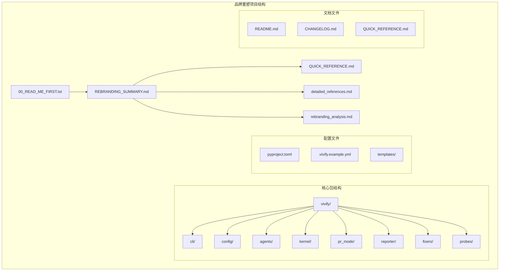
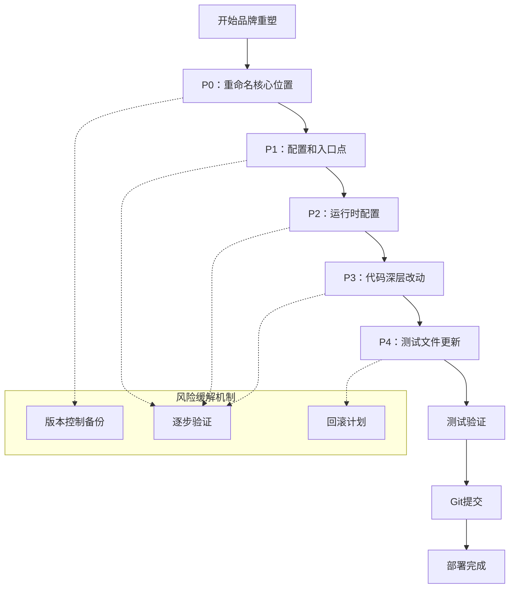
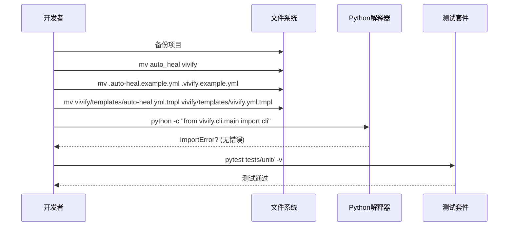
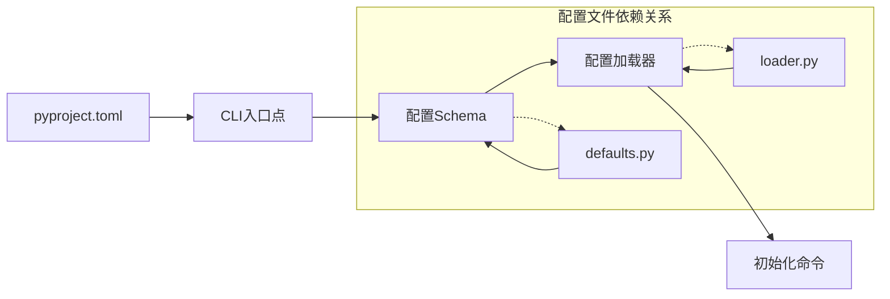
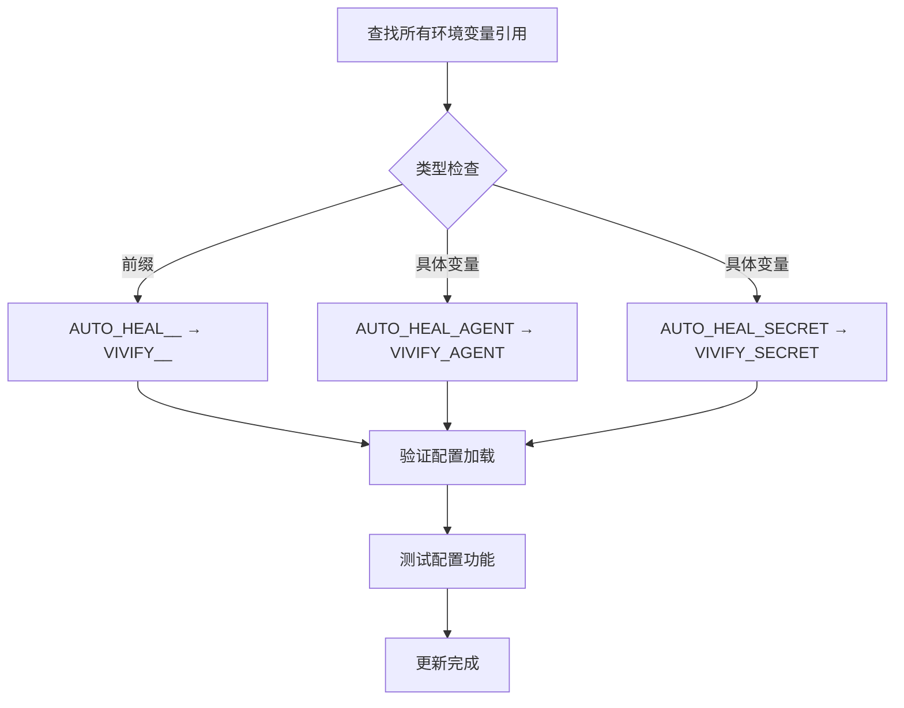
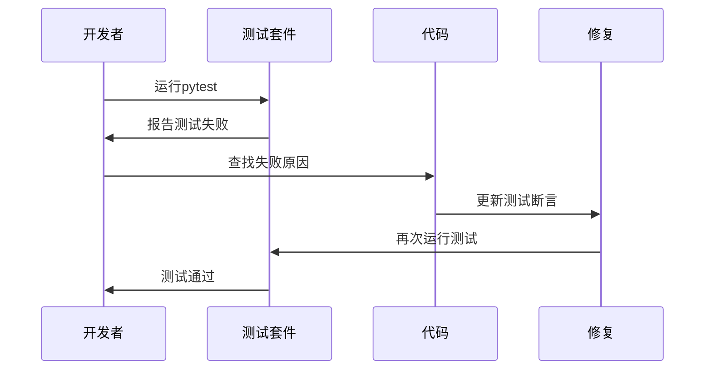
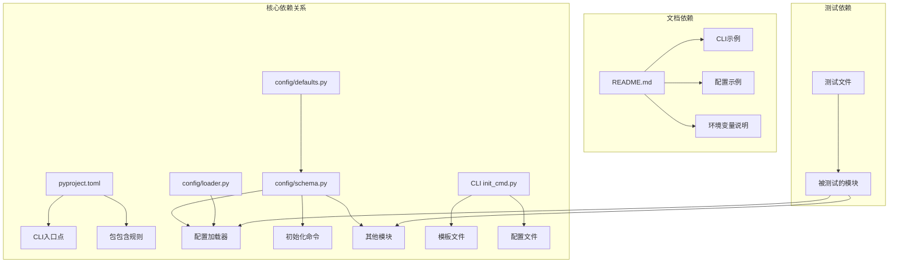

# 优先级分类管理

<cite>
**本文档引用的文件**
- [00_READ_ME_FIRST.txt](file://00_READ_ME_FIRST.txt)
- [QUICK_REFERENCE.md](file://QUICK_REFERENCE.md)
- [REBRANDING_SUMMARY.md](file://REBRANDING_SUMMARY.md)
- [detailed_references.md](file://detailed_references.md)
- [rebranding_analysis.md](file://rebranding_analysis.md)
</cite>

## 目录
1. [简介](#简介)
2. [项目结构](#项目结构)
3. [核心组件](#核心组件)
4. [架构概览](#架构概览)
5. [详细组件分析](#详细组件分析)
6. [依赖关系分析](#依赖关系分析)
7. [性能考虑](#性能考虑)
8. [故障排除指南](#故障排除指南)
9. [结论](#结论)

## 简介

本文档为Vivify品牌重塑项目提供了系统性的优先级分类管理方案。该项目需要从"auto-heal"完全改名为"vivify"，涉及477处grep匹配的代码引用、3个主要文件/目录重命名位置以及大量的配置和文档更新。

根据项目调研结果，我将改造任务分为五个优先级类别（P0-P4），每个类别都有明确的处理策略、风险评估和执行顺序建议。

## 项目结构

Vivify品牌重塑项目采用模块化的组织结构，包含以下主要组件：



**图表来源**
- [REBRANDING_SUMMARY.md:14-144](file://REBRANDING_SUMMARY.md#L14-L144)
- [rebranding_analysis.md:14-31](file://rebranding_analysis.md#L14-L31)

**章节来源**
- [REBRANDING_SUMMARY.md:12-144](file://REBRANDING_SUMMARY.md#L12-L144)
- [00_READ_ME_FIRST.txt:115-145](file://00_READ_ME_FIRST.txt#L115-L145)

## 核心组件

### P0类别（必须重命名的3处位置）

P0类别是最关键的重命名操作，直接影响项目的可运行性：

**必须重命名的位置：**
- `auto_heal/` → `vivify/`（主Python包目录）
- `.auto-heal.example.yml` → `.vivify.example.yml`（示例配置文件）
- `auto_heal/templates/auto-heal.yml.tmpl` → `vivify/templates/vivify.yml.tmpl`（配置模板文件）

**处理策略：**
1. **立即执行**：这3个重命名操作必须最先完成
2. **原子操作**：使用mv命令一次性重命名，避免部分重命名导致的导入错误
3. **验证检查**：重命名后立即验证包导入是否正常

**风险评估：**
- 风险等级：高
- 影响范围：所有Python导入语句失效
- 缓解措施：确保重命名顺序正确，完成后立即运行导入测试

**章节来源**
- [REBRANDING_SUMMARY.md:43-51](file://REBRANDING_SUMMARY.md#L43-L51)
- [00_READ_ME_FIRST.txt:14-17](file://00_READ_ME_FIRST.txt#L14-L17)

### P1类别（配置和入口点）

P1类别包含7个关键配置文件的更新：

**需要更新的关键配置：**
- `pyproject.toml`（7个字段）
- `auto_heal/config/schema.py`（11处）
- `auto_heal/config/defaults.py`（3处）
- `auto_heal/config/loader.py`（5处）
- `auto_heal/cli/main.py`（3处）
- `auto_heal/cli/__main__.py`（1处）
- `auto_heal/cli/init_cmd.py`（13处）

**处理策略：**
1. **按优先级执行**：先更新pyproject.toml，再更新配置schema，最后更新CLI
2. **逐行对照**：使用detailed_references.md中的行号对应表进行精确修改
3. **配置验证**：每次修改后验证配置加载功能

**风险评估：**
- 风险等级：中高
- 影响范围：CLI入口点、配置加载、环境变量前缀
- 缓解措施：使用版本控制，逐个文件验证

**章节来源**
- [REBRANDING_SUMMARY.md:53-64](file://REBRANDING_SUMMARY.md#L53-L64)
- [detailed_references.md:17-115](file://detailed_references.md#L17-L115)

### P2类别（运行时配置）

P2类别包含运行时相关的配置文件：

**需要更新的运行时相关文件：**
- `.gitignore`（3处路径）
- 模板文件（`GOALS.md.tmpl`, `pr_template.md.tmpl`）
- README.md（全文替换）
- CHANGELOG.md（可选更新）

**处理策略：**
1. **批量替换**：使用sed命令进行批量字符串替换
2. **模板更新**：更新所有模板文件中的品牌名称
3. **文档统一**：确保README.md中的所有示例都反映新名称

**风险评估：**
- 风险等级：中
- 影响范围：用户可见的配置、模板、文档
- 缓解措施：备份原始文件，使用grep验证替换结果

**章节来源**
- [REBRANDING_SUMMARY.md:65-73](file://REBRANDING_SUMMARY.md#L65-L73)
- [detailed_references.md:244-254](file://detailed_references.md#L244-L254)

### P3类别（代码深层改动）

P3类别包含代码层面的深层更改：

**需要更新的代码逻辑：**
- 环境变量前缀：`AUTO_HEAL__` → `VIVIFY__`
- 环境变量：`AUTO_HEAL_AGENT` → `VIVIFY_AGENT`
- 环境变量：`AUTO_HEAL_SECRET` → `VIVIFY_SECRET`
- PR标签：`auto-heal:*` → `vivify:*`
- 分支前缀：`auto-heal/` → `vivify/`
- 日志文件：`auto-heal.log` → `vivify.log`
- 提交消息前缀：`auto-heal:` → `vivify:`
- 临时文件：`/tmp/auto_heal_*` → `/tmp/vivify_*`

**处理策略：**
1. **分类批量替换**：按类型分组使用sed命令进行批量替换
2. **正则表达式精确匹配**：避免误替换其他代码
3. **测试验证**：运行测试套件确保所有引用都被正确更新

**风险评估：**
- 风险等级：中
- 影响范围：环境变量、PR系统、日志记录
- 缓解措施：使用grep验证替换结果，运行完整测试

**章节来源**
- [REBRANDING_SUMMARY.md:74-86](file://REBRANDING_SUMMARY.md#L74-L86)
- [detailed_references.md:140-232](file://detailed_references.md#L140-L232)

### P4类别（测试文件更新）

P4类别包含测试相关的文件更新：

**需要更新的测试用例：**
- `tests/unit/test_pr_mode.py`
- `tests/unit/test_self_grow_guard.py`
- `tests/unit/test_yaml_probe.py`
- 所有标签和路径引用

**处理策略：**
1. **测试驱动**：先运行现有测试，识别需要更新的测试用例
2. **逐个修复**：按照测试失败提示逐一修复测试断言
3. **回归验证**：确保所有测试用例都能通过

**风险评估：**
- 风险等级：中
- 影响范围：测试覆盖率、持续集成
- 缓解措施：保持测试用例与实际功能一致

**章节来源**
- [REBRANDING_SUMMARY.md:87-95](file://REBRANDING_SUMMARY.md#L87-L95)
- [detailed_references.md:257-271](file://detailed_references.md#L257-L271)

## 架构概览

品牌重塑的执行架构采用分阶段、分优先级的策略：



**图表来源**
- [REBRANDING_SUMMARY.md:146-258](file://REBRANDING_SUMMARY.md#L146-L258)
- [QUICK_REFERENCE.md:13-16](file://QUICK_REFERENCE.md#L13-L16)

## 详细组件分析

### P0类别详细分析

P0类别的三个重命名操作是整个品牌重塑的基础：



**图表来源**
- [REBRANDING_SUMMARY.md:148-162](file://REBRANDING_SUMMARY.md#L148-L162)
- [QUICK_REFERENCE.md:183-210](file://QUICK_REFERENCE.md#L183-L210)

**处理顺序建议：**
1. **第一阶段**：创建项目备份
2. **第二阶段**：重命名主包目录
3. **第三阶段**：重命名配置文件
4. **第四阶段**：重命名模板文件
5. **第五阶段**：验证导入功能

**风险评估：**
- **最高风险**：导入错误导致的运行时异常
- **缓解措施**：立即验证Python导入，确保所有from auto_heal语句都已更新

### P1类别详细分析

P1类别的配置更新需要严格按照依赖关系执行：



**图表来源**
- [REBRANDING_SUMMARY.md:176-193](file://REBRANDING_SUMMARY.md#L176-L193)
- [detailed_references.md:17-115](file://detailed_references.md#L17-L115)

**处理顺序建议：**
1. **pyproject.toml**：首先更新包元数据和入口点
2. **config/schema.py**：更新配置默认值和路径
3. **config/defaults.py**：更新默认gitignore条目
4. **config/loader.py**：更新环境变量前缀
5. **CLI文件**：最后更新所有CLI相关文件

**风险评估：**
- **主要风险**：CLI入口点配置错误导致命令不可用
- **缓解措施**：每次更新后立即测试CLI功能

### P2类别详细分析

P2类别的运行时配置更新采用批量处理策略：

**批量替换策略：**
```bash
# 路径替换
find . -name "*.py" -o -name "*.yml" -o -name "*.md" | xargs sed -i '' 's/\.auto-heal/\.vivify/g'

# 标签替换
find . -name "*.py" | xargs sed -i '' "s/\"auto-heal\"/\"vivify\"/g"

# 分支前缀替换
find . -name "*.py" | xargs sed -i '' 's/auto-heal\//vivify\//g'

# 环境变量前缀替换
find . -name "*.py" | xargs sed -i '' 's/AUTO_HEAL__/VIVIFY__/g'
```

**风险评估：**
- **风险等级**：中
- **主要关注**：正则表达式可能导致意外替换
- **缓解措施**：使用grep验证替换结果，逐个文件检查

### P3类别详细分析

P3类别的深层代码改动需要精确的字符串匹配：

**环境变量替换流程：**


**图表来源**
- [detailed_references.md:140-149](file://detailed_references.md#L140-L149)
- [QUICK_REFERENCE.md:32-67](file://QUICK_REFERENCE.md#L32-L67)

**处理策略：**
1. **分类处理**：按环境变量类型分组处理
2. **精确匹配**：使用正则表达式避免误替换
3. **功能验证**：测试配置加载和环境变量解析

### P4类别详细分析

P4类别的测试更新采用测试驱动的方法：

**测试更新流程：**


**图表来源**
- [REBRANDING_SUMMARY.md:222-236](file://REBRANDING_SUMMARY.md#L222-L236)
- [detailed_references.md:257-271](file://detailed_references.md#L257-L271)

**处理策略：**
1. **识别失败**：运行测试套件找出所有失败的测试
2. **定位问题**：查看测试失败的具体原因
3. **修复断言**：更新测试中的字符串断言
4. **验证修复**：确保测试能够通过

## 依赖关系分析

品牌重塑项目中的文件间依赖关系如下：



**图表来源**
- [REBRANDING_SUMMARY.md:119-143](file://REBRANDING_SUMMARY.md#L119-L143)
- [detailed_references.md:17-115](file://detailed_references.md#L17-L115)

**依赖关系特点：**
- **单向依赖**：配置文件通常依赖于schema定义
- **循环依赖避免**：通过模块化设计避免循环导入
- **文档独立性**：README.md相对独立，主要依赖CLI示例

## 性能考虑

品牌重塑的性能影响主要体现在以下几个方面：

### 时间成本分析
- **总耗时**：1.5-2小时（包括自动化和手动审查）
- **自动化部分**：约10分钟（sed批量替换）
- **手动审查**：约30分钟（关键配置文件）
- **测试验证**：约15分钟
- **文档更新**：约15分钟
- **Git操作**：约5分钟

### 并行处理机会
- **文件重命名**：可以在不同终端并行执行
- **批量替换**：sed命令可以并行处理不同类型文件
- **测试验证**：可以在配置更新完成后并行运行

## 故障排除指南

### 常见问题及解决方案

| 问题类型 | 症状 | 原因 | 解决方案 |
|---------|------|------|---------|
| ImportError | "No module named 'vivify'" | 包目录未重命名 | 检查vivify/目录是否存在 |
| CLI不可用 | "vivify: command not found" | CLI入口点未更新 | 检查pyproject.toml中的entry_points |
| 配置加载失败 | 环境变量未生效 | 环境变量前缀未更新 | 检查config/loader.py中的_ENV_PREFIX |
| 测试失败 | 测试中仍有旧名称 | 测试文件未更新 | 运行grep -r "auto-heal" tests/查找 |
| 导入错误 | ImportError: cannot import name | 导入路径未更新 | 检查所有from auto_heal导入语句 |

### 验证清单

**执行前检查：**
- [ ] 已创建项目备份
- [ ] 已检查所有文件权限
- [ ] 已准备回滚计划

**执行后检查：**
- [ ] Python导入测试通过
- [ ] CLI功能正常
- [ ] 配置加载正常
- [ ] 所有测试通过
- [ ] README文档更新完成

**章节来源**
- [QUICK_REFERENCE.md:214-224](file://QUICK_REFERENCE.md#L214-L224)
- [REBRANDING_SUMMARY.md:261-275](file://REBRANDING_SUMMARY.md#L261-L275)

## 结论

Vivify品牌重塑项目通过五级优先级分类管理，实现了从概念到执行的系统化改造方案。P0-P4类别的明确划分确保了改造工作的有序性和可控性。

### 关键成功因素

1. **严格的优先级管理**：P0类别的3个重命名操作确保了项目的基础稳定性
2. **分阶段执行策略**：从配置到代码再到测试的渐进式更新
3. **完善的验证机制**：每个阶段都有相应的验证和回滚措施
4. **详细的文档支持**：完整的参考文档和验证清单

### 建议的最佳实践

1. **遵循既定顺序**：严格按照P0→P1→P2→P3→P4的顺序执行
2. **使用版本控制**：每个阶段完成后及时提交版本
3. **充分测试验证**：每个关键步骤都要进行功能测试
4. **保持文档同步**：确保所有文档都与代码更新保持一致

通过这种系统化的优先级管理方法，Vivify品牌重塑项目能够在保证质量的前提下高效完成所有必要的改造工作。