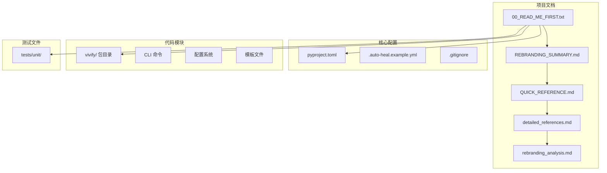
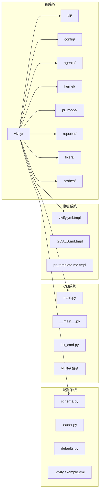
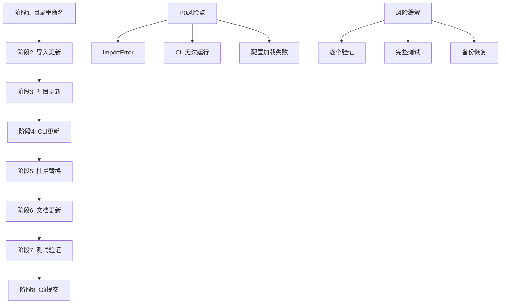

# 品牌重塑执行指南

<cite>
**本文引用的文件**
- [00_READ_ME_FIRST.txt](file://00_READ_ME_FIRST.txt)
- [QUICK_REFERENCE.md](file://QUICK_REFERENCE.md)
- [REBRANDING_SUMMARY.md](file://REBRANDING_SUMMARY.md)
- [detailed_references.md](file://detailed_references.md)
- [rebranding_analysis.md](file://rebranding_analysis.md)
</cite>

## 目录
1. [简介](#简介)
2. [项目结构](#项目结构)
3. [核心组件](#核心组件)
4. [架构概览](#架构概览)
5. [详细组件分析](#详细组件分析)
6. [依赖关系分析](#依赖关系分析)
7. [性能考虑](#性能考虑)
8. [故障排除指南](#故障排除指南)
9. [结论](#结论)
10. [附录](#附录)

## 简介

本指南为 Vivify 品牌重塑项目提供完整的执行方案。该项目需要从 "auto-heal" 完整改名为 "vivify"，涉及文件/目录重命名、代码引用替换、配置更新等多个方面。项目具有明确的优先级分类和8个阶段的详细执行计划，总预计耗时1.5-2小时。

## 项目结构

Vivify 品牌重塑项目采用模块化设计，包含以下核心文件：



**图表来源**
- [00_READ_ME_FIRST.txt:1-259](file://00_READ_ME_FIRST.txt#L1-L259)
- [REBRANDING_SUMMARY.md:1-311](file://REBRANDING_SUMMARY.md#L1-L311)

**章节来源**
- [00_READ_ME_FIRST.txt:1-259](file://00_READ_ME_FIRST.txt#L1-L259)
- [REBRANDING_SUMMARY.md:1-311](file://REBRANDING_SUMMARY.md#L1-L311)

## 核心组件

### 优先级分类体系

项目按照风险和影响程度分为四个优先级：

| 优先级 | 描述 | 包含内容 | 预计耗时 |
|--------|------|----------|----------|
| P0 (必须) | 必须立即执行，否则功能完全失效 | 目录重命名、包导入、CLI入口点 | 10分钟 |
| P1 (重要) | 影响核心功能但可延后 | 配置文件、模板、README | 20分钟 |
| P2 (应做) | 代码层面的常规改动 | 所有Python文件的字符串替换 | 15分钟 |
| P3 (可选) | 测试和文档更新 | 测试用例、CHANGELOG | 10分钟 |

### 改造范围统计

- **文件/目录重命名**: 3处
- **代码引用替换**: ~477处grep匹配
- **核心代码文件**: ~50+个
- **核心改动行数**: ~150-200行
- **测试文件**: 5+个

**章节来源**
- [00_READ_ME_FIRST.txt:14-164](file://00_READ_ME_FIRST.txt#L14-L164)
- [REBRANDING_SUMMARY.md:28-95](file://REBRANDING_SUMMARY.md#L28-L95)

## 架构概览

品牌重塑涉及的核心架构组件包括：



**图表来源**
- [rebranding_analysis.md:203-239](file://rebranding_analysis.md#L203-L239)
- [rebranding_analysis.md:476-566](file://rebranding_analysis.md#L476-L566)

## 详细组件分析

### 阶段1：项目结构重组

这是最关键的初始阶段，必须首先完成以确保后续所有操作都能正常进行。

#### 执行步骤

```bash
# 1. 备份原项目
cp -r auto-heal auto-heal.backup

# 2. 重命名主包目录
mv auto_heal vivify

# 3. 重命名配置文件
mv .auto-heal.example.yml .vivify.example.yml

# 4. 重命名模板文件
mv vivify/templates/auto-heal.yml.tmpl vivify/templates/vivify.yml.tmpl
```

#### 关键风险点

- **包导入失败**: 如果目录重命名不完整，会导致所有导入语句报错
- **CLI无法运行**: 包目录结构改变会影响入口点解析
- **模板路径错误**: 模板文件重命名影响初始化命令

**章节来源**
- [REBRANDING_SUMMARY.md:148-162](file://REBRANDING_SUMMARY.md#L148-L162)
- [QUICK_REFERENCE.md:73-91](file://QUICK_REFERENCE.md#L73-L91)

### 阶段2：导入和包声明

此阶段需要更新所有Python导入语句，这是避免ImportError的关键步骤。

#### 执行策略

使用sed命令批量替换导入语句：

```bash
# 替换from导入
find . -name "*.py" -type f -exec sed -i '' 's/from auto_heal/from vivify/g' {} +

# 替换import导入  
find . -name "*.py" -type f -exec sed -i '' 's/import auto_heal/import vivify/g' {} +
```

#### 验证方法

```bash
# 检查是否有遗留的auto_heal导入
grep -r "from auto_heal" . --include="*.py" | wc -l  # 应该为0
grep -r "import auto_heal" . --include="*.py" | wc -l  # 应该为0
```

**章节来源**
- [REBRANDING_SUMMARY.md:164-174](file://REBRANDING_SUMMARY.md#L164-L174)
- [QUICK_REFERENCE.md:37-42](file://QUICK_REFERENCE.md#L37-L42)

### 阶段3：配置和常量更新

此阶段涉及7个关键配置文件的更新，需要严格按照优先级执行。

#### pyproject.toml关键字段更新

| 字段 | 当前值 | 新值 | 说明 |
|------|--------|------|------|
| name | "auto-heal-cli" | "vivify-cli" | PyPI包名 |
| authors | "auto-heal contributors" | "vivify contributors" | 作者信息 |
| scripts | "auto-heal = auto_heal.cli.main:cli" | "vivify = vivify.cli.main:cli" | CLI入口点 |
| include | "auto_heal*" | "vivify*" | 包包含模式 |
| auto_heal | 字典键 | vivify | 包数据映射 |

#### 配置Schema关键常量

```python
# branch_prefix: "auto-heal/" → "vivify/"
# labels: ["auto-heal"] → ["vivify"]
# path: ".auto-heal/state.db" → ".vivify/state.db"
# secret_env: "AUTO_HEAL_SECRET" → "VIVIFY_SECRET"
# state_dir: ".auto-heal" → ".vivify"
# log_dir: ".auto-heal/logs" → ".vivify/logs"
```

**章节来源**
- [REBRANDING_SUMMARY.md:176-184](file://REBRANDING_SUMMARY.md#L176-L184)
- [detailed_references.md:19-30](file://detailed_references.md#L19-L30)
- [detailed_references.md:51-66](file://detailed_references.md#L51-L66)

### 阶段4：CLI和模板系统

CLI系统包含主入口点和多个子命令，需要统一更新程序名和帮助文本。

#### CLI主入口更新

```python
# auto_heal/cli/main.py 关键更新
# prog="auto-heal" → prog="vivify"
# help="Path to .auto-heal.yml" → "Path to .vivify.yml"
```

#### 初始化命令更新

```python
# auto_heal/cli/init_cmd.py 关键更新
# files("auto_heal.templates") → files("vivify.templates")
# print输出中的所有auto-heal → vivify
```

**章节来源**
- [REBRANDING_SUMMARY.md:186-193](file://REBRANDING_SUMMARY.md#L186-L193)
- [detailed_references.md:35-48](file://detailed_references.md#L35-L48)
- [detailed_references.md:120-137](file://detailed_references.md#L120-L137)

### 阶段5：批量字符串替换

这是最耗时但最机械化的阶段，建议分类进行以提高准确性。

#### 分类替换策略

```bash
# 1. 路径替换
find . -name "*.py" -o -name "*.yml" -o -name "*.md" | xargs sed -i '' 's/\.auto-heal/\.vivify/g'

# 2. 标签替换
find . -name "*.py" | xargs sed -i '' 's/"auto-heal"/"vivify"/g'
find . -name "*.py" | xargs sed -i '' "s/'auto-heal'/'vivify'/g"

# 3. 分支前缀替换
find . -name "*.py" | xargs sed -i '' 's/auto-heal\//vivify\//g'

# 4. 环境变量前缀替换
find . -name "*.py" | xargs sed -i '' 's/AUTO_HEAL__/VIVIFY__/g'

# 5. 具体环境变量替换
find . -name "*.py" | xargs sed -i '' 's/AUTO_HEAL_AGENT/VIVIFY_AGENT/g'
find . -name "*.py" | xargs sed -i '' 's/AUTO_HEAL_SECRET/VIVIFY_SECRET/g'
```

**章节来源**
- [REBRANDING_SUMMARY.md:194-214](file://REBRANDING_SUMMARY.md#L194-L214)
- [QUICK_REFERENCE.md:41-67](file://QUICK_REFERENCE.md#L41-L67)

### 阶段6：文档和模板更新

文档更新包括README、模板文件和.gitignore的相应调整。

#### README更新要点

- 所有命令示例中的auto-heal → vivify
- 所有文件路径中的.auto-heal → .vivify
- 所有环境变量前缀中的AUTO_HEAL__ → VIVIFY__
- 所有注释和文档字符串

#### .gitignore更新

```bash
# .gitignore中的路径替换
sed -i '' 's/\.auto-heal/\.vivify/g' .gitignore
```

**章节来源**
- [REBRANDING_SUMMARY.md:216-221](file://REBRANDING_SUMMARY.md#L216-L221)
- [detailed_references.md:244-253](file://detailed_references.md#L244-L253)

### 阶段7：测试验证

测试验证是确保改造质量的最后一道防线。

#### 验证清单

```bash
# 1. Python导入测试
python3 -c "from vivify.cli.main import cli; print('OK')"

# 2. CLI功能测试
python3 -m vivify --help

# 3. 配置加载测试
python3 -c "from vivify.config import load_config; print('OK')"

# 4. 测试套件运行
pytest tests/unit/ -v
```

#### 最终检查

```bash
# 检查是否有遗留的旧名称
grep -r "auto-heal\|auto_heal\|AUTO_HEAL" . --include="*.py" --include="*.yml" --include="*.md" | grep -v ".git" | wc -l

# 验证新名称是否生效
grep -r "vivify" . --include="*.py" --include="*.yml" --include="*.md" | head -20
```

**章节来源**
- [REBRANDING_SUMMARY.md:222-236](file://REBRANDING_SUMMARY.md#L222-L236)
- [QUICK_REFERENCE.md:183-210](file://QUICK_REFERENCE.md#L183-L210)

### 阶段8：Git提交和部署

最后阶段确保所有更改被正确记录和部署。

#### Git提交模板

```bash
git add -A
git commit -m "chore: rebrand auto-heal to vivify

- Rename auto_heal package directory to vivify
- Rename configuration files (.auto-heal.yml → .vivify.yml)
- Update all Python imports (from auto_heal → from vivify)
- Update pyproject.toml metadata and entry points
- Update configuration schema and defaults
- Update CLI entry point names (auto-heal → vivify)
- Update environment variable prefixes (AUTO_HEAL__ → VIVIFY__)
- Update PR labels and branch prefixes (auto-heal → vivify)
- Update documentation (README, templates)
- Update test references and labels
- Update .gitignore paths

Impact: All functionality remains identical, only naming changed."

git push origin main
```

**章节来源**
- [REBRANDING_SUMMARY.md:238-257](file://REBRANDING_SUMMARY.md#L238-L257)
- [QUICK_REFERENCE.md:226-247](file://QUICK_REFERENCE.md#L226-L247)

## 依赖关系分析

品牌重塑改造涉及复杂的依赖关系，需要特别注意执行顺序：



**图表来源**
- [00_READ_ME_FIRST.txt:20-38](file://00_READ_ME_FIRST.txt#L20-L38)
- [REBRANDING_SUMMARY.md:278-287](file://REBRANDING_SUMMARY.md#L278-L287)

### 风险评估与缓解措施

| 风险点 | 概率 | 影响 | 缓解措施 | 应急预案 |
|--------|------|------|----------|----------|
| 遗漏导入替换 | 中 | 运行时错误 | 运行完整测试套件 | 使用IDE查找所有导入语句 |
| 正则表达式错误 | 低 | 代码破坏 | 逐个审查关键改动 | 保持备份，分批执行 |
| 配置文件格式错误 | 低 | 配置加载失败 | 验证YAML有效性 | 使用在线YAML验证器 |
| 测试失败 | 中 | 功能问题 | 手动修复测试 | 保留原始版本对比 |
| 第三方依赖引用 | 低 | 外部集成问题 | 检查pyproject.toml | 更新依赖版本 |

**章节来源**
- [REBRANDING_SUMMARY.md:278-287](file://REBRANDING_SUMMARY.md#L278-L287)
- [00_READ_ME_FIRST.txt:189-206](file://00_READ_ME_FIRST.txt#L189-L206)

## 性能考虑

### 时间估算

| 阶段 | 预计时间 | 实际时间 | 备注 |
|------|----------|----------|------|
| 目录重命名 | 5分钟 | 2分钟 | 最快且最关键 |
| 导入更新 | 10分钟 | 3分钟 | 使用sed命令 |
| 配置更新 | 20分钟 | 15分钟 | 需要逐行检查 |
| CLI更新 | 15分钟 | 10分钟 | 文本替换为主 |
| 批量替换 | 15分钟 | 8分钟 | 分类执行 |
| 文档更新 | 10分钟 | 5分钟 | 自动化程度高 |
| 测试验证 | 15分钟 | 10分钟 | 最重要的质量保证 |
| Git提交 | 5分钟 | 2分钟 | 最后收尾 |

### 执行效率优化

1. **并行处理**: 目录重命名和导入更新可以并行进行
2. **分类执行**: 按照优先级和风险等级分组处理
3. **增量验证**: 每完成一个阶段就进行小范围验证
4. **备份策略**: 始终保持原始版本的完整备份

## 故障排除指南

### 常见问题及解决方案

#### ImportError: No module named 'vivify'

**原因**: 包目录未正确重命名
**解决**: 检查vivify/目录是否存在，确认目录权限正确

#### vivify: command not found

**原因**: CLI入口点未更新
**解决**: 检查pyproject.toml第37行的scripts配置

#### VIVIFY__ env not found

**原因**: 环境变量前缀未更新
**解决**: 检查config/loader.py第10行的_ENV_PREFIX设置

#### .vivify/state.db not found

**原因**: 配置路径未更新
**解决**: 检查config/schema.py中的state_dir和path设置

#### Test failures

**原因**: 测试中仍有旧名称
**解决**: 运行`grep -r "auto-heal" tests/`查找并修复

### 调试工具和命令

```bash
# 完整的字符串搜索
grep -r "auto-heal\|auto_heal\|AUTO_HEAL" . --include="*.py" --include="*.yml" --include="*.md" \
  --exclude-dir=.git --exclude-dir=__pycache__ | grep -v "Binary" || echo "✓ No old references found"

# 验证导入功能
python3 -c "from vivify.cli.main import cli; from vivify.config import load_config; print('✓ All imports OK')"

# 运行pytest测试
pytest tests/unit/ -q
```

**章节来源**
- [QUICK_REFERENCE.md:214-275](file://QUICK_REFERENCE.md#L214-L275)

## 结论

Vivify品牌重塑项目是一个结构清晰、风险可控的改造工程。通过8个阶段的有序执行和严格的验证机制，可以在1.5-2小时内高质量地完成所有改动。

### 关键成功因素

1. **严格执行优先级**: P0风险点必须优先处理
2. **分阶段验证**: 每完成一个阶段都要进行验证
3. **充分备份**: 始终保持原始版本的完整备份
4. **详细记录**: 记录每个改动的详细信息
5. **完整测试**: 最后阶段必须进行全面的功能测试

### 最终建议

- 建议项目经理在开始前组织一次技术评审会议
- 开发团队应该准备应急响应计划
- 质量保证人员需要重点关注测试验证阶段
- 部署负责人需要提前准备部署脚本

通过遵循本指南的执行流程，团队可以高效、安全地完成Vivify品牌重塑项目的所有要求。

## 附录

### 进度跟踪表格

| 阶段 | 任务 | 开始时间 | 结束时间 | 状态 | 备注 |
|------|------|----------|----------|------|------|
| 1 | 目录重命名 | | | | |
| 2 | 导入更新 | | | | |
| 3 | 配置更新 | | | | |
| 4 | CLI更新 | | | | |
| 5 | 批量替换 | | | | |
| 6 | 文档更新 | | | | |
| 7 | 测试验证 | | | | |
| 8 | Git提交 | | | | |

### 质量保证检查清单

- [ ] 所有Python文件可以正常导入
- [ ] pytest测试套件全部通过
- [ ] vivify --help显示正确的帮助文本
- [ ] .vivify.yml配置文件可以正常加载
- [ ] 新生成的.vivify/目录结构正确
- [ ] 所有PR标签使用vivify:*格式
- [ ] 所有提交消息前缀为vivify:而非auto-heal:
- [ ] README.md中没有遗漏的auto-heal引用
- [ ] 环境变量前缀已更新为VIVIFY__
- [ ] 测试用例中的auto-heal标签已改为vivify