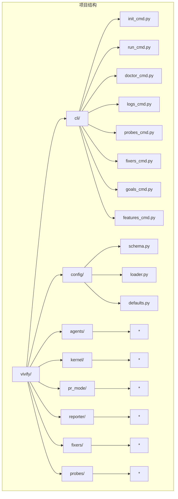
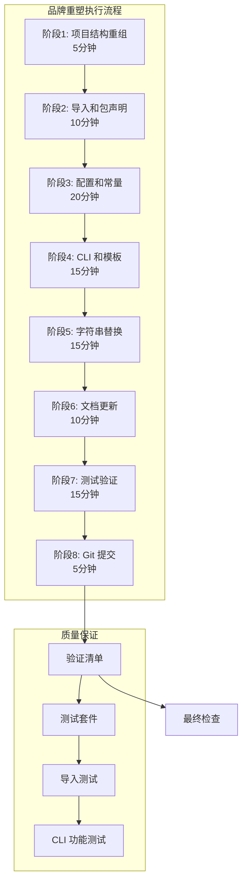
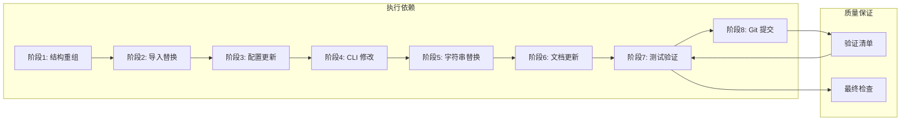

# 执行阶段分解

<cite>
**本文档引用的文件**
- [00_READ_ME_FIRST.txt](file://00_READ_ME_FIRST.txt)
- [QUICK_REFERENCE.md](file://QUICK_REFERENCE.md)
- [REBRANDING_SUMMARY.md](file://REBRANDING_SUMMARY.md)
- [detailed_references.md](file://detailed_references.md)
- [rebranding_analysis.md](file://rebranding_analysis.md)
</cite>

## 目录
1. [简介](#简介)
2. [项目结构](#项目结构)
3. [核心组件](#核心组件)
4. [架构概览](#架构概览)
5. [详细组件分析](#详细组件分析)
6. [依赖分析](#依赖分析)
7. [性能考虑](#性能考虑)
8. [故障排除指南](#故障排除指南)
9. [结论](#结论)
10. [附录](#附录)

## 简介

本文档为 Vivify 品牌重塑项目提供了详细的执行阶段分解，基于项目现有的调研报告和参考文档。项目需要从 "auto-heal" 完整改名为 "vivify"，涉及文件/目录重命名、代码引用替换、配置更新等多个方面。

根据现有文档，项目已经完成了全面的调研和准备工作，包含了详细的执行计划、时间估算和质量保证方法。本文档将基于这些现有材料，提供更加结构化的执行指导。

## 项目结构

基于现有文档分析，Vivify 项目采用模块化架构，主要包含以下核心组件：



**图表来源**
- [REBRANDING_SUMMARY.md:131-143](file://REBRANDING_SUMMARY.md#L131-L143)
- [detailed_references.md:35-48](file://detailed_references.md#L35-L48)

**章节来源**
- [REBRANDING_SUMMARY.md:100-143](file://REBRANDING_SUMMARY.md#L100-L143)
- [detailed_references.md:17-115](file://detailed_references.md#L17-L115)

## 核心组件

### 主要文件分类

根据调研报告，项目需要处理的主要文件类别如下：

| 文件类别 | 数量 | 说明 |
|---------|------|------|
| 配置相关 | 7+ 个 | pyproject.toml, config files, defaults |
| CLI 相关 | 9+ 个 | 主命令和子命令文件 |
| 核心模块 | 15+ 个 | agents, kernel, pr_mode, reporter 等 |
| 文档和测试 | 10+ 个 | README.md, CHANGELOG.md, tests |

### 关键数据指标

- **总改动位置**: ~477 处 grep 匹配
- **需要改动的行数**: ~150-200 行
- **需要重命名的文件/目录**: 3 个主要位置
- **预计总耗时**: 1.5-2 小时

**章节来源**
- [REBRANDING_SUMMARY.md:28-95](file://REBRANDING_SUMMARY.md#L28-L95)
- [00_READ_ME_FIRST.txt:118-144](file://00_READ_ME_FIRST.txt#L118-L144)

## 架构概览

### 品牌重塑架构图



**图表来源**
- [REBRANDING_SUMMARY.md:146-257](file://REBRANDING_SUMMARY.md#L146-L257)

### 执行时间分配

| 阶段 | 时间估算 | 内容 |
|------|----------|------|
| 阶段1 | 5分钟 | 项目结构重组（目录重命名、文件重命名） |
| 阶段2 | 10分钟 | 导入和包声明替换 |
| 阶段3 | 20分钟 | 配置和常量更新 |
| 阶段4 | 15分钟 | CLI 和模板修改 |
| 阶段5 | 15分钟 | 批量字符串替换 |
| 阶段6 | 10分钟 | 文档更新 |
| 阶段7 | 15分钟 | 测试验证 |
| 阶段8 | 5分钟 | Git 提交 |

**章节来源**
- [REBRANDING_SUMMARY.md:298-306](file://REBRANDING_SUMMARY.md#L298-L306)

## 详细组件分析

### 阶段1: 项目结构重组 (5分钟)

#### 执行步骤

1. **备份原项目**
   ```bash
   cp -r auto-heal auto-heal.backup
   ```

2. **重命名主包目录**
   ```bash
   mv auto_heal vivify
   ```

3. **重命名配置文件**
   ```bash
   mv .auto-heal.example.yml .vivify.example.yml
   ```

4. **重命名模板文件**
   ```bash
   mv vivify/templates/auto-heal.yml.tmpl vivify/templates/vivify.yml.tmpl
   ```

#### 操作要点

- **优先级**: P0（必须）
- **影响范围**: 所有 Python 导入语句
- **风险控制**: 确保备份后再执行重命名操作

#### 常见问题

- **问题**: 目录重命名后导入失败
  **解决**: 确认所有 Python 导入语句都已更新为 `from vivify` 而非 `from auto_heal`

**章节来源**
- [REBRANDING_SUMMARY.md:148-162](file://REBRANDING_SUMMARY.md#L148-L162)
- [QUICK_REFERENCE.md:73-91](file://QUICK_REFERENCE.md#L73-L91)

### 阶段2: 导入和包声明 (10分钟)

#### 执行步骤

1. **替换导入语句**
   ```bash
   find . -name "*.py" -type f -exec sed -i '' 's/from auto_heal/from vivify/g' {} +
   find . -name "*.py" -type f -exec sed -i '' 's/import auto_heal/import vivify/g' {} +
   ```

2. **验证替换结果**
   ```bash
   grep -r "from auto_heal" . --include="*.py" | wc -l  # 应该为 0
   grep -r "import auto_heal" . --include="*.py" | wc -l  # 应该为 0
   ```

#### 操作要点

- **工具选择**: 使用 IDE 的 Find & Replace 功能或 sed 命令
- **验证方法**: 确保没有遗留的 `auto_heal` 导入语句
- **时间估算**: 10分钟

#### 常见问题

- **问题**: 部分导入语句未被替换
  **解决**: 手动检查 `detailed_references.md` 中的行号对应表

**章节来源**
- [REBRANDING_SUMMARY.md:164-174](file://REBRANDING_SUMMARY.md#L164-L174)
- [QUICK_REFERENCE.md:36-40](file://QUICK_REFERENCE.md#L36-L40)

### 阶段3: 配置和常量 (20分钟)

#### 执行步骤

按优先级依次修改关键配置文件：

1. **pyproject.toml (7处)**
   - 更新包名、作者信息、脚本入口点
   - 更新包含模式和包数据映射

2. **auto_heal/config/schema.py (11处)**
   - 更新分支前缀、标签默认值
   - 更新配置路径、环境变量前缀
   - 更新允许路径列表

3. **auto_heal/config/defaults.py (3处)**
   - 更新默认配置路径

4. **auto_heal/config/loader.py (5处)**
   - 更新环境变量前缀
   - 更新配置文件路径

#### 操作要点

- **参考依据**: 使用 `detailed_references.md` 中的行号对应表
- **验证方法**: 运行配置加载测试
- **时间估算**: 20分钟

#### 常见问题

- **问题**: 配置加载失败
  **解决**: 检查环境变量前缀是否已更新为 `VIVIFY__`

**章节来源**
- [REBRANDING_SUMMARY.md:176-184](file://REBRANDING_SUMMARY.md#L176-L184)
- [detailed_references.md:17-115](file://detailed_references.md#L17-L115)

### 阶段4: CLI 和模板 (15分钟)

#### 执行步骤

1. **更新 CLI 主入口**
   - 修改程序名、帮助文本
   - 更新配置文件路径

2. **更新 CLI 子命令**
   - 更新 init_cmd.py 中的模板导入路径
   - 更新其他子命令的路径引用

3. **更新模板文件**
   - 更新配置模板中的路径引用
   - 更新 README 模板中的命令示例

#### 操作要点

- **顺序要求**: 先更新主入口，再更新子命令
- **验证方法**: 运行 `python -m vivify --help`
- **时间估算**: 15分钟

#### 常见问题

- **问题**: CLI 命令不可用
  **解决**: 检查 pyproject.toml 中的脚本入口点配置

**章节来源**
- [REBRANDING_SUMMARY.md:186-193](file://REBRANDING_SUMMARY.md#L186-L193)
- [detailed_references.md:118-137](file://detailed_references.md#L118-L137)

### 阶段5: 字符串替换 (批量，15分钟)

#### 执行步骤

使用 sed 命令进行分类批量替换：

1. **替换配置路径**
   ```bash
   find . -name "*.py" -o -name "*.yml" -o -name "*.md" | xargs sed -i '' 's/\.auto-heal/\.vivify/g'
   ```

2. **替换标签**
   ```bash
   find . -name "*.py" | xargs sed -i '' "s/\"auto-heal\"/\"vivify\"/g"
   find . -name "*.py" | xargs sed -i '' "s/'auto-heal'/'vivify'/g"
   ```

3. **替换分支前缀**
   ```bash
   find . -name "*.py" | xargs sed -i '' 's/auto-heal\//vivify\//g'
   ```

4. **替换环境变量前缀**
   ```bash
   find . -name "*.py" | xargs sed -i '' 's/AUTO_HEAL__/VIVIFY__/g'
   ```

#### 操作要点

- **分类执行**: 按类型分别进行替换，避免误替换
- **验证方法**: 使用 grep 命令检查剩余的旧引用
- **时间估算**: 15分钟

#### 常见问题

- **问题**: 正则表达式替换错误
  **解决**: 逐个审查关键改动，必要时回滚并重新执行

**章节来源**
- [REBRANDING_SUMMARY.md:194-214](file://REBRANDING_SUMMARY.md#L194-L214)
- [QUICK_REFERENCE.md:32-67](file://QUICK_REFERENCE.md#L32-L67)

### 阶段6: 文档更新 (10分钟)

#### 执行步骤

1. **更新 README.md**
   - 替换所有 `auto-heal` 为 `vivify`
   - 更新命令行示例、路径引用

2. **更新 CHANGELOG.md**
   - 可选：添加品牌重塑变更记录

3. **更新 .gitignore**
   - 更新配置路径引用

#### 操作要点

- **完整性检查**: 确保所有文档中的 `auto-heal` 都已替换
- **时间估算**: 10分钟

#### 常见问题

- **问题**: 文档中遗漏的引用
  **解决**: 运行 grep 命令进行全面检查

**章节来源**
- [REBRANDING_SUMMARY.md:216-221](file://REBRANDING_SUMMARY.md#L216-L221)
- [detailed_references.md:235-254](file://detailed_references.md#L235-L254)

### 阶段7: 测试验证 (15分钟)

#### 执行步骤

1. **运行测试套件**
   ```bash
   pytest tests/unit/ -v
   ```

2. **验证 Python 导入**
   ```bash
   python -c "from vivify.cli.main import cli; print('OK')"
   ```

3. **验证 CLI 功能**
   ```bash
   python -m vivify --help
   ```

4. **验证配置加载**
   ```bash
   python -c "from vivify.config import load_config; print('OK')"
   ```

#### 操作要点

- **全面性**: 确保所有测试用例都通过
- **功能完整性**: 验证 CLI、配置、导入等功能
- **时间估算**: 15分钟

#### 常见问题

- **问题**: 测试失败
  **解决**: 检查测试用例中的 `auto-heal` 标签是否已更新

**章节来源**
- [REBRANDING_SUMMARY.md:222-236](file://REBRANDING_SUMMARY.md#L222-L236)
- [QUICK_REFERENCE.md:183-210](file://QUICK_REFERENCE.md#L183-L210)

### 阶段8: Git 提交 (5分钟)

#### 执行步骤

1. **添加所有更改**
   ```bash
   git add -A
   ```

2. **提交更改**
   ```bash
   git commit -m "chore: rebrand auto-heal to vivify
   - Rename auto_heal package to vivify
   - Update all imports and references
   - Update configuration files and templates
   - Update CLI command names and help text
   - Update environment variable prefixes
   - Update PR labels and branch prefixes
   - Update documentation and README
   - Update all test references"
   ```

3. **推送更改**
   ```bash
   git push origin main
   ```

#### 操作要点

- **提交信息**: 使用标准化的提交消息格式
- **推送策略**: 确保推送到正确的分支
- **时间估算**: 5分钟

#### 常见问题

- **问题**: 提交信息格式不规范
  **解决**: 参考提供的标准提交模板

**章节来源**
- [REBRANDING_SUMMARY.md:238-257](file://REBRANDING_SUMMARY.md#L238-L257)
- [QUICK_REFERENCE.md:226-247](file://QUICK_REFERENCE.md#L226-L247)

## 依赖分析

### 执行依赖关系



**图表来源**
- [REBRANDING_SUMMARY.md:146-257](file://REBRANDING_SUMMARY.md#L146-L257)

### 风险评估

| 风险点 | 概率 | 影响 | 缓解措施 |
|--------|------|------|---------|
| 遗漏某处导入 | 中 | 运行时错误 | 运行完整测试套件 |
| 正则表达式替换错误 | 低 | 代码破坏 | 逐个审查关键改动 |
| 配置文件格式错误 | 低 | 配置加载失败 | 验证 YAML 有效性 |
| 测试失败 | 中 | 功能问题 | 手动修复测试 |
| 第三方依赖引用 | 低 | 外部集成问题 | 检查 pyproject.toml |

**章节来源**
- [REBRANDING_SUMMARY.md:278-287](file://REBRANDING_SUMMARY.md#L278-L287)

## 性能考虑

### 执行效率优化

1. **并行处理**: 使用 `find` 命令的 `-exec` 选项并行处理多个文件
2. **增量验证**: 在每个阶段完成后立即进行验证
3. **备份策略**: 在执行任何破坏性操作前先创建备份
4. **工具选择**: 优先使用成熟的命令行工具如 `sed`、`grep`、`find`

### 时间管理建议

- **阶段划分**: 严格按照时间估算执行，避免超时
- **缓冲时间**: 为意外情况预留 10-15 分钟缓冲
- **质量优先**: 不要为了赶时间而跳过验证步骤

## 故障排除指南

### 常见问题及解决方案

#### 导入相关问题

| 问题 | 原因 | 解决方案 |
|------|------|---------|
| ImportError: No module named 'vivify' | 包目录未重命名 | 检查 `vivify/` 目录是否存在 |
| ImportError: No module named 'auto_heal' | 导入语句未更新 | 运行 `grep -r "auto_heal" . --include="*.py"` |

#### CLI 相关问题

| 问题 | 原因 | 解决方案 |
|------|------|---------|
| vivify: command not found | CLI 入口点未更新 | 检查 pyproject.toml 中的脚本配置 |
| CLI help 文本显示旧名称 | CLI 文件未更新 | 检查 `cli/main.py` 中的程序名 |

#### 配置相关问题

| 问题 | 原因 | 解决方案 |
|------|------|---------|
| VIVIFY__ env not found | 环境变量前缀未更新 | 检查 `config/loader.py` 中的前缀设置 |
| 配置文件加载失败 | 配置路径未更新 | 检查 `config/schema.py` 中的路径配置 |

#### 测试相关问题

| 问题 | 原因 | 解决方案 |
|------|------|---------|
| Test failures | 测试中仍有旧名称 | 运行 `grep -r "auto-heal" tests/` 并更新测试文件 |

### 最终验证清单

在最终提交前，请确认：

- [ ] 所有 Python 文件可以导入 (no ImportError)
- [ ] `pytest` 测试全部通过
- [ ] `vivify --help` 显示正确的帮助文本
- [ ] `.vivify.yml` 配置文件可以正常加载
- [ ] 新生成的 `.vivify/` 目录结构正确
- [ ] 所有 PR 标签使用 `vivify:*` 格式
- [ ] 所有提交消息前缀为 `vivify:` 而非 `auto-heal:`
- [ ] README.md 中没有遗漏的 `auto-heal` 引用
- [ ] 环境变量前缀已更新为 `VIVIFY__`
- [ ] 测试用例中的 `auto-heal` 标签已改为 `vivify`

**章节来源**
- [QUICK_REFERENCE.md:214-275](file://QUICK_REFERENCE.md#L214-L275)

## 结论

基于现有调研文档，Vivify 品牌重塑项目具有清晰的执行路线图和充分的准备工作。项目团队已经完成了全面的分析，包括：

1. **完整的调研报告**: 提供了详细的改动清单和执行建议
2. **时间估算**: 基于实际工作量的合理时间分配
3. **质量保证**: 完善的验证清单和检查方法
4. **风险评估**: 对潜在问题的识别和缓解措施

按照本文档的8个执行阶段，项目可以在 1.5-2 小时内完成品牌重塑，同时确保质量和完整性。关键成功因素包括严格的执行顺序、充分的验证和适当的备份策略。

## 附录

### 参考文档

- **项目路径**: `/Users/chongshan/project/chongshan/auto-heal/`
- **详细分析**: `rebranding_analysis.md` (965 行)
- **引用映射**: `detailed_references.md` (精细化行号表)

### 相关资源

- **生成信息**: 2026-05-23
- **项目类型**: 自增长型 AI 代理 (Self-growing intelligent extension)
- **Python 版本**: >= 3.10
- **包管理**: setuptools + wheel