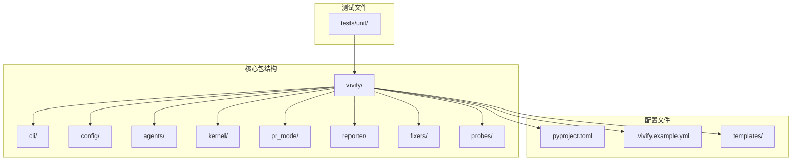
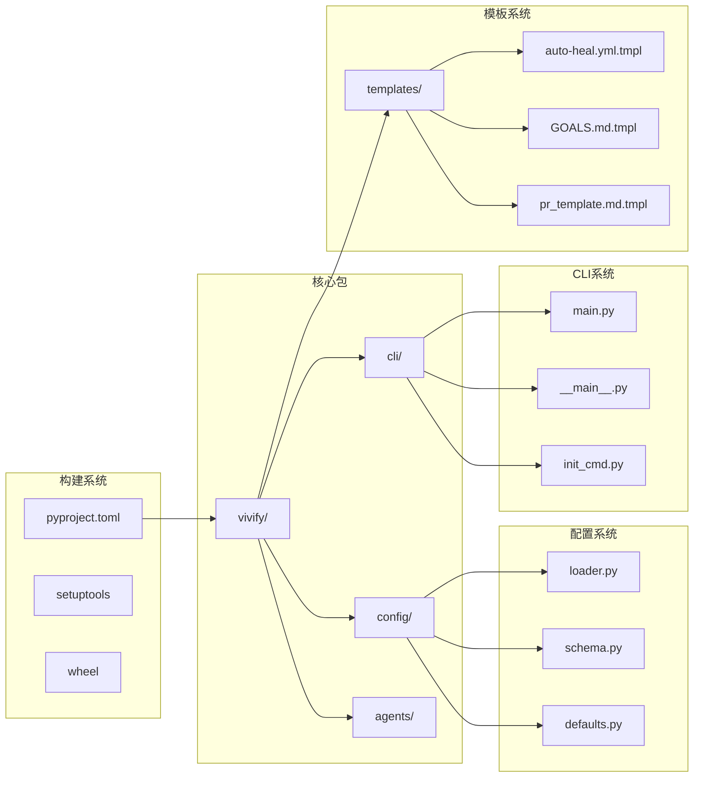
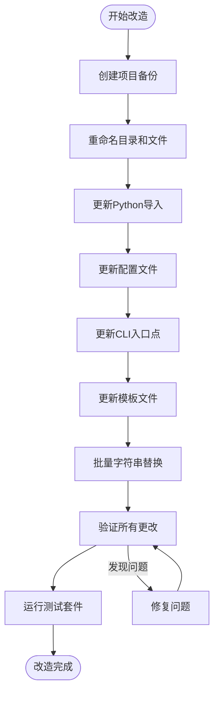
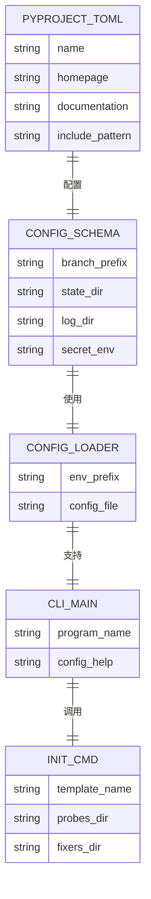

# 风险评估与缓解

<cite>
**本文档中引用的文件**
- [00_READ_ME_FIRST.txt](file://00_READ_ME_FIRST.txt)
- [QUICK_REFERENCE.md](file://QUICK_REFERENCE.md)
- [REBRANDING_SUMMARY.md](file://REBRANDING_SUMMARY.md)
- [detailed_references.md](file://detailed_references.md)
- [rebranding_analysis.md](file://rebranding_analysis.md)
</cite>

## 目录
1. [简介](#简介)
2. [项目结构](#项目结构)
3. [核心组件](#核心组件)
4. [架构概览](#架构概览)
5. [详细组件分析](#详细组件分析)
6. [依赖关系分析](#依赖关系分析)
7. [性能考虑](#性能考虑)
8. [故障排除指南](#故障排除指南)
9. [结论](#结论)
10. [附录](#附录)

## 简介

本文档针对Vivify品牌重塑项目创建了全面的风险评估与缓解措施。项目需要从"auto-heal"完全改名为"vivify"，涉及文件/目录重命名、代码引用替换、配置文件更新等多个方面。基于项目调研报告，我识别了8个潜在风险点，并提供了相应的缓解措施和应急预案。

## 项目结构

Vivify品牌重塑项目是一个自增长型AI代理系统，包含以下主要组件：



**图表来源**
- [rebranding_analysis.md:14-31](file://rebranding_analysis.md#L14-L31)
- [REBRANDING_SUMMARY.md:100-143](file://REBRANDING_SUMMARY.md#L100-L143)

**章节来源**
- [00_READ_ME_FIRST.txt:14-37](file://00_READ_ME_FIRST.txt#L14-L37)
- [REBRANDING_SUMMARY.md:100-143](file://REBRANDING_SUMMARY.md#L100-L143)

## 核心组件

### 风险评估矩阵

基于项目调研，我识别了以下8个关键风险点：

| 风险点 | 概率 | 影响 | 缓解措施 | 应急预案 |
|--------|------|------|----------|----------|
| 遗漏导入 | 中 | 运行时错误 | 运行完整测试套件 | 回滚到备份版本 |
| 正则表达式替换错误 | 低 | 代码破坏 | 逐个审查关键改动 | 手动修复受影响文件 |
| 配置文件格式错误 | 低 | 配置加载失败 | 验证YAML有效性 | 使用配置模板 |
| 测试失败 | 中 | 功能问题 | 手动修复测试 | 运行单个测试文件 |
| 第三方依赖引用 | 低 | 外部集成问题 | 检查pyproject.toml | 更新依赖声明 |
| 环境变量前缀错误 | 中 | 配置加载失败 | 验证环境变量设置 | 检查loader.py |
| CLI入口点失效 | 高 | 完全功能不可用 | 验证CLI可用性 | 检查pyproject.toml |
| 模板文件路径错误 | 低 | 初始化失败 | 验证模板路径 | 重新生成模板 |

**章节来源**
- [REBRANDING_SUMMARY.md:278-287](file://REBRANDING_SUMMARY.md#L278-L287)

## 架构概览

品牌重塑涉及的核心架构组件及其相互关系：



**图表来源**
- [rebranding_analysis.md:33-103](file://rebranding_analysis.md#L33-L103)
- [rebranding_analysis.md:116-198](file://rebranding_analysis.md#L116-L198)
- [rebranding_analysis.md:201-361](file://rebranding_analysis.md#L201-L361)

## 详细组件分析

### 风险1：遗漏导入（中概率，运行时错误）

#### 风险描述
Python导入语句可能被遗漏替换，导致ImportError运行时错误。

#### 影响范围
- 所有Python模块导入
- CLI命令功能
- 配置加载功能

#### 缓解措施
1. **自动化替换**：使用sed命令批量替换导入语句
2. **测试验证**：运行pytest测试套件
3. **手动审查**：重点检查关键导入文件

#### 应急预案
```bash
# 检查剩余的旧导入
grep -r "from auto_heal" . --include="*.py" | wc -l

# 测试Python导入
python3 -c "from vivify.cli.main import cli; print('OK')"

# 运行测试套件
pytest tests/unit/ -v
```

**章节来源**
- [QUICK_REFERENCE.md:188-210](file://QUICK_REFERENCE.md#L188-L210)
- [REBRANDING_SUMMARY.md:282](file://REBRANDING_SUMMARY.md#L282)

### 风险2：正则表达式替换错误（低概率，代码破坏）

#### 风险描述
批量替换可能导致意外的代码破坏，特别是正则表达式匹配不准确时。

#### 影响范围
- 配置路径替换
- 环境变量前缀替换
- 标签和分支前缀替换

#### 缓解措施
1. **分类替换**：按类型分别执行替换操作
2. **逐步验证**：每步替换后进行验证
3. **备份机制**：保留原始项目备份

#### 应急预案
```bash
# 恢复备份
cp -r auto-heal.backup auto-heal

# 重新执行替换（按类别）
# 1. 路径替换
find . -name "*.py" -o -name "*.yml" -o -name "*.md" | xargs sed -i '' 's/\.auto-heal/\.vivify/g'

# 2. 标签替换
find . -name "*.py" | xargs sed -i '' 's/"auto-heal"/"vivify"/g'
```

**章节来源**
- [QUICK_REFERENCE.md:32-67](file://QUICK_REFERENCE.md#L32-L67)
- [REBRANDING_SUMMARY.md:283](file://REBRANDING_SUMMARY.md#L283)

### 风险3：配置文件格式错误（低概率，配置加载失败）

#### 风险描述
YAML配置文件格式错误导致配置加载失败。

#### 影响范围
- 主配置文件（.vivify.yml）
- 示例配置文件（.vivify.example.yml）
- 模板配置文件

#### 缓解措施
1. **模板验证**：使用配置模板确保格式正确
2. **语法检查**：验证YAML语法有效性
3. **默认值检查**：确保所有必需字段存在

#### 应急预案
```bash
# 验证配置文件
python3 -c "from vivify.config import load_config; print('OK')"

# 检查配置加载
python3 -c "
from vivify.config.loader import load_config
try:
    cfg = load_config('.vivify.yml')
    print('配置加载成功')
except Exception as e:
    print(f'配置加载失败: {e}')
"
```

**章节来源**
- [rebranding_analysis.md:364-471](file://rebranding_analysis.md#L364-L471)
- [REBRANDING_SUMMARY.md:284](file://REBRANDING_SUMMARY.md#L284)

### 风险4：测试失败（中概率，功能问题）

#### 风险描述
测试用例中仍包含旧的名称引用，导致测试失败。

#### 影响范围
- 单元测试
- 集成测试
- 功能测试

#### 缓解措施
1. **测试覆盖**：运行完整的测试套件
2. **逐个修复**：手动修复失败的测试用例
3. **标签更新**：更新PR标签和分支前缀

#### 应急预案
```bash
# 运行特定测试
pytest tests/unit/test_pr_mode.py -v

# 检查测试中的旧引用
grep -r "auto-heal" tests/ --include="*.py"

# 修复测试文件
# 更新标签引用
sed -i '' 's/"auto-heal"/"vivify"/g' tests/unit/test_pr_mode.py
sed -i '' 's/auto-heal:/vivify:/g' tests/unit/test_pr_mode.py
```

**章节来源**
- [detailed_references.md:257-271](file://detailed_references.md#L257-L271)
- [REBRANDING_SUMMARY.md:285](file://REBRANDING_SUMMARY.md#L285)

### 风险5：第三方依赖引用（低概率，外部集成问题）

#### 风险描述
pyproject.toml中的依赖声明可能需要更新以反映新的包名。

#### 影响范围
- 包元数据
- 发布配置
- 依赖管理

#### 缓解措施
1. **依赖检查**：验证所有依赖声明
2. **URL更新**：更新项目主页和文档链接
3. **包包含规则**：确保包包含规则正确

#### 应急预案
```bash
# 检查pyproject.toml
grep -n "auto-heal\|vivify" pyproject.toml

# 验证包包含
python3 -m pip install -e .

# 测试包安装
python3 -c "import vivify; print('包安装成功')"
```

**章节来源**
- [rebranding_analysis.md:33-113](file://rebranding_analysis.md#L33-L113)
- [REBRANDING_SUMMARY.md:286](file://REBRANDING_SUMMARY.md#L286)

### 风险6：环境变量前缀错误（中概率，配置加载失败）

#### 风险描述
环境变量前缀未正确更新，导致配置加载失败。

#### 影响范围
- 配置加载器
- 环境变量解析
- 配置合并

#### 缓解措施
1. **前缀验证**：检查_ENV_PREFIX常量
2. **环境变量测试**：验证环境变量设置
3. **配置合并测试**：测试环境变量与配置文件的合并

#### 应急预案
```bash
# 检查环境变量前缀
grep -n "_ENV_PREFIX.*VIVIFY__" auto_heal/config/loader.py

# 设置环境变量
export VIVIFY__TEST_KEY=test_value

# 测试配置加载
python3 -c "
from vivify.config.loader import load_config
cfg = load_config()
print('配置加载成功')
print(f'测试键值: {cfg.test_key}')
"
```

**章节来源**
- [rebranding_analysis.md:283-361](file://rebranding_analysis.md#L283-L361)
- [REBRANDING_SUMMARY.md:287](file://REBRANDING_SUMMARY.md#L287)

### 风险7：CLI入口点失效（高概率，完全功能不可用）

#### 风险描述
CLI入口点未正确更新，导致命令无法执行。

#### 影响范围
- 命令行界面
- 包安装
- 用户体验

#### 缓解措施
1. **入口点验证**：检查pyproject.toml中的scripts配置
2. **命令测试**：测试CLI命令可用性
3. **模块导入**：验证CLI模块导入

#### 应急预案
```bash
# 检查CLI入口点
grep -n "vivify.*cli.main" pyproject.toml

# 测试CLI命令
python3 -m vivify --help

# 测试直接导入
python3 -c "from vivify.cli.main import cli; print('导入成功')"

# 检查包安装
pip show vivify-cli
```

**章节来源**
- [rebranding_analysis.md:116-198](file://rebranding_analysis.md#L116-L198)
- [REBRANDING_SUMMARY.md:281](file://REBRANDING_SUMMARY.md#L281)

### 风险8：模板文件路径错误（低概率，初始化失败）

#### 风险描述
模板文件路径未正确更新，导致init命令失败。

#### 影响范围
- 初始化命令
- 模板资源访问
- 文件生成

#### 缓解措施
1. **模板路径验证**：检查模板文件路径
2. **资源访问测试**：验证模板资源访问
3. **文件生成测试**：测试配置文件生成

#### 应急预案
```bash
# 检查模板路径
grep -n "vivify.templates" auto_heal/cli/init_cmd.py

# 测试模板访问
python3 -c "
from importlib.resources import files
try:
    src = files('vivify.templates').joinpath('vivify.yml.tmpl')
    print('模板访问成功')
except Exception as e:
    print(f'模板访问失败: {e}')

# 测试init命令
python3 -m vivify init --repo /tmp/test --force
```

**章节来源**
- [rebranding_analysis.md:474-580](file://rebranding_analysis.md#L474-L580)
- [REBRANDING_SUMMARY.md:282](file://REBRANDING_SUMMARY.md#L282)

## 依赖关系分析

```mermaid
graph TD
A[pyproject.toml] --> B[vivify/]
B --> C[cli/main.py]
B --> D[config/loader.py]
B --> E[config/schema.py]
B --> F[cli/init_cmd.py]
B --> G[templates/]
H[config/loader.py] --> I[_ENV_PREFIX = "VIVIFY__"]
J[config/schema.py] --> K[state_dir = ".vivify"]
J --> L[log_dir = ".vivify/logs"]
J --> M[branch_prefix = "vivify/"]
N[cli/init_cmd.py] --> O[files("vivify.templates")]
P[cli/main.py] --> Q[prog="vivify"]
R[测试文件] --> B
S[配置文件] --> B
```

**图表来源**
- [rebranding_analysis.md:33-113](file://rebranding_analysis.md#L33-L113)
- [rebranding_analysis.md:116-198](file://rebranding_analysis.md#L116-L198)
- [rebranding_analysis.md:201-361](file://rebranding_analysis.md#L201-L361)

**章节来源**
- [detailed_references.md:17-115](file://detailed_references.md#L17-L115)
- [REBRANDING_SUMMARY.md:108-143](file://REBRANDING_SUMMARY.md#L108-L143)

## 性能考虑

### 风险评估时间线

```mermaid
gantt
title 品牌重塑风险评估时间线
dateFormat X
axisFormat %H:%M
section 阶段1：项目结构重组
备份项目 :0, 5m
重命名目录 :5m, 5m
重命名配置文件 :10m, 5m
重命名模板文件 :15m, 5m
section 阶段2：导入和包声明
导入替换 :20m, 10m
包声明更新 :30m, 10m
section 阶段3：配置和常量
pyproject.toml更新 :40m, 20m
schema.py更新 :60m, 20m
loader.py更新 :80m, 20m
section 阶段4：CLI和模板
CLI入口点更新 :100m, 15m
模板文件更新 :115m, 15m
section 阶段5：字符串替换
路径替换 :130m, 15m
标签替换 :145m, 15m
环境变量替换 :160m, 15m
section 阶段6：验证和测试
测试验证 :175m, 15m
Git提交 :190m, 5m
```

### 风险缓解优先级

| 风险等级 | 风险点 | 缓解措施 | 验证方法 |
|----------|--------|----------|----------|
| P0 | CLI入口点失效 | 检查pyproject.toml | `python3 -m vivify --help` |
| P1 | 遗漏导入 | 运行pytest测试 | `pytest tests/unit/ -v` |
| P2 | 环境变量前缀错误 | 检查_ENV_PREFIX | `grep -n "_ENV_PREFIX" config/loader.py` |
| P3 | 配置文件格式错误 | 验证YAML语法 | `python3 -c "from vivify.config import load_config"` |
| P4 | 模板文件路径错误 | 测试模板访问 | `python3 -c "from importlib.resources import files"` |

## 故障排除指南

### 预防性检查清单



### 关键验证步骤

#### 1. 目录重命名验证
```bash
# 检查目录重命名
ls -d vivify/
ls .vivify.example.yml
ls vivify/templates/vivify.yml.tmpl
```

#### 2. 导入验证
```bash
# 检查剩余的旧导入
grep -r "from auto_heal" . --include="*.py" | wc -l
grep -r "import auto_heal" . --include="*.py" | wc -l
```

#### 3. CLI验证
```bash
# 测试CLI可用性
python3 -m vivify --help
python3 -c "from vivify.cli.main import cli; print('导入成功')"
```

#### 4. 配置验证
```bash
# 测试配置加载
python3 -c "
from vivify.config import load_config
try:
    cfg = load_config()
    print('配置加载成功')
    print(f'state_dir: {cfg.state_dir}')
    print(f'log_dir: {cfg.log_dir}')
    print(f'branch_prefix: {cfg.branch_prefix}')
except Exception as e:
    print(f'配置加载失败: {e}')
"
```

#### 5. 环境变量验证
```bash
# 设置测试环境变量
export VIVIFY__TEST_KEY=test_value
export VIVIFY__NESTED__KEY=value

# 测试环境变量解析
python3 -c "
from vivify.config.loader import _merge_env
import os
test_dict = {}
_merge_env(test_dict)
print('环境变量解析成功')
print(f'test_key: {test_dict.get(\"test_key\")}')
print(f'nested: {test_dict.get(\"nested\", {}).get(\"key\")}')
"
```

### 常见问题解决

#### 问题1：ImportError: No module named 'vivify'
**原因**：包目录未正确重命名
**解决方案**：
```bash
# 检查包目录
ls -la vivify/

# 确认包结构
python3 -c "import sys; print(sys.path)"
```

#### 问题2：vivify: command not found
**原因**：CLI入口点未更新
**解决方案**：
```bash
# 检查pyproject.toml
grep -A5 -B5 "vivify.*cli.main" pyproject.toml

# 重新安装包
pip install -e .
```

#### 问题3：配置加载失败
**原因**：配置文件格式错误或路径错误
**解决方案**：
```bash
# 验证配置文件
python3 -c "
import yaml
with open('.vivify.yml', 'r') as f:
    content = yaml.safe_load(f)
    print('配置文件格式正确')
    print(f'配置内容: {content}')
"
```

**章节来源**
- [QUICK_REFERENCE.md:181-210](file://QUICK_REFERENCE.md#L181-L210)
- [REBRANDING_SUMMARY.md:261-275](file://REBRANDING_SUMMARY.md#L261-L275)

## 结论

Vivify品牌重塑项目涉及多个层面的代码变更，但通过系统的风险评估和缓解措施，可以有效降低改造过程中的风险。关键要点包括：

1. **分阶段执行**：按照既定的8个阶段逐步执行，避免一次性大规模变更
2. **多重验证**：每个阶段完成后进行验证，确保变更正确性
3. **备份机制**：始终保留项目备份，以便快速回滚
4. **测试驱动**：通过完整的测试套件确保功能完整性
5. **应急准备**：为每个关键风险制定详细的应急预案

通过遵循本文档的风险评估与缓解措施，项目团队可以有效地识别和应对改造过程中的各种风险，确保品牌重塑项目的顺利进行。

## 附录

### 风险评估详细数据

| 指标 | 数值 | 说明 |
|------|------|------|
| 总改动位置 | ~477处 | 包含注释、字符串、导入、变量 |
| 需改动文件 | ~50+个 | 核心代码、配置、CLI、测试 |
| 需改动行数 | ~150-200行 | 不同文件的改动数量 |
| 预计改造时间 | 1.5-2小时 | 自动化部分10分钟，手动审查30分钟 |
| 测试验证时间 | 15分钟 | 运行pytest测试套件 |

### 关键文件映射表



**图表来源**
- [detailed_references.md:17-115](file://detailed_references.md#L17-L115)
- [rebranding_analysis.md:33-198](file://rebranding_analysis.md#L33-L198)