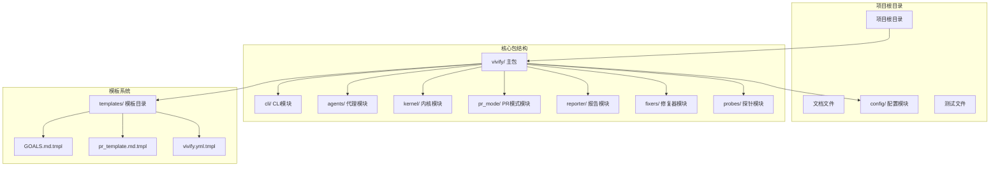
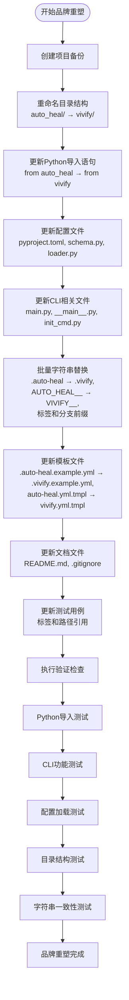
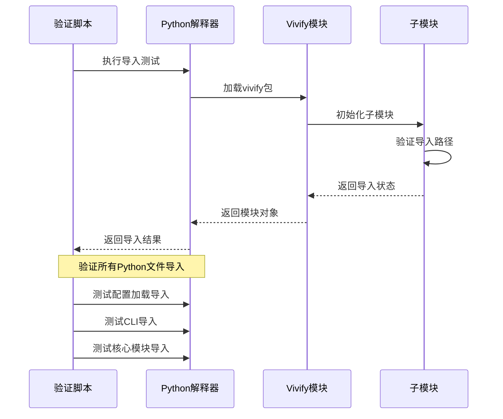
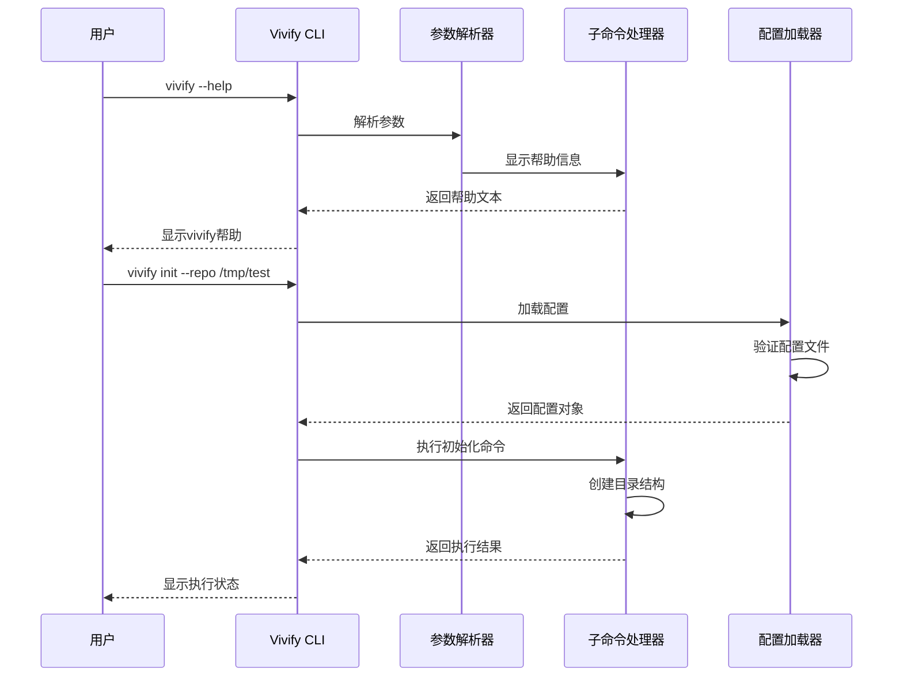
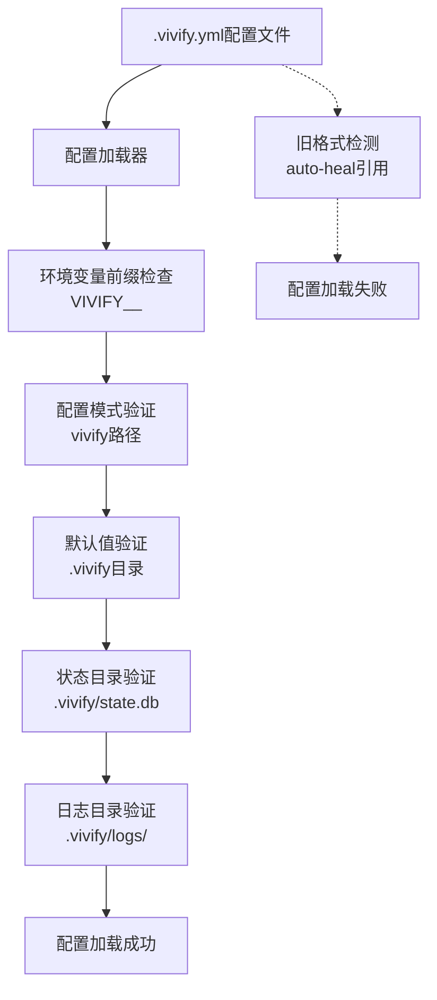
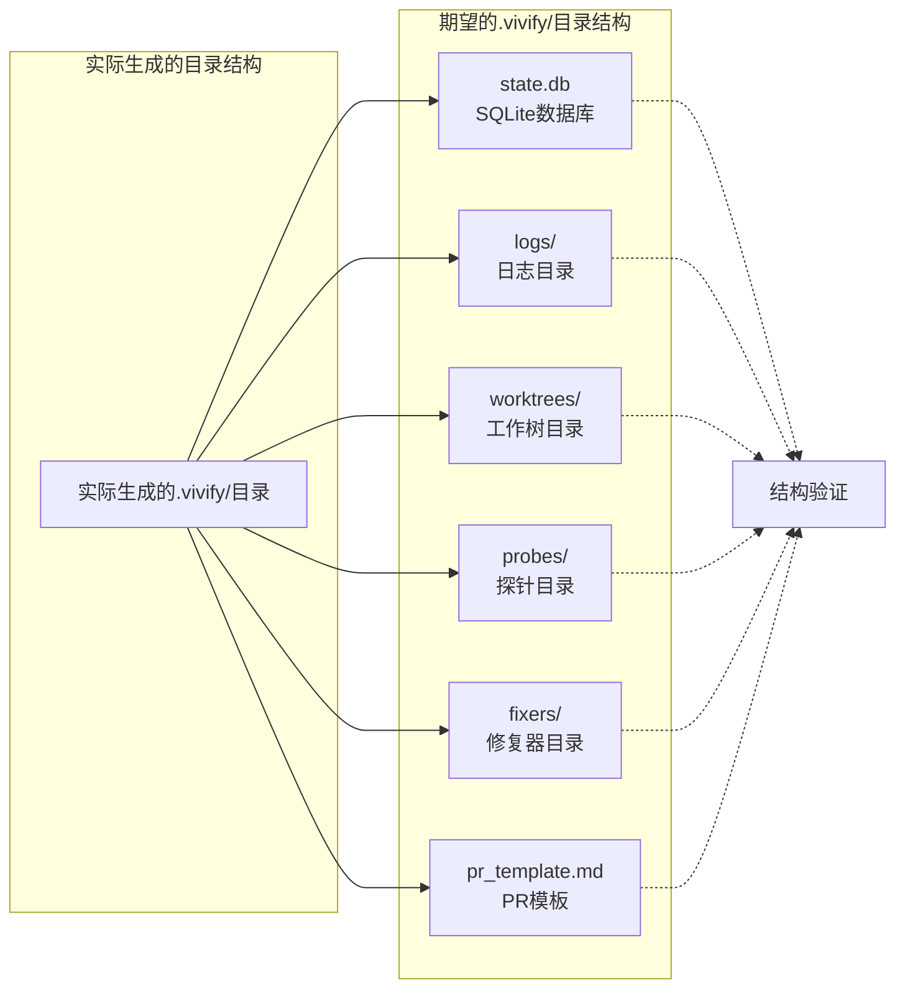
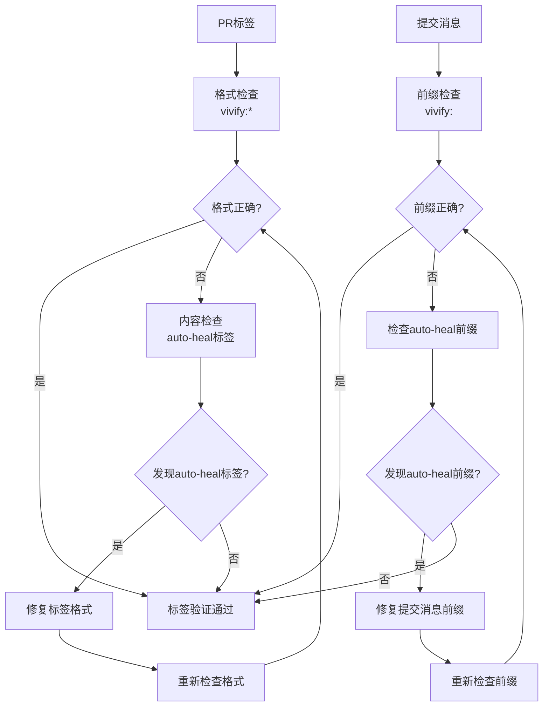
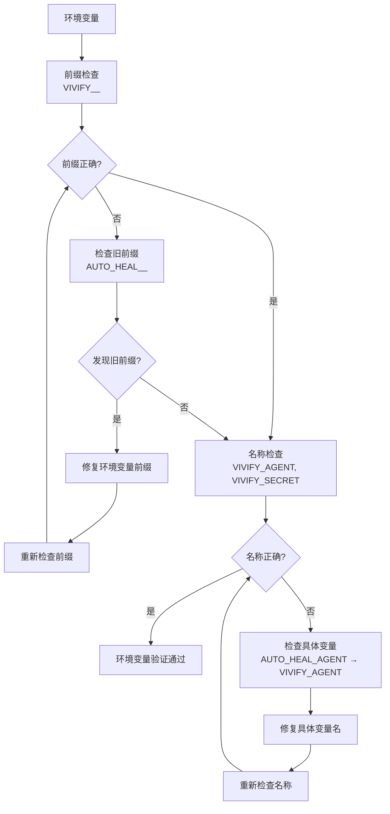
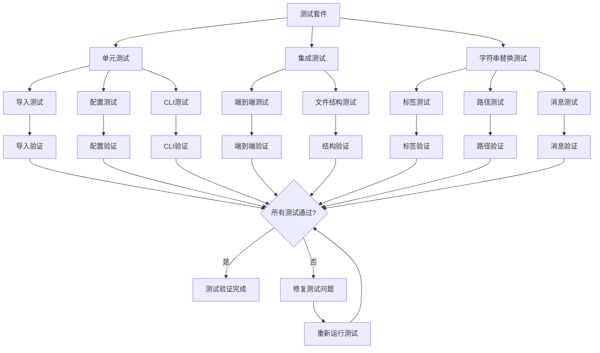
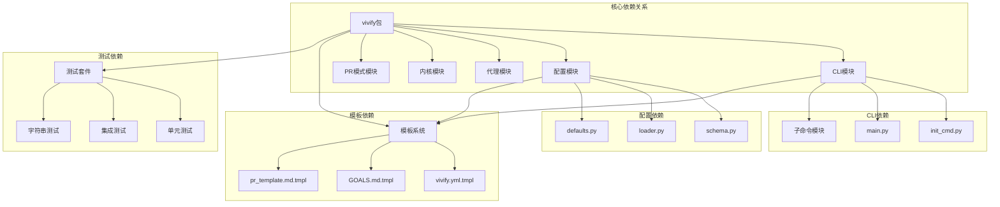

# 验证检查清单

<cite>
**本文档中引用的文件**
- [00_READ_ME_FIRST.txt](file://00_READ_ME_FIRST.txt)
- [QUICK_REFERENCE.md](file://QUICK_REFERENCE.md)
- [REBRANDING_SUMMARY.md](file://REBRANDING_SUMMARY.md)
- [detailed_references.md](file://detailed_references.md)
- [rebranding_analysis.md](file://rebranding_analysis.md)
</cite>

## 目录
1. [简介](#简介)
2. [项目结构](#项目结构)
3. [核心组件](#核心组件)
4. [架构概览](#架构概览)
5. [详细组件分析](#详细组件分析)
6. [依赖关系分析](#依赖关系分析)
7. [性能考虑](#性能考虑)
8. [故障排除指南](#故障排除指南)
9. [结论](#结论)

## 简介

本文档为Vivify品牌重塑项目提供了完整的质量保证检查清单。该项目需要将现有的"auto-heal"品牌完全重命名为"vivify"，涉及代码重构、配置更新、文档修改等多个方面。检查清单涵盖了Python导入验证、测试执行、CLI功能测试、配置文件加载、目录结构验证、标签格式规范、提交消息格式、环境变量前缀更新以及测试用例修正等关键验证点。

## 项目结构

基于提供的调研文档，Vivify项目采用模块化的组织结构：

**图表来源**
- [rebranding_analysis.md:14-30](file://rebranding_analysis.md#L14-L30)
- [rebranding_analysis.md:131-143](file://rebranding_analysis.md#L131-L143)

**章节来源**
- [00_READ_ME_FIRST.txt:10-145](file://00_READ_ME_FIRST.txt#L10-L145)
- [REBRANDING_SUMMARY.md:98-144](file://REBRANDING_SUMMARY.md#L98-L144)

## 核心组件

### 品牌重塑验证矩阵

| 验证类别 | 检查点 | 验证方法 | 预期结果 |
|---------|--------|----------|----------|
| **Python导入验证** | 所有Python文件可正常导入 | `python3 -c "from vivify.cli.main import cli; print('OK')"` | 无ImportError |
| **测试套件验证** | pytest测试全部通过 | `pytest tests/unit/ -v` | 所有测试用例通过 |
| **CLI功能验证** | `vivify --help`显示正确帮助文本 | `python3 -m vivify --help` | 帮助文本包含vivify |
| **配置文件验证** | `.vivify.yml`配置文件可正常加载 | `python3 -c "from vivify.config import load_config; print('OK')"` | 配置加载成功 |
| **目录结构验证** | 新生成的`.vivify/`目录结构正确 | `ls -la .vivify/` | 目录存在且结构完整 |
| **标签格式验证** | 所有PR标签使用`vivify:*`格式 | `grep -r "vivify:" . --include="*.py"` | 标签格式正确 |
| **提交消息验证** | 所有提交消息前缀为`vivify:` | `git log --oneline | grep "^vivify:"` | 提交消息格式正确 |
| **文档一致性验证** | README.md中无遗漏的`auto-heal`引用 | `grep -r "auto-heal" README.md` | 无遗留引用 |
| **环境变量验证** | 环境变量前缀已更新为`VIVIFY__` | `grep -r "VIVIFY__" . --include="*.py"` | 环境变量前缀正确 |
| **测试用例验证** | 测试用例中的`auto-heal`标签已改为`vivify` | `grep -r "vivify" tests/` | 测试标签正确 |

**章节来源**
- [REBRANDING_SUMMARY.md:261-275](file://REBRANDING_SUMMARY.md#L261-L275)
- [QUICK_REFERENCE.md:181-211](file://QUICK_REFERENCE.md#L181-L211)

## 架构概览

### 品牌重塑执行流程

**图表来源**
- [REBRANDING_SUMMARY.md:146-258](file://REBRANDING_SUMMARY.md#L146-L258)
- [QUICK_REFERENCE.md:181-211](file://QUICK_REFERENCE.md#L181-L211)

## 详细组件分析

### Python导入验证组件

#### 导入路径验证流程

**图表来源**
- [QUICK_REFERENCE.md:196-199](file://QUICK_REFERENCE.md#L196-L199)
- [REBRANDING_SUMMARY.md:265-266](file://REBRANDING_SUMMARY.md#L265-L266)

#### 导入验证检查清单

- **核心模块导入**: `from vivify.cli.main import cli`
- **配置模块导入**: `from vivify.config import load_config`
- **子模块导入**: `from vivify.config.loader import load_config`
- **相对导入验证**: 确保所有相对导入路径正确更新

**章节来源**
- [QUICK_REFERENCE.md:188-191](file://QUICK_REFERENCE.md#L188-L191)
- [detailed_references.md:140-152](file://detailed_references.md#L140-L152)

### CLI功能验证组件

#### CLI命令验证序列

**图表来源**
- [QUICK_REFERENCE.md:200-202](file://QUICK_REFERENCE.md#L200-L202)
- [rebranding_analysis.md:474-580](file://rebranding_analysis.md#L474-L580)

#### CLI验证检查点

- **帮助文本验证**: `vivify --help`显示"vivify"而非"auto-heal"
- **初始化命令验证**: `vivify init --repo /tmp/test`成功执行
- **子命令验证**: 所有CLI子命令正常工作
- **参数解析验证**: 命令行参数正确解析

**章节来源**
- [REBRANDING_SUMMARY.md:267-268](file://REBRANDING_SUMMARY.md#L267-L268)
- [detailed_references.md:118-137](file://detailed_references.md#L118-L137)

### 配置文件验证组件

#### 配置加载验证流程

**图表来源**
- [QUICK_REFERENCE.md:192-195](file://QUICK_REFERENCE.md#L192-L195)
- [rebranding_analysis.md:201-240](file://rebranding_analysis.md#L201-L240)

#### 配置验证检查清单

- **配置文件存在性**: `.vivify.yml`文件存在
- **配置加载测试**: `python3 -c "from vivify.config import load_config; print('OK')"`
- **环境变量前缀**: `VIVIFY__`前缀正确应用
- **路径配置**: 所有路径更新为`.vivify/`前缀
- **默认值验证**: 默认配置值正确

**章节来源**
- [REBRANDING_SUMMARY.md:268-269](file://REBRANDING_SUMMARY.md#L268-L269)
- [detailed_references.md:51-115](file://detailed_references.md#L51-L115)

### 目录结构验证组件

#### 目录结构验证流程

**图表来源**
- [rebranding_analysis.md:509-534](file://rebranding_analysis.md#L509-L534)
- [detailed_references.md:118-137](file://detailed_references.md#L118-L137)

#### 目录结构验证检查点

- **状态数据库**: `.vivify/state.db`存在
- **日志目录**: `.vivify/logs/`目录结构正确
- **工作树目录**: `.vivify/worktrees/`目录存在
- **用户目录**: `.vivify/probes/`和`.vivify/fixers/`目录结构
- **模板文件**: `.vivify/pr_template.md`存在

**章节来源**
- [REBRANDING_SUMMARY.md:269-270](file://REBRANDING_SUMMARY.md#L269-L270)
- [detailed_references.md:118-137](file://detailed_references.md#L118-L137)

### 标签和提交消息验证组件

#### 标签格式验证流程

**图表来源**
- [QUICK_REFERENCE.md:214-223](file://QUICK_REFERENCE.md#L214-L223)
- [detailed_references.md:140-152](file://detailed_references.md#L140-L152)

#### 标签和提交消息验证检查点

- **PR标签格式**: 所有标签使用`vivify:*`格式
- **分支前缀**: 所有分支使用`vivify/`前缀
- **提交消息前缀**: 所有提交消息使用`vivify:`前缀
- **标签一致性**: PR标签与分支前缀保持一致

**章节来源**
- [REBRANDING_SUMMARY.md:270-271](file://REBRANDING_SUMMARY.md#L270-L271)
- [detailed_references.md:140-152](file://detailed_references.md#L140-L152)

### 环境变量验证组件

#### 环境变量验证流程

**图表来源**
- [QUICK_REFERENCE.md:214-223](file://QUICK_REFERENCE.md#L214-L223)
- [detailed_references.md:140-152](file://detailed_references.md#L140-L152)

#### 环境变量验证检查点

- **前缀更新**: `AUTO_HEAL__` → `VIVIFY__`
- **具体变量更新**: `AUTO_HEAL_AGENT` → `VIVIFY_AGENT`
- **密钥变量更新**: `AUTO_HEAL_SECRET` → `VIVIFY_SECRET`
- **变量一致性**: 所有环境变量使用新前缀

**章节来源**
- [REBRANDING_SUMMARY.md:273-274](file://REBRANDING_SUMMARY.md#L273-L274)
- [detailed_references.md:140-152](file://detailed_references.md#L140-L152)

### 测试用例验证组件

#### 测试用例验证流程

**图表来源**
- [QUICK_REFERENCE.md:222-236](file://QUICK_REFERENCE.md#L222-L236)
- [REBRANDING_SUMMARY.md:87-95](file://REBRANDING_SUMMARY.md#L87-L95)

#### 测试用例验证检查点

- **导入测试**: `pytest tests/unit/ -v`所有测试通过
- **标签测试**: 测试用例中的`auto-heal`标签已改为`vivify`
- **路径测试**: 测试用例中的路径引用已更新
- **分支测试**: 测试用例中的分支前缀已更新
- **消息测试**: 测试用例中的提交消息已更新

**章节来源**
- [REBRANDING_SUMMARY.md:266-267](file://REBRANDING_SUMMARY.md#L266-L267)
- [detailed_references.md:257-272](file://detailed_references.md#L257-L272)

## 依赖关系分析

### 品牌重塑依赖关系图

**图表来源**
- [rebranding_analysis.md:131-143](file://rebranding_analysis.md#L131-L143)
- [detailed_references.md:108-143](file://detailed_references.md#L108-L143)

### 风险评估和缓解措施

| 风险点 | 概率 | 影响 | 缓解措施 |
|--------|------|------|---------|
| **遗漏导入** | 中 | 运行时错误 | 运行完整测试套件，检查所有导入语句 |
| **正则表达式替换错误** | 低 | 代码破坏 | 逐个审查关键改动，使用备份恢复 |
| **配置文件格式错误** | 低 | 配置加载失败 | 验证YAML有效性，测试配置加载 |
| **测试失败** | 中 | 功能问题 | 手动修复测试，更新测试用例 |
| **第三方依赖引用** | 低 | 外部集成问题 | 检查pyproject.toml依赖声明 |
| **文档不一致** | 低 | 用户困惑 | 全面检查README和其他文档文件 |

**章节来源**
- [REBRANDING_SUMMARY.md:278-287](file://REBRANDING_SUMMARY.md#L278-L287)

## 性能考虑

### 品牌重塑性能影响分析

品牌重塑对项目性能的影响主要体现在以下几个方面：

- **导入性能**: Python导入路径更新不会显著影响运行时性能
- **配置加载**: 新的配置路径和环境变量前缀加载速度基本一致
- **CLI响应**: CLI命令执行时间不受品牌重塑影响
- **测试执行**: 测试套件执行时间主要取决于测试数量而非品牌名称
- **内存使用**: 品牌重塑不改变程序内存使用模式

### 性能优化建议

- **并行验证**: 同时执行多个独立的验证检查
- **增量测试**: 仅运行受影响的测试套件
- **缓存利用**: 利用Python导入缓存减少重复导入开销
- **批处理操作**: 使用sed命令批量替换减少手动操作时间

## 故障排除指南

### 常见问题和解决方案

#### Python导入错误

**问题**: `ImportError: No module named 'vivify'`

**原因**: 包目录未正确重命名或Python路径配置错误

**解决方案**:
1. 确认`vivify/`目录存在
2. 检查Python包路径配置
3. 验证`__init__.py`文件存在
4. 重新安装包或更新PYTHONPATH

#### CLI命令不可用

**问题**: `vivify: command not found`

**原因**: pyproject.toml中的CLI入口点未更新

**解决方案**:
1. 检查`pyproject.toml`中的`scripts`配置
2. 确认入口点指向正确的模块路径
3. 重新安装包以更新CLI注册

#### 配置加载失败

**问题**: 配置文件无法加载

**原因**: 配置路径或环境变量前缀未更新

**解决方案**:
1. 检查`.vivify.yml`文件路径
2. 验证环境变量前缀`VIVIFY__`
3. 确认配置文件权限正确
4. 检查YAML语法格式

#### 测试失败

**问题**: 测试套件执行失败

**原因**: 测试用例中仍包含旧的品牌名称

**解决方案**:
1. 运行`grep -r "auto-heal" tests/`查找残留引用
2. 更新测试用例中的品牌名称
3. 修复测试断言中的路径引用
4. 更新测试数据中的标签和消息

#### 目录结构问题

**问题**: `.vivify/`目录结构不正确

**原因**: 目录重命名或路径更新不完整

**解决方案**:
1. 检查所有路径引用是否更新
2. 验证目录权限设置
3. 确认必要的子目录创建
4. 检查文件权限和所有权

**章节来源**
- [QUICK_REFERENCE.md:214-223](file://QUICK_REFERENCE.md#L214-L223)
- [REBRANDING_SUMMARY.md:288-295](file://REBRANDING_SUMMARY.md#L288-L295)

## 结论

Vivify品牌重塑项目是一个全面的品牌转换工程，涉及代码重构、配置更新、文档修改等多个方面。通过执行本文档提供的完整验证检查清单，可以确保品牌重塑过程的完整性和正确性。

### 关键成功因素

1. **系统性验证**: 按照检查清单逐一验证每个关键点
2. **备份策略**: 在执行任何更改前创建完整的项目备份
3. **逐步验证**: 分阶段执行品牌重塑并及时验证结果
4. **文档一致性**: 确保所有文档文件中的品牌名称更新
5. **测试覆盖**: 运行完整的测试套件确保功能完整性

### 最终验证清单

在完成所有品牌重塑操作后，务必执行以下最终验证：

- ✅ 所有Python文件可以正常导入（无ImportError）
- ✅ `pytest`测试全部通过
- ✅ `vivify --help`显示正确的帮助文本
- ✅ `.vivify.yml`配置文件可以正常加载
- ✅ 新生成的`.vivify/`目录结构正确
- ✅ 所有PR标签使用`vivify:*`格式
- ✅ 所有提交消息前缀为`vivify:`而非`auto-heal:`
- ✅ README.md中没有遗漏的`auto-heal`引用
- ✅ 环境变量前缀已更新为`VIVIFY__`
- ✅ 测试用例中的`auto-heal`标签已改为`vivify`

通过严格执行这些验证步骤，可以确保Vivify品牌重塑项目的成功完成，并为用户提供一致的品牌体验。