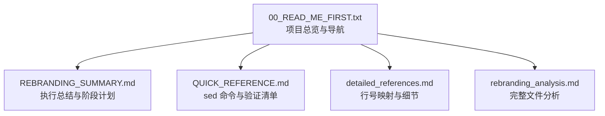
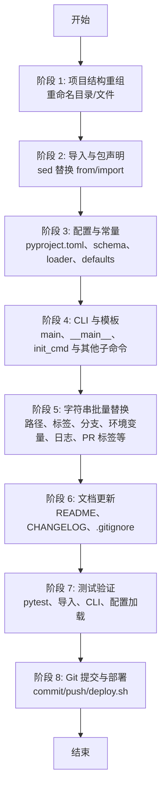
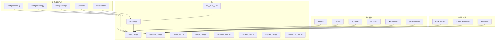

# 工具和实用程序

<cite>
**本文引用的文件**
- [00_READ_ME_FIRST.txt](file://00_READ_ME_FIRST.txt)
- [QUICK_REFERENCE.md](file://QUICK_REFERENCE.md)
- [REBRANDING_SUMMARY.md](file://REBRANDING_SUMMARY.md)
- [detailed_references.md](file://detailed_references.md)
- [rebranding_analysis.md](file://rebranding_analysis.md)
</cite>

## 目录
1. [简介](#简介)
2. [项目结构](#项目结构)
3. [核心组件](#核心组件)
4. [架构概览](#架构概览)
5. [详细组件分析](#详细组件分析)
6. [依赖关系分析](#依赖关系分析)
7. [性能考虑](#性能考虑)
8. [故障排除指南](#故障排除指南)
9. [结论](#结论)
10. [附录](#附录)

## 简介
本文件为 Vivify 品牌重塑项目的工具与实用程序文档，聚焦于基于 sed 的批量替换与自动化改造流程。文档提供完整的 sed 命令参考、验证清单、检查点与测试用例、故障排除方法、自动化脚本与批量操作工具、配置文件模板与示例、性能优化建议与最佳实践，以及与其他工具的集成方法。内容面向不同技术水平的用户，提供循序渐进的操作指导与高效技巧。

## 项目结构
本仓库包含品牌重塑相关的调研与执行文档，核心文件如下：
- 顶层说明与导航：00_READ_ME_FIRST.txt
- 快速参考与 sed 命令：QUICK_REFERENCE.md
- 执行总结与阶段计划：REBRANDING_SUMMARY.md
- 详细改动映射与行号对照：detailed_references.md
- 详细分析与完整文件内容：rebranding_analysis.md

图表来源
- [00_READ_ME_FIRST.txt:1-259](file://00_READ_ME_FIRST.txt#L1-L259)
- [REBRANDING_SUMMARY.md:1-311](file://REBRANDING_SUMMARY.md#L1-L311)
- [QUICK_REFERENCE.md:1-285](file://QUICK_REFERENCE.md#L1-L285)
- [detailed_references.md:1-294](file://detailed_references.md#L1-L294)
- [rebranding_analysis.md:1-966](file://rebranding_analysis.md#L1-L966)

章节来源
- [00_READ_ME_FIRST.txt:1-259](file://00_READ_ME_FIRST.txt#L1-L259)

## 核心组件
- sed 命令集合：覆盖导入替换、路径替换、标签替换、分支前缀替换、环境变量前缀与具体变量替换、日志文件名替换、PR 标签替换、通用包引用替换等。
- 文件/目录重命名操作：主包目录、示例配置文件、模板文件的重命名步骤。
- 验证清单与测试用例：导入验证、CLI 可用性、测试套件、残留字符串检查等。
- 常见错误与修复：ImportError、命令不可用、环境变量前缀缺失、配置路径错误、测试失败等。
- Git 提交模板与最后检查：标准化提交信息与最终验证脚本。

章节来源
- [QUICK_REFERENCE.md:32-91](file://QUICK_REFERENCE.md#L32-L91)
- [QUICK_REFERENCE.md:181-210](file://QUICK_REFERENCE.md#L181-L210)
- [QUICK_REFERENCE.md:214-247](file://QUICK_REFERENCE.md#L214-L247)
- [REBRANDING_SUMMARY.md:146-257](file://REBRANDING_SUMMARY.md#L146-L257)

## 架构概览
品牌重塑改造的总体流程分为八个阶段，涵盖结构重组、导入与包声明、配置与常量、CLI 与模板、字符串批量替换、文档更新、测试验证与 Git 提交。下图展示各阶段之间的顺序关系与关键任务。

图表来源
- [REBRANDING_SUMMARY.md:146-257](file://REBRANDING_SUMMARY.md#L146-L257)

## 详细组件分析

### sed 命令参考与使用示例
- macOS 平台注意事项：使用 `-i ''` 参数进行就地替换。
- 批量替换导入：将 from auto_heal 与 import auto_heal 替换为 vivify。
- 配置路径替换：将 .auto-heal 替换为 .vivify。
- 标签替换：将 "auto-heal" 与 'auto-heal' 替换为 vivify。
- 分支前缀替换：将 auto-heal/ 替换为 vivify/。
- 环境变量前缀替换：将 AUTO_HEAL__ 替换为 VIVIFY__。
- 具体环境变量替换：将 AUTO_HEAL_AGENT 与 AUTO_HEAL_SECRET 替换为 VIVIFY_AGENT 与 VIVIFY_SECRET。
- 日志文件名替换：将 auto-heal.log 替换为 vivify.log。
- PR 标签替换：将 auto-heal: 替换为 vivify:。
- 通用包引用替换：谨慎使用，避免误伤非目标文本。

章节来源
- [QUICK_REFERENCE.md:34-67](file://QUICK_REFERENCE.md#L34-L67)

### 文件/目录重命名快速表
- 备份原项目目录。
- 重命名主包目录 auto_heal 为 vivify。
- 重命名示例配置文件 .auto-heal.example.yml 为 .vivify.example.yml。
- 重命名模板文件 auto_heal/templates/auto-heal.yml.tmpl 为 vivify/templates/vivify.yml.tmpl。
- 更新 .gitignore 中的 .auto-heal 路径为 .vivify。

章节来源
- [QUICK_REFERENCE.md:71-91](file://QUICK_REFERENCE.md#L71-L91)

### 关键文件改动位置表
- pyproject.toml：包名、作者、scripts 入口点、URL、include、包映射等字段更新。
- config/schema.py：分支前缀、标签、state_dir、log_dir、allowed_paths、secret_env 等。
- config/loader.py：环境变量前缀、默认配置文件路径、错误消息等。
- cli/init_cmd.py：模板资源路径、输出文本、目录路径、模板文件名等。

章节来源
- [QUICK_REFERENCE.md:95-177](file://QUICK_REFERENCE.md#L95-L177)

### 验证清单与测试用例
- 目录与文件存在性检查：确认 vivify/ 与 .vivify.example.yml 是否存在。
- 导入验证：确保 no ImportError，使用 python3 -c "from vivify.cli.main import cli"。
- CLI 可用性：python3 -m vivify --help。
- 测试套件：pytest tests/unit/ -v。
- 残留字符串检查：grep -r "auto-heal\|auto_heal\|AUTO_HEAL" . --include="*.py" --include="*.yml" --include="*.md" | grep -v ".git" | wc -l 应为 0 或极少数注释/示例。

章节来源
- [QUICK_REFERENCE.md:181-210](file://QUICK_REFERENCE.md#L181-L210)
- [00_READ_ME_FIRST.txt:169-186](file://00_READ_ME_FIRST.txt#L169-L186)

### 常见错误与修复
- ImportError: No module named 'vivify'：检查 vivify/ 目录是否存在且可被 Python 解释器导入。
- vivify: command not found：检查 pyproject.toml 中 scripts 的入口点是否更新为 vivify。
- VIVIFY__ env not found：检查 config/loader.py 中的 _ENV_PREFIX 是否更新为 VIVIFY__。
- .vivify/state.db not found：检查 config/schema.py 中的默认路径是否更新。
- Test failures：运行 grep -r "auto-heal" tests/ 定位测试中的残留引用并修正。

章节来源
- [QUICK_REFERENCE.md:214-223](file://QUICK_REFERENCE.md#L214-L223)

### Git 提交模板与最后检查
- 提交模板：包含重命名、导入更新、配置更新、CLI 命令更新、环境变量前缀更新、标签与分支前缀更新、文档更新、测试引用更新、.gitignore 更新等要点。
- 最后检查：完整字符串搜索、新引用验证、导入测试、pytest 运行。

章节来源
- [QUICK_REFERENCE.md:226-275](file://QUICK_REFERENCE.md#L226-L275)

### 自动化脚本与批量操作工具
- sed 批量替换：按类别分组执行，先处理导入，再处理路径、标签、分支、环境变量、日志、PR 标签等。
- find + xargs：在 .py、.yml、.md 等文件中执行替换。
- macOS 注意：使用 -i '' 参数；Windows 用户请使用相应语法。
- IDE 全局替换：配合正则表达式进行精确替换，建议先备份。

章节来源
- [QUICK_REFERENCE.md:34-67](file://QUICK_REFERENCE.md#L34-L67)
- [REBRANDING_SUMMARY.md:194-214](file://REBRANDING_SUMMARY.md#L194-L214)

### 配置文件模板与示例
- .vivify.example.yml：示例配置文件，包含 state_dir、log_dir、branch_prefix、labels、sqlite 路径、user_probes_dir、user_fixers_dir 等字段。
- vivify.yml.tmpl：配置模板文件，内容与示例配置一致，需重命名为 vivify.yml.tmpl。
- GOALS.md.tmpl：目标分解模板，包含命令示例与说明。
- pr_template.md.tmpl：PR 模板，包含标题与说明文本。

章节来源
- [rebranding_analysis.md:364-471](file://rebranding_analysis.md#L364-L471)
- [rebranding_analysis.md:583-660](file://rebranding_analysis.md#L583-L660)

### 性能优化建议与最佳实践
- 分类批量替换：先导入，再路径、标签、分支、环境变量、日志、PR 标签，减少重复扫描与误伤。
- 使用 macOS -i ''：避免跨平台差异导致的错误。
- 逐个审查关键文件：对配置、CLI、测试等关键文件进行人工复核，确保一致性。
- 测试先行：在大规模替换后立即运行 pytest，尽早发现问题。
- 备份策略：改造前复制原项目目录，便于回滚。

章节来源
- [QUICK_REFERENCE.md:34-67](file://QUICK_REFERENCE.md#L34-L67)
- [REBRANDING_SUMMARY.md:146-257](file://REBRANDING_SUMMARY.md#L146-L257)

### 与其他工具的集成方法
- Git：在完成所有替换与验证后，使用标准化提交模板进行提交与推送。
- pytest：作为测试验证的核心工具，确保所有功能正常。
- IDE：利用 IDE 的全局查找与替换功能，结合正则表达式进行精确替换。
- shell：结合 find、xargs、grep 等工具实现高效的批量操作与验证。

章节来源
- [QUICK_REFERENCE.md:226-275](file://QUICK_REFERENCE.md#L226-L275)
- [REBRANDING_SUMMARY.md:222-236](file://REBRANDING_SUMMARY.md#L222-L236)

## 依赖关系分析
品牌重塑改造涉及的文件与改动范围广泛，主要包括：
- 目录与文件重命名：auto_heal/ → vivify/、.auto-heal.example.yml → .vivify.example.yml、模板文件重命名。
- 配置文件：pyproject.toml、config/schema.py、config/defaults.py、config/loader.py、.gitignore。
- CLI 文件：cli/main.py、cli/__main__.py、cli/init_cmd.py 及其他子命令。
- 核心模块：agents、kernel、pr_mode、reporter、fixers、probes 等。
- 文档与测试：README.md、CHANGELOG.md、tests/unit/ 下的测试文件。

图表来源
- [REBRANDING_SUMMARY.md:108-143](file://REBRANDING_SUMMARY.md#L108-L143)

章节来源
- [REBRANDING_SUMMARY.md:108-143](file://REBRANDING_SUMMARY.md#L108-L143)

## 性能考虑
- 批量替换的效率：按类别分组执行，减少不必要的重复扫描。
- 正则表达式的准确性：避免误伤非目标文本，必要时使用更精确的匹配模式。
- 测试验证的及时性：在替换后立即运行 pytest，缩短反馈周期。
- 备份与回滚：保留原项目副本，降低风险并提高恢复速度。

## 故障排除指南
- ImportError: No module named 'vivify'
  - 检查 vivify/ 目录是否存在且位于 Python 搜索路径中。
  - 确认包目录已正确重命名，且 __init__.py 存在。
- vivify: command not found
  - 检查 pyproject.toml 中 scripts 的入口点是否更新为 vivify。
  - 确认安装方式与入口点一致。
- VIVIFY__ env not found
  - 检查 config/loader.py 中的 _ENV_PREFIX 是否更新为 VIVIFY__。
  - 确认环境变量前缀与配置加载逻辑一致。
- .vivify/state.db not found
  - 检查 config/schema.py 中的默认路径是否更新为 .vivify。
  - 确认权限与目录存在性。
- Test failures
  - 运行 grep -r "auto-heal" tests/ 定位测试中的残留引用。
  - 逐一修正测试断言与标签引用。

章节来源
- [QUICK_REFERENCE.md:214-223](file://QUICK_REFERENCE.md#L214-L223)

## 结论
通过 sed 命令与系统化的改造流程，Vivify 品牌重塑项目可以在约 1.5-2 小时内完成从 auto-heal 到 vivify 的全面迁移。关键在于：先重命名结构，再批量替换导入与字符串，随后逐项审查配置与 CLI，最后运行测试与 Git 提交。遵循本文档提供的 sed 命令、验证清单与故障排除方法，可显著降低风险并提升效率。

## 附录
- 详细改动映射：按文件与行号列出所有需要更新的位置，便于逐行审查与执行。
- 详细分析：包含所有关键文件的完整内容与改动说明，适合架构师与高级开发者深入理解。

章节来源
- [detailed_references.md:1-294](file://detailed_references.md#L1-L294)
- [rebranding_analysis.md:1-966](file://rebranding_analysis.md#L1-L966)