# CLI初始化命令增强

<cite>
**本文档引用的文件**
- [init_cmd.py](file://vivify/cli/init_cmd.py)
- [main.py](file://vivify/cli/main.py)
- [__main__.py](file://vivify/__main__.py)
- [defaults.py](file://vivify/config/defaults.py)
- [vivify.yml.tmpl](file://vivify/templates/vivify.yml.tmpl)
- [classifier.py](file://vivify/intelligence/classifier.py)
- [scanner.py](file://vivify/intelligence/scanner.py)
- [configurator.py](file://vivify/intelligence/configurator.py)
- [goals_templates.py](file://vivify/intelligence/goals_templates.py)
- [ai_analyzer.py](file://vivify/intelligence/ai_analyzer.py)
- [interviewer.py](file://vivify/intelligence/interviewer.py)
- [README.md](file://README.md)
- [GOALS.example.md](file://GOALS.example.md)
</cite>

## 目录
1. [简介](#简介)
2. [项目结构](#项目结构)
3. [核心组件](#核心组件)
4. [架构概览](#架构概览)
5. [详细组件分析](#详细组件分析)
6. [依赖关系分析](#依赖关系分析)
7. [性能考虑](#性能考虑)
8. [故障排除指南](#故障排除指南)
9. [结论](#结论)

## 简介

Vivify CLI初始化命令是一个智能化的项目初始化工具，旨在为任何GitHub项目提供完整的配置和最佳实践设置。该命令通过AI驱动的项目分析、智能场景分类和自动化配置生成，为开发者提供"即插即用"的智能扩展能力。

该项目的核心理念是"植入生命"，通过无感接入的方式为传统项目注入智能化的自生长能力，实现从"被使用"到"自我进化"的跨越。

## 项目结构

Vivify项目采用模块化设计，主要分为以下几个核心层次：

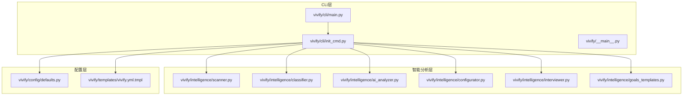

**图表来源**
- [main.py:22-43](file://vivify/cli/main.py#L22-L43)
- [init_cmd.py:21-41](file://vivify/cli/init_cmd.py#L21-L41)

**章节来源**
- [main.py:1-58](file://vivify/cli/main.py#L1-L58)
- [init_cmd.py:1-393](file://vivify/cli/init_cmd.py#L1-L393)

## 核心组件

### 初始化命令核心功能

初始化命令提供了以下核心功能：

1. **智能项目扫描** - 自动分析项目结构和特征
2. **AI驱动分析** - 使用qodercli进行深度项目理解
3. **场景智能分类** - 基于项目特征自动识别适用场景
4. **自动化配置生成** - 生成完整的.vivify.yml配置文件
5. **目标模板生成** - 创建符合项目特点的GOALS.md文件
6. **目录结构初始化** - 设置必要的项目目录和文件

### 命令行接口设计

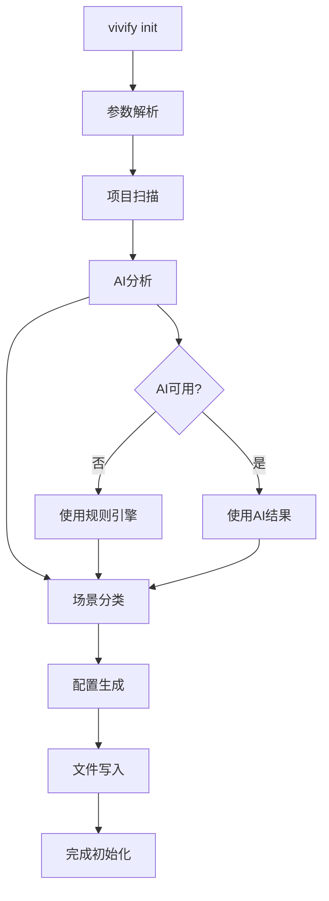

**图表来源**
- [init_cmd.py:207-390](file://vivify/cli/init_cmd.py#L207-L390)

**章节来源**
- [init_cmd.py:21-41](file://vivify/cli/init_cmd.py#L21-L41)
- [init_cmd.py:207-390](file://vivify/cli/init_cmd.py#L207-L390)

## 架构概览

Vivify初始化命令采用分层架构设计，确保了高度的模块化和可扩展性：

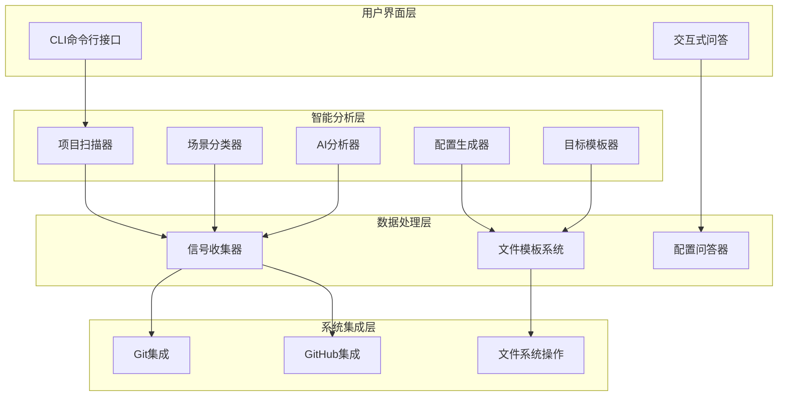

**图表来源**
- [scanner.py:123-146](file://vivify/intelligence/scanner.py#L123-L146)
- [classifier.py:65-235](file://vivify/intelligence/classifier.py#L65-L235)
- [ai_analyzer.py:41-94](file://vivify/intelligence/ai_analyzer.py#L41-L94)

## 详细组件分析

### 1. 项目扫描器 (Scanner)

项目扫描器负责深入分析项目结构，收集各种信号用于后续决策：

#### 核心功能特性

- **多维度文件扫描** - 支持5层深度递归扫描
- **包管理器识别** - 自动检测package.json、pyproject.toml等
- **框架检测** - 识别React、Vue、Django、Spring等主流框架
- **CI/CD配置发现** - 检测GitHub Actions、GitLab CI等
- **测试框架识别** - 支持pytest、jest、mocha等多种测试框架
- **部署配置检测** - 识别Docker、Kubernetes等部署方案

#### 扫描信号类型

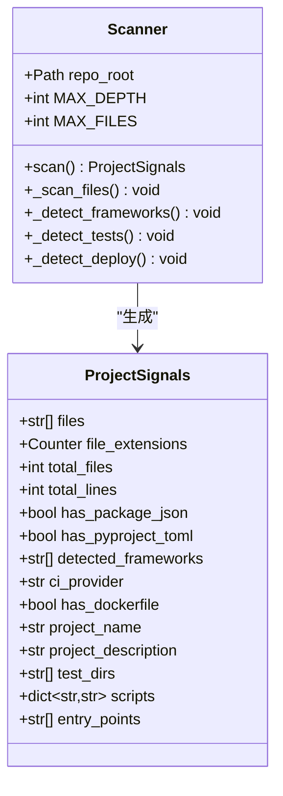

**图表来源**
- [scanner.py:66-146](file://vivify/intelligence/scanner.py#L66-L146)
- [scanner.py:129-146](file://vivify/intelligence/scanner.py#L129-L146)

**章节来源**
- [scanner.py:1-481](file://vivify/intelligence/scanner.py#L1-L481)

### 2. 场景分类器 (Classifier)

场景分类器基于收集到的项目信号进行智能分类：

#### 支持的项目场景类型

| 场景类型 | 描述 | 典型特征 |
|---------|------|----------|
| **static-site** | 静态网站 | index.html + 无前端框架 |
| **web-app** | Web应用 | package.json + 前端框架 |
| **api-service** | API服务 | 服务端框架 + API路由 |
| **python-package** | Python包 | pyproject.toml + 包结构 |
| **cli-tool** | 命令行工具 | entry_points + 脚本 |
| **docs-only** | 仅文档项目 | 文档文件占比>90% |
| **mobile-app** | 移动应用 | Android/iOS目录或pubspec.yaml |
| **monorepo** | 单仓库多项目 | lerna.json/pnpm-workspace.yaml |
| **infra** | 基础设施 | Terraform/Kubernetes配置 |
| **generic** | 通用项目 | 无法匹配特定场景 |

#### 分类算法流程

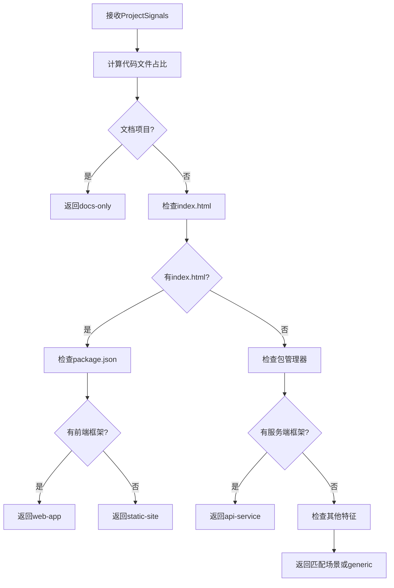

**图表来源**
- [classifier.py:68-235](file://vivify/intelligence/classifier.py#L68-L235)

**章节来源**
- [classifier.py:1-267](file://vivify/intelligence/classifier.py#L1-L267)

### 3. AI分析器 (AIAnalyzer)

AI分析器使用qodercli进行深度项目理解：

#### AI分析能力

- **项目场景识别** - 基于项目特征识别最适合的场景类型
- **技术栈分析** - 识别主要编程语言和框架组合
- **配置建议生成** - 提供部署URL、测试命令、构建命令等配置建议
- **目标模板生成** - 为项目量身定制GOALS.md内容
- **置信度评估** - 提供分析结果的可信度评分

#### AI分析流程

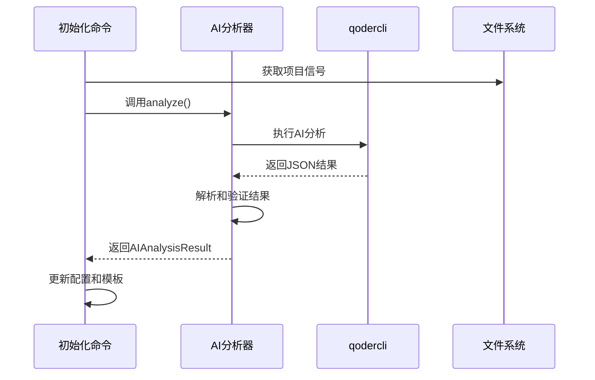

**图表来源**
- [ai_analyzer.py:65-94](file://vivify/intelligence/ai_analyzer.py#L65-L94)
- [ai_analyzer.py:203-252](file://vivify/intelligence/ai_analyzer.py#L203-L252)

**章节来源**
- [ai_analyzer.py:1-259](file://vivify/intelligence/ai_analyzer.py#L1-L259)

### 4. 配置生成器 (Configurator)

配置生成器根据项目场景生成相应的配置：

#### 场景化配置模板

| 场景类型 | 推荐探针 | 推荐修复器 | 特殊配置 |
|---------|----------|------------|----------|
| **static-site** | ci_status, site_health, doc_staleness | doc_link_check, stale_branch_prune | 部署URL必填 |
| **web-app** | 全套探针 | 全套修复器 | 测试/构建命令必填 |
| **api-service** | 错误日志监控 | 全套修复器 | 健康检查端点 |
| **python-package** | 代码质量监控 | 代码质量修复器 | 测试覆盖率 |
| **cli-tool** | 代码质量监控 | 代码质量修复器 | 测试命令 |
| **docs-only** | 文档监控 | 文档修复器 | 无在线部署 |

#### 配置发现机制

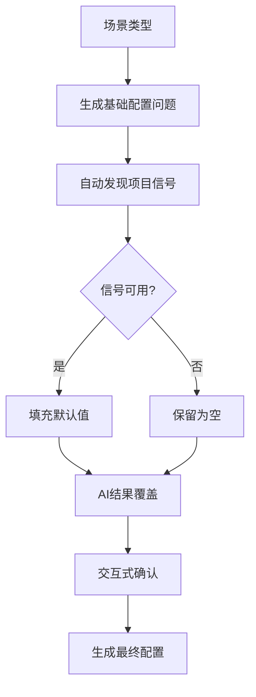

**图表来源**
- [configurator.py:118-177](file://vivify/intelligence/configurator.py#L118-L177)
- [configurator.py:179-222](file://vivify/intelligence/configurator.py#L179-L222)

**章节来源**
- [configurator.py:1-294](file://vivify/intelligence/configurator.py#L1-L294)

### 5. 目标模板生成器 (GoalsTemplates)

目标模板生成器为不同场景创建量身定制的目标和KPI：

#### 场景化目标模板

每个场景都有专门设计的目标模板，确保目标与项目实际业务相关：

- **静态网站**：文档时效性、站点可用性、页面加载速度
- **Web应用**：CI稳定性、测试覆盖率、依赖安全性
- **API服务**：服务可靠性、错误率控制、测试覆盖率
- **Python包**：CI稳定性、测试覆盖率、代码质量
- **移动应用**：构建稳定性、依赖安全性

#### KPI设计原则

KPI遵循SMART原则（具体、可衡量、可达成、相关性强、有时限）：

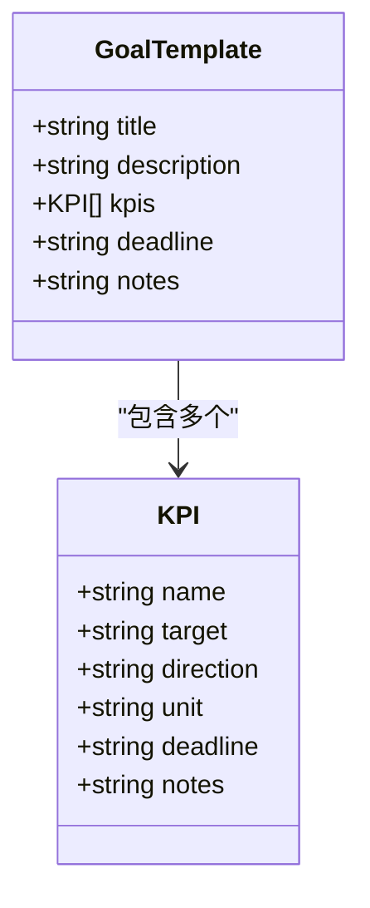

**图表来源**
- [goals_templates.py:182-189](file://vivify/intelligence/goals_templates.py#L182-L189)

**章节来源**
- [goals_templates.py:1-190](file://vivify/intelligence/goals_templates.py#L1-L190)

### 6. 交互式问答器 (Interviewer)

交互式问答器处理用户输入和配置确认：

#### 问答流程设计

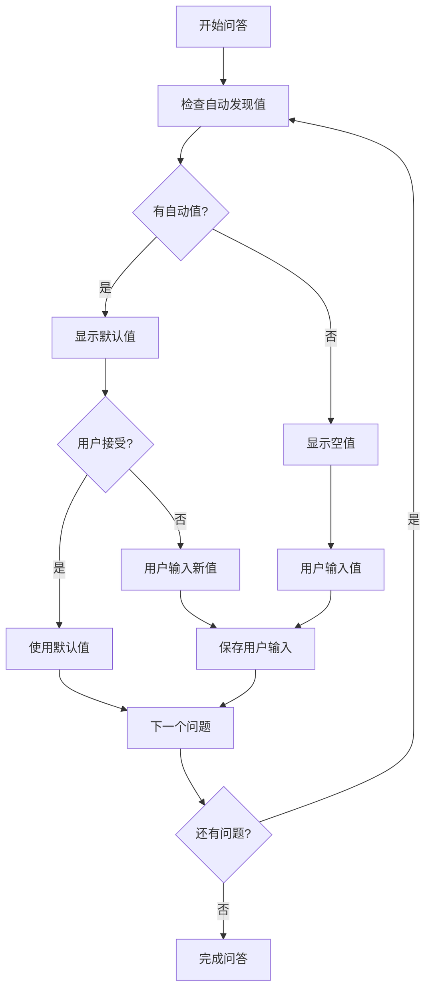

**图表来源**
- [interviewer.py:11-37](file://vivify/intelligence/interviewer.py#L11-L37)

**章节来源**
- [interviewer.py:1-73](file://vivify/intelligence/interviewer.py#L1-L73)

## 依赖关系分析

### 外部依赖关系

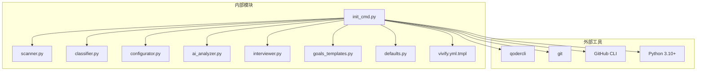

**图表来源**
- [init_cmd.py:225-234](file://vivify/cli/init_cmd.py#L225-L234)
- [ai_analyzer.py:48-63](file://vivify/intelligence/ai_analyzer.py#L48-L63)

### 内部模块依赖

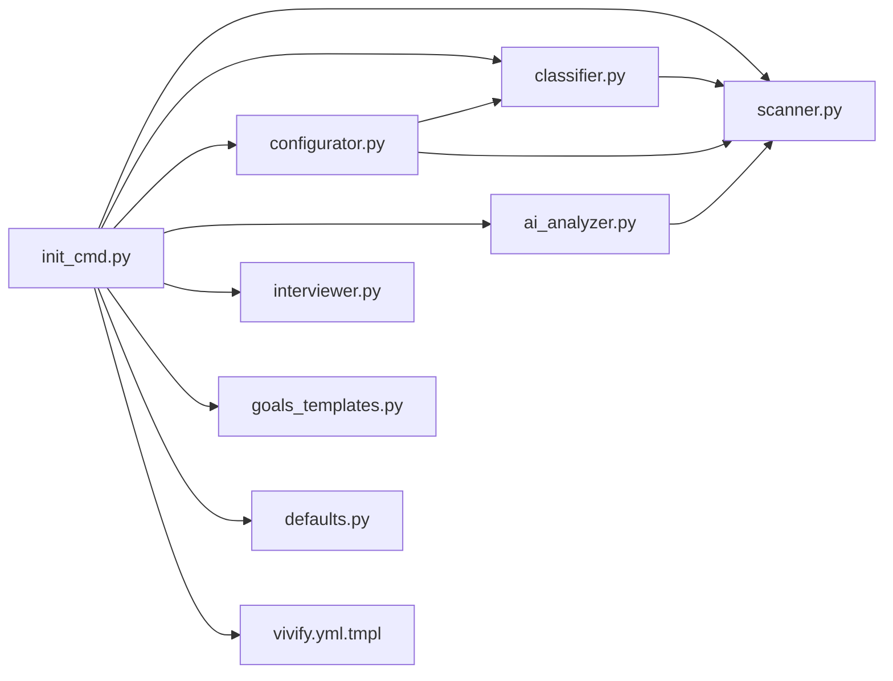

**图表来源**
- [init_cmd.py:9-18](file://vivify/cli/init_cmd.py#L9-L18)

**章节来源**
- [init_cmd.py:1-393](file://vivify/cli/init_cmd.py#L1-L393)

## 性能考虑

### 扫描性能优化

1. **深度限制** - 最大递归深度为5层，避免深层目录扫描
2. **文件数量限制** - 最多扫描10000个文件，防止超大仓库卡顿
3. **忽略目录优化** - 预定义忽略目录集合，减少无效扫描
4. **异步处理** - AI分析使用超时机制，避免长时间阻塞

### 内存使用优化

1. **流式处理** - 文件内容按需读取，避免一次性加载
2. **信号对象设计** - 使用dataclass减少内存开销
3. **缓存机制** - 项目信号在内存中缓存，避免重复计算

### 网络和外部依赖

1. **AI分析超时** - 120秒超时，防止网络问题影响用户体验
2. **备用方案** - AI失败时使用规则引擎进行分类
3. **版本检测** - 智能检测qodercli版本，提供兼容性信息

## 故障排除指南

### 常见问题及解决方案

#### 1. qodercli未找到

**问题症状**：
```
[ERROR] qodercli 未找到。vivify 的智能引擎依赖 qodercli 运行。
请先安装 qodercli: https://docs.qoder.ai/install
或指定路径: vivify init --qodercli-path /path/to/qodercli
```

**解决步骤**：
1. 安装qodercli：`pip install qodercli`
2. 验证安装：`qodercli --version`
3. 重新运行初始化：`vivify init`

#### 2. 权限不足

**问题症状**：
```
错误: .vivify.yml 已存在。使用 --force 覆盖。
```

**解决步骤**：
1. 使用强制覆盖：`vivify init --force`
2. 检查文件权限：`chmod 644 .vivify.yml`
3. 删除现有配置后重试

#### 3. AI分析失败

**问题症状**：
```
[ERROR] AI 分析失败。请检查 qodercli 配置或使用 --type 手动指定项目类型。
可用类型: static-site, web-app, api-service, python-package, cli-tool, docs-only, mobile-app, monorepo, infra, generic
```

**解决步骤**：
1. 手动指定类型：`vivify init --type web-app`
2. 检查网络连接
3. 重试命令或使用非交互模式：`vivify init --non-interactive`

#### 4. Git配置问题

**问题症状**：
```
无法检测默认分支或远程仓库URL
```

**解决步骤**：
1. 初始化git仓库：`git init`
2. 添加远程仓库：`git remote add origin <url>`
3. 设置默认分支：`git checkout -b main`

**章节来源**
- [init_cmd.py:225-280](file://vivify/cli/init_cmd.py#L225-L280)
- [scanner.py:338-366](file://vivify/intelligence/scanner.py#L338-L366)

## 结论

Vivify CLI初始化命令通过智能化的设计和完善的架构，为开发者提供了一个强大而易用的项目初始化工具。其核心优势包括：

### 技术优势

1. **AI驱动的智能分析** - 利用qodercli进行深度项目理解
2. **场景化配置生成** - 基于项目特征自动选择最优配置
3. **模块化架构设计** - 清晰的分层结构便于维护和扩展
4. **完善的错误处理** - 提供详细的错误信息和解决方案

### 用户体验优势

1. **交互式配置** - 支持非交互模式和交互模式
2. **智能默认值** - 自动发现项目特征并提供合理默认值
3. **详细的反馈** - 提供清晰的进度信息和结果展示
4. **灵活的配置选项** - 支持强制覆盖、类型指定等高级选项

### 未来发展

随着项目的不断演进，初始化命令将继续增强其智能化水平，支持更多的项目场景和配置选项，为开发者提供更加完善的服务。