# GitHub认证系统增强

<cite>
**本文档引用的文件**
- [README.md](file://README.md)
- [pyproject.toml](file://pyproject.toml)
- [.vivify.example.yml](file://.vivify.example.yml)
- [vivify/__main__.py](file://vivify/__main__.py)
- [vivify/cli/main.py](file://vivify/cli/main.py)
- [vivify/cli/init_cmd.py](file://vivify/cli/init_cmd.py)
- [vivify/cli/doctor_cmd.py](file://vivify/cli/doctor_cmd.py)
- [vivify/cli/run_cmd.py](file://vivify/cli/run_cmd.py)
- [vivify/config/schema.py](file://vivify/config/schema.py)
- [vivify/config/loader.py](file://vivify/config/loader.py)
- [vivify/config/defaults.py](file://vivify/config/defaults.py)
- [vivify/dashboard/app.py](file://vivify/dashboard/app.py)
- [vivify/reporter/github_issue_reporter.py](file://vivify/reporter/github_issue_reporter.py)
- [vivify/interfaces/reporter.py](file://vivify/interfaces/reporter.py)
- [vivify/models/snapshot.py](file://vivify/models/snapshot.py)
- [vivify/pr_mode/auto_merge.py](file://vivify/pr_mode/auto_merge.py)
- [vivify/pr_mode/pr_creator.py](file://vivify/pr_mode/pr_creator.py)
- [vivify/pr_mode/self_grow_guard.py](file://vivify/pr_mode/self_grow_guard.py)
- [vivify/pr_mode/worktree.py](file://vivify/pr_mode/worktree.py)
- [vivify/pr_mode/quality_check.py](file://vivify/pr_mode/quality_check.py)
- [vivify/kernel/feature_pipeline.py](file://vivify/kernel/feature_pipeline.py)
- [vivify/daemon/manager.py](file://vivify/daemon/manager.py)
- [vivify/deployers/command.py](file://vivify/deployers/command.py)
- [tests/unit/test_pr_mode.py](file://tests/unit/test_pr_mode.py)
- [tests/unit/test_qodercli_agent.py](file://tests/unit/test_qodercli_agent.py)
</cite>

## 更新摘要
**所做更改**
- 新增实例级别GitHub认证令牌配置章节，详细说明层次化配置系统
- 更新认证优先级机制，展示实例令牌优先于全局配置
- 新增实例级令牌配置的最佳实践和迁移指南
- 更新认证流程图，反映新的层次化配置架构
- 新增故障排除指南中关于实例配置的问题解决
- **更新** PR创建模块增强：新增环境变量继承功能，确保GitHub认证令牌正确传递给子进程
- **更新** 守护进程管理器增强：改进实例级令牌注入机制，支持自定义token_env名称映射
- **更新** 命令部署器增强：统一环境变量继承策略，提升系统可靠性

## 目录
1. [简介](#简介)
2. [项目结构](#项目结构)
3. [核心组件](#核心组件)
4. [架构概览](#架构概览)
5. [GitHub认证系统增强](#github认证系统增强)
6. [AutoMerge 功能增强](#automerge-功能增强)
7. [详细组件分析](#详细组件分析)
8. [依赖关系分析](#依赖关系分析)
9. [性能考虑](#性能考虑)
10. [故障排除指南](#故障排除指南)
11. [结论](#结论)

## 简介

GitHub认证系统增强是一个基于Python的智能自动化系统，专为GitHub仓库设计，提供自学习、自修复和自主进化的功能。该系统通过集成多种技术组件，实现了从问题检测到解决方案实施的完整自动化流程。

### 主要特性

- **智能检测与修复**：12+种可插拔探针持续监控项目健康状况
- **自动PR创建**：所有代码变更通过Pull Request提交，确保安全性
- **AI驱动开发**：利用Qoder CLI进行智能代码开发和修复
- **自生长能力**：AI可以优化自身的探针和修复器
- **质量门控**：严格的预PR质量检查确保代码质量
- **问题镜像**：高严重性事件自动镜像到GitHub Issues
- **增强认证系统**：支持多种认证方式和层次化配置管理
- **实例级别令牌配置**：从全局配置转向实例级别的细粒度控制
- **增强的AutoMerge功能**：支持轮询机制和改进的错误处理
- **可靠环境变量继承**：确保GitHub认证令牌正确传递给子进程

### 技术栈

- **核心语言**：Python 3.10+
- **主要依赖**：pydantic、PyYAML、Jinja2、requests
- **可选依赖**：FastAPI、Uvicorn（仪表板功能）
- **外部工具**：git、gh（GitHub CLI）、qodercli

## 项目结构

项目采用模块化架构设计，按照功能层次组织代码：

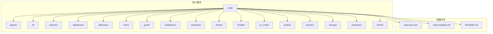

**图表来源**
- [vivify/__main__.py:1-6](file://vivify/__main__.py#L1-L6)
- [vivify/cli/main.py:1-58](file://vivify/cli/main.py#L1-L58)

**章节来源**
- [README.md:1-145](file://README.md#L1-L145)
- [pyproject.toml:1-70](file://pyproject.toml#L1-L70)

## 核心组件

### CLI入口点

系统通过命令行接口提供统一的入口点，支持多种操作模式：

- **初始化**：`vivify init` - 交互式项目初始化，包含增强的认证配置流程
- **运行模式**：`vivify run` - 守护进程模式
- **诊断**：`vivify doctor` - 环境验证，检查认证配置状态
- **功能管理**：`vivify features` - 特性请求管理
- **探针管理**：`vivify probes` - 探针测试和启用
- **修复器管理**：`vivify fixers` - 修复器测试和启用

### GitHub Issue报告器

`GithubIssueReporter`类实现了将高严重性事件镜像到GitHub Issues的功能：

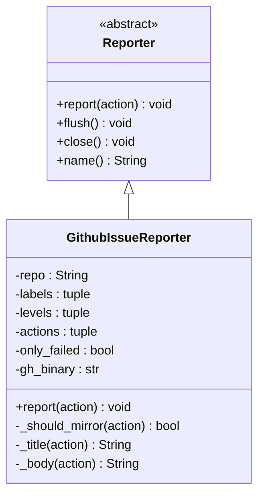

**图表来源**
- [vivify/interfaces/reporter.py:17-37](file://vivify/interfaces/reporter.py#L17-L37)
- [vivify/reporter/github_issue_reporter.py:20-107](file://vivify/reporter/github_issue_reporter.py#L20-L107)

**章节来源**
- [vivify/reporter/github_issue_reporter.py:1-107](file://vivify/reporter/github_issue_reporter.py#L1-L107)
- [vivify/interfaces/reporter.py:1-37](file://vivify/interfaces/reporter.py#L1-L37)

## 架构概览

系统采用分层架构设计，从底层基础设施到上层应用功能形成清晰的层次结构：

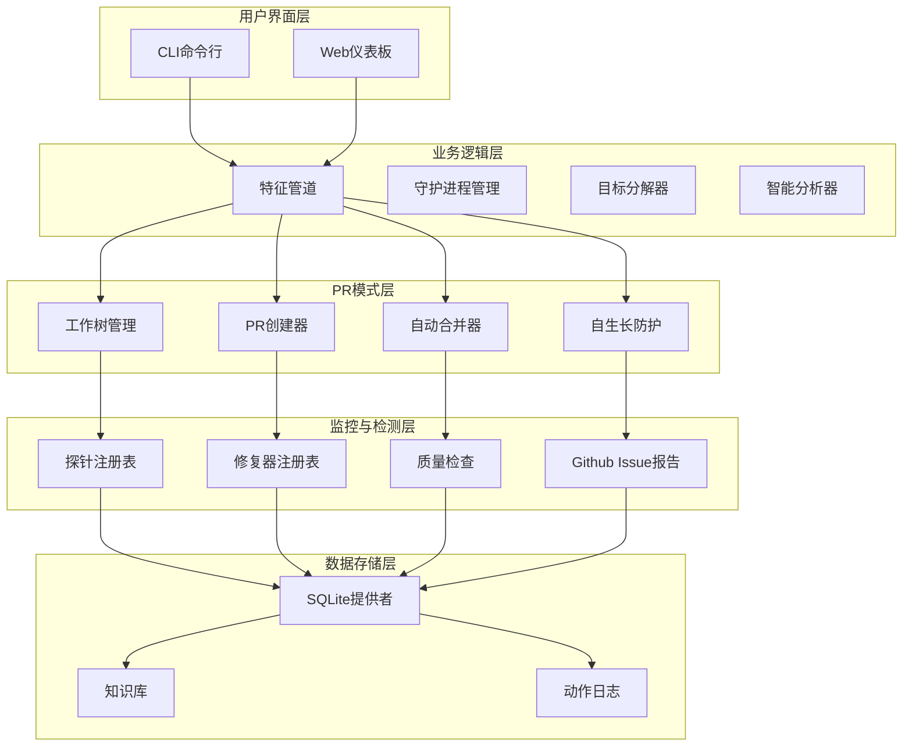

**图表来源**
- [vivify/kernel/feature_pipeline.py:79-379](file://vivify/kernel/feature_pipeline.py#L79-L379)
- [vivify/pr_mode/worktree.py:43-176](file://vivify/pr_mode/worktree.py#L43-L176)
- [vivify/pr_mode/pr_creator.py:63-178](file://vivify/pr_mode/pr_creator.py#L63-L178)

## GitHub认证系统增强

### 层次化认证配置系统

系统实现了全新的层次化认证配置架构，支持从实例级别到全局级别的多层配置管理：

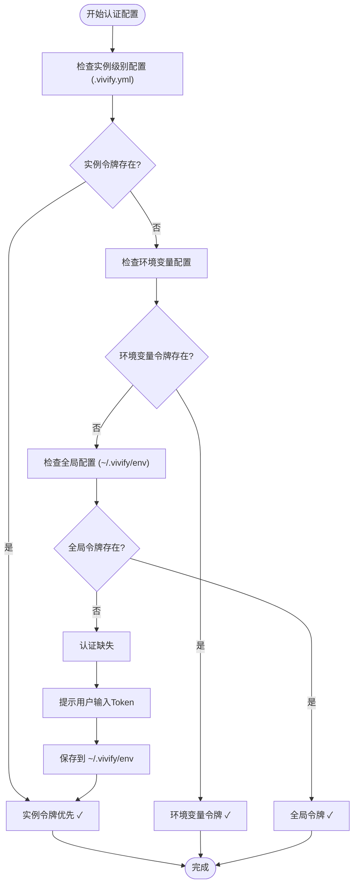

**图表来源**
- [vivify/daemon/manager.py:72-93](file://vivify/daemon/manager.py#L72-L93)
- [vivify/dashboard/app.py:175-212](file://vivify/dashboard/app.py#L175-L212)

### 实例级别令牌配置

系统现在支持在项目级别的`.vivify.yml`文件中直接配置GitHub令牌，提供更高的灵活性和安全性：

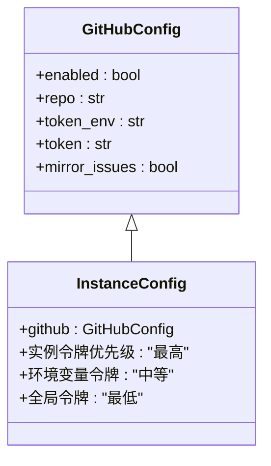

**图表来源**
- [vivify/config/schema.py:68-73](file://vivify/config/schema.py#L68-L73)
- [vivify/cli/init_cmd.py:201-211](file://vivify/cli/init_cmd.py#L201-L211)

#### 实例配置参数

| 参数名称 | 类型 | 默认值 | 描述 | 优先级 |
|---------|------|--------|------|--------|
| github.enabled | bool | True | 是否启用GitHub集成 | 低 |
| github.repo | str | "" | GitHub仓库名称，为空时自动检测 | 低 |
| github.token_env | str | "GH_TOKEN" | 环境变量名 | 中等 |
| github.token | str | "" | 实例级别令牌 | **最高** |
| github.mirror_issues | bool | True | 是否镜像问题到GitHub Issues | 低 |

**更新** 新增了`github.token`参数，支持实例级别的直接令牌配置，优先级最高

**章节来源**
- [vivify/config/schema.py:68-73](file://vivify/config/schema.py#L68-L73)
- [.vivify.example.yml:35-40](file://.vivify.example.yml#L35-L40)

### 认证优先级机制

系统实现了明确的认证令牌优先级机制，确保配置的一致性和可预测性：

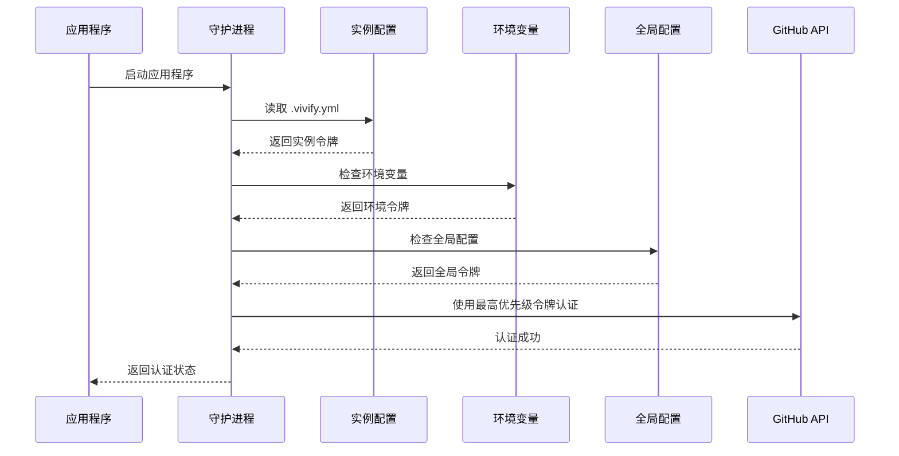

**图表来源**
- [vivify/daemon/manager.py:72-93](file://vivify/daemon/manager.py#L72-L93)
- [vivify/dashboard/app.py:175-212](file://vivify/dashboard/app.py#L175-L212)

#### 优先级规则

1. **实例级别令牌** (`github.token`) - **最高优先级**
   - 直接写入项目配置文件
   - 适用于单个项目或特定环境
   - 支持不同的令牌名称映射

2. **环境变量令牌** (`GH_TOKEN`或其他自定义名称)
   - 通过`token_env`参数配置
   - 适用于CI/CD环境和容器部署
   - 支持多环境分离

3. **全局令牌** (`~/.vivify/env`)
   - 传统配置方式
   - 适用于多个项目的共享配置
   - 作为最后的回退选项

**更新** 增强了环境变量继承机制，确保令牌正确传递给子进程

**章节来源**
- [vivify/daemon/manager.py:72-93](file://vivify/daemon/manager.py#L72-L93)
- [vivify/dashboard/app.py:175-212](file://vivify/dashboard/app.py#L175-L212)

### 环境变量继承增强

系统现在实现了统一的环境变量继承机制，确保GitHub认证令牌在所有子进程中正确传递：

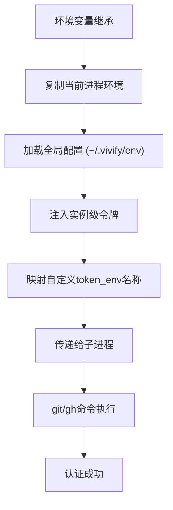

**图表来源**
- [vivify/pr_mode/pr_creator.py:43-54](file://vivify/pr_mode/pr_creator.py#L43-L54)
- [vivify/daemon/manager.py:62-93](file://vivify/daemon/manager.py#L62-L93)
- [vivify/deployers/command.py:66-77](file://vivify/deployers/command.py#L66-L77)

#### 环境变量继承策略

1. **守护进程管理器** (`vivify/daemon/manager.py`)
   - 复制父进程环境变量
   - 加载全局配置文件
   - 注入实例级GitHub令牌
   - 支持自定义token_env名称映射

2. **PR创建器** (`vivify/pr_mode/pr_creator.py`)
   - 显式继承当前进程环境
   - 确保子进程获得完整的环境变量
   - 支持各种命令行工具的认证需求

3. **命令部署器** (`vivify/deployers/command.py`)
   - 统一的环境变量构建策略
   - 继承父进程环境并加载全局配置

**更新** 新增了显式的环境变量继承机制，确保GitHub认证令牌在所有子进程中正确传递

**章节来源**
- [vivify/pr_mode/pr_creator.py:43-54](file://vivify/pr_mode/pr_creator.py#L43-L54)
- [vivify/daemon/manager.py:62-93](file://vivify/daemon/manager.py#L62-L93)
- [vivify/deployers/command.py:66-77](file://vivify/deployers/command.py#L66-L77)

### 环境文件管理

系统支持通过`~/.vivify/env`文件管理全局认证配置，同时保留实例级别的优先级：

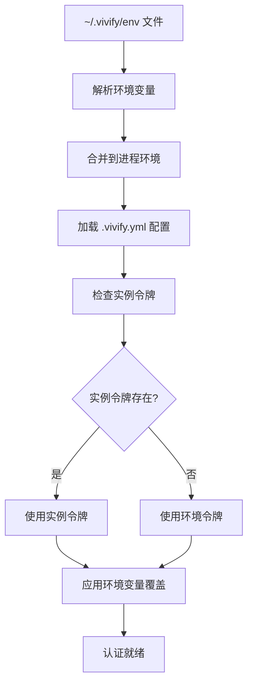

**图表来源**
- [vivify/deployers/command.py:66-77](file://vivify/deployers/command.py#L66-L77)
- [vivify/cli/init_cmd.py:204-221](file://vivify/cli/init_cmd.py#L204-L221)

**章节来源**
- [vivify/deployers/command.py:66-77](file://vivify/deployers/command.py#L66-L77)
- [vivify/cli/init_cmd.py:204-221](file://vivify/cli/init_cmd.py#L204-L221)

### 认证验证机制

系统提供多种认证验证方式，支持层次化配置的完整验证：

1. **实例配置验证**：检查`.vivify.yml`中的`github.token`配置
2. **环境变量验证**：检查`token_env`指定的环境变量
3. **全局配置验证**：检查`~/.vivify/env`文件中的认证信息
4. **实时状态检查**：在运行时动态验证认证状态

**更新** 新增了环境变量继承验证，确保令牌在子进程中的正确传递

**章节来源**
- [vivify/cli/doctor_cmd.py:48-71](file://vivify/cli/doctor_cmd.py#L48-L71)
- [vivify/dashboard/app.py:175-212](file://vivify/dashboard/app.py#L175-L212)

## AutoMerge 功能增强

### 轮询机制改进

AutoMerge功能现在支持更精细的轮询控制，通过新增的配置参数实现：

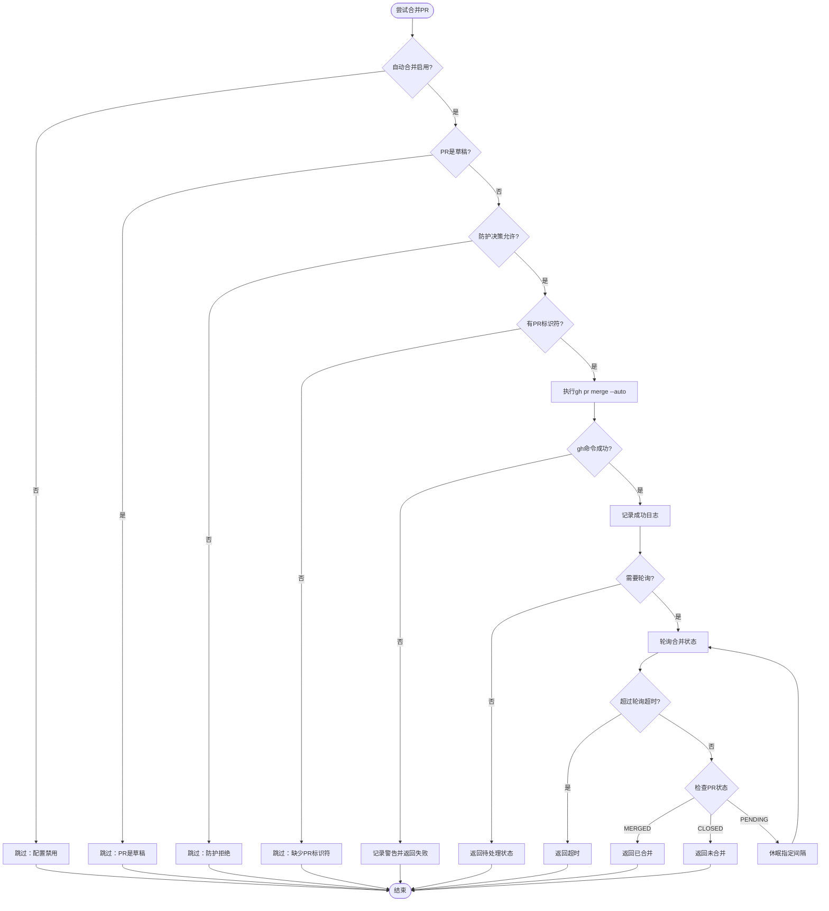

**图表来源**
- [vivify/pr_mode/auto_merge.py:63-117](file://vivify/pr_mode/auto_merge.py#L63-L117)

#### 新增配置参数

| 参数名称 | 类型 | 默认值 | 描述 |
|---------|------|--------|------|
| poll_timeout_seconds | int | 0 | 轮询超时时间（秒），0表示不轮询 |
| poll_interval_seconds | int | 30 | 轮询间隔时间（秒） |
| gh_timeout_seconds | int | 60 | GitHub命令超时时间（秒） |

**更新** 新增了轮询机制的两个关键参数，提供更精确的控制

**章节来源**
- [vivify/pr_mode/auto_merge.py:30-37](file://vivify/pr_mode/auto_merge.py#L30-L37)
- [vivify/config/schema.py:24-25](file://vivify/config/schema.py#L24-L25)
- [vivify/cli/run_cmd.py:124-128](file://vivify/cli/run_cmd.py#L124-L128)

### 错误处理逻辑改进

AutoMerge现在提供了更完善的错误处理机制：

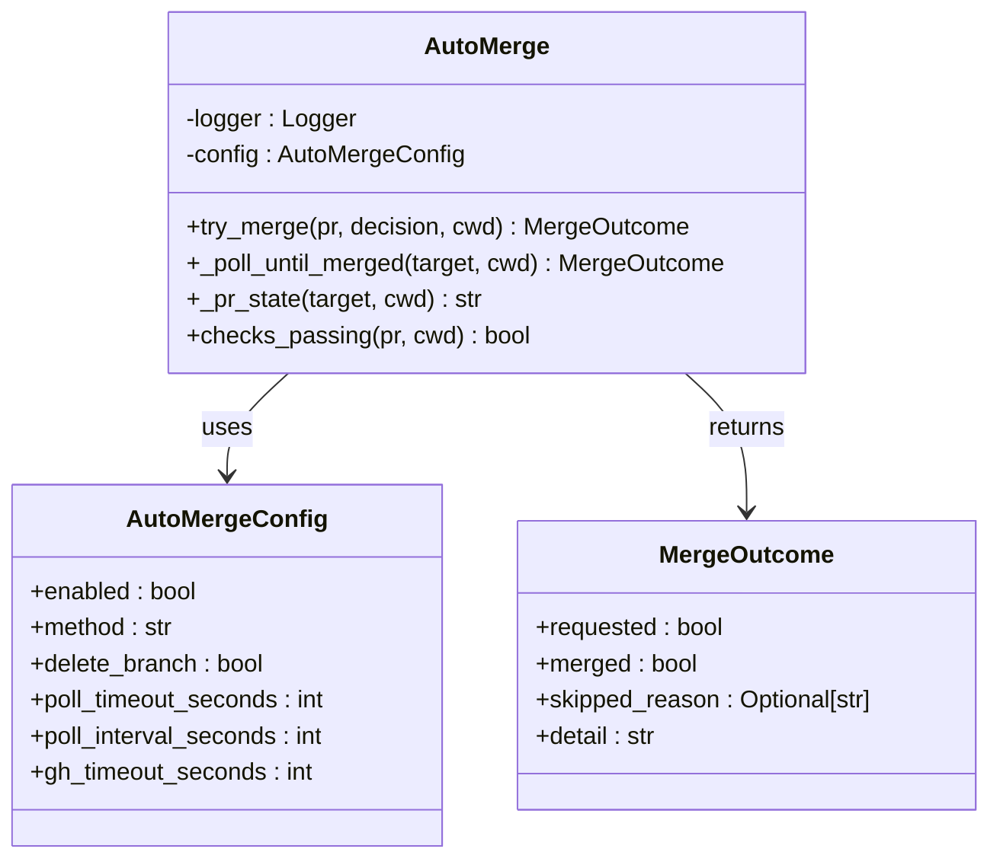

**图表来源**
- [vivify/pr_mode/auto_merge.py:29-45](file://vivify/pr_mode/auto_merge.py#L29-L45)
- [vivify/pr_mode/auto_merge.py:56-138](file://vivify/pr_mode/auto_merge.py#L56-L138)

#### 错误处理状态

| 状态类型 | 触发条件 | 返回值 | 说明 |
|---------|----------|--------|------|
| 请求成功 | gh命令执行成功 | requested=True, merged=False | PR已请求自动合并 |
| 请求失败 | gh命令执行失败 | requested=True, merged=False | 记录错误详情 |
| 跳过合并 | 配置禁用/草稿PR/防护拒绝/缺少标识符 | requested=False | 返回跳过原因 |
| 轮询超时 | 超过poll_timeout_seconds | requested=True, merged=False | 返回超时状态 |
| PR已合并 | 轮询检测到MERGED | requested=True, merged=True | PR已成功合并 |
| PR已关闭 | 轮询检测到CLOSED | requested=True, merged=False | PR未合并 |

**更新** 改进了错误处理逻辑，提供更详细的错误状态和原因

**章节来源**
- [vivify/pr_mode/auto_merge.py:63-138](file://vivify/pr_mode/auto_merge.py#L63-L138)
- [tests/unit/test_pr_mode.py:145-185](file://tests/unit/test_pr_mode.py#L145-L185)

### 配置集成

AutoMerge功能现在与主配置系统深度集成：

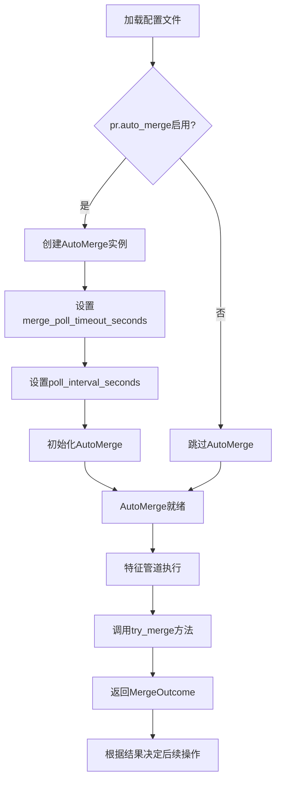

**图表来源**
- [vivify/cli/run_cmd.py:124-128](file://vivify/cli/run_cmd.py#L124-L128)
- [vivify/config/schema.py:20-26](file://vivify/config/schema.py#L20-L26)

**更新** AutoMerge现在通过配置系统自动加载，支持动态配置调整

**章节来源**
- [vivify/cli/run_cmd.py:124-128](file://vivify/cli/run_cmd.py#L124-L128)
- [vivify/config/schema.py:20-26](file://vivify/config/schema.py#L20-L26)

## 详细组件分析

### 特征管道系统

特征管道是系统的核心执行引擎，负责完整的特性开发流程：

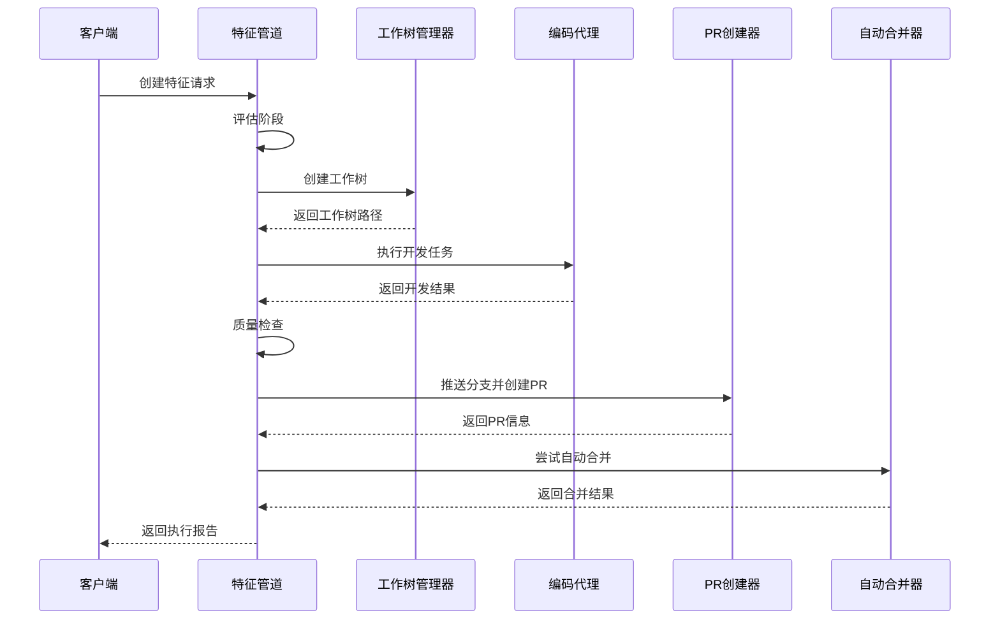

**图表来源**
- [vivify/kernel/feature_pipeline.py:102-260](file://vivify/kernel/feature_pipeline.py#L102-L260)

#### 核心配置参数

| 参数名称 | 类型 | 默认值 | 描述 |
|---------|------|--------|------|
| max_turns_evaluate | int | 20 | 评估阶段最大轮次 |
| max_turns_develop | int | 100 | 开发阶段最大轮次 |
| max_turns_verify | int | 20 | 验证阶段最大轮次 |
| timeout_evaluate_seconds | int | 600 | 评估超时时间 |
| timeout_develop_seconds | int | 3600 | 开发超时时间 |
| timeout_verify_seconds | int | 600 | 验证超时时间 |
| quality_test_command | str | None | 质量测试命令 |
| quality_run_pytest | bool | False | 是否运行pytest |

**章节来源**
- [vivify/kernel/feature_pipeline.py:49-72](file://vivify/kernel/feature_pipeline.py#L49-L72)

### 工作树管理系统

工作树管理器提供了隔离的开发环境，确保每次特性开发都在独立的工作环境中进行：

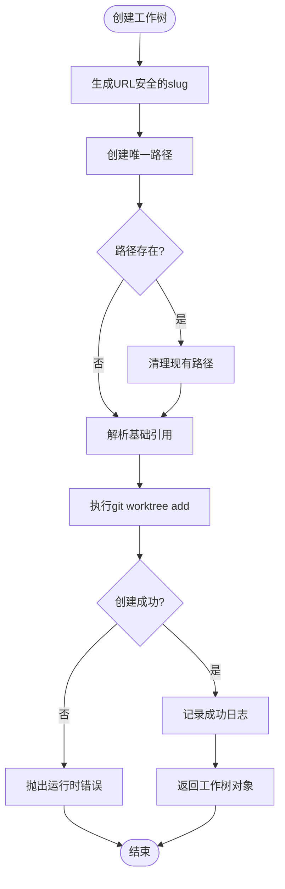

**图表来源**
- [vivify/pr_mode/worktree.py:68-92](file://vivify/pr_mode/worktree.py#L68-L92)

#### 工作树配置

| 配置项 | 类型 | 默认值 | 描述 |
|-------|------|--------|------|
| worktree_base | Path | .vivify/worktrees | 工作树基础目录 |
| branch_prefix | str | vivify/ | 分支前缀 |
| base_branch | str | main | 基础分支 |
| fetch_before_create | bool | True | 创建前是否获取 |
| fetch_timeout | int | 120 | 获取超时时间 |

**章节来源**
- [vivify/pr_mode/worktree.py:46-66](file://vivify/pr_mode/worktree.py#L46-L66)

### PR创建与管理

PR创建器负责将本地变更推送到远程仓库并创建Pull Request：

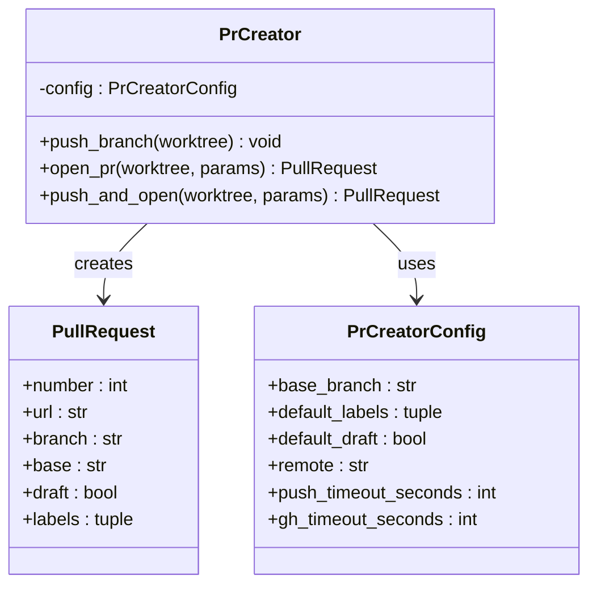

**图表来源**
- [vivify/pr_mode/pr_creator.py:63-178](file://vivify/pr_mode/pr_creator.py#L63-L178)

**更新** PR创建器现在使用显式的环境变量继承，确保GitHub认证令牌正确传递给git和gh命令

**章节来源**
- [vivify/pr_mode/pr_creator.py:1-178](file://vivify/pr_mode/pr_creator.py#L1-L178)

### 自动合并机制

自动合并器实现了智能的PR合并策略，结合GitHub原生功能和系统配置：

**图表来源**
- [vivify/pr_mode/auto_merge.py:63-117](file://vivify/pr_mode/auto_merge.py#L63-L117)

**更新** AutoMerge现在依赖于改进的环境变量继承机制，确保gh命令能够正确访问GitHub认证令牌

**章节来源**
- [vivify/pr_mode/auto_merge.py:1-141](file://vivify/pr_mode/auto_merge.py#L1-L141)

### 自生长防护系统

自生长防护确保AI对系统本身的修改保持安全性和可控性：

**图表来源**
- [vivify/pr_mode/self_grow_guard.py:77-112](file://vivify/pr_mode/self_grow_guard.py#L77-L112)

#### 防护规则

| 差异类型 | 标签 | 强制草稿 | 允许自动合并 |
|---------|------|----------|-------------|
| 外部 | 无 | 否 | 是 |
| 插件 | vivify:plugin-change | 否 | 是 |
| 内核 | vivify:kernel-change | 是 | 否 |
| 混合 | vivify:kernel-change, vivify:plugin-change | 是 | 否 |

**章节来源**
- [vivify/pr_mode/self_grow_guard.py:50-75](file://vivify/pr_mode/self_grow_guard.py#L50-L75)

### 质量门控系统

质量门控系统在PR创建前执行多层检查，确保代码质量：

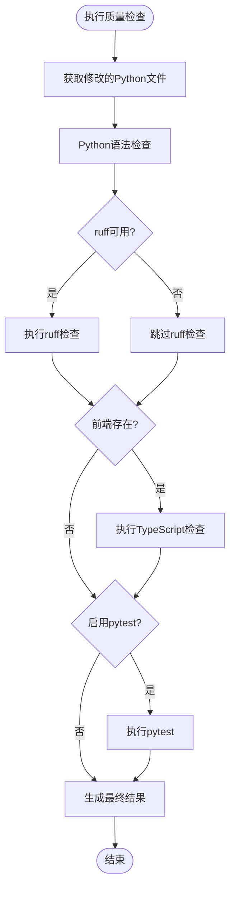

**图表来源**
- [vivify/pr_mode/quality_check.py:51-120](file://vivify/pr_mode/quality_check.py#L51-L120)

**章节来源**
- [vivify/pr_mode/quality_check.py:1-128](file://vivify/pr_mode/quality_check.py#L1-L128)

## 依赖关系分析

系统采用松耦合的设计，通过接口和抽象类实现模块间的解耦：

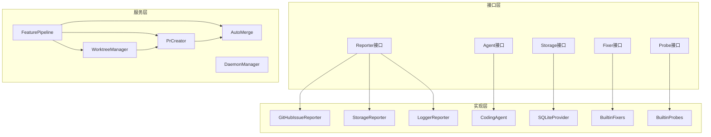

**图表来源**
- [vivify/interfaces/reporter.py:17-37](file://vivify/interfaces/reporter.py#L17-L37)
- [vivify/kernel/feature_pipeline.py:82-99](file://vivify/kernel/feature_pipeline.py#L82-L99)

### 外部依赖

系统依赖以下关键外部组件：

| 组件 | 版本要求 | 用途 |
|------|----------|------|
| Python | >=3.10 | 运行时环境 |
| git | 最新版 | 版本控制 |
| gh | 最新版 | GitHub CLI |
| qodercli | 最新版 | AI编码代理 |
| GH_TOKEN | 环境变量 | GitHub认证 |

**章节来源**
- [pyproject.toml:22-27](file://pyproject.toml#L22-L27)
- [README.md:59-65](file://README.md#L59-L65)

## 性能考虑

### 并发处理

系统支持多进程并发执行，通过配置参数控制并发数量：

- **最大并发进程数**：默认10个
- **超时控制**：每个操作都有明确的超时限制
- **资源管理**：自动清理临时文件和工作树

### 缓存策略

- **工作树缓存**：避免重复创建相同的工作树
- **探针结果缓存**：减少重复的检测开销
- **配置缓存**：避免频繁的配置文件读取
- **认证状态缓存**：减少重复的认证检查

### 内存优化

- **流式处理**：大文件处理采用流式方式
- **延迟加载**：按需加载模块和数据
- **垃圾回收**：及时释放不再使用的对象

### AutoMerge性能优化

**更新** AutoMerge功能现在包含以下性能优化：

- **智能轮询**：当`poll_timeout_seconds=0`时，系统采用"fire-and-forget"模式，完全依赖GitHub原生`--auto`标志
- **最小化轮询开销**：轮询间隔至少5秒，避免过度轮询
- **超时控制**：每个GitHub命令都有独立的超时控制
- **错误快速失败**：gh命令失败时立即返回，不进行轮询

### 环境变量继承性能优化

**更新** 环境变量继承机制提供了以下性能优化：

- **延迟导入**：配置文件解析使用延迟导入，避免启动时的硬依赖
- **最小化复制**：只复制必要的环境变量，减少内存占用
- **快速失败**：配置读取失败不影响系统启动
- **统一策略**：所有子进程使用相同的环境变量继承策略

**章节来源**
- [vivify/pr_mode/auto_merge.py:101-116](file://vivify/pr_mode/auto_merge.py#L101-L116)
- [vivify/daemon/manager.py:72-93](file://vivify/daemon/manager.py#L72-L93)

## 故障排除指南

### 常见问题及解决方案

#### GitHub认证问题

**症状**：`gh`命令执行失败或PR创建失败
**原因**：缺少`GH_TOKEN`环境变量或认证过期
**解决方案**：
1. 设置`GH_TOKEN`环境变量
2. 运行`gh auth login`重新认证
3. 验证网络连接
4. 检查`~/.vivify/env`文件中的认证配置

**更新** 增强了认证配置流程，支持多种认证方式的自动检测和切换，包括实例级别的令牌配置和改进的环境变量继承机制

#### 层次化配置问题

**症状**：认证配置不生效或优先级异常
**原因**：实例配置与全局配置冲突
**解决方案**：
1. 检查`.vivify.yml`中的`github.token`配置
2. 验证`token_env`参数设置
3. 确认环境变量的优先级顺序
4. 使用`vivify doctor`检查配置状态

**新增** 关于层次化配置的专门故障排除指南

#### 环境变量继承问题

**症状**：子进程无法访问GitHub认证令牌
**原因**：环境变量未正确传递给子进程
**解决方案**：
1. 检查守护进程管理器的环境变量注入
2. 验证PR创建器的显式环境变量继承
3. 确认命令部署器的环境变量构建
4. 使用调试模式查看实际传递的环境变量

**新增** 关于环境变量继承机制的专门故障排除指南

#### AutoMerge轮询问题

**症状**：PR长时间处于待合并状态或轮询超时
**原因**：轮询配置不当或GitHub检查未完成
**解决方案**：
1. 检查`merge_poll_timeout_seconds`配置
2. 验证`poll_interval_seconds`设置
3. 确认GitHub分支保护设置
4. 查看AutoMerge日志输出

**新增** 关于AutoMerge轮询机制的专门故障排除指南

#### 权限问题

**症状**：PR创建失败
**原因**：仓库权限不足
**解决方案**：
1. 确认仓库具有写权限
2. 检查分支保护设置
3. 验证GitHub Token权限范围

#### 超时问题

**症状**：操作超时
**原因**：网络延迟或系统负载过高
**解决方案**：
1. 增加超时配置
2. 减少并发操作
3. 检查系统资源使用情况

### 认证诊断工具

系统提供多种认证诊断工具：

- **vivify doctor**：全面检查认证配置状态，支持层次化配置验证
- **仪表板认证检查**：实时显示认证状态，区分实例、环境和全局配置
- **初始化向导**：引导用户完成认证配置，支持实例级别令牌设置

**更新** 诊断工具现在支持层次化配置的完整验证和环境变量继承状态检查

### AutoMerge诊断工具

**新增** AutoMerge功能包含以下诊断工具：

- **轮询状态检查**：验证轮询配置的有效性
- **GitHub检查状态**：确认GitHub检查是否通过
- **合并结果跟踪**：跟踪PR合并过程中的所有状态变化

### 环境变量继承诊断工具

**新增** 环境变量继承机制包含以下诊断工具：

- **环境变量状态检查**：验证令牌在子进程中的传递状态
- **继承链追踪**：显示环境变量的继承路径和来源
- **配置冲突检测**：识别可能影响令牌传递的配置冲突

**章节来源**
- [vivify/cli/doctor_cmd.py:48-84](file://vivify/cli/doctor_cmd.py#L48-L84)
- [vivify/dashboard/app.py:175-212](file://vivify/dashboard/app.py#L175-L212)

## 结论

GitHub认证系统增强提供了一个完整、安全、可扩展的自动化解决方案。通过模块化设计和严格的防护机制，系统能够在保证安全性的前提下实现智能化的代码管理和维护。

### 主要优势

1. **安全性**：所有代码变更必须通过Pull Request审查
2. **可扩展性**：模块化设计支持功能扩展
3. **智能化**：AI驱动的代码分析和修复
4. **可观测性**：完整的日志记录和监控
5. **易用性**：简洁的命令行接口和配置选项
6. **增强认证**：支持多种认证方式和层次化配置管理
7. **实例级别控制**：提供细粒度的令牌管理能力
8. **向后兼容**：保持与现有配置的兼容性
9. **增强的AutoMerge功能**：提供精确的轮询控制和改进的错误处理
10. **可靠环境变量继承**：确保GitHub认证令牌正确传递给子进程，提升系统可靠性

### 未来发展方向

- **GitHub Actions集成**：支持云端自动化执行
- **多代理支持**：扩展支持其他AI编码平台
- **Web界面**：提供图形化管理界面
- **容器化部署**：支持Docker和Kubernetes部署
- **认证令牌管理**：提供更完善的令牌生命周期管理
- **配置模板系统**：支持认证配置的模板化管理
- **AutoMerge智能调度**：根据项目规模和重要性自动调整轮询策略
- **增强的环境变量管理**：提供更精细的环境变量继承和管理机制

该系统为现代软件开发团队提供了强大的自动化工具，能够显著提高开发效率和代码质量。新的层次化认证配置系统为不同规模和复杂度的项目提供了灵活的配置选择，从简单的个人项目到复杂的多环境部署场景都能得到很好的支持。AutoMerge功能的增强进一步提升了系统的自动化能力和用户体验，为项目的持续集成和交付提供了更加可靠的保障。环境变量继承机制的改进确保了GitHub认证令牌在所有子进程中的正确传递，大大提升了系统的稳定性和可靠性。