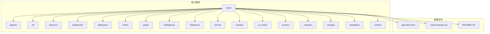
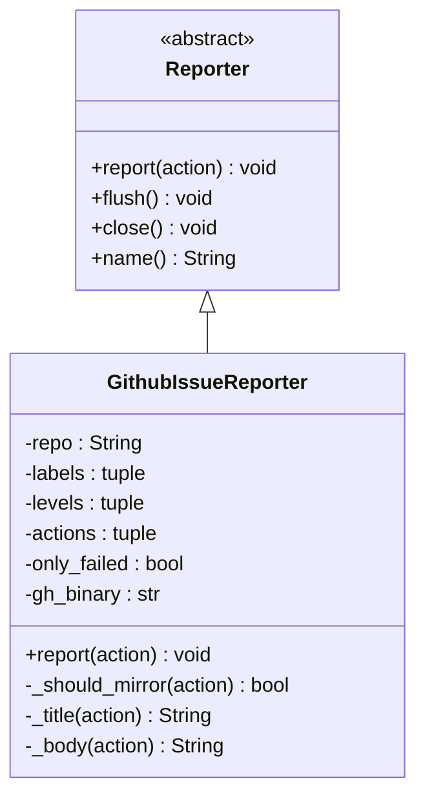
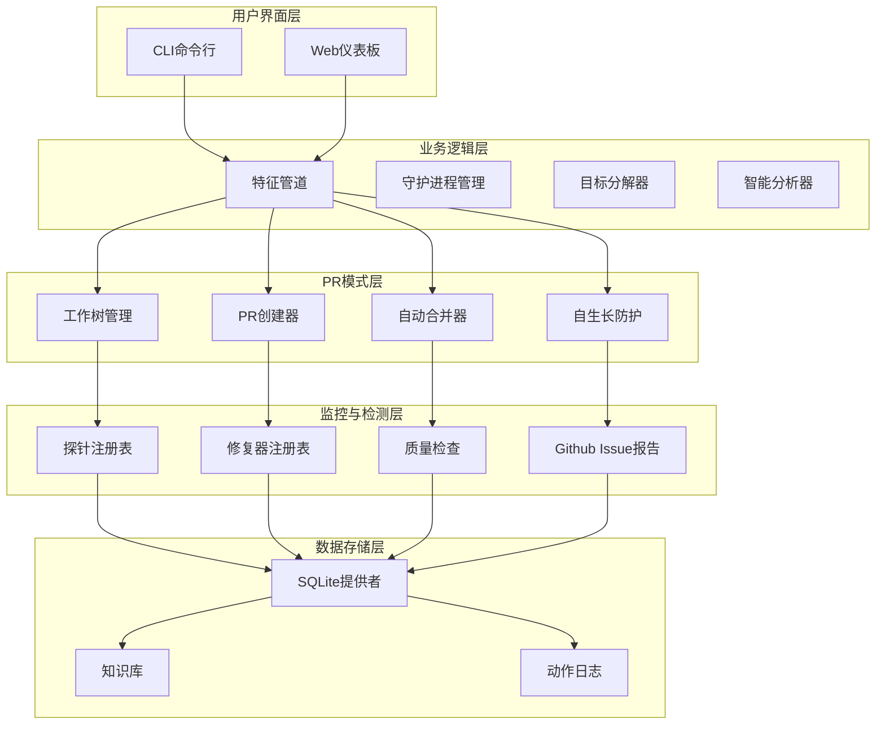
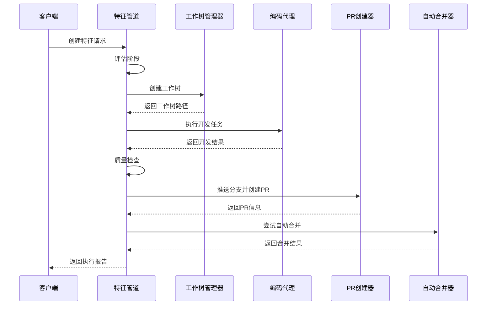
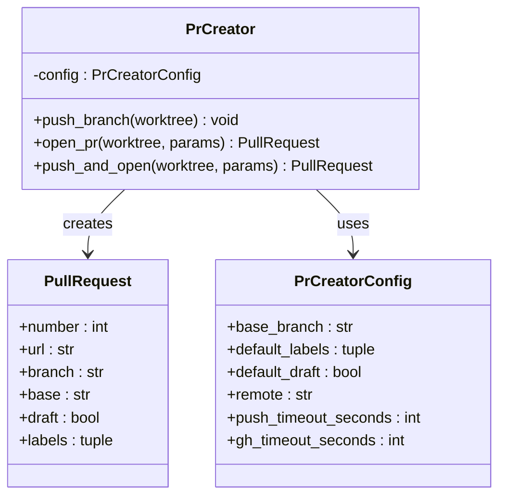
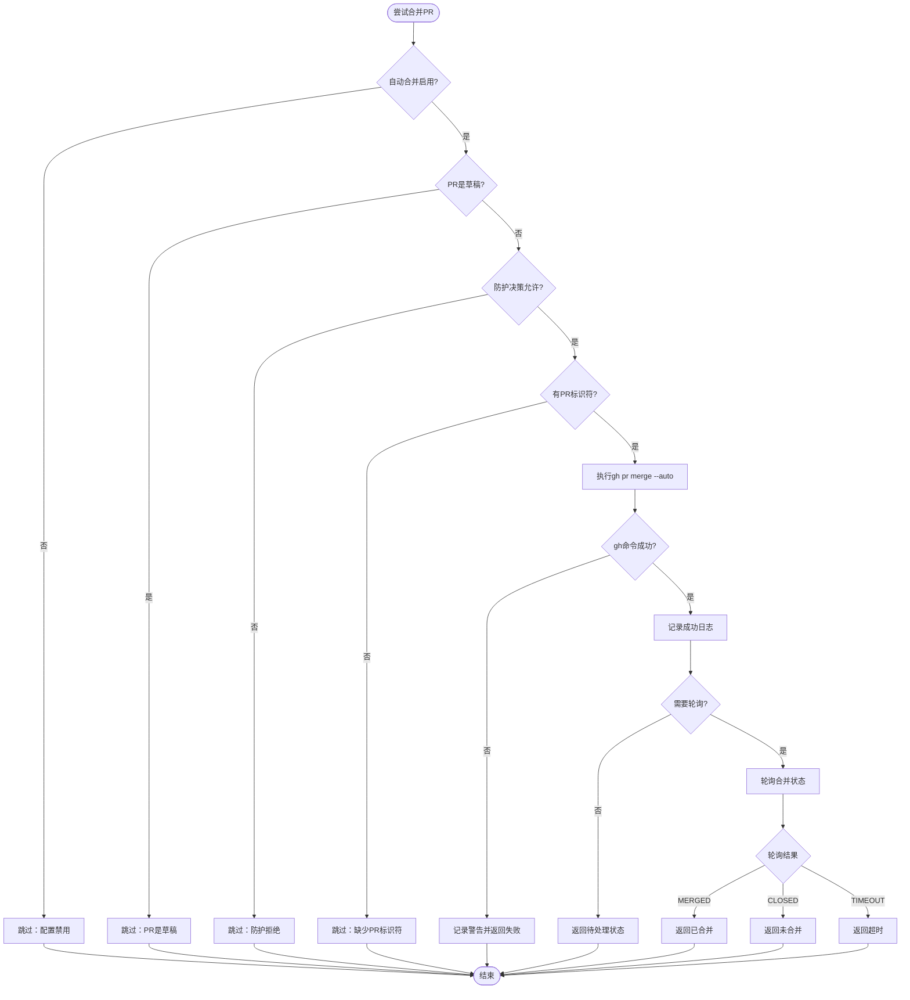
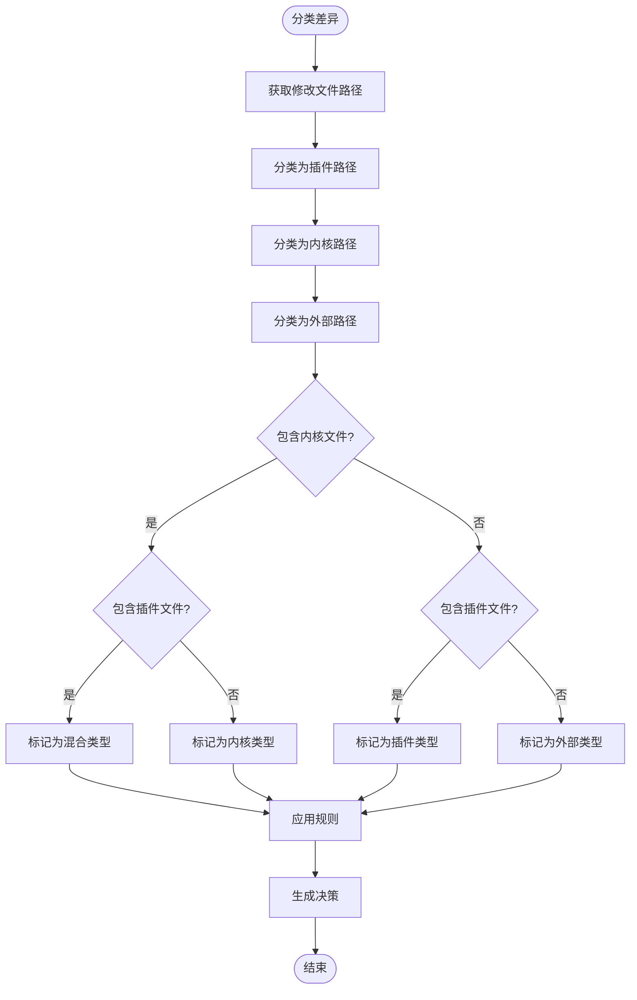
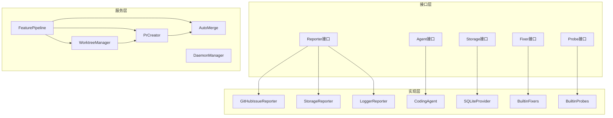

# GitHub认证系统增强

<cite>
**本文档引用的文件**
- [README.md](file://README.md)
- [pyproject.toml](file://pyproject.toml)
- [.vivify.example.yml](file://.vivify.example.yml)
- [vivify/__main__.py](file://vivify/__main__.py)
- [vivify/cli/main.py](file://vivify/cli/main.py)
- [vivify/reporter/github_issue_reporter.py](file://vivify/reporter/github_issue_reporter.py)
- [vivify/interfaces/reporter.py](file://vivify/interfaces/reporter.py)
- [vivify/models/snapshot.py](file://vivify/models/snapshot.py)
- [vivify/pr_mode/auto_merge.py](file://vivify/pr_mode/auto_merge.py)
- [vivify/pr_mode/pr_creator.py](file://vivify/pr_mode/pr_creator.py)
- [vivify/pr_mode/self_grow_guard.py](file://vivify/pr_mode/self_grow_guard.py)
- [vivify/pr_mode/worktree.py](file://vivify/pr_mode/worktree.py)
- [vivify/pr_mode/quality_check.py](file://vivify/pr_mode/quality_check.py)
- [vivify/kernel/feature_pipeline.py](file://vivify/kernel/feature_pipeline.py)
- [vivify/config/defaults.py](file://vivify/config/defaults.py)
</cite>

## 目录
1. [简介](#简介)
2. [项目结构](#项目结构)
3. [核心组件](#核心组件)
4. [架构概览](#架构概览)
5. [详细组件分析](#详细组件分析)
6. [依赖关系分析](#依赖关系分析)
7. [性能考虑](#性能考虑)
8. [故障排除指南](#故障排除指南)
9. [结论](#结论)

## 简介

GitHub认证系统增强是一个基于Python的智能自动化系统，专为GitHub仓库设计，提供自学习、自修复和自主进化的功能。该系统通过集成多种技术组件，实现了从问题检测到解决方案实施的完整自动化流程。

### 主要特性

- **智能检测与修复**：12+种可插拔探针持续监控项目健康状况
- **自动PR创建**：所有代码变更通过Pull Request提交，确保安全性
- **AI驱动开发**：利用Qoder CLI进行智能代码开发和修复
- **自生长能力**：AI可以优化自身的探针和修复器
- **质量门控**：严格的预PR质量检查确保代码质量
- **问题镜像**：高严重性事件自动镜像到GitHub Issues

### 技术栈

- **核心语言**：Python 3.10+
- **主要依赖**：pydantic、PyYAML、Jinja2、requests
- **可选依赖**：FastAPI、Uvicorn（仪表板功能）
- **外部工具**：git、gh（GitHub CLI）、qodercli

## 项目结构

项目采用模块化架构设计，按照功能层次组织代码：

**图表来源**
- [vivify/__main__.py:1-6](file://vivify/__main__.py#L1-L6)
- [vivify/cli/main.py:1-58](file://vivify/cli/main.py#L1-L58)

**章节来源**
- [README.md:1-145](file://README.md#L1-L145)
- [pyproject.toml:1-70](file://pyproject.toml#L1-L70)

## 核心组件

### CLI入口点

系统通过命令行接口提供统一的入口点，支持多种操作模式：

- **初始化**：`vivify init` - 交互式项目初始化
- **运行模式**：`vivify run` - 守护进程模式
- **诊断**：`vivify doctor` - 环境验证
- **功能管理**：`vivify features` - 特性请求管理
- **探针管理**：`vivify probes` - 探针测试和启用
- **修复器管理**：`vivify fixers` - 修复器测试和启用

### GitHub Issue报告器

`GithubIssueReporter`类实现了将高严重性事件镜像到GitHub Issues的功能：

**图表来源**
- [vivify/interfaces/reporter.py:17-37](file://vivify/interfaces/reporter.py#L17-L37)
- [vivify/reporter/github_issue_reporter.py:20-107](file://vivify/reporter/github_issue_reporter.py#L20-L107)

**章节来源**
- [vivify/reporter/github_issue_reporter.py:1-107](file://vivify/reporter/github_issue_reporter.py#L1-L107)
- [vivify/interfaces/reporter.py:1-37](file://vivify/interfaces/reporter.py#L1-L37)

## 架构概览

系统采用分层架构设计，从底层基础设施到上层应用功能形成清晰的层次结构：

**图表来源**
- [vivify/kernel/feature_pipeline.py:79-379](file://vivify/kernel/feature_pipeline.py#L79-L379)
- [vivify/pr_mode/worktree.py:43-176](file://vivify/pr_mode/worktree.py#L43-L176)
- [vivify/pr_mode/pr_creator.py:63-178](file://vivify/pr_mode/pr_creator.py#L63-L178)

## 详细组件分析

### 特征管道系统

特征管道是系统的核心执行引擎，负责完整的特性开发流程：

**图表来源**
- [vivify/kernel/feature_pipeline.py:102-260](file://vivify/kernel/feature_pipeline.py#L102-L260)

#### 核心配置参数

| 参数名称 | 类型 | 默认值 | 描述 |
|---------|------|--------|------|
| max_turns_evaluate | int | 20 | 评估阶段最大轮次 |
| max_turns_develop | int | 100 | 开发阶段最大轮次 |
| max_turns_verify | int | 20 | 验证阶段最大轮次 |
| timeout_evaluate_seconds | int | 600 | 评估超时时间 |
| timeout_develop_seconds | int | 3600 | 开发超时时间 |
| timeout_verify_seconds | int | 600 | 验证超时时间 |
| quality_test_command | str | None | 质量测试命令 |
| quality_run_pytest | bool | False | 是否运行pytest |

**章节来源**
- [vivify/kernel/feature_pipeline.py:49-72](file://vivify/kernel/feature_pipeline.py#L49-L72)

### 工作树管理系统

工作树管理器提供了隔离的开发环境，确保每次特性开发都在独立的工作环境中进行：

**图表来源**
- [vivify/pr_mode/worktree.py:68-92](file://vivify/pr_mode/worktree.py#L68-L92)

#### 工作树配置

| 配置项 | 类型 | 默认值 | 描述 |
|-------|------|--------|------|
| worktree_base | Path | .vivify/worktrees | 工作树基础目录 |
| branch_prefix | str | vivify/ | 分支前缀 |
| base_branch | str | main | 基础分支 |
| fetch_before_create | bool | True | 创建前是否获取 |
| fetch_timeout | int | 120 | 获取超时时间 |

**章节来源**
- [vivify/pr_mode/worktree.py:46-66](file://vivify/pr_mode/worktree.py#L46-L66)

### PR创建与管理

PR创建器负责将本地变更推送到远程仓库并创建Pull Request：

**图表来源**
- [vivify/pr_mode/pr_creator.py:63-178](file://vivify/pr_mode/pr_creator.py#L63-L178)

**章节来源**
- [vivify/pr_mode/pr_creator.py:1-178](file://vivify/pr_mode/pr_creator.py#L1-L178)

### 自动合并机制

自动合并器实现了智能的PR合并策略，结合GitHub原生功能和系统配置：

**图表来源**
- [vivify/pr_mode/auto_merge.py:63-117](file://vivify/pr_mode/auto_merge.py#L63-L117)

**章节来源**
- [vivify/pr_mode/auto_merge.py:1-141](file://vivify/pr_mode/auto_merge.py#L1-L141)

### 自生长防护系统

自生长防护确保AI对系统本身的修改保持安全性和可控性：

**图表来源**
- [vivify/pr_mode/self_grow_guard.py:77-112](file://vivify/pr_mode/self_grow_guard.py#L77-L112)

#### 防护规则

| 差异类型 | 标签 | 强制草稿 | 允许自动合并 |
|---------|------|----------|-------------|
| 外部 | 无 | 否 | 是 |
| 插件 | vivify:plugin-change | 否 | 是 |
| 内核 | vivify:kernel-change | 是 | 否 |
| 混合 | vivify:kernel-change, vivify:plugin-change | 是 | 否 |

**章节来源**
- [vivify/pr_mode/self_grow_guard.py:50-75](file://vivify/pr_mode/self_grow_guard.py#L50-L75)

### 质量门控系统

质量门控系统在PR创建前执行多层检查，确保代码质量：

**图表来源**
- [vivify/pr_mode/quality_check.py:51-120](file://vivify/pr_mode/quality_check.py#L51-L120)

**章节来源**
- [vivify/pr_mode/quality_check.py:1-128](file://vivify/pr_mode/quality_check.py#L1-L128)

## 依赖关系分析

系统采用松耦合的设计，通过接口和抽象类实现模块间的解耦：

**图表来源**
- [vivify/interfaces/reporter.py:17-37](file://vivify/interfaces/reporter.py#L17-L37)
- [vivify/kernel/feature_pipeline.py:82-99](file://vivify/kernel/feature_pipeline.py#L82-L99)

### 外部依赖

系统依赖以下关键外部组件：

| 组件 | 版本要求 | 用途 |
|------|----------|------|
| Python | >=3.10 | 运行时环境 |
| git | 最新版 | 版本控制 |
| gh | 最新版 | GitHub CLI |
| qodercli | 最新版 | AI编码代理 |
| GH_TOKEN | 环境变量 | GitHub认证 |

**章节来源**
- [pyproject.toml:22-27](file://pyproject.toml#L22-L27)
- [README.md:59-65](file://README.md#L59-L65)

## 性能考虑

### 并发处理

系统支持多进程并发执行，通过配置参数控制并发数量：

- **最大并发进程数**：默认10个
- **超时控制**：每个操作都有明确的超时限制
- **资源管理**：自动清理临时文件和工作树

### 缓存策略

- **工作树缓存**：避免重复创建相同的工作树
- **探针结果缓存**：减少重复的检测开销
- **配置缓存**：避免频繁的配置文件读取

### 内存优化

- **流式处理**：大文件处理采用流式方式
- **延迟加载**：按需加载模块和数据
- **垃圾回收**：及时释放不再使用的对象

## 故障排除指南

### 常见问题及解决方案

#### GitHub认证问题

**症状**：`gh`命令执行失败
**原因**：缺少`GH_TOKEN`环境变量或认证过期
**解决方案**：
1. 设置`GH_TOKEN`环境变量
2. 运行`gh auth login`重新认证
3. 验证网络连接

#### 权限问题

**症状**：PR创建失败
**原因**：仓库权限不足
**解决方案**：
1. 确认仓库具有写权限
2. 检查分支保护设置
3. 验证GitHub Token权限范围

#### 超时问题

**症状**：操作超时
**原因**：网络延迟或系统负载过高
**解决方案**：
1. 增加超时配置
2. 减少并发操作
3. 检查系统资源使用情况

### 调试模式

系统提供详细的日志记录功能：

- **INFO级别**：正常操作日志
- **DEBUG级别**：详细调试信息
- **WARNING级别**：潜在问题警告
- **ERROR级别**：错误信息

使用`-v`和`-vv`参数增加日志详细程度。

**章节来源**
- [vivify/reporter/github_issue_reporter.py:68-69](file://vivify/reporter/github_issue_reporter.py#L68-L69)
- [vivify/pr_mode/auto_merge.py:89-97](file://vivify/pr_mode/auto_merge.py#L89-L97)

## 结论

GitHub认证系统增强提供了一个完整、安全、可扩展的自动化解决方案。通过模块化设计和严格的防护机制，系统能够在保证安全性的前提下实现智能化的代码管理和维护。

### 主要优势

1. **安全性**：所有代码变更必须通过Pull Request审查
2. **可扩展性**：模块化设计支持功能扩展
3. **智能化**：AI驱动的代码分析和修复
4. **可观测性**：完整的日志记录和监控
5. **易用性**：简洁的命令行接口和配置选项

### 未来发展方向

- **GitHub Actions集成**：支持云端自动化执行
- **多代理支持**：扩展支持其他AI编码平台
- **Web界面**：提供图形化管理界面
- **容器化部署**：支持Docker和Kubernetes部署

该系统为现代软件开发团队提供了强大的自动化工具，能够显著提高开发效率和代码质量。