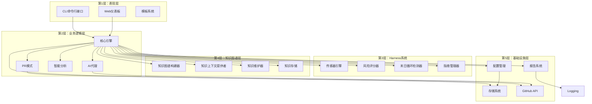
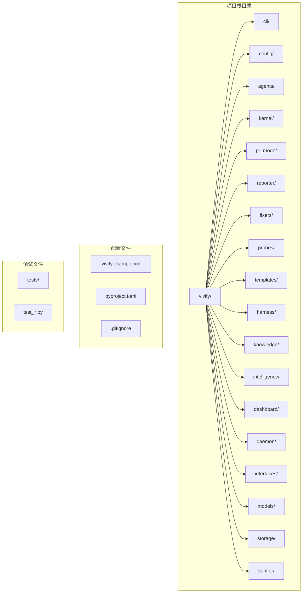
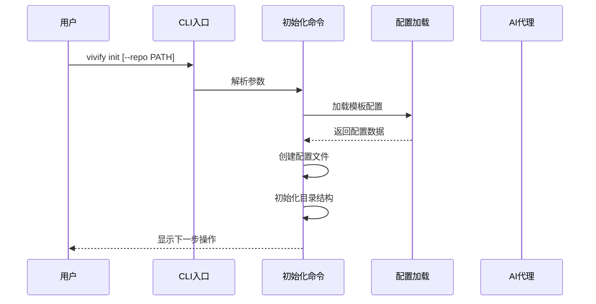
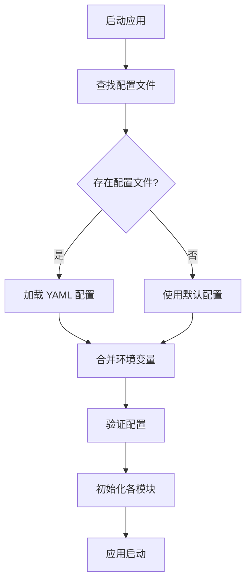
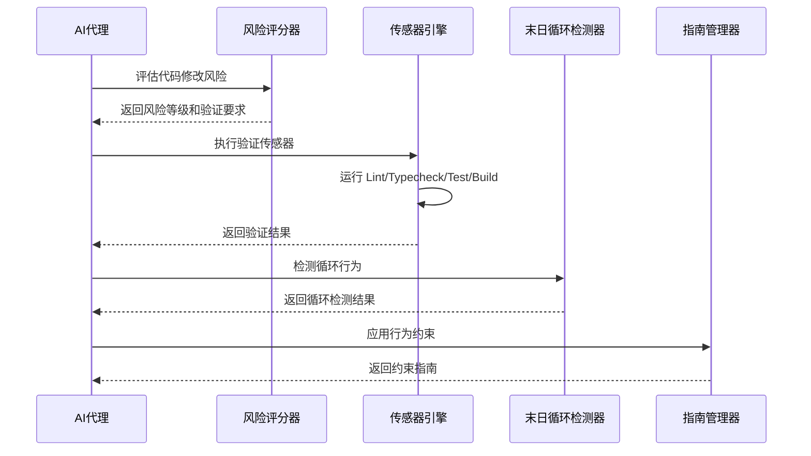
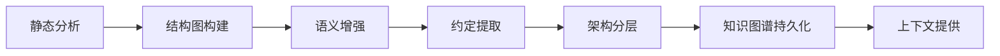
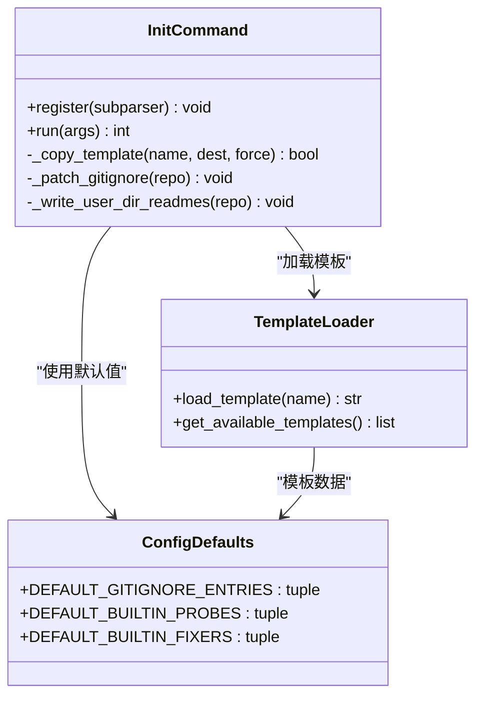
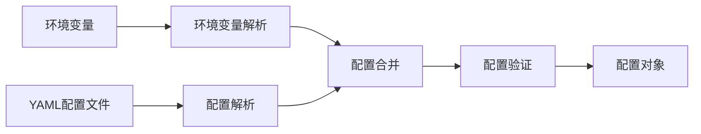
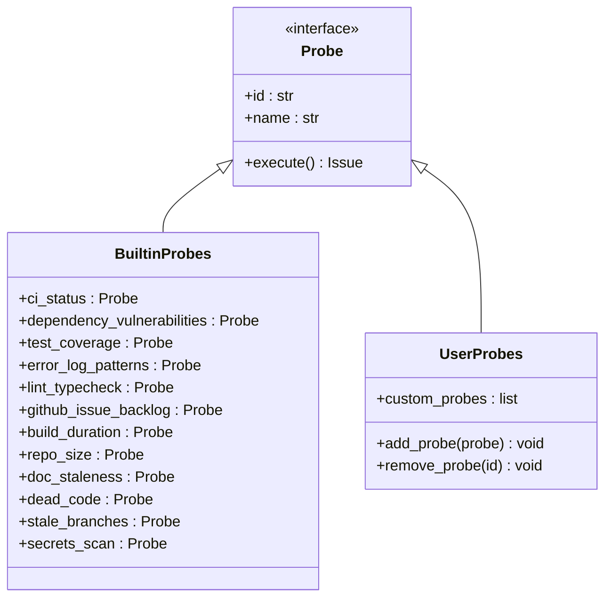
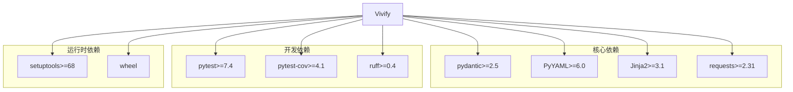

# 快速开始

<cite>
**本文档引用的文件**
- [00_READ_ME_FIRST.txt](file://00_READ_ME_FIRST.txt)
- [QUICK_REFERENCE.md](file://QUICK_REFERENCE.md)
- [REBRANDING_SUMMARY.md](file://REBRANDING_SUMMARY.md)
- [detailed_references.md](file://detailed_references.md)
- [rebranding_analysis.md](file://rebranding_analysis.md)
- [harness/__init__.py](file://vivify/harness/__init__.py)
- [doom_loop.py](file://vivify/harness/doom_loop.py)
- [guides.py](file://vivify/harness/guides.py)
- [models.py](file://vivify/harness/models.py)
- [risk_scorer.py](file://vivify/harness/risk_scorer.py)
- [sensors.py](file://vivify/harness/sensors.py)
- [builder.py](file://vivify/knowledge/builder.py)
- [context_provider.py](file://vivify/knowledge/context_provider.py)
- [maintainer.py](file://vivify/knowledge/maintainer.py)
- [storage.py](file://vivify/knowledge/storage.py)
- [models.py](file://vivify/knowledge/models.py)
- [schema.py](file://vivify/config/schema.py)
- [.vivify/knowledge/graph.json](file://.vivify/knowledge/graph.json)
</cite>

## 目录
1. [简介](#简介)
2. [五层架构](#五层架构)
3. [项目结构](#项目结构)
4. [核心组件](#核心组件)
5. [Harness 系统](#harness-系统)
6. [知识图谱功能](#知识图谱功能)
7. [详细组件分析](#详细组件分析)
8. [依赖关系分析](#依赖关系分析)
9. [性能考虑](#性能考虑)
10. [故障排除指南](#故障排除指南)
11. [结论](#结论)
12. [附录](#附录)

## 简介

Vivify 是一个自增长型 AI 代理项目，旨在为任何 GitHub 仓库提供智能扩展功能。该项目能够监控系统健康状况、自动修复问题、将目标分解为功能特性，并通过 PR 模式与 Qoder CLI 进行迭代开发。

本快速开始指南将帮助您完成 Vivify 项目的环境准备、安装配置和基本使用。项目基于 Python 3.10+ 开发，使用 setuptools + wheel 进行包管理。

**章节来源**
- [00_READ_ME_FIRST.txt:1-259](file://00_READ_ME_FIRST.txt#L1-L259)

## 五层架构

Vivify 采用创新的五层架构设计，每层都有明确的职责和交互关系：



**图表来源**
- [rebranding_analysis.md:201-240](file://rebranding_analysis.md#L201-L240)

### 架构层次详解

**第1层 - 表现层**：提供用户交互界面，包括 CLI 命令行工具和 Web 仪表板，支持可视化监控和配置管理。

**第2层 - 业务逻辑层**：核心业务处理层，包含核心引擎、PR 模式、AI 代理和智能分析模块，负责协调各组件工作。

**第3层 - Harness 系统**：验证和控制层，提供 PEV（计划-执行-验证）循环的完整解决方案，包括传感器验证、风险评估和行为约束。

**第4层 - 知识图谱层**：智能决策支持层，通过构建和维护项目知识图谱，为 AI 代理提供上下文信息和架构理解。

**第5层 - 基础设施层**：支撑服务层，包括配置管理、存储系统、GitHub API 集成和报告系统。

## 项目结构

Vivify 项目采用模块化的包结构设计，主要包含以下核心目录：



**图表来源**
- [rebranding_analysis.md:116-176](file://rebranding_analysis.md#L116-L176)
- [rebranding_analysis.md:201-240](file://rebranding_analysis.md#L201-L240)

### 目录组织原则

项目采用按功能域划分的模块化结构：

- **cli/**: 命令行接口实现，包含各个子命令的处理逻辑
- **config/**: 配置管理模块，负责配置文件解析和环境变量处理
- **agents/**: AI 代理相关功能，包括提示词模板和插槽管理
- **kernel/**: 核心引擎模块，处理主要业务逻辑
- **pr_mode/**: PR 模式相关功能，处理 GitHub PR 创建和管理
- **reporter/**: 报告和日志模块
- **fixers/**: 修复器模块，包含内置和用户自定义修复器
- **probes/**: 探针模块，检测系统健康状况
- **templates/**: 配置和模板文件
- **harness/**: PEV 循环基础设施，包括传感器、风险评分和行为约束
- **knowledge/**: 知识图谱构建和管理模块
- **intelligence/**: 智能分析模块，包括 RCA 和趋势分析
- **dashboard/**: Web 仪表板前端和后端
- **daemon/**: 守护进程管理
- **interfaces/**: 接口抽象层
- **models/**: 数据模型定义
- **storage/**: 存储抽象层
- **verifier/**: 验证器模块

**章节来源**
- [rebranding_analysis.md:14-31](file://rebranding_analysis.md#L14-L31)

## 核心组件

### CLI 命令系统

Vivify 提供了完整的命令行接口，支持多种操作模式：



**图表来源**
- [rebranding_analysis.md:474-566](file://rebranding_analysis.md#L474-L566)

### 配置管理系统

配置系统支持多种配置源的合并：



**图表来源**
- [rebranding_analysis.md:283-352](file://rebranding_analysis.md#L283-L352)

**章节来源**
- [rebranding_analysis.md:116-176](file://rebranding_analysis.md#L116-L176)
- [rebranding_analysis.md:201-240](file://rebranding_analysis.md#L201-L240)

## Harness 系统

Harness 系统是 Vivify 的核心验证和控制系统，实现了完整的 PEV（计划-执行-验证）循环：



**图表来源**
- [harness/__init__.py:1-18](file://vivify/harness/__init__.py#L1-L18)

### 核心组件详解

**风险评分器 (RiskScorer)**：基于启发式规则评估代码修改的风险等级，决定需要执行的验证传感器类型。

**传感器引擎 (HarnessSensorEngine)**：执行配置的验证传感器，包括 Lint、Typecheck、Test 和 Build，支持增量检测。

**末日循环检测器 (DoomLoopDetector)**：检测 AI 代理是否陷入无效的重复操作循环，提供逃逸策略。

**指南管理器 (GuidesManager)**：管理项目特定的行为约束指南，支持 feedforward 控制。

**章节来源**
- [risk_scorer.py:47-134](file://vivify/harness/risk_scorer.py#L47-L134)
- [sensors.py:15-82](file://vivify/harness/sensors.py#L15-L82)
- [doom_loop.py:11-78](file://vivify/harness/doom_loop.py#L11-L78)
- [guides.py:33-134](file://vivify/harness/guides.py#L33-L134)

## 知识图谱功能

知识图谱系统为 Vivify 提供了强大的智能决策支持能力：



**图表来源**
- [builder.py:76-140](file://vivify/knowledge/builder.py#L76-L140)

### 核心功能模块

**知识图谱构建器 (KnowledgeBuilder)**：执行三阶段构建流程，包括静态分析、语义增强和约定提取。

**知识上下文提供者 (KnowledgeContextProvider)**：根据功能描述和历史经验提供精准的知识上下文。

**知识维护器 (KnowledgeMaintainer)**：在守护进程执行期间定期维护知识图谱的新鲜度。

**知识存储 (KnowledgeStorage)**：管理知识图谱文件的读写，支持模块化存储。

**章节来源**
- [builder.py:53-140](file://vivify/knowledge/builder.py#L53-L140)
- [context_provider.py:29-235](file://vivify/knowledge/context_provider.py#L29-L235)
- [maintainer.py:19-74](file://vivify/knowledge/maintainer.py#L19-L74)
- [storage.py:14-134](file://vivify/knowledge/storage.py#L14-L134)

## 详细组件分析

### CLI 初始化组件

初始化组件负责创建项目所需的目录结构和配置文件：



**图表来源**
- [rebranding_analysis.md:474-566](file://rebranding_analysis.md#L474-L566)
- [rebranding_analysis.md:241-281](file://rebranding_analysis.md#L241-L281)

### 配置加载组件

配置加载组件支持多源配置合并：



**图表来源**
- [rebranding_analysis.md:283-352](file://rebranding_analysis.md#L283-L352)

**章节来源**
- [rebranding_analysis.md:474-566](file://rebranding_analysis.md#L474-L566)
- [rebranding_analysis.md:283-352](file://rebranding_analysis.md#L283-L352)

### 探针系统

探针系统用于检测系统健康状况：



**图表来源**
- [rebranding_analysis.md:241-281](file://rebranding_analysis.md#L241-L281)

**章节来源**
- [rebranding_analysis.md:241-281](file://rebranding_analysis.md#L241-L281)

## 依赖关系分析

### Python 依赖关系

项目的主要依赖包括：



**图表来源**
- [rebranding_analysis.md:33-103](file://rebranding_analysis.md#L33-L103)

### 环境变量系统

配置系统支持环境变量覆盖：

| 环境变量前缀 | 用途 | 示例 |
|-------------|------|------|
| `VIVIFY__` | 配置项覆盖 | `VIVIFY__pr__labels` |
| `VIVIFY_AGENT` | AI代理配置 | `VIVIFY_AGENT=qodercli` |
| `VIVIFY_SECRET` | 远程存储密钥 | `VIVIFY_SECRET=your-secret-key` |

**章节来源**
- [rebranding_analysis.md:33-103](file://rebranding_analysis.md#L33-L103)

## 性能考虑

### 启动性能优化

- **延迟加载**: 非关键模块采用延迟加载策略
- **缓存机制**: 配置和模板采用内存缓存
- **异步处理**: I/O 密集操作使用异步处理

### 内存使用优化

- **渐进式加载**: 大型配置文件采用流式解析
- **资源管理**: 及时释放文件句柄和网络连接
- **垃圾回收**: 合理设置垃圾回收阈值

## 故障排除指南

### 常见安装问题

**问题**: ImportError: No module named 'vivify'
**原因**: 包目录未正确重命名
**解决方案**:
1. 确认 `vivify/` 目录存在
2. 检查 `__init__.py` 文件是否存在于每个包目录
3. 验证 Python 包路径配置

**问题**: vivify: command not found
**原因**: CLI 入口点未更新
**解决方案**:
1. 检查 `pyproject.toml` 中的脚本配置
2. 确认 `vivify = "vivify.cli.main:cli"` 已正确设置
3. 重新安装包以更新入口点

**问题**: VIVIFY__ env not found
**原因**: 环境变量前缀未更新
**解决方案**:
1. 检查 `config/loader.py` 中的 `_ENV_PREFIX = "VIVIFY__"`
2. 确保环境变量使用新的前缀
3. 验证环境变量是否正确设置

**章节来源**
- [QUICK_REFERENCE.md:214-223](file://QUICK_REFERENCE.md#L214-L223)
- [00_READ_ME_FIRST.txt:189-206](file://00_READ_ME_FIRST.txt#L189-L206)

### 验证和测试

运行以下命令验证安装：

```bash
# 验证包导入
python3 -c "from vivify.cli.main import cli; print('✓ 导入成功')"

# 验证 CLI 可用性
python3 -m vivify --help

# 运行测试套件
pytest tests/unit/ -v

# 检查配置加载
python3 -c "from vivify.config import load_config; print('✓ 配置加载成功')"
```

**章节来源**
- [QUICK_REFERENCE.md:181-210](file://QUICK_REFERENCE.md#L181-L210)
- [00_READ_ME_FIRST.txt:169-187](file://00_READ_ME_FIRST.txt#L169-L187)

## 结论

Vivify 项目提供了完整的自增长 AI 代理解决方案，具有清晰的五层架构设计和丰富的功能特性。通过本快速开始指南，您应该能够：

1. 成功安装和配置 Vivify 环境
2. 理解项目的五层架构和组件关系
3. 掌握 Harness 系统和知识图谱的核心功能
4. 理解基本的使用方法和命令
5. 解决常见的安装和配置问题

建议进一步阅读详细的文档以深入了解各个组件的实现细节和高级功能。

## 附录

### 快速参考命令

```bash
# 基本使用
vivify init [--repo PATH]
vivify doctor
vivify run --once --dry-run
vivify run

# 高级功能
vivify goals show
vivify probes list
vivify fixers list
vivify features list
vivify logs tail -n 50

# Harness 功能
vivify harness test
vivify harness risk-assess

# 知识图谱功能
vivify knowledge build
vivify knowledge context
```

### 环境准备清单

- Python 3.10+
- Git 工具链
- GitHub CLI (`gh`)
- Qoder CLI
- GitHub 访问令牌 (`GH_TOKEN`)

**章节来源**
- [QUICK_REFERENCE.md:181-210](file://QUICK_REFERENCE.md#L181-L210)
- [REBRANDING_SUMMARY.md:261-275](file://REBRANDING_SUMMARY.md#L261-L275)