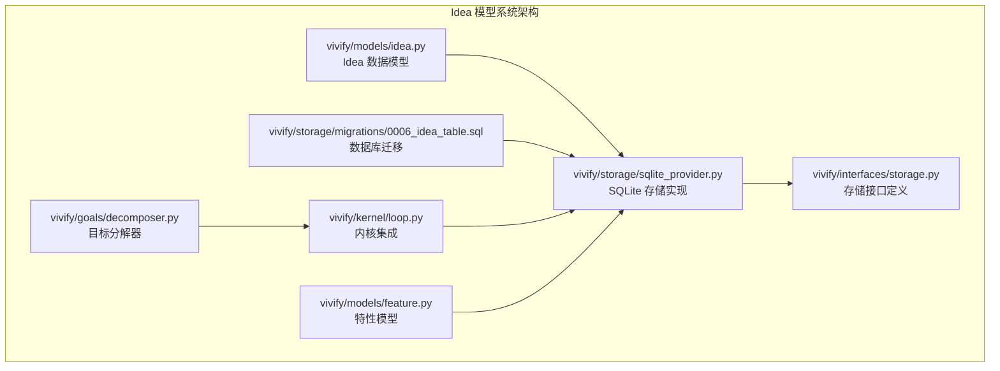
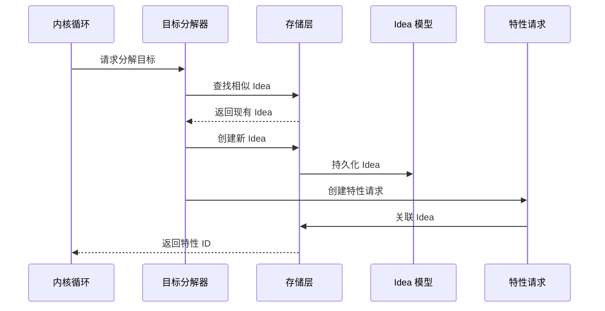
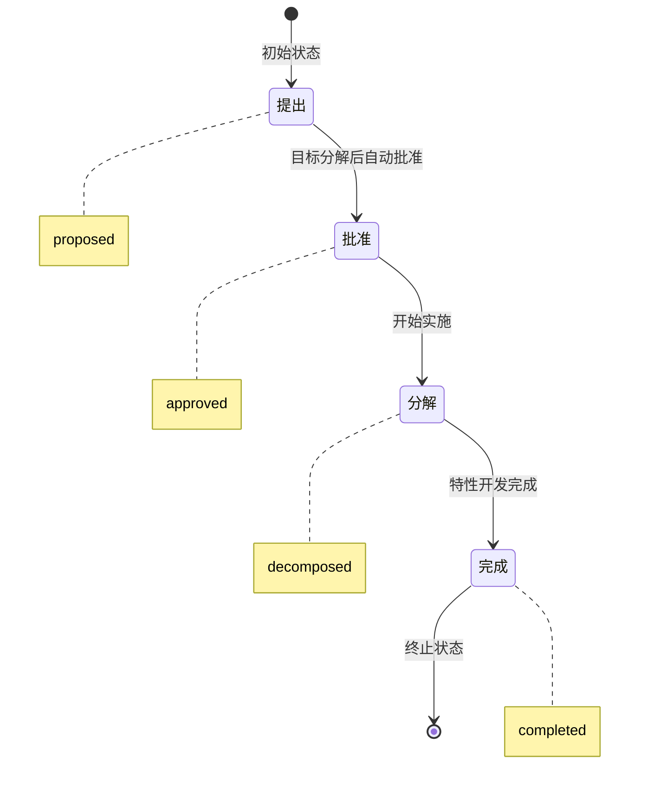
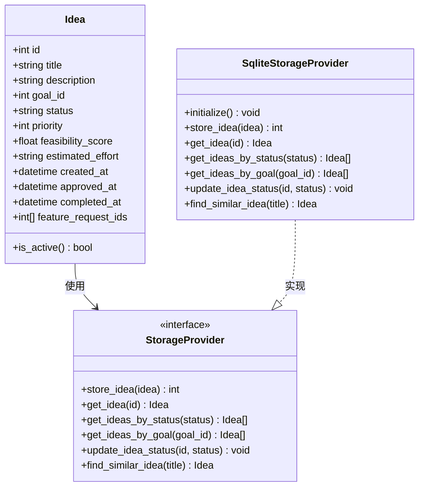
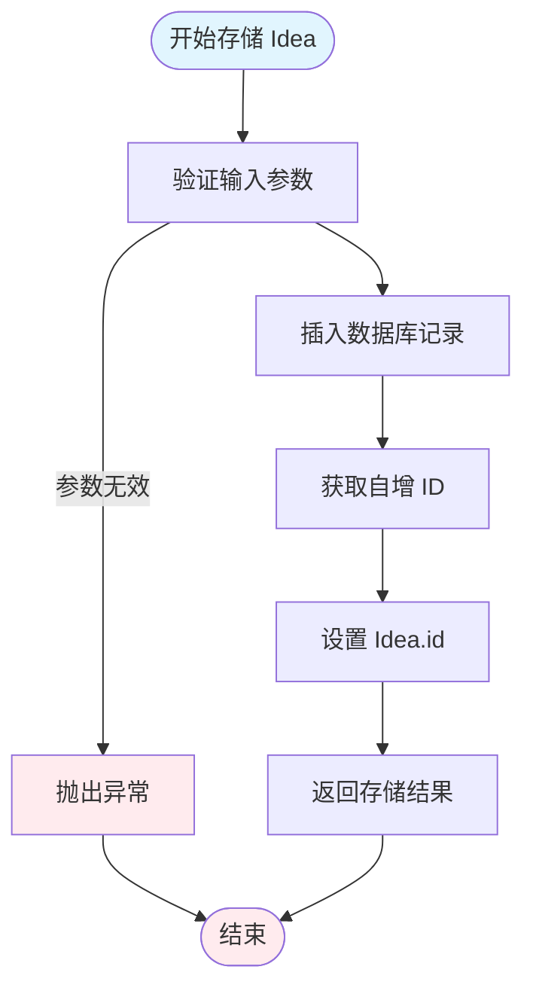

# Idea 模型系统

<cite>
**本文档引用的文件**
- [vivify/models/idea.py](file://vivify/models/idea.py)
- [vivify/storage/sqlite_provider.py](file://vivify/storage/sqlite_provider.py)
- [vivify/storage/migrations/0006_idea_table.sql](file://vivify/storage/migrations/0006_idea_table.sql)
- [vivify/interfaces/storage.py](file://vivify/interfaces/storage.py)
- [vivify/kernel/loop.py](file://vivify/kernel/loop.py)
- [vivify/models/feature.py](file://vivify/models/feature.py)
- [vivify/goals/decomposer.py](file://vivify/goals/decomposer.py)
- [tests/unit/test_idea_model.py](file://tests/unit/test_idea_model.py)
</cite>

## 目录
1. [简介](#简介)
2. [项目结构](#项目结构)
3. [核心组件](#核心组件)
4. [架构概览](#架构概览)
5. [详细组件分析](#详细组件分析)
6. [依赖关系分析](#依赖关系分析)
7. [性能考虑](#性能考虑)
8. [故障排除指南](#故障排除指南)
9. [结论](#结论)

## 简介

Idea 模型系统是 Vivify 复生引擎中的一个关键中间层，位于 Goals（目标）和 FeatureRequests（特性请求）之间。该系统的核心作用是将高层次的目标分解为具体的实施倡议，并为后续的特性开发提供结构化的组织框架。

在 Vivify 的五层架构中，Idea 模型系统属于 Intelligence Layer（智能层）的一部分，负责将 AI 自动生成的特性规格（FeatureSpec）转换为可持久化的 Idea 对象，并建立与 Goals 和 FeatureRequests 的关联关系。

## 项目结构

Idea 模型系统涉及以下关键文件和模块：



**图表来源**
- [vivify/models/idea.py:1-54](file://vivify/models/idea.py#L1-L54)
- [vivify/storage/sqlite_provider.py:57-791](file://vivify/storage/sqlite_provider.py#L57-L791)
- [vivify/interfaces/storage.py:19-139](file://vivify/interfaces/storage.py#L19-L139)

**章节来源**
- [vivify/models/idea.py:1-54](file://vivify/models/idea.py#L1-L54)
- [vivify/storage/sqlite_provider.py:57-791](file://vivify/storage/sqlite_provider.py#L57-L791)
- [vivify/interfaces/storage.py:19-139](file://vivify/interfaces/storage.py#L19-L139)

## 核心组件

### Idea 数据模型

Idea 是一个数据类，代表一个具体的实施倡议，具有以下核心属性：

- **标识信息**：唯一 ID、标题、描述
- **关联信息**：与 Goals 的关联（goal_id）
- **状态管理**：生命周期状态（proposed/approved/decomposed/completed）
- **优先级系统**：0-100 的优先级评分
- **可行性评估**：可行性分数（0.0-1.0）和预计工作量
- **时间追踪**：创建、批准、完成时间戳
- **特性关联**：与多个 FeatureRequests 的关联列表

### 存储接口

StorageProvider 接口定义了 Idea 操作的标准方法：

- `store_idea()`: 持久化新的 Idea
- `get_idea()`: 按 ID 获取 Idea
- `get_ideas_by_status()`: 按状态获取 Idea 列表
- `get_ideas_by_goal()`: 按目标获取 Idea 列表
- `update_idea_status()`: 更新 Idea 状态
- `find_similar_idea()`: 查找相似的 Idea

### SQLite 实现

SqliteStorageProvider 提供了 Idea 数据的持久化存储，包括：

- 数据库表结构定义
- CRUD 操作实现
- 索引优化
- 事务管理
- 序列化/反序列化处理

**章节来源**
- [vivify/models/idea.py:22-53](file://vivify/models/idea.py#L22-L53)
- [vivify/interfaces/storage.py:112-138](file://vivify/interfaces/storage.py#L112-L138)
- [vivify/storage/sqlite_provider.py:660-760](file://vivify/storage/sqlite_provider.py#L660-L760)

## 架构概览

Idea 模型系统在整个 Vivify 架构中的位置和作用如下：



**图表来源**
- [vivify/kernel/loop.py:1533-1576](file://vivify/kernel/loop.py#L1533-L1576)
- [vivify/goals/decomposer.py:223-300](file://vivify/goals/decomposer.py#L223-L300)
- [vivify/storage/sqlite_provider.py:660-720](file://vivify/storage/sqlite_provider.py#L660-L720)

### 状态流转

Idea 的生命周期状态遵循严格的流转顺序：



**图表来源**
- [vivify/models/idea.py:8-8](file://vivify/models/idea.py#L8-L8)

**章节来源**
- [vivify/models/idea.py:8-8](file://vivify/models/idea.py#L8-L8)
- [vivify/models/idea.py:48-50](file://vivify/models/idea.py#L48-L50)

## 详细组件分析

### Idea 数据模型类图



**图表来源**
- [vivify/models/idea.py:22-53](file://vivify/models/idea.py#L22-L53)
- [vivify/interfaces/storage.py:19-139](file://vivify/interfaces/storage.py#L19-L139)
- [vivify/storage/sqlite_provider.py:57-791](file://vivify/storage/sqlite_provider.py#L57-L791)

### 存储操作流程



**图表来源**
- [vivify/storage/sqlite_provider.py:661-682](file://vivify/storage/sqlite_provider.py#L661-L682)

### 内核集成机制

Idea 模型系统与 Vivify 内核的集成主要体现在以下几个方面：

1. **目标分解集成**：当目标分解器生成新的特性规格时，自动创建或查找对应的 Idea
2. **特性关联**：新创建的特性请求会自动关联到相应的 Idea
3. **状态同步**：Idea 的状态变化会影响关联的特性请求状态

**章节来源**
- [vivify/kernel/loop.py:1533-1576](file://vivify/kernel/loop.py#L1533-L1576)
- [vivify/goals/decomposer.py:223-300](file://vivify/goals/decomposer.py#L223-L300)

## 依赖关系分析

### 组件依赖图

```mermaid
graph TB
subgraph "核心依赖关系"
A[vivify/models/idea.py]
B[vivify/storage/sqlite_provider.py]
C[vivify/interfaces/storage.py]
D[vivify/storage/migrations/0006_idea_table.sql]
E[vivify/kernel/loop.py]
F[vivify/models/feature.py]
G[vivify/goals/decomposer.py]
end
A --> C
B --> C
B --> A
D --> B
E --> B
F --> B
G --> E
E --> A
G --> F
note A "Idea 数据模型"
note B "SQLite 存储实现"
note C "存储接口定义"
note D "数据库迁移"
note E "内核循环"
note F "特性模型"
note G "目标分解器"
```

**图表来源**
- [vivify/models/idea.py:10-14](file://vivify/models/idea.py#L10-L14)
- [vivify/storage/sqlite_provider.py:19-22](file://vivify/storage/sqlite_provider.py#L19-L22)
- [vivify/interfaces/storage.py:14-16](file://vivify/interfaces/storage.py#L14-L16)

### 数据库模式设计

Idea 表的数据库设计体现了以下考虑：

- **索引优化**：为 status 和 goal_id 字段创建索引以提高查询性能
- **时间戳管理**：支持 UTC 时间格式存储
- **可扩展性**：预留未来可能的字段扩展空间

**章节来源**
- [vivify/storage/migrations/0006_idea_table.sql:7-23](file://vivify/storage/migrations/0006_idea_table.sql#L7-L23)

## 性能考虑

### 查询优化策略

1. **索引利用**：针对常用查询条件（status、goal_id）建立索引
2. **排序优化**：按优先级降序排列，确保高优先级 Idea 优先处理
3. **分页机制**：限制查询结果数量，避免内存溢出

### 并发安全

- **线程锁保护**：使用可重入锁确保多线程环境下的数据一致性
- **WAL 模式**：采用 Write-Ahead Logging 模式提高并发读取性能
- **事务管理**：显式控制事务边界，避免长时间持有锁

### 内存管理

- **惰性加载**：只在需要时加载完整的 Idea 对象
- **批量操作**：支持批量查询和更新操作
- **连接池**：单实例多线程共享数据库连接

## 故障排除指南

### 常见问题及解决方案

1. **Idea 创建失败**
   - 检查数据库连接是否正常
   - 验证输入参数的有效性
   - 查看存储层异常日志

2. **状态更新异常**
   - 确认状态转换的合法性
   - 检查时间戳字段的正确设置
   - 验证数据库约束条件

3. **查询性能问题**
   - 确认相关索引是否存在
   - 检查查询条件的合理性
   - 考虑添加适当的 LIMIT 子句

### 调试技巧

- 启用详细的日志记录
- 使用单元测试验证核心功能
- 监控数据库查询执行计划
- 定期进行性能基准测试

**章节来源**
- [tests/unit/test_idea_model.py:1-244](file://tests/unit/test_idea_model.py#L1-L244)

## 结论

Idea 模型系统作为 Vivify 复生引擎中的关键中间层，成功地实现了以下目标：

1. **清晰的层次划分**：在 Goals 和 FeatureRequests 之间建立了明确的抽象层
2. **灵活的状态管理**：支持完整的生命周期状态流转
3. **高效的存储实现**：基于 SQLite 的高性能持久化方案
4. **良好的扩展性**：通过接口抽象支持多种存储后端
5. **完善的集成机制**：与内核和其他组件无缝协作

该系统的设计充分体现了现代软件架构的最佳实践，既保证了功能的完整性，又确保了系统的可维护性和可扩展性。通过合理的抽象和模块化设计，Idea 模型系统为 Vivify 的自动化目标管理和特性开发提供了坚实的基础。