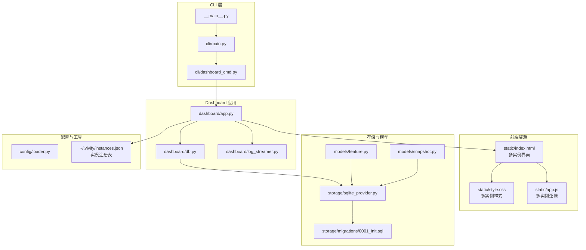
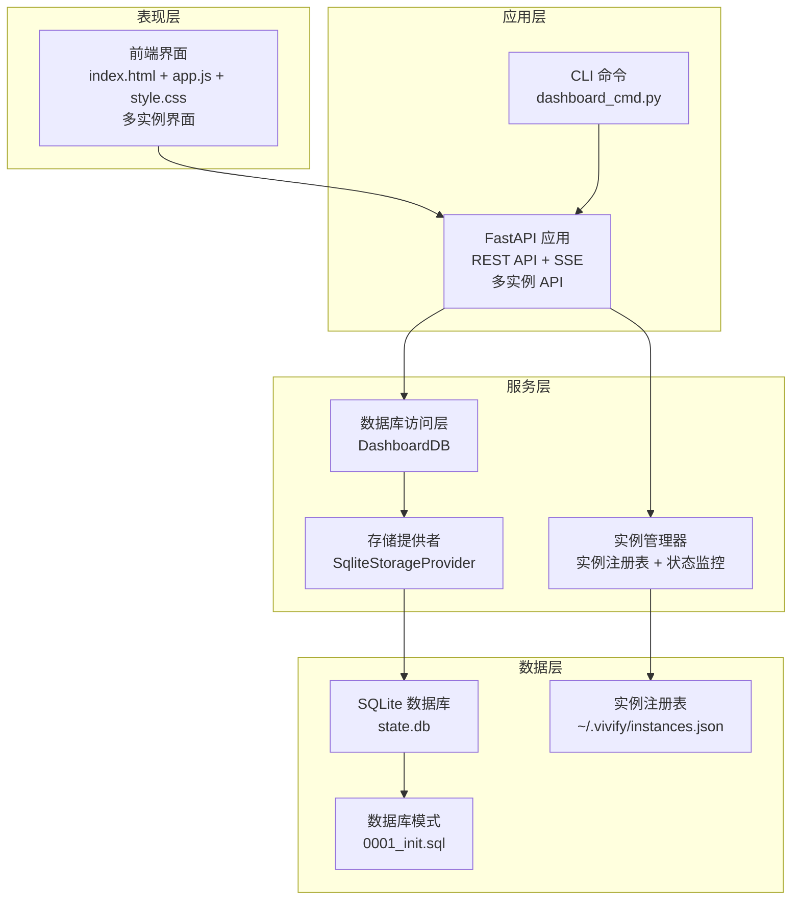
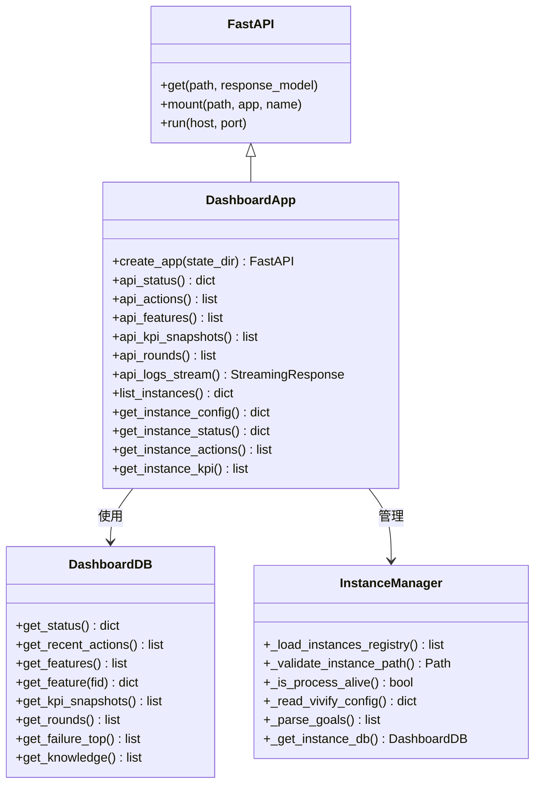
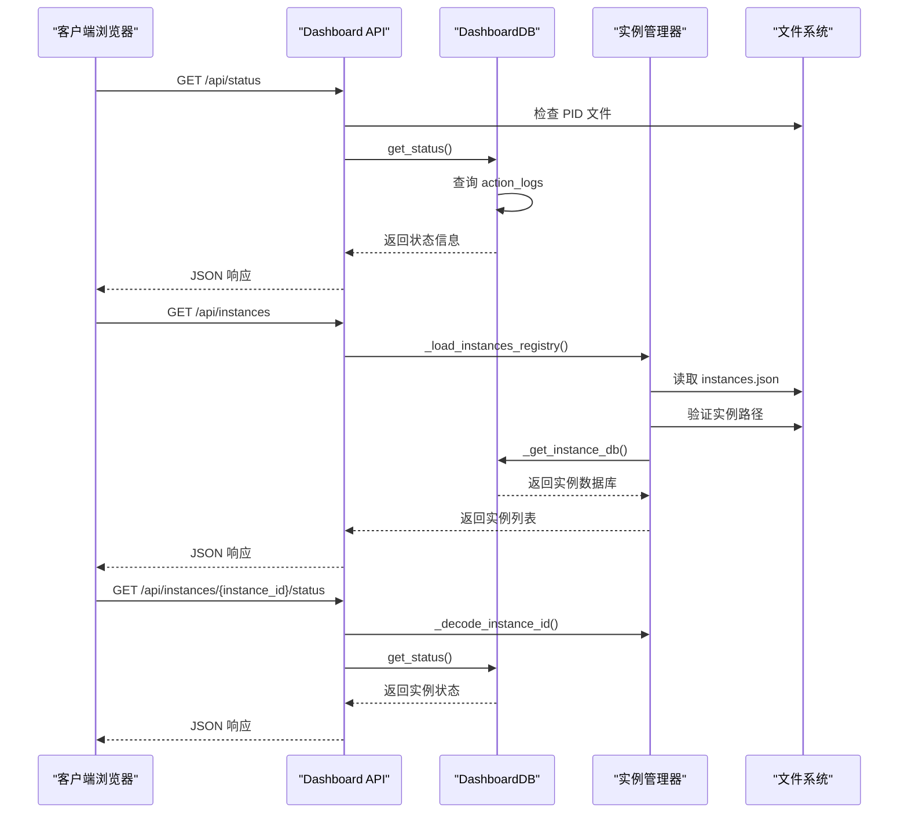
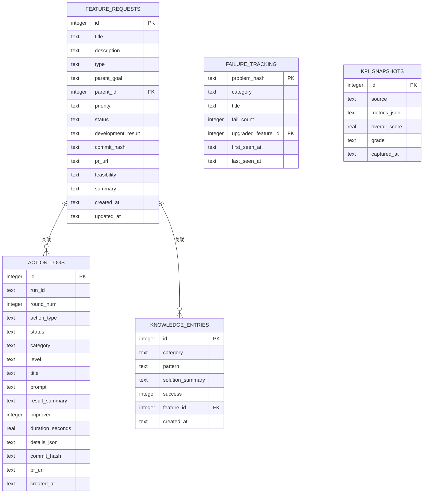
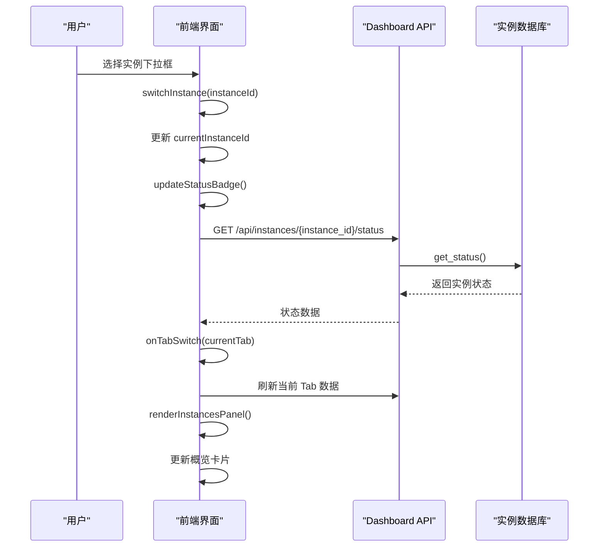
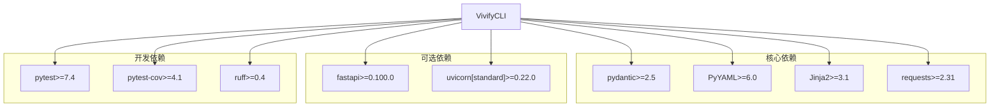
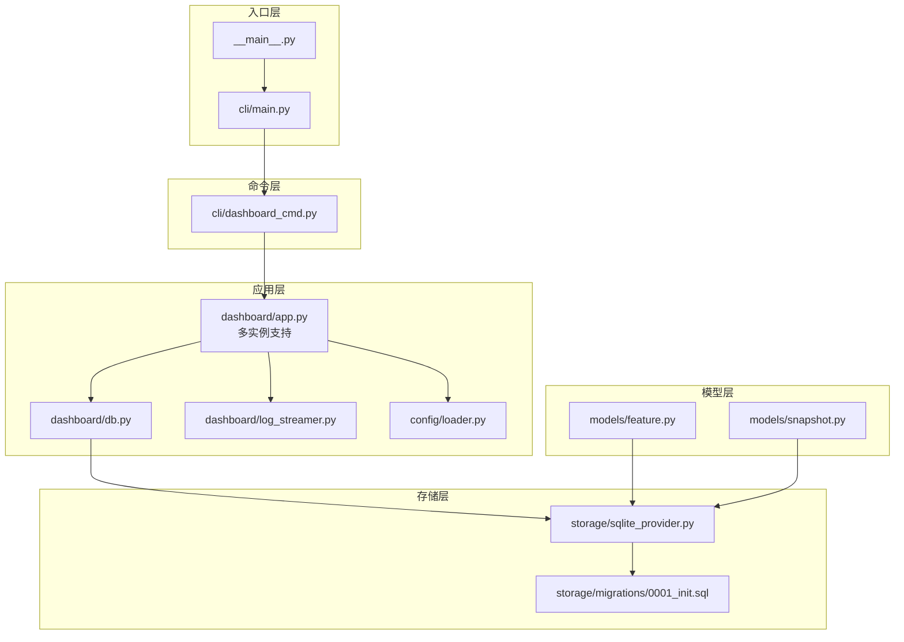

# Web仪表板系统

<cite>
**本文档引用的文件**
- [vivify/__main__.py](file://vivify/__main__.py)
- [vivify/cli/main.py](file://vivify/cli/main.py)
- [vivify/cli/dashboard_cmd.py](file://vivify/cli/dashboard_cmd.py)
- [vivify/dashboard/app.py](file://vivify/dashboard/app.py)
- [vivify/dashboard/db.py](file://vivify/dashboard/db.py)
- [vivify/dashboard/log_streamer.py](file://vivify/dashboard/log_streamer.py)
- [vivify/dashboard/static/index.html](file://vivify/dashboard/static/index.html)
- [vivify/dashboard/static/style.css](file://vivify/dashboard/static/style.css)
- [vivify/dashboard/static/app.js](file://vivify/dashboard/static/app.js)
- [vivify/storage/sqlite_provider.py](file://vivify/storage/sqlite_provider.py)
- [vivify/storage/migrations/0001_init.sql](file://vivify/storage/migrations/0001_init.sql)
- [vivify/models/feature.py](file://vivify/models/feature.py)
- [vivify/models/snapshot.py](file://vivify/models/snapshot.py)
- [vivify/config/loader.py](file://vivify/config/loader.py)
- [pyproject.toml](file://pyproject.toml)
- [README.md](file://README.md)
</cite>

## 更新摘要
**变更内容**
- 新增多实例管理功能，支持在同一主机上运行和监控多个 Vivify 实例
- 新增完整的实例选择器组件和实例管理面板
- 新增实例状态监控和实例切换功能
- 扩展 API 端点以支持实例级别的数据查询
- 更新前端界面以支持多实例导航和数据展示
- 新增实例注册表管理和实例配置读取功能

## 目录
1. [简介](#简介)
2. [项目结构](#项目结构)
3. [核心组件](#核心组件)
4. [架构总览](#架构总览)
5. [详细组件分析](#详细组件分析)
6. [多实例管理功能](#多实例管理功能)
7. [依赖关系分析](#依赖关系分析)
8. [性能考虑](#性能考虑)
9. [故障排除指南](#故障排除指南)
10. [结论](#结论)

## 简介
本项目是一个基于 FastAPI 的 Web 仪表板系统，用于可视化 Vivify 自愈引擎的状态、历史动作、特性开发进度、KPI 趋势以及实时日志流。该系统通过只读 SQLite 数据库连接提供数据查询能力，并以静态资源的形式提供前端界面。**重大更新**：现已支持多实例管理，用户可以在同一界面中监控和切换多个 Vivify 实例，大幅增强了系统的实用性和灵活性。

## 项目结构
该项目采用模块化组织方式，主要分为以下几部分：
- CLI 入口与命令分发
- Dashboard Web 应用（支持多实例）
- 数据库访问层
- 前端静态资源（含多实例界面）
- 存储与模型定义
- 配置与构建信息



**图表来源**
- [vivify/__main__.py:1-6](file://vivify/__main__.py#L1-L6)
- [vivify/cli/main.py:1-58](file://vivify/cli/main.py#L1-L58)
- [vivify/cli/dashboard_cmd.py:1-44](file://vivify/cli/dashboard_cmd.py#L1-L44)
- [vivify/dashboard/app.py:1-490](file://vivify/dashboard/app.py#L1-L490)
- [vivify/dashboard/db.py:1-137](file://vivify/dashboard/db.py#L1-L137)
- [vivify/dashboard/log_streamer.py:1-25](file://vivify/dashboard/log_streamer.py#L1-L25)
- [vivify/dashboard/static/index.html:1-147](file://vivify/dashboard/static/index.html#L1-L147)
- [vivify/dashboard/static/style.css:1-306](file://vivify/dashboard/static/style.css#L1-L306)
- [vivify/dashboard/static/app.js:1-463](file://vivify/dashboard/static/app.js#L1-L463)
- [vivify/storage/sqlite_provider.py:1-200](file://vivify/storage/sqlite_provider.py#L1-L200)
- [vivify/storage/migrations/0001_init.sql:1-100](file://vivify/storage/migrations/0001_init.sql#L1-L100)
- [vivify/models/feature.py:1-87](file://vivify/models/feature.py#L1-L87)
- [vivify/models/snapshot.py:1-48](file://vivify/models/snapshot.py#L1-L48)
- [vivify/config/loader.py:1-78](file://vivify/config/loader.py#L1-L78)

**章节来源**
- [vivify/__main__.py:1-6](file://vivify/__main__.py#L1-L6)
- [vivify/cli/main.py:1-58](file://vivify/cli/main.py#L1-L58)
- [vivify/cli/dashboard_cmd.py:1-44](file://vivify/cli/dashboard_cmd.py#L1-L44)
- [vivify/dashboard/app.py:1-490](file://vivify/dashboard/app.py#L1-L490)
- [vivify/dashboard/db.py:1-137](file://vivify/dashboard/db.py#L1-L137)
- [vivify/dashboard/log_streamer.py:1-25](file://vivify/dashboard/log_streamer.py#L1-L25)
- [vivify/dashboard/static/index.html:1-147](file://vivify/dashboard/static/index.html#L1-L147)
- [vivify/dashboard/static/style.css:1-306](file://vivify/dashboard/static/style.css#L1-L306)
- [vivify/dashboard/static/app.js:1-463](file://vivify/dashboard/static/app.js#L1-L463)
- [vivify/storage/sqlite_provider.py:1-200](file://vivify/storage/sqlite_provider.py#L1-L200)
- [vivify/storage/migrations/0001_init.sql:1-100](file://vivify/storage/migrations/0001_init.sql#L1-L100)
- [vivify/models/feature.py:1-87](file://vivify/models/feature.py#L1-L87)
- [vivify/models/snapshot.py:1-48](file://vivify/models/snapshot.py#L1-L48)
- [vivify/config/loader.py:1-78](file://vivify/config/loader.py#L1-L78)

## 核心组件
- CLI 主入口：提供命令行参数解析和子命令分发
- Dashboard 应用：基于 FastAPI 构建的 Web 服务，提供 REST API 和静态资源（支持多实例）
- 数据库访问层：只读 SQLite 连接，封装查询接口
- 前端界面：响应式设计，包含概览、问题、动作、特性、趋势、实例等标签页
- 实时日志流：通过 Server-Sent Events 提供日志实时更新
- 实例管理：支持多实例注册表、实例状态监控、实例切换
- 存储与模型：定义数据结构和持久化方案

**章节来源**
- [vivify/cli/main.py:1-58](file://vivify/cli/main.py#L1-L58)
- [vivify/dashboard/app.py:1-490](file://vivify/dashboard/app.py#L1-L490)
- [vivify/dashboard/db.py:1-137](file://vivify/dashboard/db.py#L1-L137)
- [vivify/dashboard/static/index.html:1-147](file://vivify/dashboard/static/index.html#L1-L147)
- [vivify/dashboard/log_streamer.py:1-25](file://vivify/dashboard/log_streamer.py#L1-L25)
- [vivify/storage/sqlite_provider.py:1-200](file://vivify/storage/sqlite_provider.py#L1-L200)

## 架构总览
系统采用分层架构设计，各层职责清晰分离，现已增强多实例支持能力：



**图表来源**
- [vivify/dashboard/app.py:143-490](file://vivify/dashboard/app.py#L143-L490)
- [vivify/dashboard/db.py:9-137](file://vivify/dashboard/db.py#L9-L137)
- [vivify/storage/sqlite_provider.py:56-200](file://vivify/storage/sqlite_provider.py#L56-L200)
- [vivify/storage/migrations/0001_init.sql:1-100](file://vivify/storage/migrations/0001_init.sql#L1-L100)

## 详细组件分析

### Dashboard 应用架构
Dashboard 应用采用 FastAPI 框架，提供完整的 Web 仪表板功能，现已支持多实例管理：



**图表来源**
- [vivify/dashboard/app.py:143-490](file://vivify/dashboard/app.py#L143-L490)
- [vivify/dashboard/db.py:9-137](file://vivify/dashboard/db.py#L9-L137)

### API 端点设计
系统提供丰富的 REST API 端点，支持多实例管理和数据查询：



**图表来源**
- [vivify/dashboard/app.py:166-490](file://vivify/dashboard/app.py#L166-L490)
- [vivify/dashboard/db.py:25-137](file://vivify/dashboard/db.py#L25-L137)

### 前端界面组件
前端采用响应式设计，提供直观的数据可视化和多实例管理功能：

```mermaid
graph TB
subgraph "页面结构"
Header["头部区域<br/>状态指示器 + 项目信息 + 实例选择器"]
Tabs["标签导航<br/>实例/概览/问题/动作/特性/趋势"]
MainContent["主要内容区"]
end
subgraph "实例标签"
InstanceOverview["实例详情卡片<br/>当前实例信息"]
InstancesGrid["实例网格<br/>所有实例卡片"]
InstanceCard["实例卡片<br/>项目名称/状态/目标/KPI"]
</subgraph>
subgraph "概览标签"
Cards["统计卡片<br/>守护状态/最新轮次/操作统计/特性进度"]
LogPanel["日志面板<br/>实时日志流"]
</subgraph>
subgraph "问题标签"
IssueFilters["问题过滤器<br/>级别/分类"]
IssuesTable["问题表格<br/>级别/分类/标题/时间/状态"]
</subgraph>
subgraph "动作标签"
ActionFilters["动作过滤器<br/>动作类型"]
Timeline["时间线视图<br/>动作详情"]
</subgraph>
subgraph "特性标签"
KanbanBoard["看板视图<br/>待处理/开发中/已部署/已验证"]
</subgraph>
subgraph "趋势标签"
KPITrend["KPI 趋势图<br/>综合评分"]
ActionTrend["动作趋势图<br/>成功/失败统计"]
</subgraph
MainContent --> InstanceOverview
MainContent --> InstancesGrid
MainContent --> InstanceCard
MainContent --> Cards
MainContent --> LogPanel
MainContent --> IssueFilters
MainContent --> IssuesTable
MainContent --> ActionFilters
MainContent --> Timeline
MainContent --> KanbanBoard
MainContent --> KPITrend
MainContent --> ActionTrend
```

**图表来源**
- [vivify/dashboard/static/index.html:1-147](file://vivify/dashboard/static/index.html#L1-L147)
- [vivify/dashboard/static/style.css:1-306](file://vivify/dashboard/static/style.css#L1-L306)
- [vivify/dashboard/static/app.js:1-463](file://vivify/dashboard/static/app.js#L1-L463)

### 数据模型与存储
系统使用 SQLite 作为数据存储后端，支持复杂的数据查询和分析：



**图表来源**
- [vivify/storage/migrations/0001_init.sql:9-99](file://vivify/storage/migrations/0001_init.sql#L9-L99)
- [vivify/models/feature.py:70-87](file://vivify/models/feature.py#L70-L87)
- [vivify/models/snapshot.py:9-48](file://vivify/models/snapshot.py#L9-L48)

**章节来源**
- [vivify/dashboard/app.py:1-490](file://vivify/dashboard/app.py#L1-L490)
- [vivify/dashboard/db.py:1-137](file://vivify/dashboard/db.py#L1-L137)
- [vivify/dashboard/static/index.html:1-147](file://vivify/dashboard/static/index.html#L1-L147)
- [vivify/dashboard/static/style.css:1-306](file://vivify/dashboard/static/style.css#L1-L306)
- [vivify/dashboard/static/app.js:1-463](file://vivify/dashboard/static/app.js#L1-L463)
- [vivify/storage/migrations/0001_init.sql:1-100](file://vivify/storage/migrations/0001_init.sql#L1-L100)
- [vivify/models/feature.py:1-87](file://vivify/models/feature.py#L1-L87)
- [vivify/models/snapshot.py:1-48](file://vivify/models/snapshot.py#L1-L48)

## 多实例管理功能

### 实例注册表管理
系统通过全局实例注册表管理所有已知的 Vivify 实例：


**图表来源**
- [vivify/dashboard/app.py:286-351](file://vivify/dashboard/app.py#L286-L351)
- [vivify/dashboard/app.py:123-140](file://vivify/dashboard/app.py#L123-L140)

### 实例切换机制
前端提供完整的实例切换功能，支持动态切换当前实例并刷新数据：



**图表来源**
- [vivify/dashboard/static/app.js:346-355](file://vivify/dashboard/static/app.js#L346-L355)
- [vivify/dashboard/app.py:383-427](file://vivify/dashboard/app.py#L383-L427)

### 实例状态监控
系统提供实时的实例状态监控，包括守护进程状态、运行时长、KPI 分数等关键指标：

```mermaid
graph TB
subgraph "实例状态指标"
DaemonStatus["守护进程状态<br/>running/pid"]
Uptime["运行时长<br/>uptime_seconds"]
KPIScore["KPI 分数<br/>overall_score"]
LastAction["最近操作<br/>last_action"]
LatestRound["最新轮次<br/>latest_round"]
DeployURL["部署地址<br/>deploy_url"]
</subgraph
subgraph "实例配置信息"
ProjectName["项目名称<br/>project.name"]
Scenario["场景类型<br/>project.type"]
Language["语言<br/>project.language"]
Framework["框架<br/>project.framework"]
Goals["目标列表<br/>GOALS.md"]
StateDir["状态目录<br/>.vivify"]
InitTime["初始化时间<br/>created_at"]
</subgraph
DaemonStatus --> Uptime
Uptime --> KPIScore
KPIScore --> LastAction
LastAction --> LatestRound
ProjectName --> Language
Language --> Framework
Framework --> Goals
Goals --> DeployURL
```

**图表来源**
- [vivify/dashboard/app.py:331-346](file://vivify/dashboard/app.py#L331-L346)
- [vivify/dashboard/app.py:374-381](file://vivify/dashboard/app.py#L374-L381)

**章节来源**
- [vivify/dashboard/app.py:286-490](file://vivify/dashboard/app.py#L286-L490)
- [vivify/dashboard/static/app.js:291-463](file://vivify/dashboard/static/app.js#L291-L463)
- [vivify/dashboard/static/index.html:18-25](file://vivify/dashboard/static/index.html#L18-L25)

## 依赖关系分析

### 外部依赖
系统使用 Pydantic 作为数据验证库，PyYAML 用于配置解析，Jinja2 用于模板渲染，requests 用于 HTTP 请求。



**图表来源**
- [pyproject.toml:22-38](file://pyproject.toml#L22-L38)

### 内部模块依赖
系统内部模块之间存在清晰的依赖关系，现已增强多实例支持：



**图表来源**
- [vivify/__main__.py:1-6](file://vivify/__main__.py#L1-L6)
- [vivify/cli/main.py:1-58](file://vivify/cli/main.py#L1-L58)
- [vivify/cli/dashboard_cmd.py:1-44](file://vivify/cli/dashboard_cmd.py#L1-L44)
- [vivify/dashboard/app.py:1-490](file://vivify/dashboard/app.py#L1-L490)
- [vivify/dashboard/db.py:1-137](file://vivify/dashboard/db.py#L1-L137)
- [vivify/storage/sqlite_provider.py:1-200](file://vivify/storage/sqlite_provider.py#L1-L200)
- [vivify/config/loader.py:1-78](file://vivify/config/loader.py#L1-L78)

**章节来源**
- [pyproject.toml:1-70](file://pyproject.toml#L1-L70)
- [vivify/__main__.py:1-6](file://vivify/__main__.py#L1-L6)
- [vivify/cli/main.py:1-58](file://vivify/cli/main.py#L1-L58)
- [vivify/cli/dashboard_cmd.py:1-44](file://vivify/cli/dashboard_cmd.py#L1-L44)
- [vivify/dashboard/app.py:1-490](file://vivify/dashboard/app.py#L1-L490)
- [vivify/dashboard/db.py:1-137](file://vivify/dashboard/db.py#L1-L137)
- [vivify/storage/sqlite_provider.py:1-200](file://vivify/storage/sqlite_provider.py#L1-L200)
- [vivify/config/loader.py:1-78](file://vivify/config/loader.py#L1-L78)

## 性能考虑
系统在设计时充分考虑了性能优化，多实例支持并未显著影响性能：

- **只读数据库连接**：DashboardDB 使用 `PRAGMA query_only = ON` 确保只读访问，避免意外写入
- **WAL 模式**：启用 Write-Ahead Logging 提高并发读取性能
- **延迟初始化**：数据库连接在首次需要时才建立，支持数据库文件不存在的情况
- **索引优化**：为常用查询字段建立索引，包括状态、类型、时间戳等
- **流式日志**：使用 SSE 实现高效的实时日志传输
- **缓存策略**：前端定期轮询更新，避免频繁刷新造成性能问题
- **实例连接池**：每个实例独立的数据库连接，避免实例间干扰
- **增量数据加载**：实例列表每30秒刷新，减少不必要的网络请求

## 故障排除指南

### 常见问题诊断
1. **数据库连接失败**
   - 检查 `.vivify/state.db` 文件是否存在
   - 验证数据库文件权限设置
   - 确认 SQLite 版本兼容性

2. **API 端点返回空数据**
   - 确认 Vivify 守护进程正在运行
   - 检查 action_logs 表是否有数据
   - 验证查询参数格式

3. **实时日志流中断**
   - 检查日志文件权限和路径
   - 确认文件编码为 UTF-8
   - 验证 SSE 连接状态

4. **多实例识别问题**
   - 检查 `~/.vivify/instances.json` 文件格式
   - 验证实例路径有效性
   - 确认进程 ID 存活状态
   - 验证实例 .vivify 目录完整性

5. **实例切换失败**
   - 检查实例 ID 编码/解码是否正确
   - 确认目标实例状态数据库可用
   - 验证实例配置文件格式
   - 检查实例进程权限

6. **实例状态显示异常**
   - 确认实例 .vivify.yml 配置完整
   - 检查 GOALS.md 文件格式
   - 验证实例数据库连接正常
   - 确认实例守护进程状态

**章节来源**
- [vivify/dashboard/app.py:111-140](file://vivify/dashboard/app.py#L111-L140)
- [vivify/dashboard/db.py:12-24](file://vivify/dashboard/db.py#L12-L24)
- [vivify/dashboard/log_streamer.py:9-25](file://vivify/dashboard/log_streamer.py#L9-L25)
- [vivify/dashboard/static/app.js:291-355](file://vivify/dashboard/static/app.js#L291-L355)

## 结论
Web 仪表板系统为 Vivify 自愈引擎提供了直观、实时的可视化界面。**重大更新**：系统现已支持多实例管理，用户可以在同一界面中监控和切换多个 Vivify 实例，大幅增强了系统的实用性和灵活性。通过清晰的分层架构、完善的 API 设计和优化的性能考虑，系统能够有效地展示项目状态、历史记录、特性进展和 KPI 趋势。

多实例管理功能包括：
- **完整的实例注册表管理**：自动发现和管理本地实例
- **实时状态监控**：显示守护进程状态、运行时长、KPI 分数等
- **实例切换功能**：无缝切换当前实例并刷新所有数据
- **实例配置读取**：显示项目配置、目标列表、部署信息等
- **实例详情面板**：提供详细的实例信息和快速链接

前端界面采用现代化的设计理念，提供了良好的用户体验。整体而言，这是一个设计合理、功能完备的监控和管理平台，现已具备强大的多实例支持能力，能够满足复杂开发环境下的监控需求。