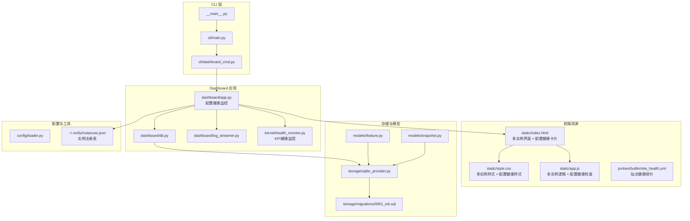
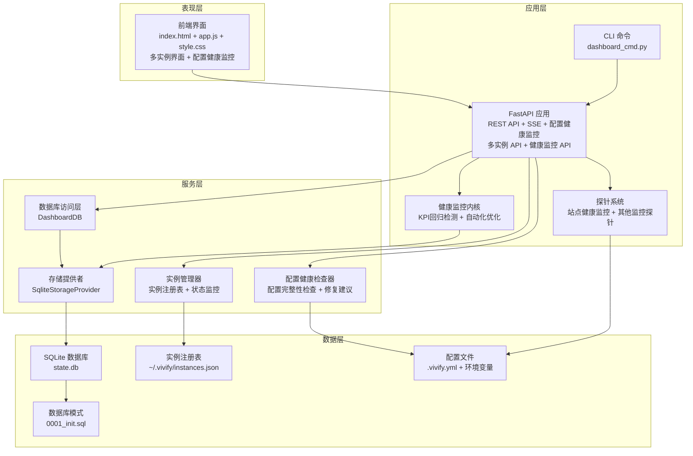
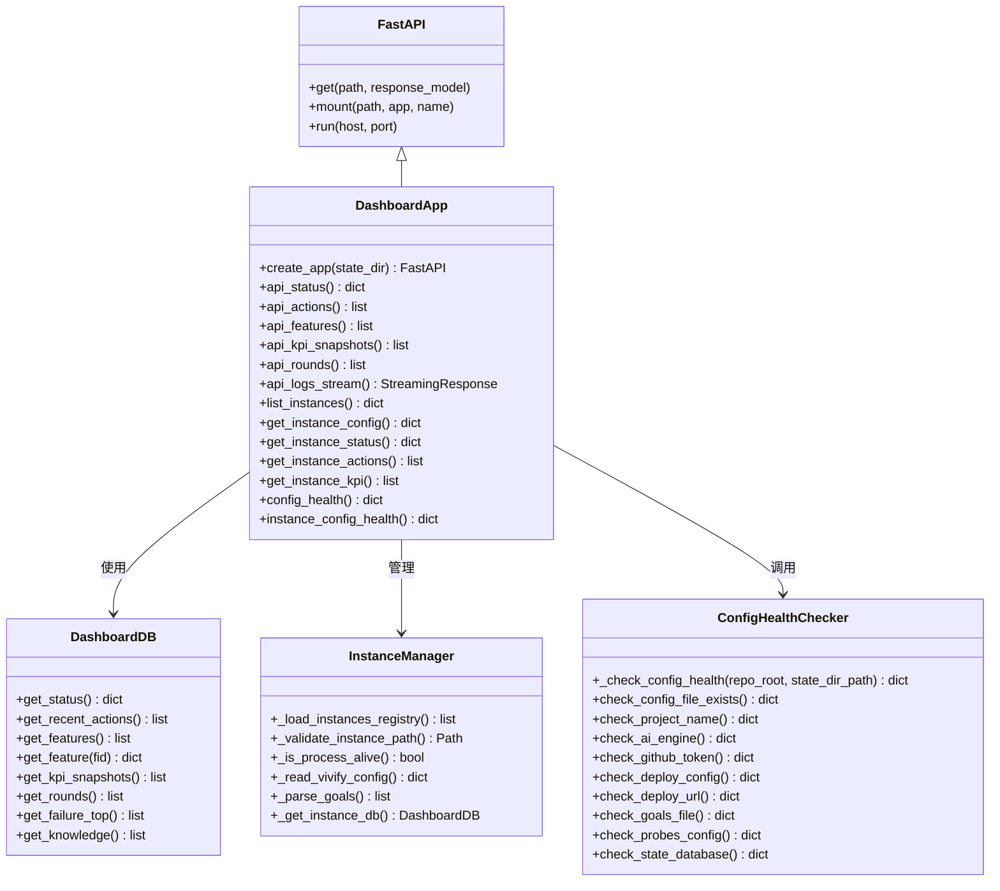
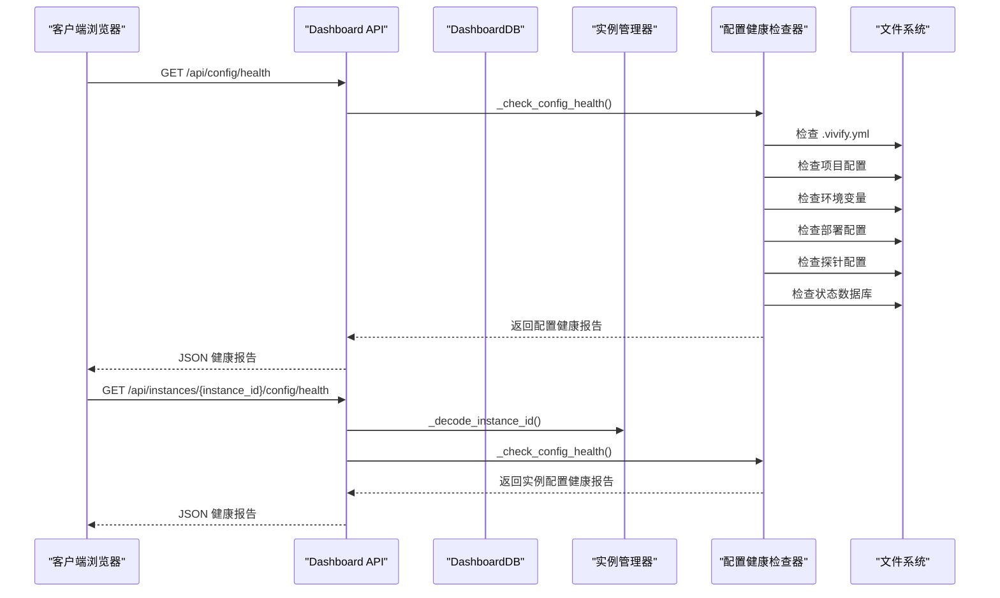
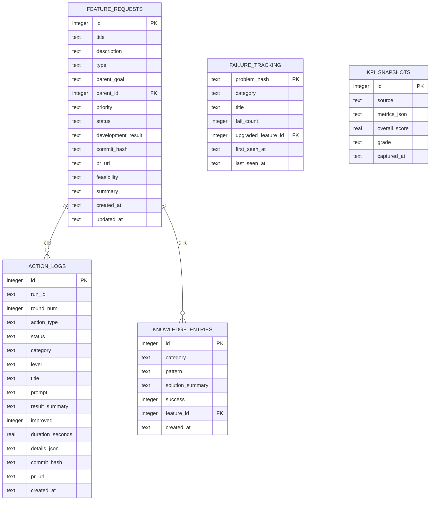
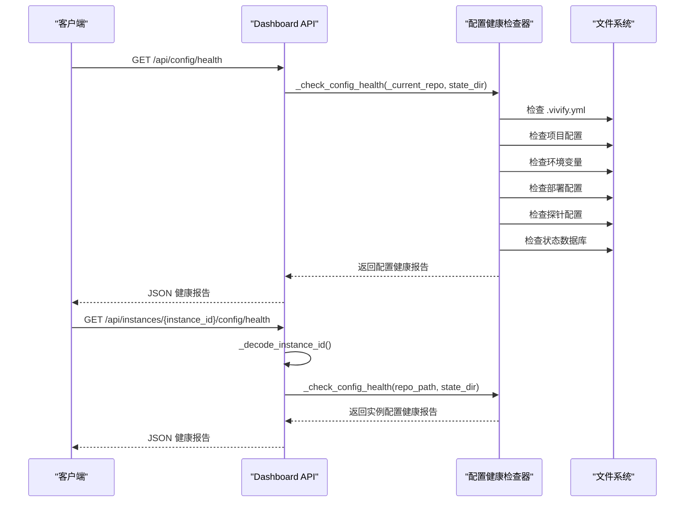
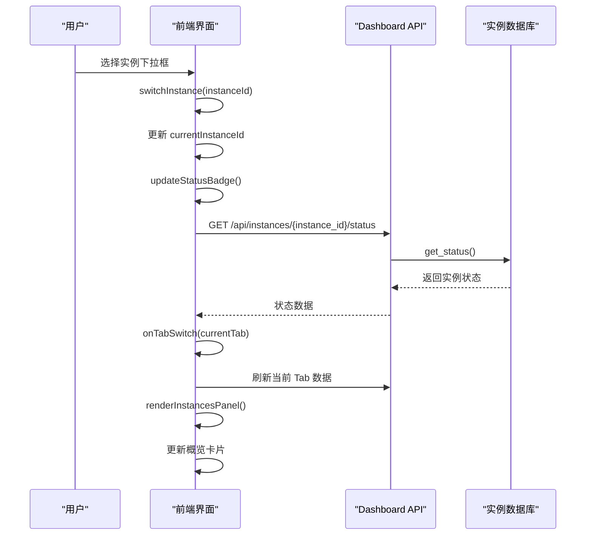
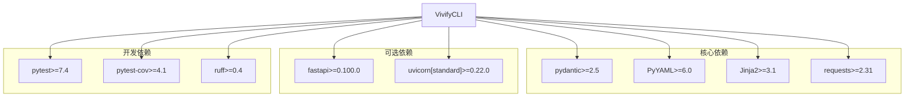
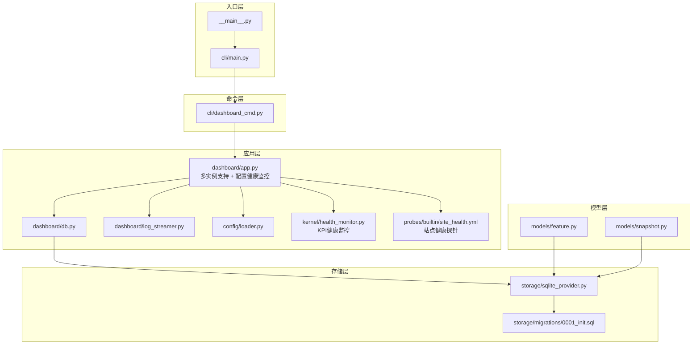

# Web仪表板系统

<cite>
**本文档引用的文件**
- [vivify/__main__.py](file://vivify/__main__.py)
- [vivify/cli/main.py](file://vivify/cli/main.py)
- [vivify/cli/dashboard_cmd.py](file://vivify/cli/dashboard_cmd.py)
- [vivify/dashboard/app.py](file://vivify/dashboard/app.py)
- [vivify/dashboard/db.py](file://vivify/dashboard/db.py)
- [vivify/dashboard/log_streamer.py](file://vivify/dashboard/log_streamer.py)
- [vivify/dashboard/static/index.html](file://vivify/dashboard/static/index.html)
- [vivify/dashboard/static/style.css](file://vivify/dashboard/static/style.css)
- [vivify/dashboard/static/app.js](file://vivify/dashboard/static/app.js)
- [vivify/storage/sqlite_provider.py](file://vivify/storage/sqlite_provider.py)
- [vivify/storage/migrations/0001_init.sql](file://vivify/storage/migrations/0001_init.sql)
- [vivify/models/feature.py](file://vivify/models/feature.py)
- [vivify/models/snapshot.py](file://vivify/models/snapshot.py)
- [vivify/config/loader.py](file://vivify/config/loader.py)
- [vivify/kernel/health_monitor.py](file://vivify/kernel/health_monitor.py)
- [vivify/probes/builtin/site_health.yml](file://vivify/probes/builtin/site_health.yml)
- [pyproject.toml](file://pyproject.toml)
- [README.md](file://README.md)
</cite>

## 更新摘要
**变更内容**
- 新增配置健康监控系统，包括后端配置健康检查功能、前端JavaScript可视化组件、CSS样式设计和HTML结构集成
- 后端提供 `/api/config/health` 和 `/api/instances/{instance_id}/config/health` API 端点
- 前端实现配置完整性检查的可视化展示，包括分数条、检查列表和修复建议
- 新增配置健康度卡片，实时显示项目配置状态和改进建议
- 集成探针系统中的站点健康监控功能，支持部署站点的可达性检查

## 目录
1. [简介](#简介)
2. [项目结构](#项目结构)
3. [核心组件](#核心组件)
4. [架构总览](#架构总览)
5. [详细组件分析](#详细组件分析)
6. [配置健康监控系统](#配置健康监控系统)
7. [多实例管理功能](#多实例管理功能)
8. [依赖关系分析](#依赖关系分析)
9. [性能考虑](#性能考虑)
10. [故障排除指南](#故障排除指南)
11. [结论](#结论)

## 简介
本项目是一个基于 FastAPI 的 Web 仪表板系统，用于可视化 Vivify 自愈引擎的状态、历史动作、特性开发进度、KPI 趋势以及实时日志流。该系统通过只读 SQLite 数据库连接提供数据查询能力，并以静态资源的形式提供前端界面。**重大更新**：现已支持配置健康监控系统，提供项目配置完整性检查、实时健康状态监控和智能修复建议，大幅增强了系统的实用性和维护性。

## 项目结构
该项目采用模块化组织方式，主要分为以下几部分：
- CLI 入口与命令分发
- Dashboard Web 应用（支持多实例和配置健康监控）
- 数据库访问层
- 前端静态资源（含多实例界面和配置健康监控）
- 存储与模型定义
- 配置与构建信息
- 健康监控内核



**图表来源**
- [vivify/__main__.py:1-6](file://vivify/__main__.py#L1-L6)
- [vivify/cli/main.py:1-58](file://vivify/cli/main.py#L1-L58)
- [vivify/cli/dashboard_cmd.py:1-44](file://vivify/cli/dashboard_cmd.py#L1-L44)
- [vivify/dashboard/app.py:1-681](file://vivify/dashboard/app.py#L1-L681)
- [vivify/dashboard/db.py:1-137](file://vivify/dashboard/db.py#L1-L137)
- [vivify/dashboard/log_streamer.py:1-25](file://vivify/dashboard/log_streamer.py#L1-L25)
- [vivify/dashboard/static/index.html:1-153](file://vivify/dashboard/static/index.html#L1-L153)
- [vivify/dashboard/static/style.css:1-397](file://vivify/dashboard/static/style.css#L1-L397)
- [vivify/dashboard/static/app.js:1-539](file://vivify/dashboard/static/app.js#L1-L539)
- [vivify/storage/sqlite_provider.py:1-200](file://vivify/storage/sqlite_provider.py#L1-L200)
- [vivify/storage/migrations/0001_init.sql:1-100](file://vivify/storage/migrations/0001_init.sql#L1-L100)
- [vivify/models/feature.py:1-87](file://vivify/models/feature.py#L1-L87)
- [vivify/models/snapshot.py:1-48](file://vivify/models/snapshot.py#L1-L48)
- [vivify/config/loader.py:1-78](file://vivify/config/loader.py#L1-L78)
- [vivify/kernel/health_monitor.py:1-141](file://vivify/kernel/health_monitor.py#L1-L141)
- [vivify/probes/builtin/site_health.yml:1-52](file://vivify/probes/builtin/site_health.yml#L1-L52)

**章节来源**
- [vivify/__main__.py:1-6](file://vivify/__main__.py#L1-L6)
- [vivify/cli/main.py:1-58](file://vivify/cli/main.py#L1-L58)
- [vivify/cli/dashboard_cmd.py:1-44](file://vivify/cli/dashboard_cmd.py#L1-L44)
- [vivify/dashboard/app.py:1-681](file://vivify/dashboard/app.py#L1-L681)
- [vivify/dashboard/db.py:1-137](file://vivify/dashboard/db.py#L1-L137)
- [vivify/dashboard/log_streamer.py:1-25](file://vivify/dashboard/log_streamer.py#L1-L25)
- [vivify/dashboard/static/index.html:1-153](file://vivify/dashboard/static/index.html#L1-L153)
- [vivify/dashboard/static/style.css:1-397](file://vivify/dashboard/static/style.css#L1-L397)
- [vivify/dashboard/static/app.js:1-539](file://vivify/dashboard/static/app.js#L1-L539)
- [vivify/storage/sqlite_provider.py:1-200](file://vivify/storage/sqlite_provider.py#L1-L200)
- [vivify/storage/migrations/0001_init.sql:1-100](file://vivify/storage/migrations/0001_init.sql#L1-L100)
- [vivify/models/feature.py:1-87](file://vivify/models/feature.py#L1-L87)
- [vivify/models/snapshot.py:1-48](file://vivify/models/snapshot.py#L1-L48)
- [vivify/config/loader.py:1-78](file://vivify/config/loader.py#L1-L78)

## 核心组件
- CLI 主入口：提供命令行参数解析和子命令分发
- Dashboard 应用：基于 FastAPI 构建的 Web 服务，提供 REST API、静态资源和配置健康监控（支持多实例）
- 数据库访问层：只读 SQLite 连接，封装查询接口
- 前端界面：响应式设计，包含概览、问题、动作、特性、趋势、实例等标签页，新增配置健康监控
- 实时日志流：通过 Server-Sent Events 提供日志实时更新
- 实例管理：支持多实例注册表、实例状态监控、实例切换
- 健康监控内核：提供 KPI 趋势回归检测和自动化优化建议
- 探针系统：内置站点健康监控探针，检测部署站点可达性
- 存储与模型：定义数据结构和持久化方案

**章节来源**
- [vivify/cli/main.py:1-58](file://vivify/cli/main.py#L1-L58)
- [vivify/dashboard/app.py:1-681](file://vivify/dashboard/app.py#L1-L681)
- [vivify/dashboard/db.py:1-137](file://vivify/dashboard/db.py#L1-L137)
- [vivify/dashboard/static/index.html:1-153](file://vivify/dashboard/static/index.html#L1-L153)
- [vivify/dashboard/log_streamer.py:1-25](file://vivify/dashboard/log_streamer.py#L1-L25)
- [vivify/storage/sqlite_provider.py:1-200](file://vivify/storage/sqlite_provider.py#L1-L200)
- [vivify/kernel/health_monitor.py:1-141](file://vivify/kernel/health_monitor.py#L1-L141)
- [vivify/probes/builtin/site_health.yml:1-52](file://vivify/probes/builtin/site_health.yml#L1-L52)

## 架构总览
系统采用分层架构设计，各层职责清晰分离，现已增强多实例支持能力和配置健康监控功能：



**图表来源**
- [vivify/dashboard/app.py:653-666](file://vivify/dashboard/app.py#L653-L666)
- [vivify/dashboard/db.py:9-137](file://vivify/dashboard/db.py#L9-L137)
- [vivify/storage/sqlite_provider.py:56-200](file://vivify/storage/sqlite_provider.py#L56-L200)
- [vivify/storage/migrations/0001_init.sql:1-100](file://vivify/storage/migrations/0001_init.sql#L1-L100)
- [vivify/kernel/health_monitor.py:92-141](file://vivify/kernel/health_monitor.py#L92-L141)
- [vivify/probes/builtin/site_health.yml:1-52](file://vivify/probes/builtin/site_health.yml#L1-L52)

## 详细组件分析

### Dashboard 应用架构
Dashboard 应用采用 FastAPI 框架，提供完整的 Web 仪表板功能，现已支持多实例管理和配置健康监控：



**图表来源**
- [vivify/dashboard/app.py:111-284](file://vivify/dashboard/app.py#L111-L284)
- [vivify/dashboard/db.py:9-137](file://vivify/dashboard/db.py#L9-L137)

### API 端点设计
系统提供丰富的 REST API 端点，支持多实例管理和数据查询，新增配置健康监控 API：



**图表来源**
- [vivify/dashboard/app.py:653-666](file://vivify/dashboard/app.py#L653-L666)
- [vivify/dashboard/app.py:111-284](file://vivify/dashboard/app.py#L111-L284)

### 前端界面组件
前端采用响应式设计，提供直观的数据可视化和多实例管理功能，新增配置健康监控组件：

```mermaid
graph TB
subgraph "页面结构"
Header["头部区域<br/>状态指示器 + 项目信息 + 实例选择器"]
Tabs["标签导航<br/>实例/概览/问题/动作/特性/趋势"]
MainContent["主要内容区"]
end
subgraph "实例标签"
InstanceOverview["实例详情卡片<br/>当前实例信息"]
InstancesGrid["实例网格<br/>所有实例卡片"]
InstanceCard["实例卡片<br/>项目名称/状态/目标/KPI"]
</subgraph
subgraph "概览标签"
Cards["统计卡片<br/>守护状态/最新轮次/操作统计/特性进度"]
LogPanel["日志面板<br/>实时日志流"]
ConfigHealthCard["配置健康卡片<br/>配置完整性分数 + 检查列表"]
</subgraph
subgraph "问题标签"
IssueFilters["问题过滤器<br/>级别/分类"]
IssuesTable["问题表格<br/>级别/分类/标题/时间/状态"]
</subgraph
subgraph "动作标签"
ActionFilters["动作过滤器<br/>动作类型"]
Timeline["时间线视图<br/>动作详情"]
</subgraph
subgraph "特性标签"
KanbanBoard["看板视图<br/>待处理/开发中/已部署/已验证"]
</subgraph
subgraph "趋势标签"
KPITrend["KPI 趋势图<br/>综合评分"]
ActionTrend["动作趋势图<br/>成功/失败统计"]
</subgraph
MainContent --> InstanceOverview
MainContent --> InstancesGrid
MainContent --> InstanceCard
MainContent --> Cards
MainContent --> LogPanel
MainContent --> ConfigHealthCard
MainContent --> IssueFilters
MainContent --> IssuesTable
MainContent --> ActionFilters
MainContent --> Timeline
MainContent --> KanbanBoard
MainContent --> KPITrend
MainContent --> ActionTrend
```

**图表来源**
- [vivify/dashboard/static/index.html:72-77](file://vivify/dashboard/static/index.html#L72-L77)
- [vivify/dashboard/static/style.css:307-397](file://vivify/dashboard/static/style.css#L307-L397)
- [vivify/dashboard/static/app.js:464-533](file://vivify/dashboard/static/app.js#L464-L533)

### 数据模型与存储
系统使用 SQLite 作为数据存储后端，支持复杂的数据查询和分析：



**图表来源**
- [vivify/storage/migrations/0001_init.sql:9-99](file://vivify/storage/migrations/0001_init.sql#L9-L99)
- [vivify/models/feature.py:70-87](file://vivify/models/feature.py#L70-L87)
- [vivify/models/snapshot.py:9-48](file://vivify/models/snapshot.py#L9-L48)

**章节来源**
- [vivify/dashboard/app.py:1-681](file://vivify/dashboard/app.py#L1-L681)
- [vivify/dashboard/db.py:1-137](file://vivify/dashboard/db.py#L1-L137)
- [vivify/dashboard/static/index.html:1-153](file://vivify/dashboard/static/index.html#L1-L153)
- [vivify/dashboard/static/style.css:1-397](file://vivify/dashboard/static/style.css#L1-L397)
- [vivify/dashboard/static/app.js:1-539](file://vivify/dashboard/static/app.js#L1-L539)
- [vivify/storage/migrations/0001_init.sql:1-100](file://vivify/storage/migrations/0001_init.sql#L1-L100)
- [vivify/models/feature.py:1-87](file://vivify/models/feature.py#L1-L87)
- [vivify/models/snapshot.py:1-48](file://vivify/models/snapshot.py#L1-L48)

## 配置健康监控系统

### 配置健康检查器
系统提供全面的配置健康检查功能，自动检测项目配置的完整性并提供修复建议：


**图表来源**
- [vivify/dashboard/app.py:111-284](file://vivify/dashboard/app.py#L111-L284)

### 配置健康 API 端点
系统提供两个配置健康检查 API 端点，支持当前实例和指定实例的健康检查：



**图表来源**
- [vivify/dashboard/app.py:653-666](file://vivify/dashboard/app.py#L653-L666)

### 前端配置健康可视化
前端实现完整的配置健康监控可视化，提供直观的健康状态展示：

```mermaid
graph TB
subgraph "配置健康卡片"
HealthCard["配置健康卡片<br/>config-health-card"]
Summary["健康摘要<br/>config-health-summary"]
ScoreBar["分数条<br/>config-score + config-score-bar"]
ScoreFill["分数填充<br/>config-score-fill + score-high/mid/low"]
ScoreText["分数文本<br/>config-score-text"]
CheckCount["检查计数<br/>passed/total_checks"]
CompleteIndicator["完整状态指示器<br/>complete/need-improvement"]
ChecksGrid["检查列表<br/>config-health-checks + config-checks-grid"]
CategoryLabel["类别标签<br/>config-category-label"]
CheckItem["检查项<br/>config-check-item + status-ok/warning/missing"]
CheckIcon["检查图标<br/>config-check-icon ✓/⚠/✗"]
CheckContent["检查内容<br/>config-check-content"]
CheckName["检查名称<br/>config-check-name"]
CheckMessage["检查消息<br/>config-check-message"]
FixHint["修复提示<br/>config-check-hint"]
</subgraph
subgraph "颜色系统"
SuccessColor["成功颜色<br/>var(--success)"]
WarningColor["警告颜色<br/>var(--warning)"]
DangerColor["危险颜色<br/>var(--danger)"]
</subgraph
HealthCard --> Summary
Summary --> ScoreBar
ScoreBar --> ScoreFill
ScoreBar --> ScoreText
Summary --> CheckCount
Summary --> CompleteIndicator
HealthCard --> ChecksGrid
ChecksGrid --> CategoryLabel
ChecksGrid --> CheckItem
CheckItem --> CheckIcon
CheckItem --> CheckContent
CheckContent --> CheckName
CheckContent --> CheckMessage
CheckContent --> FixHint
```

**图表来源**
- [vivify/dashboard/static/index.html:72-77](file://vivify/dashboard/static/index.html#L72-L77)
- [vivify/dashboard/static/style.css:307-397](file://vivify/dashboard/static/style.css#L307-L397)
- [vivify/dashboard/static/app.js:477-533](file://vivify/dashboard/static/app.js#L477-L533)

### 配置健康检查项目
系统提供全面的配置健康检查项目，覆盖项目配置的关键方面：

```mermaid
graph TB
subgraph "基础配置"
ConfigFile["配置文件检查<br/>.vivify.yml 存在性"]
ProjectName["项目名称检查<br/>project.name 设置"]
ProjectType["项目类型检查<br/>project.type 设置"]
StateDB["状态数据库检查<br/>state.db 初始化"]
</subgraph
subgraph "智能配置"
AIEngine["AI 引擎检查<br/>qodercli 可用性"]
GHToken["GitHub 认证检查<br/>GH_TOKEN 配置"]
</subgraph
subgraph "部署配置"
DeployMethod["部署方式检查<br/>deploy.method 配置"]
DeployURL["部署地址检查<br/>project.deploy_url 设置"]
</subgraph
subgraph "目标配置"
GoalsFile["项目目标检查<br/>GOALS.md 文件存在且有效"]
ProbesConfig["探针配置检查<br/>probes.enabled 设置"]
</subgraph
ConfigFile --> ProjectName
ProjectName --> ProjectType
ProjectType --> StateDB
AIEngine --> GHToken
DeployMethod --> DeployURL
GoalsFile --> ProbesConfig
```

**图表来源**
- [vivify/dashboard/app.py:116-284](file://vivify/dashboard/app.py#L116-L284)

**章节来源**
- [vivify/dashboard/app.py:111-284](file://vivify/dashboard/app.py#L111-L284)
- [vivify/dashboard/app.py:653-666](file://vivify/dashboard/app.py#L653-L666)
- [vivify/dashboard/static/index.html:72-77](file://vivify/dashboard/static/index.html#L72-L77)
- [vivify/dashboard/static/style.css:307-397](file://vivify/dashboard/static/style.css#L307-L397)
- [vivify/dashboard/static/app.js:464-533](file://vivify/dashboard/static/app.js#L464-L533)

## 多实例管理功能

### 实例注册表管理
系统通过全局实例注册表管理所有已知的 Vivify 实例：


**图表来源**
- [vivify/dashboard/app.py:286-351](file://vivify/dashboard/app.py#L286-L351)
- [vivify/dashboard/app.py:123-140](file://vivify/dashboard/app.py#L123-L140)

### 实例切换机制
前端提供完整的实例切换功能，支持动态切换当前实例并刷新数据：



**图表来源**
- [vivify/dashboard/static/app.js:346-355](file://vivify/dashboard/static/app.js#L346-L355)
- [vivify/dashboard/app.py:383-427](file://vivify/dashboard/app.py#L383-L427)

### 实例状态监控
系统提供实时的实例状态监控，包括守护进程状态、运行时长、KPI 分数等关键指标：

```mermaid
graph TB
subgraph "实例状态指标"
DaemonStatus["守护进程状态<br/>running/pid"]
Uptime["运行时长<br/>uptime_seconds"]
KPIScore["KPI 分数<br/>overall_score"]
LastAction["最近操作<br/>last_action"]
LatestRound["最新轮次<br/>latest_round"]
DeployURL["部署地址<br/>deploy_url"]
</subgraph
subgraph "实例配置信息"
ProjectName["项目名称<br/>project.name"]
Scenario["场景类型<br/>project.type"]
Language["语言<br/>project.language"]
Framework["框架<br/>project.framework"]
Goals["目标列表<br/>GOALS.md"]
StateDir["状态目录<br/>.vivify"]
InitTime["初始化时间<br/>created_at"]
</subgraph
DaemonStatus --> Uptime
Uptime --> KPIScore
KPIScore --> LastAction
LastAction --> LatestRound
ProjectName --> Language
Language --> Framework
Framework --> Goals
Goals --> DeployURL
```

**图表来源**
- [vivify/dashboard/app.py:331-346](file://vivify/dashboard/app.py#L331-L346)
- [vivify/dashboard/app.py:374-381](file://vivify/dashboard/app.py#L374-L381)

**章节来源**
- [vivify/dashboard/app.py:286-681](file://vivify/dashboard/app.py#L286-L681)
- [vivify/dashboard/static/app.js:291-539](file://vivify/dashboard/static/app.js#L291-L539)
- [vivify/dashboard/static/index.html:18-25](file://vivify/dashboard/static/index.html#L18-L25)

## 依赖关系分析

### 外部依赖
系统使用 Pydantic 作为数据验证库，PyYAML 用于配置解析，Jinja2 用于模板渲染，requests 用于 HTTP 请求。



**图表来源**
- [pyproject.toml:22-38](file://pyproject.toml#L22-L38)

### 内部模块依赖
系统内部模块之间存在清晰的依赖关系，现已增强多实例支持和配置健康监控：



**图表来源**
- [vivify/__main__.py:1-6](file://vivify/__main__.py#L1-L6)
- [vivify/cli/main.py:1-58](file://vivify/cli/main.py#L1-L58)
- [vivify/cli/dashboard_cmd.py:1-44](file://vivify/cli/dashboard_cmd.py#L1-L44)
- [vivify/dashboard/app.py:1-681](file://vivify/dashboard/app.py#L1-L681)
- [vivify/dashboard/db.py:1-137](file://vivify/dashboard/db.py#L1-L137)
- [vivify/storage/sqlite_provider.py:1-200](file://vivify/storage/sqlite_provider.py#L1-L200)
- [vivify/config/loader.py:1-78](file://vivify/config/loader.py#L1-L78)
- [vivify/kernel/health_monitor.py:1-141](file://vivify/kernel/health_monitor.py#L1-L141)
- [vivify/probes/builtin/site_health.yml:1-52](file://vivify/probes/builtin/site_health.yml#L1-L52)

**章节来源**
- [pyproject.toml:1-70](file://pyproject.toml#L1-L70)
- [vivify/__main__.py:1-6](file://vivify/__main__.py#L1-L6)
- [vivify/cli/main.py:1-58](file://vivify/cli/main.py#L1-L58)
- [vivify/cli/dashboard_cmd.py:1-44](file://vivify/cli/dashboard_cmd.py#L1-L44)
- [vivify/dashboard/app.py:1-681](file://vivify/dashboard/app.py#L1-L681)
- [vivify/dashboard/db.py:1-137](file://vivify/dashboard/db.py#L1-L137)
- [vivify/storage/sqlite_provider.py:1-200](file://vivify/storage/sqlite_provider.py#L1-L200)
- [vivify/config/loader.py:1-78](file://vivify/config/loader.py#L1-L78)

## 性能考虑
系统在设计时充分考虑了性能优化，多实例支持和配置健康监控并未显著影响性能：

- **只读数据库连接**：DashboardDB 使用 `PRAGMA query_only = ON` 确保只读访问，避免意外写入
- **WAL 模式**：启用 Write-Ahead Logging 提高并发读取性能
- **延迟初始化**：数据库连接在首次需要时才建立，支持数据库文件不存在的情况
- **索引优化**：为常用查询字段建立索引，包括状态、类型、时间戳等
- **流式日志**：使用 SSE 实现高效的实时日志传输
- **缓存策略**：前端定期轮询更新，避免频繁刷新造成性能问题
- **实例连接池**：每个实例独立的数据库连接，避免实例间干扰
- **增量数据加载**：实例列表每30秒刷新，配置健康检查每30秒刷新一次
- **配置健康检查优化**：仅检查必要的配置文件和环境变量，避免昂贵的系统调用
- **前端渲染优化**：配置健康卡片采用虚拟滚动和懒加载，提升大检查列表的渲染性能

## 故障排除指南

### 常见问题诊断
1. **数据库连接失败**
   - 检查 `.vivify/state.db` 文件是否存在
   - 验证数据库文件权限设置
   - 确认 SQLite 版本兼容性

2. **API 端点返回空数据**
   - 确认 Vivify 守护进程正在运行
   - 检查 action_logs 表是否有数据
   - 验证查询参数格式

3. **实时日志流中断**
   - 检查日志文件权限和路径
   - 确认文件编码为 UTF-8
   - 验证 SSE 连接状态

4. **多实例识别问题**
   - 检查 `~/.vivify/instances.json` 文件格式
   - 验证实例路径有效性
   - 确认进程 ID 存活状态
   - 验证实例 .vivify 目录完整性

5. **实例切换失败**
   - 检查实例 ID 编码/解码是否正确
   - 确认目标实例状态数据库可用
   - 验证实例配置文件格式
   - 检查实例进程权限

6. **实例状态显示异常**
   - 确认实例 .vivify.yml 配置完整
   - 检查 GOALS.md 文件格式
   - 验证实例数据库连接正常
   - 确认实例守护进程状态

7. **配置健康检查失败**
   - 检查 .vivify.yml 文件格式和权限
   - 验证 qodercli 是否在 PATH 中
   - 确认 GH_TOKEN 环境变量设置
   - 检查部署配置的可访问性
   - 验证探针配置的有效性

8. **配置健康卡片显示异常**
   - 检查前端 JavaScript 错误控制台
   - 验证 CSS 样式文件加载
   - 确认 API 响应格式正确
   - 检查网络连接和跨域设置

**章节来源**
- [vivify/dashboard/app.py:111-140](file://vivify/dashboard/app.py#L111-L140)
- [vivify/dashboard/db.py:12-24](file://vivify/dashboard/db.py#L12-L24)
- [vivify/dashboard/log_streamer.py:9-25](file://vivify/dashboard/log_streamer.py#L9-L25)
- [vivify/dashboard/static/app.js:291-355](file://vivify/dashboard/static/app.js#L291-L355)
- [vivify/dashboard/static/app.js:464-533](file://vivify/dashboard/static/app.js#L464-L533)

## 结论
Web 仪表板系统为 Vivify 自愈引擎提供了直观、实时的可视化界面。**重大更新**：系统现已支持配置健康监控系统，提供项目配置完整性检查、实时健康状态监控和智能修复建议，大幅增强了系统的实用性和维护性。通过清晰的分层架构、完善的 API 设计、优化的性能考虑和全面的健康监控功能，系统能够有效地展示项目状态、历史记录、特性进展、KPI 趋势和配置健康状况。

配置健康监控系统包括：
- **全面的配置检查**：自动检测 .vivify.yml、项目配置、AI 引擎、认证、部署、目标、探针和数据库等关键配置
- **智能修复建议**：为每个检查项目提供具体的修复指导和最佳实践建议
- **实时健康状态**：提供配置完整性分数、检查列表和状态指示器
- **多实例支持**：支持对当前实例和指定实例进行独立的配置健康检查
- **可视化展示**：采用现代化的卡片式设计，提供直观的健康状态展示

多实例管理功能包括：
- **完整的实例注册表管理**：自动发现和管理本地实例
- **实时状态监控**：显示守护进程状态、运行时长、KPI 分数等
- **实例切换功能**：无缝切换当前实例并刷新所有数据
- **实例配置读取**：显示项目配置、目标列表、部署信息等
- **实例详情面板**：提供详细的实例信息和快速链接

前端界面采用现代化的设计理念，提供了良好的用户体验。整体而言，这是一个设计合理、功能完备的监控和管理平台，现已具备强大的多实例支持能力和全面的配置健康监控能力，能够满足复杂开发环境下的监控需求。