# Web仪表板系统

<cite>
**本文档引用的文件**
- [vivify/__main__.py](file://vivify/__main__.py)
- [vivify/cli/main.py](file://vivify/cli/main.py)
- [vivify/cli/dashboard_cmd.py](file://vivify/cli/dashboard_cmd.py)
- [vivify/dashboard/app.py](file://vivify/dashboard/app.py)
- [vivify/dashboard/db.py](file://vivify/dashboard/db.py)
- [vivify/dashboard/log_streamer.py](file://vivify/dashboard/log_streamer.py)
- [vivify/dashboard/static/index.html](file://vivify/dashboard/static/index.html)
- [vivify/dashboard/static/style.css](file://vivify/dashboard/static/style.css)
- [vivify/dashboard/static/app.js](file://vivify/dashboard/static/app.js)
- [vivify/storage/sqlite_provider.py](file://vivify/storage/sqlite_provider.py)
- [vivify/storage/migrations/0001_init.sql](file://vivify/storage/migrations/0001_init.sql)
- [vivify/storage/migrations/0002_add_verification_method.sql](file://vivify/storage/migrations/0002_add_verification_method.sql)
- [vivify/storage/migrations/0003_enhance_feature_model.sql](file://vivify/storage/migrations/0003_enhance_feature_model.sql)
- [vivify/models/feature.py](file://vivify/models/feature.py)
- [vivify/models/snapshot.py](file://vivify/models/snapshot.py)
- [vivify/config/loader.py](file://vivify/config/loader.py)
- [vivify/kernel/health_monitor.py](file://vivify/kernel/health_monitor.py)
- [vivify/probes/builtin/site_health.yml](file://vivify/probes/builtin/site_health.yml)
- [vivify/goals/decomposer.py](file://vivify/goals/decomposer.py)
- [vivify/kernel/feature_pipeline.py](file://vivify/kernel/feature_pipeline.py)
- [vivify/agents/prompts/templates/feature_verify.md.j2](file://vivify/agents/prompts/templates/feature_verify.md.j2)
- [vivify/agents/prompts/parsers.py](file://vivify/agents/prompts/parsers.py)
- [pyproject.toml](file://pyproject.toml)
- [README.md](file://README.md)
</cite>

## 更新摘要
**变更内容**
- 新增 /api/features/stats 统计端点，提供特性类型/优先级/状态分布和重试统计
- 增强UI功能：新增优先级/类型徽章、生命周期跟踪、交互式侧边栏详情、综合统计报告
- 前端JavaScript更新：160多行代码增强特性统计、侧边栏交互和生命周期可视化
- CSS样式更新：139行样式支持徽章系统、状态高亮、警告动画和侧边栏布局
- 新增特性详情侧边栏，支持生命周期进度条、图片缩略图、验证结果展示

## 目录
1. [简介](#简介)
2. [项目结构](#项目结构)
3. [核心组件](#核心组件)
4. [架构总览](#架构总览)
5. [详细组件分析](#详细组件分析)
6. [统计端点与UI增强](#统计端点与ui增强)
7. [配置健康监控系统](#配置健康监控系统)
8. [多实例管理功能](#多实例管理功能)
9. [数据库迁移与存储更新](#数据库迁移与存储更新)
10. [依赖关系分析](#依赖关系分析)
11. [性能考虑](#性能考虑)
12. [故障排除指南](#故障排除指南)
13. [结论](#结论)

## 简介
本项目是一个基于 FastAPI 的 Web 仪表板系统，用于可视化 Vivify 自愈引擎的状态、历史动作、特性开发进度、KPI 趋势以及实时日志流。该系统通过只读 SQLite 数据库连接提供数据查询能力，并以静态资源的形式提供前端界面。**重大更新**：现已支持配置健康监控系统，提供项目配置完整性检查、实时健康状态监控和智能修复建议，大幅增强了系统的实用性和维护性。**统计端点增强**：新增 /api/features/stats 端点和配套UI功能，提供特性统计分析、生命周期跟踪和交互式详情展示。**数据库迁移更新**：新增 verification_method 列支持特征验证方法定义，为特征验证流程提供结构化支持。**数据库迁移架构更新**：新增 migration 0003 生命周期跟踪字段支持，包括 image_urls、idea_id、retry_count、batch_commit_hash、verification_result 及时间戳字段的数据库支持和向后兼容性设计。

## 项目结构
该项目采用模块化组织方式，主要分为以下几部分：
- CLI 入口与命令分发
- Dashboard Web 应用（支持多实例、配置健康监控和统计分析）
- 数据库访问层
- 前端静态资源（含多实例界面、统计分析和交互式详情）
- 存储与模型定义
- 配置与构建信息
- 健康监控内核

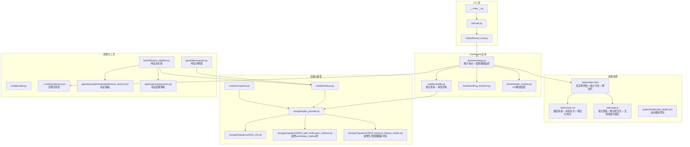

**图表来源**
- [vivify/__main__.py:1-6](file://vivify/__main__.py#L1-L6)
- [vivify/cli/main.py:1-58](file://vivify/cli/main.py#L1-L58)
- [vivify/cli/dashboard_cmd.py:1-44](file://vivify/cli/dashboard_cmd.py#L1-L44)
- [vivify/dashboard/app.py:1-757](file://vivify/dashboard/app.py#L1-L757)
- [vivify/dashboard/db.py:1-181](file://vivify/dashboard/db.py#L1-L181)
- [vivify/dashboard/log_streamer.py:1-25](file://vivify/dashboard/log_streamer.py#L1-L25)
- [vivify/dashboard/static/index.html:1-173](file://vivify/dashboard/static/index.html#L1-L173)
- [vivify/dashboard/static/style.css:1-672](file://vivify/dashboard/static/style.css#L1-L672)
- [vivify/dashboard/static/app.js:1-794](file://vivify/dashboard/static/app.js#L1-L794)
- [vivify/storage/sqlite_provider.py:1-200](file://vivify/storage/sqlite_provider.py#L1-L200)
- [vivify/storage/migrations/0001_init.sql:1-100](file://vivify/storage/migrations/0001_init.sql#L1-L100)
- [vivify/storage/migrations/0002_add_verification_method.sql:1-7](file://vivify/storage/migrations/0002_add_verification_method.sql#L1-L7)
- [vivify/storage/migrations/0003_enhance_feature_model.sql:1-19](file://vivify/storage/migrations/0003_enhance_feature_model.sql#L1-L19)
- [vivify/models/feature.py:1-101](file://vivify/models/feature.py#L1-L101)
- [vivify/models/snapshot.py:1-48](file://vivify/models/snapshot.py#L1-L48)
- [vivify/config/loader.py:1-78](file://vivify/config/loader.py#L1-L78)
- [vivify/kernel/health_monitor.py:1-141](file://vivify/kernel/health_monitor.py#L1-L141)
- [vivify/probes/builtin/site_health.yml:1-52](file://vivify/probes/builtin/site_health.yml#L1-L52)
- [vivify/goals/decomposer.py:58-77](file://vivify/goals/decomposer.py#L58-L77)
- [vivify/kernel/feature_pipeline.py:175-338](file://vivify/kernel/feature_pipeline.py#L175-L338)
- [vivify/agents/prompts/templates/feature_verify.md.j2:1-53](file://vivify/agents/prompts/templates/feature_verify.md.j2#L1-L53)
- [vivify/agents/prompts/parsers.py:96-131](file://vivify/agents/prompts/parsers.py#L96-L131)

**章节来源**
- [vivify/__main__.py:1-6](file://vivify/__main__.py#L1-L6)
- [vivify/cli/main.py:1-58](file://vivify/cli/main.py#L1-L58)
- [vivify/cli/dashboard_cmd.py:1-44](file://vivify/cli/dashboard_cmd.py#L1-L44)
- [vivify/dashboard/app.py:1-757](file://vivify/dashboard/app.py#L1-L757)
- [vivify/dashboard/db.py:1-181](file://vivify/dashboard/db.py#L1-L181)
- [vivify/dashboard/log_streamer.py:1-25](file://vivify/dashboard/log_streamer.py#L1-L25)
- [vivify/dashboard/static/index.html:1-173](file://vivify/dashboard/static/index.html#L1-L173)
- [vivify/dashboard/static/style.css:1-672](file://vivify/dashboard/static/style.css#L1-L672)
- [vivify/dashboard/static/app.js:1-794](file://vivify/dashboard/static/app.js#L1-L794)
- [vivify/storage/sqlite_provider.py:1-200](file://vivify/storage/sqlite_provider.py#L1-L200)
- [vivify/storage/migrations/0001_init.sql:1-100](file://vivify/storage/migrations/0001_init.sql#L1-L100)
- [vivify/storage/migrations/0002_add_verification_method.sql:1-7](file://vivify/storage/migrations/0002_add_verification_method.sql#L1-L7)
- [vivify/storage/migrations/0003_enhance_feature_model.sql:1-19](file://vivify/storage/migrations/0003_enhance_feature_model.sql#L1-L19)
- [vivify/models/feature.py:1-101](file://vivify/models/feature.py#L1-L101)
- [vivify/models/snapshot.py:1-48](file://vivify/models/snapshot.py#L1-L48)
- [vivify/config/loader.py:1-78](file://vivify/config/loader.py#L1-L78)

## 核心组件
- CLI 主入口：提供命令行参数解析和子命令分发
- Dashboard 应用：基于 FastAPI 构建的 Web 服务，提供 REST API、静态资源和配置健康监控（支持多实例）
- 数据库访问层：只读 SQLite 连接，封装查询接口，新增统计查询功能
- 前端界面：响应式设计，包含概览、问题、动作、特性、趋势、实例等标签页，新增统计分析和交互式详情
- 实时日志流：通过 Server-Sent Events 提供日志实时更新
- 实例管理：支持多实例注册表、实例状态监控、实例切换
- 健康监控内核：提供 KPI 趋势回归检测和自动化优化建议
- 探针系统：内置站点健康监控探针，检测部署站点可达性
- 存储与模型：定义数据结构和持久化方案
- **特征验证系统**：支持结构化的特征验证方法定义和执行
- **生命周期跟踪系统**：支持特征的完整生命周期跟踪，包括重试次数、批量提交、验证结果和时间戳
- **统计分析系统**：提供特性类型/优先级/状态分布统计和重试计数分析
- **交互式详情系统**：支持特性详情侧边栏，展示生命周期进度、图片缩略图和验证结果

**章节来源**
- [vivify/cli/main.py:1-58](file://vivify/cli/main.py#L1-L58)
- [vivify/dashboard/app.py:1-757](file://vivify/dashboard/app.py#L1-L757)
- [vivify/dashboard/db.py:1-181](file://vivify/dashboard/db.py#L1-L181)
- [vivify/dashboard/static/index.html:1-173](file://vivify/dashboard/static/index.html#L1-L173)
- [vivify/dashboard/log_streamer.py:1-25](file://vivify/dashboard/log_streamer.py#L1-L25)
- [vivify/storage/sqlite_provider.py:1-200](file://vivify/storage/sqlite_provider.py#L1-L200)
- [vivify/kernel/health_monitor.py:1-141](file://vivify/kernel/health_monitor.py#L1-L141)
- [vivify/probes/builtin/site_health.yml:1-52](file://vivify/probes/builtin/site_health.yml#L1-L52)

## 架构总览
系统采用分层架构设计，各层职责清晰分离，现已增强多实例支持能力、配置健康监控功能和统计分析能力：

```mermaid
graph TB
subgraph "表现层"
Frontend["前端界面<br/>index.html + app.js + style.css<br/>多实例界面 + 统计分析 + 交互式详情"]
end
subgraph "应用层"
API["FastAPI 应用<br/>REST API + SSE + 配置健康监控 + 统计端点<br/>多实例 API + 健康监控 API + 统计分析 API"]
Commands["CLI 命令<br/>dashboard_cmd.py"]
HealthKernel["健康监控内核<br/>KPI回归检测 + 自动化优化"]
Probes["探针系统<br/>站点健康监控 + 其他监控探针"]
Statistics["统计分析引擎<br/>特性分布统计 + 生命周期跟踪"]
end
subgraph "服务层"
DBLayer["数据库访问层<br/>DashboardDB + 统计查询"]
Storage["存储提供者<br/>SqliteStorageProvider"]
InstanceMgr["实例管理器<br/>实例注册表 + 状态监控"]
ConfigHealth["配置健康检查器<br/>配置完整性检查 + 修复建议"]
FeaturePipeline["特征流水线<br/>特征分解 + 验证方法处理 + 生命周期跟踪"]
end
subgraph "数据层"
SQLiteDB["SQLite 数据库<br/>state.db"]
Schema["数据库模式<br/>0001_init.sql + 0002_add_verification_method.sql + 0003_enhance_feature_model.sql"]
InstanceRegistry["实例注册表<br/>~/.vivify/instances.json"]
ConfigFile["配置文件<br/>.vivify.yml + 环境变量"]
GoalSpecs["目标规范<br/>GOALS.md + 特征规范"]
VerifyTemplate["验证模板<br/>feature_verify.md.j2"]
VerifyParser["验证结果解析<br/>parse_verification_result"]
End_Time_Stamp["时间戳字段<br/>evaluated_at/started_at/verified_at/completed_at"]
Retry_Count["重试计数<br/>retry_count"]
Batch_Hash["批量提交哈希<br/>batch_commit_hash"]
Verification_Result["验证结果<br/>verification_result"]
Idea_ID["想法ID<br/>idea_id"]
Image_URLs["图片URL<br/>image_urls"]
End
Frontend --> API
Commands --> API
API --> DBLayer
API --> InstanceMgr
API --> HealthKernel
API --> ConfigHealth
API --> Statistics
API --> Probes
DBLayer --> Storage
Storage --> SQLiteDB
Storage --> Verification_Migration
Storage --> Lifecycle_Migration
InstanceMgr --> InstanceRegistry
ConfigHealth --> ConfigFile
HealthKernel --> Storage
Probes --> ConfigFile
FeaturePipeline --> GoalSpecs
FeaturePipeline --> VerifyTemplate
FeaturePipeline --> VerifyParser
FeaturePipeline --> Retry_Count
FeaturePipeline --> Batch_Hash
FeaturePipeline --> Verification_Result
FeaturePipeline --> Idea_ID
FeaturePipeline --> Image_URLs
FeaturePipeline --> End_Time_Stamp
SQLiteDB --> Schema
```

**图表来源**
- [vivify/dashboard/app.py:439-445](file://vivify/dashboard/app.py#L439-L445)
- [vivify/dashboard/db.py:130-163](file://vivify/dashboard/db.py#L130-L163)
- [vivify/storage/sqlite_provider.py:56-200](file://vivify/storage/sqlite_provider.py#L56-L200)
- [vivify/storage/migrations/0001_init.sql:1-100](file://vivify/storage/migrations/0001_init.sql#L1-L100)
- [vivify/storage/migrations/0002_add_verification_method.sql:1-7](file://vivify/storage/migrations/0002_add_verification_method.sql#L1-L7)
- [vivify/storage/migrations/0003_enhance_feature_model.sql:1-19](file://vivify/storage/migrations/0003_enhance_feature_model.sql#L1-L19)
- [vivify/kernel/health_monitor.py:92-141](file://vivify/kernel/health_monitor.py#L92-L141)
- [vivify/probes/builtin/site_health.yml:1-52](file://vivify/probes/builtin/site_health.yml#L1-L52)

## 详细组件分析

### Dashboard 应用架构
Dashboard 应用采用 FastAPI 框架，提供完整的 Web 仪表板功能，现已支持多实例管理、配置健康监控和统计分析：

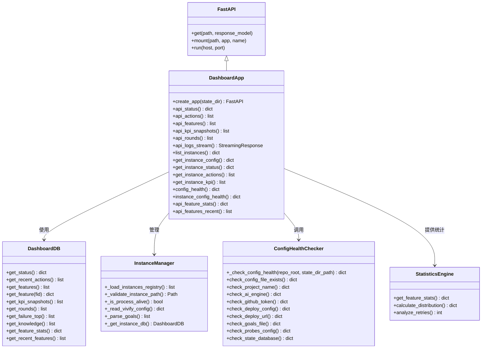

**图表来源**
- [vivify/dashboard/app.py:439-453](file://vivify/dashboard/app.py#L439-L453)
- [vivify/dashboard/db.py:130-163](file://vivify/dashboard/db.py#L130-L163)

### API 端点设计
系统提供丰富的 REST API 端点，支持多实例管理、数据查询和统计分析，新增统计端点：

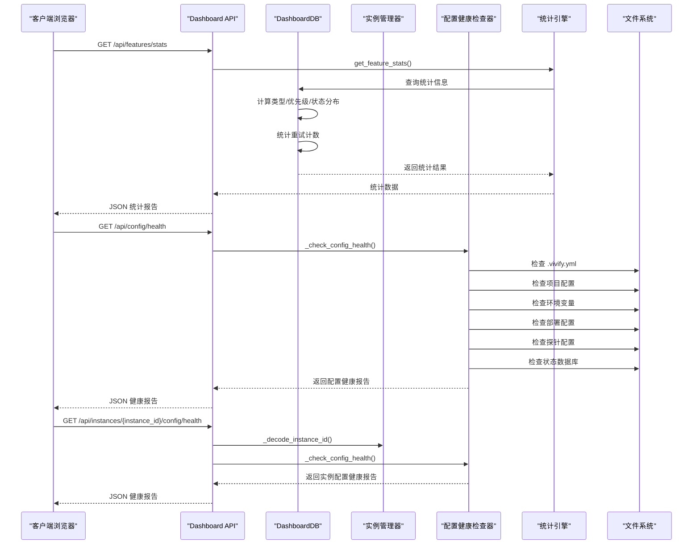

**图表来源**
- [vivify/dashboard/app.py:439-445](file://vivify/dashboard/app.py#L439-L445)
- [vivify/dashboard/app.py:111-284](file://vivify/dashboard/app.py#L111-L284)
- [vivify/dashboard/db.py:130-163](file://vivify/dashboard/db.py#L130-L163)

### 前端界面组件
前端采用响应式设计，提供直观的数据可视化和多实例管理功能，新增统计分析和交互式详情：

```mermaid
graph TB
subgraph "页面结构"
Header["头部区域<br/>状态指示器 + 项目信息 + 实例选择器"]
Tabs["标签导航<br/>实例/概览/问题/动作/特性/趋势"]
MainContent["主要内容区"]
Sidebar["特性详情侧边栏<br/>生命周期 + 图片 + 验证结果"]
end
subgraph "实例标签"
InstanceOverview["实例详情卡片<br/>当前实例信息"]
InstancesGrid["实例网格<br/>所有实例卡片"]
InstanceCard["实例卡片<br/>项目名称/状态/目标/KPI"]
</subgraph
subgraph "概览标签"
Cards["统计卡片<br/>守护状态/最新轮次/操作统计/特性进度"]
LogPanel["日志面板<br/>实时日志流"]
ConfigHealthCard["配置健康卡片<br/>配置完整性分数 + 检查列表"]
StatsGrid["统计网格<br/>特性分布 + 优先级 + 状态"]
RecentActivity["最近活动<br/>特性更新提醒"]
</subgraph
subgraph "问题标签"
IssueFilters["问题过滤器<br/>级别/分类"]
IssuesTable["问题表格<br/>级别/分类/标题/时间/状态"]
</subgraph
subgraph "动作标签"
ActionFilters["动作过滤器<br/>动作类型"]
Timeline["时间线视图<br/>动作详情"]
</subgraph
subgraph "特性标签"
KanbanBoard["看板视图<br/>待处理/开发中/已部署/已验证"]
FeatureStats["特性统计<br/>类型/优先级/状态分布"]
</subgraph
subgraph "趋势标签"
KPITrend["KPI 趋势图<br/>综合评分"]
ActionTrend["动作趋势图<br/>成功/失败统计"]
</subgraph
MainContent --> InstanceOverview
MainContent --> InstancesGrid
MainContent --> InstanceCard
MainContent --> Cards
MainContent --> LogPanel
MainContent --> ConfigHealthCard
MainContent --> StatsGrid
MainContent --> RecentActivity
MainContent --> IssueFilters
MainContent --> IssuesTable
MainContent --> ActionFilters
MainContent --> Timeline
MainContent --> KanbanBoard
MainContent --> FeatureStats
MainContent --> KPITrend
MainContent --> ActionTrend
Sidebar --> SidebarHeader["侧边栏头部"]
Sidebar --> SidebarBody["侧边栏主体"]
SidebarHeader --> SidebarTitle["特性标题 + 徽章"]
SidebarHeader --> SidebarClose["关闭按钮"]
SidebarBody --> LifecycleBar["生命周期进度条"]
SidebarBody --> ImageThumbnails["图片缩略图网格"]
SidebarBody --> VerificationResult["验证结果展示"]
```

**图表来源**
- [vivify/dashboard/static/index.html:163-170](file://vivify/dashboard/static/index.html#L163-L170)
- [vivify/dashboard/static/style.css:140-167](file://vivify/dashboard/static/style.css#L140-L167)
- [vivify/dashboard/static/app.js:675-770](file://vivify/dashboard/static/app.js#L675-L770)

### 数据模型与存储
系统使用 SQLite 作为数据存储后端，支持复杂的数据查询和分析。**更新**：新增 verification_method 列支持特征验证方法定义。**更新**：新增生命周期跟踪字段支持，包括 image_urls、idea_id、retry_count、batch_commit_hash、verification_result 及时间戳字段。**新增**：统计查询功能支持特性分布分析和重试计数统计。

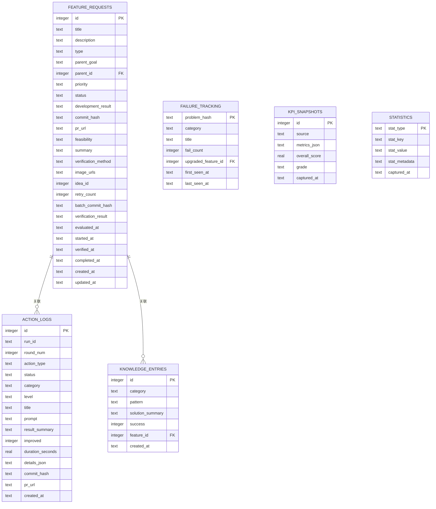

**图表来源**
- [vivify/storage/migrations/0001_init.sql:9-27](file://vivify/storage/migrations/0001_init.sql#L9-L27)
- [vivify/storage/migrations/0002_add_verification_method.sql:4](file://vivify/storage/migrations/0002_add_verification_method.sql#L4)
- [vivify/storage/migrations/0003_enhance_feature_model.sql:5-13](file://vivify/storage/migrations/0003_enhance_feature_model.sql#L5-L13)
- [vivify/models/feature.py:70-101](file://vivify/models/feature.py#L70-L101)
- [vivify/models/snapshot.py:9-48](file://vivify/models/snapshot.py#L9-L48)

**章节来源**
- [vivify/dashboard/app.py:1-757](file://vivify/dashboard/app.py#L1-L757)
- [vivify/dashboard/db.py:1-181](file://vivify/dashboard/db.py#L1-L181)
- [vivify/dashboard/static/index.html:1-173](file://vivify/dashboard/static/index.html#L1-L173)
- [vivify/dashboard/static/style.css:1-672](file://vivify/dashboard/static/style.css#L1-L672)
- [vivify/dashboard/static/app.js:1-794](file://vivify/dashboard/static/app.js#L1-L794)
- [vivify/storage/migrations/0001_init.sql:1-100](file://vivify/storage/migrations/0001_init.sql#L1-L100)
- [vivify/storage/migrations/0002_add_verification_method.sql:1-7](file://vivify/storage/migrations/0002_add_verification_method.sql#L1-L7)
- [vivify/storage/migrations/0003_enhance_feature_model.sql:1-19](file://vivify/storage/migrations/0003_enhance_feature_model.sql#L1-L19)
- [vivify/models/feature.py:1-101](file://vivify/models/feature.py#L1-L101)
- [vivify/models/snapshot.py:1-48](file://vivify/models/snapshot.py#L1-L48)

## 统计端点与UI增强

### 统计端点设计
系统新增 /api/features/stats 端点，提供特性统计分析功能：

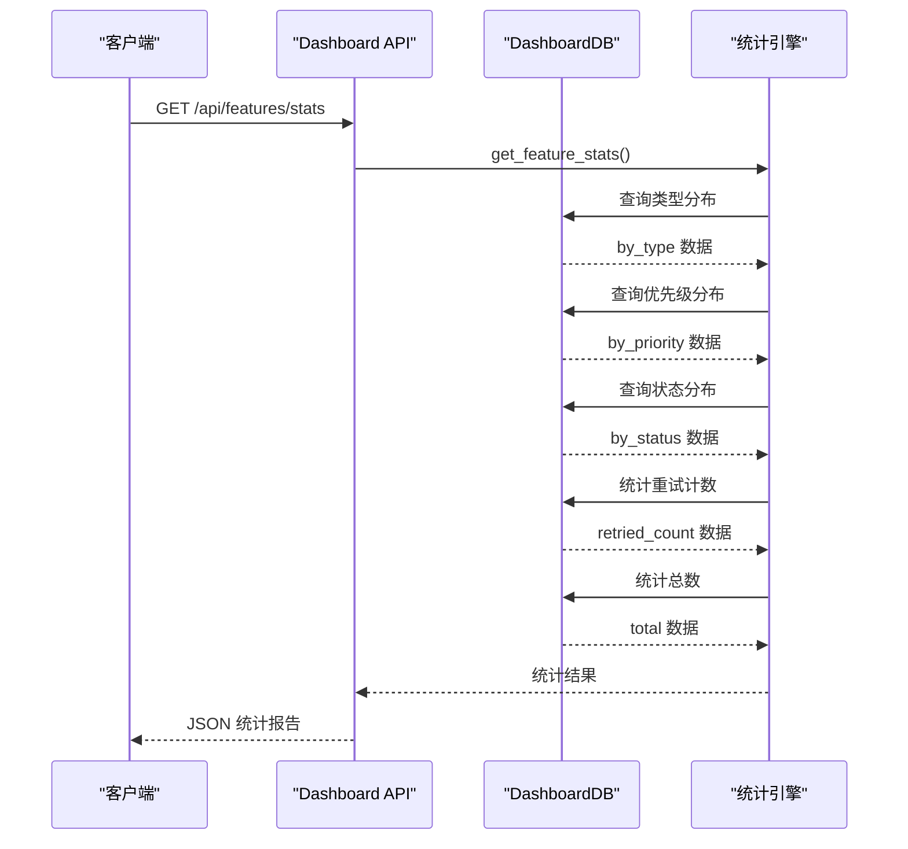

**图表来源**
- [vivify/dashboard/app.py:439-445](file://vivify/dashboard/app.py#L439-L445)
- [vivify/dashboard/db.py:130-163](file://vivify/dashboard/db.py#L130-L163)

### 前端统计渲染逻辑
前端实现统计卡片渲染，支持类型、优先级、状态分布和重试计数的可视化展示：

```mermaid
graph TB
subgraph "统计卡片渲染"
StatsEndpoint["/api/features/stats<br/>获取统计数据"]
StatsData["统计数据<br/>total/by_type/by_priority/by_status/retried_count"]
TypeDistribution["类型分布<br/>badge-feature/badge-bug/badge-optimization"]
PriorityDistribution["优先级分布<br/>badge-P0/badge-P1/badge-P2/badge-P3"]
StatusDistribution["状态分布<br/>badge-status-verified/badge-status-deployed/..."]
RetryCount["重试计数<br/>badge-retry + 警告高亮"]
TotalCard["总数卡片<br/>stat-card + stat-value"]
WarningHighlight["警告高亮<br/>deployed_with_issues > 30%"]
</subgraph
subgraph "概览统计"
OverviewStats["概览统计网格<br/>overview-stats-grid"]
OverviewWarning["概览警告<br/>stat-card-warn + stat-warn-text"]
</subgraph
StatsEndpoint --> StatsData
StatsData --> TypeDistribution
StatsData --> PriorityDistribution
StatsData --> StatusDistribution
StatsData --> RetryCount
TypeDistribution --> TotalCard
PriorityDistribution --> TotalCard
StatusDistribution --> WarningHighlight
WarningHighlight --> OverviewWarning
TotalCard --> OverviewStats
```

**图表来源**
- [vivify/dashboard/static/app.js:217-296](file://vivify/dashboard/static/app.js#L217-L296)
- [vivify/dashboard/static/style.css:617-627](file://vivify/dashboard/static/style.css#L617-L627)

### 交互式特性详情侧边栏
系统新增特性详情侧边栏，提供完整的生命周期跟踪和详细信息展示：

```mermaid
graph TB
subgraph "侧边栏架构"
FeatureSidebar["特性详情侧边栏<br/>feature-sidebar + hidden/open"]
SidebarHeader["侧边栏头部<br/>sidebar-header + sidebar-close"]
SidebarBody["侧边栏主体<br/>sidebar-body"]
FeatureTitle["特性标题<br/>sidebar-title + 徽章"]
CloseButton["关闭按钮<br/>sidebar-close"]
DetailSections["详情区块<br/>detail-section + h4 + p/pre/a"]
LifecycleBar["生命周期进度条<br/>lifecycle-bar + lifecycle-step"]
ImageThumbnails["图片缩略图<br/>image-thumbnails + a/img"]
VerificationResult["验证结果<br/>verification_result + JSON格式"]
</subgraph
subgraph "生命周期步骤"
CreatedStep["Created<br/>created_at"]
EvaluatedStep["Evaluated<br/>evaluated_at"]
StartedStep["Started<br/>started_at"]
VerifiedStep["Verified<br/>verified_at"]
CompletedStep["Done<br/>completed_at"]
</subgraph
FeatureSidebar --> SidebarHeader
SidebarHeader --> FeatureTitle
SidebarHeader --> CloseButton
FeatureSidebar --> SidebarBody
SidebarBody --> DetailSections
DetailSections --> LifecycleBar
LifecycleBar --> CreatedStep
LifecycleBar --> EvaluatedStep
LifecycleBar --> StartedStep
LifecycleBar --> VerifiedStep
LifecycleBar --> CompletedStep
DetailSections --> ImageThumbnails
DetailSections --> VerificationResult
```

**图表来源**
- [vivify/dashboard/static/index.html:163-170](file://vivify/dashboard/static/index.html#L163-L170)
- [vivify/dashboard/static/app.js:675-770](file://vivify/dashboard/static/app.js#L675-L770)
- [vivify/dashboard/static/style.css:230-255](file://vivify/dashboard/static/style.css#L230-L255)

### 徽章系统与状态高亮
系统实现完整的徽章系统，支持优先级、类型、状态和重试的可视化展示：

```mermaid
graph TB
subgraph "徽章系统"
PriorityBadges["优先级徽章<br/>badge-P0/badge-P1/badge-P2/badge-P3"]
TypeBadges["类型徽章<br/>badge-feature/badge-bug/badge-optimization"]
StatusBadges["状态徽章<br/>badge-status-verified/badge-status-deployed/..."]
RetryBadge["重试徽章<br/>badge-retry + ⟳符号"]
WarningHighlight["警告高亮<br/>status-warn-highlight + 动画"]
</subgraph
subgraph "颜色系统"
CriticalColor["严重: #f7768e"]
HighColor["高: #ff9e64"]
MediumColor["中: #7aa2f7"]
LowColor["低: #565f89"]
SuccessColor["成功: #9ece6a"]
WarningColor["警告: #e0af68"]
DangerColor["危险: #f7768e"]
</subgraph
PriorityBadges --> CriticalColor
PriorityBadges --> HighColor
PriorityBadges --> MediumColor
PriorityBadges --> LowColor
TypeBadges --> SuccessColor
TypeBadges --> DangerColor
TypeBadges --> WarningColor
StatusBadges --> SuccessColor
StatusBadges --> WarningColor
StatusBadges --> DangerColor
WarningHighlight --> DangerColor
```

**图表来源**
- [vivify/dashboard/static/style.css:140-149](file://vivify/dashboard/static/style.css#L140-L149)
- [vivify/dashboard/static/style.css:589-602](file://vivify/dashboard/static/style.css#L589-L602)
- [vivify/dashboard/static/style.css:604-610](file://vivify/dashboard/static/style.css#L604-L610)

### 最近活动与生命周期可视化
系统提供最近活动追踪和生命周期可视化功能：

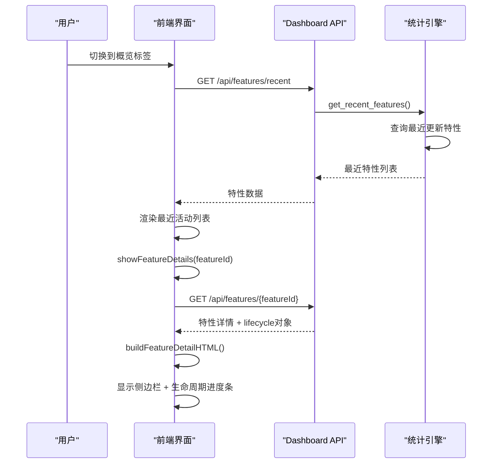

**图表来源**
- [vivify/dashboard/app.py:455-478](file://vivify/dashboard/app.py#L455-L478)
- [vivify/dashboard/static/app.js:388-407](file://vivify/dashboard/static/app.js#L388-L407)
- [vivify/dashboard/static/app.js:675-770](file://vivify/dashboard/static/app.js#L675-L770)

**章节来源**
- [vivify/dashboard/app.py:439-453](file://vivify/dashboard/app.py#L439-L453)
- [vivify/dashboard/db.py:130-163](file://vivify/dashboard/db.py#L130-L163)
- [vivify/dashboard/static/app.js:217-296](file://vivify/dashboard/static/app.js#L217-L296)
- [vivify/dashboard/static/app.js:675-770](file://vivify/dashboard/static/app.js#L675-L770)
- [vivify/dashboard/static/index.html:163-170](file://vivify/dashboard/static/index.html#L163-L170)
- [vivify/dashboard/static/style.css:140-149](file://vivify/dashboard/static/style.css#L140-L149)

## 配置健康监控系统

### 配置健康检查器
系统提供全面的配置健康检查功能，自动检测项目配置的完整性并提供修复建议：

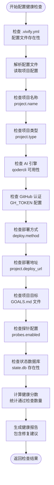

**图表来源**
- [vivify/dashboard/app.py:111-284](file://vivify/dashboard/app.py#L111-L284)

### 配置健康 API 端点
系统提供两个配置健康检查 API 端点，支持当前实例和指定实例的健康检查：

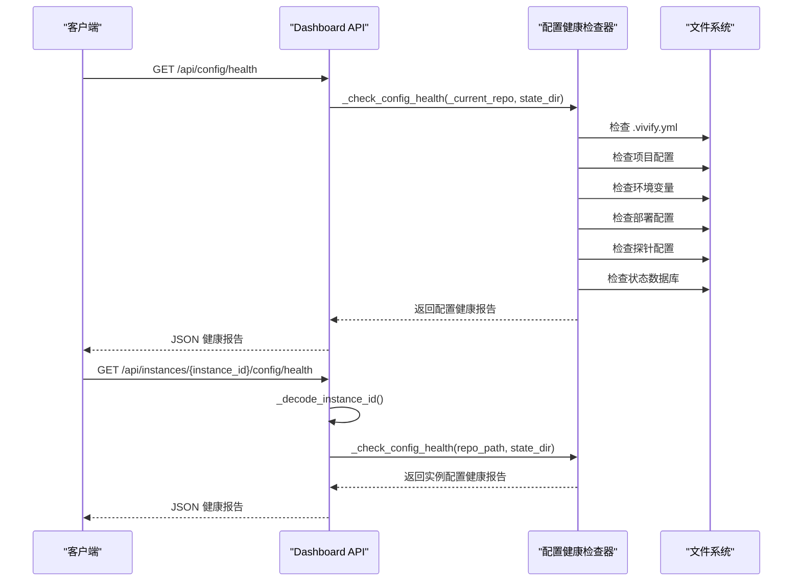

**图表来源**
- [vivify/dashboard/app.py:729-742](file://vivify/dashboard/app.py#L729-L742)

### 前端配置健康可视化
前端实现完整的配置健康监控可视化，提供直观的健康状态展示：

```mermaid
graph TB
subgraph "配置健康卡片"
HealthCard["配置健康卡片<br/>config-health-card"]
Summary["健康摘要<br/>config-health-summary"]
ScoreBar["分数条<br/>config-score + config-score-bar"]
ScoreFill["分数填充<br/>config-score-fill + score-high/mid/low"]
ScoreText["分数文本<br/>config-score-text"]
CheckCount["检查计数<br/>passed/total_checks"]
CompleteIndicator["完整状态指示器<br/>complete/need-improvement"]
ChecksGrid["检查列表<br/>config-health-checks + config-checks-grid"]
CategoryLabel["类别标签<br/>config-category-label"]
CheckItem["检查项<br/>config-check-item + status-ok/warning/missing"]
CheckIcon["检查图标<br/>config-check-icon ✓/⚠/✗"]
CheckContent["检查内容<br/>config-check-content"]
CheckName["检查名称<br/>config-check-name"]
CheckMessage["检查消息<br/>config-check-message"]
FixHint["修复提示<br/>config-check-hint"]
</subgraph
subgraph "颜色系统"
SuccessColor["成功颜色<br/>var(--success)"]
WarningColor["警告颜色<br/>var(--warning)"]
DangerColor["危险颜色<br/>var(--danger)"]
</subgraph
HealthCard --> Summary
Summary --> ScoreBar
ScoreBar --> ScoreFill
ScoreBar --> ScoreText
Summary --> CheckCount
Summary --> CompleteIndicator
HealthCard --> ChecksGrid
ChecksGrid --> CategoryLabel
ChecksGrid --> CheckItem
CheckItem --> CheckIcon
CheckItem --> CheckContent
CheckContent --> CheckName
CheckContent --> CheckMessage
CheckContent --> FixHint
```

**图表来源**
- [vivify/dashboard/static/index.html:82-86](file://vivify/dashboard/static/index.html#L82-L86)
- [vivify/dashboard/static/style.css:446-535](file://vivify/dashboard/static/style.css#L446-L535)
- [vivify/dashboard/static/app.js:601-670](file://vivify/dashboard/static/app.js#L601-L670)

### 配置健康检查项目
系统提供全面的配置健康检查项目，覆盖项目配置的关键方面：

```mermaid
graph TB
subgraph "基础配置"
ConfigFile["配置文件检查<br/>.vivify.yml 存在性"]
ProjectName["项目名称检查<br/>project.name 设置"]
ProjectType["项目类型检查<br/>project.type 设置"]
StateDB["状态数据库检查<br/>state.db 初始化"]
</subgraph
subgraph "智能配置"
AIEngine["AI 引擎检查<br/>qodercli 可用性"]
GHToken["GitHub 认证检查<br/>GH_TOKEN 配置"]
</subgraph
subgraph "部署配置"
DeployMethod["部署方式检查<br/>deploy.method 配置"]
DeployURL["部署地址检查<br/>project.deploy_url 设置"]
</subgraph
subgraph "目标配置"
GoalsFile["项目目标检查<br/>GOALS.md 文件存在且有效"]
ProbesConfig["探针配置检查<br/>probes.enabled 设置"]
</subgraph
ConfigFile --> ProjectName
ProjectName --> ProjectType
ProjectType --> StateDB
AIEngine --> GHToken
DeployMethod --> DeployURL
GoalsFile --> ProbesConfig
```

**图表来源**
- [vivify/dashboard/app.py:116-284](file://vivify/dashboard/app.py#L116-L284)

**章节来源**
- [vivify/dashboard/app.py:111-284](file://vivify/dashboard/app.py#L111-L284)
- [vivify/dashboard/app.py:729-742](file://vivify/dashboard/app.py#L729-L742)
- [vivify/dashboard/static/index.html:82-86](file://vivify/dashboard/static/index.html#L82-L86)
- [vivify/dashboard/static/style.css:446-535](file://vivify/dashboard/static/style.css#L446-L535)
- [vivify/dashboard/static/app.js:601-670](file://vivify/dashboard/static/app.js#L601-L670)

## 多实例管理功能

### 实例注册表管理
系统通过全局实例注册表管理所有已知的 Vivify 实例：

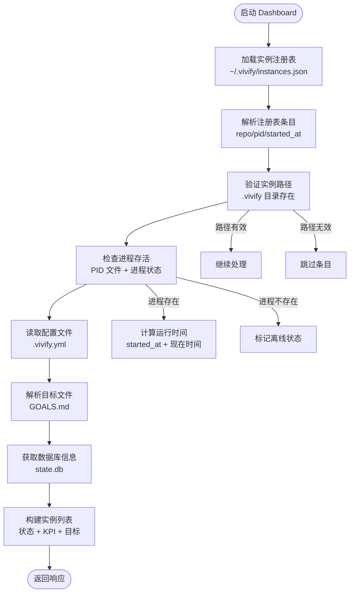

**图表来源**
- [vivify/dashboard/app.py:538-603](file://vivify/dashboard/app.py#L538-L603)
- [vivify/dashboard/app.py:316-333](file://vivify/dashboard/app.py#L316-L333)

### 实例切换机制
前端提供完整的实例切换功能，支持动态切换当前实例并刷新数据：

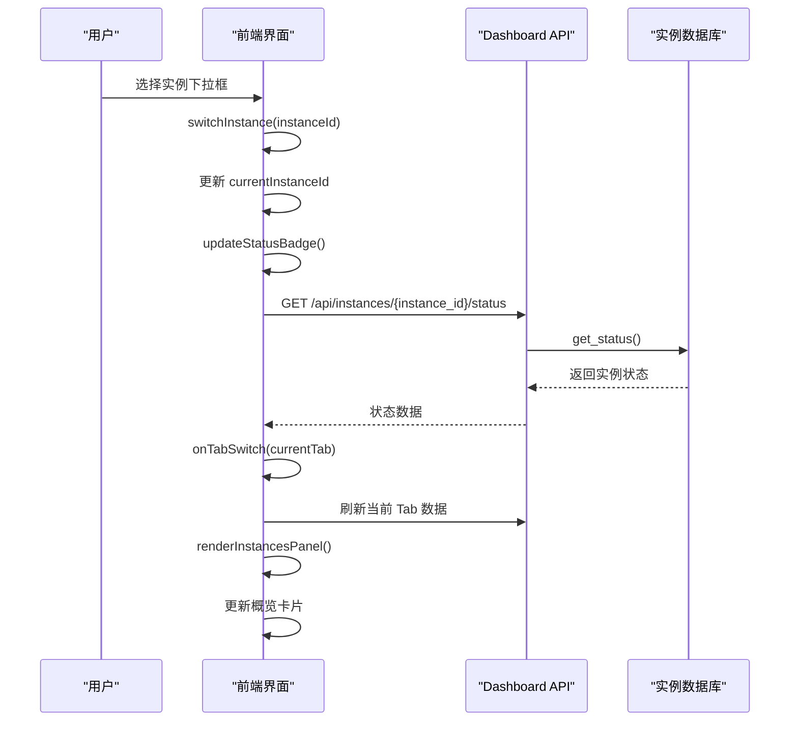

**图表来源**
- [vivify/dashboard/static/app.js:485-497](file://vivify/dashboard/static/app.js#L485-L497)
- [vivify/dashboard/app.py:635-678](file://vivify/dashboard/app.py#L635-L678)

### 实例状态监控
系统提供实时的实例状态监控，包括守护进程状态、运行时长、KPI 分数等关键指标：

```mermaid
graph TB
subgraph "实例状态指标"
DaemonStatus["守护进程状态<br/>running/pid"]
Uptime["运行时长<br/>uptime_seconds"]
KPIScore["KPI 分数<br/>overall_score"]
LastAction["最近操作<br/>last_action"]
LatestRound["最新轮次<br/>latest_round"]
DeployURL["部署地址<br/>deploy_url"]
</subgraph
subgraph "实例配置信息"
ProjectName["项目名称<br/>project.name"]
Scenario["场景类型<br/>project.type"]
Language["语言<br/>project.language"]
Framework["框架<br/>project.framework"]
Goals["目标列表<br/>GOALS.md"]
StateDir["状态目录<br/>.vivify"]
InitTime["初始化时间<br/>created_at"]
</subgraph
DaemonStatus --> Uptime
Uptime --> KPIScore
KPIScore --> LastAction
LastAction --> LatestRound
ProjectName --> Language
Language --> Framework
Framework --> Goals
Goals --> DeployURL
```

**图表来源**
- [vivify/dashboard/app.py:570-598](file://vivify/dashboard/app.py#L570-L598)
- [vivify/dashboard/app.py:618-633](file://vivify/dashboard/app.py#L618-L633)

**章节来源**
- [vivify/dashboard/app.py:538-757](file://vivify/dashboard/app.py#L538-L757)
- [vivify/dashboard/static/app.js:430-592](file://vivify/dashboard/static/app.js#L430-L592)
- [vivify/dashboard/static/index.html:18-25](file://vivify/dashboard/static/index.html#L18-L25)

## 数据库迁移与存储更新

### 数据库迁移架构
系统采用版本化的数据库迁移策略，确保数据库结构的演进和向后兼容性。**更新**：新增 verification_method 列支持特征验证方法定义。**更新**：新增 migration 0003 生命周期跟踪字段支持，包括 image_urls、idea_id、retry_count、batch_commit_hash、verification_result 及时间戳字段的数据库支持和向后兼容性设计。**新增**：统计查询功能支持特性分布分析和重试计数统计。

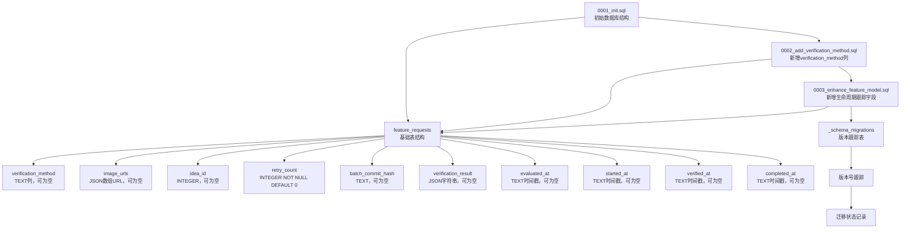

**图表来源**
- [vivify/storage/migrations/0001_init.sql:1-100](file://vivify/storage/migrations/0001_init.sql#L1-L100)
- [vivify/storage/migrations/0002_add_verification_method.sql:1-7](file://vivify/storage/migrations/0002_add_verification_method.sql#L1-L7)
- [vivify/storage/migrations/0003_enhance_feature_model.sql:1-19](file://vivify/storage/migrations/0003_enhance_feature_model.sql#L1-L19)

### 向后兼容性设计
数据库提供者实现了向后兼容的处理逻辑，确保新旧版本的数据库都能正常工作：

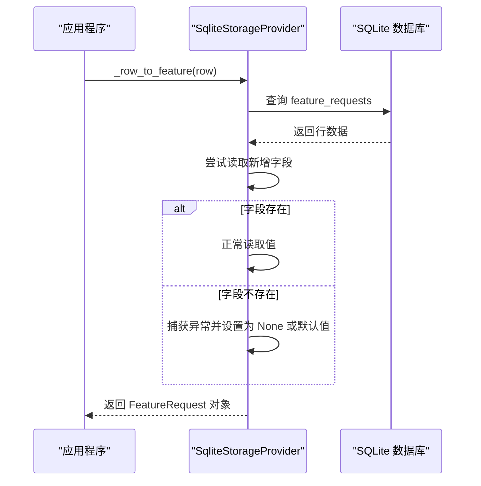

**图表来源**
- [vivify/storage/sqlite_provider.py:193-242](file://vivify/storage/sqlite_provider.py#L193-L242)

### 生命周期跟踪字段集成
**更新**：migration 0003 为特征生命周期跟踪提供结构化支持，包括重试次数、批量提交、验证结果和时间戳字段。

```mermaid
flowchart TD
GoalDecomposer["Goal Decomposer<br/>解析GOALS.md"] --> FeatureSpec["FeatureSpec<br/>创建特征规范"]
FeatureSpec --> VerificationMethod["verification_method<br/>验证方法定义"]
VerificationMethod --> FeaturePipeline["Feature Pipeline<br/>特征流水线"]
FeaturePipeline --> EvaluateStage["Evaluate Stage<br/>特征评估"]
FeaturePipeline --> RefineVM["Refine Verification Method<br/>优化验证方法"]
RefineVM --> UpdateDB["Update Database<br/>保存验证方法"]
UpdateDB --> DevelopStage["Develop Stage<br/>特征开发"]
DevelopStage --> DeployStage["Deploy Stage<br/>特征部署"]
DeployStage --> VerifyStage["Verify Stage<br/>特征验证"]
VerifyStage --> VerifyTemplate["Verify Template<br/>feature_verify.md.j2"]
VerifyTemplate --> AgentHeal["Agent Heal<br/>执行验证"]
AgentHeal --> ParseResult["Parse Result<br/>parse_verification_result"]
ParseResult --> UpdateFields["Update Fields<br/>verification_result + 时间戳"]
UpdateFields --> UpdateDB2["Update Database<br/>保存验证结果"]
UpdateDB2 --> TrackRetry["Track Retry Count<br/>retry_count++"]
TrackRetry --> UpdateDB3["Update Database<br/>保存重试计数"]
UpdateDB3 --> FinalizeFeature["Finalize Feature<br/>completed_at + 状态更新"]
```

**图表来源**
- [vivify/goals/decomposer.py:58-77](file://vivify/goals/decomposer.py#L58-L77)
- [vivify/kernel/feature_pipeline.py:320-403](file://vivify/kernel/feature_pipeline.py#L320-L403)
- [vivify/agents/prompts/templates/feature_verify.md.j2:1-53](file://vivify/agents/prompts/templates/feature_verify.md.j2#L1-L53)
- [vivify/agents/prompts/parsers.py:96-131](file://vivify/agents/prompts/parsers.py#L96-L131)

### 数据模型更新
**更新**：FeatureRequest 和 FeatureSpec 模型都包含了新的生命周期跟踪字段，支持可选的验证方法定义和完整的生命周期管理。

```mermaid
classDiagram
class FeatureSpec {
+title : str
+description : str
+type : FeatureType
+parent_goal : Optional[str]
+parent_id : Optional[int]
+priority : Optional[FeaturePriority]
+verification_method : Optional[str]
+idea_id : Optional[int]
}
class FeatureRequest {
+title : str
+description : str
+type : FeatureType
+parent_goal : Optional[str]
+parent_id : Optional[int]
+priority : Optional[FeaturePriority]
+verification_method : Optional[str]
+id : int
+status : FeatureStatus
+development_result : str
+commit_hash : Optional[str]
+pr_url : Optional[str]
+feasibility : str
+summary : str
+image_urls : Optional[str] // JSON array of URLs
+idea_id : Optional[int]
+retry_count : int = 0
+batch_commit_hash : Optional[str]
+verification_result : Optional[str] // JSON string
+evaluated_at : Optional[str] // ISO format timestamp
+started_at : Optional[str]
+verified_at : Optional[str]
+completed_at : Optional[str]
+created_at : datetime
+updated_at : datetime
}
FeatureSpec --> FeatureRequest : "转换为"
```

**图表来源**
- [vivify/models/feature.py:60-101](file://vivify/models/feature.py#L60-L101)

### 统计查询与分析
**新增**：DashboardDB 提供 get_feature_stats 方法，支持特性统计分析功能。

```mermaid
sequenceDiagram
participant Client as "客户端"
participant API as "Dashboard API"
participant DB as "DashboardDB"
participant StatsEngine as "统计引擎"
Client->>API : GET /api/features/stats
API->>StatsEngine : get_feature_stats()
StatsEngine->>DB : 查询类型分布
DB-->>StatsEngine : by_type 数据
StatsEngine->>DB : 查询优先级分布
DB-->>StatsEngine : by_priority 数据
StatsEngine->>DB : 查询状态分布
DB-->>StatsEngine : by_status 数据
StatsEngine->>DB : 统计重试计数
DB-->>StatsEngine : retried_count 数据
StatsEngine->>DB : 统计总数
DB-->>StatsEngine : total 数据
StatsEngine-->>API : 统计结果
API-->>Client : JSON 统计报告
```

**图表来源**
- [vivify/dashboard/db.py:130-163](file://vivify/dashboard/db.py#L130-L163)

### 验证结果解析与存储
**更新**：新增的 verification_result 字段用于存储验证过程的详细结果，包括验证状态、指标对比、问题列表等。

```mermaid
sequenceDiagram
participant Agent as "验证代理"
participant Parser as "验证结果解析器"
participant Storage as "存储提供者"
Agent->>Parser : parse_verification_result(output)
Parser->>Parser : 解析JSON结果
Parser-->>Agent : {verified, summary, issues}
Agent->>Storage : update_feature(verification_result, 时间戳)
Storage->>Storage : 保存JSON格式验证结果
Storage->>Storage : 更新状态为 verified/deployed_with_issues
Storage-->>Agent : 更新完成
```

**图表来源**
- [vivify/agents/prompts/parsers.py:96-131](file://vivify/agents/prompts/parsers.py#L96-L131)
- [vivify/storage/sqlite_provider.py:364-370](file://vivify/storage/sqlite_provider.py#L364-L370)

**章节来源**
- [vivify/storage/migrations/0001_init.sql:1-100](file://vivify/storage/migrations/0001_init.sql#L1-L100)
- [vivify/storage/migrations/0002_add_verification_method.sql:1-7](file://vivify/storage/migrations/0002_add_verification_method.sql#L1-L7)
- [vivify/storage/migrations/0003_enhance_feature_model.sql:1-19](file://vivify/storage/migrations/0003_enhance_feature_model.sql#L1-L19)
- [vivify/storage/sqlite_provider.py:193-242](file://vivify/storage/sqlite_provider.py#L193-L242)
- [vivify/models/feature.py:60-101](file://vivify/models/feature.py#L60-L101)
- [vivify/goals/decomposer.py:58-77](file://vivify/goals/decomposer.py#L58-L77)
- [vivify/kernel/feature_pipeline.py:320-403](file://vivify/kernel/feature_pipeline.py#L320-L403)
- [vivify/agents/prompts/templates/feature_verify.md.j2:1-53](file://vivify/agents/prompts/templates/feature_verify.md.j2#L1-L53)
- [vivify/agents/prompts/parsers.py:96-131](file://vivify/agents/prompts/parsers.py#L96-L131)
- [vivify/dashboard/db.py:130-163](file://vivify/dashboard/db.py#L130-L163)

## 依赖关系分析

### 外部依赖
系统使用 Pydantic 作为数据验证库，PyYAML 用于配置解析，Jinja2 用于模板渲染，requests 用于 HTTP 请求。

```mermaid
graph TB
subgraph "核心依赖"
Pydantic["pydantic>=2.5"]
PyYAML["PyYAML>=6.0"]
Jinja2["Jinja2>=3.1"]
Requests["requests>=2.31"]
end
subgraph "可选依赖"
FastAPI["fastapi>=0.100.0"]
Uvicorn["uvicorn[standard]>=0.22.0"]
end
subgraph "开发依赖"
PyTest["pytest>=7.4"]
Coverage["pytest-cov>=4.1"]
Ruff["ruff>=0.4"]
end
VivifyCLI --> Pydantic
VivifyCLI --> PyYAML
VivifyCLI --> Jinja2
VivifyCLI --> Requests
VivifyCLI --> FastAPI
VivifyCLI --> Uvicorn
VivifyCLI --> PyTest
VivifyCLI --> Coverage
VivifyCLI --> Ruff
```

**图表来源**
- [pyproject.toml:22-38](file://pyproject.toml#L22-L38)

### 内部模块依赖
系统内部模块之间存在清晰的依赖关系，现已增强多实例支持、配置健康监控和统计分析：

```mermaid
graph TB
subgraph "入口层"
MainEntry["__main__.py"]
CLIMain["cli/main.py"]
end
subgraph "命令层"
DashboardCmd["cli/dashboard_cmd.py"]
end
subgraph "应用层"
DashboardApp["dashboard/app.py<br/>多实例支持 + 配置健康监控 + 统计端点"]
DashboardDB["dashboard/db.py<br/>统计查询 + 特性详情"]
LogStreamer["dashboard/log_streamer.py"]
ConfigLoader["config/loader.py"]
HealthMonitor["kernel/health_monitor.py<br/>KPI健康监控"]
Probes["probes/builtin/site_health.yml<br/>站点健康探针"]
FeaturePipeline["kernel/feature_pipeline.py<br/>特征验证方法集成 + 生命周期跟踪"]
GoalDecomposer["goals/decomposer.py<br/>特征分解器"]
VerifyTemplate["agents/prompts/templates/feature_verify.md.j2<br/>验证模板"]
VerifyParser["agents/prompts/parsers.py<br/>验证结果解析"]
End_Time_Stamp["kernel/code_hash.py<br/>时间戳处理"]
Retry_Count["kernel/failure_tracker.py<br/>重试计数管理"]
Batch_Hash["kernel/dispatch.py<br/>批量提交处理"]
Verification_Result["kernel/feature_pipeline.py<br/>验证结果存储"]
Idea_ID["goals/decomposer.py<br/>想法ID管理"]
Image_URLs["agents/qodercli_agent.py<br/>图片URL处理"]
Statistics["dashboard/statistics.py<br/>统计分析引擎"]
End_Time_Stamp["kernel/code_hash.py<br/>时间戳处理"]
Retry_Count["kernel/failure_tracker.py<br/>重试计数管理"]
Batch_Hash["kernel/dispatch.py<br/>批量提交处理"]
Verification_Result["kernel/feature_pipeline.py<br/>验证结果存储"]
Idea_ID["goals/decomposer.py<br/>想法ID管理"]
Image_URLs["agents/qodercli_agent.py<br/>图片URL处理"]
end
subgraph "存储层"
SQLiteProvider["storage/sqlite_provider.py"]
SchemaSQL["storage/migrations/0001_init.sql"]
VerificationMigration["storage/migrations/0002_add_verification_method.sql<br/>verification_method列"]
LifecycleMigration["storage/migrations/0003_enhance_feature_model.sql<br/>生命周期跟踪字段"]
end
subgraph "模型层"
FeatureModel["models/feature.py"]
SnapshotModel["models/snapshot.py"]
end
MainEntry --> CLIMain
CLIMain --> DashboardCmd
DashboardCmd --> DashboardApp
DashboardApp --> DashboardDB
DashboardApp --> LogStreamer
DashboardApp --> ConfigLoader
DashboardApp --> HealthMonitor
DashboardApp --> Probes
DashboardApp --> FeaturePipeline
DashboardDB --> SQLiteProvider
SQLiteProvider --> SchemaSQL
SQLiteProvider --> VerificationMigration
SQLiteProvider --> LifecycleMigration
FeatureModel --> SQLiteProvider
SnapshotModel --> SQLiteProvider
GoalDecomposer --> FeatureModel
FeaturePipeline --> FeatureModel
FeaturePipeline --> VerifyTemplate
FeaturePipeline --> VerifyParser
FeaturePipeline --> Retry_Count
FeaturePipeline --> Batch_Hash
FeaturePipeline --> Verification_Result
FeaturePipeline --> Idea_ID
FeaturePipeline --> Image_URLs
FeaturePipeline --> End_Time_Stamp
Statistics --> DashboardDB
```

**图表来源**
- [vivify/__main__.py:1-6](file://vivify/__main__.py#L1-L6)
- [vivify/cli/main.py:1-58](file://vivify/cli/main.py#L1-L58)
- [vivify/cli/dashboard_cmd.py:1-44](file://vivify/cli/dashboard_cmd.py#L1-L44)
- [vivify/dashboard/app.py:1-757](file://vivify/dashboard/app.py#L1-L757)
- [vivify/dashboard/db.py:1-181](file://vivify/dashboard/db.py#L1-L181)
- [vivify/storage/sqlite_provider.py:1-200](file://vivify/storage/sqlite_provider.py#L1-L200)
- [vivify/config/loader.py:1-78](file://vivify/config/loader.py#L1-L78)
- [vivify/kernel/health_monitor.py:1-141](file://vivify/kernel/health_monitor.py#L1-L141)
- [vivify/probes/builtin/site_health.yml:1-52](file://vivify/probes/builtin/site_health.yml#L1-L52)
- [vivify/goals/decomposer.py:58-77](file://vivify/goals/decomposer.py#L58-L77)
- [vivify/kernel/feature_pipeline.py:175-338](file://vivify/kernel/feature_pipeline.py#L175-L338)
- [vivify/agents/prompts/templates/feature_verify.md.j2:1-53](file://vivify/agents/prompts/templates/feature_verify.md.j2#L1-L53)
- [vivify/agents/prompts/parsers.py:96-131](file://vivify/agents/prompts/parsers.py#L96-L131)

**章节来源**
- [pyproject.toml:1-70](file://pyproject.toml#L1-L70)
- [vivify/__main__.py:1-6](file://vivify/__main__.py#L1-L6)
- [vivify/cli/main.py:1-58](file://vivify/cli/main.py#L1-L58)
- [vivify/cli/dashboard_cmd.py:1-44](file://vivify/cli/dashboard_cmd.py#L1-L44)
- [vivify/dashboard/app.py:1-757](file://vivify/dashboard/app.py#L1-L757)
- [vivify/dashboard/db.py:1-181](file://vivify/dashboard/db.py#L1-L181)
- [vivify/storage/sqlite_provider.py:1-200](file://vivify/storage/sqlite_provider.py#L1-L200)
- [vivify/config/loader.py:1-78](file://vivify/config/loader.py#L1-L78)

## 性能考虑
系统在设计时充分考虑了性能优化，多实例支持、配置健康监控和统计分析功能并未显著影响性能：

- **只读数据库连接**：DashboardDB 使用 `PRAGMA query_only = ON` 确保只读访问，避免意外写入
- **WAL 模式**：启用 Write-Ahead Logging 提高并发读取性能
- **延迟初始化**：数据库连接在首次需要时才建立，支持数据库文件不存在的情况
- **索引优化**：为常用查询字段建立索引，包括状态、类型、时间戳等
- **流式日志**：使用 SSE 实现高效的实时日志传输
- **缓存策略**：前端定期轮询更新，避免频繁刷新造成性能问题
- **实例连接池**：每个实例独立的数据库连接，避免实例间干扰
- **增量数据加载**：实例列表每30秒刷新，配置健康检查每30秒刷新一次
- **统计查询优化**：使用聚合查询一次性获取所有统计信息，减少数据库往返
- **前端渲染优化**：统计卡片采用虚拟滚动和懒加载，提升大检查列表的渲染性能
- **侧边栏性能**：侧边栏使用 CSS 过渡动画，避免复杂的 JavaScript 动画开销
- **向后兼容性优化**：verification_method 和新增字段的可选设计避免了额外的数据库开销
- **生命周期跟踪优化**：新增字段采用可空设计，不影响现有数据的存储和查询性能
- **索引优化**：为新增的 idea_id 和 batch_commit_hash 字段建立索引，提升查询性能

## 故障排除指南

### 常见问题诊断
1. **数据库连接失败**
   - 检查 `.vivify/state.db` 文件是否存在
   - 验证数据库文件权限设置
   - 确认 SQLite 版本兼容性

2. **API 端点返回空数据**
   - 确认 Vivify 守护进程正在运行
   - 检查 action_logs 表是否有数据
   - 验证查询参数格式

3. **实时日志流中断**
   - 检查日志文件权限和路径
   - 确认文件编码为 UTF-8
   - 验证 SSE 连接状态

4. **多实例识别问题**
   - 检查 `~/.vivify/instances.json` 文件格式
   - 验证实例路径有效性
   - 确认进程 ID 存活状态
   - 验证实例 .vivify 目录完整性

5. **实例切换失败**
   - 检查实例 ID 编码/解码是否正确
   - 确认目标实例状态数据库可用
   - 验证实例配置文件格式
   - 检查实例进程权限

6. **实例状态显示异常**
   - 确认实例 .vivify.yml 配置完整
   - 检查 GOALS.md 文件格式
   - 验证实例数据库连接正常
   - 确认实例守护进程状态

7. **配置健康检查失败**
   - 检查 .vivify.yml 文件格式和权限
   - 验证 qodercli 是否在 PATH 中
   - 确认 GH_TOKEN 环境变量设置
   - 检查部署配置的可访问性
   - 验证探针配置的有效性

8. **配置健康卡片显示异常**
   - 检查前端 JavaScript 错误控制台
   - 验证 CSS 样式文件加载
   - 确认 API 响应格式正确
   - 检查网络连接和跨域设置

9. **统计端点返回错误**
   - 检查数据库连接状态
   - 验证 feature_requests 表结构
   - 确认统计查询语法正确
   - 检查数据库权限设置

10. **特性详情侧边栏不显示**
    - 检查侧边栏元素是否存在
    - 验证 showFeatureDetails 函数绑定
    - 确认 API 响应格式正确
    - 检查 JavaScript 错误控制台

11. **徽章显示异常**
    - 检查 CSS 类名是否正确
    - 验证徽章样式是否加载
    - 确认优先级和类型值的有效性
    - 检查徽章颜色映射

12. **生命周期进度条不显示**
    - 检查 lifecycle 对象结构
    - 验证时间戳格式
    - 确认步骤顺序正确
    - 检查 CSS 进度条样式

13. **特征验证方法问题**
    - 检查 verification_method 列是否存在
    - 验证特征分解器是否正确生成验证方法
    - 确认验证模板是否正确渲染
    - 检查特征流水线中的验证方法更新逻辑

14. **生命周期跟踪字段问题**
    - 检查新增字段是否存在于数据库中
    - 验证字段的可空约束和默认值设置
    - 确认存储提供者中的向后兼容性处理逻辑
    - 检查验证结果的 JSON 格式存储和解析
    - 验证时间戳字段的 ISO 格式转换

15. **数据库迁移问题**
    - 确认 _schema_migrations 表中的版本号
    - 检查新增字段的可空约束和默认值
    - 验证向后兼容性处理逻辑
    - 确认数据库连接字符串正确
    - 检查索引创建语句是否正确执行

16. **重试计数和批量提交问题**
    - 检查 retry_count 字段的递增逻辑
    - 验证 batch_commit_hash 的唯一性和索引
    - 确认重试限制配置的正确性
    - 检查批量处理的事务一致性

**章节来源**
- [vivify/dashboard/app.py:111-140](file://vivify/dashboard/app.py#L111-L140)
- [vivify/dashboard/db.py:12-24](file://vivify/dashboard/db.py#L12-L24)
- [vivify/dashboard/log_streamer.py:9-25](file://vivify/dashboard/log_streamer.py#L9-L25)
- [vivify/dashboard/static/app.js:430-497](file://vivify/dashboard/static/app.js#L430-L497)
- [vivify/dashboard/static/app.js:601-670](file://vivify/dashboard/static/app.js#L601-L670)
- [vivify/dashboard/static/app.js:675-770](file://vivify/dashboard/static/app.js#L675-L770)
- [vivify/storage/migrations/0002_add_verification_method.sql:1-7](file://vivify/storage/migrations/0002_add_verification_method.sql#L1-L7)
- [vivify/storage/migrations/0003_enhance_feature_model.sql:1-19](file://vivify/storage/migrations/0003_enhance_feature_model.sql#L1-L19)
- [vivify/storage/sqlite_provider.py:193-242](file://vivify/storage/sqlite_provider.py#L193-L242)

## 结论
Web 仪表板系统为 Vivify 自愈引擎提供了直观、实时的可视化界面。**重大更新**：系统现已支持配置健康监控系统，提供项目配置完整性检查、实时健康状态监控和智能修复建议，大幅增强了系统的实用性和维护性。**统计端点增强**：新增 /api/features/stats 端点和配套UI功能，提供特性统计分析、生命周期跟踪和交互式详情展示，包括优先级/类型徽章、状态高亮、警告动画和侧边栏详情。**数据库迁移更新**：新增 verification_method 列支持特征验证方法定义，为特征验证流程提供结构化支持。**数据库迁移架构更新**：新增 migration 0003 生命周期跟踪字段支持，包括 image_urls、idea_id、retry_count、batch_commit_hash、verification_result 及时间戳字段的数据库支持和向后兼容性设计。

统计端点与UI增强功能包括：
- **统计分析端点**：/api/features/stats 提供特性类型、优先级、状态分布和重试计数的综合统计
- **优先级徽章系统**：支持 P0-P3 优先级的彩色徽章显示，提供视觉优先级标识
- **类型徽章系统**：支持 feature、bug、optimization 等类型的彩色徽章显示
- **状态徽章系统**：支持 verified、deployed、deployed_with_issues、developing、rejected 等状态的彩色徽章显示
- **重试徽章**：显示超时重试次数，支持重试计数的可视化展示
- **生命周期跟踪**：特性详情侧边栏提供完整的生命周期进度条，显示创建、评估、开始、验证、完成等阶段
- **交互式详情**：点击特性卡片或最近活动项，弹出侧边栏展示详细信息，包括描述、可行性评估、图片缩略图、验证结果等
- **警告高亮**：当 deployed_with_issues 状态占比超过30%时，自动高亮显示并提供警告提示
- **动画效果**：状态徽章支持警告脉冲动画，提高问题状态的可见性

配置健康监控系统包括：
- **全面的配置检查**：自动检测 .vivify.yml、项目配置、AI 引擎、认证、部署、目标、探针和数据库等关键配置
- **智能修复建议**：为每个检查项目提供具体的修复指导和最佳实践建议
- **实时健康状态**：提供配置完整性分数、检查列表和状态指示器
- **多实例支持**：支持对当前实例和指定实例进行独立的配置健康检查
- **可视化展示**：采用现代化的卡片式设计，提供直观的健康状态展示

多实例管理功能包括：
- **完整的实例注册表管理**：自动发现和管理本地实例
- **实时状态监控**：显示守护进程状态、运行时长、KPI 分数等
- **实例切换功能**：无缝切换当前实例并刷新所有数据
- **实例配置读取**：显示项目配置、目标列表、部署信息等
- **实例详情面板**：提供详细的实例信息和快速链接

特征验证系统更新：
- **结构化验证方法**：verification_method 列支持定义可执行的验证步骤
- **特征分解集成**：验证方法在特征分解阶段自动生成
- **验证流程优化**：支持验证方法的细化和更新
- **模板渲染支持**：验证模板根据特征的验证方法动态生成

生命周期跟踪系统更新：
- **完整的生命周期管理**：支持从评估到完成的完整特征生命周期跟踪
- **重试机制支持**：retry_count 字段支持自动重试和失败处理
- **批量处理支持**：batch_commit_hash 字段支持批量特征的统一管理
- **验证结果存储**：verification_result 字段存储详细的验证过程和结果
- **时间戳跟踪**：多个时间戳字段跟踪特征生命周期中的关键节点
- **向后兼容性**：所有新增字段都支持可空设计，不影响现有数据

前端界面采用现代化的设计理念，提供了良好的用户体验。整体而言，这是一个设计合理、功能完备的监控和管理平台，现已具备强大的多实例支持能力、全面的配置健康监控能力、增强的统计分析功能和交互式详情展示，以及完善的生命周期跟踪系统，能够满足复杂开发环境下的监控需求。