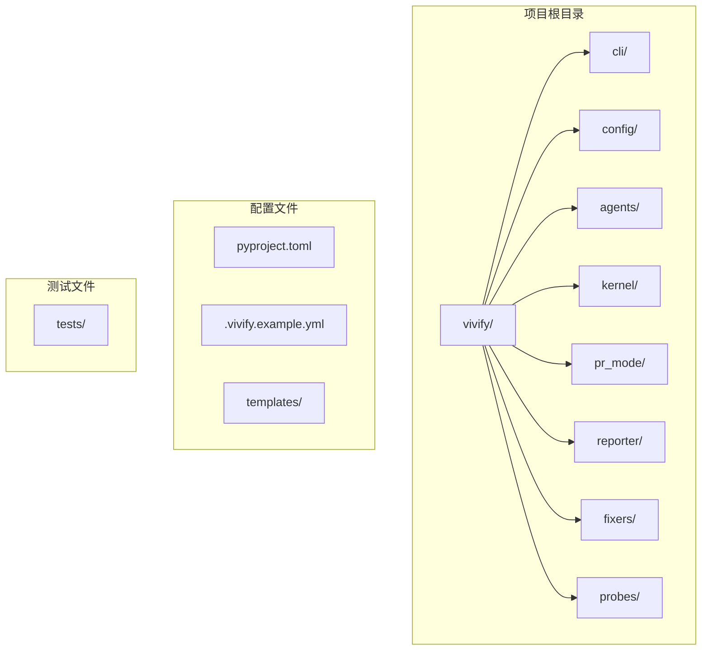
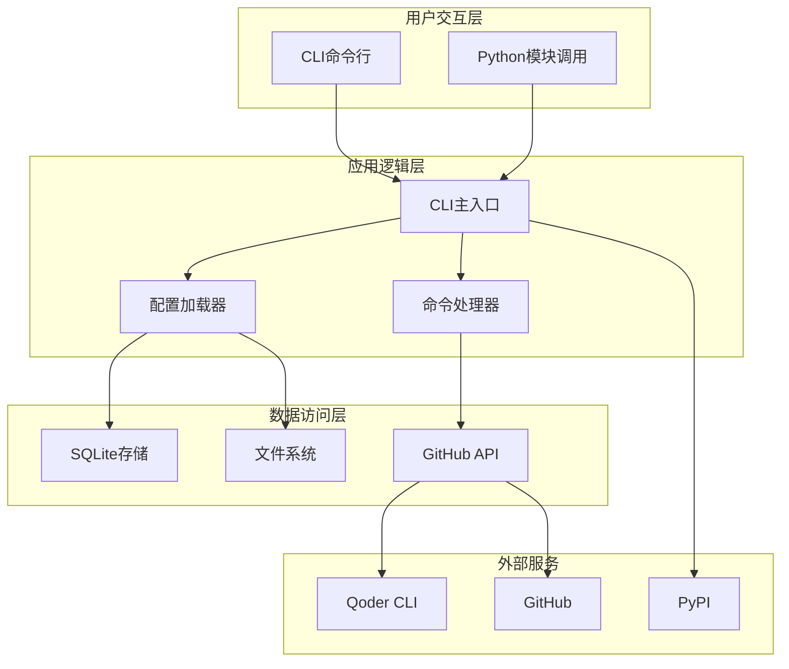
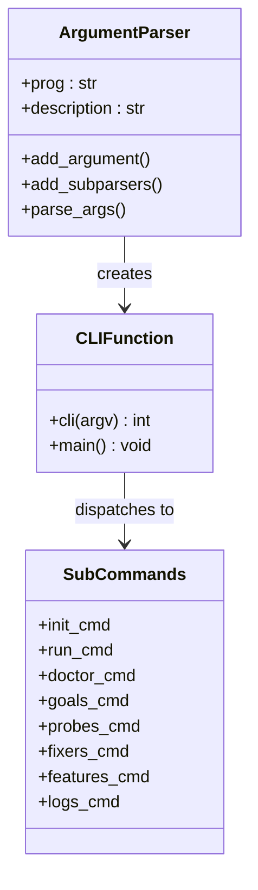
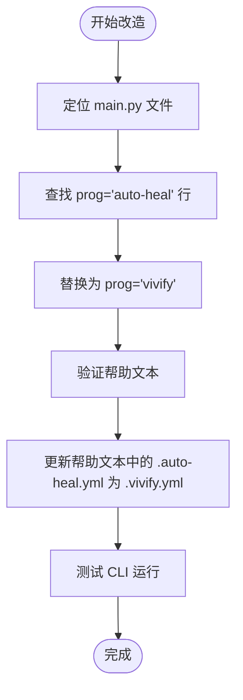
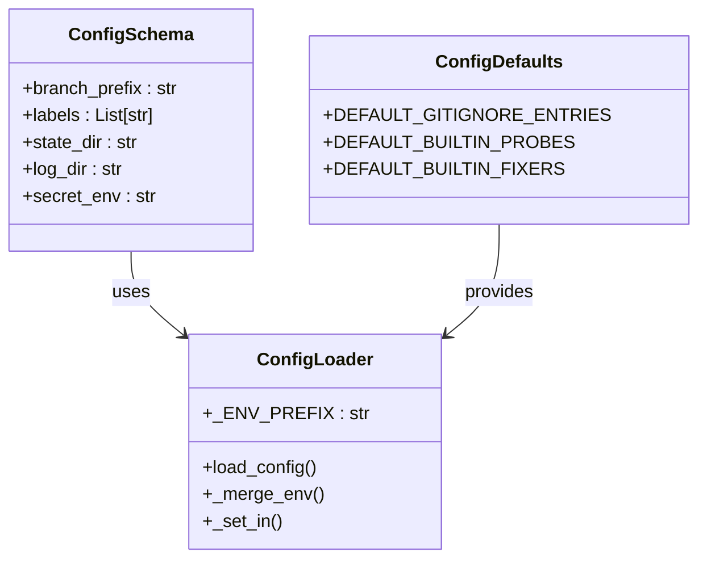
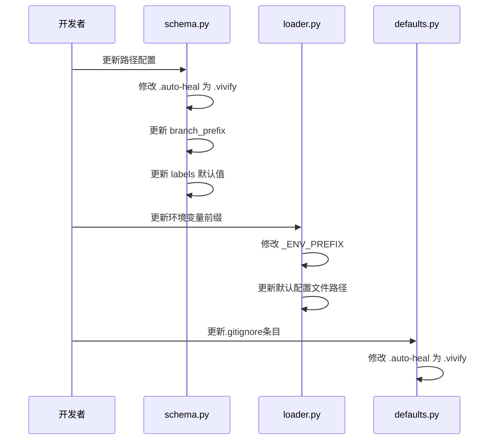
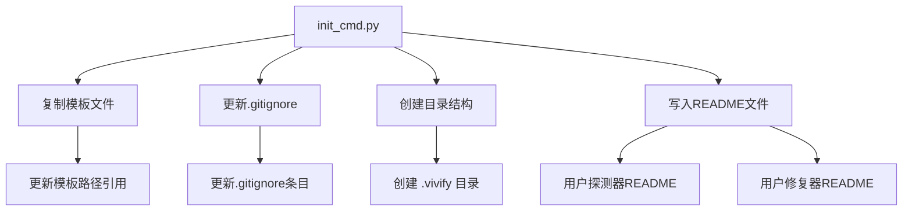

# CLI和导入语句替换

<cite>
**本文档中引用的文件**
- [00_READ_ME_FIRST.txt](file://00_READ_ME_FIRST.txt)
- [QUICK_REFERENCE.md](file://QUICK_REFERENCE.md)
- [REBRANDING_SUMMARY.md](file://REBRANDING_SUMMARY.md)
- [detailed_references.md](file://detailed_references.md)
- [rebranding_analysis.md](file://rebranding_analysis.md)
</cite>

## 目录
1. [简介](#简介)
2. [项目结构概览](#项目结构概览)
3. [核心组件分析](#核心组件分析)
4. [架构概览](#架构概览)
5. [详细组件分析](#详细组件分析)
6. [导入语句替换策略](#导入语句替换策略)
7. [正则表达式和sed命令](#正则表达式和sed命令)
8. [验证和测试方法](#验证和测试方法)
9. [故障排除指南](#故障排除指南)
10. [结论](#结论)

## 简介

本文档详细说明了Vivify项目从auto-heal到vivify的品牌重塑过程，重点关注CLI主入口文件和导入语句的替换策略。该项目是一个自增长型AI代理系统，需要将所有相关的包导入、配置路径、环境变量前缀等从"auto-heal"完全替换为"vivify"。

根据项目调研报告，这次改造涉及约477处grep匹配，需要重命名3个主要位置，并更新150-200行核心代码。改造的核心目标是确保CLI能够正确运行，Python导入语句能够正常解析，以及所有配置路径和环境变量都指向新的vivify命名空间。

## 项目结构概览

Vivify项目采用标准的Python包结构，主要包含以下关键目录：



**图表来源**
- [rebranding_analysis.md:14-30](file://rebranding_analysis.md#L14-L30)

**章节来源**
- [00_READ_ME_FIRST.txt:14-38](file://00_READ_ME_FIRST.txt#L14-L38)
- [REBRANDING_SUMMARY.md:41-86](file://REBRANDING_SUMMARY.md#L41-L86)

## 核心组件分析

### CLI主入口组件

CLI系统的核心入口位于`vivify/cli/main.py`文件中，负责处理命令行参数和子命令分发。该组件需要进行以下关键更改：

1. **程序名变更**：将`prog="auto-heal"`更新为`prog="vivify"`
2. **帮助文本更新**：将所有`.auto-heal.yml`路径描述更新为`.vivify.yml`
3. **文档字符串更新**：将所有"auto-heal"文档字符串更新为"vivify"

### 配置管理系统

配置系统包含三个核心文件：
- `vivify/config/schema.py`：定义配置模式和默认值
- `vivify/config/loader.py`：加载和合并配置
- `vivify/config/defaults.py`：默认配置值

这些文件需要更新所有配置路径、环境变量前缀和默认值。

### 初始化命令组件

初始化命令`vivify/cli/init_cmd.py`负责创建新的项目结构，需要更新模板路径引用和输出消息。

**章节来源**
- [rebranding_analysis.md:116-198](file://rebranding_analysis.md#L116-L198)
- [detailed_references.md:33-48](file://detailed_references.md#L33-L48)

## 架构概览



**图表来源**
- [rebranding_analysis.md:116-176](file://rebranding_analysis.md#L116-L176)

## 详细组件分析

### CLI主入口文件分析

CLI主入口文件`vivify/cli/main.py`包含以下关键组件：



**图表来源**
- [rebranding_analysis.md:122-176](file://rebranding_analysis.md#L122-L176)

#### 程序名变更流程



**图表来源**
- [detailed_references.md:37-41](file://detailed_references.md#L37-L41)

**章节来源**
- [rebranding_analysis.md:118-176](file://rebranding_analysis.md#L118-L176)
- [detailed_references.md:33-42](file://detailed_references.md#L33-L42)

### 配置系统组件分析

配置系统采用分层架构，包含schema定义、默认值管理和环境变量加载：



**图表来源**
- [rebranding_analysis.md:203-352](file://rebranding_analysis.md#L203-L352)

#### 配置路径替换流程



**图表来源**
- [rebranding_analysis.md:203-352](file://rebranding_analysis.md#L203-L352)

**章节来源**
- [rebranding_analysis.md:201-352](file://rebranding_analysis.md#L201-L352)
- [detailed_references.md:51-93](file://detailed_references.md#L51-L93)

### 初始化命令组件分析

初始化命令负责创建项目结构和配置文件：



**图表来源**
- [rebranding_analysis.md:476-566](file://rebranding_analysis.md#L476-L566)

**章节来源**
- [rebranding_analysis.md:474-566](file://rebranding_analysis.md#L474-L566)
- [detailed_references.md:118-137](file://detailed_references.md#L118-L137)

## 导入语句替换策略

### 包导入路径更新

导入语句替换是本次改造的核心任务之一。需要将所有`auto_heal`包引用更新为`vivify`：

#### 直接导入替换

```python
# 旧的导入语句
from auto_heal.cli.main import cli
from auto_heal.config.loader import load_config
from auto_heal.config.schema import AutoHealConfig

# 新的导入语句
from vivify.cli.main import cli
from vivify.config.loader import load_config
from vivify.config.schema import AutoHealConfig
```

#### 模块引用修改

```python
# 旧的模块引用
import auto_heal
import auto_heal.cli.main
import auto_heal.config.loader

# 新的模块引用
import vivify
import vivify.cli.main
import vivify.config.loader
```

### 模块导入变更

`vivify/__main__.py`文件的模块导入也需要相应更新：

```python
# 旧的导入
from auto_heal.cli.main import cli

# 新的导入
from vivify.cli.main import cli
```

**章节来源**
- [QUICK_REFERENCE.md:32-67](file://QUICK_REFERENCE.md#L32-L67)
- [detailed_references.md:43-47](file://detailed_references.md#L43-L47)

## 正则表达式和sed命令

### 批量替换命令

为了高效地完成导入语句替换，可以使用以下sed命令：

#### 基础导入替换

```bash
# 替换 from auto_heal 导入
find . -name "*.py" -type f -exec sed -i '' 's/from auto_heal/from vivify/g' {} +

# 替换 import auto_heal 导入  
find . -name "*.py" -type f -exec sed -i '' 's/import auto_heal/import vivify/g' {} +
```

#### 配置路径替换

```bash
# 替换配置路径 .auto-heal → .vivify
find . -name "*.py" -o -name "*.yml" -o -name "*.md" | xargs sed -i '' 's/\.auto-heal/\.vivify/g'

# 替换标签 "auto-heal" → "vivify"
find . -name "*.py" | xargs sed -i '' "s/\"auto-heal\"/\"vivify\"/g"
find . -name "*.py" | xargs sed -i '' "s/'auto-heal'/'vivify'/g"
```

#### 环境变量前缀替换

```bash
# 替换环境变量前缀 AUTO_HEAL__ → VIVIFY__
find . -name "*.py" | xargs sed -i '' 's/AUTO_HEAL__/VIVIFY__/g'

# 替换具体环境变量
find . -name "*.py" | xargs sed -i '' 's/AUTO_HEAL_AGENT/VIVIFY_AGENT/g'
find . -name "*.py" | xargs sed -i '' 's/AUTO_HEAL_SECRET/VIVIFY_SECRET/g'
```

### 高级正则表达式模式

对于更精确的替换，可以使用以下正则表达式模式：

#### 包导入精确匹配

```bash
# 匹配 from auto_heal.* import 语句
find . -name "*.py" -type f -exec sed -i '' 's/from auto_heal\.\([^ ]*\)/from vivify.\1/g' {} +

# 匹配 import auto_heal.* 语句
find . -name "*.py" -type f -exec sed -i '' 's/import auto_heal\.\([^ ]*\)/import vivify.\1/g' {} +
```

#### 模块路径精确替换

```bash
# 替换包路径中的 auto_heal 为 vivify
find . -name "*.py" -type f -exec sed -i '' 's/\bauto_heal\b/vivify/g' {} +

# 仅替换独立的包名，避免替换类名或变量名
find . -name "*.py" -type f -exec sed -i '' 's/\bauto_heal\b/vivify/g' {} +
```

**章节来源**
- [QUICK_REFERENCE.md:32-67](file://QUICK_REFERENCE.md#L32-L67)

## 验证和测试方法

### 导入验证

为了确保导入语句替换成功，需要进行以下验证：

#### Python导入测试

```bash
# 测试基础导入
python3 -c "from vivify.cli.main import cli; print('✓ CLI导入成功')"

# 测试配置导入
python3 -c "from vivify.config import load_config; print('✓ 配置导入成功')"

# 测试所有核心模块导入
python3 -c "from vivify import cli, config, agents, kernel, pr_mode, reporter, fixers, probes; print('✓ 所有模块导入成功')"
```

#### CLI功能测试

```bash
# 测试CLI帮助文本
python3 -m vivify --help

# 测试初始化命令
python3 -m vivify init --help

# 测试运行命令
python3 -m vivify run --help
```

### 配置加载验证

```bash
# 测试配置加载
python3 -c "from vivify.config.loader import load_config; cfg = load_config(); print('✓ 配置加载成功')"

# 测试环境变量前缀
python3 -c "from vivify.config.loader import _ENV_PREFIX; print(f'环境变量前缀: {_ENV_PREFIX}')"
```

### 文件路径验证

```bash
# 检查是否有遗留的旧路径
grep -r "auto-heal\|auto_heal\|AUTO_HEAL" . --include="*.py" --include="*.yml" --include="*.md" | grep -v ".git" | wc -l

# 验证新路径存在
grep -r "vivify" . --include="*.py" --include="*.yml" | wc -l
```

### 测试套件运行

```bash
# 运行单元测试
pytest tests/unit/ -v

# 运行特定测试文件
pytest tests/unit/test_pr_mode.py -v
pytest tests/unit/test_self_grow_guard.py -v
pytest tests/unit/test_yaml_probe.py -v
```

**章节来源**
- [QUICK_REFERENCE.md:181-210](file://QUICK_REFERENCE.md#L181-L210)
- [00_READ_ME_FIRST.txt:166-187](file://00_READ_ME_FIRST.txt#L166-L187)

## 故障排除指南

### 常见问题和解决方案

#### ImportError: No module named 'vivify'

**原因**：包目录未正确重命名或Python路径未更新

**解决方案**：
1. 确认`vivify/`目录存在且包含`__init__.py`文件
2. 检查Python包安装状态
3. 验证`sys.path`包含项目根目录

#### CLI命令未找到

**原因**：pyproject.toml中的entry point未更新

**解决方案**：
1. 检查`pyproject.toml`中的`scripts`配置
2. 确认`vivify = "vivify.cli.main:cli"`已正确设置
3. 重新安装包或使用`python -m vivify`

#### 环境变量加载失败

**原因**：环境变量前缀未更新

**解决方案**：
1. 检查`vivify/config/loader.py`中的`_ENV_PREFIX`变量
2. 确认环境变量使用`VIVIFY__`前缀
3. 验证配置文件路径

#### 配置文件加载错误

**原因**：配置文件路径未更新

**解决方案**：
1. 检查`vivify/config/loader.py`中的默认配置路径
2. 确认`.vivify.yml`文件存在
3. 验证配置文件权限

### 验证清单

在完成改造后，运行以下验证命令：

```bash
# 1. 检查目录重命名
ls -d vivify/

# 2. 检查导入替换
grep -r "from auto_heal" . --include="*.py" | wc -l  # 应该为 0
grep -r "import auto_heal" . --include="*.py" | wc -l  # 应该为 0

# 3. 检查配置路径
grep -r "\.auto-heal" . --include="*.py" --include="*.yml" --include="*.md" | wc -l  # 应该为 0

# 4. 检查环境变量
grep -r "AUTO_HEAL__" . --include="*.py" | wc -l  # 应该为 0

# 5. 测试导入
python3 -c "from vivify.cli.main import cli; print('✓ 导入成功')"

# 6. 测试CLI
python3 -m vivify --help
```

**章节来源**
- [QUICK_REFERENCE.md:214-224](file://QUICK_REFERENCE.md#L214-L224)
- [REBRANDING_SUMMARY.md:261-275](file://REBRANDING_SUMMARY.md#L261-L275)

## 结论

Vivify项目的品牌重塑改造是一个系统性的工程，涉及包重命名、导入语句替换、配置更新等多个方面。通过采用分阶段的改造策略和严格的验证流程，可以确保改造的完整性和可靠性。

关键成功因素包括：

1. **结构化改造流程**：按照优先级顺序进行改造，先重命名包目录，再更新导入语句，最后替换字符串引用

2. **自动化工具使用**：利用sed命令和IDE的批量替换功能提高效率

3. **严格验证机制**：通过多种验证方法确保改造质量

4. **文档完整性**：保持所有相关文档的一致性更新

这次改造完成后，项目将完全使用新的vivify命名空间，同时保持所有功能的完整性。建议在生产环境中部署前进行全面的回归测试，确保所有功能正常运行。