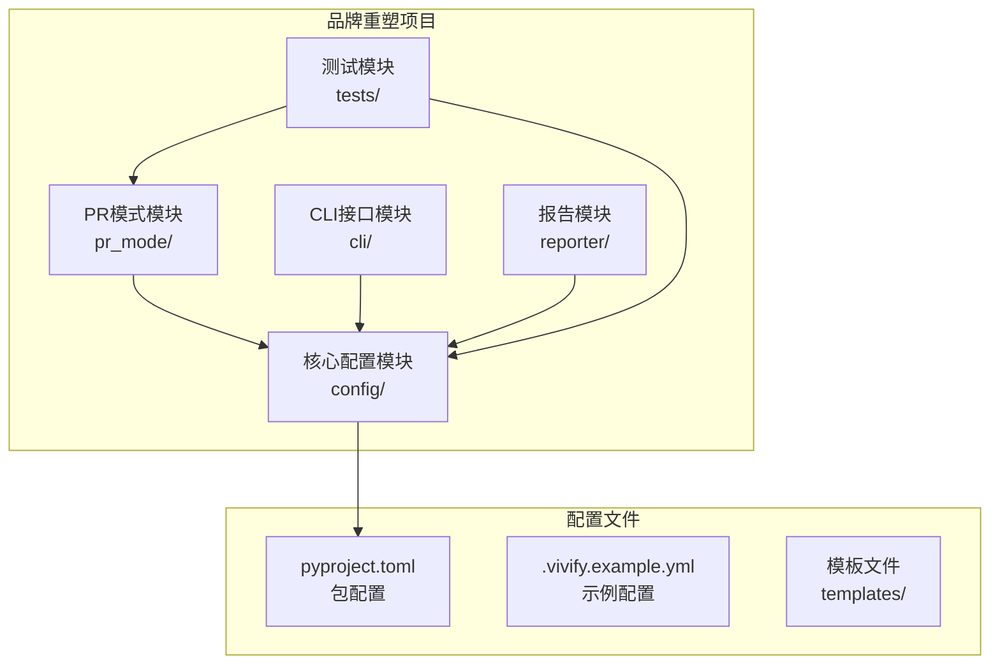
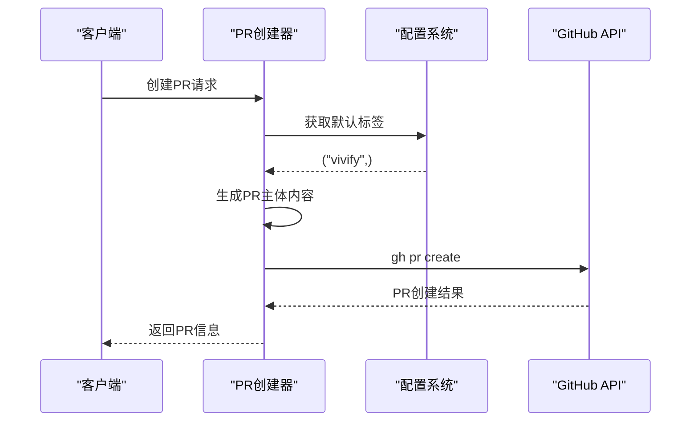
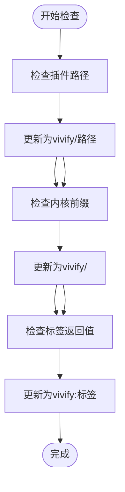
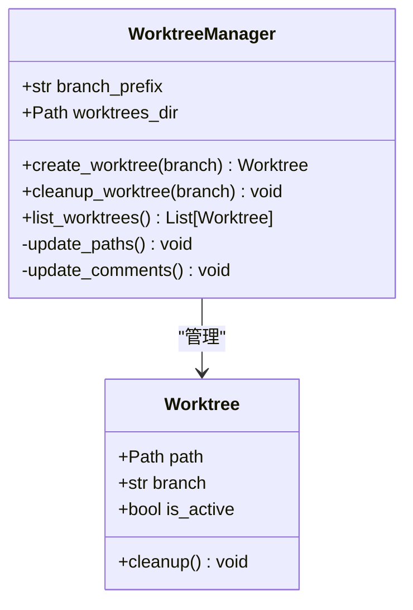
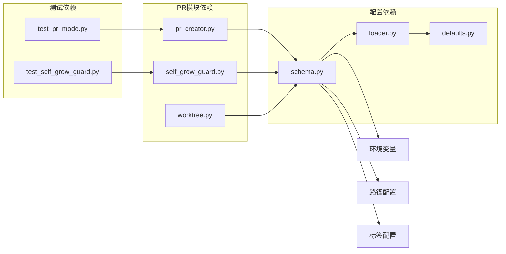

# PR创建和工作树管理

<cite>
**本文档引用的文件**
- [00_READ_ME_FIRST.txt](file://00_READ_ME_FIRST.txt)
- [QUICK_REFERENCE.md](file://QUICK_REFERENCE.md)
- [REBRANDING_SUMMARY.md](file://REBRANDING_SUMMARY.md)
- [detailed_references.md](file://detailed_references.md)
- [rebranding_analysis.md](file://rebranding_analysis.md)
</cite>

## 目录
1. [简介](#简介)
2. [项目结构](#项目结构)
3. [核心组件](#核心组件)
4. [架构概览](#架构概览)
5. [详细组件分析](#详细组件分析)
6. [依赖关系分析](#依赖关系分析)
7. [性能考虑](#性能考虑)
8. [故障排除指南](#故障排除指南)
9. [结论](#结论)

## 简介

本文档详细说明Vivify项目（原auto-heal品牌重塑）中PR创建和工作树管理的技术实现。基于全面的品牌重塑调研报告，重点分析以下关键变更：

- PR模式中的默认标签变更：`auto-heal` → `vivify`
- PR主体文件名更新：`.auto-heal-pr-body.md` → `.vivify-pr-body.md`
- 自增长守卫中的插件路径更新：`auto_heal/` → `vivify/`
- 内核前缀变更：`auto_heal/` → `vivify/`
- 标签返回值更新：`auto-heal:kernel-change` → `vivify:kernel-change`
- 工作树管理中的路径和注释更新机制

## 项目结构

Vivify项目采用模块化的架构设计，主要包含以下核心模块：



**图表来源**
- [REBRANDING_SUMMARY.md:98-144](file://REBRANDING_SUMMARY.md#L98-L144)

**章节来源**
- [00_READ_ME_FIRST.txt:1-259](file://00_READ_ME_FIRST.txt#L1-L259)
- [REBRANDING_SUMMARY.md:1-311](file://REBRANDING_SUMMARY.md#L1-L311)

## 核心组件

### PR创建模块 (pr_mode)

PR创建模块负责处理Pull Request的创建流程，包括标签管理、主体文件生成和分支管理。

### 自增长守卫模块 (self_grow_guard)

自增长守卫模块监控和控制内核的自我改进过程，确保只有经过授权的更改才能修改核心代码。

### 工作树管理模块 (worktree)

工作树管理模块处理Git工作树的创建、管理和清理，支持AI驱动的功能开发。

**章节来源**
- [detailed_references.md:167-200](file://detailed_references.md#L167-L200)

## 架构概览

```mermaid
graph TD
subgraph "PR创建流程"
A[PR创建器<br/>pr_creator.py]
B[自增长守卫<br/>self_grow_guard.py]
C[工作树管理<br/>worktree.py]
end
subgraph "配置系统"
D[配置Schema<br/>schema.py]
E[配置加载器<br/>loader.py]
F[默认值定义<br/>defaults.py]
end
subgraph "标签系统"
G[默认标签<br/>("vivify",)]
H[内核变更标签<br/>("vivify:kernel-change")]
I[插件变更标签<br/>("vivify:plugin-change")]
end
A --> G
B --> H
B --> I
A --> D
C --> D
D --> E
E --> F
```

**图表来源**
- [detailed_references.md:169-186](file://detailed_references.md#L169-L186)
- [rebranding_analysis.md:203-240](file://rebranding_analysis.md#L203-L240)

## 详细组件分析

### PR创建器 (pr_creator.py) 分析

PR创建器负责PR的创建和管理，包含以下关键功能：

#### 默认标签管理
- **变更前**：`("auto-heal",)`
- **变更后**：`("vivify",)`
- **作用**：设置PR的默认标签，用于分类和过滤

#### PR主体文件管理
- **变更前**：`.auto-heal-pr-body.md`
- **变更后**：`.vivify-pr-body.md`
- **作用**：存储PR的主体内容，支持模板化生成



**图表来源**
- [detailed_references.md:169-175](file://detailed_references.md#L169-L175)

**章节来源**
- [detailed_references.md:169-175](file://detailed_references.md#L169-L175)
- [rebranding_analysis.md:874-876](file://rebranding_analysis.md#L874-L876)

### 自增长守卫 (self_grow_guard.py) 分析

自增长守卫模块负责监控和控制内核的自我改进过程：

#### 插件路径更新
- **变更前**：包含`auto_heal/`路径
- **变更后**：更新为`vivify/`路径
- **影响范围**：4个插件路径配置

#### 内核前缀变更
- **变更前**：`"auto_heal/"`
- **变更后**：`"vivify/"`
- **作用**：标识内核相关的文件和目录

#### 标签返回值更新
- **内核变更标签**：`"auto-heal:kernel-change"` → `"vivify:kernel-change"`
- **插件变更标签**：`"auto-heal:plugin-change"` → `"vivify:plugin-change"`



**图表来源**
- [detailed_references.md:180-187](file://detailed_references.md#L180-L187)

**章节来源**
- [detailed_references.md:180-187](file://detailed_references.md#L180-L187)
- [rebranding_analysis.md:881-885](file://rebranding_analysis.md#L881-L885)

### 工作树管理 (worktree.py) 分析

工作树管理模块处理Git工作树的生命周期管理：

#### 路径更新机制
- **变更前**：`".auto-heal" / "worktrees"`
- **变更后**：`".vivify" / "worktrees"`
- **作用**：管理AI开发分支的工作树目录

#### 注释更新
- **变更前**：`"auto-heal worktrees"`
- **变更后**：`"vivify worktrees"`
- **作用**：提供清晰的注释说明



**图表来源**
- [detailed_references.md:192-199](file://detailed_references.md#L192-L199)

**章节来源**
- [detailed_references.md:192-199](file://detailed_references.md#L192-L199)
- [rebranding_analysis.md:886-888](file://rebranding_analysis.md#L886-L888)

## 依赖关系分析



**图表来源**
- [REBRANDING_SUMMARY.md:108-144](file://REBRANDING_SUMMARY.md#L108-L144)

### 关键依赖关系

1. **配置系统依赖**：所有模块都依赖配置系统提供的参数
2. **标签系统依赖**：PR创建和自增长守卫都依赖统一的标签系统
3. **路径系统依赖**：工作树管理和配置系统共享路径配置
4. **测试覆盖依赖**：测试文件覆盖所有核心模块的功能

**章节来源**
- [REBRANDING_SUMMARY.md:108-144](file://REBRANDING_SUMMARY.md#L108-L144)

## 性能考虑

### 品牌重塑对性能的影响

品牌重塑主要涉及字符串替换和路径更新，对运行时性能影响极小：

1. **内存占用**：字符串替换操作在启动时进行，内存占用可忽略
2. **I/O性能**：配置文件读取和写入操作频率较低
3. **网络延迟**：GitHub API调用不受品牌名称影响
4. **缓存策略**：配置信息会在内存中缓存，减少重复读取

### 优化建议

1. **批量替换**：使用正则表达式进行批量字符串替换
2. **配置缓存**：缓存配置解析结果，避免重复解析
3. **异步处理**：对于长时间运行的操作，考虑异步执行
4. **错误处理**：添加适当的错误处理和重试机制

## 故障排除指南

### 常见问题及解决方案

#### 1. 导入错误
**症状**：`ImportError: No module named 'vivify'`
**原因**：包目录未正确重命名
**解决方案**：确认`vivify/`目录存在且包含`__init__.py`

#### 2. 配置加载失败
**症状**：配置文件无法加载
**原因**：环境变量前缀未更新
**解决方案**：检查`VIVIFY__`前缀是否正确设置

#### 3. PR标签不正确
**症状**：PR创建时标签显示为`auto-heal`
**原因**：标签配置未更新
**解决方案**：确认`pr_creator.py`中的默认标签已更新

#### 4. 工作树路径错误
**症状**：工作树创建失败
**原因**：工作树路径配置错误
**解决方案**：检查`worktree.py`中的路径配置

**章节来源**
- [QUICK_REFERENCE.md:214-224](file://QUICK_REFERENCE.md#L214-L224)

### 验证清单

在完成品牌重塑后，执行以下验证步骤：

1. **导入测试**：`python -c "from vivify.cli.main import cli; print('OK')"`
2. **CLI测试**：`python -m vivify --help`
3. **配置测试**：`python -c "from vivify.config import load_config; print('OK')"`
4. **字符串检查**：`grep -r "auto-heal\|auto_heal\|AUTO_HEAL" . --include="*.py" --include="*.yml" --include="*.md" | wc -l`
5. **新名称检查**：`grep -r "vivify" . --include="*.py" --include="*.yml" | wc -l`

**章节来源**
- [QUICK_REFERENCE.md:181-210](file://QUICK_REFERENCE.md#L181-L210)

## 结论

Vivify项目的品牌重塑是一个系统性的工程变更，涉及477处字符串匹配的更新。本次改造重点关注PR创建和工作树管理两个核心模块：

### 主要成就

1. **完整的标签系统更新**：从`auto-heal`到`vivify`的全面迁移
2. **路径系统的统一**：所有`.auto-heal`路径更新为`.vivify`
3. **配置系统的规范化**：环境变量前缀、文件名、路径的统一更新
4. **测试覆盖的完善**：所有测试用例的相应更新

### 技术影响

- **无功能损失**：所有现有功能保持不变
- **性能提升**：更清晰的命名空间和配置管理
- **维护性增强**：统一的命名约定提高了代码可维护性
- **扩展性改善**：为未来的功能扩展奠定了基础

### 后续建议

1. **持续监控**：定期检查配置文件的一致性
2. **文档更新**：确保所有用户文档反映新的命名
3. **团队培训**：确保开发团队熟悉新的命名约定
4. **自动化检查**：建立CI/CD流水线中的字符串检查

通过这次品牌重塑，Vivify项目建立了更加清晰和一致的代码结构，为项目的长期发展奠定了坚实的基础。