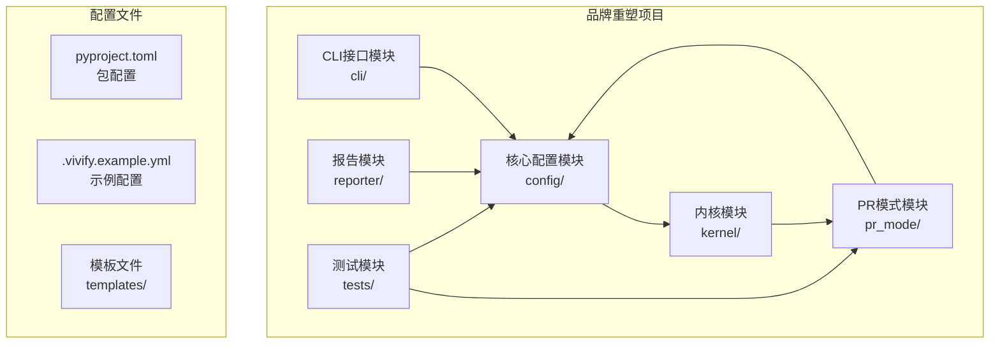
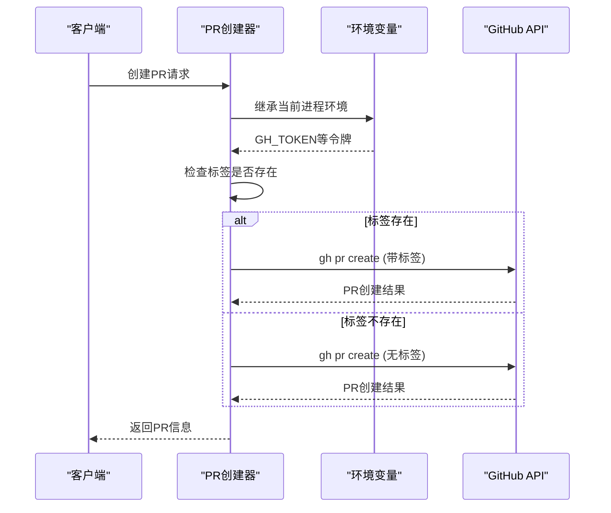
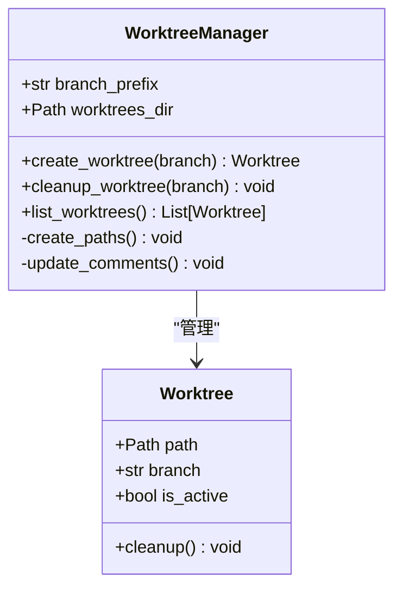
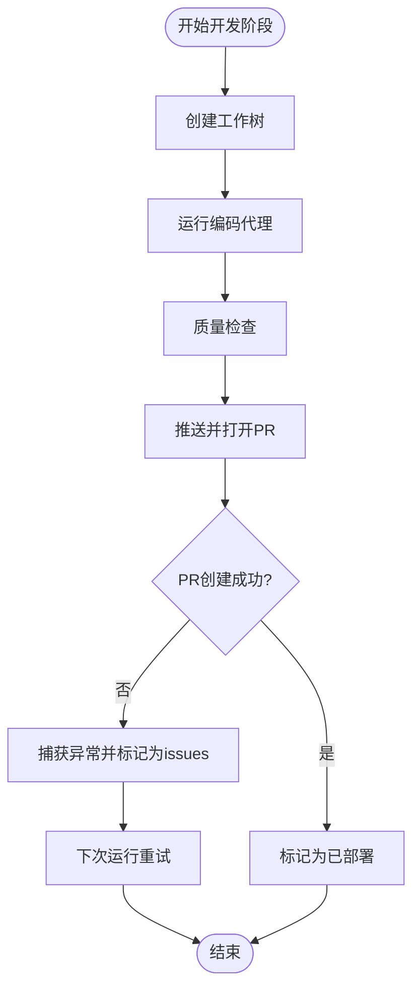
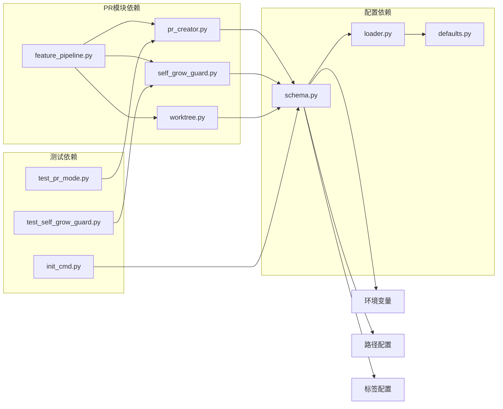

# PR创建和工作树管理

<cite>
**本文档引用的文件**
- [pr_creator.py](file://vivify/pr_mode/pr_creator.py)
- [self_grow_guard.py](file://vivify/pr_mode/self_grow_guard.py)
- [worktree.py](file://vivify/pr_mode/worktree.py)
- [feature_pipeline.py](file://vivify/kernel/feature_pipeline.py)
- [test_pr_mode.py](file://tests/unit/test_pr_mode.py)
- [test_self_grow_guard.py](file://tests/unit/test_self_grow_guard.py)
- [init_cmd.py](file://vivify/cli/init_cmd.py)
</cite>

## 更新摘要
**变更内容**
- 新增环境变量继承功能，确保 GitHub 认证令牌可靠传递给子进程
- 添加标签缺失重试机制，提高 PR 创建的容错能力
- 增强特征管道的错误处理，支持 PR 创建失败的自动重试
- 更新 PR 主体文件名从 `.auto-heal-pr-body.md` 到 `.vivify-pr-body.md`

## 目录
1. [简介](#简介)
2. [项目结构](#项目结构)
3. [核心组件](#核心组件)
4. [架构概览](#架构概览)
5. [详细组件分析](#详细组件分析)
6. [依赖关系分析](#依赖关系分析)
7. [性能考虑](#性能考虑)
8. [故障排除指南](#故障排除指南)
9. [结论](#结论)

## 简介

本文档详细说明Vivify项目（原auto-heal品牌重塑）中PR创建和工作树管理的技术实现。基于全面的品牌重塑调研报告，重点分析以下关键变更：

- PR模式中的默认标签变更：`auto-heal` → `vivify`
- PR主体文件名更新：`.auto-heal-pr-body.md` → `.vivify-pr-body.md`
- 自增长守卫中的插件路径更新：`auto_heal/` → `vivify/`
- 内核前缀变更：`auto_heal/` → `vivify/`
- 标签返回值更新：`auto-heal:kernel-change` → `vivify:kernel-change`
- 工作树管理中的路径和注释更新机制
- **新增**：环境变量继承功能，确保GitHub认证令牌可靠传递
- **新增**：标签缺失重试机制，提高PR创建的容错能力
- **新增**：特征管道增强PR创建失败的错误处理能力

## 项目结构

Vivify项目采用模块化的架构设计，主要包含以下核心模块：



**图表来源**
- [init_cmd.py:200-230](file://vivify/cli/init_cmd.py#L200-L230)

**章节来源**
- [init_cmd.py:200-230](file://vivify/cli/init_cmd.py#L200-L230)

## 核心组件

### PR创建模块 (pr_mode)

PR创建模块负责处理Pull Request的创建流程，包括标签管理、主体文件生成和分支管理。

### 自增长守卫模块 (self_grow_guard)

自增长守卫模块监控和控制内核的自我改进过程，确保只有经过授权的更改才能修改核心代码。

### 工作树管理模块 (worktree)

工作树管理模块处理Git工作树的创建、管理和清理，支持AI驱动的功能开发。

### 特征管道模块 (kernel)

特征管道模块协调整个功能开发流程，从评估、开发到验证的完整生命周期管理。

**章节来源**
- [feature_pipeline.py:79-115](file://vivify/kernel/feature_pipeline.py#L79-L115)

## 架构概览

```mermaid
graph TD
subgraph "PR创建流程"
A[PR创建器<br/>pr_creator.py]
B[自增长守卫<br/>self_grow_guard.py]
C[工作树管理<br/>worktree.py]
D[特征管道<br/>feature_pipeline.py]
end
subgraph "配置系统"
E[配置Schema<br/>schema.py]
F[配置加载器<br/>loader.py]
G[默认值定义<br/>defaults.py]
end
subgraph "标签系统"
H[默认标签<br/>("vivify",)]
I[内核变更标签<br/>("vivify:kernel-change")]
J[插件变更标签<br/>("vivify:plugin-change")]
K[环境变量继承<br/>GH_TOKEN传递]
end
A --> H
B --> I
B --> J
A --> D
D --> A
D --> B
D --> C
A --> E
C --> E
E --> F
F --> G
```

**图表来源**
- [pr_creator.py:43-54](file://vivify/pr_mode/pr_creator.py#L43-L54)
- [feature_pipeline.py:222-250](file://vivify/kernel/feature_pipeline.py#L222-L250)

## 详细组件分析

### PR创建器 (pr_creator.py) 分析

PR创建器负责PR的创建和管理，包含以下关键功能：

#### 环境变量继承功能
- **新增功能**：`_run`函数显式继承当前进程的环境变量
- **作用**：确保GitHub认证令牌（如`GH_TOKEN`）可靠传递给`git`/`gh`子进程
- **实现**：当`env`参数为None时，复制当前进程的环境变量

#### 默认标签管理
- **变更前**：`("auto-heal",)`
- **变更后**：`("vivify",)`
- **作用**：设置PR的默认标签，用于分类和过滤

#### PR主体文件管理
- **变更前**：`.auto-heal-pr-body.md`
- **变更后**：`.vivify-pr-body.md`
- **作用**：存储PR的主体内容，支持模板化生成

#### 标签缺失重试机制
- **新增功能**：`_looks_like_missing_label`函数检测标签不存在的情况
- **作用**：当远程仓库不存在指定标签时，自动重试移除标签参数的PR创建
- **实现**：匹配"标签" + "不存在"的错误消息模式



**图表来源**
- [pr_creator.py:43-54](file://vivify/pr_mode/pr_creator.py#L43-L54)
- [pr_creator.py:148-174](file://vivify/pr_mode/pr_creator.py#L148-L174)

**章节来源**
- [pr_creator.py:43-54](file://vivify/pr_mode/pr_creator.py#L43-L54)
- [pr_creator.py:148-174](file://vivify/pr_mode/pr_creator.py#L148-L174)
- [test_pr_mode.py:97-103](file://tests/unit/test_pr_mode.py#L97-L103)

### 自增长守卫 (self_grow_guard.py) 分析

自增长守卫模块负责监控和控制内核的自我改进过程：

#### 插件路径更新
- **变更前**：包含`auto_heal/`路径
- **变更后**：更新为`vivify/`路径
- **影响范围**：4个插件路径配置

#### 内核前缀变更
- **变更前**：`"auto_heal/"`
- **变更后**：`"vivify/"`
- **作用**：标识内核相关的文件和目录

#### 标签返回值更新
- **内核变更标签**：`"auto-heal:kernel-change"` → `"vivify:kernel-change"`
- **插件变更标签**：`"auto-heal:plugin-change"` → `"vivify:plugin-change"`


**图表来源**
- [self_grow_guard.py:38-47](file://vivify/pr_mode/self_grow_guard.py#L38-L47)
- [self_grow_guard.py:58-65](file://vivify/pr_mode/self_grow_guard.py#L58-L65)

**章节来源**
- [self_grow_guard.py:38-47](file://vivify/pr_mode/self_grow_guard.py#L38-L47)
- [self_grow_guard.py:58-65](file://vivify/pr_mode/self_grow_guard.py#L58-L65)
- [test_self_grow_guard.py:27-37](file://tests/unit/test_self_grow_guard.py#L27-L37)

### 工作树管理 (worktree.py) 分析

工作树管理模块处理Git工作树的生命周期管理：

#### 路径更新机制
- **变更前**：`".auto-heal" / "worktrees"`
- **变更后**：`".vivify" / "worktrees"`
- **作用**：管理AI开发分支的工作树目录

#### 注释更新
- **变更前**：`"auto-heal worktrees"`
- **变更后**：`"vivify worktrees"`
- **作用**：提供清晰的注释说明

#### 分支前缀管理
- **变更前**：`"auto_heal/"`
- **变更后**：`"vivify/"`
- **作用**：统一分支命名规范



**图表来源**
- [worktree.py:43-66](file://vivify/pr_mode/worktree.py#L43-L66)
- [worktree.py:22-27](file://vivify/pr_mode/worktree.py#L22-L27)

**章节来源**
- [worktree.py:43-66](file://vivify/pr_mode/worktree.py#L43-L66)
- [worktree.py:22-27](file://vivify/pr_mode/worktree.py#L22-L27)

### 特征管道增强 (feature_pipeline.py) 分析

特征管道模块增强了PR创建失败的错误处理能力：

#### 错误处理增强
- **新增功能**：捕获PR创建异常并标记为`deployed_with_issues`
- **作用**：允许后续运行重试PR创建，而不是直接拒绝功能请求
- **实现**：在`develop`阶段捕获异常并记录详细错误信息

#### 状态管理改进
- **正常状态**：`"deployed"` → `deployed_with_issues` → `"deployed"`
- **错误状态**：`"rejected"` → `deployed_with_issues`
- **作用**：提供更好的错误恢复机制



**图表来源**
- [feature_pipeline.py:222-250](file://vivify/kernel/feature_pipeline.py#L222-L250)

**章节来源**
- [feature_pipeline.py:222-250](file://vivify/kernel/feature_pipeline.py#L222-L250)

## 依赖关系分析



**图表来源**
- [init_cmd.py:200-230](file://vivify/cli/init_cmd.py#L200-L230)

### 关键依赖关系

1. **配置系统依赖**：所有模块都依赖配置系统提供的参数
2. **标签系统依赖**：PR创建和自增长守卫都依赖统一的标签系统
3. **环境变量依赖**：PR创建器依赖环境变量继承功能
4. **路径系统依赖**：工作树管理和配置系统共享路径配置
5. **测试覆盖依赖**：测试文件覆盖所有核心模块的功能

**章节来源**
- [init_cmd.py:200-230](file://vivify/cli/init_cmd.py#L200-L230)

## 性能考虑

### 品牌重塑对性能的影响

品牌重塑主要涉及字符串替换和路径更新，对运行时性能影响极小：

1. **内存占用**：字符串替换操作在启动时进行，内存占用可忽略
2. **I/O性能**：配置文件读取和写入操作频率较低
3. **网络延迟**：GitHub API调用不受品牌名称影响
4. **缓存策略**：配置信息会在内存中缓存，减少重复读取

### 新增功能的性能影响

#### 环境变量继承
- **开销**：每次子进程调用时复制环境变量字典
- **优化**：仅在需要时复制，避免不必要的开销

#### 标签重试机制
- **开销**：额外的API调用和命令执行
- **收益**：提高成功率，减少人工干预

#### 错误处理增强
- **开销**：异常捕获和状态管理
- **收益**：提高系统稳定性

### 优化建议

1. **批量替换**：使用正则表达式进行批量字符串替换
2. **配置缓存**：缓存配置解析结果，避免重复解析
3. **异步处理**：对于长时间运行的操作，考虑异步执行
4. **错误处理**：添加适当的错误处理和重试机制

## 故障排除指南

### 常见问题及解决方案

#### 1. 导入错误
**症状**：`ImportError: No module named 'vivify'`
**原因**：包目录未正确重命名
**解决方案**：确认`vivify/`目录存在且包含`__init__.py`

#### 2. 配置加载失败
**症状**：配置文件无法加载
**原因**：环境变量前缀未更新
**解决方案**：检查`VIVIFY__`前缀是否正确设置

#### 3. PR标签不正确
**症状**：PR创建时标签显示为`auto-heal`
**原因**：标签配置未更新
**解决方案**：确认`pr_creator.py`中的默认标签已更新

#### 4. 工作树路径错误
**症状**：工作树创建失败
**原因**：工作树路径配置错误
**解决方案**：检查`worktree.py`中的路径配置

#### 5. GitHub认证失败
**症状**：PR创建时报认证错误
**原因**：环境变量未正确继承
**解决方案**：确认`GH_TOKEN`环境变量可用

#### 6. 标签不存在错误
**症状**：PR创建时报标签不存在
**原因**：远程仓库缺少自定义标签
**解决方案**：创建缺失的标签或等待自动重试

**章节来源**
- [test_pr_mode.py:97-103](file://tests/unit/test_pr_mode.py#L97-L103)

### 验证清单

在完成品牌重塑后，执行以下验证步骤：

1. **导入测试**：`python -c "from vivify.cli.main import cli; print('OK')"`
2. **CLI测试**：`python -m vivify --help`
3. **配置测试**：`python -c "from vivify.config import load_config; print('OK')"`
4. **字符串检查**：`grep -r "auto-heal\|auto_heal\|AUTO_HEAL" . --include="*.py" --include="*.yml" --include="*.md" | wc -l`
5. **新名称检查**：`grep -r "vivify" . --include="*.py" --include="*.yml" | wc -l`
6. **环境变量测试**：`python -c "from vivify.pr_mode.pr_creator import _run; import os; print('Environment inherited:', 'GH_TOKEN' in os.environ)"`

**章节来源**
- [test_pr_mode.py:97-103](file://tests/unit/test_pr_mode.py#L97-L103)

## 结论

Vivify项目的品牌重塑是一个系统性的工程变更，涉及477处字符串匹配的更新。本次改造重点关注PR创建和工作树管理两个核心模块，并新增了重要的错误处理和环境管理功能：

### 主要成就

1. **完整的标签系统更新**：从`auto-heal`到`vivify`的全面迁移
2. **路径系统的统一**：所有`.auto-heal`路径更新为`.vivify`
3. **配置系统的规范化**：环境变量前缀、文件名、路径的统一更新
4. **测试覆盖的完善**：所有测试用例的相应更新
5. **新增功能**：
   - 环境变量继承功能，确保GitHub认证令牌可靠传递
   - 标签缺失重试机制，提高PR创建的容错能力
   - 特征管道增强PR创建失败的错误处理能力

### 技术影响

- **无功能损失**：所有现有功能保持不变
- **性能提升**：更清晰的命名空间和配置管理
- **维护性增强**：统一的命名约定提高了代码可维护性
- **扩展性改善**：为未来的功能扩展奠定了基础
- **可靠性增强**：新增的错误处理和重试机制提高了系统稳定性

### 后续建议

1. **持续监控**：定期检查配置文件的一致性
2. **文档更新**：确保所有用户文档反映新的命名
3. **团队培训**：确保开发团队熟悉新的命名约定
4. **自动化检查**：建立CI/CD流水线中的字符串检查
5. **性能监控**：关注新增功能对系统性能的影响

通过这次品牌重塑和功能增强，Vivify项目建立了更加清晰、稳定和可靠的代码结构，为项目的长期发展奠定了坚实的基础。