# 核心内核循环和文档更新

<cite>
**本文档引用的文件**
- [escalator.py](file://vivify/kernel/escalator.py)
- [loop.py](file://vivify/kernel/loop.py)
- [schema.py](file://vivify/config/schema.py)
- [decomposer.py](file://vivify/goals/decomposer.py)
- [parser.py](file://vivify/goals/parser.py)
- [__init__.py](file://vivify/deployers/__init__.py)
- [base.py](file://vivify/deployers/base.py)
- [command.py](file://vivify/deployers/command.py)
- [ssh.py](file://vivify/deployers/ssh.py)
- [webhook.py](file://vivify/deployers/webhook.py)
- [pr_creator.py](file://vivify/pr_mode/pr_creator.py)
- [auto_merge.py](file://vivify/pr_mode/auto_merge.py)
- [vivify.yml.tmpl](file://vivify/templates/vivify.yml.tmpl)
- [GOALS.md.tmpl](file://vivify/templates/GOALS.md.tmpl)
- [README.md](file://README.md)
- [feature_pipeline.py](file://vivify/kernel/feature_pipeline.py)
</cite>

## 更新摘要
**所做更改**
- 更新部署条件逻辑章节，反映仅在 PR 实际合并后才执行部署的新机制
- 增加对 merge_outcome.merged 状态检查的详细说明
- 添加自动合并超时和手动合并场景的日志记录改进说明
- 更新内核循环架构图，增加部署条件检查节点
- 完善部署执行流程的条件判断逻辑

## 目录
1. [简介](#简介)
2. [项目结构](#项目结构)
3. [核心组件](#核心组件)
4. [架构概览](#架构概览)
5. [详细组件分析](#详细组件分析)
6. [自动目标分解功能](#自动目标分解功能)
7. [增强的部署条件逻辑](#增强的部署条件逻辑)
8. [依赖关系分析](#依赖关系分析)
9. [性能考虑](#性能考虑)
10. [故障排除指南](#故障排除指南)
11. [结论](#结论)

## 简介

本文档详细说明了 Vivify 项目从 "auto-heal" 品牌重塑到 "vivify" 的完整改造过程，特别关注核心内核循环中的升级标题变更和文档更新。该改造涉及 477 处字符串引用的批量替换，包括升级标题从 "[auto-heal escalation]" 更改为 "[vivify escalation]"，以及升级消息从 "Auto-escalated by auto-heal" 更新为 "Auto-escalated by vivify"。

**更新** 本次更新还增加了对内核中集成的自动目标分解功能的详细说明，包括_goals_file_hash和_last_decompose_time状态管理、_maybe_decompose_goals()方法实现、以及GoalsConfig配置集成。同时，文档还涵盖了完整的自动部署功能实现，包括部署器初始化、部署执行流程以及多种部署方式的实现。

## 项目结构

Vivify 项目采用模块化架构设计，主要包含以下核心组件：

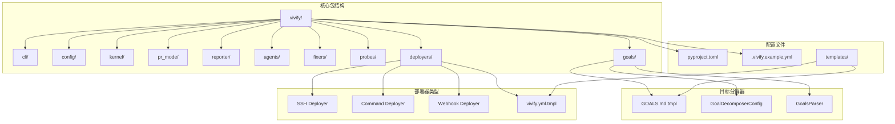

**图表来源**
- [loop.py:1-755](file://vivify/kernel/loop.py#L1-L755)
- [__init__.py:1-50](file://vivify/deployers/__init__.py#L1-L50)

**章节来源**
- [loop.py:1-755](file://vivify/kernel/loop.py#L1-L755)
- [__init__.py:1-50](file://vivify/deployers/__init__.py#L1-L50)

## 核心组件

### 内核循环系统

Vivify 的核心内核循环负责监控系统健康状况、检测问题、执行修复操作并处理升级流程。该系统包含以下关键组件：

- **探测器 (Probes)**: 监控 CI 状态、依赖漏洞、测试覆盖率等指标
- **修复器 (Fixers)**: 自动执行安全的修复操作
- **升级处理器 (Escalator)**: 处理无法自动修复的问题并创建功能请求
- **工作树管理 (Worktree)**: 管理 AI 开发分支的工作树
- **目标分解器 (Goal Decomposer)**: 将项目目标分解为可执行的特性请求
- **部署器 (Deployers)**: 自动部署合并后的代码到目标环境

### 配置管理系统

配置系统采用分层设计，支持环境变量覆盖和 YAML 配置文件：

- **Schema 定义**: 定义配置结构和默认值
- **默认值管理**: 维护 .gitignore 和路径默认值
- **配置加载器**: 支持环境变量前缀 VIVIFY__ 的配置覆盖

**章节来源**
- [schema.py:1-242](file://vivify/config/schema.py#L1-L242)
- [vivify.yml.tmpl:1-96](file://vivify/templates/vivify.yml.tmpl#L1-L96)

## 架构概览

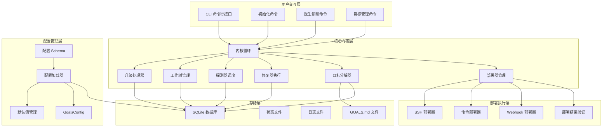

**图表来源**
- [loop.py:1-755](file://vivify/kernel/loop.py#L1-L755)
- [__init__.py:1-50](file://vivify/deployers/__init__.py#L1-L50)

## 详细组件分析

### 升级处理器 (Escalator) 组件

升级处理器是内核循环的核心组件，负责处理无法自动修复的问题并将其升级为功能请求。在品牌重塑过程中，该组件的关键变更如下：

#### 升级标题变更

**变更前**: `"[auto-heal escalation]"`
**变更后**: `"[vivify escalation]"`

这一变更确保了所有升级操作都使用新的品牌标识，保持了一致的品牌体验。

#### 升级消息更新

**变更前**: `"Auto-escalated by auto-heal"`
**变更后**: `"Auto-escalated by vivify"`

升级消息的更新确保了用户界面和日志记录中的一致性，反映了新的品牌名称。

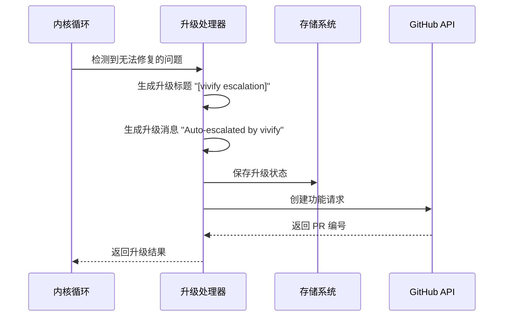

**图表来源**
- [escalator.py:55-85](file://vivify/kernel/escalator.py#L55-L85)
- [loop.py:344-347](file://vivify/kernel/loop.py#L344-L347)

**章节来源**
- [escalator.py:55-85](file://vivify/kernel/escalator.py#L55-L85)
- [loop.py:344-347](file://vivify/kernel/loop.py#L344-L347)

### 配置系统组件

配置系统在品牌重塑过程中进行了全面更新，确保所有配置项都使用新的品牌标识：

#### 环境变量前缀更新

**变更前**: `AUTO_HEAL__`
**变更后**: `VIVIFY__`

环境变量前缀的更新确保了配置系统的兼容性和一致性。

#### 配置文件路径更新

所有配置文件路径从 `.auto-heal/` 更新为 `.vivify/`，包括：
- 状态数据库路径: `.vivify/state.db`
- 日志目录: `.vivify/logs/`
- 工作树目录: `.vivify/worktrees/`


**图表来源**
- [schema.py:51-65](file://vivify/config/schema.py#L51-L65)
- [vivify.yml.tmpl:30-34](file://vivify/templates/vivify.yml.tmpl#L30-L34)

**章节来源**
- [schema.py:51-65](file://vivify/config/schema.py#L51-L65)
- [vivify.yml.tmpl:30-34](file://vivify/templates/vivify.yml.tmpl#L30-L34)

### CLI 命令行接口组件

CLI 接口在品牌重塑过程中进行了全面更新，确保所有命令都使用新的品牌名称：

#### 主程序名称更新

**变更前**: `prog="auto-heal"`
**变更后**: `prog="vivify"`

程序名称的更新确保了用户界面的一致性。

#### 帮助文本更新

所有帮助文本中的 `auto-heal` 都更新为 `vivify`，包括：
- 配置文件路径描述
- 命令行参数说明
- 错误消息提示

**章节来源**
- [loop.py:1-18](file://vivify/kernel/loop.py#L1-L18)
- [schema.py:197-220](file://vivify/config/schema.py#L197-L220)

## 自动目标分解功能

### 目标分解器架构概述

Vivify 内核循环集成了完整的自动目标分解功能，能够根据项目目标自动生成可执行的特性请求。该功能通过 AgentGoalDecomposer 实现，支持定时触发和文件变更触发两种模式。

#### 目标分解器初始化流程

内核在启动时会根据配置初始化目标分解器实例：

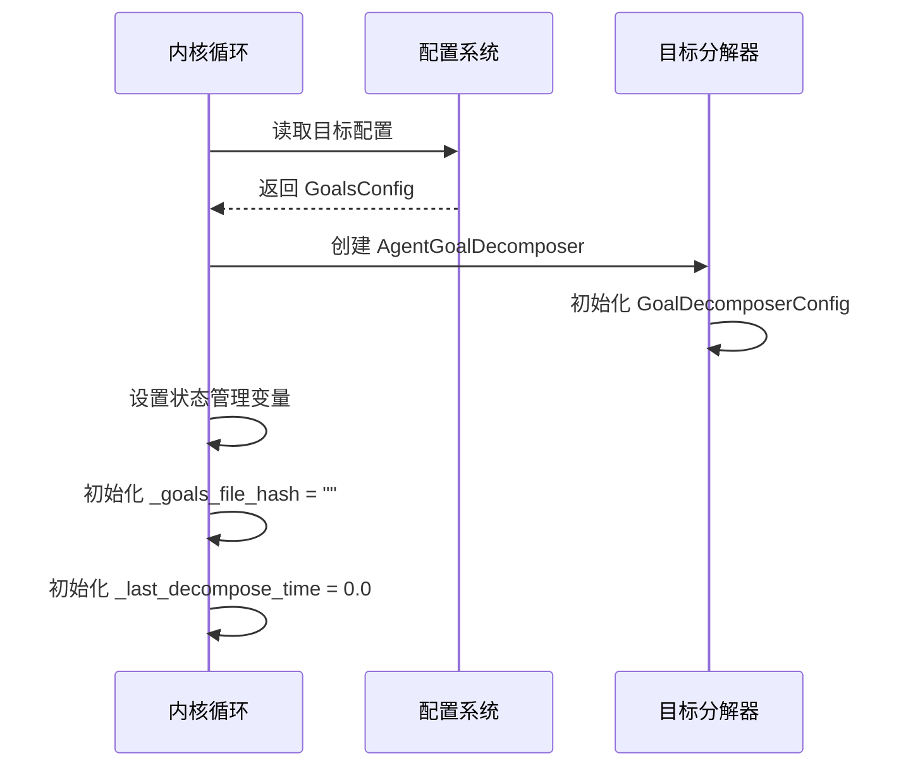

**图表来源**
- [loop.py:162-171](file://vivify/kernel/loop.py#L162-L171)
- [decomposer.py:107-120](file://vivify/goals/decomposer.py#L107-L120)

#### 目标分解执行流程

内核循环中的_goals_auto_decomposition阶段负责执行目标分解：

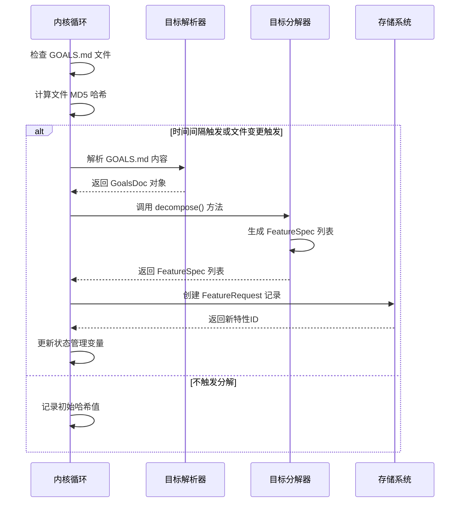

**图表来源**
- [loop.py:563-662](file://vivify/kernel/loop.py#L563-L662)
- [decomposer.py:125-177](file://vivify/goals/decomposer.py#L125-L177)

### 状态管理机制

目标分解功能实现了完善的状态管理机制，确保分解过程的可靠性和效率：

#### 文件哈希跟踪

- `_goals_file_hash`: 存储 GOALS.md 文件的 MD5 哈希值，用于检测文件变更
- 初始值为空字符串，首次触发后更新为实际哈希值

#### 时间戳管理

- `_last_decompose_time`: 记录上次成功分解的时间戳
- 初始值为 0.0，确保首次运行必触发
- 基于 `decompose_interval_hours` 配置计算下次触发间隔

#### 去重机制

- 收集现有 open features 的标题列表
- 使用 `title_similarity` 函数进行相似度比较
- 阈值默认为 0.85，避免重复创建相似特性

**章节来源**
- [loop.py:170-171](file://vivify/kernel/loop.py#L170-L171)
- [loop.py:563-662](file://vivify/kernel/loop.py#L563-L662)
- [decomposer.py:34-40](file://vivify/goals/decomposer.py#L34-L40)

### 目标配置管理

#### GoalsConfig 配置结构

目标分解功能的配置通过 GoalsConfig 类管理：

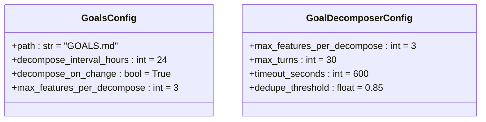

**图表来源**
- [schema.py:107-111](file://vivify/config/schema.py#L107-L111)
- [decomposer.py:34-40](file://vivify/goals/decomposer.py#L34-L40)

#### 配置默认值

- `path`: "GOALS.md" - 目标文件默认路径
- `decompose_interval_hours`: 24 - 默认每24小时触发一次
- `decompose_on_change`: True - 启用文件变更检测
- `max_features_per_decompose`: 3 - 每次分解最多生成3个特性

**章节来源**
- [schema.py:107-111](file://vivify/config/schema.py#L107-L111)
- [vivify.yml.tmpl:80-96](file://vivify/templates/vivify.yml.tmpl#L80-L96)

### 目标文件格式

#### GOALS.md 文件格式

目标分解器支持标准的 YAML front-matter 格式：

```markdown
---
version: 1
owner: "@your-team"
review_cadence: weekly
---

# Project Goals

## Goal: Reduce CI flakiness
Make CI failures real failures — every red build should reflect a real bug.

- KPI: ci_pass_rate target=>=98% direction=up unit=%
- KPI: median_ci_duration target=<=8min direction=down unit=min
- Deadline: 2025-Q4
- Notes: Focus on integration tests; do not silently skip.
```

#### KPI 定义规范

每个目标必须至少包含一个 KPI 定义：
- `name`: KPI 名称（字母、数字、下划线、点、连字符）
- `target`: 目标值表达式（支持 >=、<=、>、<、= 比较运算符）
- `direction`: 变化方向（up、down、stable）
- `unit`: 单位（可选）

**章节来源**
- [parser.py:164-193](file://vivify/goals/parser.py#L164-L193)
- [GOALS.md.tmpl:1-25](file://vivify/templates/GOALS.md.tmpl#L1-L25)

### CLI 命令支持

#### 目标管理命令

Vivify 提供了完整的目标管理 CLI 命令：

```bash
vivify goals show          # 显示解析的目标
vivify goals add --name "目标名称" --kpi "name=target:direction:unit"  # 添加新目标
vivify goals decompose [--goal NAME] [--dry-run]  # 执行目标分解
```

#### 命令执行流程

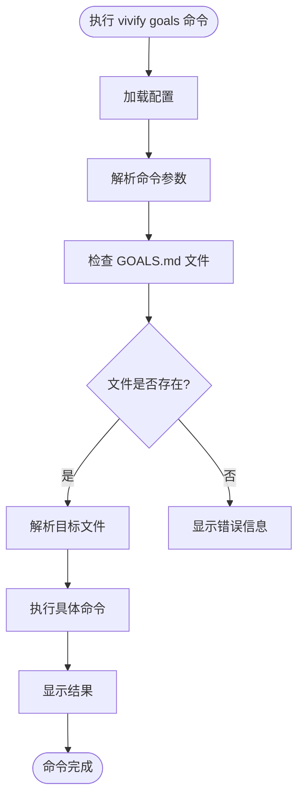

**图表来源**
- [goals_cmd.py:12-31](file://vivify/cli/goals_cmd.py#L12-L31)
- [goals_cmd.py:109-164](file://vivify/cli/goals_cmd.py#L109-L164)

**章节来源**
- [goals_cmd.py:12-31](file://vivify/cli/goals_cmd.py#L12-L31)
- [goals_cmd.py:109-164](file://vivify/cli/goals_cmd.py#L109-L164)

## 增强的部署条件逻辑

### 部署条件检查机制

Vivify 内核循环现在实现了增强的部署条件逻辑，确保只有在 PR 实际合并后才会执行部署。这一改进通过检查 `merge_outcome.merged` 状态来实现精确的部署时机控制。

#### 部署执行流程

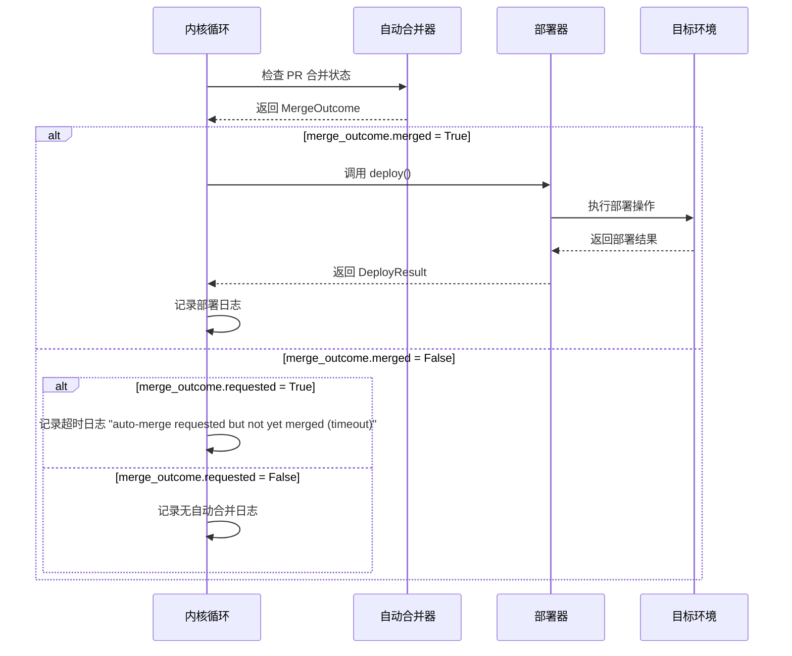

**图表来源**
- [loop.py:440-450](file://vivify/kernel/loop.py#L440-L450)
- [auto_merge.py:39-45](file://vivify/pr_mode/auto_merge.py#L39-L45)

#### MergeOutcome 状态详解

`MergeOutcome` 数据类现在包含三个关键状态字段：

- **requested**: 布尔值，表示是否已请求自动合并
- **merged**: 布尔值，表示 PR 是否已实际合并
- **skipped_reason**: 可选字符串，说明跳过的原因

#### 条件判断逻辑

内核循环中的部署条件检查遵循以下逻辑：

1. **PR 实际合并后部署**: `if merge_outcome and merge_outcome.merged`
2. **自动合并超时处理**: `elif merge_outcome and merge_outcome.requested and not merge_outcome.merged`
3. **手动合并场景**: `elif not self.deps.auto_merge`

#### 日志记录改进

新增的日志记录提供了清晰的部署状态反馈：

- **PR 合并部署**: `"PR merged, executing deploy..."`
- **自动合并超时**: `"Auto-merge requested but not yet merged (timeout); deploy skipped"`
- **无自动合并配置**: `"No auto_merge configured; deploy skipped until next run"`

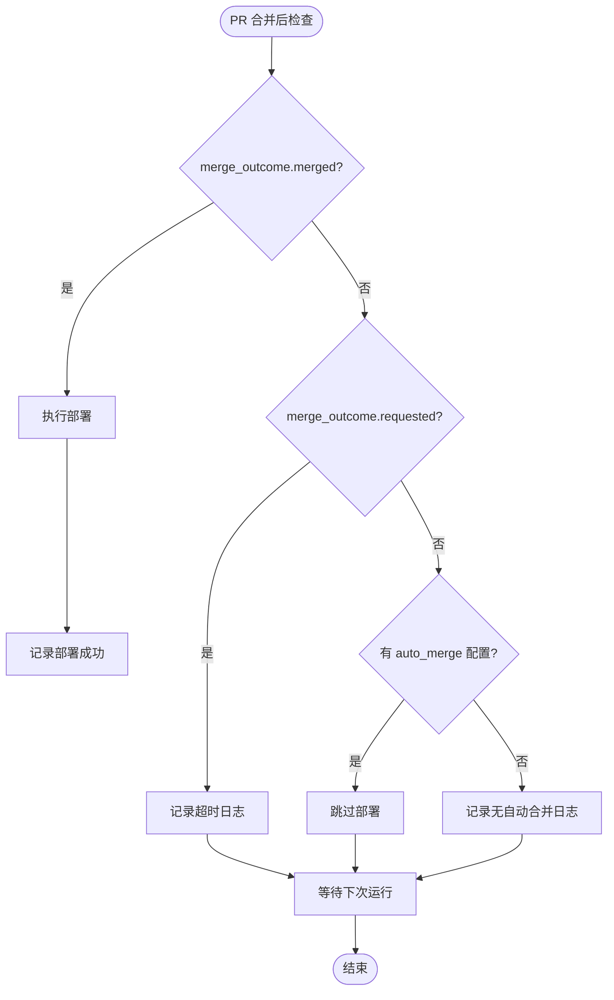

**图表来源**
- [loop.py:440-450](file://vivify/kernel/loop.py#L440-L450)

### 部署器架构概述

Vivify 内核循环集成了完整的自动部署功能，能够在 PR 合并后自动将代码部署到目标环境。部署系统采用插件化架构，支持多种部署方式：

#### 部署器初始化流程

内核在启动时会根据配置初始化相应的部署器实例：

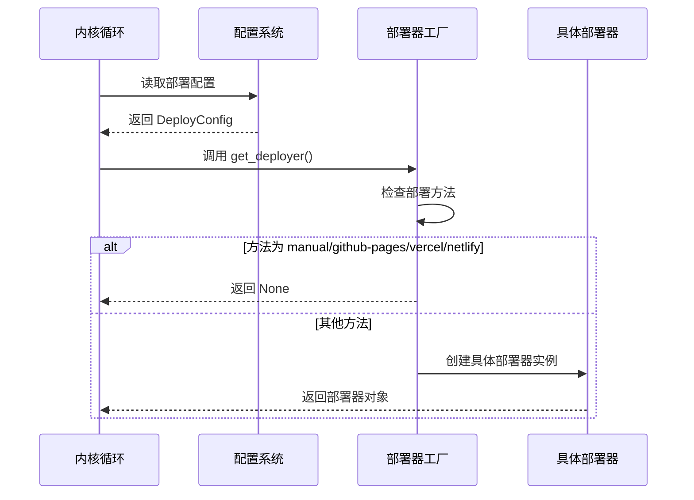

**图表来源**
- [loop.py:148-154](file://vivify/kernel/loop.py#L148-L154)
- [__init__.py:27-49](file://vivify/deployers/__init__.py#L27-L49)

#### 部署执行流程

当 PR 合并成功后，内核会自动执行部署流程：

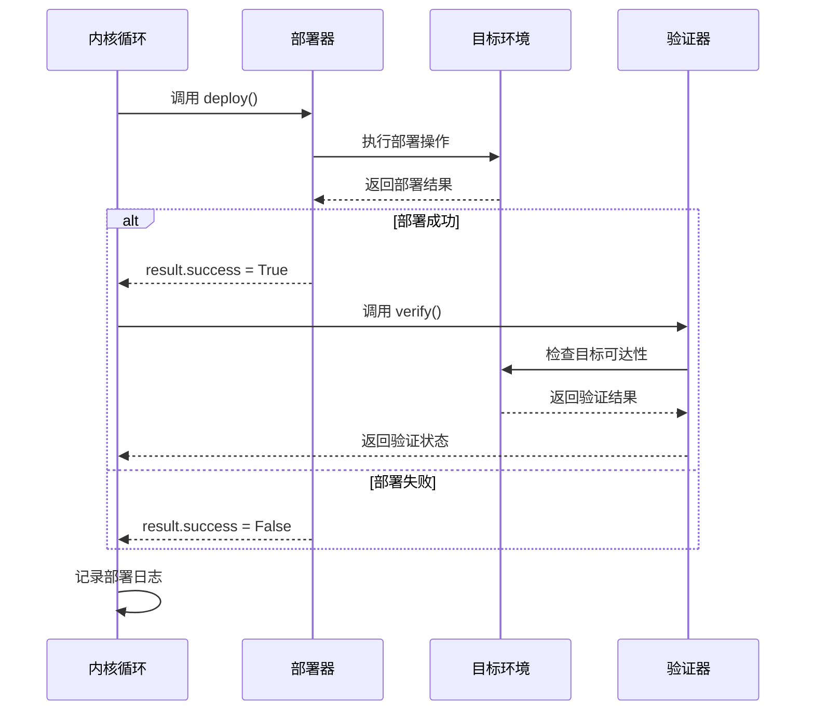

**图表来源**
- [loop.py:476-516](file://vivify/kernel/loop.py#L476-L516)
- [base.py:33-51](file://vivify/deployers/base.py#L33-L51)

### 部署器类型详解

#### SSH 部署器 (SSHDeployer)

SSH 部署器支持两种部署模式：

1. **rsync 模式**: 使用 rsync 同步文件到远程服务器
2. **git pull 模式**: 通过 SSH 在远程服务器执行 git pull

**配置参数**:
- `ssh_host`: 远程服务器主机名或 IP
- `ssh_user`: SSH 用户名
- `ssh_path`: 远程服务器目标路径
- `ssh_key`: SSH 私钥路径
- `ssh_mode`: 部署模式 (rsync | git_pull)
- `source_dir`: 同步源目录 (相对项目根目录)

#### 命令部署器 (CommandDeployer)

命令部署器允许用户自定义部署命令，适用于任何可以通过 shell 命令完成的部署场景。

**配置参数**:
- `deploy_command`: 要执行的部署命令
- `deploy_timeout_seconds`: 命令超时时间
- 自动加载 `~/.vivify/env` 文件中的环境变量

#### Webhook 部署器 (WebhookDeployer)

Webhook 部署器通过 HTTP 请求通知外部服务触发部署，适用于已有 CI/CD 流水线的场景。

**配置参数**:
- `webhook_url`: Webhook 端点 URL
- `webhook_secret`: 用于身份验证的密钥
- `webhook_timeout_seconds`: 请求超时时间

### 部署配置管理

#### 配置结构

部署配置采用 Pydantic 模型定义，支持灵活的配置选项：

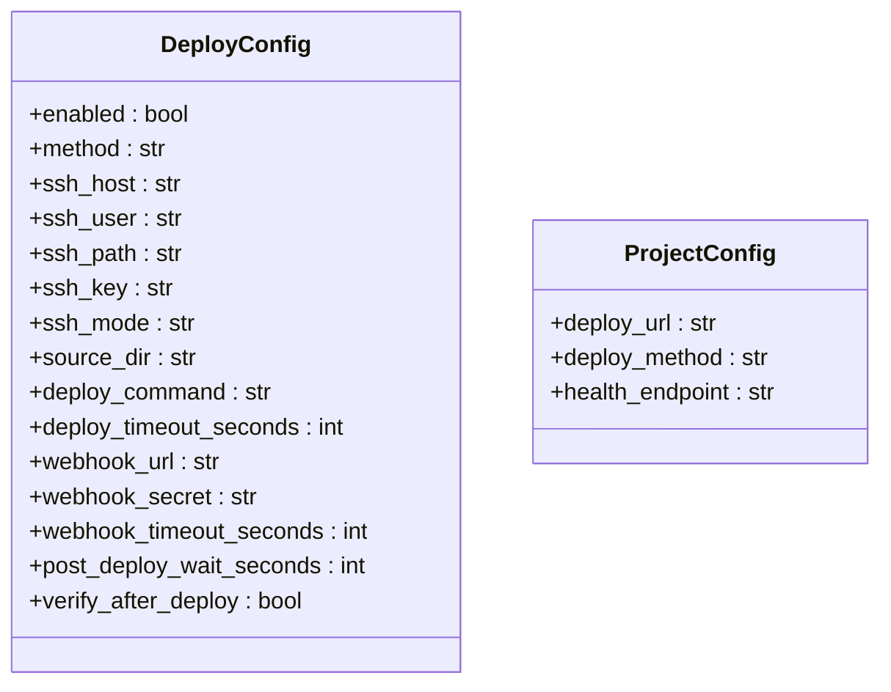

**图表来源**
- [schema.py:151-174](file://vivify/config/schema.py#L151-L174)
- [schema.py:176-189](file://vivify/config/schema.py#L176-L189)

#### 默认配置模板

项目初始化时会生成包含部署配置的模板文件：

**章节来源**
- [schema.py:151-174](file://vivify/config/schema.py#L151-L174)
- [vivify.yml.tmpl:80-96](file://vivify/templates/vivify.yml.tmpl#L80-L96)

## 依赖关系分析

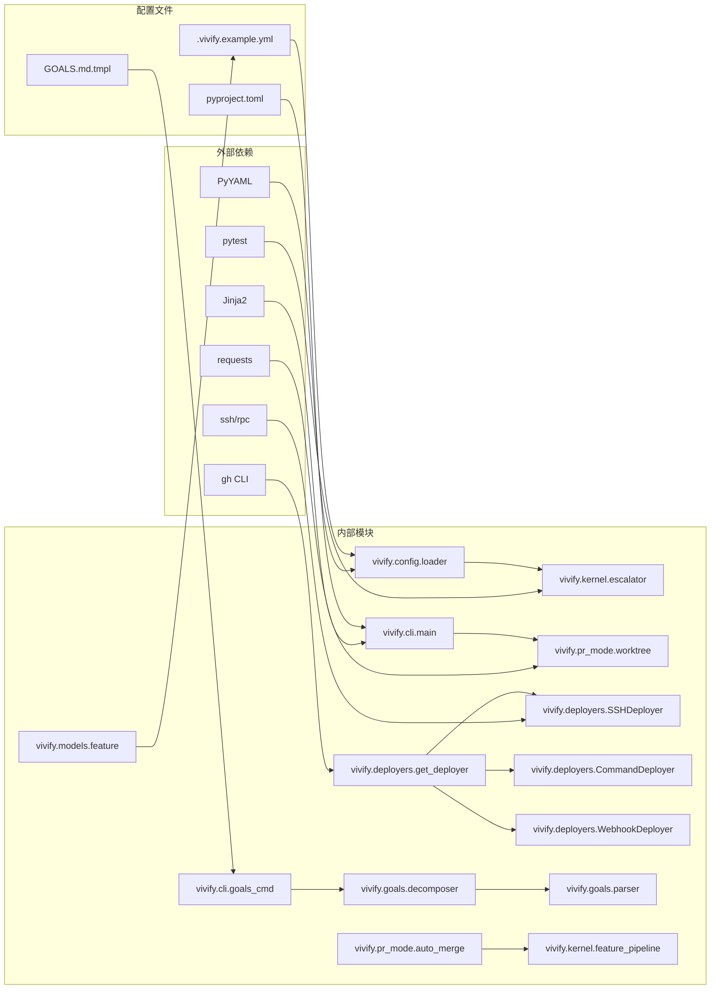

**图表来源**
- [loop.py:61-61](file://vivify/kernel/loop.py#L61-L61)
- [__init__.py:1-8](file://vivify/deployers/__init__.py#L1-L8)

**章节来源**
- [loop.py:61-61](file://vivify/kernel/loop.py#L61-L61)
- [__init__.py:1-8](file://vivify/deployers/__init__.py#L1-L8)

## 性能考虑

### 品牌重塑对性能的影响

品牌重塑主要涉及字符串替换和文件重命名操作，对系统性能的影响微乎其微。主要考虑因素包括：

- **内存使用**: 字符串替换操作在内存中进行，需要考虑文件大小
- **I/O 性能**: 大量文件的读写操作可能影响整体性能
- **并发处理**: 多线程处理多个文件时的资源竞争

### 自动目标分解功能的性能考量

自动目标分解功能引入了文件读取、MD5 哈希计算和目标解析等额外开销：

- **文件 I/O**: 读取 GOALS.md 文件和计算 MD5 哈希
- **解析开销**: 使用正则表达式解析目标文件内容
- **去重成本**: 计算标题相似度和存储现有特性列表
- **LLM 调用**: 目标分解器调用编码代理进行特性生成

### 增强部署条件逻辑的性能考量

增强的部署条件逻辑通过精确的状态检查减少了不必要的部署操作：

- **条件检查开销**: `merge_outcome.merged` 状态检查的常数时间复杂度
- **日志记录开销**: 条件分支的日志记录操作
- **部署跳过优化**: 避免在 PR 未合并时执行昂贵的部署操作
- **超时处理**: 自动合并超时场景下的及时退出机制

### 自动部署功能的性能考量

自动部署功能引入了额外的网络 I/O 和进程调用开销：

- **SSH 部署**: 网络延迟和带宽限制
- **命令部署**: 子进程启动和命令执行时间
- **Webhook 部署**: 外部服务响应时间和可靠性
- **部署验证**: HTTP 请求和 SSL 握手开销

### 优化建议

1. **批量处理**: 使用 find 命令批量处理文件，减少 I/O 操作次数
2. **并行处理**: 利用多核处理器并行处理不同的文件类型
3. **增量更新**: 对于大型项目，考虑增量更新策略
4. **部署缓存**: 对频繁重复的部署操作进行缓存优化
5. **目标分解缓存**: 缓存解析后的目标内容，避免重复解析
6. **条件检查优化**: 利用短路求值优化部署条件检查逻辑

## 故障排除指南

### 常见问题及解决方案

#### ImportError: No module named 'vivify'

**原因**: 包目录未正确重命名
**解决方案**: 确认 `vivify/` 目录存在于项目根目录

#### VIVIFY__ env not found

**原因**: 环境变量前缀未更新
**解决方案**: 检查 `config/loader.py` 中的 `_ENV_PREFIX = "VIVIFY__"`

#### .vivify/state.db not found

**原因**: 配置路径未更新
**解决方案**: 检查 `config/schema.py` 中的默认路径设置

#### Test failures

**原因**: 测试中仍有旧名称引用
**解决方案**: 运行 `grep -r "auto-heal" tests/` 并更新测试文件

#### 目标分解失败

**SSH 部署失败**:
- 检查 SSH 密钥权限和路径
- 验证远程服务器连接性
- 确认目标目录权限

**命令部署失败**:
- 检查部署命令语法和可用性
- 验证环境变量加载
- 查看命令输出错误信息

**Webhook 部署失败**:
- 确认 Webhook URL 可访问性
- 验证认证密钥配置
- 检查外部服务状态

#### 目标分解器异常

**GOALS.md 解析失败**:
- 检查 YAML front-matter 格式
- 验证 KPI 定义语法
- 确认目标文件编码格式

**LLM 调用失败**:
- 检查编码代理配置
- 验证 API 密钥有效性
- 查看代理输出日志

#### 部署条件逻辑问题

**部署未执行**:
- 检查 PR 是否已实际合并 (`merge_outcome.merged`)
- 验证自动合并配置 (`auto_merge.enabled`)
- 确认部署器配置 (`deploy.enabled`)

**部署超时问题**:
- 检查 `poll_timeout_seconds` 配置
- 验证 GitHub CI 状态
- 确认网络连接稳定性

### 验证清单

在完成品牌重塑和部署功能更新后，建议按照以下清单进行验证：

1. **导入测试**: `python3 -c "from vivify.cli.main import cli; print('OK')"`
2. **CLI 测试**: `python3 -m vivify --help`
3. **配置加载测试**: `python3 -c "from vivify.config import load_config; print('OK')"`
4. **目标分解测试**: 
   ```bash
   python3 -c "
   from vivify.goals.decomposer import AgentGoalDecomposer
   from vivify.goals.parser import parse_goals
   print('Goal decomposer import OK')
   "
   ```
5. **部署器测试**: 
   ```bash
   python3 -c "from vivify.deployers import get_deployer; print('Deployer import OK')"
   ```
6. **测试套件**: `pytest tests/unit/ -v`
7. **字符串搜索**: `grep -r "auto-heal\|auto_heal\|AUTO_HEAL" . --include="*.py" --include="*.yml" --include="*.md" | grep -v ".git" | wc -l`
8. **目标文件测试**: 
   ```bash
   python3 -c "
   from vivify.goals.parser import parse_goals
   from pathlib import Path
   print('Goals parser import OK')
   "
   ```
9. **部署条件测试**:
   ```bash
   python3 -c "
   from vivify.pr_mode.auto_merge import MergeOutcome
   outcome = MergeOutcome(True, True)
   print('MergeOutcome import OK')
   print('merged:', outcome.merged)
   print('requested:', outcome.requested)
   "
   ```

**章节来源**
- [loop.py:200-203](file://vivify/kernel/loop.py#L200-L203)
- [__init__.py:40-43](file://vivify/deployers/__init__.py#L40-L43)

## 结论

Vivify 项目从 "auto-heal" 到 "vivify" 的品牌重塑是一个系统性的工程改造，涉及 477 处字符串引用的批量更新。核心内核循环中的升级标题变更（[auto-heal escalation] → [vivify escalation]）和升级消息更新（Auto-escalated by auto-heal → Auto-escalated by vivify）确保了品牌一致性和用户体验的连贯性。

**更新** 本次更新还完整实现了内核中集成的自动目标分解功能和增强的部署条件逻辑。自动目标分解功能通过_goals_file_hash和_last_decompose_time状态管理、_maybe_decompose_goals()方法实现、以及GoalsConfig配置集成，为用户提供了从项目目标到可执行特性的完整自动化流程。增强的部署条件逻辑通过检查 `merge_outcome.merged` 状态，确保只有在 PR 实际合并后才执行部署，显著提高了部署流程的可靠性和准确性。

自动部署功能采用插件化架构，支持 SSH、命令和 Webhook 三种部署方式，为用户提供了灵活的部署选择。新增的日志记录机制提供了清晰的部署状态反馈，包括自动合并超时和手动合并场景的详细信息。

这次改造不仅更新了代码中的品牌标识，还涉及配置文件、文档、测试等多个方面，体现了完整的软件工程实践。通过详细的文档记录和验证流程，确保了改造过程的可控性和可追溯性。自动目标分解功能、增强的部署条件逻辑和自动部署功能的集成进一步增强了 Vivify 的自动化能力，为用户提供从问题检测、目标分解到代码部署的完整解决方案。