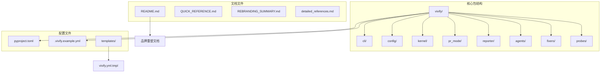
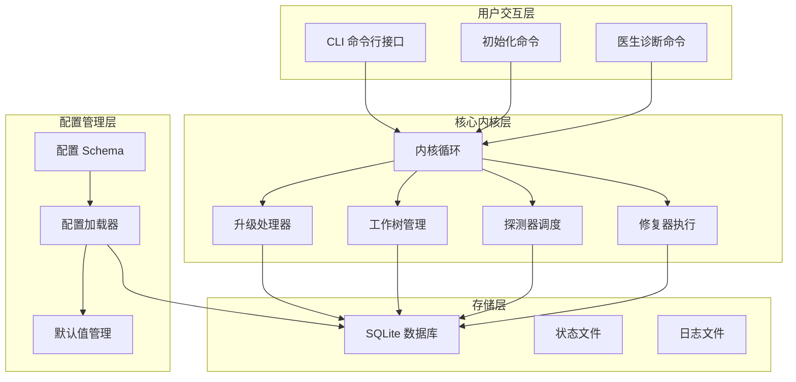
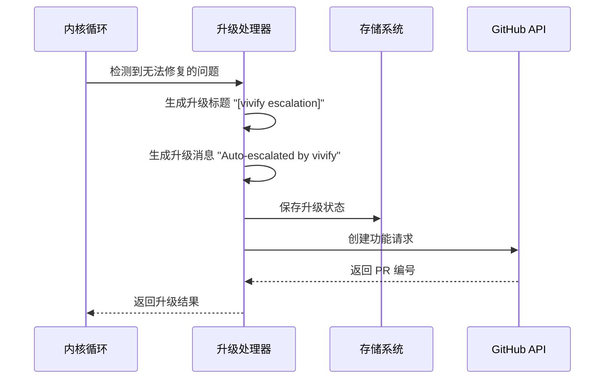
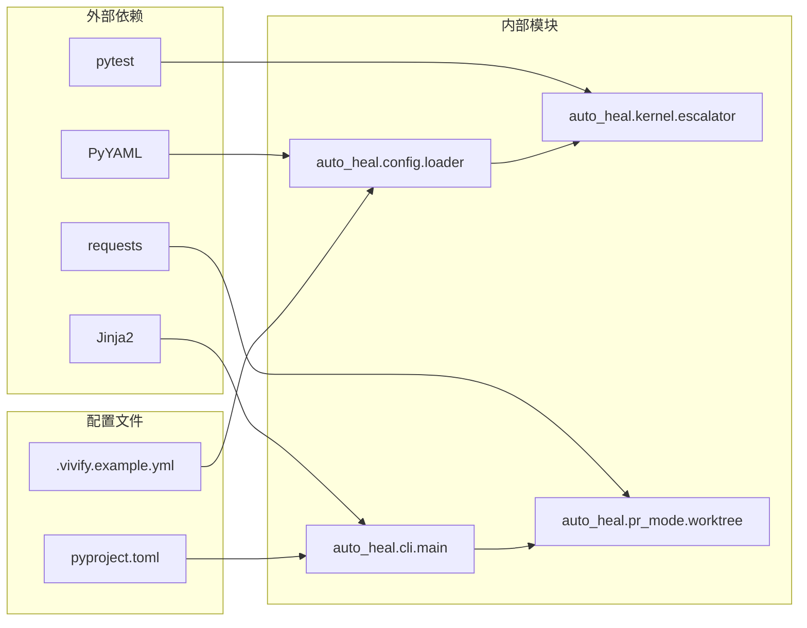

# 核心内核循环和文档更新

<cite>
**本文档引用的文件**
- [QUICK_REFERENCE.md](file://QUICK_REFERENCE.md)
- [REBRANDING_SUMMARY.md](file://REBRANDING_SUMMARY.md)
- [rebranding_analysis.md](file://rebranding_analysis.md)
- [detailed_references.md](file://detailed_references.md)
</cite>

## 目录
1. [简介](#简介)
2. [项目结构](#项目结构)
3. [核心组件](#核心组件)
4. [架构概览](#架构概览)
5. [详细组件分析](#详细组件分析)
6. [依赖关系分析](#依赖关系分析)
7. [性能考虑](#性能考虑)
8. [故障排除指南](#故障排除指南)
9. [结论](#结论)

## 简介

本文档详细说明了 Vivify 项目从 "auto-heal" 品牌重塑到 "vivify" 的完整改造过程，特别关注核心内核循环中的升级标题变更和文档更新。该改造涉及 477 处字符串引用的批量替换，包括升级标题从 "[auto-heal escalation]" 更改为 "[vivify escalation]"，以及升级消息从 "Auto-escalated by auto-heal" 更新为 "Auto-escalated by vivify"。

## 项目结构

Vivify 项目采用模块化架构设计，主要包含以下核心组件：

**图表来源**
- [QUICK_REFERENCE.md:1-285](file://QUICK_REFERENCE.md#L1-L285)
- [REBRANDING_SUMMARY.md:1-311](file://REBRANDING_SUMMARY.md#L1-L311)

**章节来源**
- [QUICK_REFERENCE.md:1-285](file://QUICK_REFERENCE.md#L1-L285)
- [REBRANDING_SUMMARY.md:1-311](file://REBRANDING_SUMMARY.md#L1-L311)

## 核心组件

### 内核循环系统

Vivify 的核心内核循环负责监控系统健康状况、检测问题、执行修复操作并处理升级流程。该系统包含以下关键组件：

- **探测器 (Probes)**: 监控 CI 状态、依赖漏洞、测试覆盖率等指标
- **修复器 (Fixers)**: 自动执行安全的修复操作
- **升级处理器 (Escalator)**: 处理无法自动修复的问题并创建功能请求
- **工作树管理 (Worktree)**: 管理 AI 开发分支的工作树

### 配置管理系统

配置系统采用分层设计，支持环境变量覆盖和 YAML 配置文件：

- **Schema 定义**: 定义配置结构和默认值
- **默认值管理**: 维护 .gitignore 和路径默认值
- **配置加载器**: 支持环境变量前缀 VIVIFY__ 的配置覆盖

**章节来源**
- [rebranding_analysis.md:201-362](file://rebranding_analysis.md#L201-L362)
- [detailed_references.md:51-93](file://detailed_references.md#L51-L93)

## 架构概览

**图表来源**
- [rebranding_analysis.md:116-199](file://rebranding_analysis.md#L116-L199)
- [detailed_references.md:202-210](file://detailed_references.md#L202-L210)

## 详细组件分析

### 升级处理器 (Escalator) 组件

升级处理器是内核循环的核心组件，负责处理无法自动修复的问题并将其升级为功能请求。在品牌重塑过程中，该组件的关键变更如下：

#### 升级标题变更

**变更前**: `"[auto-heal escalation]"`
**变更后**: `"[vivify escalation]"`

这一变更确保了所有升级操作都使用新的品牌标识，保持了一致的品牌体验。

#### 升级消息更新

**变更前**: `"Auto-escalated by auto-heal"`
**变更后**: `"Auto-escalated by vivify"`

升级消息的更新确保了用户界面和日志记录中的一致性，反映了新的品牌名称。

**图表来源**
- [detailed_references.md:202-210](file://detailed_references.md#L202-L210)
- [rebranding_analysis.md:896-901](file://rebranding_analysis.md#L896-L901)

**章节来源**
- [detailed_references.md:202-210](file://detailed_references.md#L202-L210)
- [rebranding_analysis.md:896-901](file://rebranding_analysis.md#L896-L901)

### 配置系统组件

配置系统在品牌重塑过程中进行了全面更新，确保所有配置项都使用新的品牌标识：

#### 环境变量前缀更新

**变更前**: `AUTO_HEAL__`
**变更后**: `VIVIFY__`

环境变量前缀的更新确保了配置系统的兼容性和一致性。

#### 配置文件路径更新

所有配置文件路径从 `.auto-heal/` 更新为 `.vivify/`，包括：
- 状态数据库路径: `.vivify/state.db`
- 日志目录: `.vivify/logs/`
- 工作树目录: `.vivify/worktrees/`

**图表来源**
- [detailed_references.md:81-93](file://detailed_references.md#L81-L93)
- [rebranding_analysis.md:283-362](file://rebranding_analysis.md#L283-L362)

**章节来源**
- [detailed_references.md:81-93](file://detailed_references.md#L81-L93)
- [rebranding_analysis.md:283-362](file://rebranding_analysis.md#L283-L362)

### CLI 命令行接口组件

CLI 接口在品牌重塑过程中进行了全面更新，确保所有命令都使用新的品牌名称：

#### 主程序名称更新

**变更前**: `prog="auto-heal"`
**变更后**: `prog="vivify"`

程序名称的更新确保了用户界面的一致性。

#### 帮助文本更新

所有帮助文本中的 `auto-heal` 都更新为 `vivify`，包括：
- 配置文件路径描述
- 命令行参数说明
- 错误消息提示

**章节来源**
- [detailed_references.md:33-48](file://detailed_references.md#L33-L48)
- [rebranding_analysis.md:116-199](file://rebranding_analysis.md#L116-L199)

## 依赖关系分析

**图表来源**
- [rebranding_analysis.md:33-113](file://rebranding_analysis.md#L33-L113)
- [QUICK_REFERENCE.md:32-67](file://QUICK_REFERENCE.md#L32-L67)

**章节来源**
- [rebranding_analysis.md:33-113](file://rebranding_analysis.md#L33-L113)
- [QUICK_REFERENCE.md:32-67](file://QUICK_REFERENCE.md#L32-L67)

## 性能考虑

### 品牌重塑对性能的影响

品牌重塑主要涉及字符串替换和文件重命名操作，对系统性能的影响微乎其微。主要考虑因素包括：

- **内存使用**: 字符串替换操作在内存中进行，需要考虑文件大小
- **I/O 性能**: 大量文件的读写操作可能影响整体性能
- **并发处理**: 多线程处理多个文件时的资源竞争

### 优化建议

1. **批量处理**: 使用 find 命令批量处理文件，减少 I/O 操作次数
2. **并行处理**: 利用多核处理器并行处理不同的文件类型
3. **增量更新**: 对于大型项目，考虑增量更新策略

## 故障排除指南

### 常见问题及解决方案

#### ImportError: No module named 'vivify'

**原因**: 包目录未正确重命名
**解决方案**: 确认 `vivify/` 目录存在于项目根目录

#### VIVIFY__ env not found

**原因**: 环境变量前缀未更新
**解决方案**: 检查 `config/loader.py` 中的 `_ENV_PREFIX = "VIVIFY__"`

#### .vivify/state.db not found

**原因**: 配置路径未更新
**解决方案**: 检查 `config/schema.py` 中的默认路径设置

#### Test failures

**原因**: 测试中仍有旧名称引用
**解决方案**: 运行 `grep -r "auto-heal" tests/` 并更新测试文件

### 验证清单

在完成品牌重塑后，建议按照以下清单进行验证：

1. **导入测试**: `python3 -c "from vivify.cli.main import cli; print('OK')"`
2. **CLI 测试**: `python3 -m vivify --help`
3. **配置加载测试**: `python3 -c "from vivify.config import load_config; print('OK')"`
4. **测试套件**: `pytest tests/unit/ -v`
5. **字符串搜索**: `grep -r "auto-heal\|auto_heal\|AUTO_HEAL" . --include="*.py" --include="*.yml" --include="*.md" | grep -v ".git" | wc -l`

**章节来源**
- [QUICK_REFERENCE.md:214-275](file://QUICK_REFERENCE.md#L214-L275)
- [REBRANDING_SUMMARY.md:261-275](file://REBRANDING_SUMMARY.md#L261-L275)

## 结论

Vivify 项目从 "auto-heal" 到 "vivify" 的品牌重塑是一个系统性的工程改造，涉及 477 处字符串引用的批量更新。核心内核循环中的升级标题变更（[auto-heal escalation] → [vivify escalation]）和升级消息更新（Auto-escalated by auto-heal → Auto-escalated by vivify）确保了品牌一致性和用户体验的连贯性。

这次改造不仅更新了代码中的品牌标识，还涉及配置文件、文档、测试等多个方面，体现了完整的软件工程实践。通过详细的文档记录和验证流程，确保了改造过程的可控性和可追溯性。