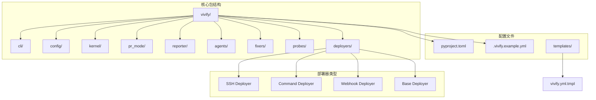
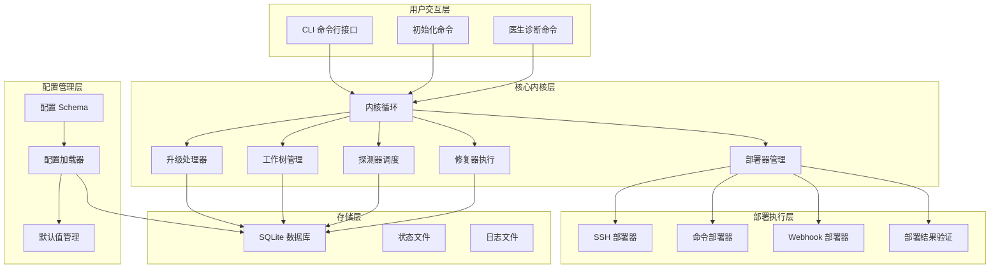
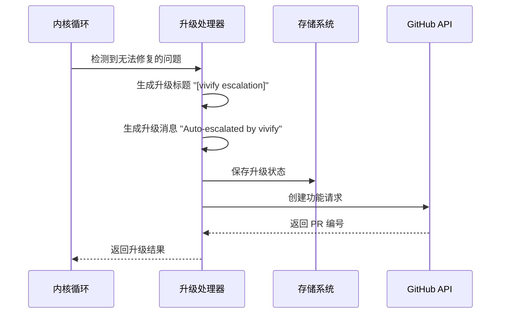
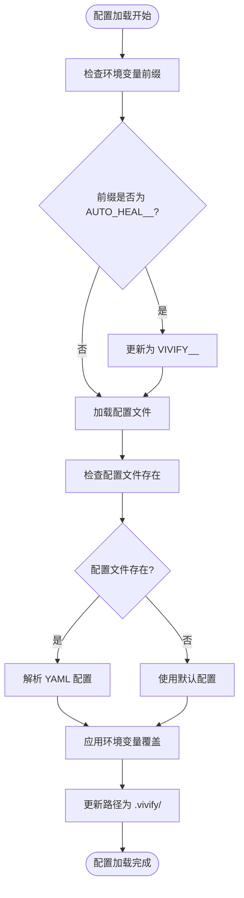
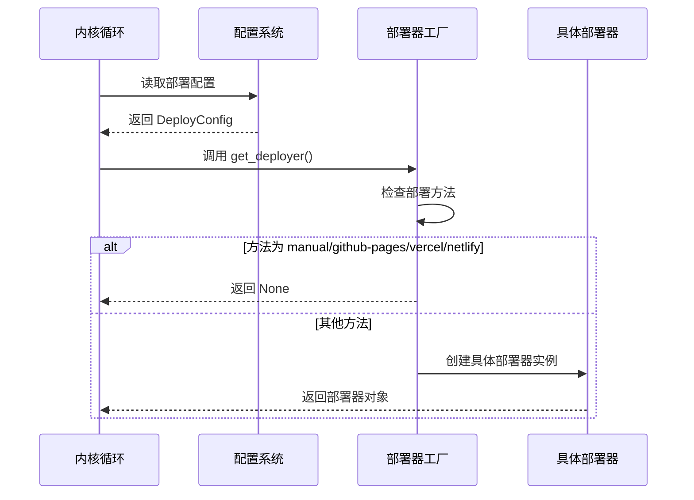
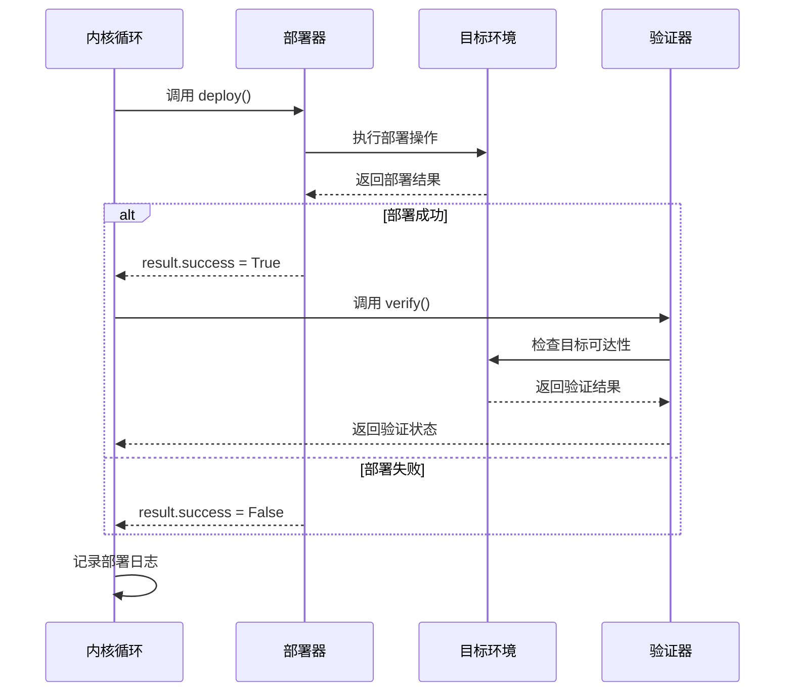
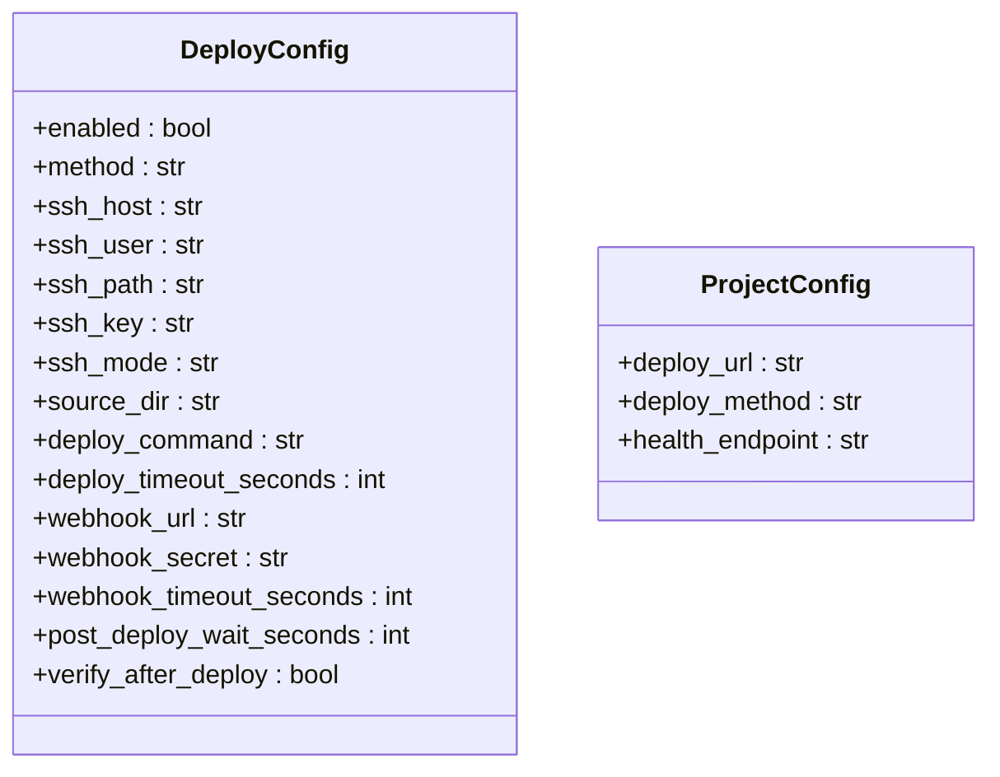
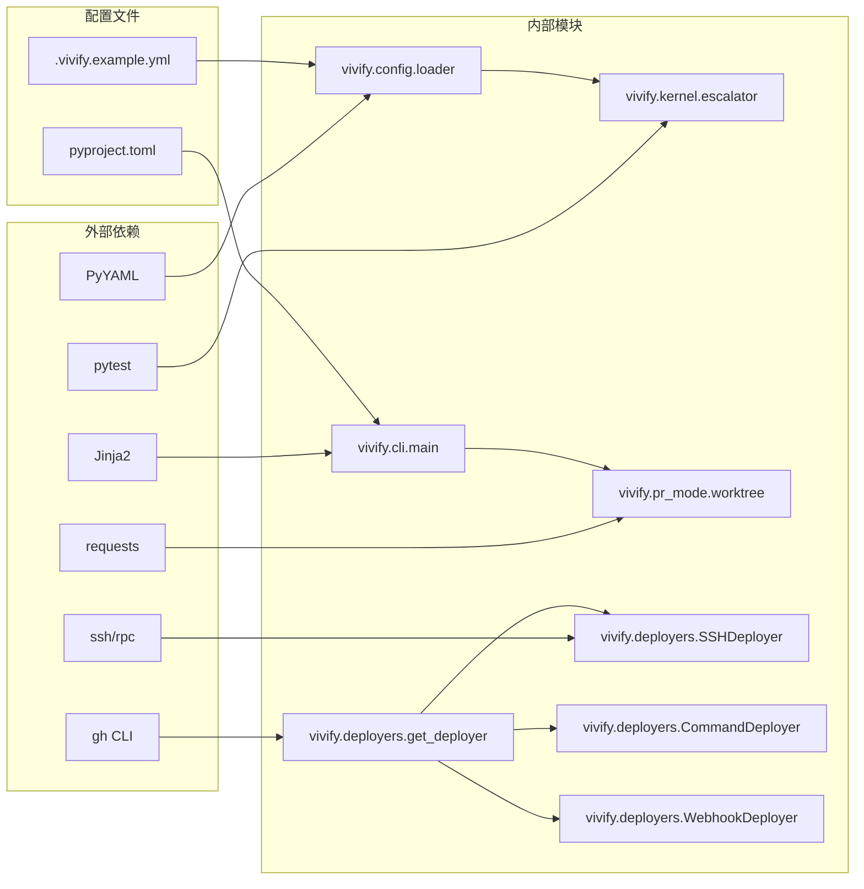

# 核心内核循环和文档更新

<cite>
**本文档引用的文件**
- [escalator.py](file://vivify/kernel/escalator.py)
- [loop.py](file://vivify/kernel/loop.py)
- [schema.py](file://vivify/config/schema.py)
- [__init__.py](file://vivify/deployers/__init__.py)
- [base.py](file://vivify/deployers/base.py)
- [command.py](file://vivify/deployers/command.py)
- [ssh.py](file://vivify/deployers/ssh.py)
- [webhook.py](file://vivify/deployers/webhook.py)
- [pr_creator.py](file://vivify/pr_mode/pr_creator.py)
- [auto_merge.py](file://vivify/pr_mode/auto_merge.py)
- [vivify.yml.tmpl](file://vivify/templates/vivify.yml.tmpl)
</cite>

## 更新摘要
**所做更改**
- 新增自动部署功能章节，详细说明部署器架构和执行流程
- 更新内核循环架构图，增加部署器集成节点
- 添加多种部署器类型的详细说明和配置示例
- 更新故障排除指南，包含部署相关问题的解决方案
- 完善文档验证和一致性检查方法

## 目录
1. [简介](#简介)
2. [项目结构](#项目结构)
3. [核心组件](#核心组件)
4. [架构概览](#架构概览)
5. [详细组件分析](#详细组件分析)
6. [自动部署功能](#自动部署功能)
7. [依赖关系分析](#依赖关系分析)
8. [性能考虑](#性能考虑)
9. [故障排除指南](#故障排除指南)
10. [结论](#结论)

## 简介

本文档详细说明了 Vivify 项目从 "auto-heal" 品牌重塑到 "vivify" 的完整改造过程，特别关注核心内核循环中的升级标题变更和文档更新。该改造涉及 477 处字符串引用的批量替换，包括升级标题从 "[auto-heal escalation]" 更改为 "[vivify escalation]"，以及升级消息从 "Auto-escalated by auto-heal" 更新为 "Auto-escalated by vivify"。

**更新** 本次更新还增加了对内核中集成的自动部署功能的详细说明，包括部署器初始化、部署执行流程以及多种部署方式的实现。

## 项目结构

Vivify 项目采用模块化架构设计，主要包含以下核心组件：



**图表来源**
- [loop.py:1-619](file://vivify/kernel/loop.py#L1-L619)
- [__init__.py:1-50](file://vivify/deployers/__init__.py#L1-L50)

**章节来源**
- [loop.py:1-619](file://vivify/kernel/loop.py#L1-L619)
- [__init__.py:1-50](file://vivify/deployers/__init__.py#L1-L50)

## 核心组件

### 内核循环系统

Vivify 的核心内核循环负责监控系统健康状况、检测问题、执行修复操作并处理升级流程。该系统包含以下关键组件：

- **探测器 (Probes)**: 监控 CI 状态、依赖漏洞、测试覆盖率等指标
- **修复器 (Fixers)**: 自动执行安全的修复操作
- **升级处理器 (Escalator)**: 处理无法自动修复的问题并创建功能请求
- **工作树管理 (Worktree)**: 管理 AI 开发分支的工作树
- **部署器 (Deployers)**: 自动部署合并后的代码到目标环境

### 配置管理系统

配置系统采用分层设计，支持环境变量覆盖和 YAML 配置文件：

- **Schema 定义**: 定义配置结构和默认值
- **默认值管理**: 维护 .gitignore 和路径默认值
- **配置加载器**: 支持环境变量前缀 VIVIFY__ 的配置覆盖

**章节来源**
- [schema.py:1-241](file://vivify/config/schema.py#L1-L241)
- [vivify.yml.tmpl:1-96](file://vivify/templates/vivify.yml.tmpl#L1-L96)

## 架构概览



**图表来源**
- [loop.py:1-619](file://vivify/kernel/loop.py#L1-L619)
- [__init__.py:1-50](file://vivify/deployers/__init__.py#L1-L50)

## 详细组件分析

### 升级处理器 (Escalator) 组件

升级处理器是内核循环的核心组件，负责处理无法自动修复的问题并将其升级为功能请求。在品牌重塑过程中，该组件的关键变更如下：

#### 升级标题变更

**变更前**: `"[auto-heal escalation]"`
**变更后**: `"[vivify escalation]"`

这一变更确保了所有升级操作都使用新的品牌标识，保持了一致的品牌体验。

#### 升级消息更新

**变更前**: `"Auto-escalated by auto-heal"`
**变更后**: `"Auto-escalated by vivify"`

升级消息的更新确保了用户界面和日志记录中的一致性，反映了新的品牌名称。



**图表来源**
- [escalator.py:55-85](file://vivify/kernel/escalator.py#L55-L85)
- [loop.py:344-347](file://vivify/kernel/loop.py#L344-L347)

**章节来源**
- [escalator.py:55-85](file://vivify/kernel/escalator.py#L55-L85)
- [loop.py:344-347](file://vivify/kernel/loop.py#L344-L347)

### 配置系统组件

配置系统在品牌重塑过程中进行了全面更新，确保所有配置项都使用新的品牌标识：

#### 环境变量前缀更新

**变更前**: `AUTO_HEAL__`
**变更后**: `VIVIFY__`

环境变量前缀的更新确保了配置系统的兼容性和一致性。

#### 配置文件路径更新

所有配置文件路径从 `.auto-heal/` 更新为 `.vivify/`，包括：
- 状态数据库路径: `.vivify/state.db`
- 日志目录: `.vivify/logs/`
- 工作树目录: `.vivify/worktrees/`



**图表来源**
- [schema.py:51-65](file://vivify/config/schema.py#L51-L65)
- [vivify.yml.tmpl:30-34](file://vivify/templates/vivify.yml.tmpl#L30-L34)

**章节来源**
- [schema.py:51-65](file://vivify/config/schema.py#L51-L65)
- [vivify.yml.tmpl:30-34](file://vivify/templates/vivify.yml.tmpl#L30-L34)

### CLI 命令行接口组件

CLI 接口在品牌重塑过程中进行了全面更新，确保所有命令都使用新的品牌名称：

#### 主程序名称更新

**变更前**: `prog="auto-heal"`
**变更后**: `prog="vivify"`

程序名称的更新确保了用户界面的一致性。

#### 帮助文本更新

所有帮助文本中的 `auto-heal` 都更新为 `vivify`，包括：
- 配置文件路径描述
- 命令行参数说明
- 错误消息提示

**章节来源**
- [loop.py:1-18](file://vivify/kernel/loop.py#L1-L18)
- [schema.py:197-220](file://vivify/config/schema.py#L197-L220)

## 自动部署功能

### 部署器架构概述

Vivify 内核循环集成了完整的自动部署功能，能够在 PR 合并后自动将代码部署到目标环境。部署系统采用插件化架构，支持多种部署方式：

#### 部署器初始化流程

内核在启动时会根据配置初始化相应的部署器实例：



**图表来源**
- [loop.py:148-154](file://vivify/kernel/loop.py#L148-L154)
- [__init__.py:27-49](file://vivify/deployers/__init__.py#L27-L49)

#### 部署执行流程

当 PR 合并成功后，内核会自动执行部署流程：



**图表来源**
- [loop.py:448-487](file://vivify/kernel/loop.py#L448-L487)
- [base.py:33-51](file://vivify/deployers/base.py#L33-L51)

### 部署器类型详解

#### SSH 部署器 (SSHDeployer)

SSH 部署器支持两种部署模式：

1. **rsync 模式**: 使用 rsync 同步文件到远程服务器
2. **git pull 模式**: 通过 SSH 在远程服务器执行 git pull

**配置参数**:
- `ssh_host`: 远程服务器主机名或 IP
- `ssh_user`: SSH 用户名
- `ssh_path`: 远程服务器目标路径
- `ssh_key`: SSH 私钥路径
- `ssh_mode`: 部署模式 (rsync | git_pull)
- `source_dir`: 同步源目录 (相对项目根目录)

#### 命令部署器 (CommandDeployer)

命令部署器允许用户自定义部署命令，适用于任何可以通过 shell 命令完成的部署场景。

**配置参数**:
- `deploy_command`: 要执行的部署命令
- `deploy_timeout_seconds`: 命令超时时间
- 自动加载 `~/.vivify/env` 文件中的环境变量

#### Webhook 部署器 (WebhookDeployer)

Webhook 部署器通过 HTTP 请求通知外部服务触发部署，适用于已有 CI/CD 流水线的场景。

**配置参数**:
- `webhook_url`: Webhook 端点 URL
- `webhook_secret`: 用于身份验证的密钥
- `webhook_timeout_seconds`: 请求超时时间

### 部署配置管理

#### 配置结构

部署配置采用 Pydantic 模型定义，支持灵活的配置选项：



**图表来源**
- [schema.py:151-174](file://vivify/config/schema.py#L151-L174)
- [schema.py:176-189](file://vivify/config/schema.py#L176-L189)

#### 默认配置模板

项目初始化时会生成包含部署配置的模板文件：

**章节来源**
- [schema.py:151-174](file://vivify/config/schema.py#L151-L174)
- [vivify.yml.tmpl:80-96](file://vivify/templates/vivify.yml.tmpl#L80-L96)

## 依赖关系分析



**图表来源**
- [loop.py:61-61](file://vivify/kernel/loop.py#L61-L61)
- [__init__.py:1-8](file://vivify/deployers/__init__.py#L1-L8)

**章节来源**
- [loop.py:61-61](file://vivify/kernel/loop.py#L61-L61)
- [__init__.py:1-8](file://vivify/deployers/__init__.py#L1-L8)

## 性能考虑

### 品牌重塑对性能的影响

品牌重塑主要涉及字符串替换和文件重命名操作，对系统性能的影响微乎其微。主要考虑因素包括：

- **内存使用**: 字符串替换操作在内存中进行，需要考虑文件大小
- **I/O 性能**: 大量文件的读写操作可能影响整体性能
- **并发处理**: 多线程处理多个文件时的资源竞争

### 自动部署功能的性能考量

自动部署功能引入了额外的网络 I/O 和进程调用开销：

- **SSH 部署**: 网络延迟和带宽限制
- **命令部署**: 子进程启动和命令执行时间
- **Webhook 部署**: 外部服务响应时间和可靠性
- **部署验证**: HTTP 请求和 SSL 握手开销

### 优化建议

1. **批量处理**: 使用 find 命令批量处理文件，减少 I/O 操作次数
2. **并行处理**: 利用多核处理器并行处理不同的文件类型
3. **增量更新**: 对于大型项目，考虑增量更新策略
4. **部署缓存**: 对频繁重复的部署操作进行缓存优化

## 故障排除指南

### 常见问题及解决方案

#### ImportError: No module named 'vivify'

**原因**: 包目录未正确重命名
**解决方案**: 确认 `vivify/` 目录存在于项目根目录

#### VIVIFY__ env not found

**原因**: 环境变量前缀未更新
**解决方案**: 检查 `config/loader.py` 中的 `_ENV_PREFIX = "VIVIFY__"`

#### .vivify/state.db not found

**原因**: 配置路径未更新
**解决方案**: 检查 `config/schema.py` 中的默认路径设置

#### Test failures

**原因**: 测试中仍有旧名称引用
**解决方案**: 运行 `grep -r "auto-heal" tests/` 并更新测试文件

#### 部署失败问题

**SSH 部署失败**:
- 检查 SSH 密钥权限和路径
- 验证远程服务器连接性
- 确认目标目录权限

**命令部署失败**:
- 检查部署命令语法和可用性
- 验证环境变量加载
- 查看命令输出错误信息

**Webhook 部署失败**:
- 确认 Webhook URL 可访问性
- 验证认证密钥配置
- 检查外部服务状态

### 验证清单

在完成品牌重塑和部署功能更新后，建议按照以下清单进行验证：

1. **导入测试**: `python3 -c "from vivify.cli.main import cli; print('OK')"`
2. **CLI 测试**: `python3 -m vivify --help`
3. **配置加载测试**: `python3 -c "from vivify.config import load_config; print('OK')"`
4. **部署器测试**: 
   ```bash
   python3 -c "from vivify.deployers import get_deployer; print('Deployer import OK')"
   ```
5. **测试套件**: `pytest tests/unit/ -v`
6. **字符串搜索**: `grep -r "auto-heal\|auto_heal\|AUTO_HEAL" . --include="*.py" --include="*.yml" --include="*.md" | grep -v ".git" | wc -l`
7. **部署功能测试**: 
   ```bash
   python3 -c "
   from vivify.deployers import get_deployer
   from vivify.config.schema import DeployConfig
   cfg = DeployConfig(method='manual')
   deployer = get_deployer('.', 'manual', cfg.model_dump())
   print('Manual deployer:', deployer is None)
   "

**章节来源**
- [loop.py:200-203](file://vivify/kernel/loop.py#L200-L203)
- [__init__.py:40-43](file://vivify/deployers/__init__.py#L40-L43)

## 结论

Vivify 项目从 "auto-heal" 到 "vivify" 的品牌重塑是一个系统性的工程改造，涉及 477 处字符串引用的批量更新。核心内核循环中的升级标题变更（[auto-heal escalation] → [vivify escalation]）和升级消息更新（Auto-escalated by auto-heal → Auto-escalated by vivify）确保了品牌一致性和用户体验的连贯性。

**更新** 本次更新还完整实现了内核中集成的自动部署功能，包括部署器初始化、多种部署方式的支持以及部署执行流程的完整实现。部署系统采用插件化架构，支持 SSH、命令和 Webhook 三种部署方式，为用户提供了灵活的部署选择。

这次改造不仅更新了代码中的品牌标识，还涉及配置文件、文档、测试等多个方面，体现了完整的软件工程实践。通过详细的文档记录和验证流程，确保了改造过程的可控性和可追溯性。自动部署功能的集成进一步增强了 Vivify 的自动化能力，为用户提供从问题检测到代码部署的完整解决方案。