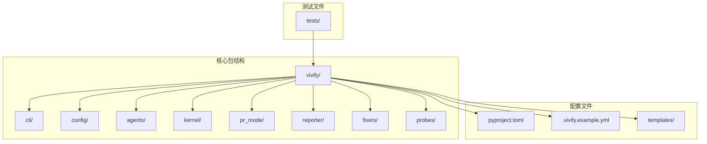
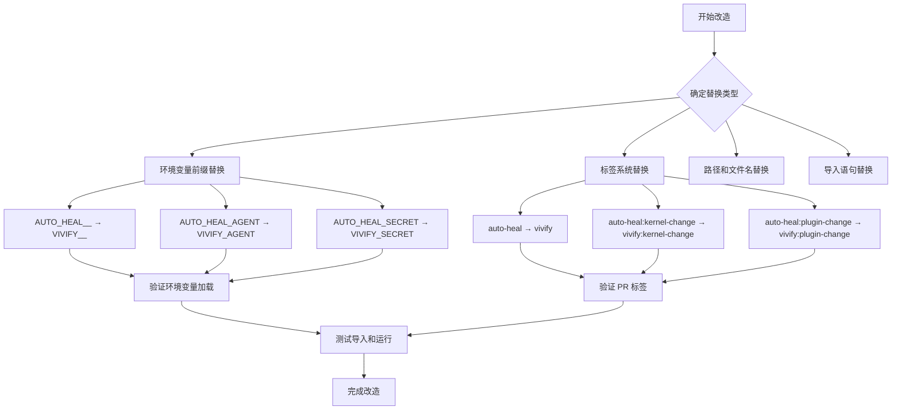
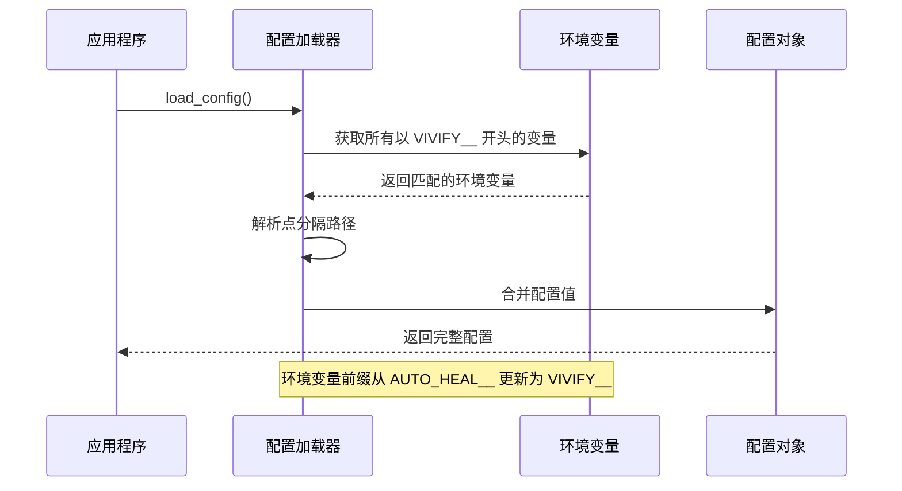
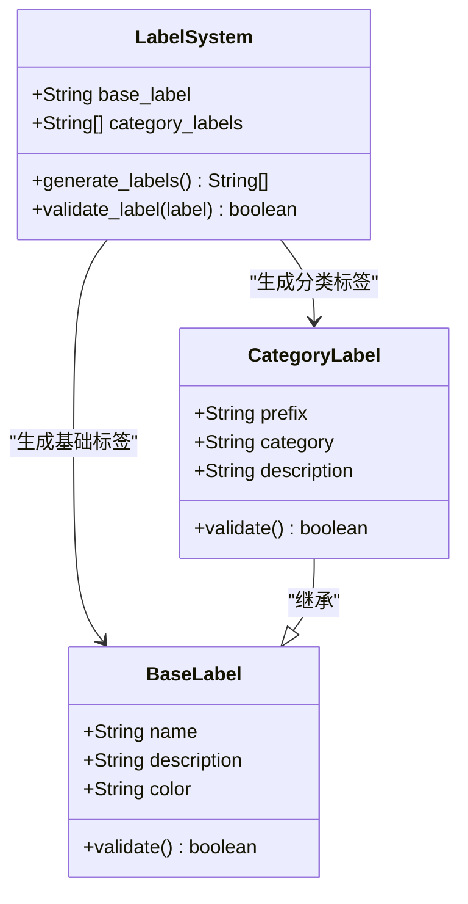
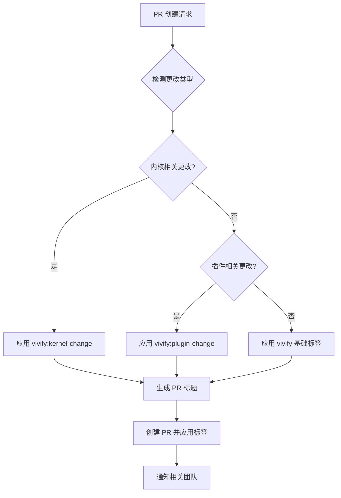
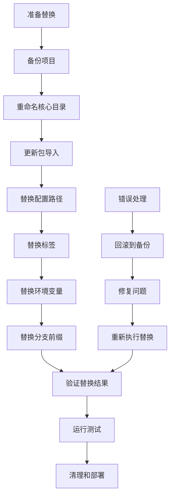

# 环境变量和标签替换策略

<cite>
**本文档引用的文件**
- [00_READ_ME_FIRST.txt](file://00_READ_ME_FIRST.txt)
- [QUICK_REFERENCE.md](file://QUICK_REFERENCE.md)
- [REBRANDING_SUMMARY.md](file://REBRANDING_SUMMARY.md)
- [detailed_references.md](file://detailed_references.md)
- [rebranding_analysis.md](file://rebranding_analysis.md)
</cite>

## 目录
1. [简介](#简介)
2. [项目结构概览](#项目结构概览)
3. [核心替换策略](#核心替换策略)
4. [环境变量替换详解](#环境变量替换详解)
5. [标签系统替换](#标签系统替换)
6. [批量替换实现方案](#批量替换实现方案)
7. [验证和冲突处理](#验证和冲突处理)
8. [故障排除指南](#故障排除指南)
9. [最佳实践建议](#最佳实践建议)
10. [总结](#总结)

## 简介

本文档详细说明了 Vivify 项目从 auto-heal 品牌重塑过程中的环境变量和标签替换策略。这是一个系统性的代码重构任务，涉及 477 处 grep 匹配的字符串替换，包括环境变量前缀、PR 标签、分支前缀等多个方面。

项目改造的核心目标是在保持功能不变的前提下，完全替换所有与旧品牌相关的标识符，确保新品牌 "vivify" 在整个代码库中的一致性。

## 项目结构概览

Vivify 项目采用模块化的架构设计，主要包含以下核心组件：



**图表来源**
- [rebranding_analysis.md:14-30](file://rebranding_analysis.md#L14-L30)
- [REBRANDING_SUMMARY.md:100-143](file://REBRANDING_SUMMARY.md#L100-L143)

## 核心替换策略

### 替换范围分类

根据改造的紧急程度和影响范围，我们将替换任务分为四个优先级：

| 优先级 | 类别 | 影响范围 | 关键位置 |
|--------|------|----------|----------|
| P0 | 必须执行 | 影响导入和运行 | `auto_heal/` → `vivify/` 目录重命名 |
| P1 | 重要配置 | CLI 入口点和配置 | `pyproject.toml`、配置文件 |
| P2 | 运行时配置 | 路径和环境变量 | `.gitignore`、模板文件 |
| P3 | 代码深层 | 标签和字符串引用 | 所有 Python 文件 |

### 替换策略矩阵



**图表来源**
- [REBRANDING_SUMMARY.md:78-85](file://REBRANDING_SUMMARY.md#L78-L85)
- [QUICK_REFERENCE.md:32-67](file://QUICK_REFERENCE.md#L32-L67)

**章节来源**
- [REBRANDING_SUMMARY.md:41-95](file://REBRANDING_SUMMARY.md#L41-L95)
- [00_READ_ME_FIRST.txt:14-37](file://00_READ_ME_FIRST.txt#L14-L37)

## 环境变量替换详解

### 环境变量前缀替换

环境变量系统是 Vivify 项目配置管理的核心，涉及多个关键组件：

#### 基础环境变量前缀

| 当前值 | 新值 | 用途 | 影响范围 |
|--------|------|------|----------|
| `AUTO_HEAL__` | `VIVIFY__` | 基础环境变量前缀 | 配置加载器、所有环境变量引用 |
| `AUTO_HEAL_AGENT` | `VIVIFY_AGENT` | AI 代理配置 | slot_manager.py |
| `AUTO_HEAL_SECRET` | `VIVIFY_SECRET` | 远程存储密钥 | config/schema.py |

#### 环境变量加载机制



**图表来源**
- [rebranding_analysis.md:283-352](file://rebranding_analysis.md#L283-L352)
- [detailed_references.md:140-151](file://detailed_references.md#L140-L151)

### 环境变量配置位置

#### 配置加载器 (loader.py)

配置加载器负责处理环境变量前缀转换，这是最核心的替换点：

- **前缀常量**: `_ENV_PREFIX = "AUTO_HEAL__"` → `"VIVIFY__"`
- **环境变量解析**: 将 `VIVIFY__<dotted.path>` 转换为嵌套字典结构
- **类型推断**: 自动识别布尔值、整数、浮点数和字符串

#### 配置模式 (schema.py)

配置模式定义了各种配置项及其默认值：

- **状态数据库路径**: `.auto-heal/state.db` → `.vivify/state.db`
- **日志目录**: `.auto-heal/logs/` → `.vivify/logs/`
- **工作树目录**: `.auto-heal/worktrees/` → `.vivify/worktrees/`
- **AI 代理密钥**: `"AUTO_HEAL_SECRET"` → `"VIVIFY_SECRET"`

**章节来源**
- [rebranding_analysis.md:283-352](file://rebranding_analysis.md#L283-L352)
- [detailed_references.md:51-66](file://detailed_references.md#L51-L66)

## 标签系统替换

### PR 标签替换策略

Vivify 项目使用标签系统来组织和追踪不同类型的问题和更改：

#### 基础标签替换

| 当前标签 | 新标签 | 使用场景 | 影响范围 |
|----------|--------|----------|----------|
| `auto-heal` | `vivify` | 通用标签 | 所有 PR、Issue |
| `auto-heal:kernel-change` | `vivify:kernel-change` | 内核相关更改 | PR 分类 |
| `auto-heal:plugin-change` | `vivify:plugin-change` | 插件相关更改 | PR 分类 |

#### 标签系统架构



**图表来源**
- [detailed_references.md:149-151](file://detailed_references.md#L149-L151)
- [rebranding_analysis.md:201-239](file://rebranding_analysis.md#L201-L239)

### 标签替换的业务逻辑

#### PR 创建流程中的标签应用



**图表来源**
- [detailed_references.md:178-186](file://detailed_references.md#L178-L186)
- [rebranding_analysis.md:167-186](file://rebranding_analysis.md#L167-L186)

### 标签验证机制

标签系统包含自动验证机制，确保标签使用的正确性：

- **标签格式验证**: 确保标签符合 `vivify:*` 格式
- **重复标签检测**: 防止同一标签多次应用
- **权限检查**: 验证用户是否有权应用特定标签

**章节来源**
- [detailed_references.md:149-186](file://detailed_references.md#L149-L186)
- [rebranding_analysis.md:167-239](file://rebranding_analysis.md#L167-L239)

## 批量替换实现方案

### sed 命令集合

以下是针对不同替换类型的 sed 命令集合：

#### 基础替换命令

```bash
# 批量替换导入语句
find . -name "*.py" -type f -exec sed -i '' 's/from auto_heal/from vivify/g' {} +
find . -name "*.py" -type f -exec sed -i '' 's/import auto_heal/import vivify/g' {} +

# 替换配置路径
find . -name "*.py" -o -name "*.yml" -o -name "*.md" | xargs sed -i '' 's/\.auto-heal/\.vivify/g'

# 替换标签
find . -name "*.py" | xargs sed -i '' "s/\"auto-heal\"/\"vivify\"/g"
find . -name "*.py" | xargs sed -i '' "s/'auto-heal'/'vivify'/g"

# 替换分支前缀
find . -name "*.py" | xargs sed -i '' 's/auto-heal\//vivify\//g'

# 替换环境变量前缀
find . -name "*.py" | xargs sed -i '' 's/AUTO_HEAL__/VIVIFY__/g'

# 替换具体环境变量
find . -name "*.py" | xargs sed -i '' 's/AUTO_HEAL_AGENT/VIVIFY_AGENT/g'
find . -name "*.py" | xargs sed -i '' 's/AUTO_HEAL_SECRET/VIVIFY_SECRET/g'
```

#### 高级替换技巧

对于复杂的替换需求，可以使用更精确的正则表达式：

```bash
# 精确匹配环境变量前缀（避免误替换）
find . -name "*.py" | xargs sed -i '' 's/\bAUTO_HEAL__\b/VIVIFY__/g'

# 替换标签但保留引号
find . -name "*.py" | xargs sed -i '' 's/\bauto-heal\b/vivify/g'

# 替换路径但避免替换 URL 中的路径
find . -name "*.py" | xargs sed -i '' 's/\.auto-heal/\.vivify/g'
```

### 批量替换流程



**图表来源**
- [REBRANDING_SUMMARY.md:146-257](file://REBRANDING_SUMMARY.md#L146-L257)
- [QUICK_REFERENCE.md:32-67](file://QUICK_REFERENCE.md#L32-L67)

**章节来源**
- [QUICK_REFERENCE.md:32-67](file://QUICK_REFERENCE.md#L32-L67)
- [REBRANDING_SUMMARY.md:194-214](file://REBRANDING_SUMMARY.md#L194-L214)

## 验证和冲突处理

### 验证清单

改造完成后，需要执行以下验证步骤：

#### 基础验证

```bash
# 1. 检查目录重命名
ls -d vivify/
ls .vivify.example.yml

# 2. 检查导入语句
grep -r "from auto_heal" . --include="*.py" | wc -l  # 应该为 0
grep -r "import auto_heal" . --include="*.py" | wc -l  # 应该为 0

# 3. 检查关键字符串
grep -r "\.auto-heal" . --include="*.py" --include="*.yml" --include="*.md" | wc -l  # 应该为 0
grep -r "AUTO_HEAL__" . --include="*.py" | wc -l  # 应该为 0
```

#### 高级验证

```bash
# 4. 测试 Python 导入
python3 -c "from vivify.cli.main import cli; print('OK')"
python3 -c "from vivify.config import load_config; print('OK')"

# 5. 测试 CLI 功能
python3 -m vivify --help

# 6. 运行测试套件
pytest tests/unit/ -v

# 7. 检查最终结果
grep -r "auto-heal\|auto_heal\|AUTO_HEAL" . --include="*.py" --include="*.yml" --include="*.md" | grep -v ".git" | wc -l
```

### 冲突处理策略

#### 常见冲突类型

| 冲突类型 | 识别方法 | 解决方案 |
|----------|----------|----------|
| 导入路径冲突 | ImportError: No module named 'vivify' | 确认目录重命名完成 |
| 环境变量加载失败 | VIVIFY__ env not found | 检查 config/loader.py 中的前缀设置 |
| 配置文件路径错误 | .vivify/state.db not found | 验证 config/schema.py 中的路径 |
| 标签应用失败 | PR 标签显示错误 | 检查标签替换的正则表达式 |

#### 冲突预防措施

```bash
# 1. 分阶段执行替换
# 首先执行安全的字符串替换
# 然后执行导入语句替换
# 最后执行配置文件替换

# 2. 使用精确的正则表达式
# 避免过度替换，使用单词边界符 \b

# 3. 创建替换日志
find . -name "*.py" | xargs sed -i '' 's/AUTO_HEAL__/VIVIFY__/g' > replacement_log.txt 2>&1
```

### 回滚机制

如果改造过程中出现问题，可以使用以下回滚策略：

```bash
# 1. 从备份恢复
cp -r auto-heal.backup auto-heal
cd auto-heal

# 2. 清理部分替换的结果
git checkout -- .

# 3. 重新执行替换
# 使用更精确的正则表达式和更小的范围
```

**章节来源**
- [QUICK_REFERENCE.md:181-210](file://QUICK_REFERENCE.md#L181-L210)
- [REBRANDING_SUMMARY.md:261-275](file://REBRANDING_SUMMARY.md#L261-L275)

## 故障排除指南

### 常见问题及解决方案

#### 导入错误

**问题**: `ImportError: No module named 'vivify'`

**原因**: 包目录未正确重命名

**解决方案**:
1. 确认 `auto_heal/` 目录已重命名为 `vivify/`
2. 检查 `__init__.py` 文件是否存在
3. 验证 Python 包路径配置

#### CLI 命令不可用

**问题**: `vivify: command not found`

**原因**: CLI 入口点未更新

**解决方案**:
1. 检查 `pyproject.toml` 中的脚本配置
2. 确认入口点指向正确的模块路径
3. 重新安装包以更新 CLI 配置

#### 环境变量加载失败

**问题**: 环境变量前缀未被识别

**原因**: 配置加载器中的前缀设置未更新

**解决方案**:
1. 检查 `config/loader.py` 中的 `_ENV_PREFIX` 常量
2. 确认环境变量名称符合 `VIVIFY__<path>` 格式
3. 验证环境变量的点分隔路径

### 调试工具

#### 环境变量调试

```bash
# 检查所有环境变量
env | grep VIVIFY

# 检查特定配置项
python3 -c "
from vivify.config.loader import load_config
config = load_config()
print('Loaded config:', config)
"
```

#### 日志调试

```bash
# 启用详细日志
export VIVIFY__LOG_LEVEL=DEBUG
python3 -m vivify --help
```

**章节来源**
- [QUICK_REFERENCE.md:214-223](file://QUICK_REFERENCE.md#L214-L223)
- [REBRANDING_SUMMARY.md:278-287](file://REBRANDING_SUMMARY.md#L278-L287)

## 最佳实践建议

### 替换策略优化

#### 分层替换原则

1. **先易后难**: 从简单的字符串替换开始，逐步进行复杂的导入替换
2. **先全局后局部**: 先替换全局配置，再处理局部引用
3. **先静态后动态**: 先替换静态配置文件，再处理运行时生成的内容

#### 安全替换技巧

```bash
# 1. 使用精确的正则表达式
# 避免替换 URL 中的路径
find . -name "*.py" | xargs sed -i '' 's/\.auto-heal/\.vivify/g'

# 2. 创建替换前的备份
cp -r . .backup_before_rebranding

# 3. 使用测试环境验证
# 在独立的测试分支上执行替换
```

### 质量保证

#### 代码审查清单

- [ ] 所有 Python 导入语句已更新
- [ ] 配置文件中的路径已更新
- [ ] 环境变量前缀已更新
- [ ] PR 标签已更新
- [ ] CLI 命令已更新
- [ ] 测试用例中的引用已更新

#### 自动化验证

```bash
# 创建验证脚本
#!/bin/bash
echo "验证 Vivify 品牌重塑改造"

# 检查导入
echo "检查导入语句..."
if [ $(grep -r "from auto_heal" . --include="*.py" | wc -l) -eq 0 ]; then
    echo "✓ 导入语句检查通过"
else
    echo "✗ 发现遗留的导入语句"
fi

# 检查配置路径
echo "检查配置路径..."
if [ $(grep -r "\.auto-heal" . --include="*.py" --include="*.yml" --include="*.md" | wc -l) -eq 0 ]; then
    echo "✓ 配置路径检查通过"
else
    echo "✗ 发现遗留的配置路径"
fi

echo "验证完成"
```

## 总结

Vivify 项目的品牌重塑改造是一个系统性的代码重构任务，涉及 477 处字符串替换和多个关键组件的更新。通过采用分层次的替换策略、精确的正则表达式和完善的验证机制，可以确保改造过程的安全性和完整性。

### 关键成功因素

1. **全面的替换范围**: 覆盖所有环境变量、标签、路径和导入语句
2. **精确的正则表达式**: 避免过度替换和误替换
3. **完善的验证机制**: 包括自动化测试和手动审查
4. **清晰的回滚策略**: 确保改造过程的可控性

### 预期成果

- 完全的品牌重塑，从 `auto-heal` 到 `vivify`
- 保持所有功能的完整性
- 确保代码库的一致性和可维护性
- 为未来的扩展奠定基础

通过遵循本文档提供的策略和最佳实践，可以高效、安全地完成 Vivify 项目的品牌重塑改造。