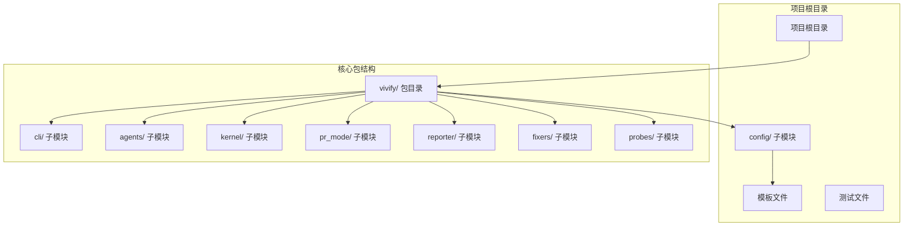
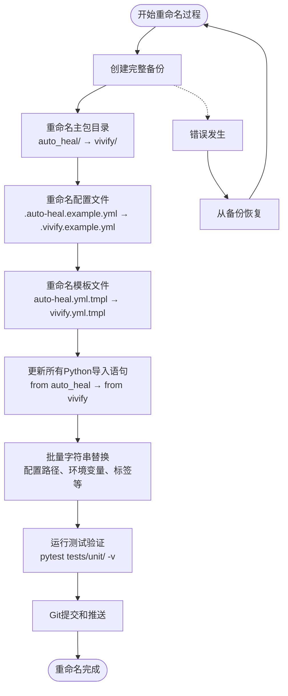
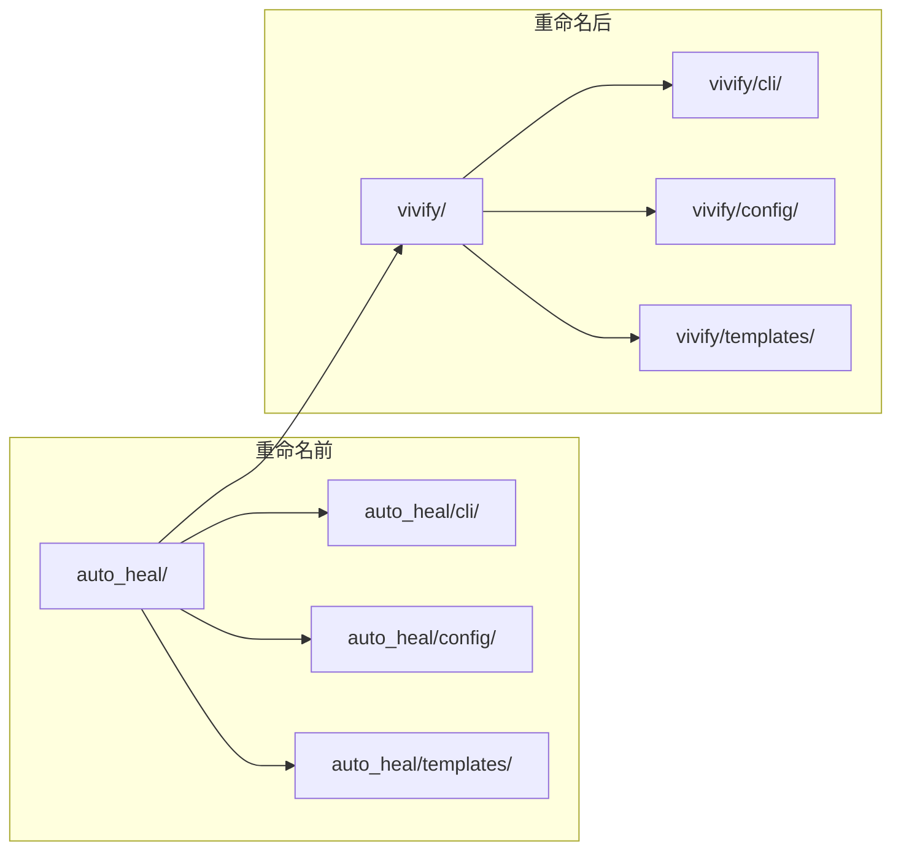

# 目录和文件重命名

<cite>
**本文档引用的文件**
- [00_READ_ME_FIRST.txt](file://00_READ_ME_FIRST.txt)
- [QUICK_REFERENCE.md](file://QUICK_REFERENCE.md)
- [REBRANDING_SUMMARY.md](file://REBRANDING_SUMMARY.md)
- [detailed_references.md](file://detailed_references.md)
- [rebranding_analysis.md](file://rebranding_analysis.md)
</cite>

## 目录
1. [简介](#简介)
2. [项目结构](#项目结构)
3. [核心组件](#核心组件)
4. [架构概览](#架构概览)
5. [详细组件分析](#详细组件分析)
6. [依赖关系分析](#依赖关系分析)
7. [性能考虑](#性能考虑)
8. [故障排除指南](#故障排除指南)
9. [结论](#结论)

## 简介

本文档详细说明了Vivify项目（原auto-heal）的品牌重塑过程中必须进行的目录和文件重命名策略。这是一个系统性的重构过程，涉及3个核心重命名位置、约477处字符串匹配替换、以及对导入语句的重大调整。

## 项目结构

基于调研报告，Vivify项目采用模块化的Python包结构：



**图表来源**
- [rebranding_analysis.md:14-31](file://rebranding_analysis.md#L14-L31)
- [REBRANDING_SUMMARY.md:100-143](file://REBRANDING_SUMMARY.md#L100-L143)

**章节来源**
- [00_READ_ME_FIRST.txt:14-37](file://00_READ_ME_FIRST.txt#L14-L37)
- [REBRANDING_SUMMARY.md:41-95](file://REBRANDING_SUMMARY.md#L41-L95)

## 核心组件

### 必须重命名的3个核心位置

根据项目调研，必须重命名的3个核心位置如下：

| 优先级 | 类型 | 当前位置 | 新位置 | 影响范围 |
|--------|------|---------|--------|----------|
| P0 | 目录 | `auto_heal/` | `vivify/` | 主Python包目录，影响所有导入语句 |
| P0 | 文件 | `.auto-heal.example.yml` | `.vivify.example.yml` | 示例配置文件 |
| P0 | 文件 | `auto_heal/templates/auto-heal.yml.tmpl` | `vivify/templates/vivify.yml.tmpl` | 配置模板文件 |

### 重命名前的准备工作

在进行任何重命名操作之前，必须执行以下准备工作：

1. **完整备份项目**
   ```bash
   cd /Users/chongshan/project/chongshan
   cp -r auto-heal auto-heal.backup
   ```

2. **验证备份完整性**
   - 确认备份目录存在且包含所有源文件
   - 验证备份文件的完整性

3. **准备重命名工具**
   - 确保系统支持`mv`命令
   - 准备文本编辑器用于手动审查

**章节来源**
- [00_READ_ME_FIRST.txt:149-164](file://00_READ_ME_FIRST.txt#L149-L164)
- [REBRANDING_SUMMARY.md:148-162](file://REBRANDING_SUMMARY.md#L148-L162)

## 架构概览

重命名过程遵循严格的执行顺序，确保每个步骤都正确完成：



**图表来源**
- [REBRANDING_SUMMARY.md:146-257](file://REBRANDING_SUMMARY.md#L146-L257)
- [QUICK_REFERENCE.md:32-91](file://QUICK_REFERENCE.md#L32-L91)

## 详细组件分析

### 目录重命名策略

#### 主包目录重命名

**执行步骤：**
1. 进入项目根目录
2. 执行重命名命令
3. 验证重命名结果

**验证方法：**
```bash
# 检查目录是否存在
ls -d vivify/

# 检查目录结构
ls -la vivify/
```

**导入语句影响：**
- 所有`from auto_heal`导入语句必须更新
- 所有`import auto_heal`导入语句必须更新
- 所有相对导入路径必须相应调整

#### 配置文件重命名

**执行步骤：**
1. 重命名示例配置文件
2. 更新相关的配置加载逻辑
3. 验证配置文件路径

**验证方法：**
```bash
# 检查新配置文件是否存在
ls -la .vivify.example.yml
```

#### 模板文件重命名

**执行步骤：**
1. 进入模板目录
2. 重命名模板文件
3. 更新相关的模板引用

**验证方法：**
```bash
# 检查模板文件重命名
ls -la vivify/templates/vivify.yml.tmpl
```

**章节来源**
- [detailed_references.md:5-12](file://detailed_references.md#L5-L12)
- [QUICK_REFERENCE.md:71-91](file://QUICK_REFERENCE.md#L71-L91)

### 导入语句重命名策略

#### 自动化导入更新

使用`find`和`sed`命令进行批量导入语句更新：

```bash
# 更新from导入语句
find . -name "*.py" -type f -exec sed -i '' 's/from auto_heal/from vivify/g' {} +

# 更新import导入语句  
find . -name "*.py" -type f -exec sed -i '' 's/import auto_heal/import vivify/g' {} +
```

#### 手动审查要点

1. **关键文件审查**
   - `pyproject.toml`中的脚本入口点
   - `auto_heal/config/schema.py`中的路径定义
   - `auto_heal/cli/init_cmd.py`中的模板导入

2. **导入语句验证**
   ```bash
   # 验证没有遗留的旧导入
   grep -r "from auto_heal" . --include="*.py" | wc -l  # 应该为 0
   grep -r "import auto_heal" . --include="*.py" | wc -l  # 应该为 0
   ```

**章节来源**
- [QUICK_REFERENCE.md:32-67](file://QUICK_REFERENCE.md#L32-L67)
- [REBRANDING_SUMMARY.md:164-174](file://REBRANDING_SUMMARY.md#L164-L174)

### 字符串替换策略

#### 分类批量替换

按照优先级进行字符串替换：

1. **配置路径替换**
   ```bash
   find . -name "*.py" -o -name "*.yml" -o -name "*.md" | xargs sed -i '' 's/\.auto-heal/\.vivify/g'
   ```

2. **标签替换**
   ```bash
   find . -name "*.py" | xargs sed -i '' "s/\"auto-heal\"/\"vivify\"/g"
   find . -name "*.py" | xargs sed -i '' "s/'auto-heal'/'vivify'/g"
   ```

3. **分支前缀替换**
   ```bash
   find . -name "*.py" | xargs sed -i '' 's/auto-heal\//vivify\//g'
   ```

4. **环境变量前缀替换**
   ```bash
   find . -name "*.py" | xargs sed -i '' 's/AUTO_HEAL__/VIVIFY__/g'
   ```

#### 关键字符串替换清单

| 字符串类型 | 当前值 | 新值 | 用途 |
|-----------|--------|------|------|
| 配置路径 | `.auto-heal` | `.vivify` | 配置文件路径 |
| 环境变量前缀 | `AUTO_HEAL__` | `VIVIFY__` | 环境变量前缀 |
| PR标签 | `auto-heal` | `vivify` | GitHub标签 |
| 分支前缀 | `auto-heal/` | `vivify/` | Git分支前缀 |
| 日志文件 | `auto-heal.log` | `vivify.log` | 日志文件名 |
| 提交消息 | `auto-heal:` | `vivify:` | Git提交前缀 |

**章节来源**
- [QUICK_REFERENCE.md:32-67](file://QUICK_REFERENCE.md#L32-L67)
- [detailed_references.md:140-152](file://detailed_references.md#L140-L152)

## 依赖关系分析

### 重命名对导入系统的影响



**图表来源**
- [detailed_references.md:16-30](file://detailed_references.md#L16-L30)
- [rebranding_analysis.md:14-31](file://rebranding_analysis.md#L14-L31)

### 导入语句依赖链

重命名过程中的关键依赖关系：

1. **包结构依赖**
   - `vivify/`必须作为顶级包存在
   - 所有子模块必须保持原有结构
   - 包初始化文件必须存在

2. **导入路径依赖**
   - 相对导入路径必须更新
   - 绝对导入路径必须更新
   - 模板资源路径必须更新

3. **配置依赖**
   - 配置文件路径必须更新
   - 环境变量前缀必须更新
   - CLI入口点必须更新

**章节来源**
- [REBRANDING_SUMMARY.md:176-184](file://REBRANDING_SUMMARY.md#L176-L184)
- [detailed_references.md:17-31](file://detailed_references.md#L17-L31)

## 性能考虑

### 重命名过程的时间估算

根据项目调研，整个重命名过程预计需要1.5-2小时：

| 阶段 | 时间估算 | 任务内容 |
|------|----------|----------|
| 备份 | 5分钟 | 创建完整项目备份 |
| 目录重命名 | 5分钟 | 重命名3个核心位置 |
| 导入更新 | 10分钟 | 自动化导入语句更新 |
| 字符串替换 | 15分钟 | 分类批量替换 |
| 手动审查 | 30分钟 | 关键文件逐项检查 |
| 测试验证 | 15分钟 | 运行测试套件 |
| Git操作 | 5分钟 | 提交和推送 |

### 并行处理优化

1. **并行文件处理**
   - 使用`find`命令的并行特性
   - 合理分组字符串替换操作

2. **增量验证**
   - 分阶段验证重命名结果
   - 及时发现和修复问题

## 故障排除指南

### 常见问题及解决方案

| 问题类型 | 症状 | 原因 | 解决方案 |
|----------|------|------|----------|
| ImportError | "No module named 'vivify'" | 包目录未重命名 | 检查`vivify/`目录是否存在 |
| CLI不可用 | "vivify: command not found" | CLI入口点未更新 | 检查`pyproject.toml`中的脚本定义 |
| 配置加载失败 | 环境变量未识别 | 环境变量前缀未更新 | 检查`config/loader.py`中的前缀设置 |
| 测试失败 | 单元测试报错 | 测试中仍有旧名称 | 运行`grep -r "auto-heal" tests/`查找并修复 |
| 导入错误 | 导入路径不正确 | 相对导入未更新 | 检查所有Python文件中的导入语句 |

### 验证检查清单

在完成重命名后，必须执行以下验证步骤：

1. **基本结构验证**
   ```bash
   # 检查目录重命名
   ls -d vivify/
   ls .vivify.example.yml
   
   # 检查导入语句
   grep -r "from auto_heal" . --include="*.py" | wc -l  # 应该为 0
   grep -r "import auto_heal" . --include="*.py" | wc -l  # 应该为 0
   ```

2. **功能验证**
   ```bash
   # 测试Python导入
   python3 -c "from vivify.cli.main import cli; print('OK')"
   
   # 测试CLI功能
   python3 -m vivify --help
   
   # 运行测试套件
   pytest tests/unit/ -v
   ```

3. **字符串验证**
   ```bash
   # 检查新名称是否生效
   grep -r "vivify" . --include="*.py" --include="*.yml" | wc -l  # 应该大于100
   
   # 检查没有遗留的旧名称
   grep -r "auto-heal\|auto_heal\|AUTO_HEAL" . --include="*.py" --include="*.yml" --include="*.md" | grep -v ".git" | wc -l  # 应该为 0
   ```

**章节来源**
- [QUICK_REFERENCE.md:214-275](file://QUICK_REFERENCE.md#L214-L275)
- [00_READ_ME_FIRST.txt:166-187](file://00_READ_ME_FIRST.txt#L166-L187)

## 结论

Vivify项目的目录和文件重命名是一个系统性的工程任务，涉及3个核心重命名位置、约477处字符串替换和对导入系统的重大调整。通过遵循本文档提供的分阶段执行策略，可以确保重命名过程的顺利进行。

### 关键成功因素

1. **充分的备份** - 在开始任何重命名操作之前创建完整备份
2. **严格的执行顺序** - 按照既定的顺序执行每个重命名步骤
3. **全面的验证** - 在每个阶段完成后进行验证检查
4. **及时的问题修复** - 发现问题时立即停止并修复

### 最终验证

重命名完成后，项目应该具备以下特征：
- 所有导入语句正确更新
- 配置文件路径正确
- CLI功能正常
- 测试套件全部通过
- 没有遗留的旧名称引用

通过严格执行这些步骤和验证方法，可以确保Vivify项目的品牌重塑顺利完成，同时保持所有功能的完整性。