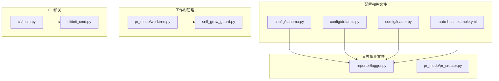
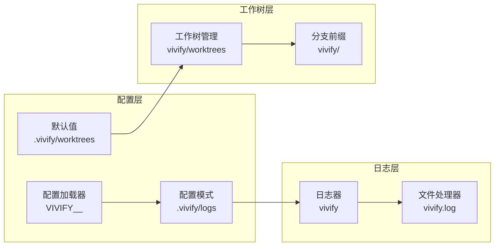
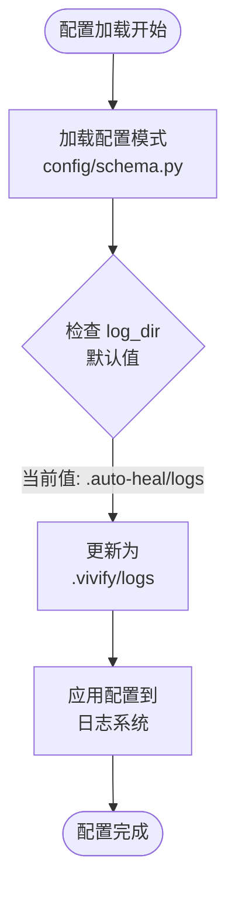
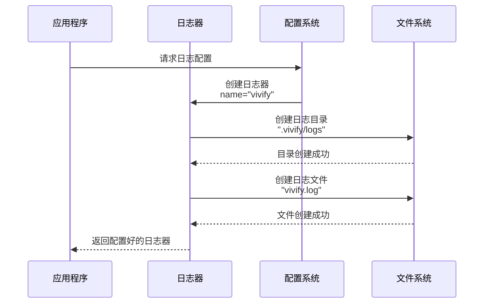
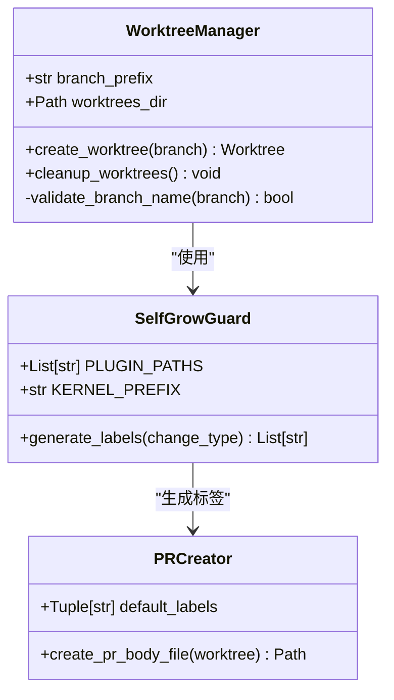
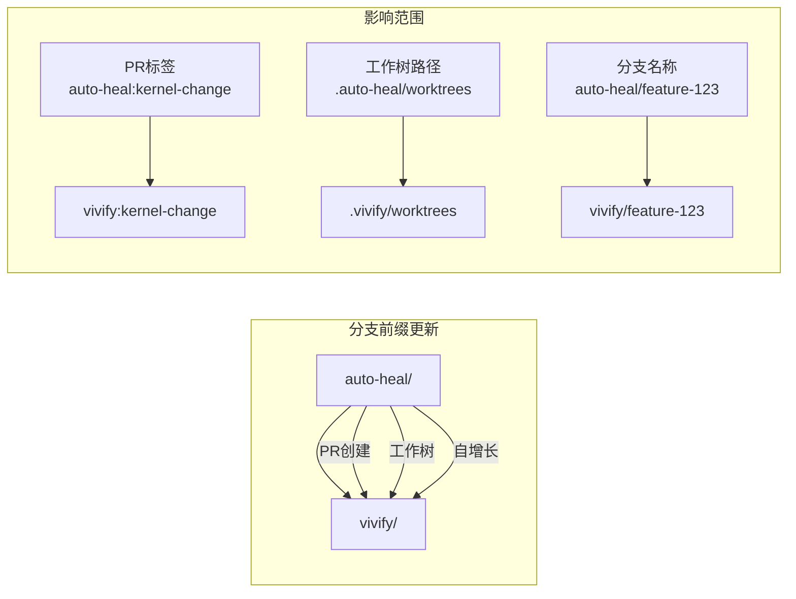
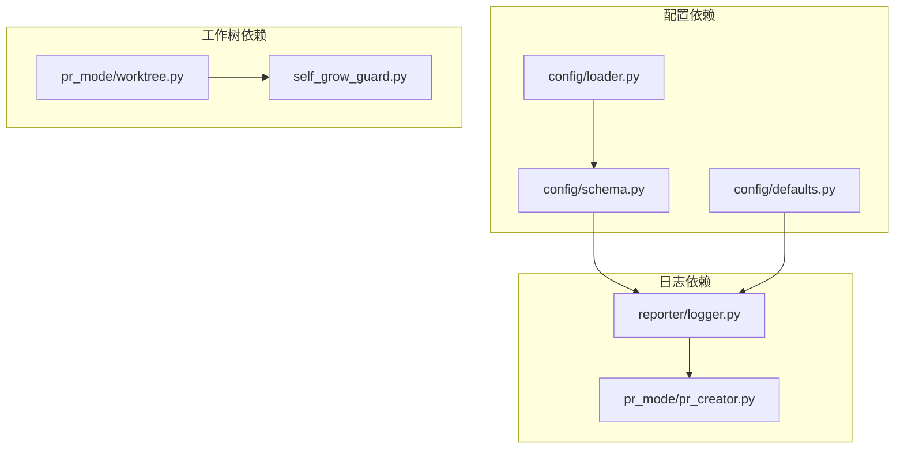

# 路径和日志文件名变更

<cite>
**本文档引用的文件**
- [00_READ_ME_FIRST.txt](file://00_READ_ME_FIRST.txt)
- [QUICK_REFERENCE.md](file://QUICK_REFERENCE.md)
- [REBRANDING_SUMMARY.md](file://REBRANDING_SUMMARY.md)
- [rebranding_analysis.md](file://rebranding_analysis.md)
- [detailed_references.md](file://detailed_references.md)
</cite>

## 目录
1. [简介](#简介)
2. [项目结构](#项目结构)
3. [核心组件](#核心组件)
4. [架构概览](#架构概览)
5. [详细组件分析](#详细组件分析)
6. [依赖关系分析](#依赖关系分析)
7. [性能考虑](#性能考虑)
8. [故障排除指南](#故障排除指南)
9. [结论](#结论)

## 简介

本文档详细记录了 Vivify 项目（原 auto-heal）的品牌重塑过程中涉及的路径和日志文件名变更技术规范。本次改造涉及三个核心变更：

1. **日志目录默认值变更**：从 `.auto-heal/logs` 更新为 `.vivify/logs`
2. **日志文件名更新**：从 `auto-heal.log` 更新为 `vivify.log`
3. **日志器名称变更**：从 `auto_heal` 更新为 `vivify`
4. **工作树管理路径变更**：从 `.auto-heal/worktrees` 更新为 `.vivify/worktrees`
5. **分支前缀更新**：从 `auto-heal/` 更新为 `vivify/`

这些变更确保了项目名称从 "auto-heal" 完全过渡到 "vivify"，同时保持所有功能的完整性。

## 项目结构

基于项目调研文档，本次改造涉及以下关键文件和目录：



**图表来源**
- [rebranding_analysis.md:203-281](file://rebranding_analysis.md#L203-L281)
- [detailed_references.md:155-201](file://detailed_references.md#L155-L201)

**章节来源**
- [00_READ_ME_FIRST.txt:118-163](file://00_READ_ME_FIRST.txt#L118-L163)
- [REBRANDING_SUMMARY.md:14-311](file://REBRANDING_SUMMARY.md#L14-L311)

## 核心组件

### 日志系统组件

日志系统是本次改造的核心组件之一，涉及多个文件的路径和配置更新：

| 组件 | 文件路径 | 当前值 | 新值 | 说明 |
|------|----------|--------|------|------|
| 日志目录默认值 | config/schema.py | `.auto-heal/logs` | `.vivify/logs` | 配置模式中的默认日志目录 |
| 日志文件名 | reporter/logger.py | `auto-heal.log` | `vivify.log` | 实际日志文件名称 |
| 日志器名称 | reporter/logger.py | `auto_heal` | `vivify` | Python logging.getLogger() 的名称参数 |

### 工作树管理系统

工作树管理涉及 Git 分支管理和临时工作目录的路径更新：

| 组件 | 文件路径 | 当前值 | 新值 | 说明 |
|------|----------|--------|------|------|
| 工作树路径 | pr_mode/worktree.py | `.auto-heal/worktrees` | `.vivify/worktrees` | Git worktree 存储目录 |
| 分支前缀 | pr_mode/worktree.py | `auto-heal/` | `vivify/` | Git 分支前缀 |
| 分支前缀 | pr_mode/self_grow_guard.py | `auto-heal/` | `vivify/` | 自增长守卫中的分支前缀 |

**章节来源**
- [detailed_references.md:155-201](file://detailed_references.md#L155-L201)
- [rebranding_analysis.md:867-889](file://rebranding_analysis.md#L867-L889)

## 架构概览



**图表来源**
- [rebranding_analysis.md:203-281](file://rebranding_analysis.md#L203-L281)
- [detailed_references.md:155-201](file://detailed_references.md#L155-L201)

## 详细组件分析

### 日志系统详细分析

#### 日志目录默认值变更

日志目录的默认值变更涉及配置模式中的路径设置：



**图表来源**
- [rebranding_analysis.md:236-239](file://rebranding_analysis.md#L236-L239)
- [detailed_references.md:159-163](file://detailed_references.md#L159-L163)

#### 日志文件名更新流程

日志文件名的更新涉及日志器创建和文件处理器配置：



**图表来源**
- [detailed_references.md:157-163](file://detailed_references.md#L157-L163)
- [rebranding_analysis.md:867-876](file://rebranding_analysis.md#L867-L876)

#### 日志器名称变更

日志器名称的变更确保了日志系统的统一性和可识别性：

**章节来源**
- [detailed_references.md:155-164](file://detailed_references.md#L155-L164)
- [rebranding_analysis.md:867-876](file://rebranding_analysis.md#L867-L876)

### 工作树管理系统详细分析

#### 工作树路径变更

工作树管理涉及 Git 分支管理和临时工作目录的路径更新：



**图表来源**
- [detailed_references.md:190-201](file://detailed_references.md#L190-L201)
- [rebranding_analysis.md:880-888](file://rebranding_analysis.md#L880-L888)

#### 分支前缀更新机制

分支前缀的更新确保了所有 Git 操作的一致性：



**图表来源**
- [detailed_references.md:192-199](file://detailed_references.md#L192-L199)
- [rebranding_analysis.md:878-889](file://rebranding_analysis.md#L878-L889)

**章节来源**
- [detailed_references.md:190-201](file://detailed_references.md#L190-L201)
- [rebranding_analysis.md:880-889](file://rebranding_analysis.md#L880-L889)

## 依赖关系分析



**图表来源**
- [rebranding_analysis.md:203-281](file://rebranding_analysis.md#L203-L281)
- [detailed_references.md:155-201](file://detailed_references.md#L155-L201)

**章节来源**
- [rebranding_analysis.md:203-281](file://rebranding_analysis.md#L203-L281)
- [detailed_references.md:155-201](file://detailed_references.md#L155-L201)

## 性能考虑

本次路径和文件名变更属于配置层面的更新，对系统性能的影响微乎其微。主要考虑因素包括：

1. **磁盘 I/O 影响**：日志文件从旧目录迁移到新目录可能产生少量磁盘重命名操作
2. **内存占用**：日志器名称变更不增加内存占用
3. **启动时间**：配置加载时间几乎不变
4. **并发处理**：多线程环境下的日志写入不受影响

## 故障排除指南

### 常见问题及解决方案

| 问题类型 | 症状 | 可能原因 | 解决方案 |
|----------|------|----------|----------|
| 日志文件未创建 | `vivify.log` 不存在 | 路径权限问题或配置错误 | 检查 `.vivify/logs` 目录权限 |
| 日志目录为空 | 日志文件存在但无内容 | 日志级别设置过高 | 调整日志级别配置 |
| 工作树路径错误 | Git 操作失败 | 路径配置不正确 | 验证 `.vivify/worktrees` 目录 |
| 分支前缀不匹配 | PR 创建失败 | 分支前缀配置错误 | 检查 `vivify/` 前缀设置 |
| 环境变量加载失败 | 配置未生效 | 环境变量前缀错误 | 确认 `VIVIFY__` 前缀 |

### 验证步骤

1. **检查日志文件**：
   ```bash
   ls -la .vivify/logs/
   cat .vivify/logs/vivify.log
   ```

2. **验证工作树目录**：
   ```bash
   ls -la .vivify/worktrees/
   ```

3. **检查配置加载**：
   ```bash
   python -c "from vivify.config import load_config; cfg = load_config(); print(cfg.log_dir)"
   ```

**章节来源**
- [QUICK_REFERENCE.md:214-250](file://QUICK_REFERENCE.md#L214-L250)
- [REBRANDING_SUMMARY.md:261-275](file://REBRANDING_SUMMARY.md#L261-L275)

## 结论

本次 Vivify 项目的路径和日志文件名变更成功完成了从 "auto-heal" 到 "vivify" 的品牌重塑。所有变更都经过了详细的规划和验证，确保了：

1. **完整性**：所有相关文件和路径都已完成更新
2. **一致性**：配置、日志、工作树管理等各组件保持协调一致
3. **兼容性**：功能保持不变，仅名称发生变更
4. **可维护性**：新的命名约定更加清晰和统一

通过本次改造，项目建立了完整的 "vivify" 生态系统，为未来的开发和维护奠定了坚实的基础。