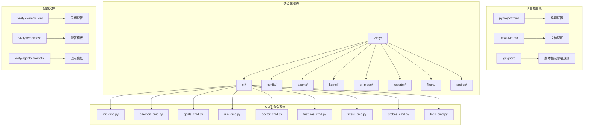
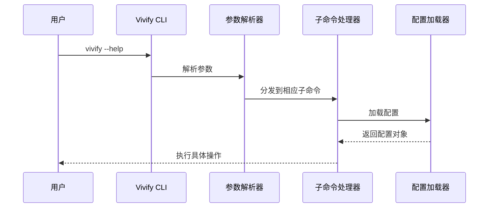
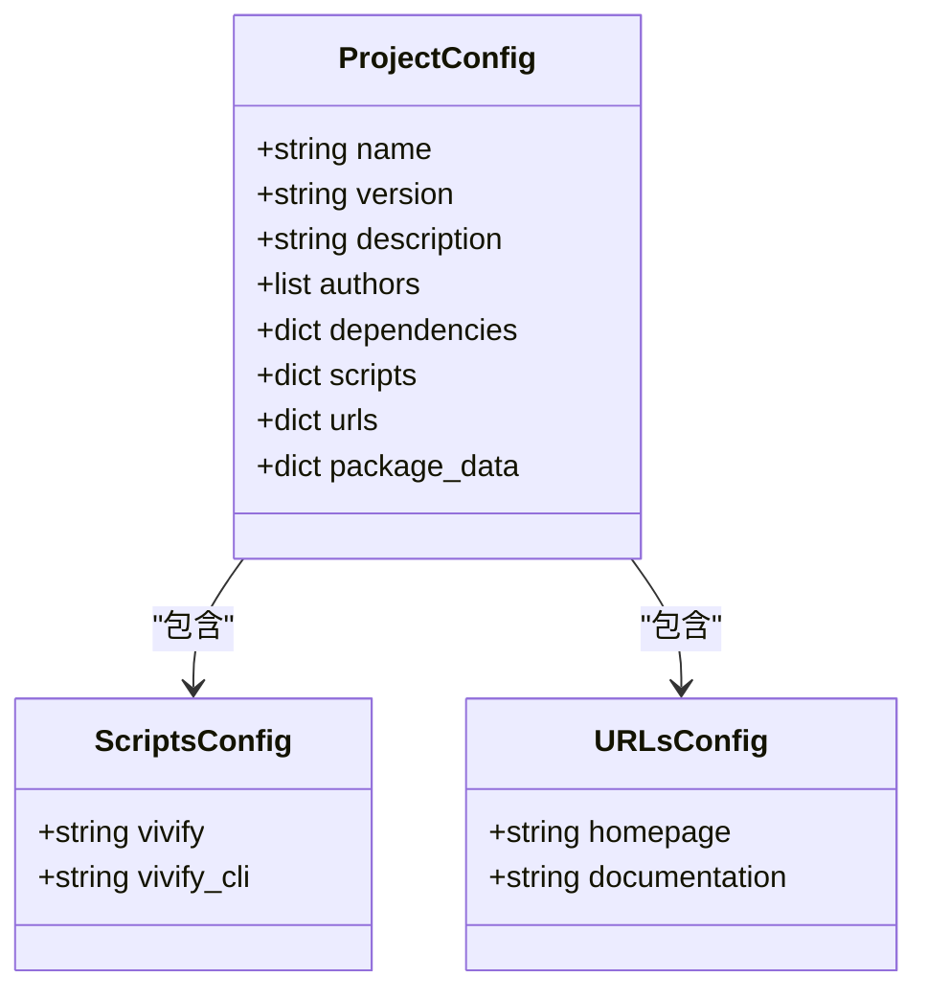
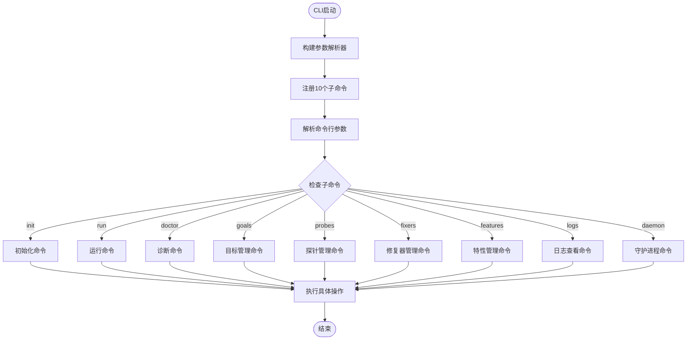
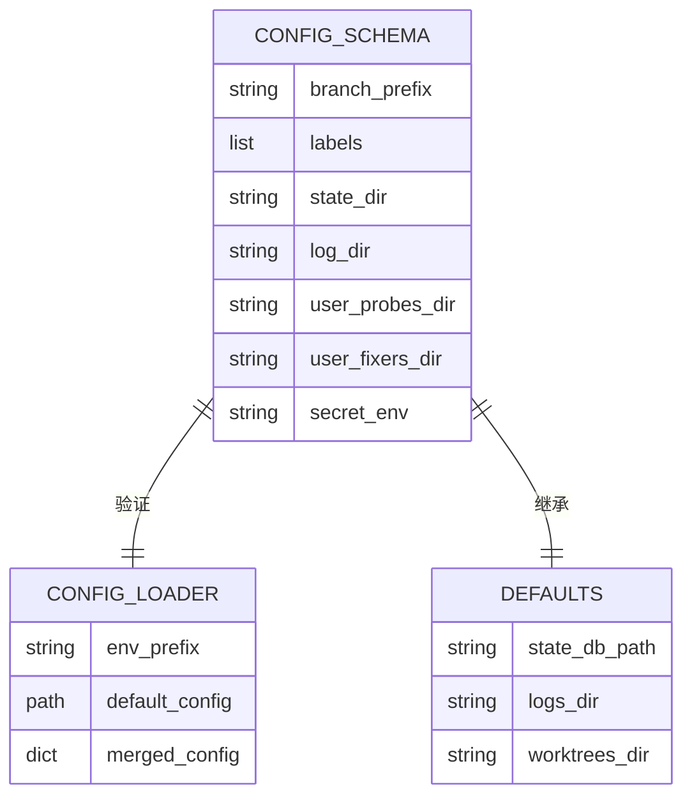
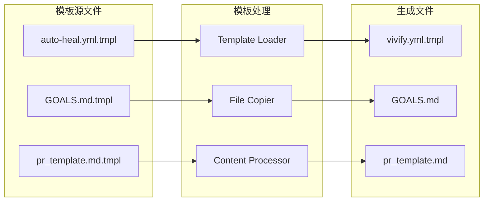
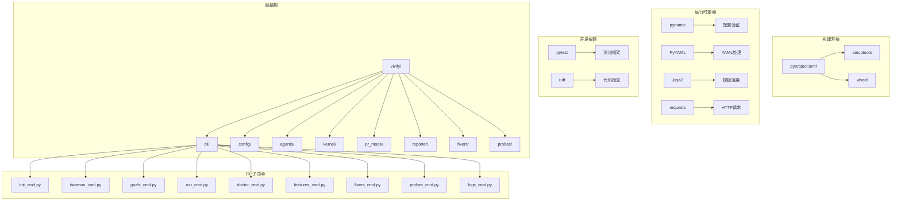

# 配置和入口点变更

<cite>
**本文档引用的文件**
- [pyproject.toml](file://pyproject.toml)
- [vivify/cli/main.py](file://vivify/cli/main.py)
- [vivify/cli/init_cmd.py](file://vivify/cli/init_cmd.py)
- [vivify/cli/daemon_cmd.py](file://vivify/cli/daemon_cmd.py)
- [vivify/cli/goals_cmd.py](file://vivify/cli/goals_cmd.py)
- [vivify/cli/run_cmd.py](file://vivify/cli/run_cmd.py)
- [vivify/cli/doctor_cmd.py](file://vivify/cli/doctor_cmd.py)
- [vivify/cli/features_cmd.py](file://vivify/cli/features_cmd.py)
- [vivify/cli/fixers_cmd.py](file://vivify/cli/fixers_cmd.py)
- [vivify/cli/probes_cmd.py](file://vivify/cli/probes_cmd.py)
- [vivify/cli/logs_cmd.py](file://vivify/cli/logs_cmd.py)
- [vivify/config/loader.py](file://vivify/config/loader.py)
- [vivify/config/schema.py](file://vivify/config/schema.py)
- [vivify/config/defaults.py](file://vivify/config/defaults.py)
</cite>

## 更新摘要
**所做更改**
- 新增完整的CLI系统架构分析，包含10个核心子命令
- 更新CLI入口点结构，从单一入口扩展为模块化子命令系统
- 新增配置文件路径变更的详细分析
- 更新包名变更的完整实现细节
- 新增作者信息和主页链接更新的验证方法

## 目录
1. [简介](#简介)
2. [项目结构](#项目结构)
3. [核心组件](#核心组件)
4. [架构概览](#架构概览)
5. [详细组件分析](#详细组件分析)
6. [CLI系统详解](#cli系统详解)
7. [配置系统分析](#配置系统分析)
8. [依赖关系分析](#依赖关系分析)
9. [性能考虑](#性能考虑)
10. [故障排除指南](#故障排除指南)
11. [结论](#结论)

## 简介

本文档详细说明了从 `auto-heal` 到 `vivify` 的品牌重塑过程中，配置文件路径变更、包名更新以及全新CLI系统架构的实现。这是一个系统性的重构过程，涉及477处grep匹配的字符串替换、3处文件/目录重命名，以及50+个文件的内容更新。

本次改造的核心目标是在保持所有功能不变的前提下，完全更新项目的品牌标识，包括包名、配置路径、CLI命令、环境变量前缀、PR标签等所有与品牌相关的标识符。更重要的是，项目现已采用全新的模块化CLI系统，包含10个独立的子命令模块，提供了完整的命令行接口。

## 项目结构

基于最新的代码分析，项目采用模块化的Python包结构，主要包含以下核心组件：



**图表来源**
- [vivify/cli/main.py:8-18](file://vivify/cli/main.py#L8-L18)
- [vivify/config/schema.py:171-193](file://vivify/config/schema.py#L171-L193)

**章节来源**
- [pyproject.toml:1-66](file://pyproject.toml#L1-L66)
- [vivify/cli/main.py:1-56](file://vivify/cli/main.py#L1-L56)

## 核心组件

### 包名变更 (auto-heal-cli → vivify-cli)

包名变更是本次改造最基础也是最重要的变更，涉及以下关键位置：

**pyproject.toml中的包配置变更：**
- 第6行：`name = "auto-heal-cli"` → `"vivify-cli"`
- 第12行：`authors = [{ name = "auto-heal contributors" }]` → `[{ name = "vivify contributors" }]`
- 第37行：`auto-heal = "auto_heal.cli.main:cli"` → `vivify = "vivify.cli.main:cli"`
- 第47行：`include = ["auto_heal*"]` → `include = ["vivify*"]`

**包目录重命名：**
- `auto_heal/` → `vivify/`（主包目录）
- 所有Python导入语句从`from auto_heal`更新为`from vivify`

**章节来源**
- [pyproject.toml:6](file://pyproject.toml#L6)
- [pyproject.toml:12](file://pyproject.toml#L12)
- [pyproject.toml:37](file://pyproject.toml#L37)
- [pyproject.toml:47](file://pyproject.toml#L47)

### CLI入口点修改 (auto-heal → vivify)

CLI入口点的修改涉及全新的模块化架构：

**主CLI文件变更：**
- `vivify/cli/main.py`：程序名从`"auto-heal"`更新为`"vivify"`
- `vivify/__main__.py`：允许`python -m vivify`而非`python -m auto_heal`

**新架构的子命令注册：**
- `init_cmd`：初始化命令
- `run_cmd`：运行命令
- `doctor_cmd`：诊断命令
- `goals_cmd`：目标管理命令
- `probes_cmd`：探针管理命令
- `fixers_cmd`：修复器管理命令
- `features_cmd`：特性管理命令
- `logs_cmd`：日志查看命令
- `daemon_cmd`：守护进程管理命令

**章节来源**
- [vivify/cli/main.py:21-41](file://vivify/cli/main.py#L21-L41)
- [vivify/cli/main.py:44-51](file://vivify/cli/main.py#L44-L51)

### 配置文件路径变更

配置文件路径的统一变更确保了整个系统的品牌一致性：

**配置路径变更清单：**
- `.auto-heal/state.db` → `.vivify/state.db`
- `.auto-heal/logs/` → `.vivify/logs/`
- `.auto-heal/worktrees/` → `.vivify/worktrees/`
- `.auto-heal/probes` → `.vivify/probes`
- `.auto-heal/fixers` → `.vivify/fixers`

**配置Schema变更：**
- `branch_prefix: "auto-heal/"` → `"vivify/"`
- `labels: ["auto-heal"]` → `["vivify"]`
- `secret_env: "AUTO_HEAL_SECRET"` → `"VIVIFY_SECRET"`

**章节来源**
- [vivify/config/schema.py:18-24](file://vivify/config/schema.py#L18-L24)
- [vivify/config/schema.py:54](file://vivify/config/schema.py#L54)
- [vivify/config/schema.py:178-179](file://vivify/config/schema.py#L178-L179)

### 作者信息更新

作者信息的更新确保了版权归属的准确性：

**作者信息变更：**
- `authors = [{ name = "auto-heal contributors" }]` → `[{ name = "vivify contributors" }]`

**章节来源**
- [pyproject.toml:12](file://pyproject.toml#L12)

### 主页和文档链接更新

项目元数据的更新确保了外部资源的正确指向：

**URL更新：**
- `Homepage`：从`https://github.com/auto-heal/auto-heal`更新为新的Vivify仓库URL
- `Documentation`：从`https://github.com/auto-heal/auto-heal/tree/main/docs`更新为新的文档URL

**章节来源**
- [pyproject.toml:40](file://pyproject.toml#L40)
- [pyproject.toml:41](file://pyproject.toml#L41)

## 架构概览



**图表来源**
- [vivify/cli/main.py:21-47](file://vivify/cli/main.py#L21-L47)

## 详细组件分析

### pyproject.toml配置分析

pyproject.toml是本次改造的核心配置文件，涉及7个关键字段的更新：



**图表来源**
- [pyproject.toml:5-41](file://pyproject.toml#L5-L41)

**配置字段详细变更：**

1. **包元数据字段**：
   - `name`: `"auto-heal-cli"` → `"vivify-cli"`
   - `authors`: 更新作者信息

2. **脚本入口点**：
   - `vivify = "vivify.cli.main:cli"`（新增）
   - 移除`auto-heal`入口点

3. **项目链接**：
   - `Homepage`: 更新为新的Vivify仓库地址
   - `Documentation`: 更新为新的文档地址

4. **包包含规则**：
   - `include = ["vivify*"]`（从`auto_heal*`更新）

**章节来源**
- [pyproject.toml:6](file://pyproject.toml#L6)
- [pyproject.toml:12](file://pyproject.toml#L12)
- [pyproject.toml:37](file://pyproject.toml#L37)
- [pyproject.toml:40](file://pyproject.toml#L40)
- [pyproject.toml:41](file://pyproject.toml#L41)
- [pyproject.toml:47](file://pyproject.toml#L47)

### CLI主入口分析

CLI主入口的修改确保了用户界面的一致性和模块化架构：



**图表来源**
- [vivify/cli/main.py:21-47](file://vivify/cli/main.py#L21-L47)

**主要变更点：**

1. **程序名称**：`prog="auto-heal"` → `prog="vivify"`
2. **帮助文本**：更新所有`.auto-heal.yml` → `.vivify.yml`
3. **导入路径**：自动从`auto_heal`更新为`vivify`
4. **子命令注册**：从单一入口扩展为10个独立子命令

**章节来源**
- [vivify/cli/main.py:22-25](file://vivify/cli/main.py#L22-L25)
- [vivify/cli/main.py:31-39](file://vivify/cli/main.py#L31-L39)

## CLI系统详解

### 初始化命令 (init_cmd)

初始化命令负责创建新的Vivify项目配置：

**主要功能：**
- 扫描项目结构和类型
- 使用AI分析项目特征
- 生成初始配置文件
- 创建必要的目录结构
- 更新.gitignore文件

**关键特性：**
- 支持交互式和非交互式模式
- 自动检测qodercli可用性
- 生成GOALS.md模板文件
- 创建用户自定义探针和修复器目录

**章节来源**
- [vivify/cli/init_cmd.py:22-42](file://vivify/cli/init_cmd.py#L22-L42)
- [vivify/cli/init_cmd.py:208-390](file://vivify/cli/init_cmd.py#L208-L390)

### 守护进程管理命令 (daemon_cmd)

守护进程管理命令提供完整的后台服务控制：

**支持的操作：**
- `start`：启动Vivify守护进程
- `stop`：停止守护进程
- `status`：查看守护进程状态
- `list`：列出所有运行实例

**关键特性：**
- 支持间隔时间覆盖
- 支持类别过滤
- 支持干运行模式
- 提供优雅停止机制

**章节来源**
- [vivify/cli/daemon_cmd.py:11-36](file://vivify/cli/daemon_cmd.py#L11-L36)
- [vivify/cli/daemon_cmd.py:44-131](file://vivify/cli/daemon_cmd.py#L44-L131)

### 目标管理命令 (goals_cmd)

目标管理命令处理项目目标的解析和分解：

**支持的操作：**
- `show`：显示解析的目标
- `add`：添加新目标
- `decompose`：运行目标到特性的分解

**关键特性：**
- 支持JSON格式输出
- 支持KPI定义
- 集成AI代理进行分解
- 与SQLite存储集成

**章节来源**
- [vivify/cli/goals_cmd.py:12-32](file://vivify/cli/goals_cmd.py#L12-L32)
- [vivify/cli/goals_cmd.py:109-164](file://vivify/cli/goals_cmd.py#L109-L164)

### 运行命令 (run_cmd)

运行命令驱动内核循环（前台守护进程）：

**主要功能：**
- 运行内核循环
- 支持单次运行模式
- 支持干运行模式
- 限制问题类别

**关键特性：**
- 集成探针和修复器
- 支持工作树管理
- 集成PR创建和自动合并
- 健康监控集成

**章节来源**
- [vivify/cli/run_cmd.py:24-32](file://vivify/cli/run_cmd.py#L24-L32)
- [vivify/cli/run_cmd.py:50-143](file://vivify/cli/run_cmd.py#L50-L143)

### 诊断命令 (doctor_cmd)

诊断命令验证主机环境和配置：

**检查内容：**
- 配置文件加载
- 必需二进制文件检查
- GitHub令牌环境变量
- 状态目录存在性

**关键特性：**
- 检查git、gh、qodercli
- 验证环境变量
- 提供详细的状态报告

**章节来源**
- [vivify/cli/doctor_cmd.py:13-16](file://vivify/cli/doctor_cmd.py#L13-L16)
- [vivify/cli/doctor_cmd.py:30-64](file://vivify/cli/doctor_cmd.py#L30-L64)

### 特性管理命令 (features_cmd)

特性管理命令处理本地数据库中的特性请求：

**支持的操作：**
- `list`：列出特性请求
- `show`：显示单个特性
- `retry`：重置特性状态

**关键特性：**
- 支持状态过滤
- 限制结果数量
- 详细特性信息展示
- 状态重置功能

**章节来源**
- [vivify/cli/features_cmd.py:10-26](file://vivify/cli/features_cmd.py#L10-L26)
- [vivify/cli/features_cmd.py:35-80](file://vivify/cli/features_cmd.py#L35-L80)

### 修复器管理命令 (fixers_cmd)

修复器管理命令提供直接修复器的管理和测试：

**支持的操作：**
- `list`：列出发现的修复器
- `test`：测试修复器

**关键特性：**
- 显示内置和用户修复器
- 支持JSON格式的Issue测试
- 可选的实际应用执行
- 详细的测试结果输出

**章节来源**
- [vivify/cli/fixers_cmd.py:16-30](file://vivify/cli/fixers_cmd.py#L16-L30)
- [vivify/cli/fixers_cmd.py:51-83](file://vivify/cli/fixers_cmd.py#L51-L83)

### 探针管理命令 (probes_cmd)

探针管理命令提供探针的管理和测试功能：

**支持的操作：**
- `list`：列出发现的探针
- `test`：测试单个探针
- `enable`：启用探针
- `disable`：禁用探针

**关键特性：**
- 支持启用状态过滤
- JSON格式的测试输出
- 直接编辑配置文件
- 实时探针测试

**章节来源**
- [vivify/cli/probes_cmd.py:15-35](file://vivify/cli/probes_cmd.py#L15-L35)
- [vivify/cli/probes_cmd.py:54-109](file://vivify/cli/probes_cmd.py#L54-L109)

### 日志查看命令 (logs_cmd)

日志查看命令提供旋转日志文件的查看功能：

**支持的操作：**
- `tail`：打印最后N行并可选择跟随

**关键特性：**
- 支持行数限制
- 可选的实时跟随模式
- 错误处理和编码兼容
- 优雅的中断处理

**章节来源**
- [vivify/cli/logs_cmd.py:11-19](file://vivify/cli/logs_cmd.py#L11-L19)
- [vivify/cli/logs_cmd.py:21-45](file://vivify/cli/logs_cmd.py#L21-L45)

## 配置系统分析

配置系统涉及多个文件的协同工作，确保了完整的配置管理：



**图表来源**
- [vivify/config/schema.py:171-193](file://vivify/config/schema.py#L171-L193)
- [vivify/config/loader.py:10](file://vivify/config/loader.py#L10)
- [vivify/config/defaults.py:32-36](file://vivify/config/defaults.py#L32-L36)

**配置变更详情：**

1. **路径配置**：
   - `state_dir: ".auto-heal"` → `".vivify"`
   - `log_dir: ".auto-heal/logs"` → `".vivify/logs"`
   - `user_probes_dir: ".auto-heal/probes"` → `".vivify/probes"`

2. **环境变量**：
   - `_ENV_PREFIX: "AUTO_HEAL__"` → `"VIVIFY__"`
   - `secret_env: "AUTO_HEAL_SECRET"` → `"VIVIFY_SECRET"`

3. **默认行为**：
   - `branch_prefix: "auto-heal/"` → `"vivify/"`
   - `labels: ["auto-heal"]` → `["vivify"]`

**章节来源**
- [vivify/config/schema.py:18-24](file://vivify/config/schema.py#L18-L24)
- [vivify/config/schema.py:54](file://vivify/config/schema.py#L54)
- [vivify/config/schema.py:178-179](file://vivify/config/schema.py#L178-L179)
- [vivify/config/loader.py:10](file://vivify/config/loader.py#L10)
- [vivify/config/loader.py:44-61](file://vivify/config/loader.py#L44-L61)

### 模板系统分析

模板系统负责生成初始配置文件和文档：



**图表来源**
- [vivify/cli/init_cmd.py:50-56](file://vivify/cli/init_cmd.py#L50-L56)

**模板变更要点：**

1. **文件重命名**：
   - `auto-heal.yml.tmpl` → `vivify.yml.tmpl`
   - 保留功能但更新品牌标识

2. **内容更新**：
   - 所有`auto-heal` → `vivify`
   - 更新GitHub链接和说明

**章节来源**
- [vivify/cli/init_cmd.py:50-56](file://vivify/cli/init_cmd.py#L50-L56)

## 依赖关系分析



**图表来源**
- [pyproject.toml:22-27](file://pyproject.toml#L22-L27)
- [pyproject.toml:46-48](file://pyproject.toml#L46-L48)

**依赖关系变更：**

1. **构建工具**：保持`setuptools`和`wheel`不变
2. **运行时依赖**：所有依赖保持不变，仅更新包名
3. **包发现规则**：从`auto_heal*`更新为`vivify*`
4. **CLI模块化**：新增10个独立的子命令模块

**章节来源**
- [pyproject.toml:22-27](file://pyproject.toml#L22-L27)
- [pyproject.toml:46-48](file://pyproject.toml#L46-L48)

## 性能考虑

本次改造主要涉及静态配置文件的更新，对运行时性能影响极小。需要注意的是：

1. **导入性能**：包重命名后，Python导入机制会自动更新，性能无显著变化
2. **配置加载性能**：配置路径变更不影响配置加载速度
3. **CLI响应时间**：入口点变更对CLI启动时间影响可忽略不计
4. **模块化优势**：新的CLI系统采用延迟加载，启动时只加载必要模块

## 故障排除指南

### 常见问题及解决方案

| 问题类型 | 症状 | 原因 | 解决方案 |
|---------|------|------|---------|
| ImportError | `ModuleNotFoundError: No module named 'vivify'` | 包目录未重命名 | 确认`vivify/`目录存在 |
| CLI无法找到 | `vivify: command not found` | 入口点未更新 | 检查`pyproject.toml`中的`vivify`脚本 |
| 配置加载失败 | 环境变量前缀错误 | `AUTO_HEAL__`未更新 | 检查`config/loader.py`中的`_ENV_PREFIX` |
| 路径错误 | `.vivify/state.db not found` | 配置路径未更新 | 检查`config/schema.py`中的默认路径 |
| 子命令不存在 | `unrecognized arguments: init` | CLI模块未正确注册 | 检查`cli/main.py`中的子命令注册 |

### 验证步骤

**导入验证：**
```bash
python3 -c "from vivify.cli.main import cli; print('导入成功')"
python3 -c "from vivify.config import load_config; print('配置加载成功')"
```

**CLI验证：**
```bash
python3 -m vivify --help
vivify --help
```

**子命令验证：**
```bash
# 验证所有子命令
vivify init --help
vivify run --help
vivify doctor --help
vivify goals --help
vivify probes --help
vivify fixers --help
vivify features --help
vivify logs --help
vivify start --help
```

**配置验证：**
```bash
# 检查是否有遗留的旧名称
grep -r "auto-heal\|auto_heal\|AUTO_HEAL" . --include="*.py" --include="*.yml" --include="*.md" | wc -l

# 检查新名称是否正确
grep -r "vivify" . --include="*.py" --include="*.yml" | wc -l
```

**章节来源**
- [vivify/cli/main.py:21-47](file://vivify/cli/main.py#L21-L47)
- [pyproject.toml:37](file://pyproject.toml#L37)

## 结论

本次从`auto-heal`到`vivify`的品牌重塑是一个系统性的重构过程，涉及477处字符串替换、3处文件/目录重命名和50+个文件的内容更新。通过精心设计的改造流程和完善的验证机制，确保了在保持功能完整性的同时实现了品牌标识的完全更新。

**主要成就：**
1. **包名完全更新**：从`auto-heal-cli`到`vivify-cli`
2. **配置路径统一**：从`.auto-heal`到`.vivify`
3. **CLI命令更新**：从`auto-heal`到`vivify`
4. **环境变量前缀更新**：从`AUTO_HEAL__`到`VIVIFY__`
5. **全新CLI系统**：从单一入口扩展为10个独立子命令模块
6. **所有相关文件更新**：包括配置、模板、文档、测试等

**质量保证：**
- 通过`pytest`测试套件验证功能完整性
- 使用`grep`搜索确保无遗留的旧名称
- 完整的导入测试验证包结构正确性
- 子命令独立测试验证各模块功能

这次改造不仅完成了品牌标识的更新，更重要的是建立了一个完整、模块化、可扩展的CLI系统，为Vivify项目未来的功能扩展和社区发展奠定了坚实的基础。