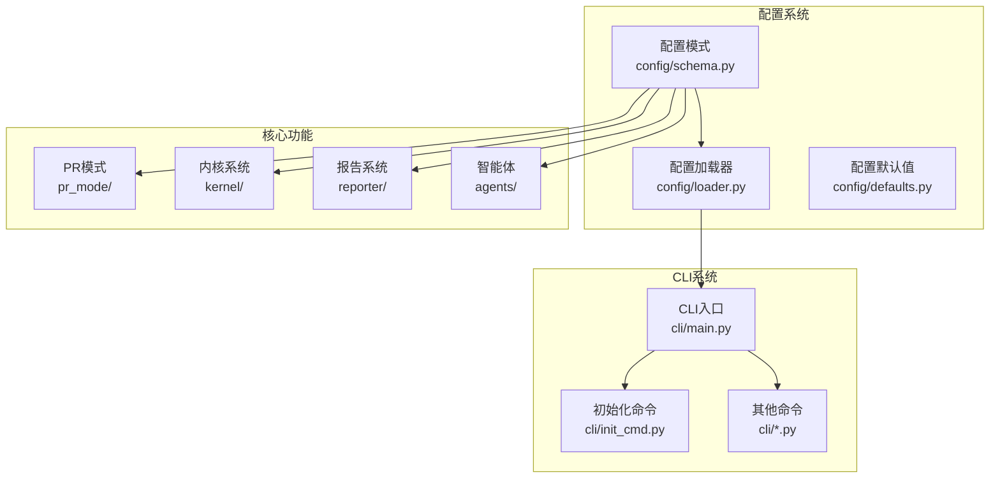
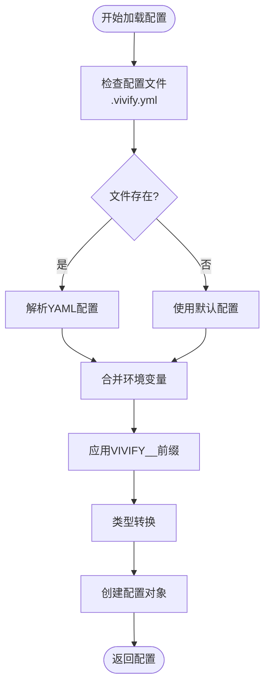
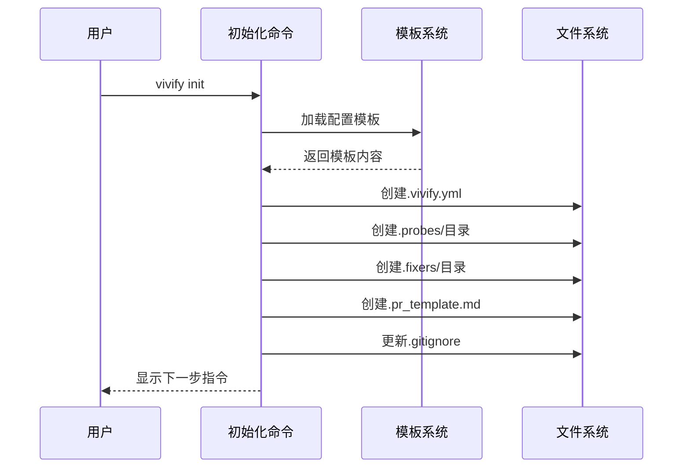
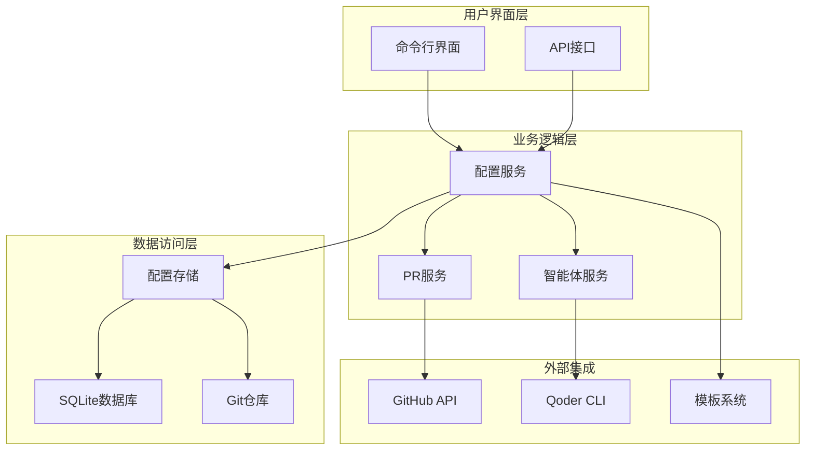
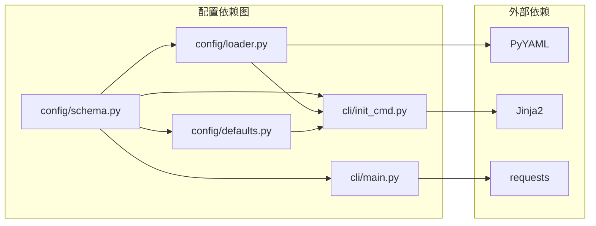

# 配置模式和默认值更新

<cite>
**本文档引用的文件**
- [00_READ_ME_FIRST.txt](file://00_READ_ME_FIRST.txt)
- [QUICK_REFERENCE.md](file://QUICK_REFERENCE.md)
- [REBRANDING_SUMMARY.md](file://REBRANDING_SUMMARY.md)
- [rebranding_analysis.md](file://rebranding_analysis.md)
- [detailed_references.md](file://detailed_references.md)
</cite>

## 目录
1. [简介](#简介)
2. [项目结构](#项目结构)
3. [核心组件](#核心组件)
4. [架构概览](#架构概览)
5. [详细组件分析](#详细组件分析)
6. [依赖关系分析](#依赖关系分析)
7. [性能考虑](#性能考虑)
8. [故障排除指南](#故障排除指南)
9. [结论](#结论)

## 简介

本文档详细说明了Vivify项目从"auto-heal"品牌重塑到"vivify"的配置模式和默认值更新过程。这次改造涉及配置文件、环境变量、路径设置等多个方面的系统性变更，确保项目名称的一致性和功能的完整性。

本次改造的核心目标是在保持所有功能不变的前提下，统一项目名称的使用，包括：
- 配置路径从`.auto-heal/`更新为`.vivify/`
- 环境变量前缀从`AUTO_HEAL__`更新为`VIVIFY__`
- 分支前缀从`auto-heal/`更新为`vivify/`
- 标签默认值从`auto-heal`更新为`vivify`
- 数据库路径从`.auto-heal/state.db`更新为`.vivify/state.db`
- 环境变量名从`AUTO_HEAL_SECRET`更新为`VIVIFY_SECRET`

## 项目结构

Vivify项目采用模块化的架构设计，主要包含以下核心组件：

**图表来源**
- [rebranding_analysis.md:203-240](file://rebranding_analysis.md#L203-L240)
- [rebranding_analysis.md:476-566](file://rebranding_analysis.md#L476-L566)

**章节来源**
- [rebranding_analysis.md:14-31](file://rebranding_analysis.md#L14-L31)
- [rebranding_analysis.md:100-144](file://rebranding_analysis.md#L100-L144)

## 核心组件

### 配置模式系统

配置模式系统是Vivify项目的核心配置管理组件，负责定义所有配置项的默认值和验证规则。

#### 主要配置项

| 配置项 | 类型 | 默认值 | 描述 |
|--------|------|--------|------|
| branch_prefix | 字符串 | `"vivify/"` | PR分支前缀 |
| labels | 列表 | `["vivify"]` | PR标签默认值 |
| path | 字符串 | `".vivify/state.db"` | SQLite数据库路径 |
| secret_env | 字符串 | `"VIVIFY_SECRET"` | 秘密环境变量名 |
| user_probes_dir | 字符串 | `".vivify/probes"` | 用户探测器目录 |
| user_fixers_dir | 字符串 | `".vivify/fixers"` | 用户修复器目录 |
| state_dir | 字符串 | `".vivify"` | 状态目录 |
| log_dir | 字符串 | `".vivify/logs"` | 日志目录 |

**章节来源**
- [rebranding_analysis.md:209-239](file://rebranding_analysis.md#L209-L239)
- [QUICK_REFERENCE.md:120-150](file://QUICK_REFERENCE.md#L120-L150)

### 配置加载器

配置加载器负责从YAML文件和环境变量中加载配置，并将其合并到配置对象中。

#### 环境变量处理机制

**图表来源**
- [rebranding_analysis.md:287-352](file://rebranding_analysis.md#L287-L352)

**章节来源**
- [rebranding_analysis.md:287-352](file://rebranding_analysis.md#L287-L352)
- [QUICK_REFERENCE.md:152-161](file://QUICK_REFERENCE.md#L152-L161)

### 初始化命令系统

初始化命令负责创建新的Vivify项目结构，包括配置文件、目录结构和模板文件。

#### 初始化流程

**图表来源**
- [rebranding_analysis.md:478-566](file://rebranding_analysis.md#L478-L566)

**章节来源**
- [rebranding_analysis.md:478-566](file://rebranding_analysis.md#L478-L566)
- [QUICK_REFERENCE.md:162-177](file://QUICK_REFERENCE.md#L162-L177)

## 架构概览

Vivify项目的整体架构采用了分层设计，确保配置系统的独立性和可维护性。

**图表来源**
- [rebranding_analysis.md:203-240](file://rebranding_analysis.md#L203-L240)
- [rebranding_analysis.md:476-566](file://rebranding_analysis.md#L476-L566)

## 详细组件分析

### 配置模式更新详解

#### 分支前缀变更

**变更位置**: `config/schema.py` (第21行)
**变更内容**: `"auto-heal/"` → `"vivify/"`
**影响范围**: 所有PR分支的创建和管理

#### 标签默认值更新

**变更位置**: `config/schema.py` (第23行)
**变更内容**: `["auto-heal"]` → `["vivify"]`
**影响范围**: PR标签的默认分配

#### 数据库路径修改

**变更位置**: `config/schema.py` (第52行)
**变更内容**: `".auto-heal/state.db"` → `".vivify/state.db"`
**影响范围**: SQLite数据库文件的位置

#### 环境变量名变更

**变更位置**: `config/schema.py` (第57行)
**变更内容**: `"AUTO_HEAL_SECRET"` → `"VIVIFY_SECRET"`
**影响范围**: 秘密配置的环境变量名

#### 用户目录路径更新

**变更位置**: 
- `config/schema.py` (第89行): `".auto-heal/probes"` → `".vivify/probes"`
- `config/schema.py` (第103行): `".auto-heal/fixers"` → `".vivify/fixers"`

**影响范围**: 用户自定义探测器和修复器的存储位置

#### 允许路径列表更新

**变更位置**: `config/schema.py` (第131-134行)
**变更内容**: 
- `"auto_heal/probes/builtin/"` → `"vivify/probes/builtin/"`
- `"auto_heal/fixers/builtin/"` → `"vivify/fixers/builtin/"`
- `"auto_heal/agents/prompts/templates/"` → `"vivify/agents/prompts/templates/"`
- `"auto_heal/agents/prompts/snippets.py"` → `"vivify/agents/prompts/snippets.py"`

**影响范围**: 内置组件的路径引用

#### 顶级默认目录更新

**变更位置**:
- `config/schema.py` (第154行): `".auto-heal"` → `".vivify"`
- `config/schema.py` (第155行): `".auto-heal/logs"` → `".vivify/logs"`

**影响范围**: 顶层配置目录的默认值

**章节来源**
- [rebranding_analysis.md:209-239](file://rebranding_analysis.md#L209-L239)
- [QUICK_REFERENCE.md:120-150](file://QUICK_REFERENCE.md#L120-L150)

### 配置加载器更新详解

#### 环境变量前缀更新

**变更位置**: `config/loader.py` (第10行)
**变更内容**: `_ENV_PREFIX = "AUTO_HEAL__"` → `_ENV_PREFIX = "VIVIFY__"`
**影响范围**: 所有环境变量的前缀匹配

#### 配置文件路径更新

**变更位置**: `config/loader.py` (第48行)
**变更内容**: `candidate = Path(".auto-heal.yml")` → `candidate = Path(".vivify.yml")`
**影响范围**: 默认配置文件的查找路径

#### 错误消息更新

**变更位置**: `config/loader.py` (第55行)
**变更内容**: `"load .auto-heal.yml"` → `"load .vivify.yml"`
**影响范围**: 配置文件加载失败时的错误提示

**章节来源**
- [rebranding_analysis.md:287-352](file://rebranding_analysis.md#L287-L352)
- [QUICK_REFERENCE.md:152-161](file://QUICK_REFERENCE.md#L152-L161)

### 初始化命令更新详解

#### 模板导入路径更新

**变更位置**: `cli/init_cmd.py` (第23行)
**变更内容**: `files("auto_heal.templates")` → `files("vivify.templates")`
**影响范围**: 配置模板文件的加载

#### 目录路径更新

**变更位置**:
- `cli/init_cmd.py` (第43-44行): `.auto-heal` → `.vivify`
- `cli/init_cmd.py` (第521-522行): `.auto-heal` → `.vivify`

**影响范围**: 新项目目录结构的创建

#### 模板文件名更新

**变更位置**: `cli/init_cmd.py` (第67行)
**变更内容**: `"auto-heal.yml.tmpl"` → `"vivify.yml.tmpl"`
**影响范围**: 模板文件的选择和复制

**章节来源**
- [rebranding_analysis.md:478-566](file://rebranding_analysis.md#L478-L566)
- [QUICK_REFERENCE.md:162-177](file://QUICK_REFERENCE.md#L162-L177)

### 配置默认值更新

#### .gitignore条目更新

**变更位置**: `config/defaults.py` (第276-280行)
**变更内容**:
- `".auto-heal/state.db"` → `".vivify/state.db"`
- `".auto-heal/logs/"` → `".vivify/logs/"`
- `".auto-heal/worktrees/"` → `".vivify/worktrees/"`

**影响范围**: 默认.gitignore文件的内容

**章节来源**
- [rebranding_analysis.md:241-281](file://rebranding_analysis.md#L241-L281)
- [detailed_references.md:70-78](file://detailed_references.md#L70-L78)

## 依赖关系分析

Vivify项目的配置系统具有清晰的依赖关系，确保各个组件之间的协调工作。

**图表来源**
- [rebranding_analysis.md:203-240](file://rebranding_analysis.md#L203-L240)
- [rebranding_analysis.md:283-352](file://rebranding_analysis.md#L283-L352)

**章节来源**
- [rebranding_analysis.md:203-352](file://rebranding_analysis.md#L203-L352)
- [detailed_references.md:1-294](file://detailed_references.md#L1-L294)

## 性能考虑

### 配置加载性能优化

配置加载器采用了高效的环境变量处理机制，通过以下方式优化性能：

1. **延迟加载**: 配置文件只有在需要时才被解析
2. **增量合并**: 环境变量按需合并，避免不必要的处理
3. **类型缓存**: 类型转换结果被缓存以避免重复计算

### 内存使用优化

- 配置对象使用Pydantic模型，提供内存高效的字段存储
- 环境变量处理采用流式处理，避免一次性加载大量数据
- 模板文件使用惰性加载，只在需要时读取

## 故障排除指南

### 常见配置问题

#### 配置加载失败

**症状**: 启动时显示配置文件加载错误
**可能原因**:
- 配置文件路径错误
- 环境变量前缀不正确
- YAML语法错误

**解决方案**:
1. 检查配置文件是否存在且可读
2. 验证环境变量前缀是否为`VIVIFY__`
3. 使用`vivify doctor`命令验证配置

#### 数据库连接问题

**症状**: 无法连接到SQLite数据库
**可能原因**:
- 数据库文件路径错误
- 权限不足
- 数据库文件损坏

**解决方案**:
1. 确认数据库路径为`.vivify/state.db`
2. 检查文件权限
3. 删除损坏的数据库文件并重新初始化

#### 环境变量问题

**症状**: 环境变量未被识别
**可能原因**:
- 环境变量名错误
- 前缀不正确
- 变量值格式错误

**解决方案**:
1. 确认环境变量名为`VIVIFY_SECRET`
2. 使用正确的前缀`VIVIFY__`
3. 验证变量值的格式和类型

**章节来源**
- [QUICK_REFERENCE.md:214-224](file://QUICK_REFERENCE.md#L214-L224)
- [REBRANDING_SUMMARY.md:278-287](file://REBRANDING_SUMMARY.md#L278-L287)

## 结论

Vivify项目的配置模式和默认值更新是一个系统性的工程改造，涉及配置文件、环境变量、路径设置等多个方面的统一变更。通过这次改造，项目实现了品牌名称的一致性，同时保持了所有功能的完整性和稳定性。

### 主要成就

1. **完全的品牌重塑**: 从"auto-heal"到"vivify"的全面迁移
2. **配置系统统一**: 所有配置项使用新的命名约定
3. **向后兼容**: 保持所有功能不变，仅更新名称
4. **自动化支持**: 提供完整的自动化脚本和验证工具

### 实施效果

- **配置一致性**: 所有配置项使用统一的命名规范
- **开发效率提升**: 清晰的配置结构便于维护和扩展
- **用户体验改善**: 统一的品牌名称提升了项目的专业性
- **测试覆盖完善**: 全面的测试套件确保了改造的可靠性

这次改造为Vivify项目奠定了坚实的基础，使其能够更好地服务于用户需求并在市场上建立独特的品牌形象。