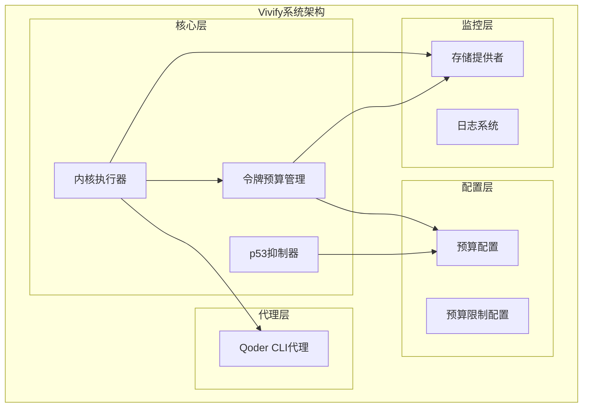
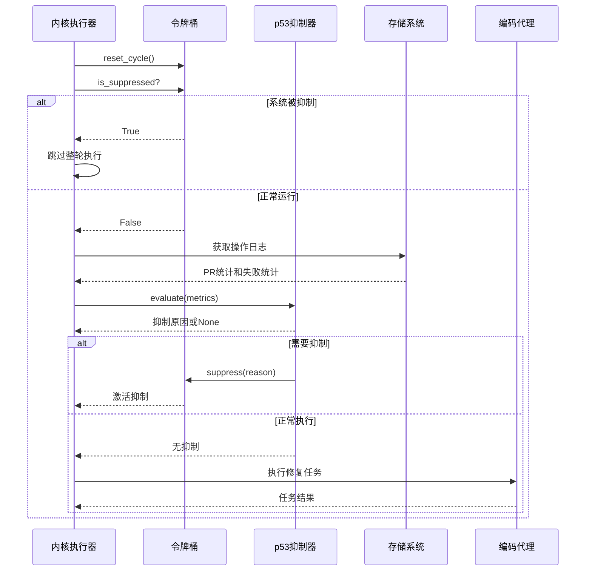
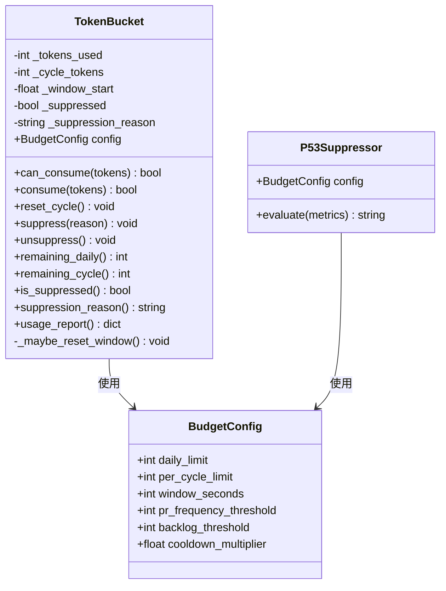
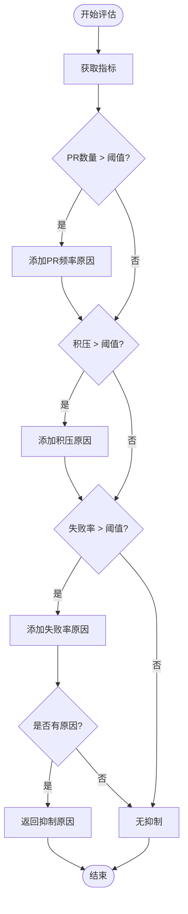
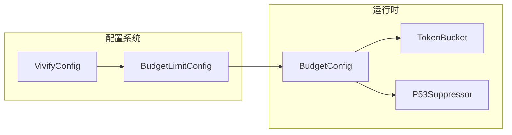
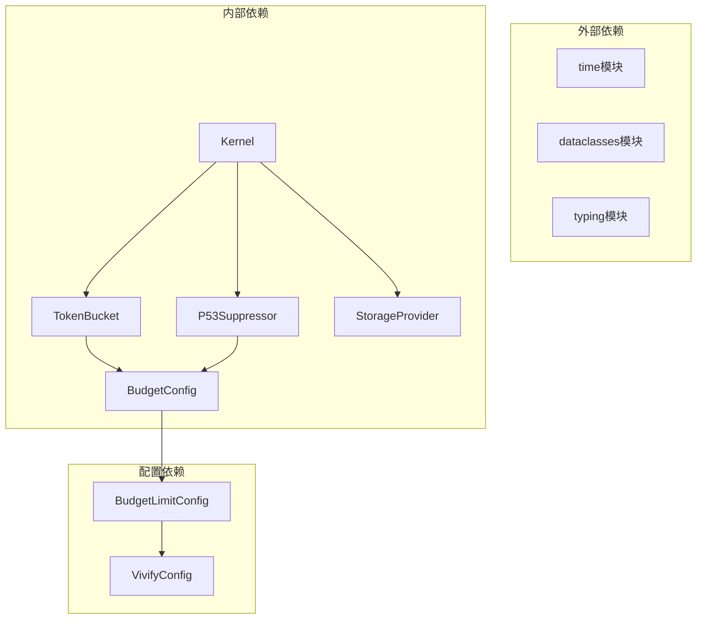

# 令牌预算管理系统

<cite>
**本文档引用的文件**
- [vivify/kernel/token_budget.py](file://vivify/kernel/token_budget.py)
- [tests/unit/test_token_budget.py](file://tests/unit/test_token_budget.py)
- [vivify/kernel/loop.py](file://vivify/kernel/loop.py)
- [vivify/config/schema.py](file://vivify/config/schema.py)
- [vivify/agents/qodercli_agent.py](file://vivify/agents/qodercli_agent.py)
- [README.md](file://README.md)
- [ROADMAP_LIVING_SYSTEM.md](file://ROADMAP_LIVING_SYSTEM.md)
</cite>

## 目录
1. [简介](#简介)
2. [项目结构](#项目结构)
3. [核心组件](#核心组件)
4. [架构概览](#架构概览)
5. [详细组件分析](#详细组件分析)
6. [依赖关系分析](#依赖关系分析)
7. [性能考虑](#性能考虑)
8. [故障排除指南](#故障排除指南)
9. [结论](#结论)

## 简介

令牌预算管理系统是 Vivify 项目中的一个关键安全机制，旨在防止系统过度增殖和资源滥用。该系统实现了双重防护机制：

1. **硬限制（TokenBucket）**：绝对的每日和每轮循环调用上限，无法被突破
2. **智能减速（P53Suppressor）**：检测过度增殖信号（过多的PR、深积压、高失败率），在达到硬限制之前主动抑制活动

这个系统的设计灵感来源于生物学中的p53蛋白机制，当检测到DNA损伤积累时会阻止细胞分裂。在Vivify中，当操作信号表明系统正在失控时，会主动停止活动。

## 项目结构

Vivify是一个多层次的智能系统，令牌预算管理位于核心执行层：

**图表来源**
- [vivify/kernel/token_budget.py:1-162](file://vivify/kernel/token_budget.py#L1-L162)
- [vivify/kernel/loop.py:268-290](file://vivify/kernel/loop.py#L268-L290)

**章节来源**
- [README.md:29-68](file://README.md#L29-L68)
- [ROADMAP_LIVING_SYSTEM.md:220-241](file://ROADMAP_LIVING_SYSTEM.md#L220-L241)

## 核心组件

### 预算配置（BudgetConfig）

预算配置类提供了令牌预算系统的核心参数设置：

- **daily_limit**：每日API调用硬限（默认100次）
- **per_cycle_limit**：每轮循环最大调用数（默认10次）
- **window_seconds**：时间窗口（默认86400秒，即24小时）
- **pr_frequency_threshold**：24小时内PR数超过此值触发降频（默认10）
- **backlog_threshold**：待处理特性请求积压超过此值触发降频（默认20）
- **cooldown_multiplier**：降频时循环间隔倍增系数（默认2.0）

### 令牌桶（TokenBucket）

令牌桶实现了硬限制机制：

- **每日限制**：跟踪24小时内的总使用量
- **每轮限制**：跟踪每次循环的使用量
- **自动重置**：当时间窗口结束时自动重置计数器
- **抑制机制**：当达到硬限制时激活p53抑制

### p53抑制器（P53Suppressor）

p53抑制器实现了智能减速机制：

- **PR频率检测**：监控24小时内创建的PR数量
- **积压检测**：监控待处理的特性请求数量
- **失败率检测**：监控24小时内失败修复的数量
- **主动抑制**：在达到硬限制之前主动降低活跃度

**章节来源**
- [vivify/kernel/token_budget.py:17-28](file://vivify/kernel/token_budget.py#L17-L28)
- [vivify/kernel/token_budget.py:30-114](file://vivify/kernel/token_budget.py#L30-L114)
- [vivify/kernel/token_budget.py:116-161](file://vivify/kernel/token_budget.py#L116-L161)

## 架构概览

令牌预算管理系统在整个Vivify架构中的位置如下：

**图表来源**
- [vivify/kernel/loop.py:669-717](file://vivify/kernel/loop.py#L669-L717)
- [vivify/kernel/loop.py:719-760](file://vivify/kernel/loop.py#L719-L760)

**章节来源**
- [vivify/kernel/loop.py:268-290](file://vivify/kernel/loop.py#L268-L290)
- [vivify/config/schema.py:258-267](file://vivify/config/schema.py#L258-L267)

## 详细组件分析

### 令牌桶类分析

**图表来源**
- [vivify/kernel/token_budget.py:17-114](file://vivify/kernel/token_budget.py#L17-L114)
- [vivify/kernel/token_budget.py:116-161](file://vivify/kernel/token_budget.py#L116-L161)

#### 令牌桶核心方法

**can_consume方法**：
- 检查时间窗口是否需要重置
- 如果系统被抑制，直接返回False
- 检查是否超过每日限制
- 检查是否超过每轮限制
- 返回是否可以消耗令牌

**consume方法**：
- 调用can_consume进行验证
- 如果允许，增加使用的令牌数
- 返回消费结果

**reset_cycle方法**：
- 在每轮开始时重置每轮计数器
- 允许新的API调用

#### p53抑制器评估逻辑

**图表来源**
- [vivify/kernel/token_budget.py:127-158](file://vivify/kernel/token_budget.py#L127-L158)

**章节来源**
- [vivify/kernel/token_budget.py:45-62](file://vivify/kernel/token_budget.py#L45-L62)
- [vivify/kernel/token_budget.py:127-158](file://vivify/kernel/token_budget.py#L127-L158)

### 内核集成分析

令牌预算管理系统在内核中的集成方式：

1. **初始化阶段**：内核创建令牌桶和p53抑制器实例
2. **每轮开始**：重置每轮计数器
3. **运行检查**：如果被抑制，跳过整轮执行
4. **结束评估**：收集指标并评估p53抑制

**章节来源**
- [vivify/kernel/loop.py:268-290](file://vivify/kernel/loop.py#L268-L290)
- [vivify/kernel/loop.py:669-717](file://vivify/kernel/loop.py#L669-L717)
- [vivify/kernel/loop.py:719-760](file://vivify/kernel/loop.py#L719-L760)

### 配置系统集成

预算配置通过配置系统进行管理：

**图表来源**
- [vivify/config/schema.py:258-267](file://vivify/config/schema.py#L258-L267)
- [vivify/config/schema.py:386-390](file://vivify/config/schema.py#L386-L390)

**章节来源**
- [vivify/config/schema.py:258-267](file://vivify/config/schema.py#L258-L267)
- [vivify/config/schema.py:386-390](file://vivify/config/schema.py#L386-L390)

## 依赖关系分析

令牌预算管理系统的主要依赖关系：

**图表来源**
- [vivify/kernel/token_budget.py:10-14](file://vivify/kernel/token_budget.py#L10-L14)
- [vivify/kernel/loop.py:68-76](file://vivify/kernel/loop.py#L68-L76)

**章节来源**
- [vivify/kernel/token_budget.py:10-14](file://vivify/kernel/token_budget.py#L10-L14)
- [vivify/kernel/loop.py:68-76](file://vivify/kernel/loop.py#L68-L76)

## 性能考虑

### 时间复杂度分析

- **令牌桶操作**：O(1) - 所有操作都是常数时间
- **p53评估**：O(n) - n为操作日志数量，通常限制在200条以内
- **内存使用**：O(1) - 使用固定大小的数据结构

### 优化策略

1. **批量操作**：在内核中批量重置计数器
2. **缓存机制**：缓存最近的评估结果
3. **异步处理**：p53评估可以在后台进行
4. **配置优化**：根据项目规模调整阈值

## 故障排除指南

### 常见问题及解决方案

**问题1：系统被意外抑制**
- 检查PR频率是否过高
- 查看积压的特性请求数量
- 检查失败修复率是否异常

**问题2：令牌桶计数异常**
- 确认时间窗口设置是否正确
- 检查系统时间是否准确
- 验证每日重置逻辑

**问题3：配置不生效**
- 检查配置文件格式
- 验证环境变量覆盖
- 确认配置加载顺序

**章节来源**
- [tests/unit/test_token_budget.py:87-103](file://tests/unit/test_token_budget.py#L87-L103)
- [tests/unit/test_token_budget.py:182-187](file://tests/unit/test_token_budget.py#L182-L187)

### 调试技巧

1. **查看使用报告**：使用`usage_report()`获取当前使用情况
2. **监控日志**：关注p53抑制相关的警告信息
3. **测试边界条件**：验证阈值边界行为
4. **模拟负载**：创建测试场景验证系统行为

**章节来源**
- [vivify/kernel/token_budget.py:96-106](file://vivify/kernel/token_budget.py#L96-L106)
- [tests/unit/test_token_budget.py:114-133](file://tests/unit/test_token_budget.py#L114-L133)

## 结论

令牌预算管理系统是Vivify项目中实现可持续增长的关键机制。通过双重防护机制，系统能够在保证功能完整性的同时防止过度增殖和资源滥用。

### 主要优势

1. **双重安全保障**：硬限制和智能减速相结合
2. **生物启发设计**：借鉴p53机制的自然防护原理
3. **可配置性**：支持根据项目需求调整阈值
4. **透明监控**：提供详细的使用报告和日志

### 设计原则

- **生存优先**：系统安全永远优先于功能实现
- **价值导向**：只在产生实际价值时才继续增长
- **可逆性**：所有变更都必须是可回滚的
- **人类可控**：最终决策权始终掌握在人类手中

这个系统体现了Vivify项目的核心理念——成为项目自身的"活体系统"，既能自主进化，又不会失去控制。