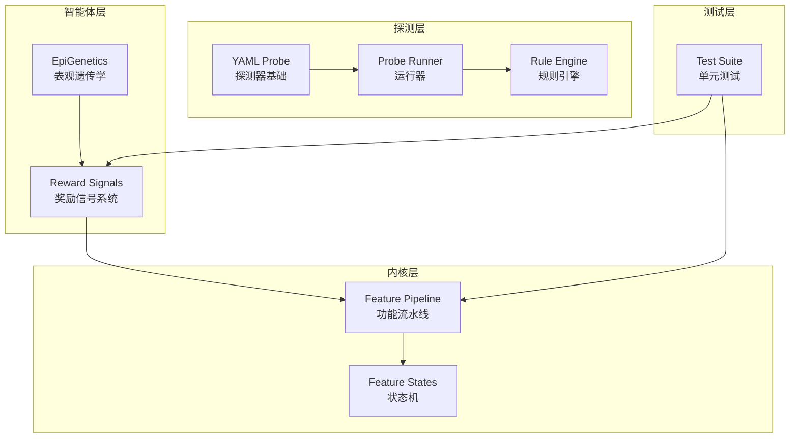
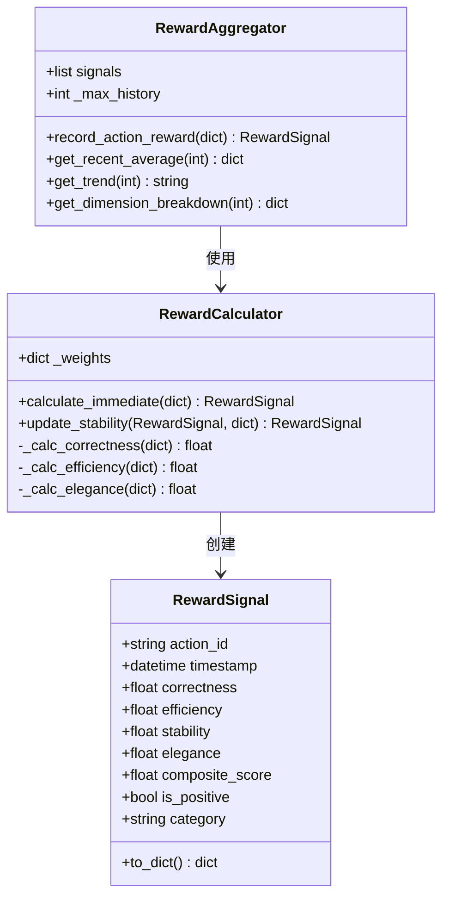
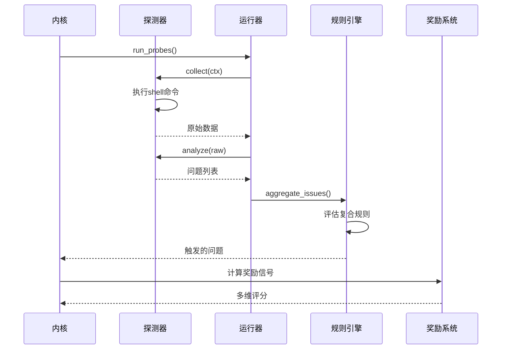
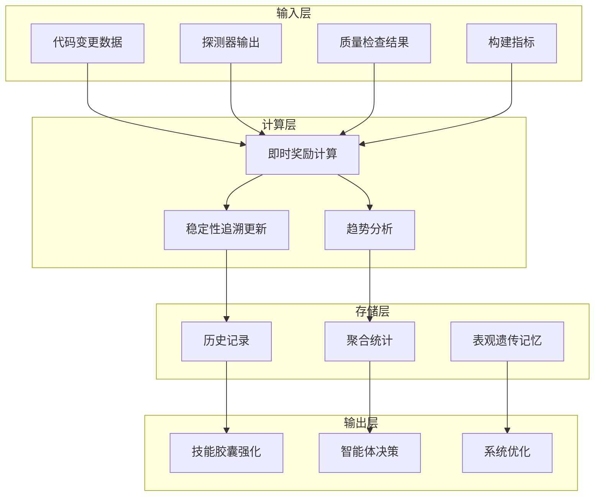
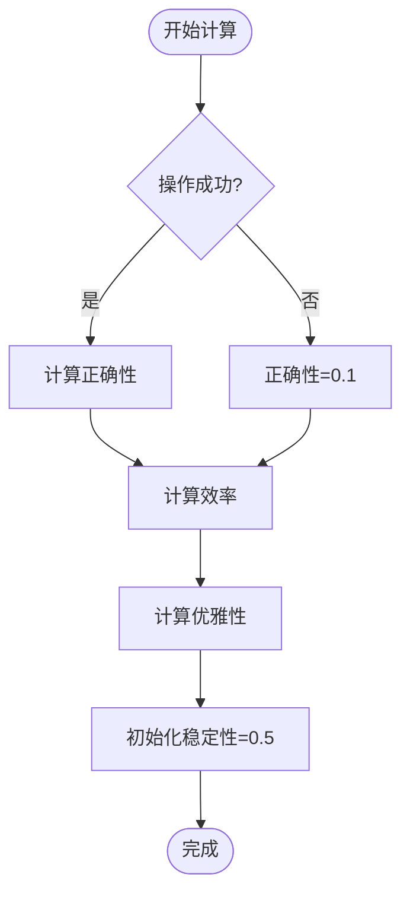
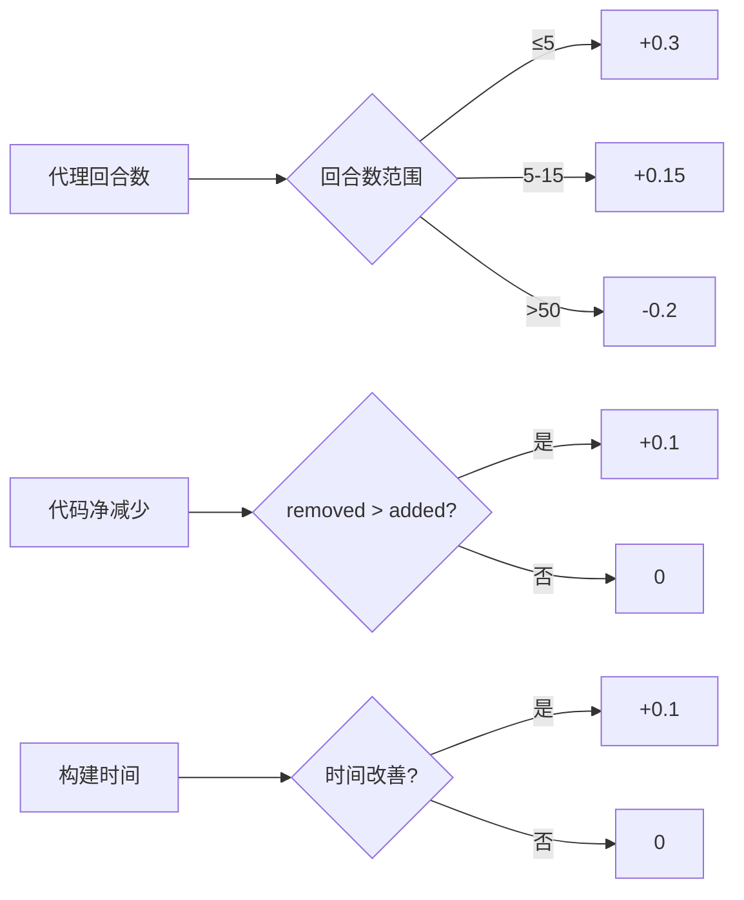
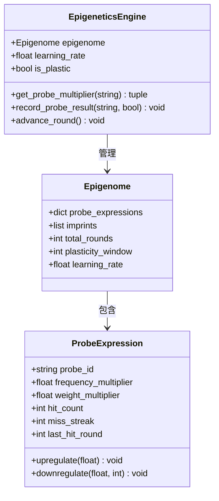
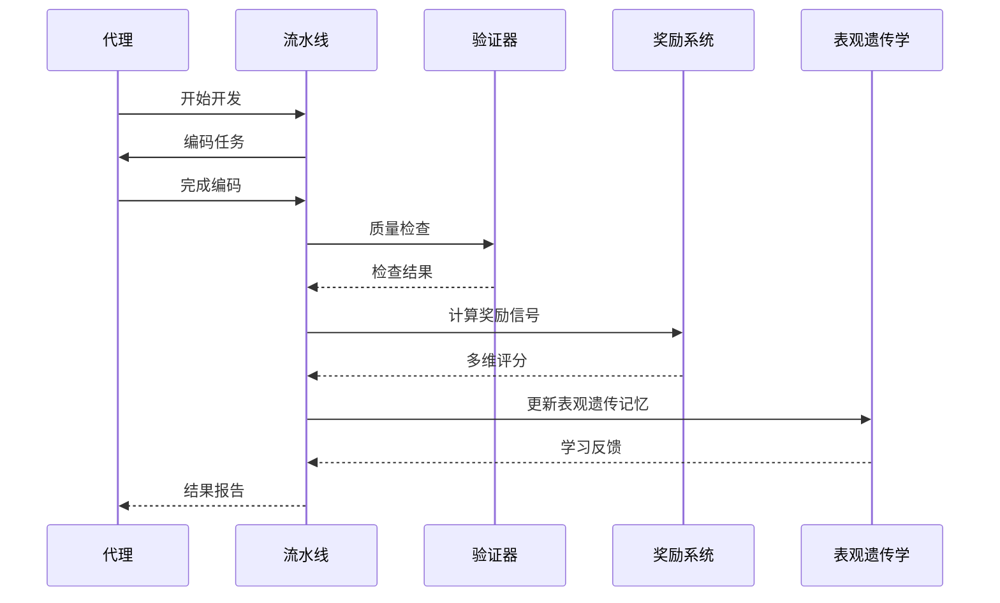
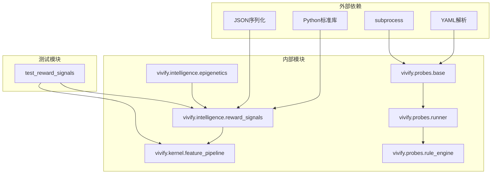

# 多模态奖励信号系统

<cite>
**本文档引用的文件**
- [reward_signals.py](file://vivify/intelligence/reward_signals.py)
- [feature_pipeline.py](file://vivify/kernel/feature_pipeline.py)
- [feature_states.py](file://vivify/kernel/feature_states.py)
- [epigenetics.py](file://vivify/intelligence/epigenetics.py)
- [base.py](file://vivify/probes/base.py)
- [runner.py](file://vivify/probes/runner.py)
- [rule_engine.py](file://vivify/probes/rule_engine.py)
- [test_reward_signals.py](file://tests/unit/test_reward_signals.py)
- [.vivify.example.yml](file://.vivify.example.yml)
- [test_coverage.yml](file://vivify/probes/builtin/test_coverage.yml)
</cite>

## 目录
1. [简介](#简介)
2. [项目结构](#项目结构)
3. [核心组件](#核心组件)
4. [架构概览](#架构概览)
5. [详细组件分析](#详细组件分析)
6. [依赖关系分析](#依赖关系分析)
7. [性能考虑](#性能考虑)
8. [故障排除指南](#故障排除指南)
9. [结论](#结论)

## 简介

多模态奖励信号系统是Vivify智能体的核心反馈机制，通过量化的方式为学习循环提供多维度的反馈信号。该系统实现了四维奖励计算模型：

- **正确性 (Correctness 40%)** - 测试/静态检查改进
- **效率 (Efficiency 20%)** - 构建时间、代码减少、代理回合数  
- **稳定性 (Stability 25%)** - 回归检测的追溯性评估
- **优雅性 (Elegance 15%)** - 代码质量指标

系统采用"即时计算 + 追溯更新"的双重机制，在每次修复/开发操作后立即提供即时反馈，并在后续时间点进行稳定性验证。

## 项目结构



**图表来源**
- [reward_signals.py:1-373](file://vivify/intelligence/reward_signals.py#L1-L373)
- [feature_pipeline.py:1-800](file://vivify/kernel/feature_pipeline.py#L1-L800)
- [epigenetics.py:1-309](file://vivify/intelligence/epigenetics.py#L1-L309)

**章节来源**
- [reward_signals.py:1-373](file://vivify/intelligence/reward_signals.py#L1-L373)
- [feature_pipeline.py:1-800](file://vivify/kernel/feature_pipeline.py#L1-L800)

## 核心组件

### 奖励信号数据模型

奖励信号系统的核心是`RewardSignal`数据类，它封装了单次操作后的多维反馈信息：



**图表来源**
- [reward_signals.py:28-373](file://vivify/intelligence/reward_signals.py#L28-L373)

### 探测器系统集成

探测器系统为奖励信号提供多模态输入数据：



**图表来源**
- [runner.py:32-85](file://vivify/probes/runner.py#L32-L85)
- [base.py:210-308](file://vivify/probes/base.py#L210-L308)
- [rule_engine.py:95-176](file://vivify/probes/rule_engine.py#L95-L176)

**章节来源**
- [reward_signals.py:28-373](file://vivify/intelligence/reward_signals.py#L28-L373)
- [base.py:177-335](file://vivify/probes/base.py#L177-L335)
- [runner.py:32-85](file://vivify/probes/runner.py#L32-L85)

## 架构概览

多模态奖励信号系统采用分层架构设计，确保各组件职责清晰、耦合度低：



**图表来源**
- [reward_signals.py:97-373](file://vivify/intelligence/reward_signals.py#L97-L373)
- [epigenetics.py:120-309](file://vivify/intelligence/epigenetics.py#L120-L309)

## 详细组件分析

### 奖励计算器实现

奖励计算器负责将原始指标转换为标准化的多维评分：



**图表来源**
- [reward_signals.py:108-177](file://vivify/intelligence/reward_signals.py#L108-L177)

#### 正确性维度计算

正确性维度综合考虑测试改进、代码规范和类型检查：

| 指标 | 改进影响 | 惩罚因素 |
|------|----------|----------|
| 测试通过数 | +0.2*(after/total) | 测试回退 -0.3 |
| Lint错误数 | +0.15 | Lint错误增加 -0.1 |
| 类型错误数 | +0.15 | 类型错误增加 -0.1 |

#### 效率维度计算

效率维度关注资源使用和产出质量：



**图表来源**
- [reward_signals.py:212-237](file://vivify/intelligence/reward_signals.py#L212-L237)

#### 稳定性维度更新

稳定性维度采用追溯性更新机制：

```mermaid
flowchart TD
Start([更新稳定性]) --> CheckReverted{PR被回滚?}
CheckReverted --> |是| ZeroScore[稳定性=0.0]
CheckReverted --> |否| CheckRegressed{出现回归?}
CheckRegressed --> |是| LowScore[稳定性=0.2]
CheckRegressed --> |否| CheckHits{相同探测器命中?}
CheckHits --> |是| CalcPenalty[稳定性=max(0.3, 0.8 - hits*0.1)]
CheckHits --> |否| CalcGrowth[稳定性=min(1.0, 0.6 + days*0.05)]
ZeroScore --> End([完成])
LowScore --> End
CalcPenalty --> End
CalcGrowth --> End
```

**图表来源**
- [reward_signals.py:151-176](file://vivify/intelligence/reward_signals.py#L151-L176)

### 表观遗传学集成

表观遗传学系统为奖励信号提供长期记忆和适应能力：



**图表来源**
- [epigenetics.py:120-309](file://vivify/intelligence/epigenetics.py#L120-L309)

### 功能流水线集成

奖励信号系统深度集成到功能开发流水线中：



**图表来源**
- [feature_pipeline.py:254-428](file://vivify/kernel/feature_pipeline.py#L254-L428)
- [reward_signals.py:291-304](file://vivify/intelligence/reward_signals.py#L291-L304)

**章节来源**
- [reward_signals.py:97-373](file://vivify/intelligence/reward_signals.py#L97-L373)
- [epigenetics.py:120-309](file://vivify/intelligence/epigenetics.py#L120-L309)
- [feature_pipeline.py:254-428](file://vivify/kernel/feature_pipeline.py#L254-L428)

## 依赖关系分析



**图表来源**
- [reward_signals.py:13-20](file://vivify/intelligence/reward_signals.py#L13-L20)
- [base.py:13-28](file://vivify/probes/base.py#L13-L28)

**章节来源**
- [reward_signals.py:13-20](file://vivify/intelligence/reward_signals.py#L13-L20)
- [base.py:13-28](file://vivify/probes/base.py#L13-L28)

## 性能考虑

### 内存管理

奖励聚合器采用固定大小的历史记录缓冲区：

- **默认历史限制**: 100个信号
- **自动清理**: 超限时仅保留最近N个记录
- **内存占用**: 每个信号约200字节

### 计算复杂度

- **单次计算**: O(1) 时间复杂度
- **趋势分析**: O(N) 线性复杂度
- **维度分解**: O(N) 线性复杂度

### 并发处理

系统支持多线程环境下的安全操作，但建议在生产环境中：

- 使用线程池限制并发数量
- 实施信号量控制内存使用
- 定期清理过期历史记录

## 故障排除指南

### 常见问题诊断

| 问题症状 | 可能原因 | 解决方案 |
|----------|----------|----------|
| 奖励信号全为0.5 | 输入数据缺失 | 检查探测器配置和权限 |
| 稳定性评分异常 | 回归检测逻辑错误 | 验证PR回滚和探测器命中计数 |
| 性能下降 | 历史记录过多 | 调整max_history参数 |
| 内存泄漏 | 未清理历史记录 | 实施定期清理策略 |

### 调试工具

```python
# 获取详细统计信息
aggregator.get_recent_average(n=50)
aggregator.get_trend(window=20)
aggregator.get_dimension_breakdown(n=10)

# 查看历史信号
for signal in aggregator.signals:
    print(signal.to_dict())
```

### 单元测试覆盖

系统包含完整的单元测试套件，涵盖：

- 奖励信号边界条件
- 稳定性更新逻辑
- 趋势分析算法
- 异常情况处理

**章节来源**
- [test_reward_signals.py:18-546](file://tests/unit/test_reward_signals.py#L18-L546)

## 结论

多模态奖励信号系统通过以下核心特性实现了智能化的学习反馈：

1. **多维评估**: 四个维度全面衡量代码质量和开发效果
2. **实时反馈**: 即时计算提供快速迭代机会
3. **长期记忆**: 表观遗传学机制实现持续学习
4. **鲁棒性**: 完善的错误处理和边界条件检查
5. **可扩展性**: 模块化设计支持新指标和规则添加

该系统为Vivify智能体提供了强大的反馈机制，能够有效提升代码质量、开发效率和系统稳定性。通过持续的监控和优化，奖励信号系统将继续演进以适应更复杂的开发场景。