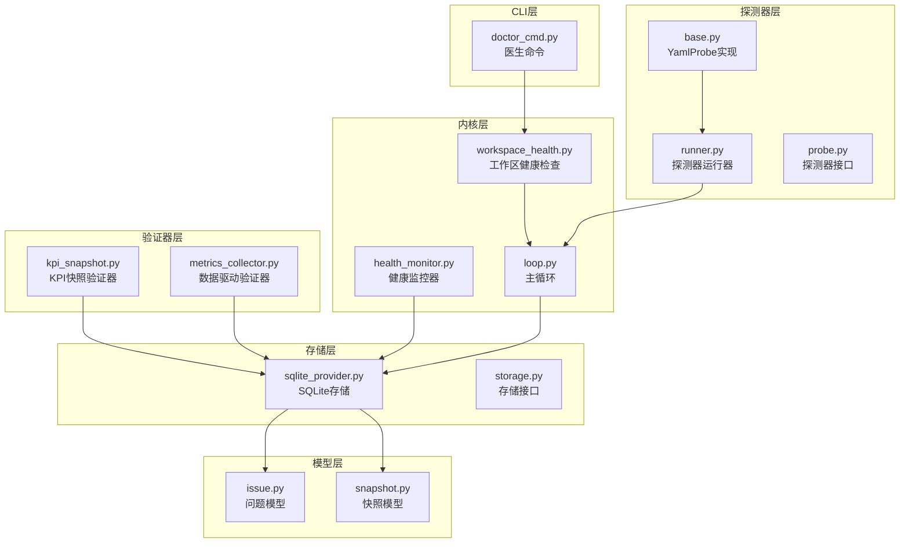
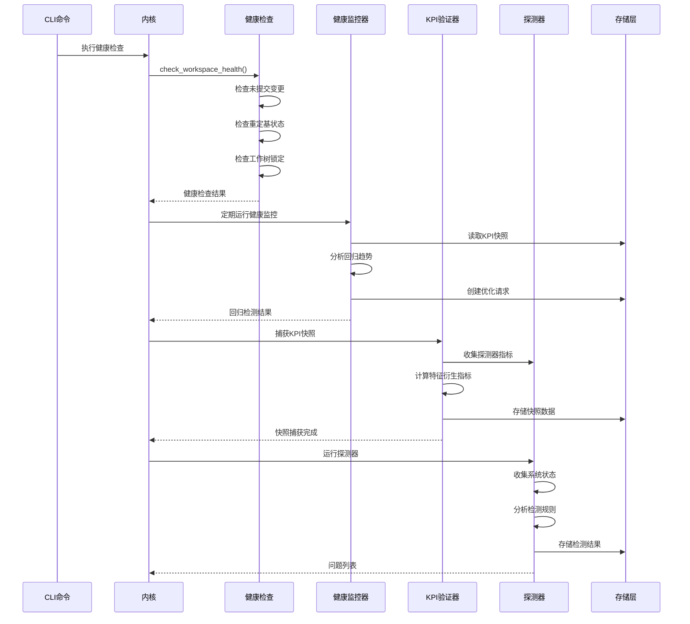
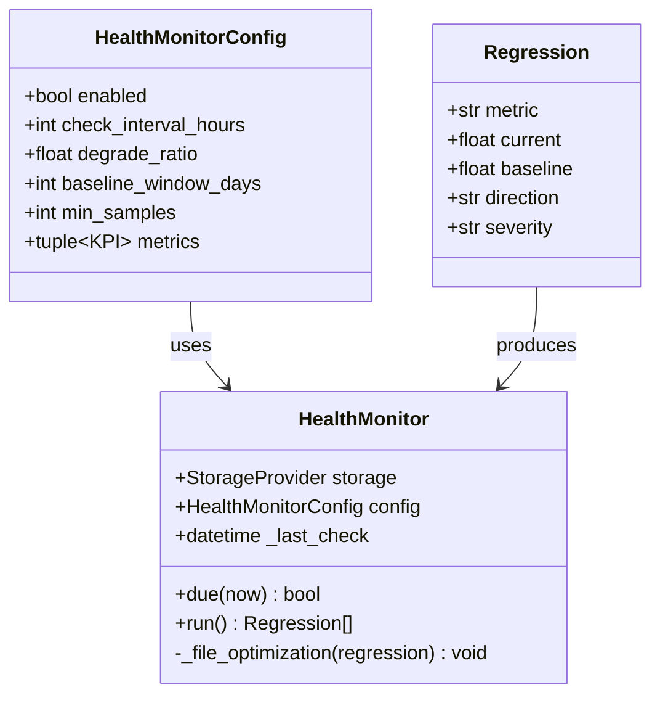
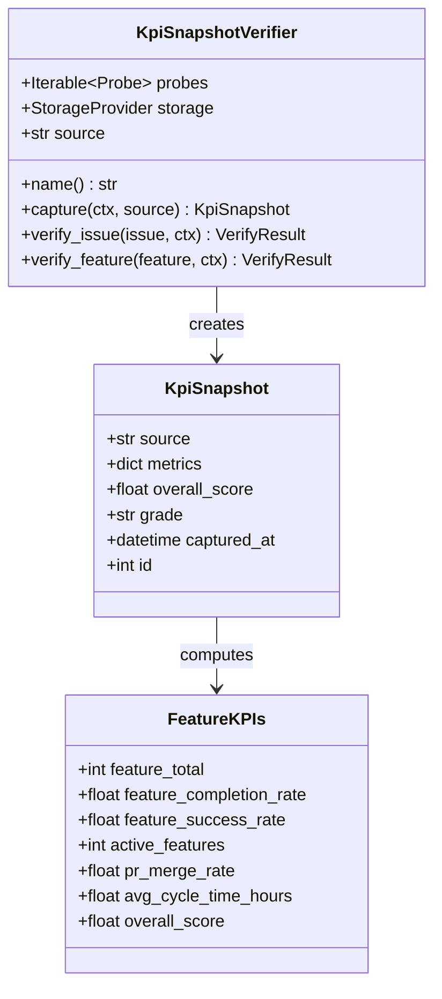
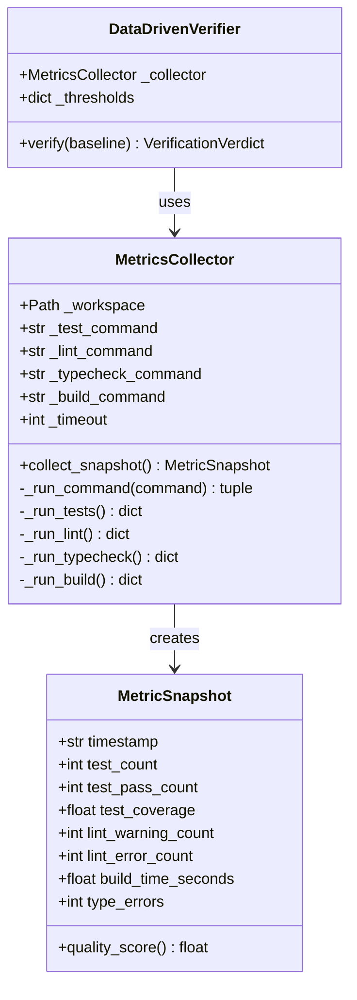
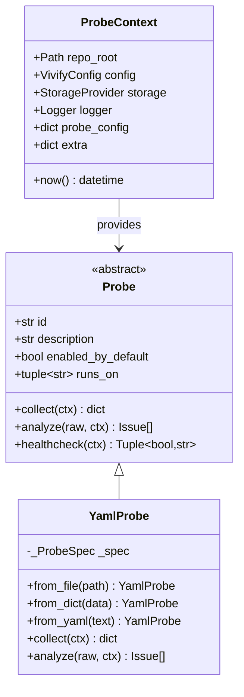
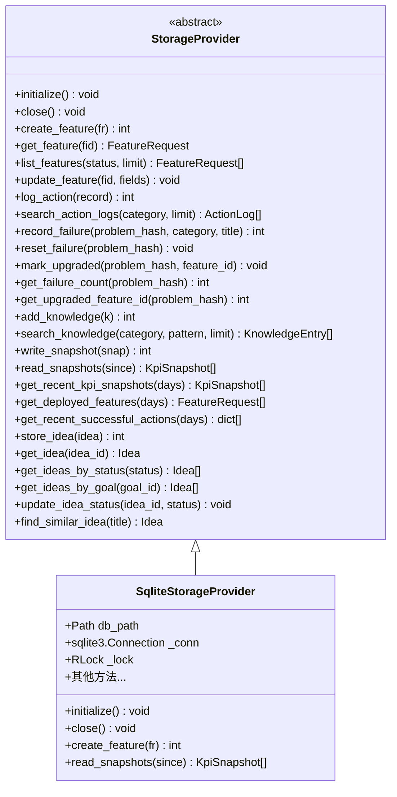
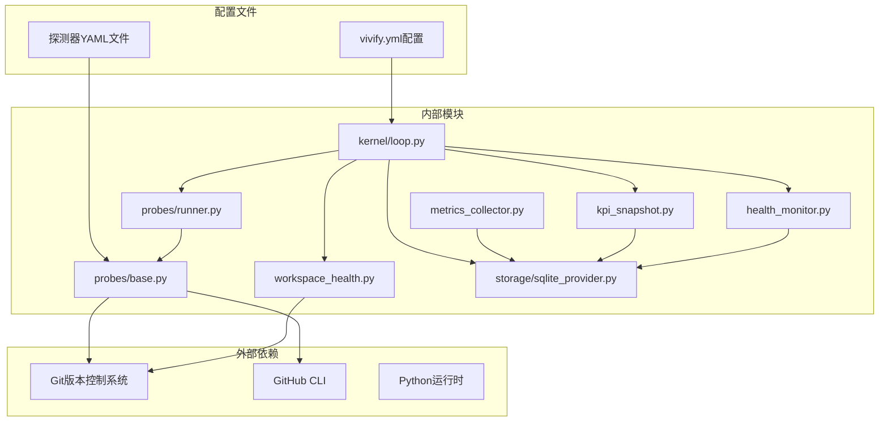

# 工作区健康检查系统

<cite>
**本文档引用的文件**
- [workspace_health.py](file://vivify/kernel/workspace_health.py)
- [health_monitor.py](file://vivify/kernel/health_monitor.py)
- [loop.py](file://vivify/kernel/loop.py)
- [kpi_snapshot.py](file://vivify/verifier/kpi_snapshot.py)
- [metrics_collector.py](file://vivify/verifier/metrics_collector.py)
- [snapshot.py](file://vivify/models/snapshot.py)
- [base.py](file://vivify/probes/base.py)
- [runner.py](file://vivify/probes/runner.py)
- [probe.py](file://vivify/interfaces/probe.py)
- [sqlite_provider.py](file://vivify/storage/sqlite_provider.py)
- [storage.py](file://vivify/interfaces/storage.py)
- [issue.py](file://vivify/models/issue.py)
- [doctor_cmd.py](file://vivify/cli/doctor_cmd.py)
- [test_workspace_health.py](file://tests/unit/test_workspace_health.py)
- [build_duration.yml](file://vivify/probes/builtin/build_duration.yml)
- [ci_status.yml](file://vivify/probes/builtin/ci_status.yml)
</cite>

## 更新摘要
**变更内容**
- 新增健康监控器组件，实现KPI快照分析和自动化优化请求功能
- 集成KPI快照验证器，支持探测器指标捕获和趋势分析
- 增强内核循环，添加健康监控器和KPI快照捕获阶段
- 新增数据驱动验证器，支持量化指标比较和自动化决策

## 目录
1. [简介](#简介)
2. [项目结构](#项目结构)
3. [核心组件](#核心组件)
4. [架构概览](#架构概览)
5. [详细组件分析](#详细组件分析)
6. [依赖关系分析](#依赖关系分析)
7. [性能考虑](#性能考虑)
8. [故障排除指南](#故障排除指南)
9. [结论](#结论)

## 简介

工作区健康检查系统是Vivify智能开发助手的核心基础设施，负责确保开发环境的稳定性和可靠性。该系统通过多层健康检查机制，监控Git工作区状态、检测潜在问题，并提供自动化的健康维护功能。

系统采用模块化设计，包含四个主要层面：

- **预检健康检查**：在执行任何AI驱动的任务之前，验证工作区的Git状态和锁定状态
- **持续健康监控**：定期分析KPI快照数据，检测性能回归并自动生成优化请求
- **KPI快照验证**：捕获探测器产生的关键绩效指标，建立趋势分析基础
- **探测器生态系统**：基于YAML配置的可扩展探测器，用于检测各种类型的健康问题

## 项目结构



**图表来源**
- [workspace_health.py:1-112](file://vivify/kernel/workspace_health.py#L1-L112)
- [health_monitor.py:1-141](file://vivify/kernel/health_monitor.py#L1-L141)
- [loop.py:1-1699](file://vivify/kernel/loop.py#L1-L1699)
- [kpi_snapshot.py:1-185](file://vivify/verifier/kpi_snapshot.py#L1-L185)
- [metrics_collector.py:1-413](file://vivify/verifier/metrics_collector.py#L1-L413)

**章节来源**
- [workspace_health.py:1-112](file://vivify/kernel/workspace_health.py#L1-L112)
- [health_monitor.py:1-141](file://vivify/kernel/health_monitor.py#L1-L141)
- [loop.py:1-1699](file://vivify/kernel/loop.py#L1-L1699)
- [kpi_snapshot.py:1-185](file://vivify/verifier/kpi_snapshot.py#L1-L185)
- [metrics_collector.py:1-413](file://vivify/verifier/metrics_collector.py#L1-L413)

## 核心组件

### 工作区健康检查器

工作区健康检查器提供三重保护机制：

1. **未提交变更检查**：确保工作区没有未提交的更改
2. **重定基/合并状态检查**：防止在Git重定基或合并过程中进行操作
3. **工作树锁定检查**：检测被锁定的工作树状态

### 健康监控器

健康监控器专注于KPI（关键绩效指标）的长期趋势分析：

- **回归检测算法**：使用30天基线对比当前值，识别性能下降
- **严重性分级**：根据偏离程度自动标记警告或严重级别
- **自动化优化请求**：检测到回归时自动生成优化请求
- **配置驱动**：支持通过配置文件定制监控参数

### KPI快照验证器

KPI快照验证器负责捕获和持久化关键绩效指标：

- **探测器集成**：从支持的探测器收集数值指标
- **特征衍生**：自动计算特性生命周期KPI作为后备数据
- **趋势分析**：为后续的趋势分析提供数据基础
- **质量评分**：计算综合质量分数用于趋势评估

### 数据驱动验证器

数据驱动验证器提供量化指标比较和自动化决策：

- **指标收集**：收集测试结果、代码质量、构建时间等量化指标
- **差异分析**：比较基线和当前状态的指标差异
- **阈值规则**：基于配置的阈值规则生成验证结论
- **LLM集成**：在必要时触发人工智能审查

### 探测器系统

基于YAML配置的声明式探测器，支持：

- **Shell命令收集**：执行外部命令获取系统状态信息
- **条件规则分析**：使用Jinja模板引擎评估检测条件
- **标准化问题输出**：将检测结果转换为统一的问题格式

**章节来源**
- [workspace_health.py:24-112](file://vivify/kernel/workspace_health.py#L24-L112)
- [health_monitor.py:52-141](file://vivify/kernel/health_monitor.py#L52-L141)
- [kpi_snapshot.py:107-185](file://vivify/verifier/kpi_snapshot.py#L107-L185)
- [metrics_collector.py:137-413](file://vivify/verifier/metrics_collector.py#L137-L413)
- [base.py:177-335](file://vivify/probes/base.py#L177-L335)

## 架构概览



**图表来源**
- [loop.py:732-781](file://vivify/kernel/loop.py#L732-L781)
- [health_monitor.py:108-116](file://vivify/kernel/health_monitor.py#L108-L116)
- [kpi_snapshot.py:120-163](file://vivify/verifier/kpi_snapshot.py#L120-L163)
- [runner.py:32-72](file://vivify/probes/runner.py#L32-L72)

## 详细组件分析

### 工作区健康检查组件

```mermaid
classDiagram
class HealthCheckResult {
+bool passed
+dict[] checks
+summary() str
}
class WorkspaceHealthChecker {
+check_workspace_health(workspace) HealthCheckResult
-_check_uncommitted(workspace) dict
-_check_rebase_state(workspace) dict
-_check_worktree_locks(workspace) dict
}
HealthCheckResult <-- WorkspaceHealthChecker : creates
note for WorkspaceHealthChecker : "fail-open策略<br/>遇到错误时返回通过"
```

**图表来源**
- [workspace_health.py:10-112](file://vivify/kernel/workspace_health.py#L10-L112)

工作区健康检查采用fail-open策略，即使在以下情况下也会返回通过状态：
- 工作区不存在
- 工作区不是Git仓库
- Git命令执行超时
- Git二进制文件缺失

这种设计确保了系统的向后兼容性和容错能力。

**章节来源**
- [workspace_health.py:24-112](file://vivify/kernel/workspace_health.py#L24-L112)
- [test_workspace_health.py:62-180](file://tests/unit/test_workspace_health.py#L62-L180)

### 健康监控器组件



**图表来源**
- [health_monitor.py:22-141](file://vivify/kernel/health_monitor.py#L22-L141)

健康监控器的核心算法基于统计学原理：

1. **基线对比**：比较当前值与30天历史基线
2. **阈值判断**：使用降级比率阈值识别回归
3. **严重性评估**：根据偏离程度确定严重级别
4. **自动化响应**：创建相应的优化请求

**章节来源**
- [health_monitor.py:52-141](file://vivify/kernel/health_monitor.py#L52-L141)

### KPI快照验证器组件



**图表来源**
- [kpi_snapshot.py:107-185](file://vivify/verifier/kpi_snapshot.py#L107-L185)
- [snapshot.py:9-16](file://vivify/models/snapshot.py#L9-L16)

KPI快照验证器提供双重指标收集机制：

1. **探测器指标**：从支持的探测器收集数值指标
2. **特征衍生指标**：基于数据库中的特性数据计算关键指标
3. **质量评分**：计算综合质量分数用于趋势分析

**章节来源**
- [kpi_snapshot.py:107-185](file://vivify/verifier/kpi_snapshot.py#L107-L185)
- [snapshot.py:9-16](file://vivify/models/snapshot.py#L9-L16)

### 数据驱动验证器组件



**图表来源**
- [metrics_collector.py:137-413](file://vivify/verifier/metrics_collector.py#L137-L413)

数据驱动验证器提供量化的质量评估：

1. **指标收集**：从项目中提取测试、代码质量、构建时间等指标
2. **质量评分**：基于权重计算综合质量分数
3. **差异分析**：比较基线和当前状态的指标差异
4. **阈值决策**：根据配置的阈值生成验证结论

**章节来源**
- [metrics_collector.py:137-413](file://vivify/verifier/metrics_collector.py#L137-L413)

### 探测器系统组件



**图表来源**
- [probe.py:40-59](file://vivify/interfaces/probe.py#L40-L59)
- [base.py:177-335](file://vivify/probes/base.py#L177-L335)

探测器系统支持复杂的配置和数据处理：

- **Jinja模板渲染**：动态生成Shell命令和规则表达式
- **类型强制转换**：自动将原始输出转换为适当的数据类型
- **超时控制**：每个探测步骤都有独立的超时设置
- **错误处理**：优雅处理探测过程中的各种异常情况

**章节来源**
- [base.py:177-335](file://vivify/probes/base.py#L177-L335)
- [runner.py:32-85](file://vivify/probes/runner.py#L32-L85)

### 存储层组件



**图表来源**
- [storage.py:19-139](file://vivify/interfaces/storage.py#L19-L139)
- [sqlite_provider.py:57-791](file://vivify/storage/sqlite_provider.py#L57-L791)

存储层提供了完整的数据持久化解决方案：

- **SQLite集成**：使用WAL模式确保并发读取性能
- **迁移管理**：自动应用数据库模式变更
- **事务支持**：提供线程安全的数据库访问
- **查询优化**：针对不同场景提供专门的查询方法

**章节来源**
- [sqlite_provider.py:57-791](file://vivify/storage/sqlite_provider.py#L57-L791)

## 依赖关系分析



**图表来源**
- [loop.py:43-65](file://vivify/kernel/loop.py#L43-L65)
- [base.py:231-267](file://vivify/probes/base.py#L231-L267)

系统的关键依赖关系包括：

1. **Git集成**：所有健康检查都依赖Git命令行工具
2. **GitHub集成**：探测器需要GitHub CLI进行CI状态检查
3. **配置驱动**：所有行为都由配置文件控制
4. **存储抽象**：通过接口抽象实现可插拔的存储后端
5. **探测器集成**：KPI快照验证器依赖探测器系统提供的指标

**章节来源**
- [loop.py:43-65](file://vivify/kernel/loop.py#L43-L65)
- [doctor_cmd.py:30-88](file://vivify/cli/doctor_cmd.py#L30-L88)

## 性能考虑

### 健康检查性能优化

工作区健康检查采用轻量级设计：

- **异步执行**：每个检查独立执行，避免相互阻塞
- **超时控制**：每个Git命令都有10秒超时限制
- **缓存策略**：检查结果在单次运行中重复使用
- **失败开路**：遇到错误时快速返回，避免长时间等待

### 健康监控性能优化

健康监控器针对大数据量进行了优化：

- **分页查询**：KPI快照查询使用分页机制
- **内存管理**：只在内存中保持必要的数据
- **统计计算**：使用高效的统计函数计算中位数
- **早退机制**：当数据不足时提前结束分析
- **配置驱动**：通过配置控制监控频率和范围

### KPI快照验证性能优化

KPI快照验证器采用多种性能优化技术：

- **探测器聚合**：批量处理多个探测器的结果
- **特征衍生缓存**：避免重复计算特征衍生指标
- **存储优化**：使用高效的数据库查询和索引
- **异常隔离**：单个探测器的失败不会影响整体性能

### 数据驱动验证性能优化

数据驱动验证器针对大量指标比较进行了优化：

- **阈值短路**：在不满足阈值条件时提前结束
- **权重计算缓存**：避免重复计算质量分数
- **差异分析优化**：只比较有意义的指标变化
- **配置缓存**：避免重复解析配置文件

### 探测器性能优化

探测器系统采用多种性能优化技术：

- **并行执行**：多个探测器可以并行运行
- **资源限制**：每个探测器都有独立的资源配额
- **结果缓存**：重复的探测结果会被缓存
- **错误隔离**：单个探测器的失败不会影响其他探测器

## 故障排除指南

### 常见问题诊断

#### Git相关问题

1. **Git命令不可用**
   - 检查Git是否正确安装
   - 验证Git命令在PATH中可用
   - 确认Git版本满足要求

2. **工作区状态异常**
   - 使用`git status`检查工作区状态
   - 清理未提交的更改
   - 完成正在进行的重定基或合并操作

#### 权限问题

1. **GitHub认证失败**
   - 检查GitHub token环境变量
   - 验证`gh auth status`输出
   - 确认有足够的权限访问仓库

2. **文件系统权限**
   - 检查.vivify目录的读写权限
   - 验证数据库文件的访问权限
   - 确认临时文件夹的写入权限

#### 性能问题

1. **健康检查超时**
   - 检查网络连接稳定性
   - 减少同时运行的探测器数量
   - 增加超时时间配置

2. **内存使用过高**
   - 检查KPI快照的数量
   - 清理旧的快照数据
   - 调整基线窗口大小

3. **监控器运行缓慢**
   - 检查数据库性能
   - 优化探测器配置
   - 调整监控频率设置

#### KPI快照问题

1. **快照数据缺失**
   - 检查探测器是否正常工作
   - 验证存储连接状态
   - 确认快照捕获权限

2. **指标计算错误**
   - 检查探测器输出格式
   - 验证数据类型转换
   - 确认阈值配置正确

**章节来源**
- [doctor_cmd.py:30-88](file://vivify/cli/doctor_cmd.py#L30-L88)
- [test_workspace_health.py:187-245](file://tests/unit/test_workspace_health.py#L187-L245)

### 调试技巧

1. **启用详细日志**
   ```bash
   export VIVIFY_LOG_LEVEL=DEBUG
   vivify doctor
   ```

2. **手动执行检查**
   ```bash
   # 检查Git状态
   git status --porcelain
   
   # 检查工作树状态
   git worktree list --porcelain
   
   # 检查重定基状态
   ls -la .git/rebase*
   ```

3. **验证配置**
   ```bash
   # 检查配置文件语法
   vivify doctor
   
   # 验证环境变量
   env | grep GITHUB
   ```

4. **调试健康监控器**
   ```bash
   # 检查KPI快照数据
   vivify doctor
   
   # 验证监控配置
   cat vivify.yml | grep -A 10 health_monitor
   ```

## 结论

工作区健康检查系统通过多层次的设计实现了全面的开发环境监控和维护。系统的主要优势包括：

1. **模块化架构**：清晰的职责分离使得系统易于维护和扩展
2. **容错设计**：fail-open策略确保系统在异常情况下仍能正常运行
3. **可扩展性**：基于YAML的探测器系统支持灵活的功能扩展
4. **性能优化**：针对大数据量和高并发场景进行了专门优化
5. **用户友好**：提供详细的诊断信息和故障排除指导
6. **智能化监控**：通过KPI快照分析实现自动化的健康监控
7. **量化评估**：数据驱动验证器提供客观的质量评估

该系统为Vivify智能开发助手提供了坚实的基础，确保AI驱动的开发流程能够在稳定可靠的环境中运行。通过持续的监控和自动化维护，系统能够及时发现和解决潜在问题，提高开发效率和代码质量。

新增的健康监控器和KPI快照验证器进一步增强了系统的智能化水平，使其能够主动识别性能问题并自动采取纠正措施，为开发者提供更加智能和高效的开发体验。