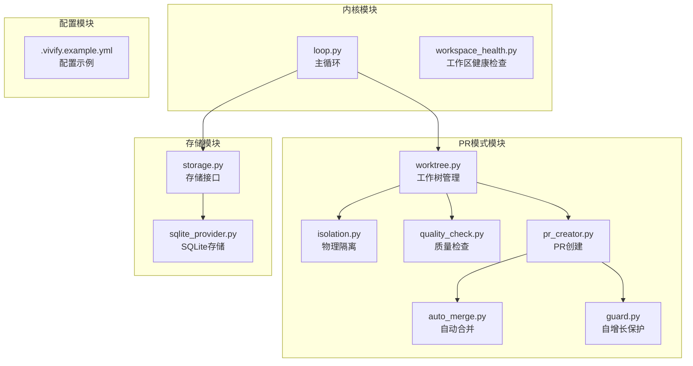
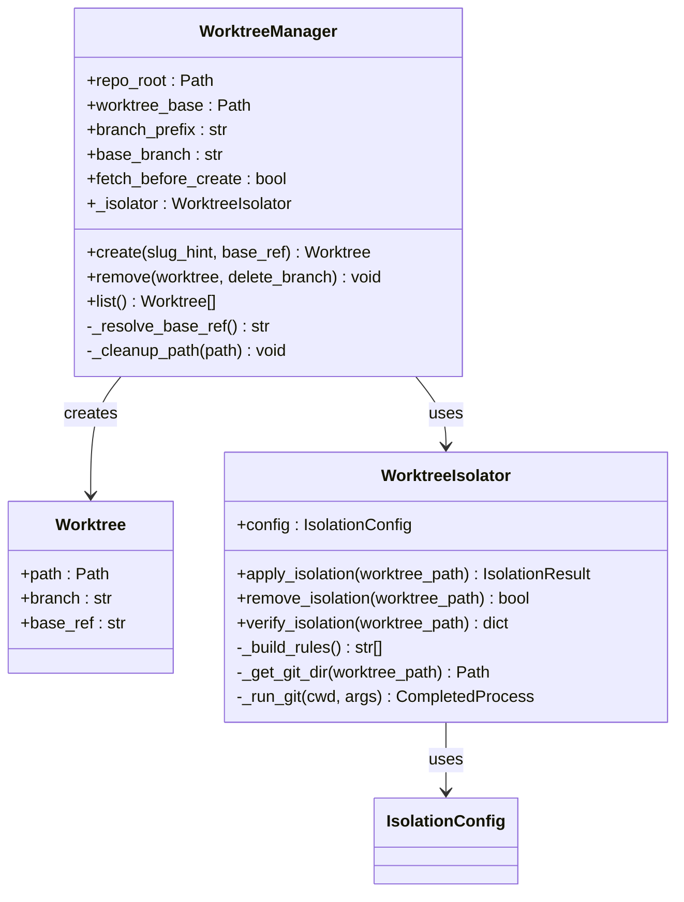
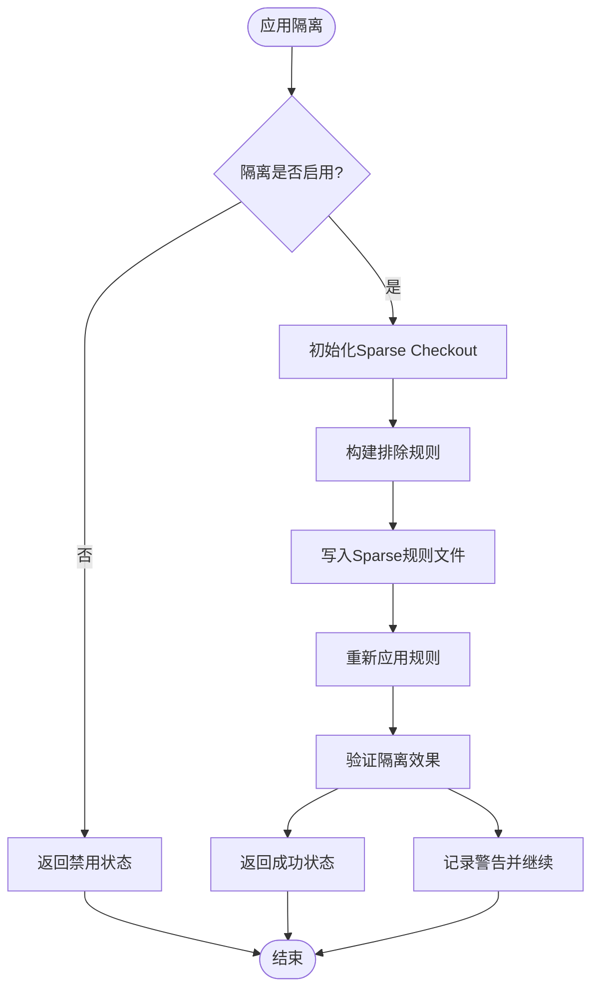
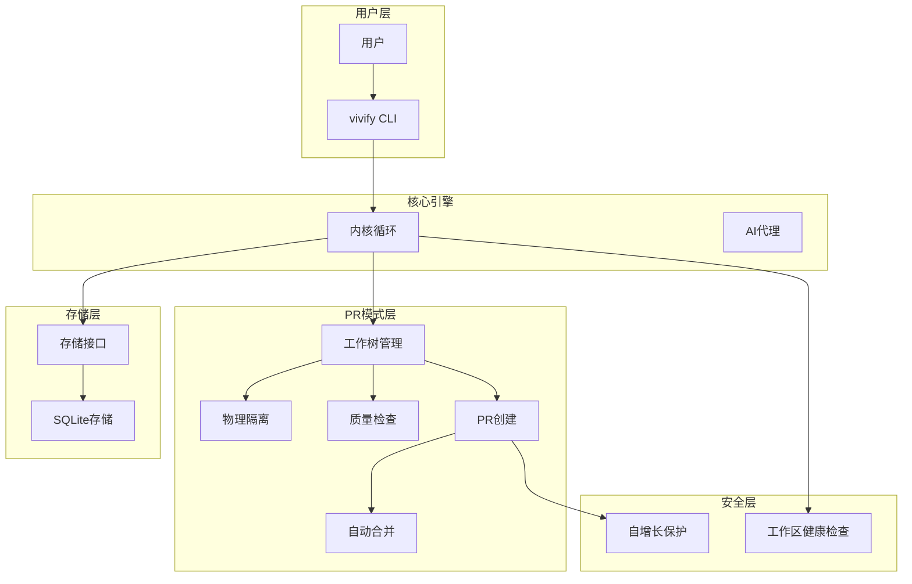
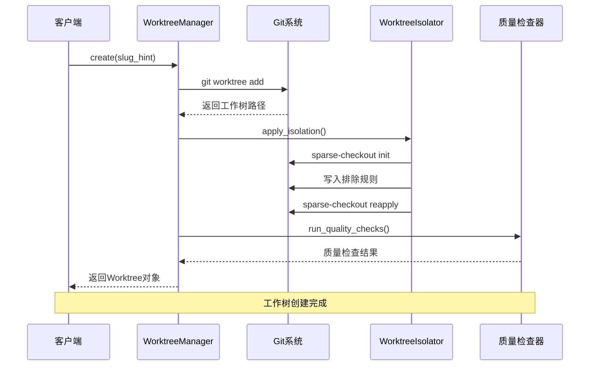
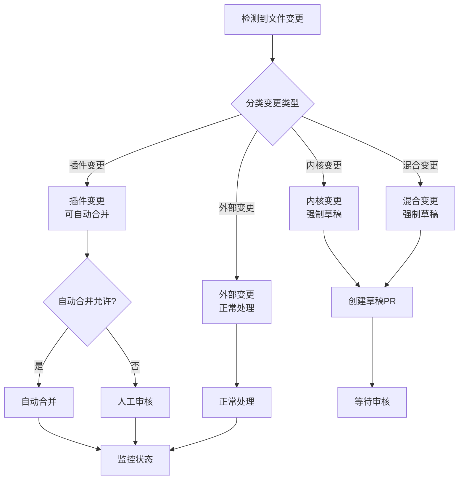
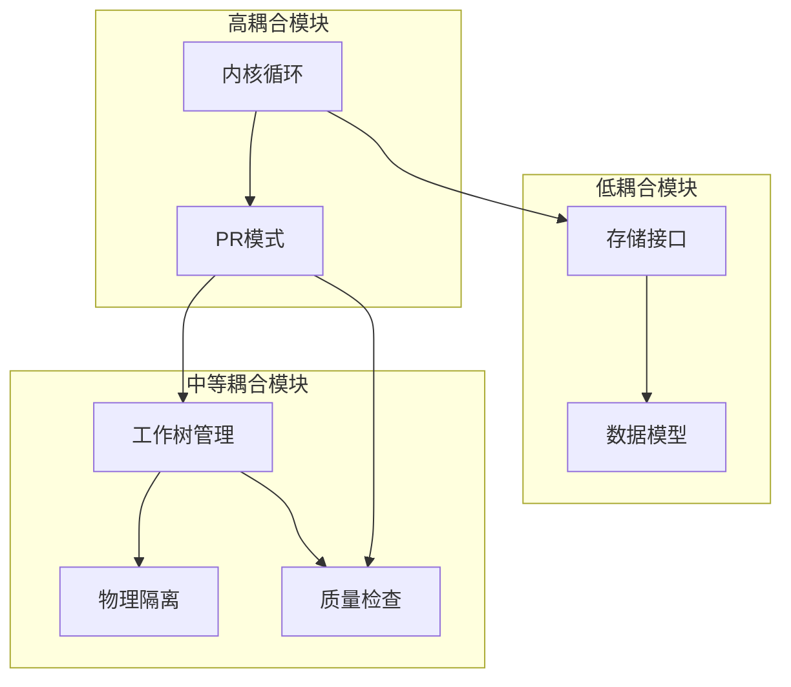
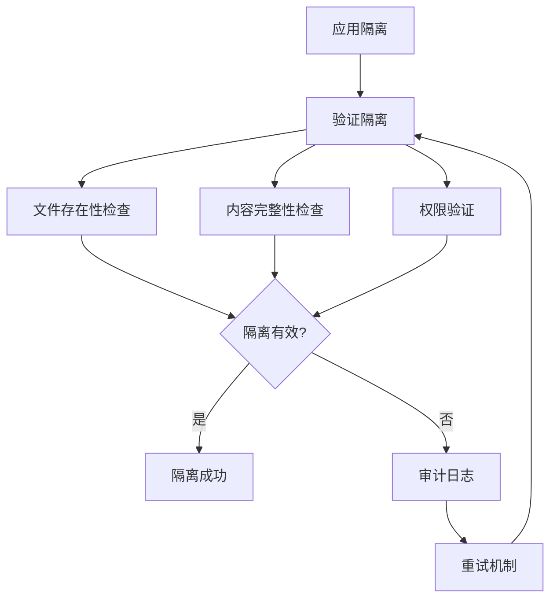

# 工作树物理隔离系统

<cite>
**本文档引用的文件**
- [README.md](file://README.md)
- [worktree.py](file://vivify/pr_mode/worktree.py)
- [isolation.py](file://vivify/pr_mode/isolation.py)
- [workspace_health.py](file://vivify/kernel/workspace_health.py)
- [sqlite_provider.py](file://vivify/storage/sqlite_provider.py)
- [test_worktree_isolation.py](file://tests/unit/test_worktree_isolation.py)
- [auto_merge.py](file://vivify/pr_mode/auto_merge.py)
- [pr_creator.py](file://vivify/pr_mode/pr_creator.py)
- [loop.py](file://vivify/kernel/loop.py)
- [self_grow_guard.py](file://vivify/pr_mode/self_grow_guard.py)
- [quality_check.py](file://vivify/pr_mode/quality_check.py)
- [.vivify.example.yml](file://.vivify.example.yml)
- [storage.py](file://vivify/interfaces/storage.py)
- [feature.py](file://vivify/models/feature.py)
</cite>

## 目录
1. [简介](#简介)
2. [项目结构](#项目结构)
3. [核心组件](#核心组件)
4. [架构概览](#架构概览)
5. [详细组件分析](#详细组件分析)
6. [依赖关系分析](#依赖关系分析)
7. [性能考虑](#性能考虑)
8. [故障排除指南](#故障排除指南)
9. [结论](#结论)

## 简介

工作树物理隔离系统是Vivify项目中的一个关键安全机制，旨在为AI代理提供安全的工作环境。该系统通过Git Worktree创建隔离的开发环境，结合物理文件隔离技术，确保敏感信息不会泄露到AI代理中。

系统的核心目标是：
- **物理隔离**：通过Git Sparse Checkout完全隐藏敏感文件
- **安全隔离**：防止AI代理访问密钥、证书等敏感信息
- **可控隔离**：支持配置化的敏感文件模式匹配
- **透明隔离**：提供完整的隔离状态验证和审计

## 项目结构

工作树物理隔离系统主要分布在以下模块中：



**图表来源**
- [worktree.py:1-191](file://vivify/pr_mode/worktree.py#L1-L191)
- [isolation.py:1-217](file://vivify/pr_mode/isolation.py#L1-L217)
- [loop.py:1-800](file://vivify/kernel/loop.py#L1-L800)

**章节来源**
- [README.md:248-267](file://README.md#L248-L267)
- [worktree.py:1-191](file://vivify/pr_mode/worktree.py#L1-L191)
- [isolation.py:1-217](file://vivify/pr_mode/isolation.py#L1-L217)

## 核心组件

### 工作树管理器 (WorktreeManager)

工作树管理器负责创建、管理和清理Git Worktree实例：



**图表来源**
- [worktree.py:45-191](file://vivify/pr_mode/worktree.py#L45-L191)
- [isolation.py:65-217](file://vivify/pr_mode/isolation.py#L65-L217)

### 物理隔离器 (WorktreeIsolator)

物理隔离器使用Git Sparse Checkout技术实现文件级别的物理隔离：



**图表来源**
- [isolation.py:79-136](file://vivify/pr_mode/isolation.py#L79-L136)

**章节来源**
- [worktree.py:45-104](file://vivify/pr_mode/worktree.py#L45-L104)
- [isolation.py:65-136](file://vivify/pr_mode/isolation.py#L65-L136)

## 架构概览

工作树物理隔离系统在整个Vivify架构中的位置：



**图表来源**
- [README.md:29-68](file://README.md#L29-L68)
- [loop.py:151-321](file://vivify/kernel/loop.py#L151-L321)

## 详细组件分析

### 敏感文件模式配置

系统预定义了全面的敏感文件模式列表：

| 类别 | 模式示例 | 说明 |
|------|----------|------|
| 环境变量 | `.env`, `.env.*` | 环境配置文件 |
| 密钥文件 | `*.pem`, `*.key`, `*.p12`, `*.pfx` | 加密密钥文件 |
| 凭证文件 | `*secret*`, `*credential*` | 包含敏感信息的文件名 |
| 云服务 | `.aws/`, `.gcp/`, `.ssh/` | 云平台认证目录 |
| 服务账号 | `service-account*.json`, `firebase-adminsdk*.json` | 服务账号凭据 |
| Vivify配置 | `.vivify/env` | 系统内部环境配置 |

### 隔离规则构建算法

隔离系统采用"包含全部，排除敏感"的策略：

```mermaid
flowchart LR
AllFiles[/* 包含所有文件] --> Exclude1[!/.env 排除.env]
AllFiles --> Exclude2[!/*.pem 排除所有.pem]
AllFiles --> Exclude3[!/*.key 排除所有.key]
AllFiles --> ExcludeN[... 其他敏感模式]
Exclude1 --> SparseFile[sparse-checkout文件]
Exclude2 --> SparseFile
Exclude3 --> SparseFile
ExcludeN --> SparseFile
```

**图表来源**
- [isolation.py:171-182](file://vivify/pr_mode/isolation.py#L171-L182)

### 工作树生命周期管理



**图表来源**
- [worktree.py:72-104](file://vivify/pr_mode/worktree.py#L72-L104)
- [quality_check.py:51-119](file://vivify/pr_mode/quality_check.py#L51-L119)

**章节来源**
- [isolation.py:171-182](file://vivify/pr_mode/isolation.py#L171-L182)
- [worktree.py:72-104](file://vivify/pr_mode/worktree.py#L72-L104)
- [quality_check.py:51-119](file://vivify/pr_mode/quality_check.py#L51-L119)

### 自增长保护机制

系统对AI代理修改自身代码的行为进行分类保护：



**图表来源**
- [self_grow_guard.py:77-124](file://vivify/pr_mode/self_grow_guard.py#L77-L124)

**章节来源**
- [self_grow_guard.py:30-124](file://vivify/pr_mode/self_grow_guard.py#L30-L124)

## 依赖关系分析

### 组件耦合度分析



**图表来源**
- [worktree.py:19-69](file://vivify/pr_mode/worktree.py#L19-L69)
- [isolation.py:9-21](file://vivify/pr_mode/isolation.py#L9-L21)
- [loop.py:63-63](file://vivify/kernel/loop.py#L63-L63)

### 外部依赖关系

系统对外部工具的依赖关系：

| 工具 | 版本要求 | 用途 | 依赖级别 |
|------|----------|------|----------|
| Git | ≥ 2.25.0 | 工作树和稀疏检出 | 核心依赖 |
| Python | ≥ 3.10 | 运行时环境 | 核心依赖 |
| gh CLI | ≥ 2.0 | GitHub操作 | 可选依赖 |
| qodercli | 最新版本 | AI代理引擎 | 可选依赖 |

**章节来源**
- [README.md:93-101](file://README.md#L93-L101)
- [isolation.py:7-8](file://vivify/pr_mode/isolation.py#L7-L8)

## 性能考虑

### 隔离性能影响

物理隔离对系统性能的影响评估：

1. **创建开销**：工作树创建 + 隔离应用 ≈ 2-5秒
2. **内存占用**：每个工作树约占用10-50MB额外内存
3. **磁盘空间**：每个工作树约占用50-200MB磁盘空间
4. **网络开销**：首次创建需要从远程仓库拉取最新代码

### 隔离有效性验证

系统提供了多层验证机制：



**图表来源**
- [isolation.py:151-169](file://vivify/pr_mode/isolation.py#L151-L169)

## 故障排除指南

### 常见问题及解决方案

| 问题类型 | 症状 | 可能原因 | 解决方案 |
|----------|------|----------|----------|
| 隔离失败 | 敏感文件仍可见 | Git版本过低 | 升级Git至≥2.25.0 |
| 工作树创建失败 | git worktree add错误 | 权限不足或网络问题 | 检查Git权限和网络连接 |
| 质量检查失败 | PR无法创建 | 语法错误或测试失败 | 修复代码问题后重试 |
| 自动合并失败 | PR未自动合并 | CI检查未通过 | 修复CI问题或手动合并 |

### 调试工具和方法

1. **隔离状态检查**：使用`verify_isolation()`方法检查隔离效果
2. **日志分析**：查看工作树创建和隔离应用的日志输出
3. **手动验证**：在工作树环境中手动检查敏感文件是否存在
4. **配置验证**：检查`.vivify.yml`配置文件的有效性

**章节来源**
- [test_worktree_isolation.py:108-172](file://tests/unit/test_worktree_isolation.py#L108-L172)
- [workspace_health.py:24-56](file://vivify/kernel/workspace_health.py#L24-L56)

## 结论

工作树物理隔离系统通过多层次的安全机制，为AI代理提供了一个既安全又高效的开发环境。系统的主要优势包括：

1. **强安全性**：物理隔离确保敏感信息不会泄露给AI代理
2. **灵活性**：支持配置化的敏感文件模式和隔离策略
3. **可观测性**：提供完整的隔离状态验证和审计功能
4. **兼容性**：与现有的PR模式和自动化流程无缝集成

该系统为Vivify项目的长期发展奠定了坚实的安全基础，确保在自动化的AI驱动开发过程中，敏感信息得到充分保护，同时不影响开发效率和协作体验。