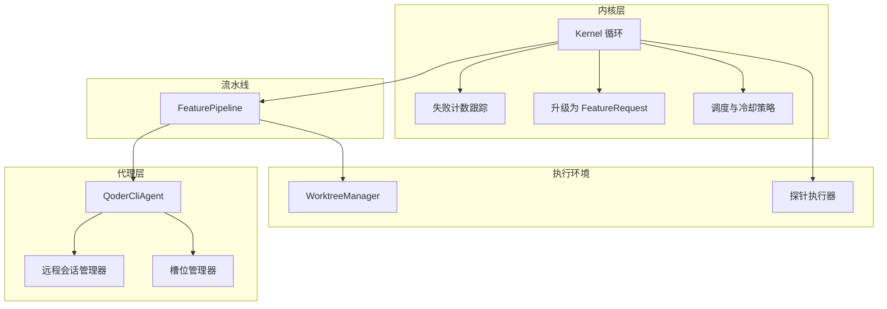
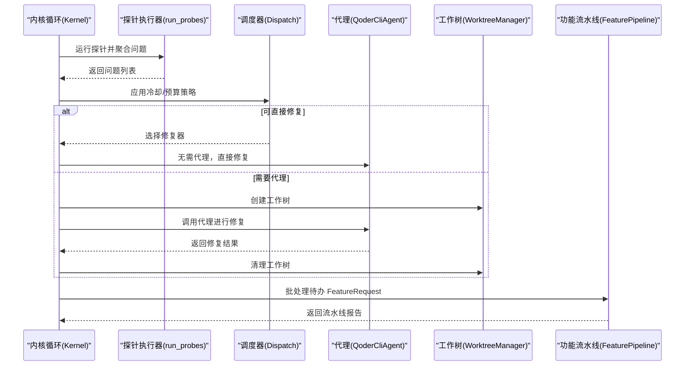
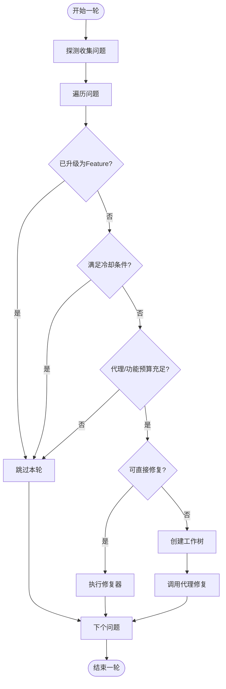
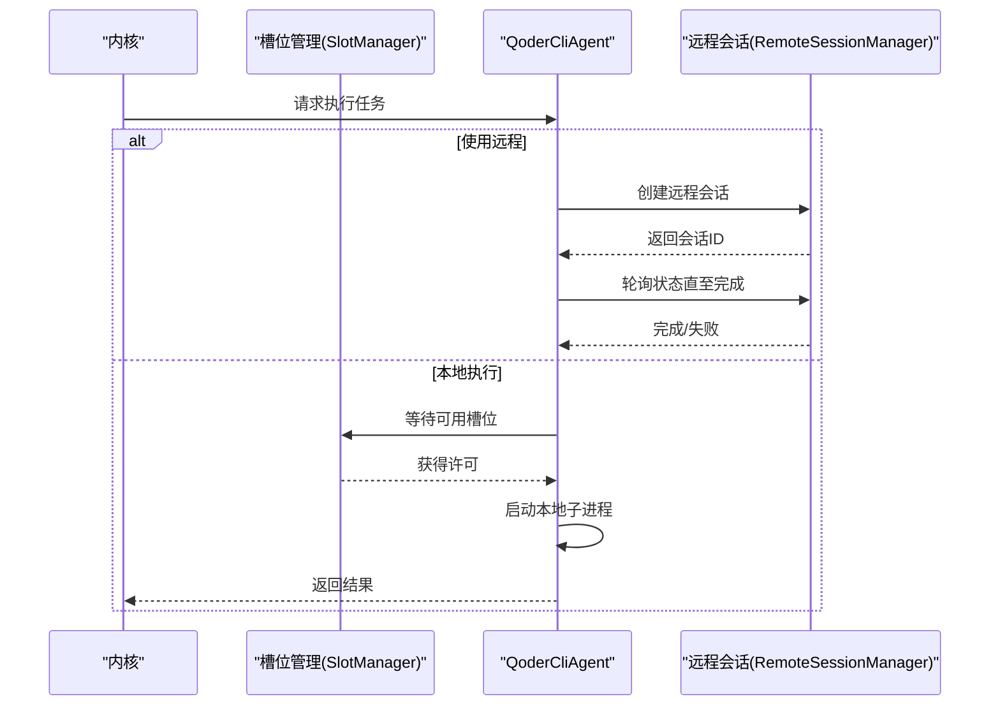
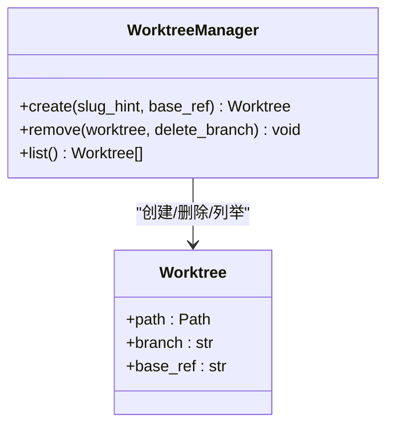
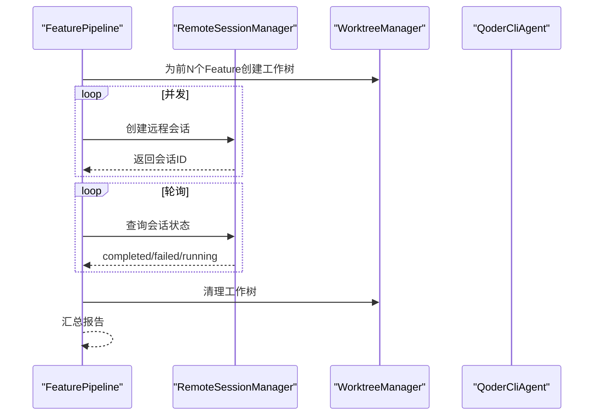
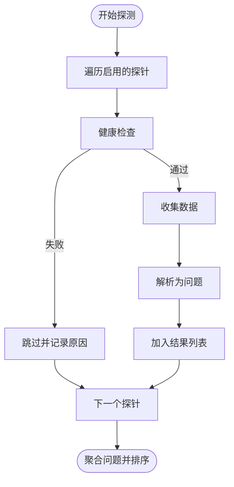
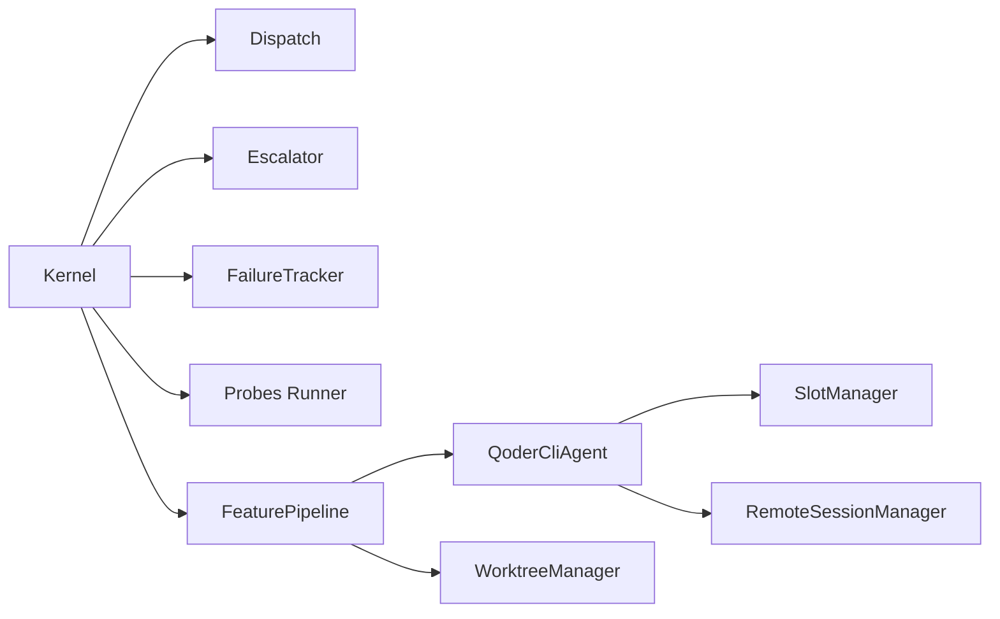

# 并行特性开发

<cite>
**本文档引用的文件**
- [vivify/kernel/dispatch.py](file://vivify/kernel/dispatch.py)
- [vivify/kernel/loop.py](file://vivify/kernel/loop.py)
- [vivify/kernel/escalator.py](file://vivify/kernel/escalator.py)
- [vivify/kernel/failure_tracker.py](file://vivify/kernel/failure_tracker.py)
- [vivify/kernel/feature_pipeline.py](file://vivify/kernel/feature_pipeline.py)
- [vivify/agents/slot_manager.py](file://vivify/agents/slot_manager.py)
- [vivify/agents/qodercli_agent.py](file://vivify/agents/qodercli_agent.py)
- [vivify/agents/remote_session.py](file://vivify/agents/remote_session.py)
- [vivify/pr_mode/worktree.py](file://vivify/pr_mode/worktree.py)
- [vivify/probes/runner.py](file://vivify/probes/runner.py)
- [vivify/interfaces/agent.py](file://vivify/interfaces/agent.py)
- [vivify/cli/run_cmd.py](file://vivify/cli/run_cmd.py)
- [vivify/config/schema.py](file://vivify/config/schema.py)
</cite>

## 目录
1. [简介](#简介)
2. [项目结构](#项目结构)
3. [核心组件](#核心组件)
4. [架构总览](#架构总览)
5. [详细组件分析](#详细组件分析)
6. [依赖关系分析](#依赖关系分析)
7. [性能考量](#性能考量)
8. [故障排查指南](#故障排查指南)
9. [结论](#结论)

## 简介
本文件系统性梳理 vivify 在“并行特性开发”方面的设计与实现，重点覆盖以下方面：
- 核心内核循环如何组织探测、修复、升级与功能流水线，并在各阶段引入并行能力
- 代理层并发控制（本地与远程）与资源槽位管理
- 工作树隔离与多任务并行执行
- 探测阶段的串行化与容错策略
- 功能流水线的批处理并行（远程会话）

目标是帮助读者快速理解并行机制如何协同工作，以及在实际部署中如何通过配置优化吞吐量与稳定性。

## 项目结构
vivify 采用分层模块化设计，围绕“内核循环 + 代理 + 工作树 + 探测 + 修复器 + PR 模式”的架构展开。并行特性主要分布在以下模块：
- 内核循环：负责一轮轮调度与协调
- 代理与槽位管理：控制本地/远程并发
- 工作树管理：为每个任务提供隔离执行环境
- 探测执行：按序运行，保证一致性
- 功能流水线：支持批处理并行开发

**图表来源**
- [vivify/kernel/loop.py:129-767](file://vivify/kernel/loop.py#L129-L767)
- [vivify/kernel/dispatch.py:36-84](file://vivify/kernel/dispatch.py#L36-L84)
- [vivify/kernel/escalator.py:31-89](file://vivify/kernel/escalator.py#L31-L89)
- [vivify/kernel/failure_tracker.py:26-58](file://vivify/kernel/failure_tracker.py#L26-L58)
- [vivify/kernel/feature_pipeline.py:79-625](file://vivify/kernel/feature_pipeline.py#L79-L625)
- [vivify/agents/qodercli_agent.py:64-326](file://vivify/agents/qodercli_agent.py#L64-L326)
- [vivify/agents/slot_manager.py:21-111](file://vivify/agents/slot_manager.py#L21-L111)
- [vivify/agents/remote_session.py:30-199](file://vivify/agents/remote_session.py#L30-L199)
- [vivify/pr_mode/worktree.py:43-176](file://vivify/pr_mode/worktree.py#L43-L176)
- [vivify/probes/runner.py:31-83](file://vivify/probes/runner.py#L31-L83)

**章节来源**
- [vivify/kernel/loop.py:1-767](file://vivify/kernel/loop.py#L1-L767)
- [vivify/probes/runner.py:1-83](file://vivify/probes/runner.py#L1-L83)

## 核心组件
- 内核循环（Kernel）：驱动探测、问题处理、功能流水线、健康监控与自检重启
- 调度与冷却（Dispatch）：基于问题级别与时间窗口的冷却策略，避免低优先级问题频繁触发
- 失败追踪（FailureTracker）：记录问题失败次数，配合升级策略
- 升级器（Escalator）：将长期未解决的问题升级为 FeatureRequest
- 代理（QoderCliAgent）：封装本地/远程执行，支持并发槽位控制
- 槽位管理（SlotManager）：统计并限制代理子进程数量
- 远程会话（RemoteSessionManager）：异步远程执行与状态轮询
- 工作树（WorktreeManager）：为每个任务创建隔离的工作副本
- 功能流水线（FeaturePipeline）：评估 → 开发 → 验证 → 跟进，支持批处理并行

**章节来源**
- [vivify/kernel/dispatch.py:22-84](file://vivify/kernel/dispatch.py#L22-L84)
- [vivify/kernel/escalator.py:21-89](file://vivify/kernel/escalator.py#L21-L89)
- [vivify/kernel/failure_tracker.py:20-58](file://vivify/kernel/failure_tracker.py#L20-L58)
- [vivify/kernel/feature_pipeline.py:49-115](file://vivify/kernel/feature_pipeline.py#L49-L115)
- [vivify/agents/qodercli_agent.py:30-93](file://vivify/agents/qodercli_agent.py#L30-L93)
- [vivify/agents/slot_manager.py:21-63](file://vivify/agents/slot_manager.py#L21-L63)
- [vivify/agents/remote_session.py:30-132](file://vivify/agents/remote_session.py#L30-L132)
- [vivify/pr_mode/worktree.py:43-98](file://vivify/pr_mode/worktree.py#L43-L98)

## 架构总览
内核循环每轮执行流程如下：
1. 探测阶段：顺序运行探针收集问题
2. 问题处理：按冷却策略与预算选择直接修复或调用代理
3. 功能流水线：处理待办的 FeatureRequest，支持批处理并行
4. 健康监控：按周期运行健康检查
5. 自检重启：检测内核代码哈希变化触发优雅重启

**图表来源**
- [vivify/kernel/loop.py:281-476](file://vivify/kernel/loop.py#L281-L476)
- [vivify/probes/runner.py:31-83](file://vivify/probes/runner.py#L31-L83)
- [vivify/kernel/dispatch.py:36-84](file://vivify/kernel/dispatch.py#L36-L84)
- [vivify/kernel/feature_pipeline.py:102-115](file://vivify/kernel/feature_pipeline.py#L102-L115)

**章节来源**
- [vivify/kernel/loop.py:281-476](file://vivify/kernel/loop.py#L281-L476)

## 详细组件分析

### 调度与冷却策略
- 冷却策略：针对不同级别的问题设置不同的冷却时间，避免低优先级问题频繁触发
- 失败计数：记录同一问题连续失败次数，超过阈值可升级为 FeatureRequest
- 预算控制：单轮内代理修复与功能处理的数量上限，防止资源耗尽

**图表来源**
- [vivify/kernel/dispatch.py:36-84](file://vivify/kernel/dispatch.py#L36-L84)
- [vivify/kernel/loop.py:317-375](file://vivify/kernel/loop.py#L317-L375)

**章节来源**
- [vivify/kernel/dispatch.py:36-84](file://vivify/kernel/dispatch.py#L36-L84)
- [vivify/kernel/loop.py:317-375](file://vivify/kernel/loop.py#L317-L375)

### 代理并发控制与远程执行
- 本地并发：通过环境变量标记代理子进程，统计当前活跃数量并受配额限制
- 远程并发：支持远程会话并发创建与轮询，受最大并发数与超时控制
- 回退机制：远程失败时自动回退到本地执行

**图表来源**
- [vivify/agents/qodercli_agent.py:101-297](file://vivify/agents/qodercli_agent.py#L101-L297)
- [vivify/agents/slot_manager.py:38-63](file://vivify/agents/slot_manager.py#L38-L63)
- [vivify/agents/remote_session.py:45-187](file://vivify/agents/remote_session.py#L45-L187)

**章节来源**
- [vivify/agents/qodercli_agent.py:64-326](file://vivify/agents/qodercli_agent.py#L64-L326)
- [vivify/agents/slot_manager.py:21-111](file://vivify/agents/slot_manager.py#L21-L111)
- [vivify/agents/remote_session.py:30-199](file://vivify/agents/remote_session.py#L30-L199)

### 工作树隔离与清理
- 每个任务创建独立工作树，确保修复/开发过程互不干扰
- 支持清理失败或已完成的工作树，避免磁盘占用

**图表来源**
- [vivify/pr_mode/worktree.py:22-176](file://vivify/pr_mode/worktree.py#L22-L176)

**章节来源**
- [vivify/pr_mode/worktree.py:43-176](file://vivify/pr_mode/worktree.py#L43-L176)

### 功能流水线的批处理并行
- 评估：LLM 评分可行性与优先级
- 开发：在工作树中调用代理开发，质量门禁通过后推送分支并开 PR
- 验证：对合并后的提交进行二次验证
- 批处理：并发创建多个远程会话，轮询状态并汇总结果

**图表来源**
- [vivify/kernel/feature_pipeline.py:339-421](file://vivify/kernel/feature_pipeline.py#L339-L421)
- [vivify/agents/remote_session.py:91-187](file://vivify/agents/remote_session.py#L91-L187)

**章节来源**
- [vivify/kernel/feature_pipeline.py:339-543](file://vivify/kernel/feature_pipeline.py#L339-L543)

### 探测阶段的串行化与容错
- 探针顺序执行，每个探针独立运行并记录错误，不影响其他探针
- 支持按配置启用/禁用探针，以及单探针超时控制

**图表来源**
- [vivify/probes/runner.py:31-83](file://vivify/probes/runner.py#L31-L83)

**章节来源**
- [vivify/probes/runner.py:31-83](file://vivify/probes/runner.py#L31-L83)

## 依赖关系分析
- 内核循环依赖调度、失败追踪、升级器、探针执行器、工作树、PR 创建器、功能流水线等
- 代理层依赖槽位管理与远程会话管理
- 功能流水线依赖代理、工作树、PR 创建器、质量检查工具
- 探针执行器与失败追踪相互独立，降低耦合

**图表来源**
- [vivify/kernel/loop.py:129-172](file://vivify/kernel/loop.py#L129-L172)
- [vivify/kernel/feature_pipeline.py:82-100](file://vivify/kernel/feature_pipeline.py#L82-L100)
- [vivify/agents/qodercli_agent.py:64-80](file://vivify/agents/qodercli_agent.py#L64-L80)

**章节来源**
- [vivify/kernel/loop.py:129-172](file://vivify/kernel/loop.py#L129-L172)
- [vivify/kernel/feature_pipeline.py:82-100](file://vivify/kernel/feature_pipeline.py#L82-L100)

## 性能考量
- 并发配额：通过代理的最大并发数与远程最大并发数控制资源占用，避免系统过载
- 冷却策略：对低优先级问题设置较长冷却时间，减少无效工作
- 批处理并行：功能流水线的远程并发显著提升吞吐，但需平衡超时与轮询间隔
- 工作树隔离：隔离执行环境提高稳定性，但需关注磁盘空间与清理策略
- 探测串行化：避免相互影响，但可通过并行化探针实现（当前为顺序执行）

## 故障排查指南
- 代理槽位耗尽：检查并发配置与当前活跃进程数，适当放宽配额或延长等待时间
- 远程会话超时：调整远程轮询间隔与超时时间，确认网络与认证配置
- 工作树清理失败：查看工作树路径与权限，必要时手动清理残留目录
- 探针异常：查看探针健康检查与错误日志，定位具体探针问题
- 升级策略生效：确认失败计数与升级阈值，避免误升级或漏升级

**章节来源**
- [vivify/agents/slot_manager.py:38-63](file://vivify/agents/slot_manager.py#L38-L63)
- [vivify/agents/remote_session.py:162-187](file://vivify/agents/remote_session.py#L162-L187)
- [vivify/pr_mode/worktree.py:94-111](file://vivify/pr_mode/worktree.py#L94-L111)
- [vivify/probes/runner.py:64-70](file://vivify/probes/runner.py#L64-L70)
- [vivify/kernel/escalator.py:45-72](file://vivify/kernel/escalator.py#L45-L72)

## 结论
vivify 的并行特性通过“内核循环 + 代理并发 + 工作树隔离 + 功能流水线批处理”形成完整闭环。调度与冷却策略保障稳定性，代理层的槽位与远程机制提升吞吐，工作树隔离确保任务安全，功能流水线的批处理进一步放大效率。结合合理的配置与监控，可在保证质量的前提下最大化自动化产出。