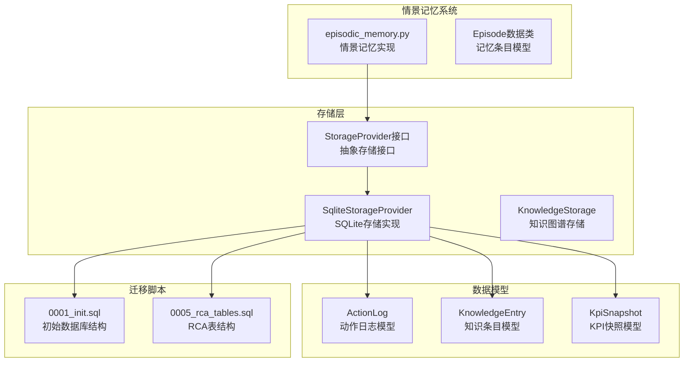
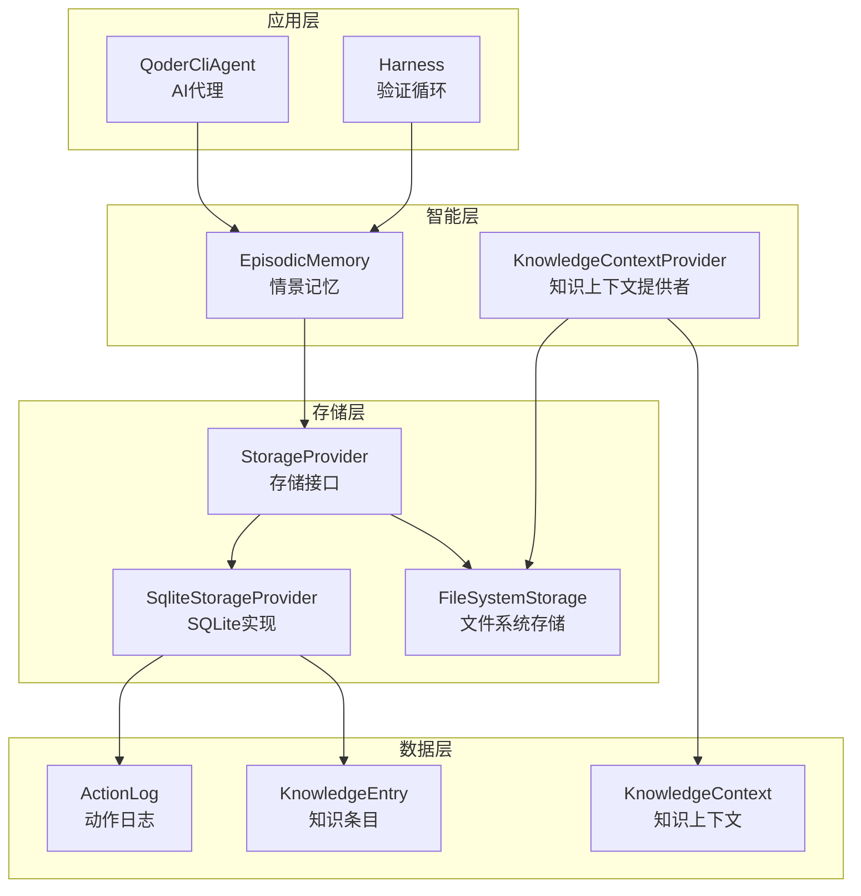
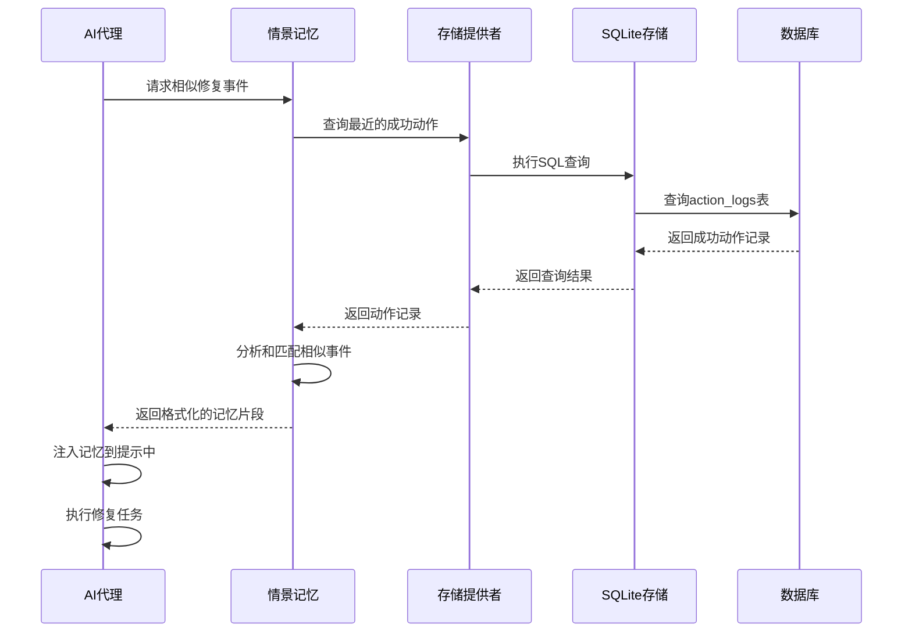
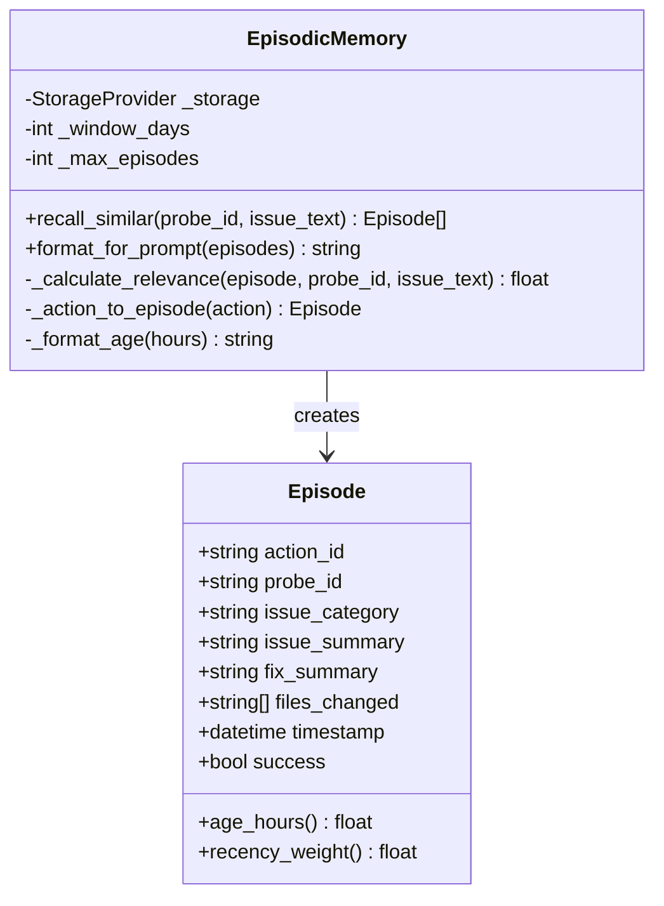
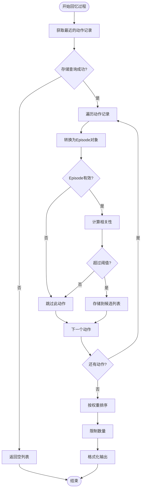
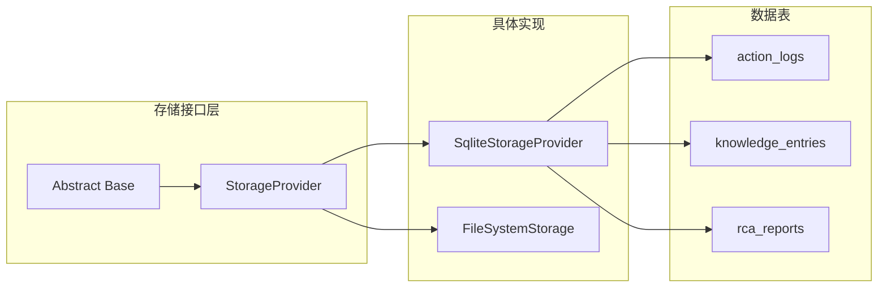
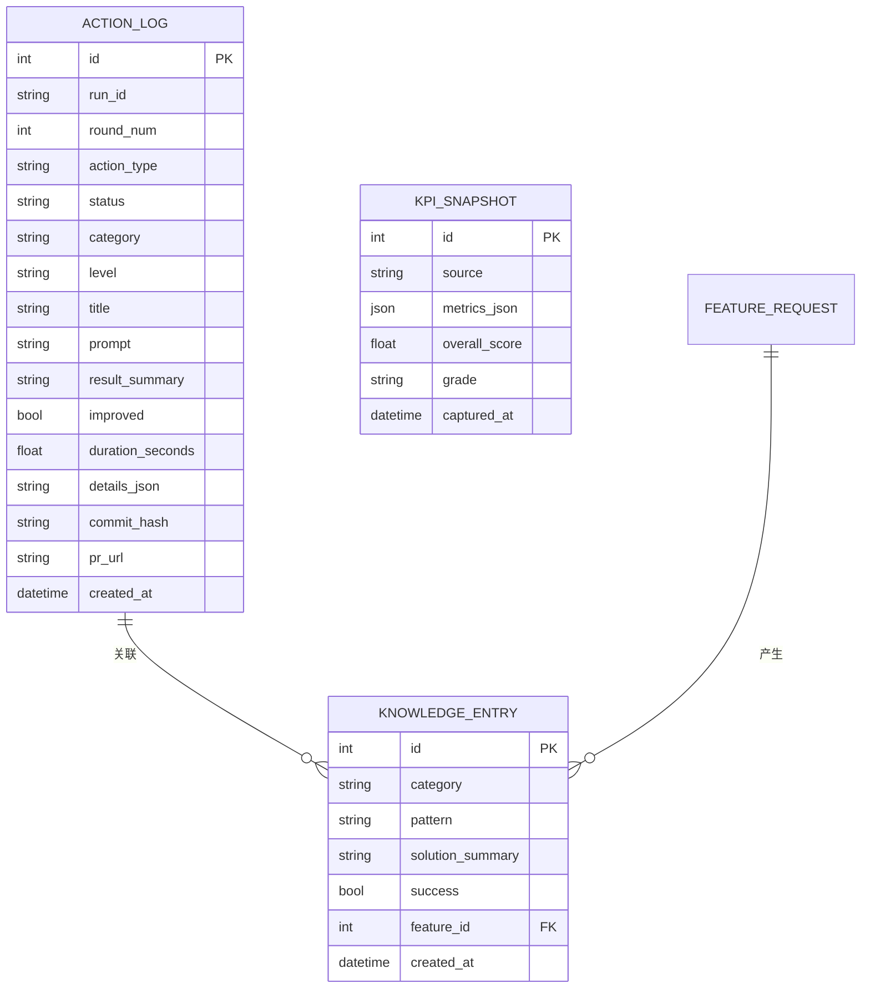
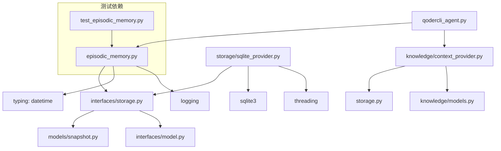

# 情景记忆系统

<cite>
**本文档引用的文件**
- [README.md](file://README.md)
- [episodic_memory.py](file://vivify/intelligence/episodic_memory.py)
- [sqlite_provider.py](file://vivify/storage/sqlite_provider.py)
- [storage.py](file://vivify/knowledge/storage.py)
- [snapshot.py](file://vivify/models/snapshot.py)
- [models.py](file://vivify/intelligence/models.py)
- [storage.py](file://vivify/interfaces/storage.py)
- [0001_init.sql](file://vivify/storage/migrations/0001_init.sql)
- [0005_rca_tables.sql](file://vivify/storage/migrations/0005_rca_tables.sql)
- [test_episodic_memory.py](file://tests/unit/test_episodic_memory.py)
- [qodercli_agent.py](file://vivify/agents/qodercli_agent.py)
- [context_provider.py](file://vivify/knowledge/context_provider.py)
- [models.py](file://vivify/harness/models.py)
</cite>

## 目录
1. [简介](#简介)
2. [项目结构](#项目结构)
3. [核心组件](#核心组件)
4. [架构概览](#架构概览)
5. [详细组件分析](#详细组件分析)
6. [依赖关系分析](#依赖关系分析)
7. [性能考虑](#性能考虑)
8. [故障排除指南](#故障排除指南)
9. [结论](#结论)

## 简介

情景记忆系统是Vivify项目中的一个关键组件，它实现了L2层的记忆机制，通过存储和检索最近的成功修复事件来提高AI代理的问题解决效率。该系统的核心思想是提供原始的、带有具体上下文的最近修复记录，帮助代理识别相似情况并避免重新发现已知的解决方案。

Vivify是一个全场景系统自生长赋能引擎，通过"检测 → 修复 → 验证学习"的三部曲模式，为任何GitHub项目提供自动化的能力。情景记忆系统作为其中的重要组成部分，为AI代理提供了宝贵的历史经验。

## 项目结构

基于提供的项目结构，情景记忆系统主要分布在以下模块中：

**图表来源**
- [episodic_memory.py:1-195](file://vivify/intelligence/episodic_memory.py#L1-L195)
- [sqlite_provider.py:1-791](file://vivify/storage/sqlite_provider.py#L1-L791)
- [storage.py:1-134](file://vivify/knowledge/storage.py#L1-L134)

**章节来源**
- [README.md:248-267](file://README.md#L248-L267)
- [episodic_memory.py:1-195](file://vivify/intelligence/episodic_memory.py#L1-L195)

## 核心组件

情景记忆系统包含以下几个核心组件：

### Episode数据类
Episode类代表单个情景记忆条目，存储了过去修复事件的完整信息：
- `action_id`: 动作ID
- `probe_id`: 探针ID
- `issue_category`: 问题类别
- `issue_summary`: 问题摘要
- `fix_summary`: 修复摘要
- `files_changed`: 修改的文件列表
- `timestamp`: 时间戳
- `success`: 是否成功

### EpisodicMemory类
EpisodicMemory类管理最近的修复事件，提供回忆和检索功能：
- **回忆相似事件**: 基于探针ID和关键词匹配查找相似的过去事件
- **相关性计算**: 计算事件与当前问题的相关性分数
- **提示格式化**: 将事件格式化为AI提示注入的字符串

### 存储接口
系统通过StorageProvider接口实现数据持久化：
- **SQLite实现**: 默认的SQLite存储提供程序
- **抽象接口**: 定义了统一的存储操作接口
- **迁移管理**: 支持数据库结构的版本迁移

**章节来源**
- [episodic_memory.py:17-46](file://vivify/intelligence/episodic_memory.py#L17-L46)
- [episodic_memory.py:48-98](file://vivify/intelligence/episodic_memory.py#L48-L98)
- [storage.py:14-134](file://vivify/knowledge/storage.py#L14-L134)

## 架构概览

情景记忆系统采用分层架构设计，确保了良好的模块化和可扩展性：

**图表来源**
- [qodercli_agent.py:102-592](file://vivify/agents/qodercli_agent.py#L102-L592)
- [episodic_memory.py:48-195](file://vivify/intelligence/episodic_memory.py#L48-L195)
- [context_provider.py:30-679](file://vivify/knowledge/context_provider.py#L30-L679)

系统的工作流程如下：

**图表来源**
- [episodic_memory.py:67-98](file://vivify/intelligence/episodic_memory.py#L67-L98)
- [sqlite_provider.py:618-652](file://vivify/storage/sqlite_provider.py#L618-L652)

## 详细组件分析

### Episode数据模型

Episode类是情景记忆的核心数据结构，提供了完整的事件信息：

**图表来源**
- [episodic_memory.py:17-46](file://vivify/intelligence/episodic_memory.py#L17-L46)
- [episodic_memory.py:48-98](file://vivify/intelligence/episodic_memory.py#L48-L98)

#### 时间衰减机制
系统实现了智能的时间衰减机制，确保近期的修复经验具有更高的权重：

| 时间间隔 | 权重系数 | 说明 |
|---------|---------|------|
| 0-24小时 | 1.0 | 最新修复，最高权重 |
| 24-168小时 | 0.1-1.0 | 逐渐衰减，7天后降至0.1 |
| >168小时 | 0.1 | 超过7天的修复，最低权重 |

**章节来源**
- [episodic_memory.py:30-46](file://vivify/intelligence/episodic_memory.py#L30-L46)

### EpisodicMemory核心算法

EpisodicMemory类实现了复杂的相似性匹配算法：

**图表来源**
- [episodic_memory.py:67-98](file://vivify/intelligence/episodic_memory.py#L67-L98)

#### 相关性计算策略
系统采用多维度的相关性计算方法：

1. **探针ID匹配**: 相同探针ID获得0.6的基础分数
2. **关键词重叠**: 基于token重叠计算，每重叠一个词最多获得0.05分
3. **综合评分**: 最终相关性 = min(1.0, 基础分数 + 关键词分数)

**章节来源**
- [episodic_memory.py:121-139](file://vivify/intelligence/episodic_memory.py#L121-L139)

### 存储系统集成

情景记忆系统通过StorageProvider接口与存储层集成：

**图表来源**
- [storage.py:19-139](file://vivify/interfaces/storage.py#L19-L139)
- [sqlite_provider.py:57-791](file://vivify/storage/sqlite_provider.py#L57-L791)

#### SQLite存储实现
SqliteStorageProvider提供了完整的存储功能：

| 功能类别 | 方法数量 | 描述 |
|---------|---------|------|
| 特性请求 | 4个 | 创建、查询、更新特性请求 |
| 动作日志 | 2个 | 记录和查询动作日志 |
| 失败跟踪 | 5个 | 失败计数和升级管理 |
| 知识条目 | 2个 | 添加和搜索知识条目 |
| KPI快照 | 2个 | 写入和读取KPI数据 |
| RCA报告 | 2个 | 保存和获取根因分析报告 |

**章节来源**
- [sqlite_provider.py:124-761](file://vivify/storage/sqlite_provider.py#L124-L761)

### 数据模型设计

系统使用了多种数据模型来支持不同的功能需求：

**图表来源**
- [snapshot.py:9-48](file://vivify/models/snapshot.py#L9-L48)
- [sqlite_provider.py:246-448](file://vivify/storage/sqlite_provider.py#L246-L448)

**章节来源**
- [snapshot.py:9-48](file://vivify/models/snapshot.py#L9-L48)
- [models.py:11-87](file://vivify/intelligence/models.py#L11-L87)

## 依赖关系分析

情景记忆系统的依赖关系相对简单且清晰：

**图表来源**
- [episodic_memory.py:1-14](file://vivify/intelligence/episodic_memory.py#L1-L14)
- [sqlite_provider.py:19-25](file://vivify/storage/sqlite_provider.py#L19-L25)

### 外部依赖

系统的主要外部依赖包括：

1. **Python标准库**: datetime、threading、json等
2. **SQLite数据库**: 提供轻量级的数据持久化
3. **AI代理接口**: 与Qoder CLI Agent的集成
4. **知识图谱系统**: 与知识上下文提供者的协作

**章节来源**
- [episodic_memory.py:76-82](file://vivify/intelligence/episodic_memory.py#L76-L82)
- [sqlite_provider.py:100-113](file://vivify/storage/sqlite_provider.py#L100-L113)

## 性能考虑

情景记忆系统在设计时充分考虑了性能优化：

### 时间复杂度分析

1. **回忆相似事件**: O(n) - 遍历最近的动作记录
2. **相关性计算**: O(m) - m为查询词的数量
3. **排序操作**: O(k log k) - k为候选事件数量
4. **整体复杂度**: O(n × m + k log k)

### 内存使用优化

1. **延迟加载**: 知识图谱采用延迟加载机制
2. **批量处理**: 支持批量查询和处理
3. **缓存策略**: 实现了适当的缓存机制
4. **资源管理**: 使用上下文管理器确保资源正确释放

### 存储优化

1. **索引优化**: 在关键字段上建立了适当的索引
2. **查询优化**: 使用参数化查询防止SQL注入
3. **连接池**: 实现了连接池管理
4. **事务处理**: 支持事务以保证数据一致性

## 故障排除指南

### 常见问题及解决方案

#### 1. 存储查询失败
**症状**: 回忆功能返回空列表
**原因**: 数据库连接或查询异常
**解决方案**: 
- 检查数据库文件权限
- 验证数据库连接状态
- 查看日志中的错误信息

#### 2. Episode转换失败
**症状**: 部分历史记录无法转换为Episode对象
**原因**: 数据格式不兼容或字段缺失
**解决方案**:
- 验证数据格式的完整性
- 检查时间戳格式
- 确认必需字段的存在

#### 3. 相关性计算异常
**症状**: 相似性匹配结果不符合预期
**原因**: 关键词分割或匹配算法问题
**解决方案**:
- 检查文本预处理逻辑
- 验证相关性计算公式
- 调整阈值参数

**章节来源**
- [test_episodic_memory.py:141-147](file://tests/unit/test_episodic_memory.py#L141-L147)
- [episodic_memory.py:80-82](file://vivify/intelligence/episodic_memory.py#L80-L82)

### 调试技巧

1. **启用详细日志**: 设置日志级别为DEBUG以获取更多信息
2. **单元测试**: 运行测试套件验证功能正常
3. **性能监控**: 监控查询响应时间和内存使用
4. **数据验证**: 定期检查存储的数据完整性

**章节来源**
- [test_episodic_memory.py:1-321](file://tests/unit/test_episodic_memory.py#L1-L321)

## 结论

情景记忆系统作为Vivify项目的重要组成部分，通过实现智能的历史经验检索和注入机制，显著提高了AI代理的问题解决效率。系统的设计体现了以下特点：

1. **模块化设计**: 清晰的层次结构和职责分离
2. **可扩展性**: 通过接口抽象支持多种存储实现
3. **性能优化**: 采用多种优化策略确保高效运行
4. **可靠性**: 完善的错误处理和故障恢复机制

该系统为Vivify的整体自动化能力提供了坚实的基础，通过不断的学习和积累，能够为各种类型的项目提供智能化的自修复和自优化能力。随着项目的不断发展，情景记忆系统将继续演进，为用户提供更加智能和高效的自动化体验。