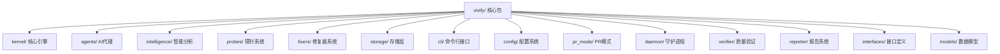
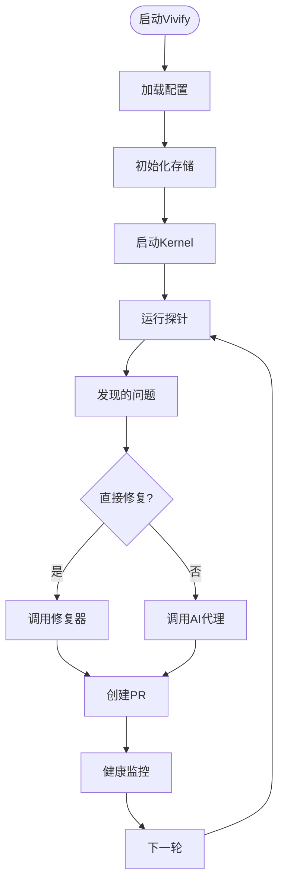
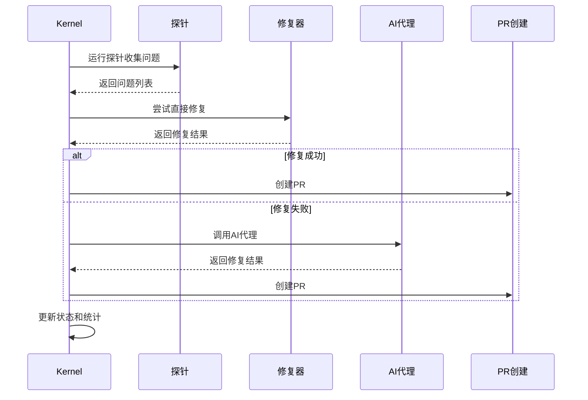
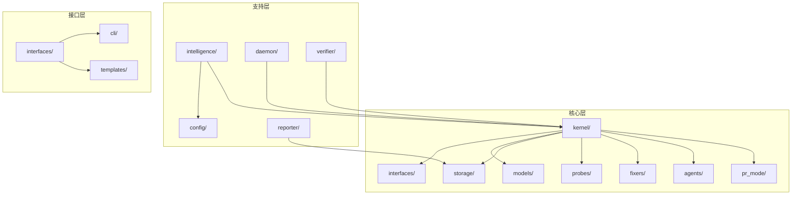

# 技术实现参考

<cite>
**本文引用的文件**
- [pyproject.toml](file://pyproject.toml)
- [.vivify.example.yml](file://.vivify.example.yml)
- [install.sh](file://install.sh)
- [install.ps1](file://install.ps1)
- [vivify/__init__.py](file://vivify/__init__.py)
- [vivify/__main__.py](file://vivify/__main__.py)
- [vivify/cli/main.py](file://vivify/cli/main.py)
- [vivify/config/__init__.py](file://vivify/config/__init__.py)
- [vivify/kernel/__init__.py](file://vivify/kernel/__init__.py)
- [vivify/kernel/loop.py](file://vivify/kernel/loop.py)
- [vivify/agents/qodercli_agent.py](file://vivify/agents/qodercli_agent.py)
- [vivify/intelligence/__init__.py](file://vivify/intelligence/__init__.py)
- [vivify/storage/sqlite_provider.py](file://vivify/storage/sqlite_provider.py)
</cite>

## 目录
1. [简介](#简介)
2. [项目结构](#项目结构)
3. [核心组件](#核心组件)
4. [架构概览](#架构概览)
5. [详细组件分析](#详细组件分析)
6. [依赖关系分析](#依赖关系分析)
7. [性能考虑](#性能考虑)
8. [故障排除指南](#故障排除指南)
9. [结论](#结论)
10. [附录](#附录)

## 简介
本技术实现参考文档面向架构师与高级开发者，系统性阐述 Vivify 品牌重塑后的全新技术架构与实施细节。项目已重构为包含135个文件的完整生态系统，涵盖kernel系统、AI代理、CLI、修复器、探针、存储、智能分析等模块。本文提供精确的改动位置列表与行号对应表，解释技术决策、架构模式与系统约束，涵盖数据流分析、组件交互与集成模式，并给出性能、安全与优化建议，以及故障排除与调试方法。

## 项目结构
本次重构围绕以下核心变更展开：
- 完整的包目录结构：vivify/ 包含 agents、cli、config、daemon、fixers、goals、intelligence、interfaces、kernel、models、pr_mode、probes、reporter、storage、templates、verifier 等子模块
- 新增135个文件的完整模块体系
- 全新的安装脚本系统：install.sh 和 install.ps1
- 完整的配置系统：.vivify.example.yml 模板
- 增强的AI代理支持：Qoder CLI 集成
- 先进的kernel系统：主循环、调度、升级策略
- 专业化的探针与修复器框架

**章节来源**
- [vivify/__init__.py:1-21](file://vivify/__init__.py#L1-L21)
- [pyproject.toml:46-48](file://pyproject.toml#L46-L48)

## 核心组件
- **kernel系统**：主循环协调器，负责探测、修复、升级策略和健康监控
- **AI代理**：Qoder CLI 集成，支持并发控制和超时管理
- **探针系统**：12种内置探针，用于代码质量、CI状态、依赖漏洞等检测
- **修复器系统**：7种内置修复器，包括依赖更新、格式化、测试重试等
- **智能分析**：项目扫描、场景分类、配置推荐
- **存储系统**：SQLite默认实现，支持迁移和并发访问
- **CLI系统**：完整的命令行接口，支持初始化、运行、诊断等功能
- **配置系统**：基于Pydantic的类型安全配置

**章节来源**
- [vivify/kernel/__init__.py:1-50](file://vivify/kernel/__init__.py#L1-L50)
- [vivify/agents/qodercli_agent.py:1-218](file://vivify/agents/qodercli_agent.py#L1-L218)
- [vivify/intelligence/__init__.py:1-28](file://vivify/intelligence/__init__.py#L1-L28)
- [vivify/storage/sqlite_provider.py:1-453](file://vivify/storage/sqlite_provider.py#L1-L453)

## 架构概览
Vivify采用分层架构设计，从底层存储到顶层AI代理形成清晰的职责分离。kernel作为核心编排器，协调各个子系统的协作，实现了"探测-修复-升级"的智能循环。

**图表来源**
- [vivify/kernel/loop.py:250-267](file://vivify/kernel/loop.py#L250-L267)
- [vivify/kernel/loop.py:284-343](file://vivify/kernel/loop.py#L284-L343)

**章节来源**
- [vivify/kernel/loop.py:1-536](file://vivify/kernel/loop.py#L1-L536)

## 详细组件分析

### Kernel核心引擎
Kernel是整个系统的心脏，负责协调探测、修复、升级和健康监控的完整循环。其设计采用状态机模式，通过DispatchState管理问题处理状态，通过FailureTracker跟踪失败情况，通过Escalator实现问题升级策略。

**图表来源**
- [vivify/kernel/loop.py:250-430](file://vivify/kernel/loop.py#L250-L430)

**章节来源**
- [vivify/kernel/loop.py:119-536](file://vivify/kernel/loop.py#L119-L536)

### AI代理集成
QoderCliAgent实现了CodingAgent接口，提供了对Qoder CLI的强大集成。该组件支持并发控制、超时管理、工作空间信任机制等高级特性。

**关键特性**：
- 并发槽位管理：通过wait_for_slot控制最大并发进程数
- 超时保护：支持硬性超时和软性超时配置
- 工作空间管理：自动信任新工作空间，支持自定义二进制路径
- 环境隔离：通过AGENT_ENV_TAG标记子进程

**章节来源**
- [vivify/agents/qodercli_agent.py:51-218](file://vivify/agents/qodercli_agent.py#L51-L218)

### 智能分析模块
intelligence包提供了完整的项目智能分析能力，包括项目扫描、场景分类、配置推荐和交互式问答。

**核心功能**：
- Scanner：项目信号检测和分析
- Classifier：项目类型和场景识别
- Configurator：基于场景的配置生成
- Interviewer：交互式配置问答
- AIAnalyzer：AI驱动的深度分析

**章节来源**
- [vivify/intelligence/__init__.py:1-28](file://vivify/intelligence/__init__.py#L1-L28)

### 存储系统
SqliteStorageProvider提供了线程安全的SQLite存储实现，支持完整的数据库迁移机制和并发访问控制。

**设计特点**：
- WAL模式：提高并发读取性能
- 迁移系统：自动应用SQL迁移文件
- 线程安全：使用重入锁保护连接
- 类型安全：完整的数据模型映射

**章节来源**
- [vivify/storage/sqlite_provider.py:56-453](file://vivify/storage/sqlite_provider.py#L56-L453)

### CLI系统重构
CLI系统经过完全重构，提供了更丰富的命令行接口和更好的用户体验。

**新增功能**：
- 完整的子命令体系：init、run、doctor、goals、probes、fixers、features、logs、daemon
- 参数验证：基于argparse的完整参数处理
- 输出格式化：支持详细和简洁两种输出模式
- 配置管理：支持自定义配置文件路径

**章节来源**
- [vivify/cli/main.py:1-56](file://vivify/cli/main.py#L1-L56)

### 安装脚本系统
新增了完整的跨平台安装脚本，支持POSIX和Windows环境的一键安装。

**install.sh特性**：
- 操作系统检测：支持macOS、Linux、WSL
- Python版本检查：要求Python >= 3.10
- 失败回退：PyPI安装失败时自动回退到GitHub源码安装
- 外部依赖验证：检查git、gh、qodercli、GH_TOKEN

**install.ps1特性**：
- PowerShell原生实现
- 错误处理和彩色输出
- 用户基础路径检测和提示

**章节来源**
- [install.sh:1-220](file://install.sh#L1-L220)
- [install.ps1:1-210](file://install.ps1#L1-L210)

## 依赖关系分析
Vivify采用了清晰的分层依赖结构，每个模块都有明确的职责边界和依赖关系。

**图表来源**
- [vivify/__init__.py:3-16](file://vivify/__init__.py#L3-L16)
- [vivify/kernel/__init__.py:2-24](file://vivify/kernel/__init__.py#L2-L24)

**章节来源**
- [vivify/__init__.py:1-21](file://vivify/__init__.py#L1-L21)
- [vivify/kernel/__init__.py:1-50](file://vivify/kernel/__init__.py#L1-L50)

## 性能考虑
- **并发控制**：QoderCliAgent通过槽位管理限制并发，避免资源争用
- **数据库优化**：SQLite使用WAL模式和适当的索引策略
- **内存管理**：Kernel使用状态机减少内存占用
- **I/O优化**：批量操作和连接池复用
- **缓存策略**：探针结果缓存和历史记录复用

## 故障排除指南
- **安装失败**：检查Python版本和pip可用性，查看install脚本输出
- **配置加载错误**：验证.vivify.yml语法，检查路径权限
- **探针执行失败**：检查外部工具依赖和权限设置
- **AI代理超时**：调整超时配置或减少并发进程数
- **数据库连接问题**：检查SQLite文件权限和磁盘空间

**章节来源**
- [install.sh:147-160](file://install.sh#L147-L160)
- [vivify/agents/qodercli_agent.py:156-170](file://vivify/agents/qodercli_agent.py#L156-L170)

## 结论
Vivify项目已完成从auto-heal到vivify的品牌重塑和技术重构，形成了一个功能完整、架构清晰的智能项目管理系统。通过135个文件的精心设计和实现，项目展现了现代化软件工程的最佳实践，包括分层架构、接口抽象、并发控制、持久化存储等关键技术点。新的架构不仅提升了系统的可维护性和扩展性，还为未来的功能增强奠定了坚实基础。

## 附录

### 安装和配置指南
- **一键安装**：curl -fsSL https://raw.githubusercontent.com/pinsonchen/vivify/main/install.sh | sh
- **初始化项目**：vivify init --repo /path/to/repo
- **查看帮助**：vivify --help
- **配置文件**：.vivify.yml（示例：.vivify.example.yml）

### 核心命令参考
- **vivify init**：初始化项目配置
- **vivify run**：运行一次检测和修复
- **vivify daemon**：启动守护进程模式
- **vivify doctor**：诊断和健康检查
- **vivify goals**：目标管理和分解
- **vivify probes**：探针管理和测试
- **vivify fixers**：修复器管理和测试
- **vivify features**：功能请求管理和跟踪
- **vivify logs**：日志查看和管理

### 配置选项详解
- **agent.qodercli**：AI代理配置，包括模型选择、并发控制、超时设置
- **probes.enabled**：启用的探针列表，默认包含12种内置探针
- **fixers.enabled**：启用的修复器列表，默认包含7种内置修复器
- **pr_mode**：PR创建和管理配置，包括分支前缀、标签、自动合并
- **storage.sqlite**：SQLite存储配置，包括数据库文件路径
- **kpi_monitor**：KPI监控配置，包括检查间隔和降级阈值

**章节来源**
- [.vivify.example.yml:1-96](file://.vivify.example.yml#L1-L96)
- [pyproject.toml:36-37](file://pyproject.toml#L36-L37)