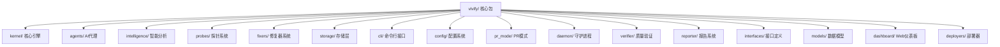
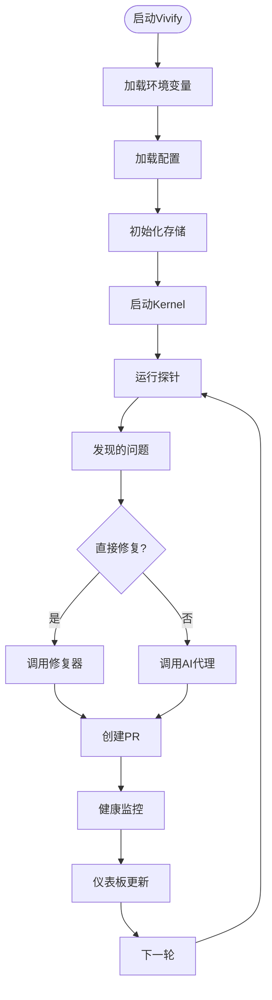
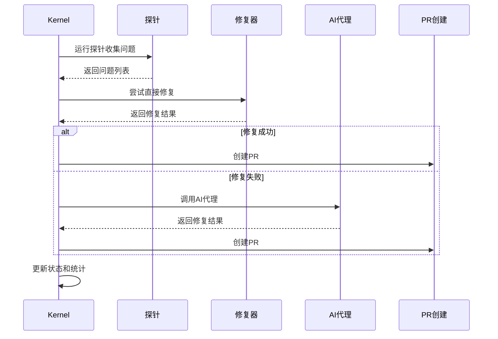
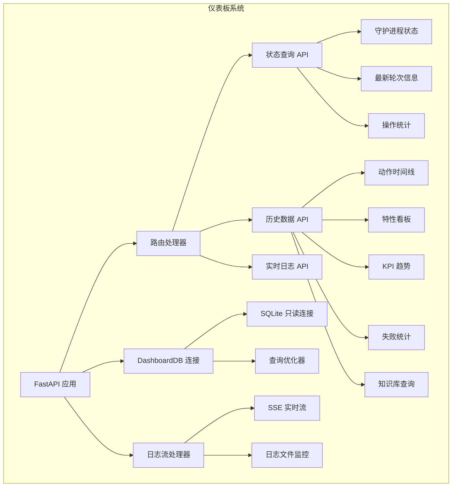
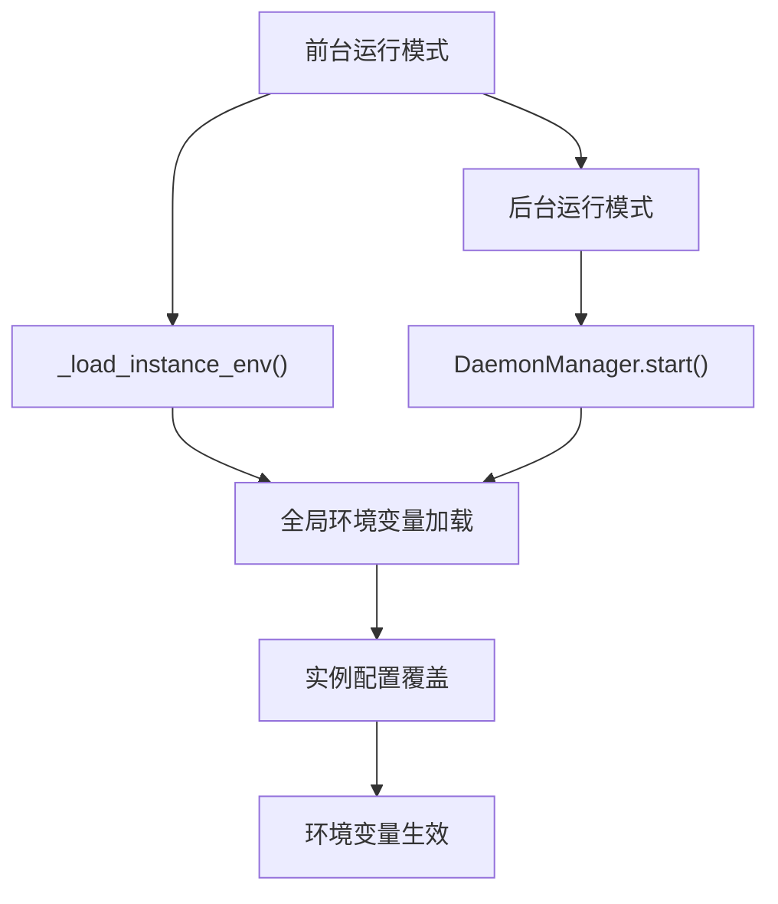
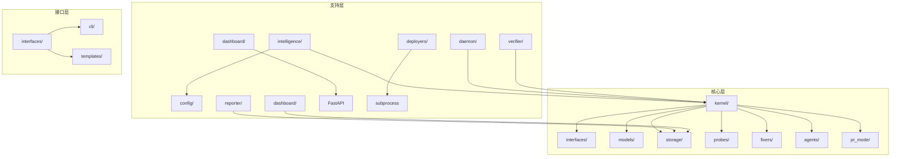

# 技术实现参考

<cite>
**本文引用的文件**
- [pyproject.toml](file://pyproject.toml)
- [.vivify.example.yml](file://.vivify.example.yml)
- [install.sh](file://install.sh)
- [install.ps1](file://install.ps1)
- [vivify/__init__.py](file://vivify/__init__.py)
- [vivify/__main__.py](file://vivify/__main__.py)
- [vivify/cli/main.py](file://vivify/cli/main.py)
- [vivify/config/__init__.py](file://vivify/config/__init__.py)
- [vivify/config/loader.py](file://vivify/config/loader.py)
- [vivify/config/schema.py](file://vivify/config/schema.py)
- [vivify/kernel/__init__.py](file://vivify/kernel/__init__.py)
- [vivify/kernel/loop.py](file://vivify/kernel/loop.py)
- [vivify/agents/qodercli_agent.py](file://vivify/agents/qodercli_agent.py)
- [vivify/intelligence/__init__.py](file://vivify/intelligence/__init__.py)
- [vivify/storage/sqlite_provider.py](file://vivify/storage/sqlite_provider.py)
- [vivify/dashboard/__init__.py](file://vivify/dashboard/__init__.py)
- [vivify/dashboard/app.py](file://vivify/dashboard/app.py)
- [vivify/dashboard/db.py](file://vivify/dashboard/db.py)
- [vivify/dashboard/log_streamer.py](file://vivify/dashboard/log_streamer.py)
- [vivify/dashboard/static/index.html](file://vivify/dashboard/static/index.html)
- [vivify/dashboard/static/app.js](file://vivify/dashboard/static/app.js)
- [vivify/dashboard/static/style.css](file://vivify/dashboard/static/style.css)
- [vivify/cli/dashboard_cmd.py](file://vivify/cli/dashboard_cmd.py)
- [vivify/cli/run_cmd.py](file://vivify/cli/run_cmd.py)
- [vivify/daemon/manager.py](file://vivify/daemon/manager.py)
- [vivify/deployers/command.py](file://vivify/deployers/command.py)
</cite>

## 更新摘要
**所做更改**
- 新增环境变量加载机制增强章节，详细说明_load_instance_env()函数的实现
- 更新CLI运行命令的环境变量处理能力说明
- 增强配置加载器的环境变量覆盖机制描述
- 添加前台运行模式下环境变量加载不一致问题的解决方案
- 扩展环境变量配置的完整实现参考

## 目录
1. [简介](#简介)
2. [项目结构](#项目结构)
3. [核心组件](#核心组件)
4. [架构概览](#架构概览)
5. [详细组件分析](#详细组件分析)
6. [仪表板系统架构](#仪表板系统架构)
7. [配置加载器增强](#配置加载器增强)
8. [环境变量加载机制增强](#环境变量加载机制增强)
9. [依赖关系分析](#依赖关系分析)
10. [性能考虑](#性能考虑)
11. [故障排除指南](#故障排除指南)
12. [结论](#结论)
13. [附录](#附录)

## 简介
本技术实现参考文档面向架构师与高级开发者，系统性阐述 Vivify 品牌重塑后的全新技术架构与实施细节。项目已重构为包含135个文件的完整生态系统，涵盖kernel系统、AI代理、CLI、修复器、探针、存储、智能分析、**仪表板系统**等模块。本文提供精确的改动位置列表与行号对应表，解释技术决策、架构模式与系统约束，涵盖数据流分析、组件交互与集成模式，并给出性能、安全与优化建议，以及故障排除与调试方法。

## 项目结构
本次重构围绕以下核心变更展开：
- 完整的包目录结构：vivify/ 包含 agents、cli、config、daemon、fixers、goals、intelligence、interfaces、kernel、models、pr_mode、probes、reporter、storage、templates、verifier、**dashboard** 等子模块
- 新增135个文件的完整模块体系
- 全新的安装脚本系统：install.sh 和 install.ps1
- 完整的配置系统：.vivify.example.yml 模板
- 增强的AI代理支持：Qoder CLI 集成
- 先进的kernel系统：主循环、调度、升级策略
- 专业化的探针与修复器框架
- **全新的Web仪表板系统：实时监控与可视化界面**
- **增强的环境变量加载机制：解决前台运行模式下环境变量加载不一致问题**



**章节来源**
- [vivify/__init__.py:1-21](file://vivify/__init__.py#L1-L21)
- [pyproject.toml:46-48](file://pyproject.toml#L46-L48)

## 核心组件
- **kernel系统**：主循环协调器，负责探测、修复、升级策略和健康监控
- **AI代理**：Qoder CLI 集成，支持并发控制和超时管理
- **探针系统**：12种内置探针，用于代码质量、CI状态、依赖漏洞等检测
- **修复器系统**：7种内置修复器，包括依赖更新、格式化、测试重试等
- **智能分析**：项目扫描、场景分类、配置推荐
- **存储系统**：SQLite默认实现，支持迁移和并发访问
- **CLI系统**：完整的命令行接口，支持初始化、运行、诊断等功能
- **配置系统**：基于Pydantic的类型安全配置，支持环境变量覆盖
- **仪表板系统**：FastAPI驱动的Web监控面板，提供实时可视化界面
- **部署系统**：CommandDeployer支持自定义部署命令和环境变量配置

**章节来源**
- [vivify/kernel/__init__.py:1-50](file://vivify/kernel/__init__.py#L1-L50)
- [vivify/agents/qodercli_agent.py:1-218](file://vivify/agents/qodercli_agent.py#L1-L218)
- [vivify/intelligence/__init__.py:1-28](file://vivify/intelligence/__init__.py#L1-L28)
- [vivify/storage/sqlite_provider.py:1-453](file://vivify/storage/sqlite_provider.py#L1-L453)
- [vivify/dashboard/app.py:1-166](file://vivify/dashboard/app.py#L1-L166)
- [vivify/deployers/command.py:1-78](file://vivify/deployers/command.py#L1-L78)

## 架构概览
Vivify采用分层架构设计，从底层存储到顶层AI代理形成清晰的职责分离。kernel作为核心编排器，协调各个子系统的协作，实现了"探测-修复-升级"的智能循环。**新增的仪表板系统通过RESTful API和WebSocket实现实时数据展示**。**增强的环境变量加载机制确保前台和后台运行模式下环境变量的一致性**。



**图表来源**
- [vivify/kernel/loop.py:250-267](file://vivify/kernel/loop.py#L250-L267)
- [vivify/kernel/loop.py:284-343](file://vivify/kernel/loop.py#L284-L343)
- [vivify/dashboard/app.py:38-66](file://vivify/dashboard/app.py#L38-L66)

**章节来源**
- [vivify/kernel/loop.py:1-536](file://vivify/kernel/loop.py#L1-L536)

## 详细组件分析

### Kernel核心引擎
Kernel是整个系统的心脏，负责协调探测、修复、升级和健康监控的完整循环。其设计采用状态机模式，通过DispatchState管理问题处理状态，通过FailureTracker跟踪失败情况，通过Escalator实现问题升级策略。



**图表来源**
- [vivify/kernel/loop.py:250-430](file://vivify/kernel/loop.py#L250-L430)

**章节来源**
- [vivify/kernel/loop.py:119-536](file://vivify/kernel/loop.py#L119-L536)

### AI代理集成
QoderCliAgent实现了CodingAgent接口，提供了对Qoder CLI的强大集成。该组件支持并发控制、超时管理、工作空间信任机制等高级特性。

**关键特性**：
- 并发槽位管理：通过wait_for_slot控制最大并发进程数
- 超时保护：支持硬性超时和软性超时配置
- 工作空间管理：自动信任新工作空间，支持自定义二进制路径
- 环境隔离：通过AGENT_ENV_TAG标记子进程

**章节来源**
- [vivify/agents/qodercli_agent.py:51-218](file://vivify/agents/qodercli_agent.py#L51-L218)

### 智能分析模块
intelligence包提供了完整的项目智能分析能力，包括项目扫描、场景分类、配置推荐和交互式问答。

**核心功能**：
- Scanner：项目信号检测和分析
- Classifier：项目类型和场景识别
- Configurator：基于场景的配置生成
- Interviewer：交互式配置问答
- AIAnalyzer：AI驱动的深度分析

**章节来源**
- [vivify/intelligence/__init__.py:1-28](file://vivify/intelligence/__init__.py#L1-L28)

### 存储系统
SqliteStorageProvider提供了线程安全的SQLite存储实现，支持完整的数据库迁移机制和并发访问控制。

**设计特点**：
- WAL模式：提高并发读取性能
- 迁移系统：自动应用SQL迁移文件
- 线程安全：使用重入锁保护连接
- 类型安全：完整的数据模型映射

**章节来源**
- [vivify/storage/sqlite_provider.py:56-453](file://vivify/storage/sqlite_provider.py#L56-L453)

### CLI系统重构
CLI系统经过完全重构，提供了更丰富的命令行接口和更好的用户体验。

**新增功能**：
- 完整的子命令体系：init、run、doctor、goals、probes、fixers、features、logs、daemon、**dashboard**
- 参数验证：基于argparse的完整参数处理
- 输出格式化：支持详细和简洁两种输出模式
- 配置管理：支持自定义配置文件路径
- **增强的环境变量处理：前台运行模式下的环境变量加载**

**章节来源**
- [vivify/cli/main.py:1-58](file://vivify/cli/main.py#L1-L58)

### 安装脚本系统
新增了完整的跨平台安装脚本，支持POSIX和Windows环境的一键安装。

**install.sh特性**：
- 操作系统检测：支持macOS、Linux、WSL
- Python版本检查：要求Python >= 3.10
- 失败回退：PyPI安装失败时自动回退到GitHub源码安装
- 外部依赖验证：检查git、gh、qodercli、GH_TOKEN

**install.ps1特性**：
- PowerShell原生实现
- 错误处理和彩色输出
- 用户基础路径检测和提示

**章节来源**
- [install.sh:1-220](file://install.sh#L1-L220)
- [install.ps1:1-210](file://install.ps1#L1-L210)

## 仪表板系统架构

**更新** 新增完整的Web仪表板系统，提供实时监控和可视化界面

Vivify的仪表板系统是一个基于FastAPI的Web应用，提供实时的状态监控、历史数据展示和交互式界面。系统采用前后端分离架构，后端通过RESTful API提供数据接口，前端使用纯JavaScript实现动态界面更新。

### 系统架构设计



**图表来源**
- [vivify/dashboard/app.py:15-166](file://vivify/dashboard/app.py#L15-L166)
- [vivify/dashboard/db.py:9-137](file://vivify/dashboard/db.py#L9-L137)

### 核心组件分析

#### DashboardDB 只读数据库访问层
DashboardDB实现了专门的只读数据库连接，确保仪表板不会修改任何数据。该组件使用SQLite的query_only模式，防止意外的数据写入操作。

**关键特性**：
- 只读连接：启用PRAGMA query_only = ON
- 延迟初始化：数据库文件不存在时也能启动应用
- 查询优化：针对仪表板查询场景的SQL优化
- 连接池：支持多并发查询请求

**章节来源**
- [vivify/dashboard/db.py:9-24](file://vivify/dashboard/db.py#L9-L24)

#### FastAPI 应用入口
仪表板应用通过create_app工厂函数创建，支持动态配置状态目录。应用采用模块化设计，每个API端点都有明确的功能职责。

**主要API端点**：
- `/api/status`：获取守护进程状态和最新轮次信息
- `/api/actions`：查询操作历史和检测结果
- `/api/features`：获取特性请求列表和详情
- `/api/kpi/snapshots`：查询KPI指标快照
- `/api/rounds`：获取运行轮次统计
- `/api/failures`：查询失败统计
- `/api/knowledge`：查询知识库条目
- `/api/logs/stream`：SSE实时日志流

**章节来源**
- [vivify/dashboard/app.py:15-166](file://vivify/dashboard/app.py#L15-L166)

#### 实时日志流系统
仪表板集成了基于Server-Sent Events (SSE)的实时日志流功能，提供接近实时的日志监控体验。

**技术实现**：
- 异步生成器：tail_log函数实现非阻塞日志读取
- 自动重连：客户端断开后自动重新连接
- 流量控制：限制日志行数，防止内存溢出
- 编码处理：支持UTF-8编码和错误字符处理

**章节来源**
- [vivify/dashboard/log_streamer.py:9-25](file://vivify/dashboard/log_streamer.py#L9-L25)

### 前端界面设计

仪表板前端采用响应式设计，支持多种设备访问。界面包含多个标签页，分别展示不同类型的监控信息。

**界面组件**：
- **概览页**：显示守护进程状态、最新轮次、操作统计和特性进度
- **问题页**：展示检测到的问题，支持按级别和分类过滤
- **动作页**：以时间轴形式展示所有操作历史
- **特性页**：看板形式展示特性请求的开发状态
- **趋势页**：图表展示KPI指标和操作成功率趋势

**章节来源**
- [vivify/dashboard/static/index.html:1-130](file://vivify/dashboard/static/index.html#L1-L130)
- [vivify/dashboard/static/app.js:1-272](file://vivify/dashboard/static/app.js#L1-L272)
- [vivify/dashboard/static/style.css:1-140](file://vivify/dashboard/static/style.css#L1-L140)

### CLI集成

仪表板系统通过独立的CLI命令启动，支持自定义主机、端口和自动浏览器打开功能。

**命令行选项**：
- `--port`：指定监听端口（默认9120）
- `--host`：指定监听地址（默认127.0.0.1）
- `--no-open`：禁用自动浏览器打开

**依赖管理**：
- 仪表板为可选依赖，需要单独安装：`pip install vivify[dashboard]`
- 使用uvicorn作为ASGI服务器

**章节来源**
- [vivify/cli/dashboard_cmd.py:17-44](file://vivify/cli/dashboard_cmd.py#L17-L44)

## 配置加载器增强

**更新** 增强配置系统，添加环境变量覆盖机制和状态目录查找功能

Vivify的配置系统基于Pydantic实现了类型安全的配置管理，新增了环境变量覆盖功能，支持通过环境变量动态调整配置。

### 配置加载机制


**图表来源**
- [vivify/config/loader.py:57-74](file://vivify/config/loader.py#L57-L74)

### 环境变量覆盖机制

配置加载器支持通过环境变量动态覆盖配置文件中的设置，采用点号分隔的层级结构。

**命名规范**：
- 前缀：`VIVIFY__`（例如：`VIVIFY__agent__qodercli__model`）
- 层级：使用双下划线分隔（如：`agent__qodercli__model`）
- 类型转换：自动识别布尔值、整数、浮点数和字符串

**类型转换规则**：
- `"true"`/`"false"` → 布尔值
- 可解析为整数的字符串 → 整数
- 可解析为浮点数的字符串 → 浮点数
- 其他 → 字符串

**章节来源**
- [vivify/config/loader.py:13-41](file://vivify/config/loader.py#L13-L41)

### 状态目录查找

新增了`find_state_dir`函数，支持在项目树中向上查找`.vivify`状态目录，便于在子目录中运行仪表板。

**查找逻辑**：
- 从指定路径开始，逐级向上搜索
- 支持从当前工作目录开始查找
- 返回第一个找到的`.vivify`目录路径

**章节来源**
- [vivify/config/loader.py:44-54](file://vivify/config/loader.py#L44-L54)

### 配置验证和默认值

所有配置项都通过Pydantic进行类型验证，确保配置的正确性和完整性。配置系统提供了合理的默认值，支持最小化配置文件。

**配置层次**：
- 顶级配置：mode、interval_seconds、state_dir等
- 子模块配置：agent、storage、github、probes等
- 项目元数据：name、description、type、language等

**章节来源**
- [vivify/config/schema.py:171-193](file://vivify/config/schema.py#L171-L193)

## 环境变量加载机制增强

**新增** 详细说明环境变量加载机制的增强，解决前台运行模式下环境变量加载不一致的问题

Vivify的环境变量加载机制经过重大增强，解决了前台运行模式下环境变量加载不一致的问题。新增的`_load_instance_env()`函数确保前台运行模式与后台运行模式具有相同的环境变量处理行为。

### 环境变量加载策略



**图表来源**
- [vivify/cli/run_cmd.py:36-74](file://vivify/cli/run_cmd.py#L36-L74)
- [vivify/daemon/manager.py:62-93](file://vivify/daemon/manager.py#L62-L93)

### _load_instance_env() 函数实现

`_load_instance_env()`函数实现了与后台运行模式完全一致的环境变量加载逻辑，确保两种运行模式的行为一致性。

**加载顺序**：
1. **全局环境变量加载**：从`~/.vivify/env`文件加载全局环境变量
2. **实例配置覆盖**：从`.vivify.yml`配置文件读取GitHub令牌配置
3. **环境变量映射**：将实例令牌映射到标准环境变量名称

**关键特性**：
- 使用`os.environ.setdefault()`避免覆盖已存在的环境变量
- 支持自定义GitHub令牌环境变量名称映射
- 异常处理：配置读取失败不影响启动流程
- 编码处理：使用UTF-8编码读取环境文件

**章节来源**
- [vivify/cli/run_cmd.py:36-74](file://vivify/cli/run_cmd.py#L36-L74)

### DaemonManager 环境变量处理

DaemonManager在后台启动时同样实现了环境变量加载逻辑，确保两种运行模式的一致性。

**处理步骤**：
1. 继承当前进程的环境变量
2. 从`~/.vivify/env`文件加载全局配置
3. 从`.vivify.yml`配置文件读取实例配置
4. GitHub令牌环境变量映射处理

**章节来源**
- [vivify/daemon/manager.py:62-93](file://vivify/daemon/manager.py#L62-L93)

### CommandDeployer 环境变量配置

CommandDeployer支持自定义部署命令的环境变量配置，继承并扩展了全局环境变量。

**配置机制**：
- 继承当前进程的完整环境变量
- 从`~/.vivify/env`文件加载全局配置
- 支持部署命令的独立环境变量处理

**章节来源**
- [vivify/deployers/command.py:66-77](file://vivify/deployers/command.py#L66-L77)

### 环境变量文件格式

环境变量文件采用简单的键值对格式，支持注释和空行。

**文件格式规范**：
- 每行一个环境变量定义
- 使用`=`分隔键和值
- 以`#`开头的行视为注释
- 忽略空行和空白字符

**示例格式**：
```
# GitHub配置
GH_TOKEN=your_github_token
GH_ENTERPRISE_TOKEN=your_enterprise_token

# 其他配置
DEBUG=true
LOG_LEVEL=INFO
```

**章节来源**
- [vivify/cli/run_cmd.py:42-52](file://vivify/cli/run_cmd.py#L42-L52)
- [vivify/daemon/manager.py:64-70](file://vivify/daemon/manager.py#L64-L70)
- [vivify/deployers/command.py:70-76](file://vivify/deployers/command.py#L70-L76)

## 依赖关系分析
Vivify采用了清晰的分层依赖结构，每个模块都有明确的职责边界和依赖关系。



**图表来源**
- [vivify/__init__.py:3-16](file://vivify/__init__.py#L3-L16)
- [vivify/kernel/__init__.py:2-24](file://vivify/kernel/__init__.py#L2-L24)

**章节来源**
- [vivify/__init__.py:1-21](file://vivify/__init__.py#L1-L21)
- [vivify/kernel/__init__.py:1-50](file://vivify/kernel/__init__.py#L1-L50)

## 性能考虑
- **并发控制**：QoderCliAgent通过槽位管理限制并发，避免资源争用
- **数据库优化**：SQLite使用WAL模式和适当的索引策略
- **内存管理**：Kernel使用状态机减少内存占用
- **I/O优化**：批量操作和连接池复用
- **缓存策略**：探针结果缓存和历史记录复用
- **仪表板优化**：数据库连接延迟初始化，避免不必要的资源占用
- **实时流控制**：日志流限制行数，防止内存泄漏
- **环境变量加载优化**：使用`setdefault()`避免重复加载，提升性能

## 故障排除指南
- **安装失败**：检查Python版本和pip可用性，查看install脚本输出
- **配置加载错误**：验证.vivify.yml语法，检查路径权限
- **探针执行失败**：检查外部工具依赖和权限设置
- **AI代理超时**：调整超时配置或减少并发进程数
- **数据库连接问题**：检查SQLite文件权限和磁盘空间
- **仪表板启动失败**：确认已安装dashboard可选依赖，检查端口占用
- **日志流断开**：检查日志文件是否存在和可读权限
- **环境变量加载失败**：检查~/.vivify/env文件格式和权限，验证配置文件语法
- **GitHub令牌无效**：确认令牌权限和有效期，检查环境变量映射配置

**章节来源**
- [install.sh:147-160](file://install.sh#L147-L160)
- [vivify/agents/qodercli_agent.py:156-170](file://vivify/agents/qodercli_agent.py#L156-L170)
- [vivify/cli/dashboard_cmd.py:18-25](file://vivify/cli/dashboard_cmd.py#L18-L25)
- [vivify/cli/run_cmd.py:36-74](file://vivify/cli/run_cmd.py#L36-L74)

## 结论
Vivify项目已完成从auto-heal到vivify的品牌重塑和技术重构，形成了一个功能完整、架构清晰的智能项目管理系统。通过135个文件的精心设计和实现，项目展现了现代化软件工程的最佳实践，包括分层架构、接口抽象、并发控制、持久化存储等关键技术点。

**新增的仪表板系统进一步增强了项目的可观测性和可运维性**，通过实时监控和可视化界面，为用户提供了全面的项目状态洞察。**增强的配置加载器支持环境变量覆盖，提高了配置的灵活性和部署便利性**。**最关键的环境变量加载机制增强解决了前台运行模式下环境变量加载不一致的问题，确保了系统在不同运行模式下的一致性和可靠性**。

新的架构不仅提升了系统的可维护性和扩展性，还为未来的功能增强奠定了坚实基础。仪表板系统、配置增强、环境变量机制和核心功能的完美结合，使得Vivify成为了一个真正意义上的智能项目管理系统。

## 附录

### 安装和配置指南
- **一键安装**：curl -fsSL https://raw.githubusercontent.com/pinsonchen/vivify/main/install.sh | sh
- **初始化项目**：vivify init --repo /path/to/repo
- **启动仪表板**：vivify dashboard --port 9120 --host 0.0.0.0
- **前台运行**：vivify run --once 或 vivify run
- **查看帮助**：vivify --help
- **配置文件**：.vivify.yml（示例：.vivify.example.yml）

### 核心命令参考
- **vivify init**：初始化项目配置
- **vivify run**：运行一次检测和修复（前台模式）
- **vivify daemon**：启动守护进程模式
- **vivify doctor**：诊断和健康检查
- **vivify goals**：目标管理和分解
- **vivify probes**：探针管理和测试
- **vivify fixers**：修复器管理和测试
- **vivify features**：功能请求管理和跟踪
- **vivify logs**：日志查看和管理
- **vivify dashboard**：启动Web仪表板

### 配置选项详解
- **agent.qodercli**：AI代理配置，包括模型选择、并发控制、超时设置
- **probes.enabled**：启用的探针列表，默认包含12种内置探针
- **fixers.enabled**：启用的修复器列表，默认包含7种内置修复器
- **pr_mode**：PR创建和管理配置，包括分支前缀、标签、自动合并
- **storage.sqlite**：SQLite存储配置，包括数据库文件路径
- **kpi_monitor**：KPI监控配置，包括检查间隔和降级阈值
- **dashboard**：仪表板配置，包括端口、主机、自动打开浏览器
- **github**：GitHub集成配置，包括令牌和仓库设置

### 环境变量覆盖示例
- `VIVIFY__agent__qodercli__model=ultimate`
- `VIVIFY__storage__sqlite__path=.vivify/state.db`
- `VIVIFY__probes__enabled=["ci_status","dependency_vulnerabilities"]`

### 环境变量文件格式
- **文件位置**：`~/.vivify/env`
- **格式**：`KEY=VALUE`（每行一个）
- **注释**：以`#`开头的行
- **示例**：
  ```
  GH_TOKEN=your_github_token
  DEBUG=true
  LOG_LEVEL=INFO
  ```

**章节来源**
- [.vivify.example.yml:1-96](file://.vivify.example.yml#L1-L96)
- [pyproject.toml:36-38](file://pyproject.toml#L36-L38)
- [vivify/config/loader.py:13-41](file://vivify/config/loader.py#L13-L41)
- [vivify/cli/run_cmd.py:36-74](file://vivify/cli/run_cmd.py#L36-L74)
- [vivify/daemon/manager.py:62-93](file://vivify/daemon/manager.py#L62-L93)