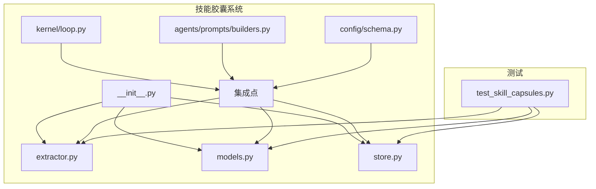
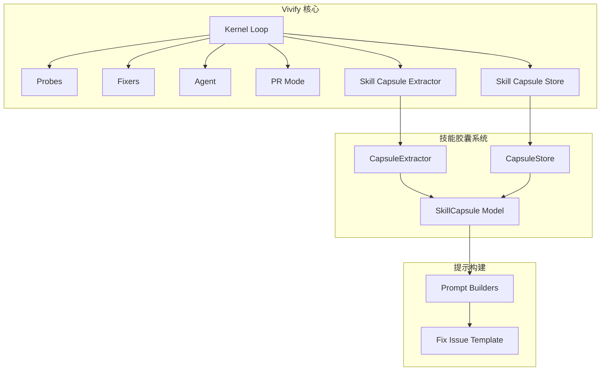
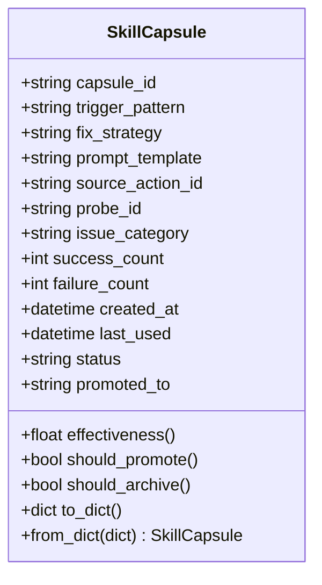
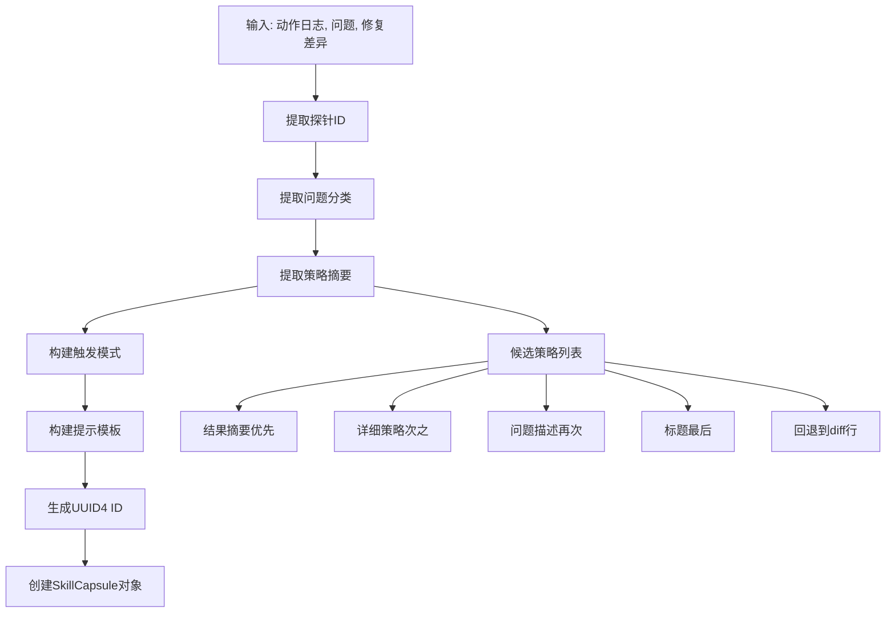
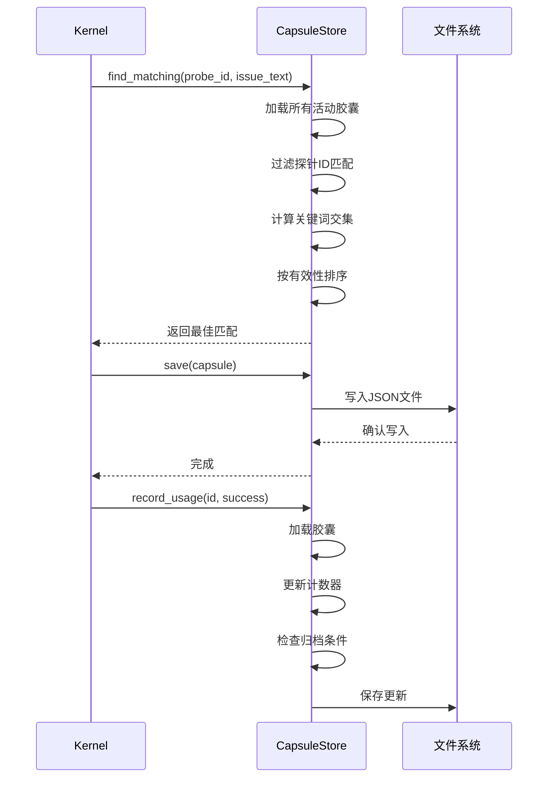
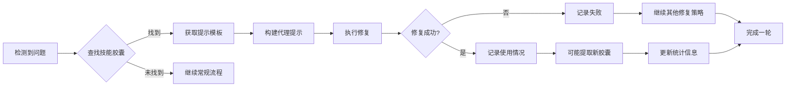
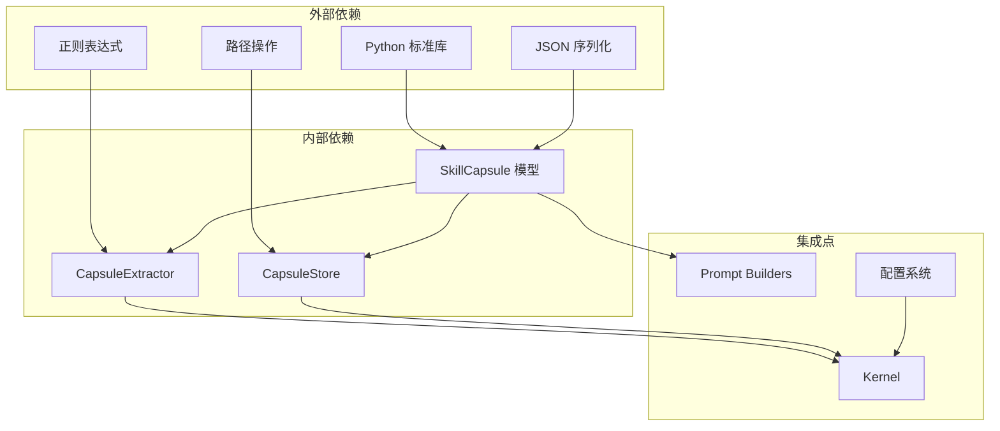

# 技能胶囊系统

<cite>
**本文档引用的文件**
- [vivify/capsules/__init__.py](file://vivify/capsules/__init__.py)
- [vivify/capsules/extractor.py](file://vivify/capsules/extractor.py)
- [vivify/capsules/models.py](file://vivify/capsules/models.py)
- [vivify/capsules/store.py](file://vivify/capsules/store.py)
- [tests/unit/test_skill_capsules.py](file://tests/unit/test_skill_capsules.py)
- [vivify/kernel/loop.py](file://vivify/kernel/loop.py)
- [vivify/agents/prompts/builders.py](file://vivify/agents/prompts/builders.py)
- [vivify/agents/prompts/templates/fix_issue.md.j2](file://vivify/agents/prompts/templates/fix_issue.md.j2)
- [vivify/config/schema.py](file://vivify/config/schema.py)
</cite>

## 更新摘要
**变更内容**
- 新增了完整的技能胶囊提取器架构，支持从成功修复中自动提取可复用的修复策略
- 增强了存储器功能，支持JSON文件持久化和智能匹配算法
- 完善了生命周期管理系统，包括自动提升和归档机制
- 深度集成了内核循环，实现在修复流程中的自动应用和提取
- 新增了配置系统支持，允许用户自定义技能胶囊行为

## 目录
1. [简介](#简介)
2. [项目结构](#项目结构)
3. [核心组件](#核心组件)
4. [架构概览](#架构概览)
5. [详细组件分析](#详细组件分析)
6. [依赖关系分析](#依赖关系分析)
7. [性能考虑](#性能考虑)
8. [故障排除指南](#故障排除指南)
9. [结论](#结论)

## 简介

技能胶囊系统是 Vivify 项目中的一个关键子系统，旨在通过学习和复用成功的修复策略来提高自动化修复的效率。该系统的核心思想是将成功的代理修复过程转化为可重用的"技能胶囊"，这些胶囊可以在未来遇到类似问题时提供快速路径上下文。

系统设计遵循以下核心原则：
- **纯规则驱动提取**：不依赖大型语言模型，保持快速路径的低成本
- **JSON磁盘存储**：使用 `.vivify/capsules/` 目录进行持久化存储
- **默认开启但无害**：当目录为空时完全向后兼容
- **智能匹配机制**：基于探针ID和关键词的模糊匹配
- **生命周期管理**：自动化的提升和归档机制

## 项目结构

技能胶囊系统位于 `vivify/capsules/` 目录下，包含四个主要模块：

**图表来源**
- [vivify/capsules/__init__.py:1-21](file://vivify/capsules/__init__.py#L1-L21)
- [vivify/capsules/extractor.py:1-132](file://vivify/capsules/extractor.py#L1-L132)
- [vivify/capsules/models.py:1-90](file://vivify/capsules/models.py#L1-L90)
- [vivify/capsules/store.py:1-151](file://vivify/capsules/store.py#L1-L151)

**章节来源**
- [vivify/capsules/__init__.py:1-21](file://vivify/capsules/__init__.py#L1-L21)

## 核心组件

技能胶囊系统由三个核心组件构成：

### 1. SkillCapsule 数据模型
负责封装单个技能胶囊的所有信息，包括：
- 唯一标识符（UUID4）
- 触发模式（探针ID + 问题特征描述）
- 修复策略摘要（人类可读）
- 提示模板（注入到代理提示中的模板片段）
- 源动作ID、探针ID、问题分类
- 使用统计信息（成功/失败计数、最后使用时间）
- 生命周期状态管理（active/promoted/archived）

### 2. CapsuleExtractor 提取器
从成功的修复记录中提取技能胶囊，包含：
- 策略摘要提取（优先级：结果摘要 > 详细策略 > 问题描述 > 标题）
- 触发模式构建（探针ID + 关键词）
- 提示模板生成（包含来源信息和适用性说明）
- 智能截断以控制磁盘使用

### 3. CapsuleStore 存储器
管理技能胶囊的持久化存储和检索：
- JSON文件格式存储
- 基于探针ID的精确匹配
- 基于关键词的模糊匹配
- 使用统计和生命周期管理
- 错误处理和数据完整性保护

**章节来源**
- [vivify/capsules/models.py:9-90](file://vivify/capsules/models.py#L9-L90)
- [vivify/capsules/extractor.py:83-132](file://vivify/capsules/extractor.py#L83-L132)
- [vivify/capsules/store.py:26-151](file://vivify/capsules/store.py#L26-L151)

## 架构概览

技能胶囊系统在整个 Vivify 架构中的位置如下：

**图表来源**
- [vivify/kernel/loop.py:287-512](file://vivify/kernel/loop.py#L287-L512)
- [vivify/agents/prompts/builders.py:40-82](file://vivify/agents/prompts/builders.py#L40-L82)

系统的工作流程：

1. **提取阶段**：成功修复后，Kernel 调用 CapsuleExtractor 从动作日志中提取技能胶囊
2. **存储阶段**：提取的胶囊保存到 JSON 文件中
3. **匹配阶段**：当检测到新问题时，Kernel 查找匹配的技能胶囊
4. **注入阶段**：找到的胶囊提示模板被注入到代理提示中
5. **使用追踪**：记录胶囊的使用效果，自动管理生命周期

**章节来源**
- [vivify/kernel/loop.py:427-512](file://vivify/kernel/loop.py#L427-L512)

## 详细组件分析

### SkillCapsule 数据模型

**图表来源**
- [vivify/capsules/models.py:9-90](file://vivify/capsules/models.py#L9-L90)

SkillCapsule 类实现了完整的生命周期管理：
- **有效性计算**：基于成功率的动态评估
- **提升判断**：达到阈值时建议提升到原生项目能力
- **归档机制**：长期有效的胶囊自动归档
- **序列化支持**：完整的 JSON 序列化和反序列化

### CapsuleExtractor 提取器

**图表来源**
- [vivify/capsules/extractor.py:38-128](file://vivify/capsules/extractor.py#L38-L128)

提取器的关键特性：
- **多层策略提取**：提供多种策略摘要来源的优先级
- **智能截断**：控制文本长度以优化磁盘使用
- **关键词提取**：从标题中提取有意义的关键词
- **回退机制**：当所有来源都不可用时使用diff内容

### CapsuleStore 存储器

**图表来源**
- [vivify/capsules/store.py:92-147](file://vivify/capsules/store.py#L92-L147)

存储器的匹配算法：
1. **精确探针匹配**：首先筛选探针ID完全匹配的胶囊
2. **关键词模糊匹配**：检查问题文本与触发模式的关键词交集
3. **评分排序**：优先选择有效性最高的胶囊，相同有效性时选择成功次数多的

### Kernel 集成点

**图表来源**
- [vivify/kernel/loop.py:427-512](file://vivify/kernel/loop.py#L427-L512)

Kernel 中的技能胶囊集成包括：
- **初始化**：根据配置启用技能胶囊功能
- **查找**：在检测阶段查找匹配的技能胶囊
- **注入**：将胶囊提示注入到代理提示构建中
- **追踪**：记录每次使用的效果
- **提取**：在成功修复后提取新的技能胶囊

**章节来源**
- [vivify/kernel/loop.py:407-512](file://vivify/kernel/loop.py#L407-L512)

## 依赖关系分析

技能胶囊系统的依赖关系相对简单且内聚：

**图表来源**
- [vivify/capsules/models.py:1-90](file://vivify/capsules/models.py#L1-L90)
- [vivify/capsules/extractor.py:1-132](file://vivify/capsules/extractor.py#L1-L132)
- [vivify/capsules/store.py:1-151](file://vivify/capsules/store.py#L1-L151)

主要依赖特点：
- **低耦合**：各组件之间没有直接依赖关系
- **清晰边界**：每个组件职责单一且明确
- **易测试性**：所有组件都可以独立测试
- **向后兼容**：即使禁用也能正常工作

**章节来源**
- [vivify/capsules/__init__.py:16-20](file://vivify/capsules/__init__.py#L16-L20)

## 性能考虑

技能胶囊系统在设计时充分考虑了性能因素：

### 存储性能
- **JSON文件格式**：轻量级存储，读写开销小
- **磁盘I/O优化**：批量加载和懒加载策略
- **文件命名安全**：防止特殊字符逃逸目录

### 匹配性能
- **预过滤**：先按探针ID精确匹配，减少搜索范围
- **关键词索引**：使用集合操作进行快速关键词匹配
- **评分缓存**：避免重复计算有效性

### 内存管理
- **惰性加载**：只有在需要时才加载胶囊文件
- **对象池化**：复用字符串和集合对象
- **内存限制**：通过截断控制文本长度

### 并发安全
- **文件锁定**：避免并发写入冲突
- **原子操作**：确保数据一致性
- **错误恢复**：损坏文件不影响整体系统

## 故障排除指南

### 常见问题及解决方案

#### 1. 技能胶囊无法加载
**症状**：系统报告找不到技能胶囊或加载失败
**原因**：
- JSON文件格式错误
- 文件权限问题
- 路径配置错误

**解决方法**：
- 检查 `.vivify/capsules/` 目录权限
- 验证JSON文件格式正确性
- 确认配置中的路径设置

#### 2. 匹配结果不准确
**症状**：系统无法找到合适的技能胶囊
**原因**：
- 探针ID不匹配
- 关键词提取不足
- 触发模式过于严格

**解决方法**：
- 检查问题的探针ID设置
- 增加问题描述的详细程度
- 调整匹配阈值

#### 3. 性能问题
**症状**：系统响应缓慢
**原因**：
- 胶囊文件过多
- 磁盘I/O瓶颈
- 正则表达式复杂度高

**解决方法**：
- 清理归档的技能胶囊
- 优化磁盘存储位置
- 简化触发模式

**章节来源**
- [tests/unit/test_skill_capsules.py:172-181](file://tests/unit/test_skill_capsules.py#L172-L181)

### 调试技巧

1. **启用详细日志**：查看技能胶囊相关的调试信息
2. **检查文件完整性**：验证JSON文件的完整性和格式
3. **监控磁盘空间**：确保 `.vivify/capsules/` 目录有足够的空间
4. **验证配置**：确认技能胶囊配置正确启用

## 结论

技能胶囊系统是一个设计精良的自动化学习和复用子系统。它通过以下方式为 Vivify 项目提供了显著的价值：

### 主要优势
- **高效的学习机制**：能够从成功修复中快速提取可复用的知识
- **低成本的实现**：纯规则驱动，避免了昂贵的AI调用
- **灵活的存储方案**：JSON文件格式便于管理和备份
- **智能的匹配算法**：结合精确和模糊匹配提高准确性
- **完整的生命周期管理**：自动化的提升和归档机制

### 设计亮点
- **模块化设计**：三个核心组件职责清晰，易于维护
- **向后兼容**：即使禁用也能完全正常运行
- **深度集成**：与内核循环无缝集成，实现实时应用
- **完善的测试覆盖**：全面的单元测试确保系统稳定性

### 应用前景
技能胶囊系统为未来的自动化修复提供了坚实的基础，可以进一步扩展支持：
- 更复杂的匹配算法
- 分布式存储和共享
- 机器学习增强的策略
- 多模态内容支持

该系统体现了现代软件工程的最佳实践，是一个值得学习和借鉴的设计范例。