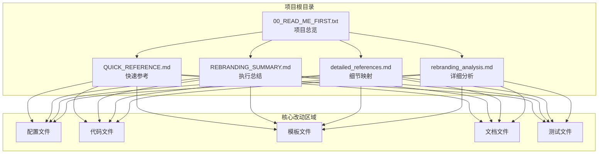
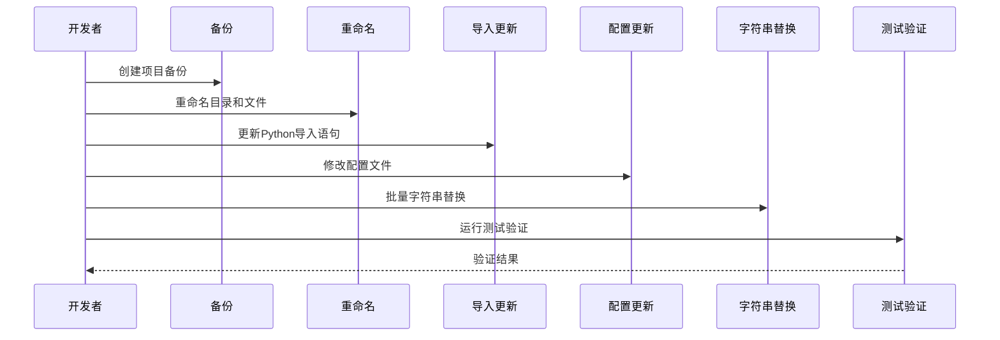
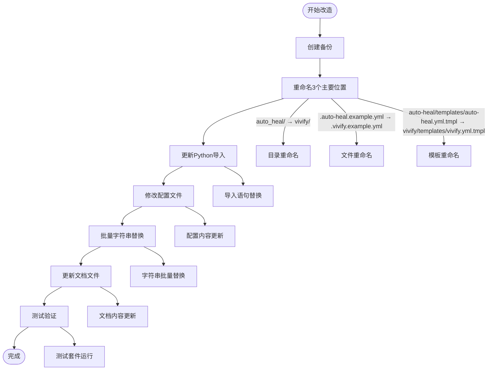
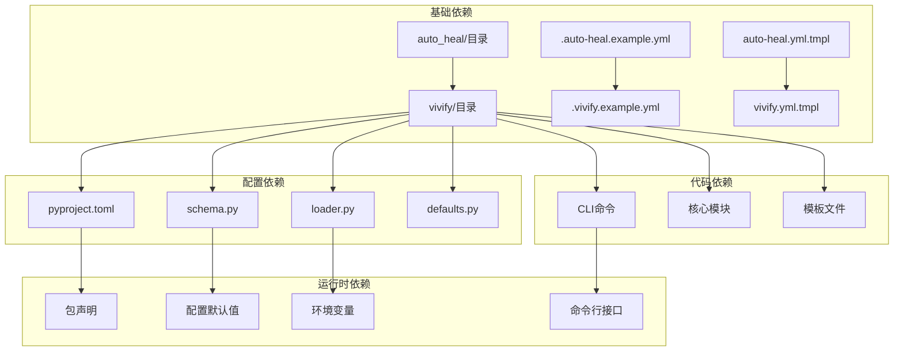
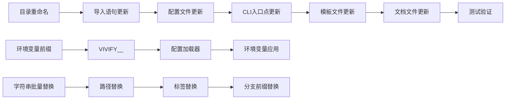

# 数据映射表格

<cite>
**本文档引用的文件**
- [00_READ_ME_FIRST.txt](file://00_READ_ME_FIRST.txt)
- [QUICK_REFERENCE.md](file://QUICK_REFERENCE.md)
- [REBRANDING_SUMMARY.md](file://REBRANDING_SUMMARY.md)
- [detailed_references.md](file://detailed_references.md)
- [rebranding_analysis.md](file://rebranding_analysis.md)
</cite>

## 目录
1. [简介](#简介)
2. [项目结构概览](#项目结构概览)
3. [核心组件](#核心组件)
4. [架构总览](#架构总览)
5. [详细组件分析](#详细组件分析)
6. [依赖关系分析](#依赖关系分析)
7. [性能考虑](#性能考虑)
8. [故障排除指南](#故障排除指南)
9. [结论](#结论)
10. [附录](#附录)

## 简介

本文档提供了Vivify项目品牌重塑过程中数据映射表格的完整技术参考。该映射表格详细记录了从auto-heal到vivify的所有改动位置，包括文件重命名、代码替换、配置更新等关键变更。

Vivify是一个自增长型AI代理项目，需要从"auto-heal"完全改名为"vivify"。本次改造涉及约477处grep匹配，覆盖配置文件、代码文件、模板文件、文档文件等多个方面。

## 项目结构概览



**图表来源**
- [00_READ_ME_FIRST.txt:1-259](file://00_READ_ME_FIRST.txt#L1-L259)
- [QUICK_REFERENCE.md:1-285](file://QUICK_REFERENCE.md#L1-L285)
- [REBRANDING_SUMMARY.md:1-311](file://REBRANDING_SUMMARY.md#L1-L311)

**章节来源**
- [00_READ_ME_FIRST.txt:1-259](file://00_READ_ME_FIRST.txt#L1-L259)
- [QUICK_REFERENCE.md:1-285](file://QUICK_REFERENCE.md#L1-L285)
- [REBRANDING_SUMMARY.md:1-311](file://REBRANDING_SUMMARY.md#L1-L311)

## 核心组件

### 改造范围分类

根据优先级和影响程度，Vivify改造分为四个主要类别：

| 优先级 | 类别 | 文件数量 | 主要内容 | 影响范围 |
|--------|------|----------|----------|----------|
| P0 | 目录重命名 | 3个 | auto_heal/ → vivify/ | 所有导入和路径引用 |
| P1 | 配置文件 | 7个 | pyproject.toml, schema.py等 | 包声明、入口点、配置默认值 |
| P2 | CLI相关 | 10个+ | 各种子命令、入口点 | 命令行接口、帮助文本 |
| P3 | 核心模块 | 15+个 | agents, kernel, probes等 | 运行时功能、环境变量 |

### 改动总量统计


**章节来源**
- [00_READ_ME_FIRST.txt:118-144](file://00_READ_ME_FIRST.txt#L118-L144)
- [REBRANDING_SUMMARY.md:41-143](file://REBRANDING_SUMMARY.md#L41-L143)

## 架构总览

### 改造执行流程



**图表来源**
- [REBRANDING_SUMMARY.md:146-257](file://REBRANDING_SUMMARY.md#L146-L257)
- [QUICK_REFERENCE.md:13-16](file://QUICK_REFERENCE.md#L13-L16)

### 数据流映射



**图表来源**
- [REBRANDING_SUMMARY.md:146-257](file://REBRANDING_SUMMARY.md#L146-L257)
- [detailed_references.md:3-12](file://detailed_references.md#L3-L12)

## 详细组件分析

### 配置文件映射表

#### pyproject.toml配置映射

| 行号 | 字段 | 当前值 | 改为 | 说明 |
|------|------|--------|------|------|
| 6 | name | `"auto-heal-cli"` | `"vivify-cli"` | PyPI包名 |
| 12 | authors | `[{ name = "auto-heal contributors" }]` | `[{ name = "vivify contributors" }]` | 作者信息 |
| 37 | scripts | `auto-heal = "auto_heal.cli.main:cli"` | `vivify = "vivify.cli.main:cli"` | CLI入口点 |
| 40 | Homepage | `https://github.com/auto-heal/auto-heal` | 新URL | 项目主页 |
| 41 | Documentation | `https://github.com/auto-heal/auto-heal/tree/main/docs` | 新URL | 文档地址 |
| 47 | include | `["auto_heal*"]` | `["vivify*"]` | 包包含模式 |
| 51 | auto_heal键 | `auto_heal = [...]` | `vivify = [...]` | 包数据映射 |

**章节来源**
- [detailed_references.md:19-30](file://detailed_references.md#L19-L30)
- [rebranding_analysis.md:37-113](file://rebranding_analysis.md#L37-L113)

#### 配置Schema映射

| 行号 | 字段/变量 | 当前值 | 改为 | 类型 |
|------|-----------|--------|------|------|
| 21 | branch_prefix | `"auto-heal/"` | `"vivify/"` | 字符串 |
| 23 | labels默认值 | `["auto-heal"]` | `["vivify"]` | 列表 |
| 52 | sqlite路径 | `".auto-heal/state.db"` | `".vivify/state.db"` | 字符串 |
| 57 | secret_env | `"AUTO_HEAL_SECRET"` | `"VIVIFY_SECRET"` | 环境变量 |
| 89 | user_probes_dir | `".auto-heal/probes"` | `".vivify/probes"` | 路径 |
| 103 | user_fixers_dir | `".auto-heal/fixers"` | `".vivify/fixers"` | 路径 |
| 131-134 | allowed_paths | 包含`auto_heal/` | 改为`vivify/` | 路径列表 |
| 154-155 | state_dir/log_dir | `.auto-heal`/`.auto-heal/logs` | `.vivify`/`.vivify/logs` | 字符串 |

**章节来源**
- [detailed_references.md:53-66](file://detailed_references.md#L53-L66)
- [rebranding_analysis.md:209-239](file://rebranding_analysis.md#L209-L239)

### CLI组件映射表

#### CLI主入口映射

| 行号 | 类型 | 当前值 | 改为 |
|------|------|--------|------|
| 1 | 文档字符串 | `"auto-heal CLI entry point"` | `"vivify CLI entry point"` |
| 22 | prog参数 | `"auto-heal"` | `"vivify"` |
| 25 | help文本 | `"Path to .auto-heal.yml"` | `"Path to .vivify.yml"` |

#### init命令映射

| 行号 | 类型 | 当前值 | 改为 |
|------|------|--------|------|
| 1 | 文档字符串 | `"auto-heal init — scaffold"` | `"vivify init — scaffold"` |
| 13 | help文本 | `"Scaffold a repo for auto-heal use"` | `"Scaffold a repo for vivify use"` |
| 16 | help文本 | `"Overwrite existing .auto-heal.yml"` | `"Overwrite existing .vivify.yml"` |
| 23 | 导入路径 | `files("auto_heal.templates")` | `files("vivify.templates")` |
| 37 | 注释块 | `"\n# auto-heal\n"` | `"\n# vivify\n"` |
| 43-44 | 路径 | `".auto-heal" / "probes"`/`".auto-heal" / "fixers"` | `".vivify" / "probes"`/`".vivify" / "fixers"` |
| 61 | print输出 | `"auto-heal init → {repo}"` | `"vivify init → {repo}"` |
| 63-65 | 变量 | `.auto-heal.yml`/`.auto-heal` | `.vivify.yml`/`.vivify` |
| 67 | 模板文件 | `"auto-heal.yml.tmpl"` | `"vivify.yml.tmpl"` |
| 74-78 | print输出 | 多个`.auto-heal`和`auto-heal` | 改为`.vivify`和`vivify` |
| 81-83 | 命令输出 | 命令`auto-heal` | 改为`vivify` |

**章节来源**
- [detailed_references.md:35-48](file://detailed_references.md#L35-L48)
- [detailed_references.md:120-137](file://detailed_references.md#L120-L137)
- [rebranding_analysis.md:122-176](file://rebranding_analysis.md#L122-L176)

### 环境变量和标签映射

#### 环境变量映射

| 当前值 | 改为 | 位置 | 说明 |
|--------|------|------|------|
| `AUTO_HEAL__` | `VIVIFY__` | 所有配置加载代码、env变量引用 | 环境变量前缀 |
| `AUTO_HEAL_AGENT` | `VIVIFY_AGENT` | `auto_heal/agents/slot_manager.py`行19 | 代理配置变量 |
| `AUTO_HEAL_SECRET` | `VIVIFY_SECRET` | `auto_heal/config/schema.py`行57 | 秘密配置变量 |

#### PR标签映射

| 当前值 | 改为 | 说明 |
|--------|------|------|
| `auto-heal` (标签) | `vivify` | PR标签、PR标题、提交消息 |
| `auto-heal:kernel-change` | `vivify:kernel-change` | 内核变更标签 |
| `auto-heal:plugin-change` | `vivify:plugin-change` | 插件变更标签 |

**章节来源**
- [detailed_references.md:142-152](file://detailed_references.md#L142-L152)

### 特定功能映射表

#### 日志文件映射

| 行号 | 当前值 | 改为 |
|------|--------|------|
| 23 | log_dir默认值 | `.auto-heal/logs` → `.vivify/logs` |
| 26 | file_name | `"auto-heal.log"` → `"vivify.log"` |
| 35 | logger名称 | `"auto_heal"` → `"vivify"` |

#### PR创建相关映射

| 行号 | 当前值 | 改为 |
|------|--------|------|
| 35 | default_labels | `("auto-heal",)` → `("vivify",)` |
| 111 | 文件名 | `".auto-heal-pr-body.md"` → `".vivify-pr-body.md"` |

#### 自增长守卫映射

| 行号 | 当前值 | 改为 |
|------|--------|------|
| 39-42 | PLUGIN_PATHS | 4行，包含`auto_heal/` | 改为`vivify/` |
| 47 | KERNEL_PREFIX | `"auto_heal/"` | `"vivify/"` |
| 60-64 | 返回值 | `"auto-heal:kernel-change"`等标签 | 改为`"vivify:kernel-change"`等 |

**章节来源**
- [detailed_references.md:157-187](file://detailed_references.md#L157-L187)

### 文档和测试映射

#### README文件映射

所有`auto-heal`改为`vivify`：
- 标题、命令行示例、路径、help文本、配置文件名、环境变量前缀

#### .gitignore映射

| 行号 | 当前值 | 改为 |
|------|--------|------|
| 10 | `.auto-heal/state.db` | `.vivify/state.db` |
| 11 | `.auto-heal/logs/` | `.vivify/logs/` |
| 12 | `.auto-heal/worktrees/` | `.vivify/worktrees/` |
| (新增) | `# auto-heal`注释 | `# vivify`注释 |

#### 测试文件映射

**tests/unit/test_pr_mode.py**：
- `"auto-heal"` → `"vivify"`
- `"auto-heal:plugin-change"` → `"vivify:plugin-change"`
- `"auto-heal:kernel-change"` → `"vivify:kernel-change"`
- `branch="auto-heal/fix-1234"` → `branch="vivify/fix-1234"`

**tests/unit/test_self_grow_guard.py**：
- 路径中的`auto_heal/` → `vivify/`
- 标签中的`auto-heal:` → `vivify:`

**章节来源**
- [detailed_references.md:237-271](file://detailed_references.md#L237-L271)

## 依赖关系分析

### 改造依赖图



**图表来源**
- [detailed_references.md:3-12](file://detailed_references.md#L3-L12)
- [detailed_references.md:17-152](file://detailed_references.md#L17-L152)

### 关键依赖链



**图表来源**
- [REBRANDING_SUMMARY.md:146-257](file://REBRANDING_SUMMARY.md#L146-L257)
- [QUICK_REFERENCE.md:32-67](file://QUICK_REFERENCE.md#L32-L67)

**章节来源**
- [REBRANDING_SUMMARY.md:146-257](file://REBRANDING_SUMMARY.md#L146-L257)
- [QUICK_REFERENCE.md:32-67](file://QUICK_REFERENCE.md#L32-L67)

## 性能考虑

### 改造效率优化

1. **自动化优先**：使用sed命令进行批量替换，减少手工修改时间
2. **分阶段执行**：按照优先级顺序执行，避免重复工作
3. **并行处理**：多个文件类型的替换可以并行进行
4. **增量验证**：每完成一个阶段就进行验证，及时发现问题

### 时间估算

- **自动化替换**：约10分钟
- **手动审查**：约30分钟（关键文件）
- **测试验证**：约15分钟
- **文档更新**：约15分钟
- **Git操作**：约5分钟

**总计**：约1.5-2小时

## 故障排除指南

### 常见问题及解决方案

| 问题类型 | 症状 | 原因 | 解决方案 |
|----------|------|------|----------|
| ImportError | `No module named 'vivify'` | 包目录未重命名 | 检查`vivify/`目录是否存在 |
| CLI不可用 | `vivify: command not found` | CLI入口点未更新 | 检查pyproject.toml第37行 |
| 配置加载失败 | 环境变量未找到 | 环境变量前缀未更新 | 检查config/loader.py第10行 |
| 测试失败 | 测试中仍有旧名称 | 测试文件未更新 | 运行`grep -r "auto-heal" tests/` |
| 路径错误 | `.vivify/state.db not found` | 配置路径未更新 | 检查config/schema.py相关行 |

### 验证检查清单

```mermaid
flowchart TD
A[开始验证] --> B[检查目录重命名]
B --> C[检查导入语句]
C --> D[检查关键字符串]
D --> E[测试Python导入]
E --> F[测试CLI命令]
F --> G[运行测试套件]
G --> H[最终grep检查]
H --> I[完成]
B --> J[ls vivify/]
B --> K[ls .vivify.example.yml]
C --> L[grep -r "from auto_heal"]
C --> M[grep -r "import auto_heal"]
D --> N[grep -r "\.auto-heal"]
D --> O[grep -r "AUTO_HEAL__"]
```

**图表来源**
- [QUICK_REFERENCE.md:181-210](file://QUICK_REFERENCE.md#L181-L210)

**章节来源**
- [QUICK_REFERENCE.md:214-223](file://QUICK_REFERENCE.md#L214-L223)
- [QUICK_REFERENCE.md:251-275](file://QUICK_REFERENCE.md#L251-L275)

## 结论

Vivify项目的品牌重塑改造是一个系统性的工程，涉及约477处改动位置。通过使用数据映射表格，项目维护者可以：

1. **精确追踪**：每个改动位置的文件路径、行号范围
2. **高效执行**：按照优先级和依赖关系有序执行
3. **质量保证**：通过验证清单确保改造完整性
4. **快速定位**：利用映射表格快速定位问题和批量处理

建议在执行改造前先备份项目，然后按照P0→P1→P2→P3的优先级顺序进行，并在每个阶段完成后进行验证。

## 附录

### 快速定位工具建议

1. **grep命令**：用于快速搜索和定位
   ```bash
   grep -r "auto-heal" . --include="*.py" --include="*.yml" --include="*.md"
   ```

2. **IDE搜索**：使用IDE的全局搜索功能
   - VS Code：Ctrl+Shift+F
   - PyCharm：Ctrl+Shift+R

3. **正则表达式**：精确匹配模式
   - `auto_heal`：匹配包名引用
   - `\.`auto-heal\.`：匹配配置文件名
   - `AUTO_HEAL__`：匹配环境变量前缀

4. **批量替换**：使用sed命令
   ```bash
   find . -name "*.py" -type f -exec sed -i '' 's/auto_heal/vivify/g' {} +
   ```

### 批量处理最佳实践

1. **先备份**：在执行任何批量替换前创建项目备份
2. **分组处理**：按照文件类型分组处理，避免跨类型混淆
3. **增量验证**：每次批量替换后进行小规模验证
4. **版本控制**：使用Git跟踪每次改动，便于回滚
5. **文档记录**：记录重要的改动决策和例外情况

**章节来源**
- [QUICK_REFERENCE.md:32-67](file://QUICK_REFERENCE.md#L32-L67)
- [QUICK_REFERENCE.md:181-210](file://QUICK_REFERENCE.md#L181-L210)