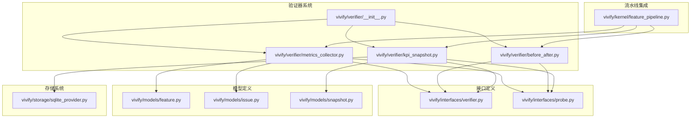
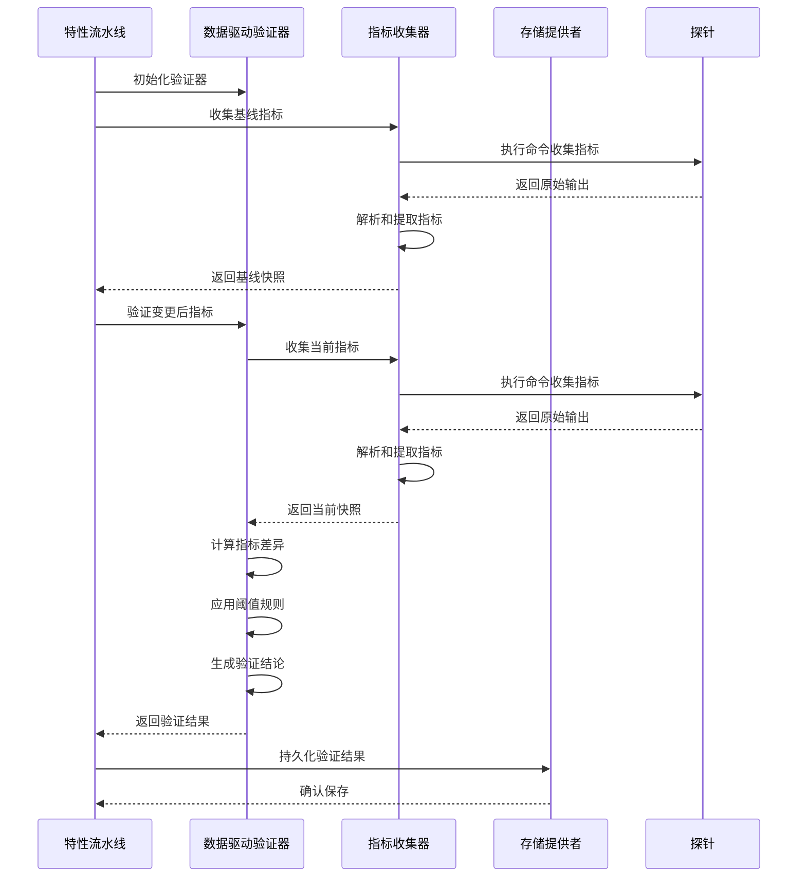
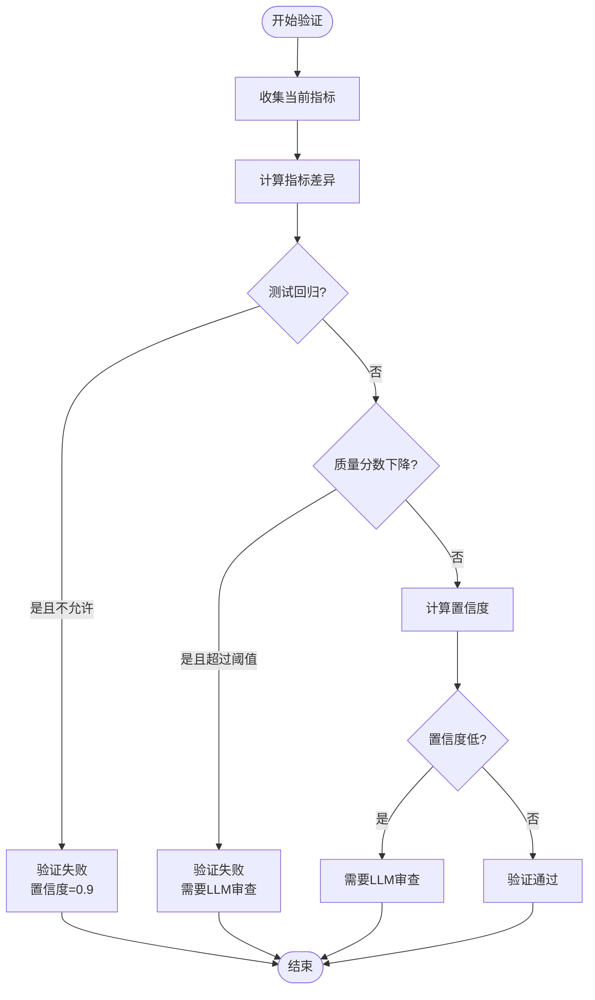
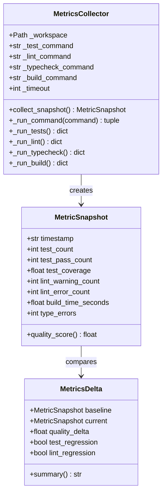
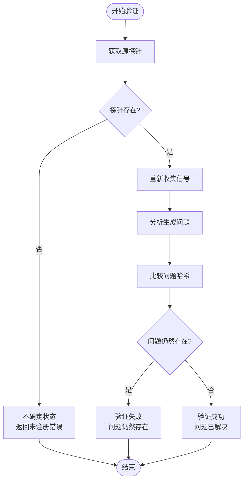
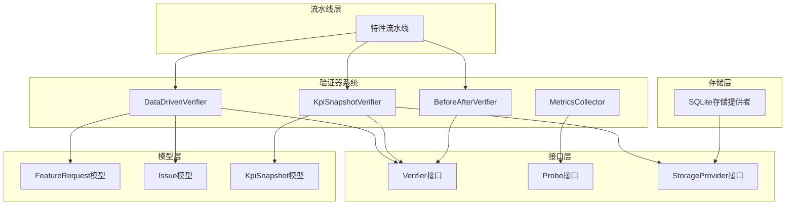

# 数据驱动验证器系统

<cite>
**本文档引用的文件**
- [vivify/verifier/__init__.py](file://vivify/verifier/__init__.py)
- [vivify/verifier/metrics_collector.py](file://vivify/verifier/metrics_collector.py)
- [vivify/verifier/before_after.py](file://vivify/verifier/before_after.py)
- [vivify/verifier/kpi_snapshot.py](file://vivify/verifier/kpi_snapshot.py)
- [vivify/interfaces/verifier.py](file://vivify/interfaces/verifier.py)
- [vivify/interfaces/probe.py](file://vivify/interfaces/probe.py)
- [vivify/models/feature.py](file://vivify/models/feature.py)
- [vivify/models/issue.py](file://vivify/models/issue.py)
- [vivify/models/snapshot.py](file://vivify/models/snapshot.py)
- [vivify/kernel/feature_pipeline.py](file://vivify/kernel/feature_pipeline.py)
- [vivify/storage/sqlite_provider.py](file://vivify/storage/sqlite_provider.py)
- [tests/unit/test_data_driven_verifier.py](file://tests/unit/test_data_driven_verifier.py)
- [README.md](file://README.md)
</cite>

## 目录
1. [简介](#简介)
2. [项目结构](#项目结构)
3. [核心组件](#核心组件)
4. [架构概览](#架构概览)
5. [详细组件分析](#详细组件分析)
6. [依赖关系分析](#依赖关系分析)
7. [性能考虑](#性能考虑)
8. [故障排除指南](#故障排除指南)
9. [结论](#结论)

## 简介

数据驱动验证器系统是 Vivify 项目中的一个关键验证组件，它通过量化指标收集和比较来自动化软件质量验证过程。该系统能够在代码变更前后收集项目质量指标，使用阈值规则生成自动化验证结论，并在必要时触发人工审查。

系统的核心特点包括：
- **量化指标驱动**：基于具体的数值指标而非简单的通过/失败判断
- **阈值规则系统**：可配置的阈值来决定验证通过与否
- **自动化决策**：在高置信度情况下跳过人工审查
- **混合验证策略**：结合数据驱动验证和基于LLM的人工验证

## 项目结构

数据驱动验证器系统主要位于 `vivify/verifier/` 目录中，包含以下核心文件：

**图表来源**
- [vivify/verifier/__init__.py:1-21](file://vivify/verifier/__init__.py#L1-L21)
- [vivify/verifier/metrics_collector.py:1-413](file://vivify/verifier/metrics_collector.py#L1-L413)
- [vivify/verifier/before_after.py:1-66](file://vivify/verifier/before_after.py#L1-L66)
- [vivify/verifier/kpi_snapshot.py:1-185](file://vivify/verifier/kpi_snapshot.py#L1-L185)

**章节来源**
- [vivify/verifier/__init__.py:1-21](file://vivify/verifier/__init__.py#L1-L21)
- [README.md:248-267](file://README.md#L248-L267)

## 核心组件

数据驱动验证器系统由四个主要组件构成：

### 1. 数据驱动验证器 (DataDrivenVerifier)
负责基于量化指标进行自动化验证决策，支持阈值配置和置信度计算。

### 2. 指标收集器 (MetricsCollector)
从项目环境中收集各种质量指标，包括测试结果、代码质量检查、构建时间等。

### 3. 指标快照 (MetricSnapshot/MetricsDelta)
数据类用于表示时间点的质量指标快照和指标变化情况。

### 4. 验证结果 (VerificationVerdict)
封装验证决策的结果，包括通过状态、置信度和是否需要人工审查。

**章节来源**
- [vivify/verifier/metrics_collector.py:31-413](file://vivify/verifier/metrics_collector.py#L31-L413)

## 架构概览

数据驱动验证器系统采用分层架构设计，各组件职责明确且松耦合：

**图表来源**
- [vivify/kernel/feature_pipeline.py:442-490](file://vivify/kernel/feature_pipeline.py#L442-L490)
- [vivify/verifier/metrics_collector.py:347-404](file://vivify/verifier/metrics_collector.py#L347-L404)

## 详细组件分析

### 数据驱动验证器 (DataDrivenVerifier)

DataDrivenVerifier 是整个系统的核心决策组件，它基于量化指标的变化来做出验证决策。

#### 核心功能

1. **阈值配置系统**：支持多种阈值参数，包括最小质量变化阈值、测试回归容忍度等
2. **自动化决策**：根据指标变化自动判断验证通过或失败
3. **置信度计算**：基于指标变化幅度计算验证的置信度
4. **混合验证策略**：在低置信度情况下触发人工审查

#### 验证规则

**图表来源**
- [vivify/verifier/metrics_collector.py:376-403](file://vivify/verifier/metrics_collector.py#L376-L403)

#### 关键配置参数

| 参数名 | 默认值 | 描述 |
|--------|--------|------|
| min_quality_delta | -0.1 | 允许的最大质量分数下降 |
| allow_test_regression | False | 是否允许测试用例减少 |
| allow_lint_regression | True | 是否允许代码规范错误增加 |
| confidence_threshold | 0.7 | 触发LLM审查的置信度阈值 |

**章节来源**
- [vivify/verifier/metrics_collector.py:339-344](file://vivify/verifier/metrics_collector.py#L339-L344)
- [vivify/verifier/metrics_collector.py:347-404](file://vivify/verifier/metrics_collector.py#L347-L404)

### 指标收集器 (MetricsCollector)

MetricsCollector 负责从项目环境中收集各种质量指标，采用子进程模式执行外部命令。

#### 支持的指标类型

1. **测试指标**：测试总数、通过数、覆盖率
2. **代码质量指标**：lint警告数、lint错误数、类型检查错误数
3. **构建指标**：构建时间
4. **项目特征指标**：从数据库推导的功能生命周期KPI

#### 命令执行机制

**图表来源**
- [vivify/verifier/metrics_collector.py:137-332](file://vivify/verifier/metrics_collector.py#L137-L332)
- [vivify/verifier/metrics_collector.py:31-119](file://vivify/verifier/metrics_collector.py#L31-L119)

#### 指标解析算法

指标收集器支持多种命令输出格式的解析：

1. **测试结果解析**：支持 pytest 风格的输出格式
2. **代码规范解析**：支持 ruff/flake8/pylint 风格的错误计数
3. **类型检查解析**：支持 mypy/pyright 风格的错误报告
4. **构建时间测量**：精确测量命令执行时间

**章节来源**
- [vivify/verifier/metrics_collector.py:194-332](file://vivify/verifier/metrics_collector.py#L194-L332)

### KPI 快照验证器 (KpiSnapshotVerifier)

KpiSnapshotVerifier 专门负责捕获和存储 KPI 指标，为趋势分析提供数据基础。

#### 核心功能

1. **指标采集**：从探针和数据库推导两套指标源
2. **指标融合**：探针指标优先，数据库指标作为后备
3. **存储持久化**：将 KPI 指标存储到 SQLite 数据库
4. **趋势分析支持**：为健康监控提供历史数据

#### 特征生命周期 KPI

系统自动推导以下特征生命周期 KPI：

| 指标名称 | 计算公式 | 描述 |
|----------|----------|------|
| feature_total | 总特征数 | 项目中特征的总数 |
| feature_completion_rate | (完成特征/总特征)×100% | 特征完成率 |
| feature_success_rate | (已验证特征/已验证+有缺陷特征)×100% | 特征成功率 |
| active_features | 正在开发的特征数 | 处于活跃状态的特征数量 |
| pr_merge_rate | (PR合并数/总特征数)×100% | PR合并率 |
| avg_cycle_time_hours | 平均周期时间 | 从创建到验证的平均时间 |
| overall_score | 0.4×完成率+0.4×成功率+0.2×周期时间权重 | 综合评分 |

**章节来源**
- [vivify/verifier/kpi_snapshot.py:47-104](file://vivify/verifier/kpi_snapshot.py#L47-L104)
- [vivify/verifier/kpi_snapshot.py:107-182](file://vivify/verifier/kpi_snapshot.py#L107-L182)

### Before/After 验证器

Before/After 验证器通过重新运行源探针来验证修复效果。

#### 工作原理

1. **源探针识别**：根据问题来源探针 ID 获取对应的探针实例
2. **重新收集**：运行相同的探针收集原始信号
3. **问题比较**：通过问题哈希值比较来确定修复是否有效
4. **结果判定**：如果问题仍然存在则验证失败，否则验证成功

#### 验证逻辑

**图表来源**
- [vivify/verifier/before_after.py:29-55](file://vivify/verifier/before_after.py#L29-L55)

**章节来源**
- [vivify/verifier/before_after.py:20-62](file://vivify/verifier/before_after.py#L20-L62)

## 依赖关系分析

数据驱动验证器系统与其他组件的依赖关系如下：

**图表来源**
- [vivify/interfaces/verifier.py:40-63](file://vivify/interfaces/verifier.py#L40-L63)
- [vivify/interfaces/probe.py:40-59](file://vivify/interfaces/probe.py#L40-L59)
- [vivify/kernel/feature_pipeline.py:48-53](file://vivify/kernel/feature_pipeline.py#L48-L53)

### 组件耦合度分析

1. **高内聚低耦合**：每个验证器专注于特定的验证任务
2. **接口抽象**：通过抽象接口实现组件间的松耦合
3. **数据传递**：通过标准化的数据模型进行组件间通信
4. **可扩展性**：新的验证器可以通过实现 Verifier 接口轻松集成

**章节来源**
- [vivify/interfaces/verifier.py:17-63](file://vivify/interfaces/verifier.py#L17-L63)
- [vivify/kernel/feature_pipeline.py:125-174](file://vivify/kernel/feature_pipeline.py#L125-L174)

## 性能考虑

数据驱动验证器系统在设计时充分考虑了性能优化：

### 1. 异步执行
- 使用子进程执行外部命令，避免阻塞主线程
- 支持超时机制，防止长时间阻塞
- 命令执行结果缓存，避免重复执行

### 2. 内存优化
- 指标数据采用轻量级数据类存储
- 及时释放临时资源和进程句柄
- 合理的异常处理，避免内存泄漏

### 3. I/O 优化
- SQLite 存储采用 WAL 模式提高并发性能
- 批量操作减少数据库往返次数
- 适当的索引设计支持快速查询

### 4. 缓存策略
- 探针结果缓存
- 解析后的指标缓存
- 频繁访问的数据缓存

## 故障排除指南

### 常见问题及解决方案

#### 1. 指标收集失败
**症状**：指标为空或部分指标缺失
**可能原因**：
- 外部命令执行失败
- 命令超时
- 输出格式不符合预期

**解决方案**：
- 检查命令可执行性和权限
- 增加超时时间
- 验证命令输出格式

#### 2. 验证结果不稳定
**症状**：相同代码多次验证结果不同
**可能原因**：
- 测试结果波动
- 环境变量影响
- 并发执行干扰

**解决方案**：
- 确保测试环境一致性
- 设置稳定的执行环境
- 减少并发执行

#### 3. 存储连接问题
**症状**：KPI 指标无法持久化
**可能原因**：
- 数据库文件权限问题
- 数据库锁定
- 磁盘空间不足

**解决方案**：
- 检查数据库文件权限
- 确认数据库未被其他进程占用
- 清理磁盘空间

**章节来源**
- [vivify/verifier/metrics_collector.py:194-216](file://vivify/verifier/metrics_collector.py#L194-L216)
- [vivify/storage/sqlite_provider.py:82-86](file://vivify/storage/sqlite_provider.py#L82-L86)

## 结论

数据驱动验证器系统通过量化指标驱动的验证方式，为 Vivify 项目提供了可靠的自动化验证能力。系统的主要优势包括：

1. **客观性**：基于具体数值指标而非主观判断
2. **可配置性**：灵活的阈值配置适应不同项目需求
3. **可扩展性**：模块化的架构支持新验证器的添加
4. **可靠性**：完善的错误处理和恢复机制

该系统有效地减少了人工审查的工作量，在保证质量的同时提高了开发效率。通过与特性流水线的深度集成，实现了从检测到验证的完整自动化流程。

未来可以考虑的改进方向包括：
- 更丰富的指标类型支持
- 智能阈值调整机制
- 更强大的异常处理能力
- 性能监控和优化