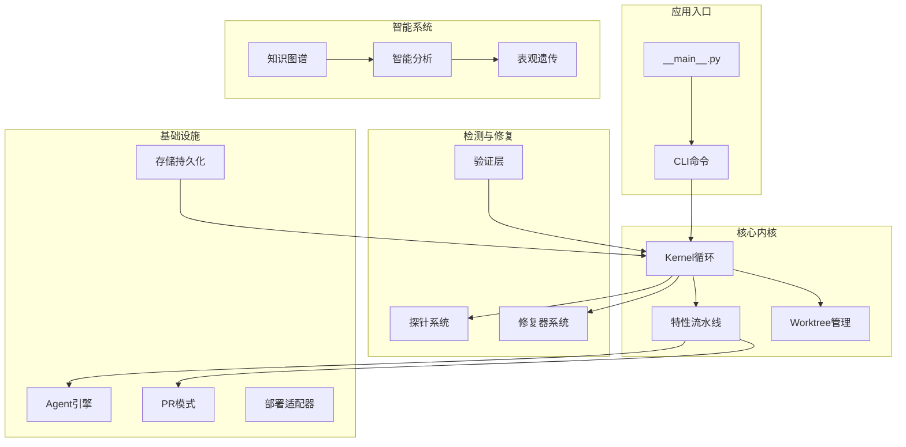
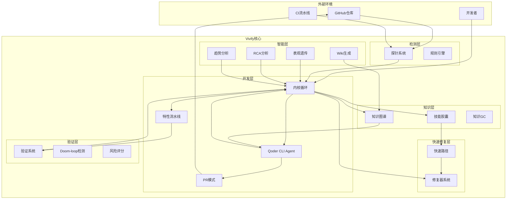
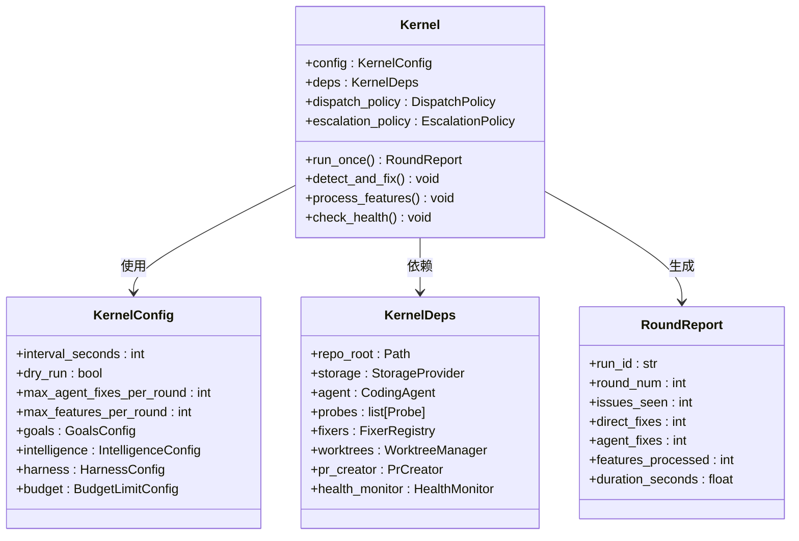
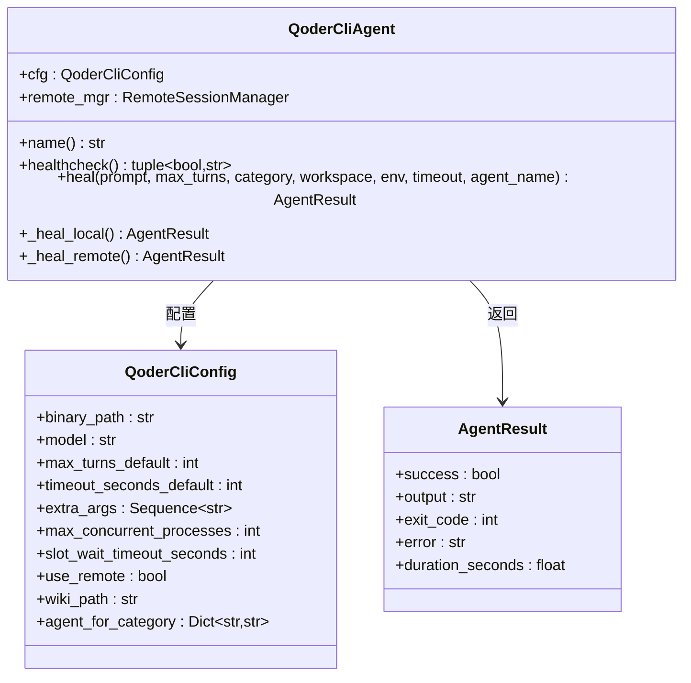
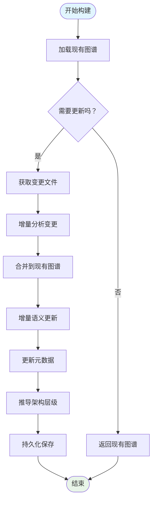
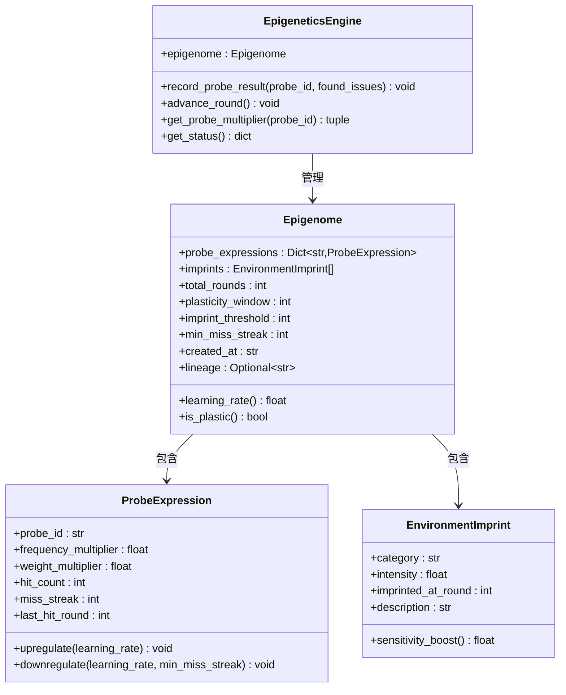
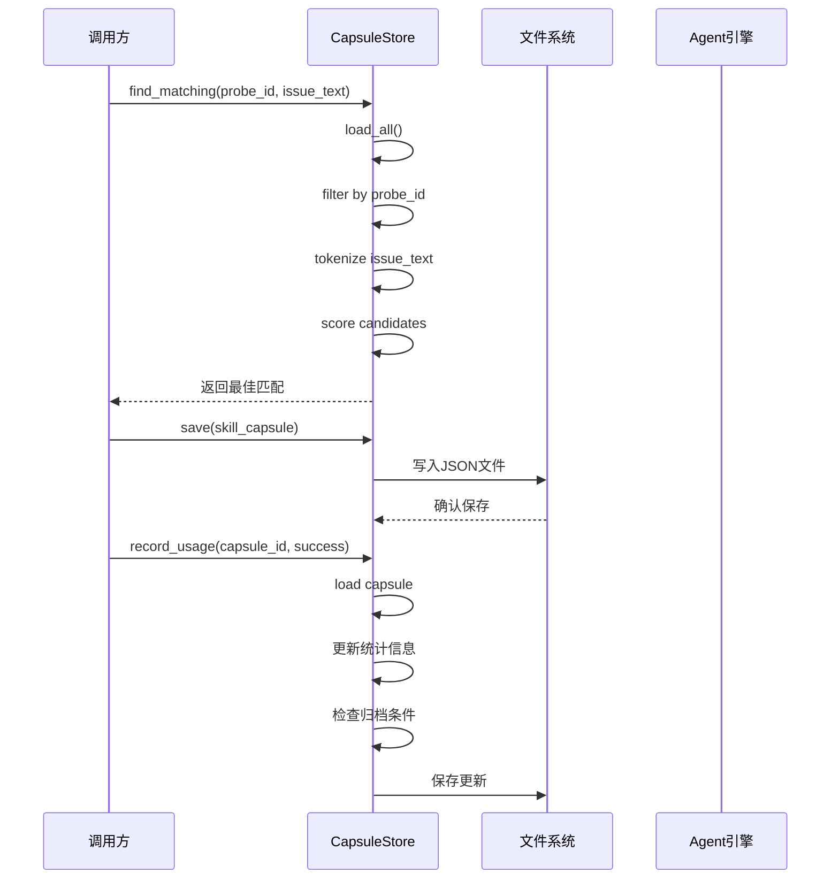
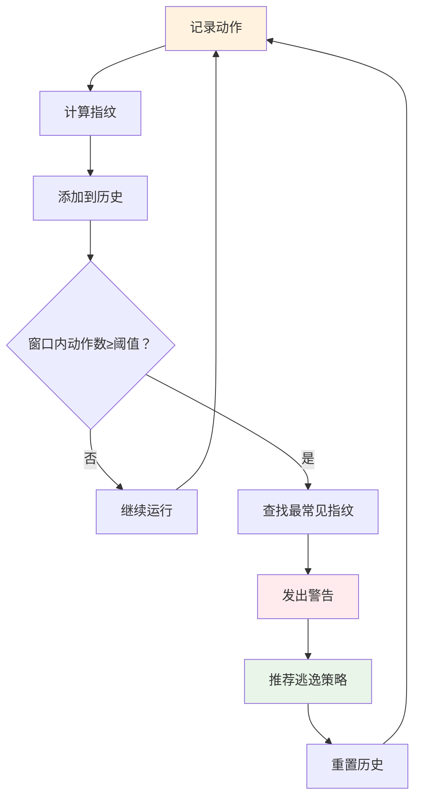
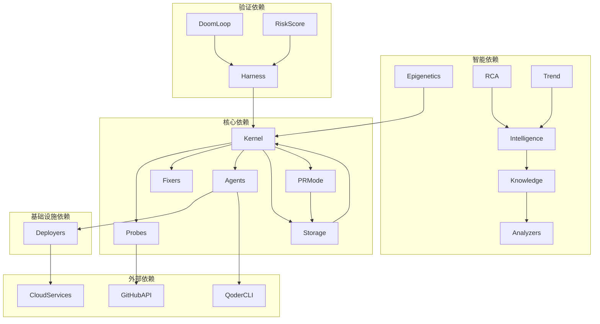

# 活体系统框架

<cite>
**本文档引用的文件**
- [README.md](file://README.md)
- [ROADMAP_LIVING_SYSTEM.md](file://ROADMAP_LIVING_SYSTEM.md)
- [.vivify/knowledge/graph.json](file://.vivify/knowledge/graph.json)
- [.vivify/knowledge/meta.json](file://.vivify/knowledge/meta.json)
- [.vivify/knowledge/conventions.json](file://.vivify/knowledge/conventions.json)
- [vivify/__main__.py](file://vivify/__main__.py)
- [vivify/kernel/loop.py](file://vivify/kernel/loop.py)
- [vivify/agents/qodercli_agent.py](file://vivify/agents/qodercli_agent.py)
- [vivify/knowledge/builder.py](file://vivify/knowledge/builder.py)
- [vivify/probes/builtin/build_duration.yml](file://vivify/probes/builtin/build_duration.yml)
- [vivify/pr_mode/self_grow_guard.py](file://vivify/pr_mode/self_grow_guard.py)
- [vivify/kernel/token_budget.py](file://vivify/kernel/token_budget.py)
- [vivify/intelligence/epigenetics.py](file://vivify/intelligence/epigenetics.py)
- [vivify/capsules/store.py](file://vivify/capsules/store.py)
- [vivify/harness/doom_loop.py](file://vivify/harness/doom_loop.py)
</cite>

## 目录
1. [简介](#简介)
2. [项目结构](#项目结构)
3. [核心组件](#核心组件)
4. [架构总览](#架构总览)
5. [详细组件分析](#详细组件分析)
6. [依赖关系分析](#依赖关系分析)
7. [性能考量](#性能考量)
8. [故障排除指南](#故障排除指南)
9. [结论](#结论)
10. [附录](#附录)

## 简介

活体系统框架（Vivify）是一个"生长因子"式的系统自生长赋能引擎，旨在让任何 GitHub 项目具备自我检测、自我修复、自我验证与自我学习的能力。其核心理念是"催化而非替代"——通过注入知识与机制，激活项目自身的修复与进化能力，最终让系统在没有外部干预的情况下持续健康运转。

该框架采用五层架构设计，从底层的检测与快速修复，到顶层的智能分析与验证，形成完整的闭环：

- **检测层（Probes）**：13个内置探针 + YAML声明式扩展，持续观测项目健康度
- **快速修复层（Fixers）**：6个内置修复器 + 用户扩展，无需AI即可修复
- **智能层（Intelligence）**：RCA根因分析 + 趋势分析 + 知识图谱
- **开发层（Kernel/Agents）**：特性流水线 + Qoder CLI Agent + PR模式
- **验证层（Harness）**：PEV循环验证 + Doom-loop检测 + 风险评分

## 项目结构

项目采用模块化分层设计，主要目录结构如下：



**图表来源**
- [vivify/__main__.py:1-6](file://vivify/__main__.py#L1-L6)
- [vivify/kernel/loop.py:1-200](file://vivify/kernel/loop.py#L1-L200)

**章节来源**
- [README.md:248-267](file://README.md#L248-L267)

## 核心组件

### 1. Kernel主循环

Kernel是整个系统的核心协调器，负责执行完整的检测-修复-升级循环。其主要职责包括：

- **探针执行**：运行启用的探针收集项目状态
- **修复决策**：优先尝试快速修复器，失败时调用AI Agent
- **特性管理**：通过特性流水线处理待办事项
- **健康监控**：定期检查系统健康状况
- **自改进检测**：监控自身代码变更并触发优雅重启

### 2. 知识图谱系统

知识图谱采用三阶段构建流程：

1. **结构分析**：静态分析确定模块关系和依赖
2. **语义丰富**：通过LLM和Wiki增强语义信息
3. **规范提取**：从代码样本中抽取编程规范

### 3. 表观遗传系统

模拟生物表观遗传机制，实现：
- **探针表达量调节**：根据命中频率调整执行频率和权重
- **环境印记**：早期经验形成永久性敏感性标记
- **可塑性窗口**：前N轮高学习率，后期稳定

### 4. 技能胶囊系统

将成功的修复模式固化为可复用的"技能胶囊"：
- **触发模式**：基于探针ID和问题特征
- **修复策略**：结构化存储的修复模板
- **复用机制**：自动匹配和注入到后续修复流程

**章节来源**
- [vivify/kernel/loop.py:149-200](file://vivify/kernel/loop.py#L149-L200)
- [vivify/knowledge/builder.py:53-140](file://vivify/knowledge/builder.py#L53-L140)
- [vivify/intelligence/epigenetics.py:120-182](file://vivify/intelligence/epigenetics.py#L120-L182)
- [vivify/capsules/store.py:26-127](file://vivify/capsules/store.py#L26-L127)

## 架构总览



**图表来源**
- [README.md:29-68](file://README.md#L29-L68)
- [ROADMAP_LIVING_SYSTEM.md:499-509](file://ROADMAP_LIVING_SYSTEM.md#L499-L509)

## 详细组件分析

### Kernel主循环组件



**图表来源**
- [vivify/kernel/loop.py:88-142](file://vivify/kernel/loop.py#L88-L142)

**章节来源**
- [vivify/kernel/loop.py:149-200](file://vivify/kernel/loop.py#L149-L200)

### Qoder CLI Agent组件



**图表来源**
- [vivify/agents/qodercli_agent.py:30-120](file://vivify/agents/qodercli_agent.py#L30-L120)

**章节来源**
- [vivify/agents/qodercli_agent.py:102-170](file://vivify/agents/qodercli_agent.py#L102-L170)

### 知识图谱构建组件



**图表来源**
- [vivify/knowledge/builder.py:142-200](file://vivify/knowledge/builder.py#L142-L200)

**章节来源**
- [vivify/knowledge/builder.py:76-140](file://vivify/knowledge/builder.py#L76-L140)

### 表观遗传系统组件



**图表来源**
- [vivify/intelligence/epigenetics.py:80-150](file://vivify/intelligence/epigenetics.py#L80-L150)

**章节来源**
- [vivify/intelligence/epigenetics.py:120-182](file://vivify/intelligence/epigenetics.py#L120-L182)

### 技能胶囊存储组件



**图表来源**
- [vivify/capsules/store.py:92-147](file://vivify/capsules/store.py#L92-L147)

**章节来源**
- [vivify/capsules/store.py:26-127](file://vivify/capsules/store.py#L26-L127)

### Doom-loop检测组件



**图表来源**
- [vivify/harness/doom_loop.py:39-106](file://vivify/harness/doom_loop.py#L39-L106)

**章节来源**
- [vivify/harness/doom_loop.py:11-78](file://vivify/harness/doom_loop.py#L11-L78)

## 依赖关系分析



**图表来源**
- [vivify/kernel/loop.py:34-76](file://vivify/kernel/loop.py#L34-L76)

**章节来源**
- [vivify/kernel/loop.py:1-100](file://vivify/kernel/loop.py#L1-L100)

## 性能考量

### 1. 资源限制与节流

系统实现了双重资源保护机制：

- **硬限制（TokenBucket）**：每日和每轮调用硬上限，超出则直接拒绝
- **智能降速（P53Suppressor）**：基于运营信号的主动抑制，防止过度增殖

### 2. 知识图谱优化

- **增量更新**：仅分析变更文件，避免全量重建
- **超时保护**：构建过程可中断并保存部分结果
- **内存管理**：历史记录限制在2倍窗口大小以内

### 3. Agent并发控制

- **槽位管理**：通过环境变量可靠计数并发进程
- **远程执行**：支持云端远程会话，提高资源利用率
- **工作区健康检查**：预防性检查减少无效操作

## 故障排除指南

### 1. 常见问题诊断

**探针执行失败**
- 检查探针配置和权限
- 验证外部工具可用性
- 查看探针执行日志

**Agent修复失败**
- 检查工作区状态和权限
- 验证Qoder CLI安装和配置
- 查看Agent执行结果

**PR创建失败**
- 检查GitHub访问权限
- 验证分支保护规则
- 查看PR创建日志

### 2. 自我保护机制

**p53抑制机制**
- 当检测到PR频率过高、积压过深或失败率过高时自动降频
- 支持手动解除抑制状态
- 提供详细的抑制原因报告

**自生长保护**
- 分类区分内核变更和插件变更
- 内核变更强制草稿状态
- 混合变更按内核变更处理

**章节来源**
- [vivify/kernel/token_budget.py:116-161](file://vivify/kernel/token_budget.py#L116-L161)
- [vivify/pr_mode/self_grow_guard.py:77-123](file://vivify/pr_mode/self_grow_guard.py#L77-L123)

## 结论

活体系统框架通过"生长因子"式的架构设计，成功实现了软件项目的自愈能力。其核心优势体现在：

1. **分层架构清晰**：从检测到修复再到验证，形成完整的闭环
2. **智能学习机制**：表观遗传和技能胶囊系统实现知识的持续积累
3. **自我保护能力**：p53抑制和自生长保护确保系统稳定运行
4. **可扩展性**：模块化设计支持用户自定义探针和修复器

该框架不仅能够解决当前项目的问题，更重要的是培养项目自身的修复和进化能力，最终实现"注入→激活→融入→消失"的理想状态。

## 附录

### 配置示例

系统支持多种配置方式：

- **快速模板**：33行配置即可上手
- **高级分离**：.vivify.yml和.vivify-advanced.yml分离
- **场景预设**：web-fullstack、microservice等预设模板
- **环境变量覆盖**：支持运行时配置覆盖

### 扩展指南

**自定义探针**
```yaml
# YAML声明式探针
id: my_probe
name: 我的检查
type: command
command: "npm run lint"
expect_exit_code: 0
severity: warning
```

**自定义修复器**
```python
# Python类修复器
class MyFixer(Fixer):
    handles = ["my_probe"]
    def fix(self, ctx):
        # 修复逻辑
        ...
```

**章节来源**
- [README.md:180-221](file://README.md#L180-L221)