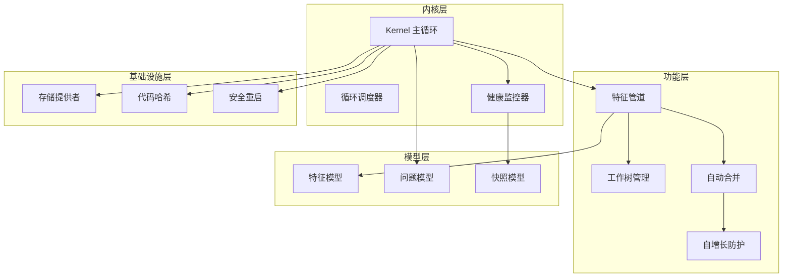
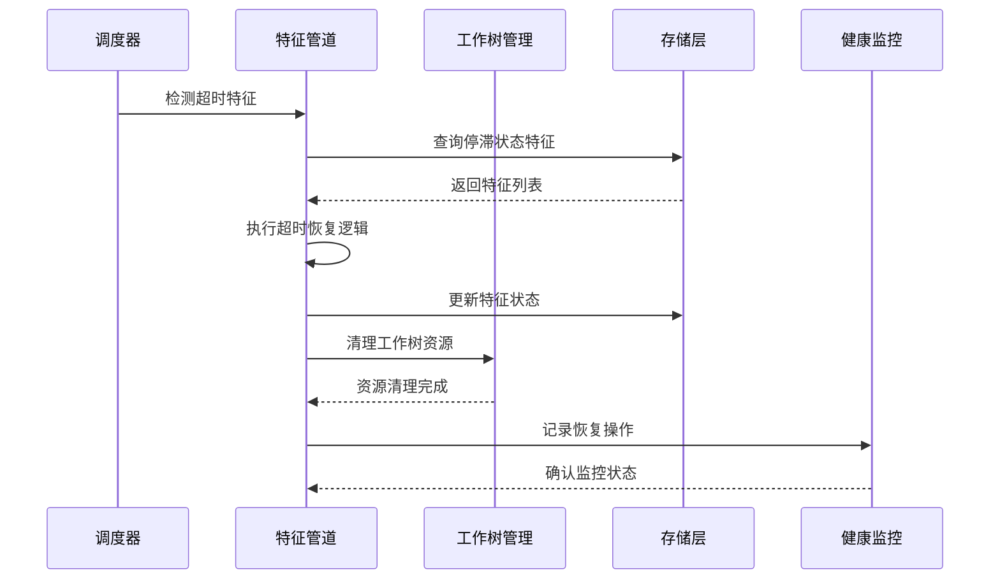
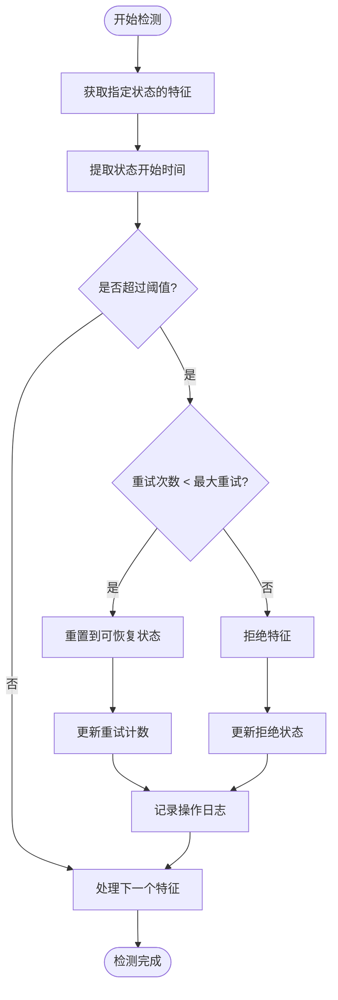
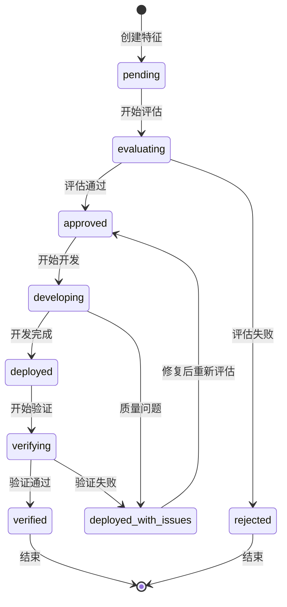
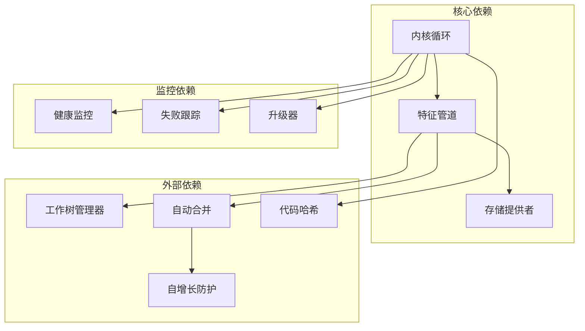

# 特征管道超时自动恢复系统

<cite>
**本文档引用的文件**
- [feature_pipeline.py](file://vivify/kernel/feature_pipeline.py)
- [loop.py](file://vivify/kernel/loop.py)
- [safe_restart.py](file://vivify/kernel/safe_restart.py)
- [health_monitor.py](file://vivify/kernel/health_monitor.py)
- [failure_tracker.py](file://vivify/kernel/failure_tracker.py)
- [escalator.py](file://vivify/kernel/escalator.py)
- [dispatch.py](file://vivify/kernel/dispatch.py)
- [worktree.py](file://vivify/pr_mode/worktree.py)
- [auto_merge.py](file://vivify/pr_mode/auto_merge.py)
- [self_grow_guard.py](file://vivify/pr_mode/self_grow_guard.py)
- [feature.py](file://vivify/models/feature.py)
- [storage.py](file://vivify/interfaces/storage.py)
- [code_hash.py](file://vivify/kernel/code_hash.py)
</cite>

## 目录
1. [简介](#简介)
2. [项目结构](#项目结构)
3. [核心组件](#核心组件)
4. [架构概览](#架构概览)
5. [详细组件分析](#详细组件分析)
6. [依赖关系分析](#依赖关系分析)
7. [性能考虑](#性能考虑)
8. [故障排除指南](#故障排除指南)
9. [结论](#结论)

## 简介

特征管道超时自动恢复系统是一个智能化的自动化开发流水线，专门设计用于检测、处理和恢复在特征开发过程中出现的超时问题。该系统通过监控特征请求在评估、开发和验证阶段的状态变化，自动识别长时间停滞的任务，并执行相应的恢复策略。

系统的核心目标是确保自动化特征开发流程的连续性和可靠性，即使在遇到网络中断、资源限制或其他异常情况时，也能自动恢复并继续执行，从而最大化开发效率和系统可用性。

## 项目结构

该项目采用模块化架构设计，主要分为以下几个核心层次：

**图表来源**
- [loop.py:129-791](file://vivify/kernel/loop.py#L129-L791)
- [feature_pipeline.py:87-1068](file://vivify/kernel/feature_pipeline.py#L87-L1068)

**章节来源**
- [loop.py:1-791](file://vivify/kernel/loop.py#L1-L791)
- [feature_pipeline.py:1-1068](file://vivify/kernel/feature_pipeline.py#L1-L1068)

## 核心组件

### 特征管道系统

特征管道是整个系统的核心执行单元，负责协调特征请求从创建到完成的完整生命周期。它包含三个主要阶段：

1. **评估阶段 (Evaluate)**：使用大语言模型分析特征的优先级和可行性
2. **开发阶段 (Develop)**：创建独立的工作树环境进行代码开发
3. **验证阶段 (Verify)**：对完成的变更进行质量验证和效果评估

### 超时检测与恢复机制

系统实现了智能的超时检测机制，能够自动识别在各个阶段中停滞超过预设阈值的特征请求，并执行相应的恢复操作：

- **评估超时恢复**：将停滞的特征重置为待处理状态
- **开发超时恢复**：将特征回滚到评估完成状态
- **验证超时恢复**：将特征标记为已部署状态

### 工作树管理系统

每个特征开发都在独立的 Git 工作树环境中进行，确保开发过程的隔离性和安全性。工作树管理器负责：
- 创建隔离的开发环境
- 管理分支和提交历史
- 清理临时文件和资源

**章节来源**
- [feature_pipeline.py:87-427](file://vivify/kernel/feature_pipeline.py#L87-L427)
- [worktree.py:43-176](file://vivify/pr_mode/worktree.py#L43-L176)

## 架构概览

系统采用分层架构设计，各层之间通过清晰的接口进行交互：

**图表来源**
- [loop.py:549-595](file://vivify/kernel/loop.py#L549-L595)
- [feature_pipeline.py:941-1000](file://vivify/kernel/feature_pipeline.py#L941-L1000)

**章节来源**
- [loop.py:281-299](file://vivify/kernel/loop.py#L281-L299)
- [feature_pipeline.py:941-1000](file://vivify/kernel/feature_pipeline.py#L941-L1000)

## 详细组件分析

### 超时检测算法

超时检测系统通过以下算法实现智能恢复：

**图表来源**
- [feature_pipeline.py:941-1000](file://vivify/kernel/feature_pipeline.py#L941-L1000)

### 状态转换机制

系统实现了完整的状态转换机制，确保特征在不同阶段之间的正确迁移：

**图表来源**
- [feature.py:54-58](file://vivify/models/feature.py#L54-L58)

### 错误处理与恢复策略

系统采用多层次的错误处理策略：

1. **阶段内错误处理**：在特征开发的各个阶段内部捕获和处理异常
2. **超时自动恢复**：检测到超时后自动执行恢复操作
3. **资源清理保障**：确保所有临时资源得到正确清理
4. **状态回滚机制**：将特征回滚到安全的中间状态

**章节来源**
- [feature_pipeline.py:110-123](file://vivify/kernel/feature_pipeline.py#L110-L123)
- [feature_pipeline.py:941-1000](file://vivify/kernel/feature_pipeline.py#L941-L1000)

## 依赖关系分析

系统各组件之间的依赖关系如下：

**图表来源**
- [loop.py:52-62](file://vivify/kernel/loop.py#L52-L62)
- [feature_pipeline.py:31-42](file://vivify/kernel/feature_pipeline.py#L31-L42)

**章节来源**
- [loop.py:129-150](file://vivify/kernel/loop.py#L129-L150)
- [feature_pipeline.py:87-107](file://vivify/kernel/feature_pipeline.py#L87-L107)

## 性能考虑

### 超时阈值优化

系统提供了可配置的超时阈值，以适应不同的运行环境：

- **评估超时**：默认10分钟，适用于复杂的特征分析
- **开发超时**：默认90分钟，考虑到代码开发的复杂性
- **验证超时**：默认60分钟，用于质量验证和测试执行

### 资源管理策略

系统采用多种资源管理策略确保高效运行：

1. **工作树隔离**：每个特征使用独立的工作树，避免资源冲突
2. **批量处理**：支持多个低优先级特征的批量开发
3. **内存优化**：使用惰性加载和及时清理机制

### 监控与诊断

系统内置了全面的监控和诊断功能：

- **状态追踪**：实时监控特征状态变化
- **性能指标**：收集关键性能指标
- **错误日志**：详细记录异常信息

## 故障排除指南

### 常见问题诊断

1. **特征长时间停滞**
   - 检查超时阈值设置是否合理
   - 验证网络连接和资源可用性
   - 查看工作树清理状态

2. **自动恢复失败**
   - 检查存储层连接状态
   - 验证权限配置
   - 查看日志中的具体错误信息

3. **资源泄漏问题**
   - 确认工作树清理机制正常工作
   - 检查临时文件清理
   - 验证进程终止状态

### 调试工具和方法

系统提供了多种调试工具：

- **详细日志输出**：启用调试模式获取更多信息
- **状态查询接口**：实时查看系统状态
- **性能分析工具**：监控系统性能指标

**章节来源**
- [feature_pipeline.py:941-1000](file://vivify/kernel/feature_pipeline.py#L941-L1000)
- [loop.py:281-299](file://vivify/kernel/loop.py#L281-L299)

## 结论

特征管道超时自动恢复系统通过智能化的设计和完善的机制，有效解决了自动化特征开发过程中的超时问题。系统的主要优势包括：

1. **高可靠性**：通过多层保护机制确保系统稳定运行
2. **智能恢复**：自动检测和处理各种异常情况
3. **资源优化**：高效的资源管理和清理机制
4. **可扩展性**：模块化设计支持功能扩展和定制

该系统为持续集成和持续部署提供了强有力的技术支撑，显著提高了软件开发的效率和质量。通过合理的配置和监控，可以进一步优化系统的性能和稳定性。