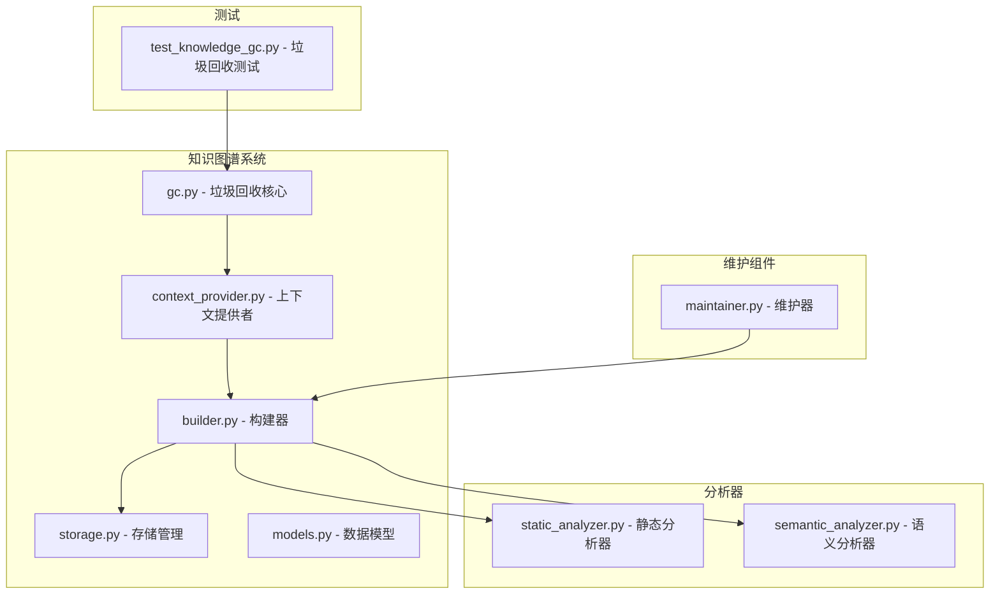
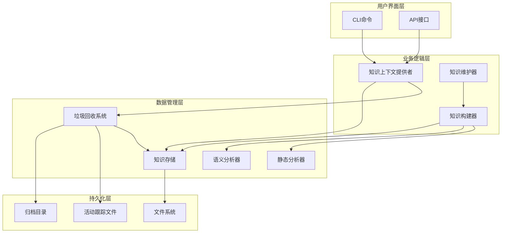
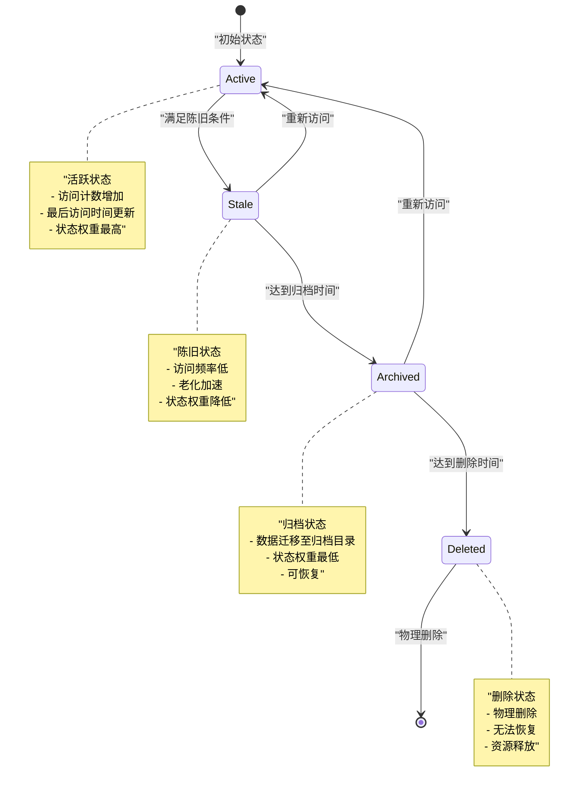
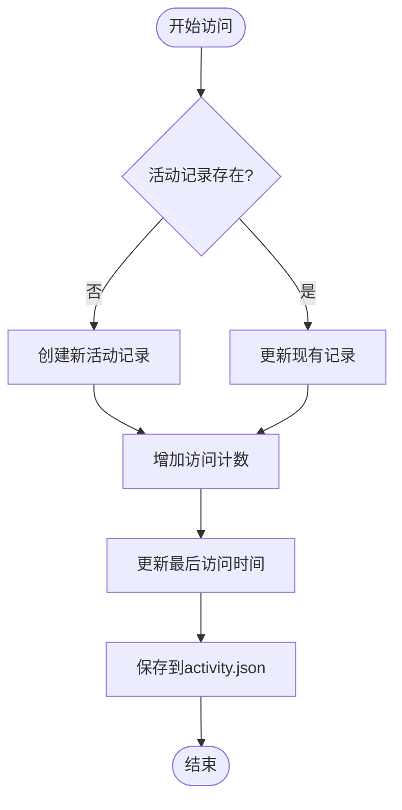
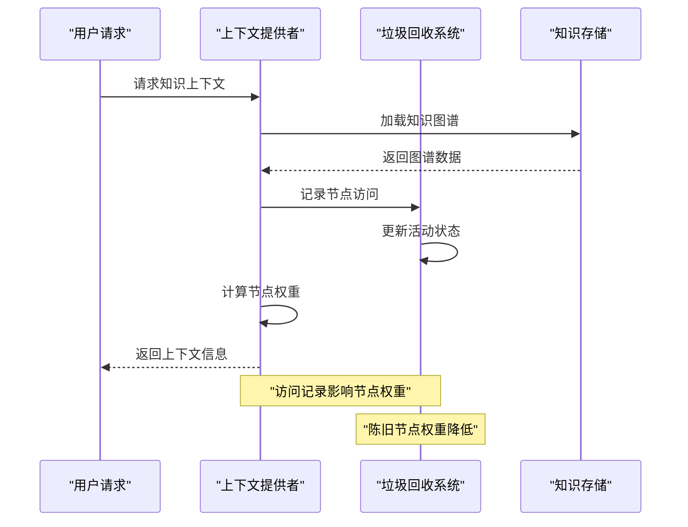
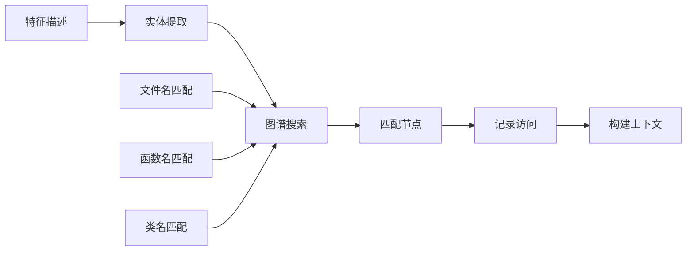
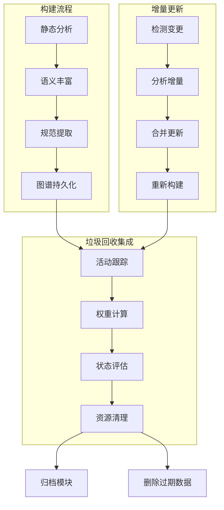
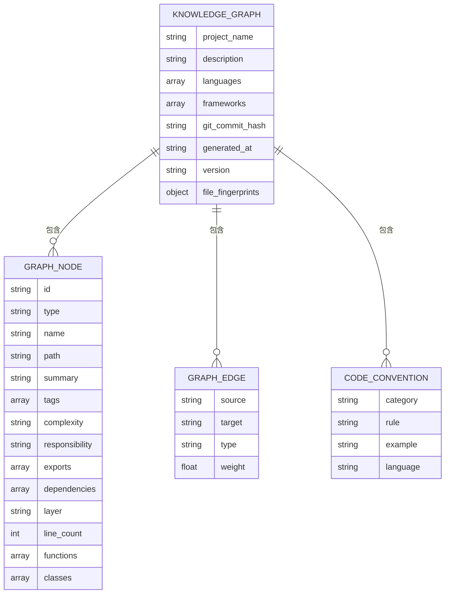
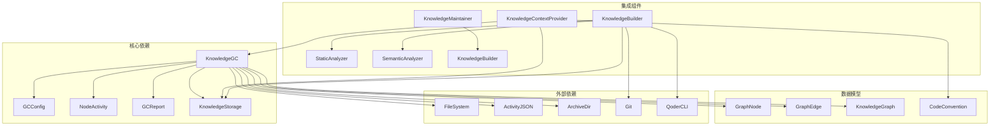

# 知识图谱垃圾回收系统

<cite>
**本文档引用的文件**
- [gc.py](file://vivify/knowledge/gc.py)
- [context_provider.py](file://vivify/knowledge/context_provider.py)
- [builder.py](file://vivify/knowledge/builder.py)
- [storage.py](file://vivify/knowledge/storage.py)
- [models.py](file://vivify/knowledge/models.py)
- [static_analyzer.py](file://vivify/knowledge/analyzers/static_analyzer.py)
- [semantic_analyzer.py](file://vivify/knowledge/analyzers/semantic_analyzer.py)
- [maintainer.py](file://vivify/knowledge/maintainer.py)
- [test_knowledge_gc.py](file://tests/unit/test_knowledge_gc.py)
- [README.md](file://README.md)
- [graph.json](file://.vivify/knowledge/graph.json)
- [meta.json](file://.vivify/knowledge/meta.json)
- [kernel.json](file://.vivify/knowledge/modules/kernel.json)
- [knowledge.json](file://.vivify/knowledge/modules/knowledge.json)
</cite>

## 目录
1. [简介](#简介)
2. [项目结构](#项目结构)
3. [核心组件](#核心组件)
4. [架构概览](#架构概览)
5. [详细组件分析](#详细组件分析)
6. [依赖关系分析](#依赖关系分析)
7. [性能考虑](#性能考虑)
8. [故障排除指南](#故障排除指南)
9. [结论](#结论)

## 简介

知识图谱垃圾回收系统是 Vivify 项目的核心组件之一，负责管理知识图谱的生命周期，防止内存和存储空间的无限增长。该系统实现了三阶段生命周期管理：active（活跃）→ stale（陈旧）→ archived（归档）→ deleted（删除），并通过活动跟踪机制确保知识图谱的高效管理和维护。

系统采用时间驱动的垃圾回收策略，结合硬性节点数量限制，确保知识图谱在保持有效性的同时不会占用过多资源。通过与知识图谱构建器、上下文提供者等组件的紧密集成，实现了完整的知识管理系统。

## 项目结构

Vivify 项目采用模块化架构，知识图谱垃圾回收系统位于 `vivify/knowledge/` 目录下，主要包含以下核心文件：

**图表来源**
- [gc.py:1-316](file://vivify/knowledge/gc.py#L1-L316)
- [context_provider.py:1-679](file://vivify/knowledge/context_provider.py#L1-L679)
- [builder.py:1-780](file://vivify/knowledge/builder.py#L1-L780)

**章节来源**
- [README.md:248-267](file://README.md#L248-L267)

## 核心组件

### 垃圾回收配置 (GCConfig)

垃圾回收系统的核心配置类，定义了所有垃圾回收相关的参数：

- **max_nodes**: 图谱节点硬限（默认500）
- **max_modules**: 模块卡片硬限（默认50）
- **stale_days**: N天未被引用视为stale（默认30天）
- **archive_after_days**: N天后归档（默认60天）
- **delete_after_days**: N天后删除（默认90天）
- **min_access_count**: 最低引用次数（低于此值加速老化，默认2次）
- **gc_interval_hours**: GC执行间隔（默认24小时）

### 节点活动跟踪 (NodeActivity)

跟踪知识节点使用情况的数据结构，包含以下关键属性：

- **node_id**: 节点唯一标识符
- **access_count**: 被查询的总次数
- **last_accessed**: 最后访问时间（ISO格式）
- **created_at**: 创建时间（ISO格式）
- **status**: 节点状态（active/stale/archived/deleted）

### 垃圾回收报告 (GCReport)

记录垃圾回收操作结果的报告类，提供统计信息和操作摘要。

**章节来源**
- [gc.py:23-34](file://vivify/knowledge/gc.py#L23-L34)
- [gc.py:36-93](file://vivify/knowledge/gc.py#L36-L93)
- [gc.py:95-125](file://vivify/knowledge/gc.py#L95-L125)

## 架构概览

知识图谱垃圾回收系统采用分层架构设计，各组件职责明确且相互协作：

**图表来源**
- [context_provider.py:30-53](file://vivify/knowledge/context_provider.py#L30-L53)
- [builder.py:53-75](file://vivify/knowledge/builder.py#L53-L75)
- [maintainer.py:19-41](file://vivify/knowledge/maintainer.py#L19-L41)

系统的核心工作流程包括三个主要阶段：

1. **活动跟踪**: 记录节点访问频率和时间
2. **生命周期管理**: 根据时间和访问模式管理节点状态
3. **资源清理**: 清理过期和无效的数据

## 详细组件分析

### 垃圾回收核心系统

垃圾回收系统是整个知识图谱管理系统的核心组件，负责维护知识图谱的健康状态。

#### 三阶段生命周期管理

系统实现了一个完整的生命周期管理机制：

**图表来源**
- [gc.py:155-211](file://vivify/knowledge/gc.py#L155-L211)

#### 活动跟踪机制

系统通过活动跟踪文件 (`activity.json`) 持久化节点使用信息：

**图表来源**
- [gc.py:146-153](file://vivify/knowledge/gc.py#L146-L153)

#### 状态权重计算

系统根据节点状态和访问频率动态调整节点权重：

| 状态 | 权重范围 | 说明 |
|------|----------|------|
| active + fresh | 0.9-1.0 | 最新且频繁使用的节点 |
| active + moderate | 0.5-0.9 | 有一定年龄但仍然活跃 |
| active + stale | 0.1-0.5 | 老化但仍有价值 |
| stale | 0.1 | 陈旧节点，权重最低 |
| archived | 0.1 | 归档节点，权重最低 |
| deleted | 0.0 | 已删除节点，不可用 |

**章节来源**
- [gc.py:127-316](file://vivify/knowledge/gc.py#L127-L316)

### 知识上下文提供者集成

知识上下文提供者与垃圾回收系统的深度集成，实现了智能的资源管理：

**图表来源**
- [context_provider.py:98-104](file://vivify/knowledge/context_provider.py#L98-L104)
- [context_provider.py:329-335](file://vivify/knowledge/context_provider.py#L329-L335)

#### 实体匹配与精准定位

上下文提供者支持基于实体名称的精准匹配：

**图表来源**
- [context_provider.py:56-122](file://vivify/knowledge/context_provider.py#L56-L122)

**章节来源**
- [context_provider.py:30-679](file://vivify/knowledge/context_provider.py#L30-L679)

### 知识构建器与增量更新

知识构建器负责维护知识图谱的完整性，与垃圾回收系统协同工作：

**图表来源**
- [builder.py:76-140](file://vivify/knowledge/builder.py#L76-L140)
- [builder.py:142-201](file://vivify/knowledge/builder.py#L142-L201)

**章节来源**
- [builder.py:53-780](file://vivify/knowledge/builder.py#L53-L780)

### 存储管理与数据持久化

知识存储系统负责管理知识图谱的文件结构和数据持久化：

**图表来源**
- [models.py:210-268](file://vivify/knowledge/models.py#L210-L268)

**章节来源**
- [storage.py:14-134](file://vivify/knowledge/storage.py#L14-L134)
- [models.py:1-268](file://vivify/knowledge/models.py#L1-L268)

## 依赖关系分析

知识图谱垃圾回收系统与其他组件的依赖关系如下：

**图表来源**
- [gc.py:130-136](file://vivify/knowledge/gc.py#L130-L136)
- [context_provider.py:39-53](file://vivify/knowledge/context_provider.py#L39-L53)
- [builder.py:56-75](file://vivify/knowledge/builder.py#L56-L75)

系统的主要依赖特点：

1. **低耦合设计**: 各组件通过清晰的接口进行通信
2. **可测试性**: 每个组件都有独立的测试套件
3. **可扩展性**: 支持新的分析器和存储后端
4. **容错性**: 即使部分组件失败也不会影响整体系统

**章节来源**
- [gc.py:1-316](file://vivify/knowledge/gc.py#L1-L316)
- [context_provider.py:1-679](file://vivify/knowledge/context_provider.py#L1-L679)

## 性能考虑

### 内存使用优化

垃圾回收系统采用了多项内存优化策略：

1. **懒加载机制**: 知识图谱按需加载，避免不必要的内存占用
2. **活动跟踪缓存**: 活动数据在内存中缓存，减少磁盘I/O
3. **增量更新**: 只处理发生变化的部分，减少计算开销
4. **权重计算缓存**: 节点权重计算结果缓存，避免重复计算

### 存储空间管理

系统通过以下方式管理存储空间：

1. **归档机制**: 将陈旧数据移动到单独的归档目录
2. **硬性限制**: 设置最大节点数量，超出时自动清理
3. **时间阈值**: 基于时间的自动清理机制
4. **模块化存储**: 按模块分割存储，便于独立管理

### 并发处理

系统支持并发访问，通过以下机制保证数据一致性：

1. **文件锁机制**: 防止多个进程同时修改活动跟踪文件
2. **原子操作**: 确保数据更新的原子性
3. **事务性存储**: 知识图谱更新采用事务性操作

## 故障排除指南

### 常见问题及解决方案

#### 垃圾回收不生效

**症状**: 知识图谱大小持续增长，垃圾回收没有清理数据

**可能原因**:
1. 活动跟踪文件损坏或格式错误
2. GC配置参数设置不当
3. 权限问题导致无法写入归档目录

**解决步骤**:
1. 检查 `.vivify/knowledge/activity.json` 文件格式
2. 验证GC配置参数是否合理
3. 确认归档目录权限设置

#### 节点权重异常

**症状**: 新节点权重过高或陈旧节点权重过低

**可能原因**:
1. 活动跟踪数据丢失
2. 时间计算错误
3. 权重计算逻辑异常

**解决步骤**:
1. 重新生成活动跟踪数据
2. 检查系统时间设置
3. 验证权重计算逻辑

#### 存储空间不足

**症状**: 系统磁盘空间不足，影响正常运行

**解决步骤**:
1. 检查归档目录大小
2. 调整GC配置参数
3. 手动清理过期数据

**章节来源**
- [test_knowledge_gc.py:364-371](file://tests/unit/test_knowledge_gc.py#L364-L371)

### 调试技巧

1. **启用详细日志**: 设置日志级别为DEBUG以获取详细信息
2. **监控活动跟踪**: 定期检查activity.json文件内容
3. **验证配置**: 使用配置验证工具检查配置正确性
4. **性能分析**: 监控GC执行时间和资源使用情况

## 结论

知识图谱垃圾回收系统是Vivify项目中不可或缺的重要组件，它通过智能化的生命周期管理确保了知识图谱的高效运行和资源优化。系统采用的三阶段生命周期管理、活动跟踪机制和智能权重计算，为整个知识管理系统提供了坚实的基础。

该系统的主要优势包括：

1. **自动化管理**: 无需人工干预即可自动维护知识图谱健康状态
2. **资源优化**: 通过严格的限制和清理机制优化存储和内存使用
3. **智能决策**: 基于访问模式和时间因素的智能决策机制
4. **可扩展性**: 模块化设计支持功能扩展和定制化需求

随着项目的不断发展，垃圾回收系统将继续演进，为用户提供更加智能和高效的代码理解和知识管理体验。通过与其他组件的深度集成，系统形成了一个完整而强大的知识管理生态系统，为项目的长期发展奠定了坚实基础。