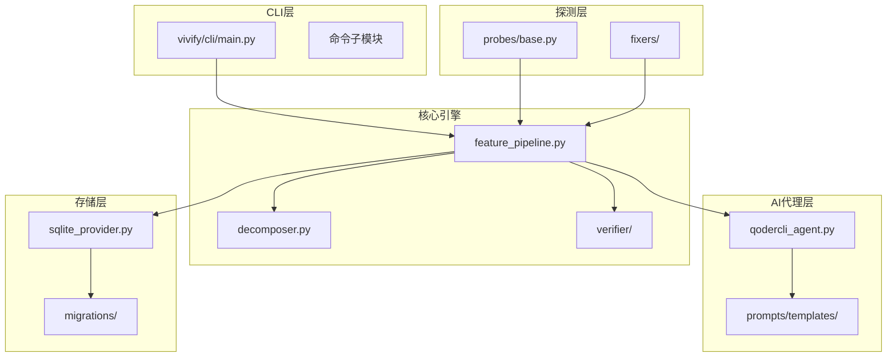
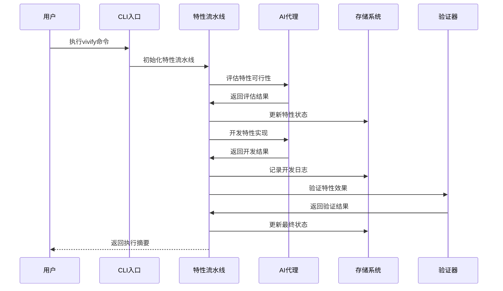
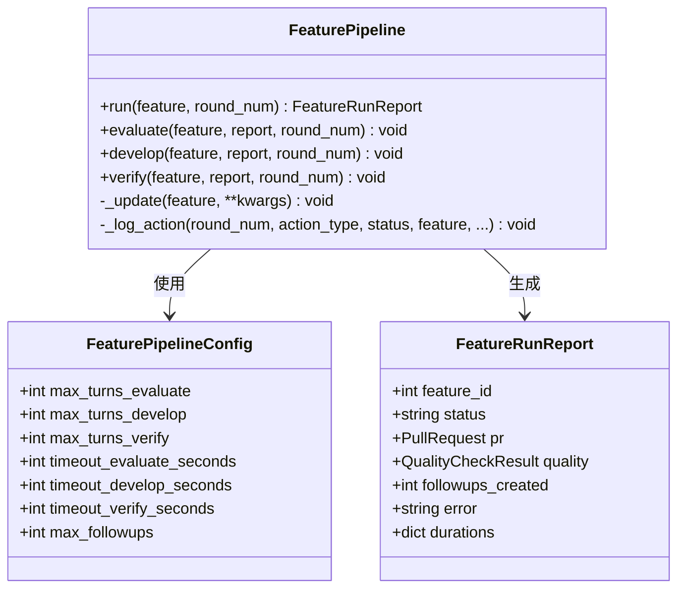
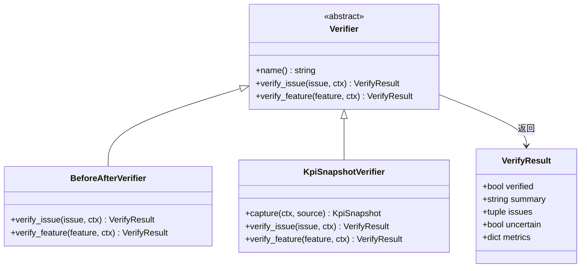
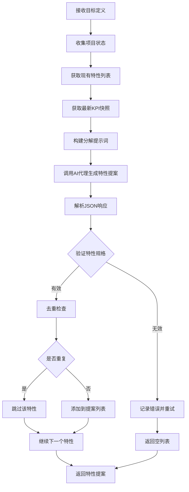
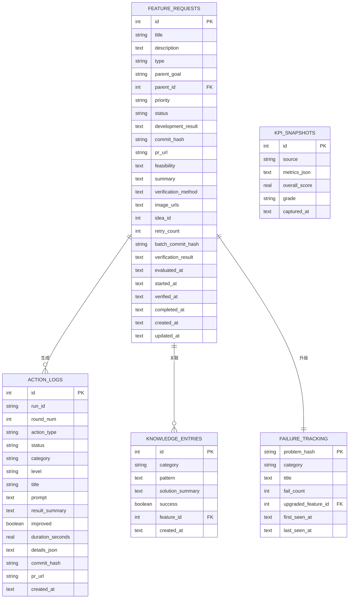
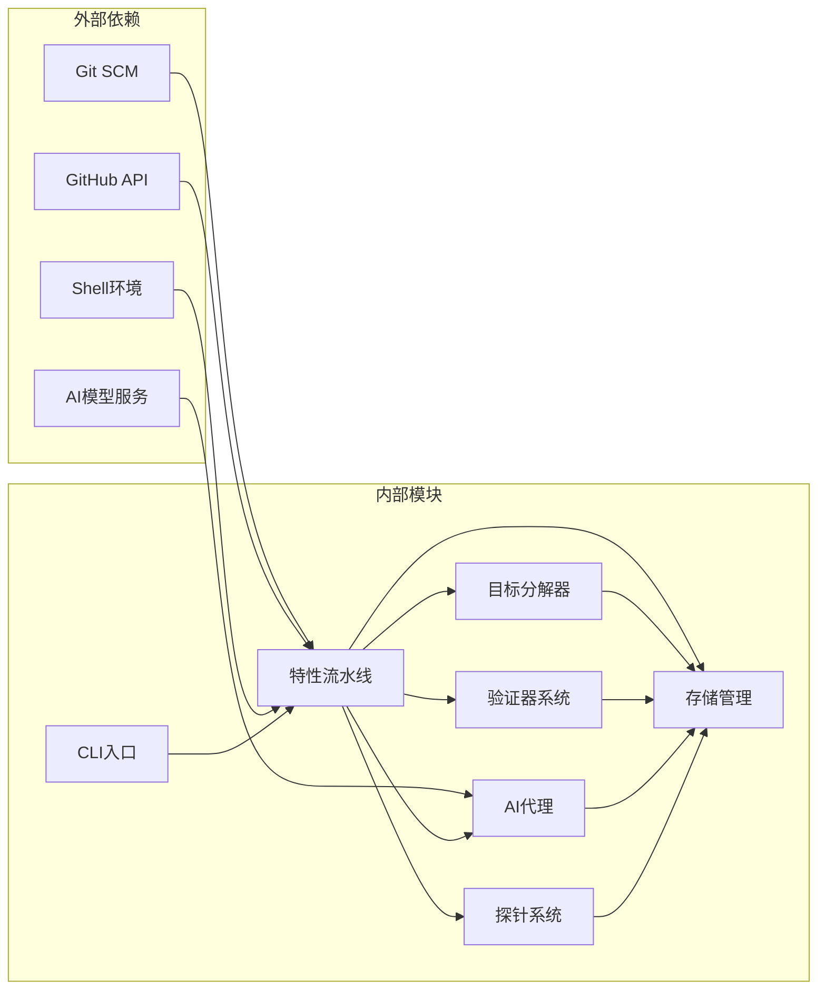
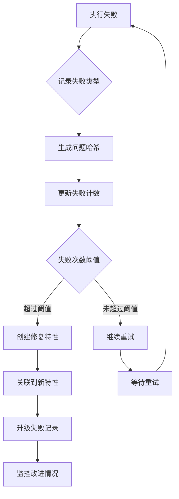

# 结果导向验证系统

<cite>
**本文档引用的文件**
- [README_EVALUATION.md](file://README_EVALUATION.md)
- [EVAL_SUMMARY.md](file://EVAL_SUMMARY.md)
- [vivify/__main__.py](file://vivify/__main__.py)
- [vivify/cli/main.py](file://vivify/cli/main.py)
- [vivify/verifier/__init__.py](file://vivify/verifier/__init__.py)
- [vivify/verifier/before_after.py](file://vivify/verifier/before_after.py)
- [vivify/verifier/kpi_snapshot.py](file://vivify/verifier/kpi_snapshot.py)
- [vivify/kernel/feature_pipeline.py](file://vivify/kernel/feature_pipeline.py)
- [vivify/goals/decomposer.py](file://vivify/goals/decomposer.py)
- [vivify/interfaces/verifier.py](file://vivify/interfaces/verifier.py)
- [vivify/models/feature.py](file://vivify/models/feature.py)
- [vivify/storage/sqlite_provider.py](file://vivify/storage/sqlite_provider.py)
- [vivify/agents/qodercli_agent.py](file://vivify/agents/qodercli_agent.py)
- [vivify/probes/base.py](file://vivify/probes/base.py)
- [vivify/agents/prompts/templates/goal_decompose.md.j2](file://vivify/agents/prompts/templates/goal_decompose.md.j2)
- [vivify/agents/prompts/templates/feature_develop.md.j2](file://vivify/agents/prompts/templates/feature_develop.md.j2)
- [vivify/agents/prompts/templates/feature_verify.md.j2](file://vivify/agents/prompts/templates/feature_verify.md.j2)
- [vivify/agents/prompts/templates/fix_issue.md.j2](file://vivify/agents/prompts/templates/fix_issue.md.j2)
- [vivify/storage/migrations/0001_init.sql](file://vivify/storage/migrations/0001_init.sql)
- [vivify/storage/migrations/0002_add_verification_method.sql](file://vivify/storage/migrations/0002_add_verification_method.sql)
- [vivify/storage/migrations/0003_enhance_feature_model.sql](file://vivify/storage/migrations/0003_enhance_feature_model.sql)
</cite>

## 目录
1. [简介](#简介)
2. [项目结构](#项目结构)
3. [核心组件](#核心组件)
4. [架构概览](#架构概览)
5. [详细组件分析](#详细组件分析)
6. [依赖关系分析](#依赖关系分析)
7. [性能考量](#性能考量)
8. [故障排查指南](#故障排查指南)
9. [结论](#结论)
10. [附录](#附录)

## 简介

结果导向验证系统是一个基于AI代理的自动化软件开发和验证框架，专为mlive项目设计。该系统通过"目标-特性-验证"的闭环流程，实现了从需求分解到代码实现再到效果验证的完整自动化。

### 系统特色
- **结果导向**：每个特性都有明确的业务KPI指标和可验证的方法
- **自动化流水线**：从目标分解到代码实现再到效果验证的全自动化流程
- **智能验证**：结合AI分析和传统探针检测，确保代码质量和业务价值
- **持续改进**：通过知识库和失败追踪机制不断优化

## 项目结构

**图表来源**
- [vivify/cli/main.py:1-58](file://vivify/cli/main.py#L1-L58)
- [vivify/kernel/feature_pipeline.py:1-1068](file://vivify/kernel/feature_pipeline.py#L1-L1068)
- [vivify/storage/sqlite_provider.py:1-484](file://vivify/storage/sqlite_provider.py#L1-L484)

**章节来源**
- [vivify/__main__.py:1-6](file://vivify/__main__.py#L1-L6)
- [vivify/cli/main.py:1-58](file://vivify/cli/main.py#L1-L58)

## 核心组件

### 1. 特性流水线引擎
特性流水线是整个系统的核心执行引擎，负责协调AI代理、存储系统和验证器，实现从特性评估到部署验证的完整流程。

### 2. 目标分解器
基于AI的智能分解器，能够将高层次的项目目标转化为具体的、可执行的特性请求，并避免重复和冗余。

### 3. 验证器系统
提供多种验证策略，包括前后对比验证和KPI快照验证，确保代码变更产生预期的业务效果。

### 4. 存储管理层
基于SQLite的持久化存储，支持特性状态跟踪、知识库管理和KPI指标快照。

**章节来源**
- [vivify/kernel/feature_pipeline.py:87-124](file://vivify/kernel/feature_pipeline.py#L87-L124)
- [vivify/goals/decomposer.py:121-134](file://vivify/goals/decomposer.py#L121-L134)
- [vivify/verifier/__init__.py:1-6](file://vivify/verifier/__init__.py#L1-L6)

## 架构概览

**图表来源**
- [vivify/kernel/feature_pipeline.py:110-123](file://vivify/kernel/feature_pipeline.py#L110-L123)
- [vivify/agents/qodercli_agent.py:101-130](file://vivify/agents/qodercli_agent.py#L101-L130)

## 详细组件分析

### 特性流水线架构

**图表来源**
- [vivify/kernel/feature_pipeline.py:87-107](file://vivify/kernel/feature_pipeline.py#L87-L107)
- [vivify/kernel/feature_pipeline.py:52-80](file://vivify/kernel/feature_pipeline.py#L52-L80)

### 验证器系统设计

**图表来源**
- [vivify/interfaces/verifier.py:40-63](file://vivify/interfaces/verifier.py#L40-L63)
- [vivify/verifier/before_after.py:20-66](file://vivify/verifier/before_after.py#L20-L66)
- [vivify/verifier/kpi_snapshot.py:25-84](file://vivify/verifier/kpi_snapshot.py#L25-L84)

### 目标分解流程

**图表来源**
- [vivify/goals/decomposer.py:213-285](file://vivify/goals/decomposer.py#L213-L285)

**章节来源**
- [vivify/kernel/feature_pipeline.py:125-201](file://vivify/kernel/feature_pipeline.py#L125-L201)
- [vivify/verifier/before_after.py:29-62](file://vivify/verifier/before_after.py#L29-L62)
- [vivify/verifier/kpi_snapshot.py:38-81](file://vivify/verifier/kpi_snapshot.py#L38-L81)

### 存储架构设计

**图表来源**
- [vivify/storage/migrations/0001_init.sql:9-97](file://vivify/storage/migrations/0001_init.sql#L9-L97)
- [vivify/storage/migrations/0003_enhance_feature_model.sql:5-13](file://vivify/storage/migrations/0003_enhance_feature_model.sql#L5-L13)

**章节来源**
- [vivify/storage/sqlite_provider.py:124-242](file://vivify/storage/sqlite_provider.py#L124-L242)
- [vivify/storage/migrations/0001_init.sql:1-100](file://vivify/storage/migrations/0001_init.sql#L1-L100)

## 依赖关系分析

**图表来源**
- [vivify/kernel/feature_pipeline.py:32-42](file://vivify/kernel/feature_pipeline.py#L32-L42)
- [vivify/agents/qodercli_agent.py:64-80](file://vivify/agents/qodercli_agent.py#L64-L80)

**章节来源**
- [vivify/agents/qodercli_agent.py:132-179](file://vivify/agents/qodercli_agent.py#L132-L179)
- [vivify/probes/base.py:177-208](file://vivify/probes/base.py#L177-L208)

## 性能考量

### 执行效率分析
根据评估报告显示，系统在不同阶段的执行效率如下：

- **特性开发阶段**：平均451秒，最长727秒
- **修复流程**：平均200秒，最长884秒  
- **特性验证阶段**：平均115秒，最长223秒
- **评估阶段**：平均102秒，最长185秒

### 并发处理能力
系统支持多特性并行开发，通过远程会话管理器实现分布式执行：

- 最大并发远程会话数：3个
- 远程会话轮询间隔：15秒
- 远程会话超时时间：900秒
- 本地执行超时控制：1800秒

### 存储性能优化
- 使用WAL模式提高并发读取性能
- 建立关键字段索引提升查询效率
- 连接池管理减少数据库连接开销

## 故障排查指南

### 常见问题及解决方案

#### 1. heal流程失败（77%失败率）
**问题症状**：`"No commits between main and branch"` 错误
**根本原因**：分支有效性检查缺失
**解决方案**：在特性开发前添加git log检查

#### 2. 工作树冲突
**问题症状**：git timeout错误
**根本原因**：多个特性同时使用相同工作树
**解决方案**：实现工作树健康检查和冲突检测

#### 3. 验证时机错误
**问题症状**：PR未合并时进行验证
**根本原因**：验证流程未检查PR合并状态
**解决方案**：添加PR合并状态门禁

### 故障追踪机制

**图表来源**
- [vivify/storage/sqlite_provider.py:308-364](file://vivify/storage/sqlite_provider.py#L308-L364)

**章节来源**
- [vivify/storage/sqlite_provider.py:308-364](file://vivify/storage/sqlite_provider.py#L308-L364)

## 结论

结果导向验证系统展现了优秀的工程实践和智能化水平。系统通过以下优势实现了高效的自动化开发：

### 核心优势
1. **完整的闭环设计**：从目标分解到效果验证形成完整闭环
2. **智能决策机制**：基于AI的特性评估和优先级排序
3. **多维度验证**：结合代码质量检查和业务KPI验证
4. **持续学习能力**：通过知识库和失败追踪不断优化

### 改进建议
1. **增强分支检查**：完善特性开发前的分支有效性验证
2. **优化工作流**：改进PR创建和验证的时机控制
3. **扩展监控**：增加前端性能指标的自动化检测
4. **提升稳定性**：加强网络异常和工作树冲突的容错处理

### 评估总结
系统整体评分为7.2/10，在代码质量、工程效率方面表现良好，但在某些特定场景下仍有改进空间。通过实施P0-P2级别的优化计划，预期可以显著提升系统的稳定性和成功率。

## 附录

### 关键配置参数
- **最大执行轮次**：评估30次，开发100次，验证20次
- **超时设置**：评估600秒，开发3600秒，验证600秒
- **并发限制**：最大3个远程会话，10个本地进程
- **重试机制**：最多3次重试，防止临时性故障影响

### 数据模型扩展
系统支持向后兼容的数据库迁移，当前版本包含：
- 基础特性管理（版本1）
- 验证方法字段（版本2）  
- 生命周期追踪字段（版本3）