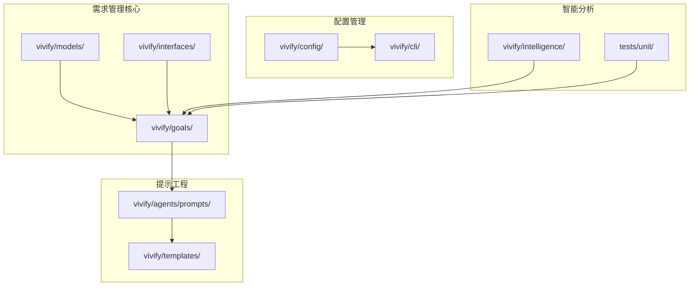
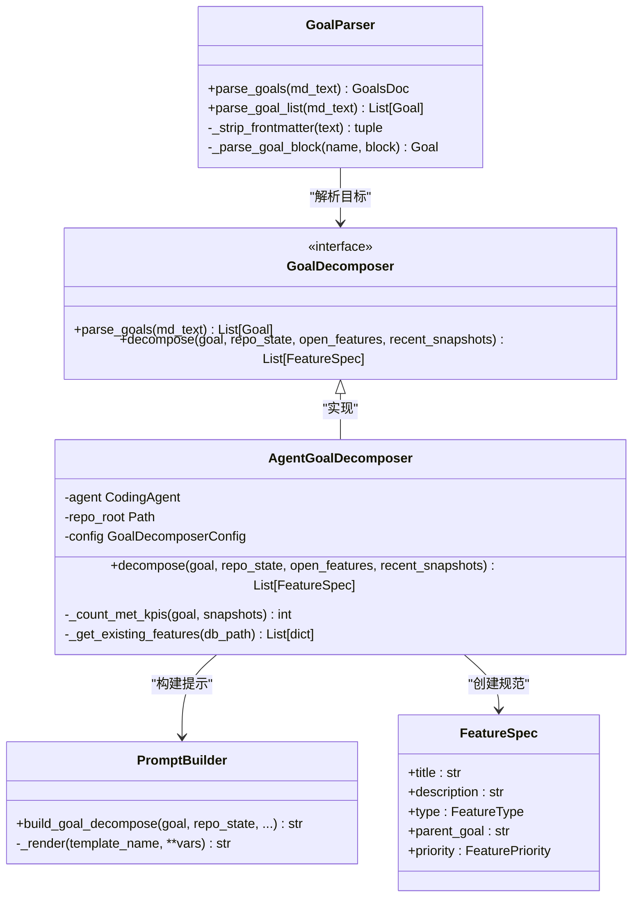
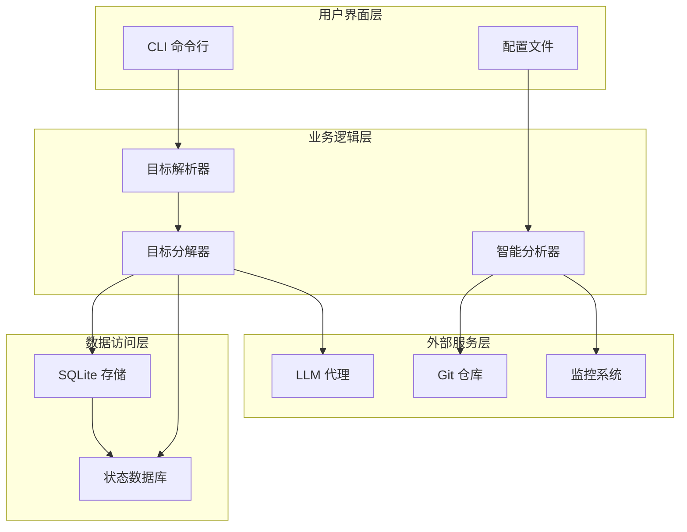
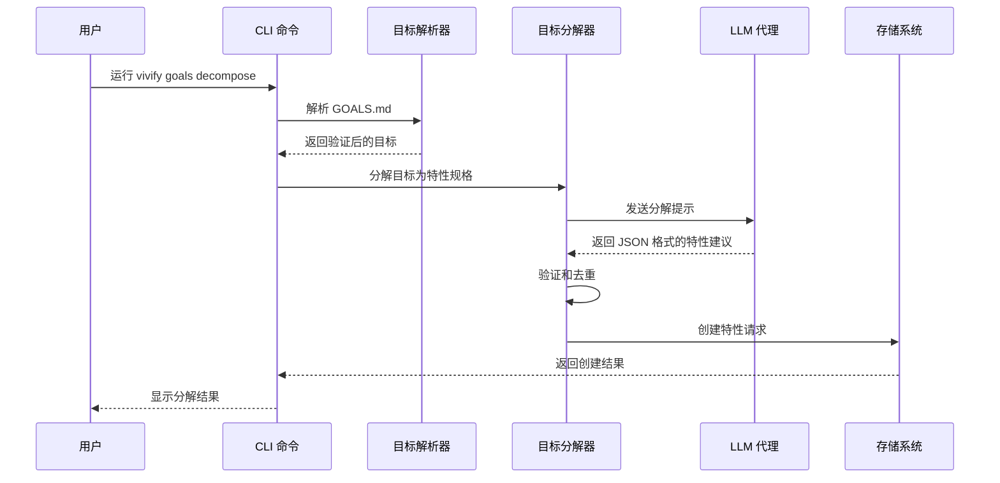
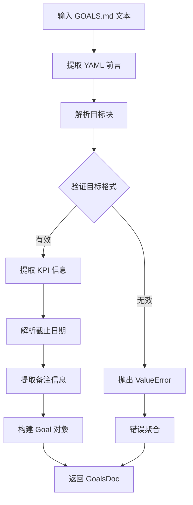
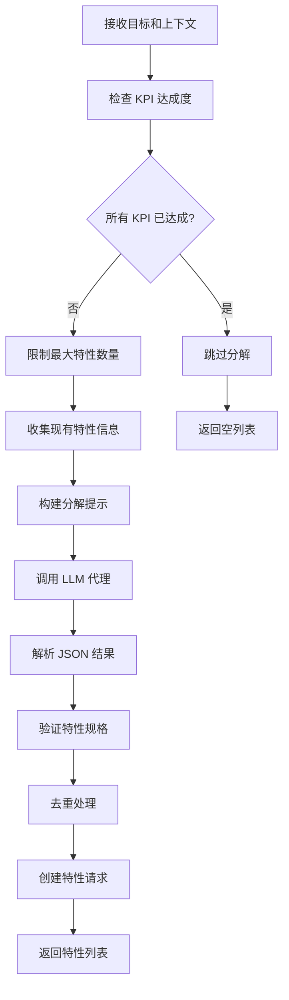
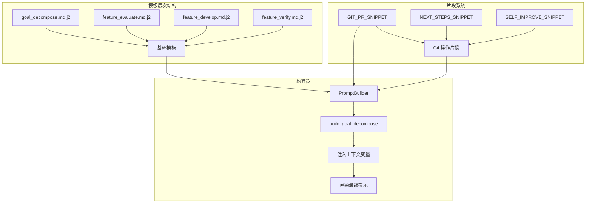
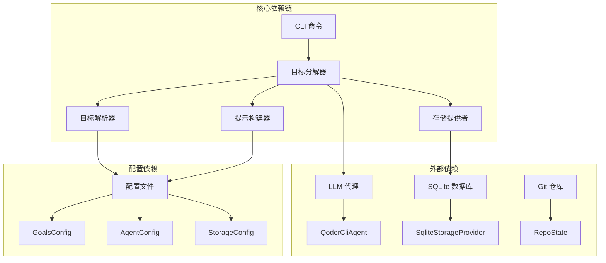

# 自动化需求派生功能

<cite>
**本文档引用的文件**
- [parser.py](file://vivify/goals/parser.py)
- [decomposer.py](file://vivify/goals/decomposer.py)
- [differ.py](file://vivify/goals/differ.py)
- [goal_decompose.md.j2](file://vivify/agents/prompts/templates/goal_decompose.md.j2)
- [builders.py](file://vivify/agents/prompts/builders.py)
- [goals_cmd.py](file://vivify/cli/goals_cmd.py)
- [goals_templates.py](file://vivify/intelligence/goals_templates.py)
- [schema.py](file://vivify/config/schema.py)
- [feature.py](file://vivify/models/feature.py)
- [snapshot.py](file://vivify/models/snapshot.py)
- [goal_decomposer.py](file://vivify/interfaces/goal_decomposer.py)
- [GOALS.md.tmpl](file://vivify/templates/GOALS.md.tmpl)
- [test_goal_parser.py](file://tests/unit/test_goal_parser.py)
</cite>

## 目录
1. [简介](#简介)
2. [项目结构](#项目结构)
3. [核心组件](#核心组件)
4. [架构概览](#架构概览)
5. [详细组件分析](#详细组件分析)
6. [依赖关系分析](#依赖关系分析)
7. [性能考虑](#性能考虑)
8. [故障排除指南](#故障排除指南)
9. [结论](#结论)

## 简介

自动化需求派生功能是 Vivify 项目的核心能力之一，它能够将高层次的项目目标（Goals）自动转换为具体的可执行特性请求（Feature Requests）。该功能通过智能分析项目的当前状态、历史数据和约束条件，自动生成符合项目需求的开发任务，从而实现从目标到行动的无缝衔接。

该系统采用多层架构设计，结合了自然语言处理、机器学习和自动化推理技术，为开发者提供了一个智能化的需求管理解决方案。通过这一功能，团队可以专注于战略规划，而具体的任务分解和执行细节则由系统自动完成。

## 项目结构

Vivify 项目采用模块化的组织方式，自动化需求派生功能主要分布在以下关键目录中：

**图表来源**
- [parser.py:1-202](file://vivify/goals/parser.py#L1-L202)
- [decomposer.py:1-289](file://vivify/goals/decomposer.py#L1-L289)
- [builders.py:1-145](file://vivify/agents/prompts/builders.py#L1-L145)

**章节来源**
- [parser.py:1-202](file://vivify/goals/parser.py#L1-L202)
- [decomposer.py:1-289](file://vivify/goals/decomposer.py#L1-L289)
- [builders.py:1-145](file://vivify/agents/prompts/builders.py#L1-L145)

## 核心组件

自动化需求派生功能由多个相互协作的组件构成，每个组件都有明确的职责和接口：

### 主要组件架构

**图表来源**
- [parser.py:164-198](file://vivify/goals/parser.py#L164-L198)
- [decomposer.py:121-285](file://vivify/goals/decomposer.py#L121-L285)
- [builders.py:113-135](file://vivify/agents/prompts/builders.py#L113-L135)
- [feature.py:61-71](file://vivify/models/feature.py#L61-L71)

### 数据模型

系统使用强类型的数据模型来确保数据的一致性和完整性：

| 模型名称 | 描述 | 关键属性 |
|---------|------|----------|
| Goal | 项目目标 | name, description, kpis[], deadline, notes |
| KPI | 关键绩效指标 | name, target, direction, unit |
| FeatureSpec | 特性规格 | title, description, type, priority, verification_method |
| FeatureRequest | 特性请求 | 扩展自FeatureSpec，添加状态和生命周期字段 |
| RepoState | 仓库状态快照 | repo_root, default_branch, languages[], recent_commits[] |

**章节来源**
- [feature.py:13-101](file://vivify/models/feature.py#L13-L101)
- [snapshot.py:9-17](file://vivify/models/snapshot.py#L9-L17)

## 架构概览

自动化需求派生功能采用分层架构设计，从上到下分为用户界面层、业务逻辑层、数据访问层和外部服务层：

**图表来源**
- [goals_cmd.py:109-166](file://vivify/cli/goals_cmd.py#L109-L166)
- [decomposer.py:213-285](file://vivify/goals/decomposer.py#L213-L285)
- [schema.py:114-119](file://vivify/config/schema.py#L114-L119)

### 工作流程

系统的工作流程遵循严格的步骤顺序，确保每个环节的正确性和可追溯性：

**图表来源**
- [goals_cmd.py:109-166](file://vivify/cli/goals_cmd.py#L109-L166)
- [decomposer.py:213-285](file://vivify/goals/decomposer.py#L213-L285)
- [builder.py:113-135](file://vivify/agents/prompts/builders.py#L113-L135)

## 详细组件分析

### 目标解析器组件

目标解析器负责将人类可读的 Markdown 格式目标转换为系统可处理的数据结构：

#### 核心功能分析

**图表来源**
- [parser.py:164-198](file://vivify/goals/parser.py#L164-L198)
- [parser.py:113-161](file://vivify/goals/parser.py#L113-L161)

#### 解析规则和约束

目标解析器实现了严格的格式验证机制：

| 元素 | 格式要求 | 示例 |
|------|----------|------|
| YAML 前言 | 必须以 `---` 开始和结束 | `version: 1 owner: "@team"` |
| 目标标题 | `## Goal: <目标名称>` | `## Goal: 减少 CI 不稳定性` |
| KPI 规则 | `- KPI: 名称 target=表达式 direction=up/down/stable` | `- KPI: ci_pass_rate target=>=98% direction=up` |
| 截止日期 | 支持 ISO 格式或季度格式 | `2025-12-31` 或 `2025-Q4` |

**章节来源**
- [parser.py:1-202](file://vivify/goals/parser.py#L1-L202)

### 目标分解器组件

目标分解器是系统的核心引擎，负责将高层次目标转换为具体可执行的任务：

#### 分解算法流程

**图表来源**
- [decomposer.py:213-285](file://vivify/goals/decomposer.py#L213-L285)
- [differ.py:20-27](file://vivify/goals/differ.py#L20-L27)

#### 智能决策机制

分解器实现了多层智能决策：

1. **KPI 达成度评估**：自动计算当前达成的 KPI 数量，决定分解策略
2. **特性数量限制**：根据达成度动态调整每次分解的最大特性数量
3. **去重保护**：防止重复提出相似的特性请求
4. **上下文感知**：利用项目历史和当前状态优化分解质量

**章节来源**
- [decomposer.py:136-240](file://vivify/goals/decomposer.py#L136-L240)

### 提示工程组件

提示工程组件负责构建高质量的 LLM 输入，确保分解过程的有效性：

#### 模板系统架构

**图表来源**
- [builders.py:113-135](file://vivify/agents/prompts/builders.py#L113-L135)
- [goal_decompose.md.j2:1-124](file://vivify/agents/prompts/templates/goal_decompose.md.j2#L1-L124)

#### 上下文注入机制

提示构建器支持多种上下文信息的动态注入：

| 上下文类型 | 注入内容 | 用途 |
|-----------|----------|------|
| 项目状态 | 语言、文件结构、最近提交 | 帮助 LLM 理解项目背景 |
| KPI 状态 | 当前指标值、目标值、趋势 | 指导特性分解方向 |
| 现有特性 | 进行中的特性列表、状态 | 避免重复工作 |
| 历史快照 | 最近的 KPI 测量结果 | 提供趋势分析依据 |

**章节来源**
- [builders.py:113-135](file://vivify/agents/prompts/builders.py#L113-L135)
- [goal_decompose.md.j2:24-53](file://vivify/agents/prompts/templates/goal_decompose.md.j2#L24-L53)

### 智能模板系统

系统内置了针对不同项目类型的场景化模板，提供开箱即用的配置：

#### 场景化模板矩阵

| 场景类型 | 适用项目 | 关键 KPI | 模板特点 |
|---------|----------|----------|----------|
| docs-only | 文档驱动项目 | 文档时效性、链接有效性 | 简洁明了，专注文档质量 |
| static-site | 静态网站 | 站点可用性、加载速度 | 强调性能和可用性指标 |
| web-app | Web 应用 | CI 稳定性、测试覆盖率 | 平衡质量与效率 |
| api-service | API 服务 | 服务可靠性、错误率 | 重视稳定性和性能 |
| python-package | Python 包 | CI 稳定性、代码质量 | 符合 Python 生态习惯 |
| cli-tool | 命令行工具 | 可靠性、代码质量 | 简化但全面的质量保证 |
| mobile-app | 移动应用 | 构建稳定性、依赖安全 | 考虑移动平台特殊性 |
| monorepo | 单体仓库 | 整体 CI 稳定性、覆盖率 | 管理复杂度和一致性 |
| infra | 基础设施 | 安全性、仓库整洁度 | 重点关注安全和维护性 |
| generic | 通用项目 | 代码健康、仓库整洁 | 作为回退方案 |

**章节来源**
- [goals_templates.py:18-189](file://vivify/intelligence/goals_templates.py#L18-L189)

## 依赖关系分析

系统采用松耦合的设计原则，通过清晰的接口定义实现组件间的解耦：

**图表来源**
- [goals_cmd.py:122-141](file://vivify/cli/goals_cmd.py#L122-L141)
- [decomposer.py:124-133](file://vivify/goals/decomposer.py#L124-L133)
- [schema.py:114-119](file://vivify/config/schema.py#L114-L119)

### 接口契约

系统通过明确的接口契约确保组件间的兼容性：

| 接口名称 | 方法签名 | 参数说明 | 返回值 |
|---------|----------|----------|--------|
| GoalDecomposer.parse_goals | (md_text: str) -> List[Goal] | Markdown 格式的目标文本 | 验证后的目标列表 |
| GoalDecomposer.decompose | (goal, repo_state, open_features, recent_snapshots) -> List[FeatureSpec] | 目标对象和上下文信息 | 特性规格列表 |
| PromptBuilder.build_goal_decompose | (goal, repo_state, ...) -> str | 目标和上下文变量 | 完整的提示文本 |

**章节来源**
- [goal_decomposer.py:34-63](file://vivify/interfaces/goal_decomposer.py#L34-L63)
- [builders.py:113-135](file://vivify/agents/prompts/builders.py#L113-L135)

## 性能考虑

自动化需求派生功能在设计时充分考虑了性能优化，采用多种策略确保系统的高效运行：

### 缓存策略

系统实现了多层次的缓存机制：

1. **模板缓存**：Jinja2 环境使用 LRU 缓存避免重复编译
2. **配置缓存**：频繁访问的配置信息进行内存缓存
3. **结果缓存**：分解结果在一定时间内缓存，避免重复计算

### 异步处理

对于耗时的操作，系统采用异步处理模式：

- LLM 调用使用超时控制
- 数据库查询支持并发访问
- 文件系统操作进行批处理

### 资源管理

系统实施严格的资源管理策略：

- 最大特性数量限制防止过度消耗
- 内存使用监控和限制
- 连接池管理数据库连接

## 故障排除指南

### 常见问题诊断

#### 目标解析错误

**症状**：运行 `vivify goals show` 报告解析错误

**可能原因**：
1. YAML 前言格式不正确
2. 目标标题格式错误
3. KPI 规则不符合规范
4. 截止日期格式无效

**解决方法**：
1. 检查 YAML 前言是否以 `---` 正确包围
2. 确保每个目标都使用 `## Goal:` 标题
3. 验证 KPI 规则的语法格式
4. 使用 ISO 格式或季度格式表示截止日期

#### 分解器异常

**症状**：`vivify goals decompose` 命令执行失败

**可能原因**：
1. LLM 代理不可用
2. SQLite 数据库连接失败
3. 配置文件缺失或格式错误
4. 权限不足访问项目文件

**解决方法**：
1. 验证 LLM 代理二进制文件路径
2. 检查 SQLite 数据库文件权限
3. 确认配置文件格式正确
4. 确保有足够的文件系统权限

#### 提示构建错误

**症状**：提示文本生成异常或内容不完整

**可能原因**：
1. 模板文件缺失或损坏
2. 上下文变量注入失败
3. Jinja2 渲染异常
4. 字符编码问题

**解决方法**：
1. 检查模板文件是否存在且完整
2. 验证所有必需的上下文变量都已提供
3. 确认模板语法正确无误
4. 检查文件编码格式

**章节来源**
- [test_goal_parser.py:60-98](file://tests/unit/test_goal_parser.py#L60-L98)

### 调试技巧

#### 日志分析

系统提供了详细的日志输出，可以通过以下方式启用调试模式：

1. 使用 `--debug` 参数增加日志详细程度
2. 检查 `.vivify/state.db` 中的状态信息
3. 查看 LLM 代理的响应时间和错误信息
4. 监控内存使用和性能指标

#### 验证步骤

1. **最小化测试**：创建简单的 GOALS.md 文件进行测试
2. **逐步验证**：分别测试解析、分解、存储等各个阶段
3. **边界测试**：测试极端情况和边界条件
4. **回归测试**：确保修复不会影响现有功能

## 结论

自动化需求派生功能代表了现代软件开发工具的发展方向，它将人工智能技术与传统的项目管理实践相结合，为开发者提供了一个智能化的需求管理解决方案。

该系统的主要优势包括：

1. **智能化程度高**：通过 LLM 代理实现智能的任务分解
2. **适应性强**：支持多种项目类型和场景
3. **可扩展性好**：模块化设计便于功能扩展
4. **用户体验佳**：简洁的命令行接口和丰富的配置选项
5. **可靠性强**：完善的错误处理和恢复机制

随着人工智能技术的不断发展，自动化需求派生功能将继续演进，为软件开发团队提供更加智能、高效的需求管理体验。通过持续的优化和改进，该系统有望成为 DevOps 和敏捷开发流程中的重要组成部分。