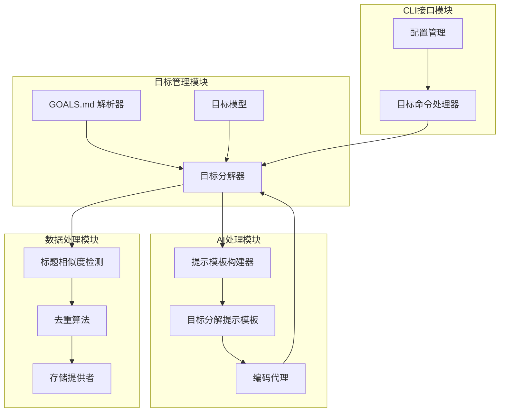
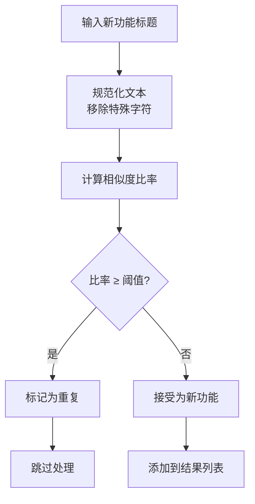
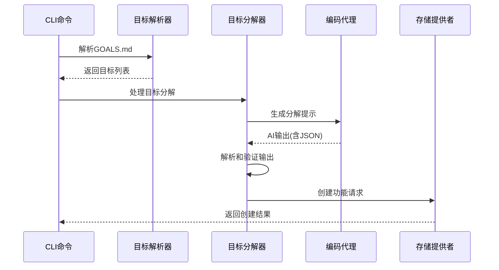
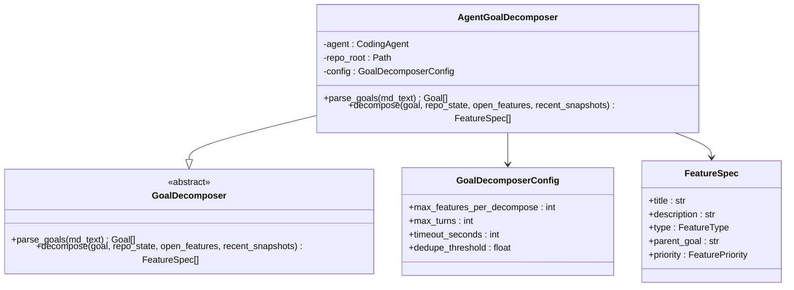
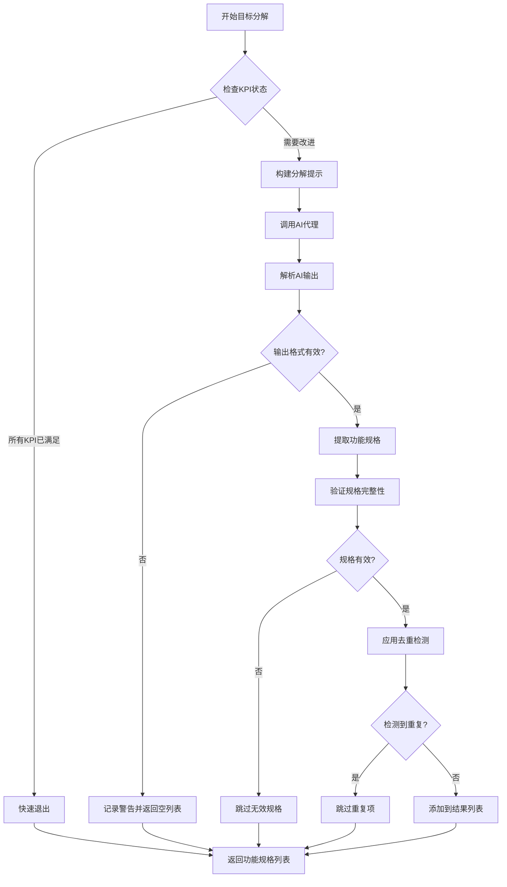
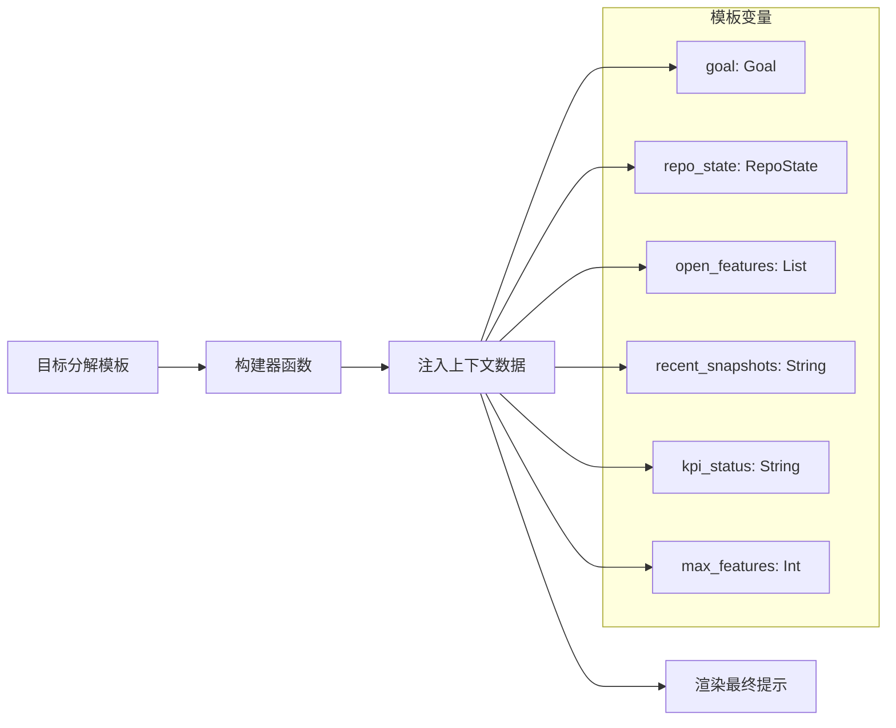
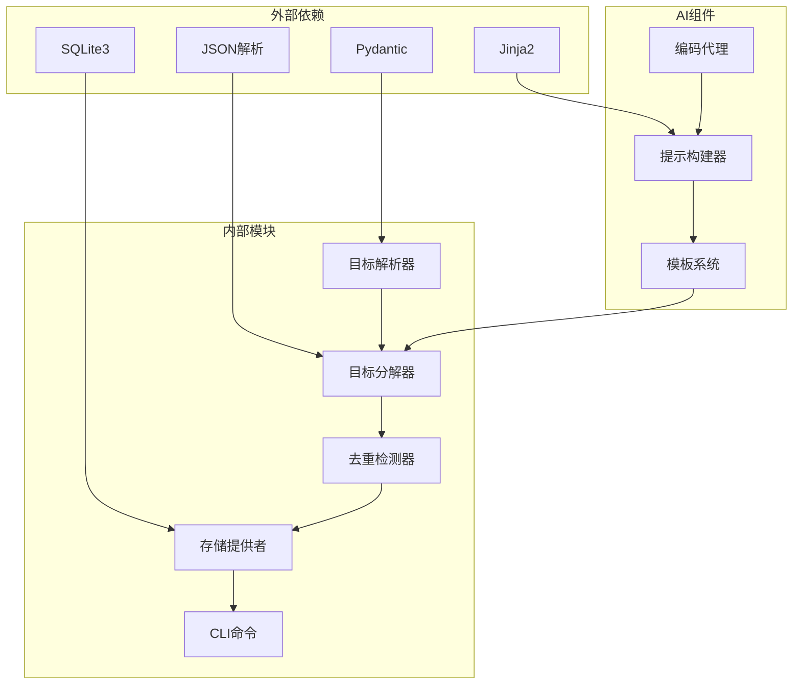

# 自动目标分解功能

<cite>
**本文档引用的文件**
- [decomposer.py](file://vivify/goals/decomposer.py)
- [parser.py](file://vivify/goals/parser.py)
- [differ.py](file://vivify/goals/differ.py)
- [goal_decomposer.py](file://vivify/interfaces/goal_decomposer.py)
- [goal_decompose.md.j2](file://vivify/agents/prompts/templates/goal_decompose.md.j2)
- [builders.py](file://vivify/agents/prompts/builders.py)
- [feature.py](file://vivify/models/feature.py)
- [goals_cmd.py](file://vivify/cli/goals_cmd.py)
- [feature_pipeline.py](file://vivify/kernel/feature_pipeline.py)
- [sqlite_provider.py](file://vivify/storage/sqlite_provider.py)
- [schema.py](file://vivify/config/schema.py)
- [GOALS.example.md](file://GOALS.example.md)
- [test_goal_parser.py](file://tests/unit/test_goal_parser.py)
</cite>

## 目录
1. [简介](#简介)
2. [项目结构](#项目结构)
3. [核心组件](#核心组件)
4. [架构概览](#架构概览)
5. [详细组件分析](#详细组件分析)
6. [依赖关系分析](#依赖关系分析)
7. [性能考虑](#性能考虑)
8. [故障排除指南](#故障排除指南)
9. [结论](#结论)

## 简介

自动目标分解功能是Vivify项目的核心能力之一，它能够将高层次的项目目标（Goals）自动转换为可执行的具体功能请求（Feature Requests）。该功能通过AI驱动的方式，分析项目的当前状态、KPI指标和开放功能，生成独立可行的功能规格说明，从而实现从目标到行动的有效转化。

该系统采用分层架构设计，包含目标解析、AI分解、去重处理和持久化存储等多个关键组件，确保生成的功能请求既符合业务目标又避免重复工作。

## 项目结构

自动目标分解功能涉及以下关键模块：

**图表来源**
- [decomposer.py:107-180](file://vivify/goals/decomposer.py#L107-L180)
- [parser.py:164-202](file://vivify/goals/parser.py#L164-L202)
- [builders.py:113-131](file://vivify/agents/prompts/builders.py#L113-L131)

**章节来源**
- [decomposer.py:1-181](file://vivify/goals/decomposer.py#L1-L181)
- [parser.py:1-202](file://vivify/goals/parser.py#L1-L202)
- [goal_decomposer.py:1-64](file://vivify/interfaces/goal_decomposer.py#L1-L64)

## 核心组件

### 目标分解器（GoalDecomposer）

目标分解器是整个系统的核心组件，负责将用户定义的目标转换为具体的功能规格。默认实现`AgentGoalDecomposer`委托给`CodingAgent`进行AI处理。

主要功能包括：
- 快速退出机制：当所有KPI都已满足时跳过分解过程
- AI提示构建：使用Jinja2模板生成分解提示
- 输出解析：提取JSON格式的新功能规格
- 去重处理：避免与现有开放功能重复

### 目标解析器（GoalParser）

目标解析器负责将GOALS.md文件解析为目标对象，支持YAML前言和结构化格式。

关键特性：
- 支持版本化目标文档
- 解析KPI指标、截止日期和备注
- 提供错误处理和验证机制
- 兼容多种日期格式（ISO和季度格式）

### 去重检测器（Duplicate Detector）

去重检测器使用字符串相似度算法避免重复的功能请求：

**图表来源**
- [differ.py:15-27](file://vivify/goals/differ.py#L15-L27)

**章节来源**
- [decomposer.py:107-180](file://vivify/goals/decomposer.py#L107-L180)
- [parser.py:164-202](file://vivify/goals/parser.py#L164-L202)
- [differ.py:1-31](file://vivify/goals/differ.py#L1-L31)

## 架构概览

自动目标分解功能采用分层架构，各层职责明确：

**图表来源**
- [goals_cmd.py:109-164](file://vivify/cli/goals_cmd.py#L109-L164)
- [decomposer.py:125-177](file://vivify/goals/decomposer.py#L125-L177)

系统架构特点：
- **解耦设计**：各组件职责单一，便于测试和维护
- **扩展性**：通过接口抽象支持不同的实现策略
- **鲁棒性**：包含完整的错误处理和边界条件检查
- **可观测性**：详细的日志记录和状态跟踪

## 详细组件分析

### AgentGoalDecomposer类分析

**图表来源**
- [decomposer.py:107-180](file://vivify/goals/decomposer.py#L107-L180)
- [goal_decomposer.py:34-63](file://vivify/interfaces/goal_decomposer.py#L34-L63)

### 目标分解流程

目标分解过程包含以下关键步骤：

**图表来源**
- [decomposer.py:125-177](file://vivify/goals/decomposer.py#L125-L177)

### 提示模板系统

系统使用Jinja2模板引擎构建AI提示：

**图表来源**
- [builders.py:113-131](file://vivify/agents/prompts/builders.py#L113-L131)
- [goal_decompose.md.j2:1-83](file://vivify/agents/prompts/templates/goal_decompose.md.j2#L1-L83)

**章节来源**
- [decomposer.py:125-177](file://vivify/goals/decomposer.py#L125-L177)
- [builders.py:113-131](file://vivify/agents/prompts/builders.py#L113-L131)
- [goal_decompose.md.j2:1-83](file://vivify/agents/prompts/templates/goal_decompose.md.j2#L1-L83)

## 依赖关系分析

系统依赖关系呈现清晰的层次结构：

**图表来源**
- [schema.py:1-242](file://vivify/config/schema.py#L1-L242)
- [sqlite_provider.py:1-200](file://vivify/storage/sqlite_provider.py#L1-L200)

主要依赖特点：
- **轻量级依赖**：仅使用必要的标准库和核心第三方库
- **类型安全**：通过Pydantic模型确保配置和数据的类型正确性
- **模板驱动**：使用Jinja2实现灵活的提示模板系统
- **持久化抽象**：通过接口抽象支持不同的存储后端

**章节来源**
- [schema.py:1-242](file://vivify/config/schema.py#L1-L242)
- [sqlite_provider.py:1-200](file://vivify/storage/sqlite_provider.py#L1-L200)

## 性能考虑

自动目标分解功能在设计时充分考虑了性能优化：

### 时间复杂度分析
- **目标解析**：O(n)，其中n是文档长度
- **AI调用**：O(1)，受最大轮次限制
- **去重检测**：O(m*k)，其中m是新规格数量，k是现有标题数量
- **整体复杂度**：O(n + m*k)

### 内存使用优化
- **流式处理**：避免一次性加载大文件到内存
- **限制输出数量**：通过配置参数控制单次分解的最大功能数量
- **缓存机制**：Jinja2环境使用LRU缓存减少模板编译开销

### 并发处理
- **线程安全**：存储提供者使用重入锁保证并发安全
- **异步支持**：AI调用支持超时控制和取消机制

## 故障排除指南

### 常见问题及解决方案

**问题1：AI输出格式不正确**
- **症状**：日志显示"new_features is not a list"警告
- **原因**：AI代理未按要求格式返回JSON
- **解决方案**：检查提示模板完整性和AI模型配置

**问题2：功能规格被错误地去重**
- **症状**：期望的功能规格被跳过
- **原因**：相似度阈值设置过高或文本预处理问题
- **解决方案**：调整`dedupe_threshold`配置参数

**问题3：目标解析失败**
- **症状**：抛出ValueError异常
- **原因**：GOALS.md格式不符合规范
- **解决方案**：参考示例文件格式修正文档内容

**问题4：存储连接问题**
- **症状**：数据库操作失败
- **原因**：SQLite文件权限或磁盘空间不足
- **解决方案**：检查数据库文件权限和可用磁盘空间

**章节来源**
- [decomposer.py:159-161](file://vivify/goals/decomposer.py#L159-L161)
- [test_goal_parser.py:60-98](file://tests/unit/test_goal_parser.py#L60-L98)

## 结论

自动目标分解功能通过精心设计的架构和实现，成功地将高层次的项目目标转化为可执行的具体行动。该系统具有以下优势：

1. **智能化程度高**：利用AI代理进行智能分解，减少人工干预
2. **鲁棒性强**：完善的错误处理和边界条件检查
3. **可扩展性好**：模块化设计支持不同实现策略
4. **性能优异**：优化的时间和空间复杂度
5. **易于使用**：简洁的CLI接口和配置管理

该功能为Vivify项目提供了强大的自动化能力，能够持续地将项目目标转化为具体的开发行动，提高团队的工作效率和项目交付质量。通过合理的配置和监控，系统能够在各种项目环境中稳定运行并发挥最佳效果。