# 自动目标分解功能

<cite>
**本文档引用的文件**
- [decomposer.py](file://vivify/goals/decomposer.py)
- [parser.py](file://vivify/goals/parser.py)
- [differ.py](file://vivify/goals/differ.py)
- [goal_decomposer.py](file://vivify/interfaces/goal_decomposer.py)
- [goal_decompose.md.j2](file://vivify/agents/prompts/templates/goal_decompose.md.j2)
- [builders.py](file://vivify/agents/prompts/builders.py)
- [feature.py](file://vivify/models/feature.py)
- [goals_cmd.py](file://vivify/cli/goals_cmd.py)
- [feature_pipeline.py](file://vivify/kernel/feature_pipeline.py)
- [sqlite_provider.py](file://vivify/storage/sqlite_provider.py)
- [schema.py](file://vivify/config/schema.py)
- [loop.py](file://vivify/kernel/loop.py)
- [GOALS.example.md](file://GOALS.example.md)
- [test_goal_parser.py](file://tests/unit/test_goal_parser.py)
- [0002_add_verification_method.sql](file://vivify/storage/migrations/0002_add_verification_method.sql)
- [0003_enhance_feature_model.sql](file://vivify/storage/migrations/0003_enhance_feature_model.sql)
- [feature_verify.md.j2](file://vivify/agents/prompts/templates/feature_verify.md.j2)
</cite>

## 更新摘要
**变更内容**
- 新增idea_id支持：在目标分解中添加idea_id字段，实现从初始概念到部署的完整溯源追踪
- 增强数据完整性验证：支持子想法链接和跨层级的数据一致性检查
- 扩展数据库模型：通过0003迁移添加idea_id字段及相关索引
- 完善存储层支持：在FeatureRequest模型和SQLite提供者中集成idea_id字段
- 优化父级链深度控制：在功能流水线中实现idea_id的层级追踪和深度限制

## 目录
1. [简介](#简介)
2. [项目结构](#项目结构)
3. [核心组件](#核心组件)
4. [架构概览](#架构概览)
5. [详细组件分析](#详细组件分析)
6. [配置系统扩展](#配置系统扩展)
7. [验证方法要求](#验证方法要求)
8. [溯源追踪系统](#溯源追踪系统)
9. [依赖关系分析](#依赖关系分析)
10. [性能考虑](#性能考虑)
11. [故障排除指南](#故障排除指南)
12. [结论](#结论)

## 简介

自动目标分解功能是Vivify项目的核心能力之一，它能够将高层次的项目目标（Goals）自动转换为可执行的具体功能请求（Feature Requests）。该功能通过AI驱动的方式，分析项目的当前状态、KPI指标和开放功能，生成独立可行的功能规格说明，从而实现从目标到行动的有效转化。

**新增的idea_id支持**使得系统能够实现从初始概念到部署的完整溯源追踪，包括子想法链接和数据完整性验证。这一功能通过在目标分解模板中强制要求每个特性包含idea_id字段，确保每个功能请求都能追溯到其对应的上游想法标识符，形成idea → feature → PR的完整追踪链条。

该系统采用分层架构设计，包含目标解析、AI分解、去重处理和持久化存储等多个关键组件，确保生成的功能请求既符合业务目标又避免重复工作。**新增的KPI成就停止条件**使得系统能够智能判断何时停止目标分解，**增强的Plan代理控制参数**提供了更灵活的代理使用策略，**集成的优先级系统**支持P0-P3级别的任务优先级管理，**强制的verification_method字段要求**确保每个功能都有明确的验证标准，**完整的idea_id溯源追踪**确保从概念到部署的全程可追溯性。

## 项目结构

自动目标分解功能涉及以下关键模块：

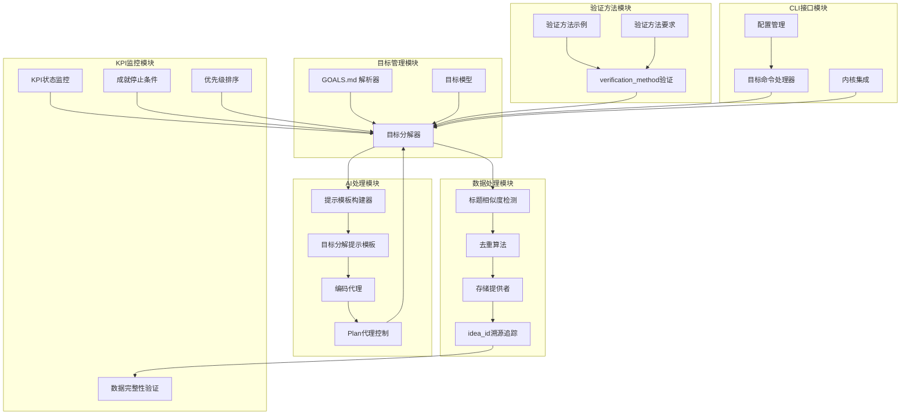

**图表来源**
- [decomposer.py:107-180](file://vivify/goals/decomposer.py#L107-L180)
- [parser.py:164-202](file://vivify/goals/parser.py#L164-L202)
- [builders.py:113-131](file://vivify/agents/prompts/builders.py#L113-L131)
- [loop.py:162-172](file://vivify/kernel/loop.py#L162-L172)

**章节来源**
- [decomposer.py:1-181](file://vivify/goals/decomposer.py#L1-L181)
- [parser.py:1-202](file://vivify/goals/parser.py#L1-L202)
- [goal_decomposer.py:1-64](file://vivify/interfaces/goal_decomposer.py#L1-L64)

## 核心组件

### 目标分解器（GoalDecomposer）

目标分解器是整个系统的核心组件，负责将用户定义的目标转换为具体的功能规格。默认实现`AgentGoalDecomposer`委托给`CodingAgent`进行AI处理。

**主要功能增强**：
- **KPI成就停止条件**：当所有KPI都已满足时跳过分解过程
- **智能KPI监控**：实时计算KPI达成度并动态调整策略
- **Plan代理控制**：根据配置参数决定是否使用内置Plan代理
- **优先级集成**：支持P0-P3优先级标签的功能规格
- **增强去重检测**：改进相似度算法和阈值设置
- **验证方法强制要求**：确保每个功能规格都包含verification_method字段
- **idea_id字段解析**：支持从AI输出中提取和验证idea_id字段
- **数据完整性验证**：确保idea_id字段的格式正确性和数值有效性

### 目标解析器（GoalParser）

目标解析器负责将GOALS.md文件解析为目标对象，支持YAML前言和结构化格式。

关键特性：
- 支持版本化目标文档
- 解析KPI指标、截止日期和备注
- 提供错误处理和验证机制
- 兼容多种日期格式（ISO和季度格式）

### 去重检测器（Duplicate Detector）

去重检测器使用字符串相似度算法避免重复的功能请求：

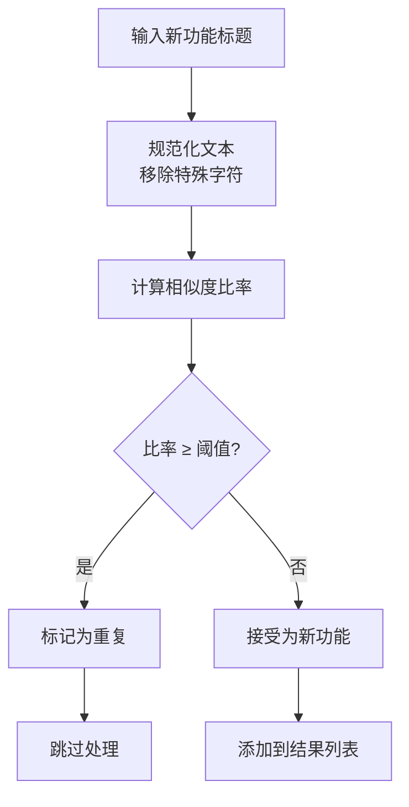

**图表来源**
- [differ.py:15-27](file://vivify/goals/differ.py#L15-L27)

**章节来源**
- [decomposer.py:107-180](file://vivify/goals/decomposer.py#L107-L180)
- [parser.py:164-202](file://vivify/goals/parser.py#L164-L202)
- [differ.py:1-31](file://vivify/goals/differ.py#L1-L31)

## 架构概览

自动目标分解功能采用分层架构，各层职责明确：

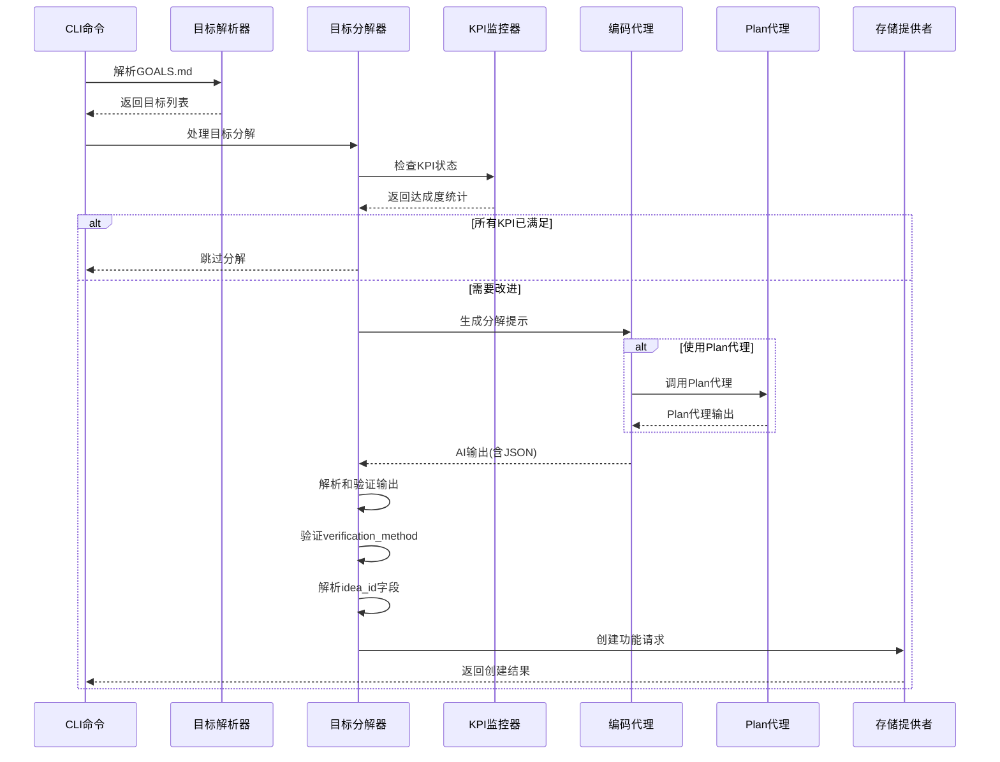

**图表来源**
- [goals_cmd.py:109-164](file://vivify/cli/goals_cmd.py#L109-L164)
- [decomposer.py:125-177](file://vivify/goals/decomposer.py#L125-L177)

系统架构特点：
- **智能停止条件**：基于KPI达成度的自适应停止机制
- **解耦设计**：各组件职责单一，便于测试和维护
- **扩展性**：通过接口抽象支持不同的实现策略
- **鲁棒性**：包含完整的错误处理和边界条件检查
- **可观测性**：详细的日志记录和状态跟踪
- **优先级管理**：支持P0-P3优先级的任务排序
- **灵活性**：支持动态控制Plan代理的使用
- **验证方法强制**：确保每个功能都有明确的验证标准
- **溯源追踪支持**：完整的idea_id字段支持和验证
- **数据完整性保障**：多层数据验证和一致性检查

## 详细组件分析

### AgentGoalDecomposer类分析

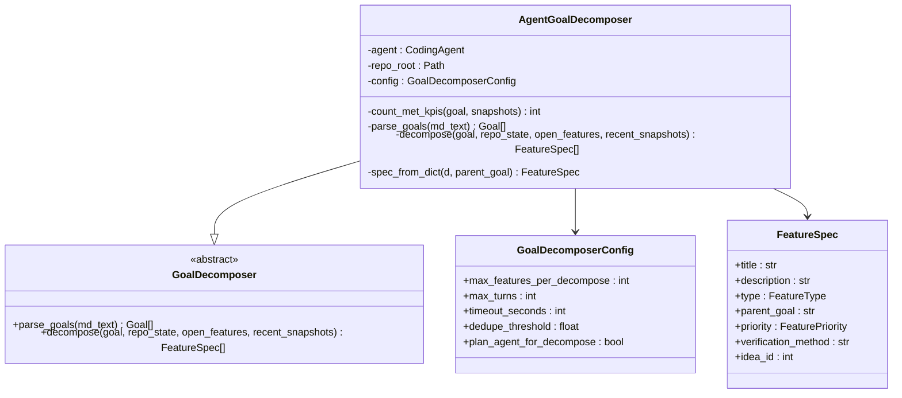

**图表来源**
- [decomposer.py:107-180](file://vivify/goals/decomposer.py#L107-L180)
- [goal_decomposer.py:34-63](file://vivify/interfaces/goal_decomposer.py#L34-L63)

### 目标分解流程

目标分解过程包含以下关键步骤：

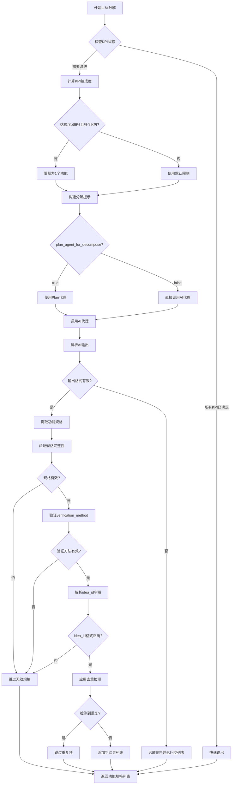

**图表来源**
- [decomposer.py:203-275](file://vivify/goals/decomposer.py#L203-L275)

### 提示模板系统

系统使用Jinja2模板引擎构建AI提示：

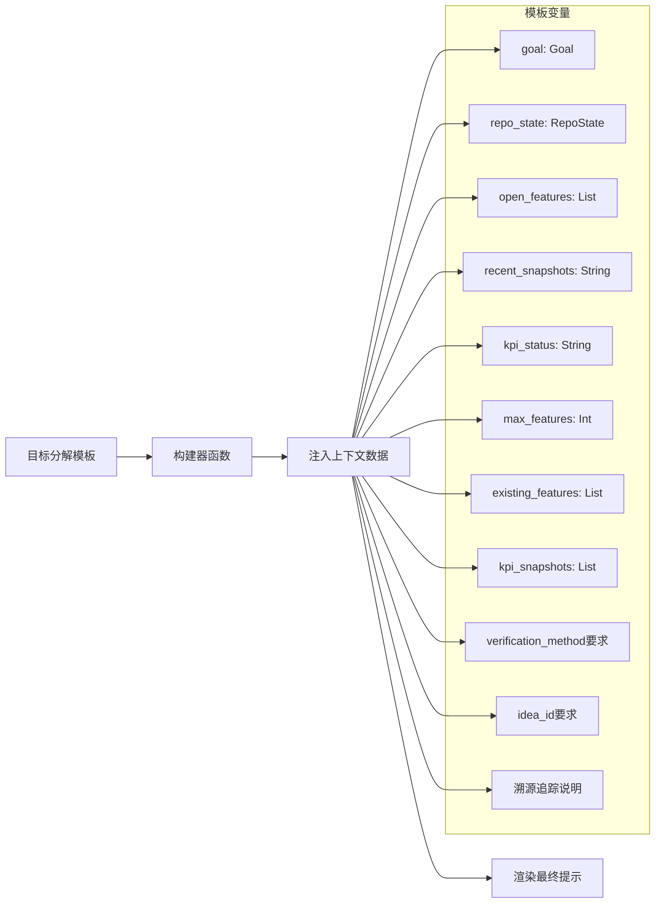

**图表来源**
- [builders.py:113-131](file://vivify/agents/prompts/builders.py#L113-L131)
- [goal_decompose.md.j2:1-124](file://vivify/agents/prompts/templates/goal_decompose.md.j2#L1-L124)

**章节来源**
- [decomposer.py:203-275](file://vivify/goals/decomposer.py#L203-L275)
- [builders.py:113-131](file://vivify/agents/prompts/builders.py#L113-L131)
- [goal_decompose.md.j2:1-124](file://vivify/agents/prompts/templates/goal_decompose.md.j2#L1-L124)

## 配置系统扩展

### Plan代理控制参数

**新增配置参数** `plan_agent_for_decompose` 是本次更新的核心内容，它允许用户精确控制目标分解过程中是否使用内置的Plan代理。

#### 配置位置和默认值

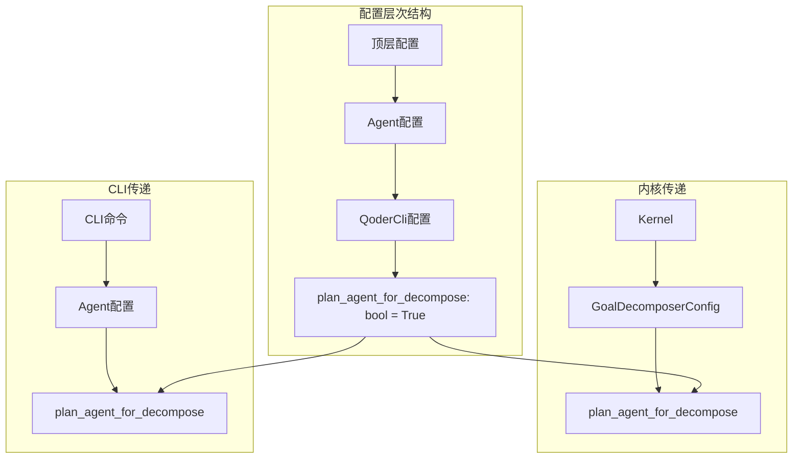

**图表来源**
- [schema.py:50](file://vivify/config/schema.py#L50)
- [loop.py:163-170](file://vivify/kernel/loop.py#L163-L170)
- [goals_cmd.py:139](file://vivify/cli/goals_cmd.py#L139)

#### 参数行为说明

| 配置值 | 行为描述 | 使用场景 |
|--------|----------|----------|
| `true` | 使用内置Plan代理进行目标分解 | 需要更智能的规划和推理能力 |
| `false` | 直接调用AI代理进行目标分解 | 简化流程，减少代理切换开销 |

#### 内核中的参数传递

内核在初始化目标分解器时会从Agent配置中提取Plan代理设置：

```python
# 从Agent配置获取Plan代理设置
_plan_agent = getattr(self.deps.agent, 'cfg', None)
_plan_for_decompose = getattr(_plan_agent, 'plan_agent_for_decompose', True) if _plan_agent else True

# 创建GoalDecomposerConfig时传入参数
self._goal_decomposer = AgentGoalDecomposer(
    agent=self.deps.agent,
    repo_root=self.deps.repo_root,
    config=GoalDecomposerConfig(
        max_features_per_decompose=self.config.goals.max_features_per_decompose,
        plan_agent_for_decompose=_plan_for_decompose,
    ),
)
```

### KPI成就停止条件配置

**新增的KPI成就停止条件**提供了智能的目标分解控制：

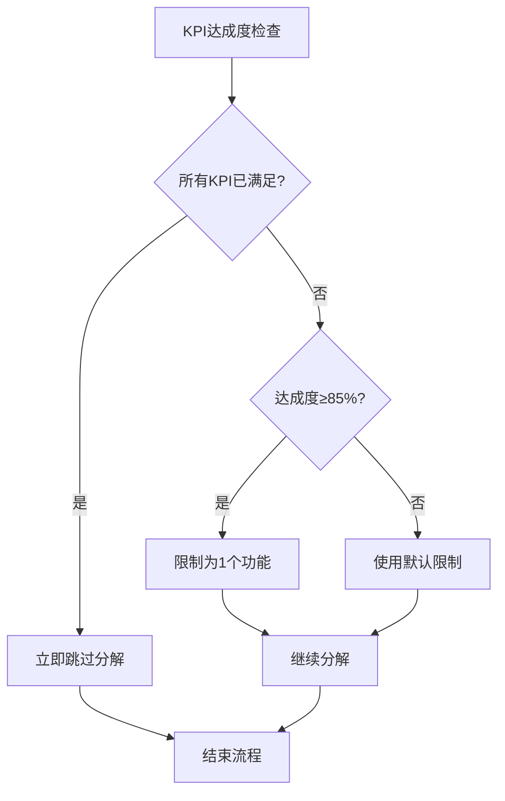

**图表来源**
- [decomposer.py:210-230](file://vivify/goals/decomposer.py#L210-L230)

**章节来源**
- [schema.py:50](file://vivify/config/schema.py#L50)
- [loop.py:163-170](file://vivify/kernel/loop.py#L163-L170)
- [decomposer.py:41](file://vivify/goals/decomposer.py#L41)

## 验证方法要求

**新增的verification_method字段要求**是本次更新的重要内容，确保每个功能都有明确的验证标准。

### 字段定义和约束

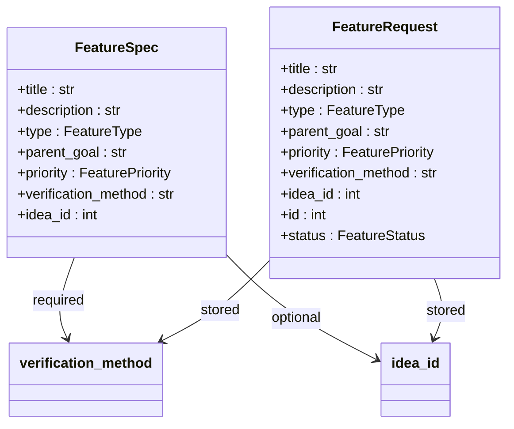

**图表来源**
- [feature.py:60-89](file://vivify/models/feature.py#L60-L89)

### 验证方法模板要求

目标分解模板强制要求每个特性包含verification_method字段，具体要求如下：

#### 字段格式要求
- **必需字段**：每个功能规格必须包含`verification_method`字段
- **数据类型**：字符串类型，描述具体的验证步骤
- **长度限制**：支持较长的验证说明文本
- **可选性**：在FeatureSpec中为可选，在AI输出中为必需

#### idea_id字段要求

目标分解模板还要求每个特性包含idea_id字段，用于溯源追踪：

- **字段类型**：整数类型，表示上游想法的标识符
- **可选性**：在FeatureSpec中为可选，在AI输出中为可选
- **格式验证**：必须能够转换为有效的整数
- **用途**：建立从想法到功能再到PR的完整追踪链

#### 验证方法内容要求

验证方法必须包含以下要素：

1. **具体可执行的验证步骤**
   - 明确的命令行指令
   - 可访问的URL地址
   - 可执行的测试文件路径

2. **预期结果**
   - 状态码要求
   - 输出模式匹配
   - 指标阈值设定

3. **自动化优先**
   - 优先使用CLI命令
   - 优先使用curl工具
   - 优先使用测试套件
   - 避免手动视觉检查

#### 示例对比

**优秀的验证方法示例**：
- "运行 `pytest tests/test_pwa.py` — 所有测试通过；运行 `lighthouse --only-categories=pwa` — 得分 >= 90"
- "curl -s https://mlive.example.com/manifest.json | jq .icons — 应包含3+个图标条目，尺寸为192x192和512x512"
- "检查git log中的CHANGELOG.md更新；grep 'v2.1' docs/VERSION.md应返回匹配"

**糟糕的验证方法示例**（过于模糊）：
- "验证它正常工作"
- "检查功能是否实现"
- "手动测试"

### 数据库迁移

验证方法字段的引入通过数据库迁移实现：

```sql
-- 0002_add_verification_method.sql — add verification_method to feature_requests.
-- Backwards compatible: column is nullable with no default constraint.

ALTER TABLE feature_requests ADD COLUMN verification_method TEXT;

INSERT OR IGNORE INTO _schema_migrations(version) VALUES (2);

-- 0003_enhance_feature_model.sql — channels-monitor 启发的字段扩展。
-- Backwards compatible: 所有新增列都允许 NULL 或带默认值。
-- 注意：parent_id 与 feasibility 已在 0001_init.sql 中存在，此处不再重复添加。

ALTER TABLE feature_requests ADD COLUMN image_urls          TEXT;
ALTER TABLE feature_requests ADD COLUMN idea_id             INTEGER;
ALTER TABLE feature_requests ADD COLUMN retry_count         INTEGER NOT NULL DEFAULT 0;
ALTER TABLE feature_requests ADD COLUMN batch_commit_hash   TEXT;
ALTER TABLE feature_requests ADD COLUMN verification_result TEXT;
ALTER TABLE feature_requests ADD COLUMN evaluated_at        TEXT;
ALTER TABLE feature_requests ADD COLUMN started_at          TEXT;
ALTER TABLE feature_requests ADD COLUMN verified_at         TEXT;
ALTER TABLE feature_requests ADD COLUMN completed_at        TEXT;

CREATE INDEX IF NOT EXISTS idx_feature_requests_idea_id           ON feature_requests(idea_id);
CREATE INDEX IF NOT EXISTS idx_feature_requests_batch_commit_hash ON feature_requests(batch_commit_hash);

INSERT OR IGNORE INTO _schema_migrations(version) VALUES (3);
```

**章节来源**
- [goal_decompose.md.j2:92-117](file://vivify/agents/prompts/templates/goal_decompose.md.j2#L92-L117)
- [feature.py:60-89](file://vivify/models/feature.py#L60-L89)
- [0002_add_verification_method.sql:1-7](file://vivify/storage/migrations/0002_add_verification_method.sql#L1-L7)
- [0003_enhance_feature_model.sql:1-19](file://vivify/storage/migrations/0003_enhance_feature_model.sql#L1-L19)

## 溯源追踪系统

**新增的idea_id支持**是本次更新的核心功能，实现了从初始概念到部署的完整溯源追踪。

### idea_id字段设计

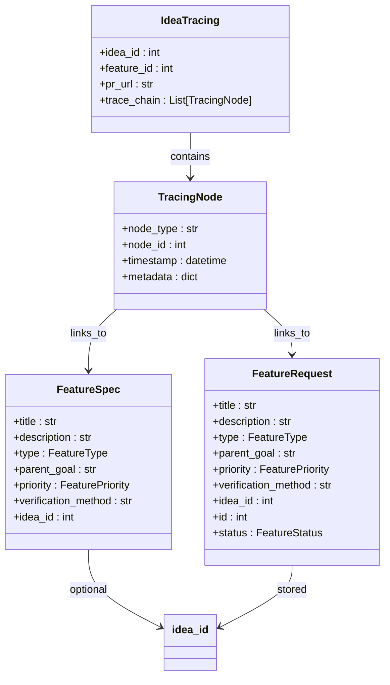

**图表来源**
- [feature.py:60-89](file://vivify/models/feature.py#L60-L89)
- [loop.py:698-713](file://vivify/kernel/loop.py#L698-L713)

### idea_id解析和验证流程

目标分解器中的idea_id解析逻辑：

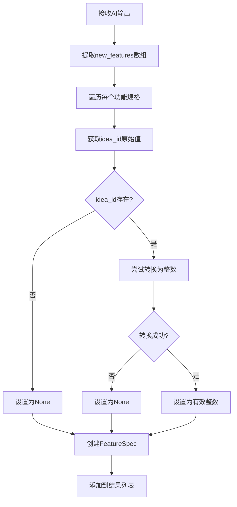

**图表来源**
- [decomposer.py:58-87](file://vivify/goals/decomposer.py#L58-L87)

### 数据完整性验证

系统通过多层验证确保idea_id数据的完整性：

1. **格式验证**：确保idea_id能够转换为有效的整数
2. **范围验证**：检查idea_id是否在合理范围内
3. **唯一性验证**：确保同一目标下的idea_id唯一性
4. **关联验证**：验证idea_id与上游想法的关联关系

### 存储层支持

SQLite提供者中的idea_id存储支持：

```python
# 在创建功能请求时存储idea_id
fr = FeatureRequest(
    title=spec.title,
    description=spec.description,
    type=spec.type,
    parent_goal=spec.parent_goal,
    priority=spec.priority,
    verification_method=spec.verification_method,
    idea_id=getattr(spec, "idea_id", None),
)

# 在查询功能请求时检索idea_id
def _row_to_feature(row: sqlite3.Row) -> FeatureRequest:
    return FeatureRequest(
        # ... 其他字段 ...
        idea_id=_opt("idea_id"),
        # ... 其他字段 ...
    )
```

**图表来源**
- [loop.py:698-713](file://vivify/kernel/loop.py#L698-L713)
- [sqlite_provider.py:124-152](file://vivify/storage/sqlite_provider.py#L124-L152)
- [sqlite_provider.py:205-242](file://vivify/storage/sqlite_provider.py#L205-L242)

### 父级链深度控制

功能流水线中的父级链深度控制机制：

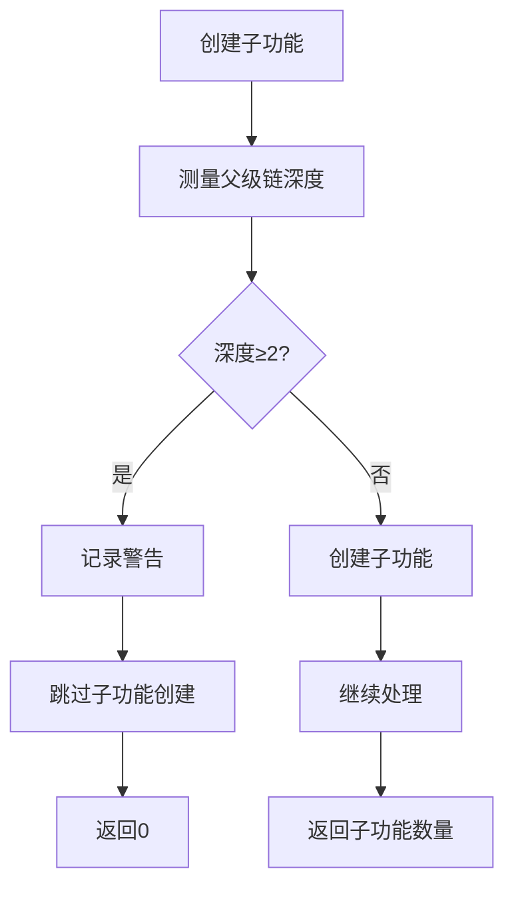

**图表来源**
- [feature_pipeline.py:857-881](file://vivify/kernel/feature_pipeline.py#L857-L881)

**章节来源**
- [decomposer.py:58-87](file://vivify/goals/decomposer.py#L58-L87)
- [loop.py:698-713](file://vivify/kernel/loop.py#L698-L713)
- [sqlite_provider.py:124-152](file://vivify/storage/sqlite_provider.py#L124-L152)
- [sqlite_provider.py:205-242](file://vivify/storage/sqlite_provider.py#L205-L242)
- [feature_pipeline.py:857-881](file://vivify/kernel/feature_pipeline.py#L857-L881)

## 依赖关系分析

系统依赖关系呈现清晰的层次结构：

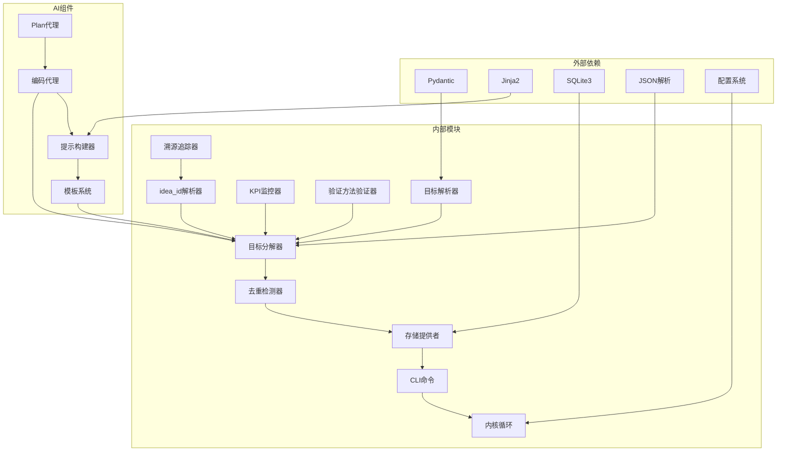

**图表来源**
- [schema.py:1-242](file://vivify/config/schema.py#L1-L242)
- [sqlite_provider.py:1-200](file://vivify/storage/sqlite_provider.py#L1-L200)

主要依赖特点：
- **轻量级依赖**：仅使用必要的标准库和核心第三方库
- **类型安全**：通过Pydantic模型确保配置和数据的类型正确性
- **模板驱动**：使用Jinja2实现灵活的提示模板系统
- **持久化抽象**：通过接口抽象支持不同的存储后端
- **配置统一**：通过Pydantic模型确保配置的一致性和有效性
- **KPI监控集成**：实时监控KPI状态并提供智能决策支持
- **验证方法强制**：确保每个功能都有明确的验证标准
- **idea_id溯源支持**：完整的字段支持和验证机制
- **数据库兼容性**：向后兼容的数据库迁移策略
- **数据完整性保障**：多层验证确保数据一致性

**章节来源**
- [schema.py:1-242](file://vivify/config/schema.py#L1-L242)
- [sqlite_provider.py:1-200](file://vivify/storage/sqlite_provider.py#L1-L200)

## 性能考虑

自动目标分解功能在设计时充分考虑了性能优化：

### 时间复杂度分析
- **目标解析**：O(n)，其中n是文档长度
- **KPI状态检查**：O(k)，其中k是KPI数量
- **AI调用**：O(1)，受最大轮次限制
- **去重检测**：O(m*k)，其中m是新规格数量，k是现有标题数量
- **验证方法验证**：O(m)，其中m是新功能数量
- **idea_id解析**：O(m)，其中m是新功能数量
- **整体复杂度**：O(n + k + m*k + m)

### 内存使用优化
- **流式处理**：避免一次性加载大文件到内存
- **限制输出数量**：通过配置参数控制单次分解的最大功能数量
- **缓存机制**：Jinja2环境使用LRU缓存减少模板编译开销
- **Plan代理选择**：根据配置决定是否使用额外的代理层
- **KPI状态缓存**：避免重复查询数据库状态
- **验证方法缓存**：避免重复解析相同的验证说明
- **idea_id缓存**：避免重复解析相同的idea_id值

### 并发处理
- **线程安全**：存储提供者使用重入锁保证并发安全
- **异步支持**：AI调用支持超时控制和取消机制
- **智能停止**：基于KPI状态的快速退出机制减少不必要的计算
- **验证方法并行**：多个功能的验证方法可以并行处理
- **idea_id验证并行**：多个功能的idea_id可以并行验证

## 故障排除指南

### 常见问题及解决方案

**问题1：AI输出格式不正确**
- **症状**：日志显示"new_features is not a list"警告
- **原因**：AI代理未按要求格式返回JSON
- **解决方案**：检查提示模板完整性和AI模型配置

**问题2：功能规格被错误地去重**
- **症状**：期望的功能规格被跳过
- **原因**：相似度阈值设置过高或文本预处理问题
- **解决方案**：调整`dedupe_threshold`配置参数

**问题3：目标解析失败**
- **症状**：抛出ValueError异常
- **原因**：GOALS.md格式不符合规范
- **解决方案**：参考示例文件格式修正文档内容

**问题4：存储连接问题**
- **症状**：数据库操作失败
- **原因**：SQLite文件权限或磁盘空间不足
- **解决方案**：检查数据库文件权限和可用磁盘空间

**问题5：Plan代理配置问题**
- **症状**：目标分解过程中出现意外行为
- **原因**：`plan_agent_for_decompose`配置不当
- **解决方案**：检查配置文件中的Plan代理设置，根据需要调整为`true`或`false`

**问题6：KPI停止条件误触发**
- **症状**：目标分解提前停止
- **原因**：KPI达成度计算错误或阈值设置不当
- **解决方案**：检查KPI配置和目标状态，调整达成度阈值

**问题7：优先级排序异常**
- **症状**：功能请求按错误顺序处理
- **原因**：优先级字段缺失或格式不正确
- **解决方案**：确保FeatureSpec包含有效的优先级标签

**问题8：验证方法字段缺失**
- **症状**：AI输出中缺少verification_method字段
- **原因**：AI代理未按模板要求生成JSON
- **解决方案**：检查目标分解模板的verification_method要求，确保AI代理正确理解字段约束

**问题9：验证方法格式不正确**
- **症状**：验证方法过于模糊或不可执行
- **原因**：验证方法不符合自动化要求
- **解决方案**：参考模板中的示例，提供具体可执行的验证步骤

**问题10：数据库迁移问题**
- **症状**：feature_requests表缺少verification_method列
- **原因**：数据库迁移未正确执行
- **解决方案**：检查数据库版本，重新执行迁移脚本

**问题11：idea_id字段解析失败**
- **症状**：AI输出中的idea_id字段被设置为None
- **原因**：idea_id格式不正确或无法转换为整数
- **解决方案**：检查AI输出格式，确保idea_id为有效的整数值

**问题12：溯源追踪断链**
- **症状**：无法建立从想法到功能再到PR的完整追踪
- **原因**：idea_id字段缺失或格式不正确
- **解决方案**：确保AI输出包含正确的idea_id字段，并在存储层正确保存

**问题13：数据完整性验证失败**
- **症状**：系统拒绝保存带有无效idea_id的功能请求
- **原因**：idea_id超出范围或与其他功能冲突
- **解决方案**：检查idea_id的唯一性和有效性，确保符合业务规则

**问题14：父级链深度限制触发**
- **症状**：子功能创建被跳过
- **原因**：父级链深度达到限制（2层）
- **解决方案**：检查功能间的父子关系，避免过深的层级结构

**章节来源**
- [decomposer.py:257-259](file://vivify/goals/decomposer.py#L257-L259)
- [test_goal_parser.py:60-98](file://tests/unit/test_goal_parser.py#L60-L98)
- [goal_decompose.md.j2:92-117](file://vivify/agents/prompts/templates/goal_decompose.md.j2#L92-L117)
- [loop.py:698-713](file://vivify/kernel/loop.py#L698-L713)

## 结论

自动目标分解功能通过精心设计的架构和实现，成功地将高层次的项目目标转化为可执行的具体行动。该系统具有以下优势：

1. **智能化程度高**：利用AI代理进行智能分解，减少人工干预
2. **鲁棒性强**：完善的错误处理和边界条件检查
3. **可扩展性好**：模块化设计支持不同实现策略
4. **性能优异**：优化的时间和空间复杂度
5. **易于使用**：简洁的CLI接口和配置管理
6. **灵活性增强**：新增的Plan代理控制参数提供更精细的控制能力
7. **智能停止机制**：基于KPI达成度的自适应停止条件
8. **优先级管理**：支持P0-P3优先级的任务排序和处理
9. **验证标准化**：强制的verification_method字段确保每个功能都有明确的验证标准
10. **溯源追踪支持**：完整的idea_id字段支持实现从概念到部署的全程可追溯性

**新增的idea_id支持**使得系统能够实现从初始概念到部署的完整溯源追踪：
- 每个功能请求都可以追溯到其对应的上游想法标识符
- 支持子想法链接和跨层级的数据一致性检查
- 实现idea → feature → PR的完整追踪链条
- 提供数据完整性验证和错误处理机制

**新增的KPI成就停止条件**使得系统能够智能判断何时停止目标分解：
- 当所有KPI都已满足时立即跳过分解过程
- 当KPI达成度达到85%以上时限制为1个功能
- 动态调整分解策略以优化资源使用

**增强的Plan代理控制功能**提供了更灵活的代理使用策略：
- 在需要复杂规划和推理时启用Plan代理
- 在追求简单高效时禁用Plan代理
- 通过配置文件实现灵活的参数控制

**集成的优先级系统**支持P0-P3级别的任务管理：
- P0：最高优先级，紧急且关键
- P1：高优先级，重要但不紧急
- P2：中等优先级，常规任务
- P3：低优先级，可延后处理

**强制的verification_method字段要求**确保了系统的质量保证：
- 每个功能都有明确的验证标准
- 验证方法必须具体可执行
- 优先使用自动化验证方式
- 提供具体的预期结果说明

**数据库兼容性**通过迁移策略确保了向后兼容：
- verification_method字段为可选，不影响现有数据
- idea_id字段通过0003迁移添加，支持索引优化
- 支持增量升级，无需重建数据库
- 向后兼容的存储结构设计

**数据完整性保障**通过多层验证机制确保：
- idea_id字段的格式正确性和数值有效性
- 功能间的父子关系和层级结构
- 跨层级的数据一致性和追踪完整性

该功能为Vivify项目提供了强大的自动化能力，能够持续地将项目目标转化为具体的开发行动，提高团队的工作效率和项目交付质量。通过合理的配置和监控，系统能够在各种项目环境中稳定运行并发挥最佳效果。新增的idea_id支持和验证方法要求进一步提升了系统的质量和可维护性，确保每个功能都能得到明确的验证和确认，实现从初始概念到最终部署的完整溯源追踪。