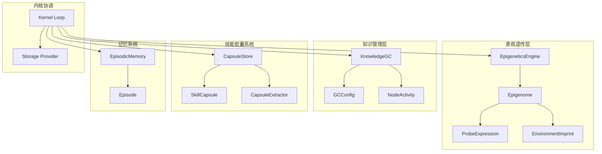
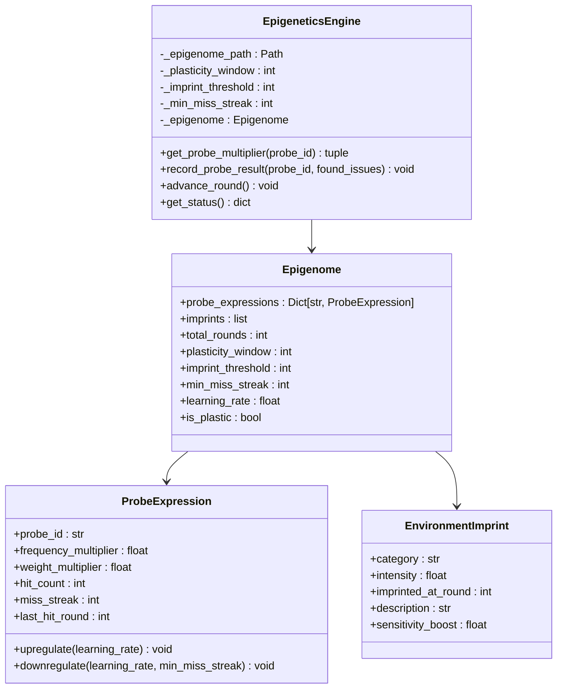
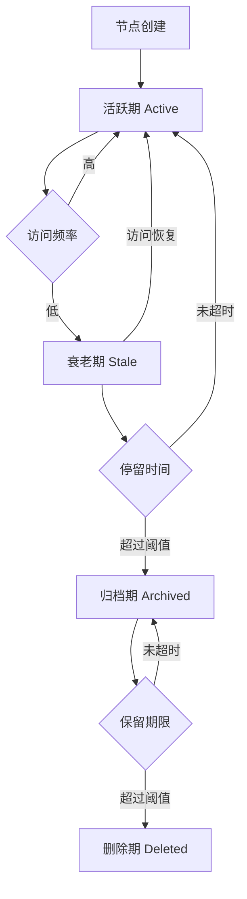
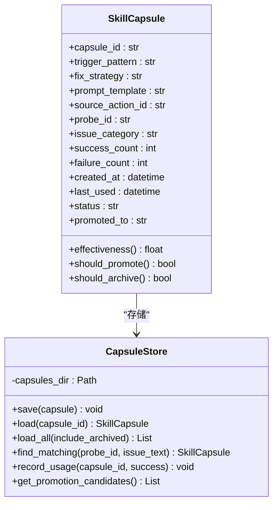
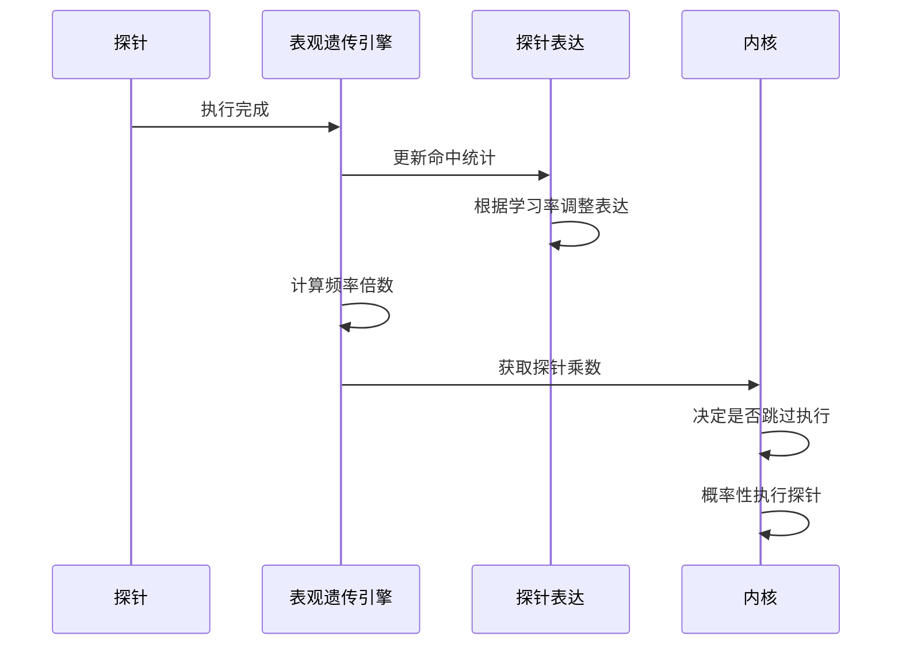
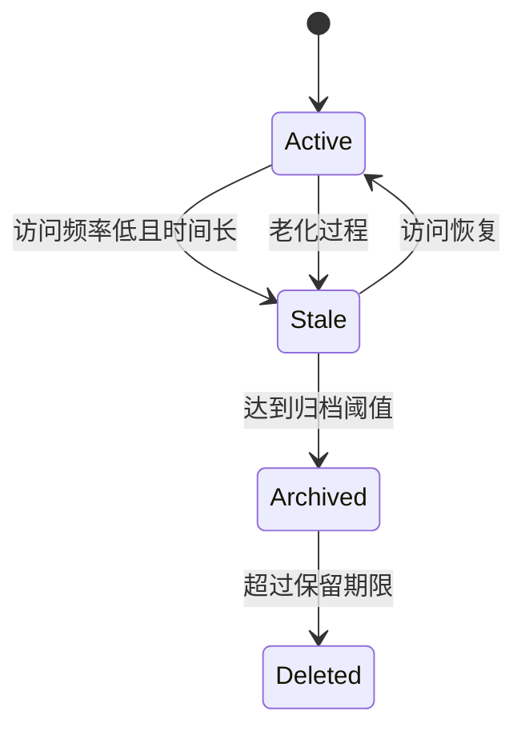
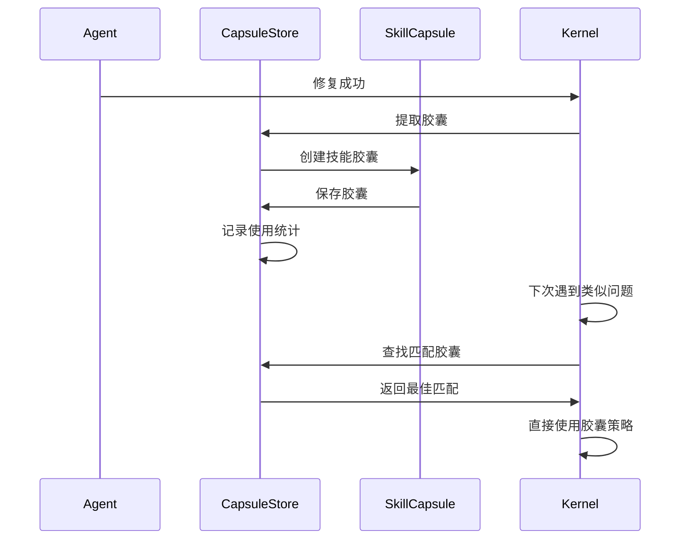
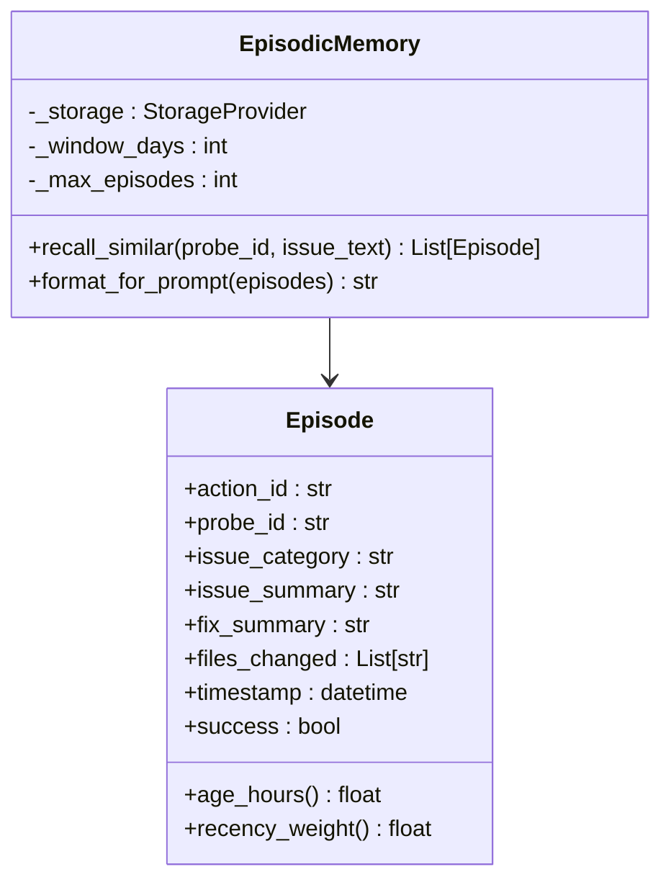

# 表观遗传学系统

<cite>
**本文档引用的文件**
- [README.md](file://README.md)
- [ROADMAP_LIVING_SYSTEM.md](file://ROADMAP_LIVING_SYSTEM.md)
- [epigenetics.py](file://vivify/intelligence/epigenetics.py)
- [episodic_memory.py](file://vivify/intelligence/episodic_memory.py)
- [gc.py](file://vivify/knowledge/gc.py)
- [store.py](file://vivify/capsules/store.py)
- [models.py](file://vivify/capsules/models.py)
- [loop.py](file://vivify/kernel/loop.py)
- [sqlite_provider.py](file://vivify/storage/sqlite_provider.py)
- [test_epigenetics.py](file://tests/unit/test_epigenetics.py)
- [test_skill_capsules.py](file://tests/unit/test_skill_capsules.py)
</cite>

## 目录
1. [简介](#简介)
2. [系统架构](#系统架构)
3. [核心组件](#核心组件)
4. [表观遗传学机制](#表观遗传学机制)
5. [知识图谱自噬系统](#知识图谱自噬系统)
6. [技能胶囊系统](#技能胶囊系统)
7. [记忆架构](#记忆架构)
8. [数据流分析](#数据流分析)
9. [性能考量](#性能考量)
10. [故障排除指南](#故障排除指南)
11. [结论](#结论)

## 简介

表观遗传学系统是Vivify项目中的一个创新性机制，它借鉴生物学表观遗传学原理，为软件系统提供了动态适应和学习能力。该系统允许Vivify在不改变底层代码结构的前提下，通过"表观标记"来调节不同组件的表达强度和运行频率。

系统的核心理念来源于生物学中的表观遗传学现象：同一套DNA序列可以因不同的化学修饰而表现出不同的基因表达模式，这些修饰可以在不改变基因序列的情况下传递给后代细胞。在软件系统中，这意味着同样的探针、修复器和Agent可以在不同环境下以不同的强度和频率运行。

## 系统架构



**图表来源**
- [epigenetics.py:120-309](file://vivify/intelligence/epigenetics.py#L120-L309)
- [gc.py:127-316](file://vivify/knowledge/gc.py#L127-L316)
- [store.py:26-151](file://vivify/capsules/store.py#L26-L151)
- [episodic_memory.py:48-195](file://vivify/intelligence/episodic_memory.py#L48-L195)
- [loop.py:149-669](file://vivify/kernel/loop.py#L149-L669)

## 核心组件

### 表观遗传引擎 (EpigeneticsEngine)

表观遗传引擎是整个系统的核心控制器，负责管理探针的表达水平和环境印记。它实现了三个层次的表观调控：

1. **探针表达量调控**：根据探针的命中频率动态调整其执行频率和权重
2. **环境印记**：在可塑期内记录重要的环境经验，形成永久性的敏感性标记
3. **可塑性窗口**：控制系统的适应速度和稳定性



**图表来源**
- [epigenetics.py:120-309](file://vivify/intelligence/epigenetics.py#L120-L309)

**章节来源**
- [epigenetics.py:1-309](file://vivify/intelligence/epigenetics.py#L1-L309)

### 知识图谱自噬系统 (KnowledgeGC)

知识图谱自噬系统实现了生物学中的自噬机制，通过主动清理无用的知识节点来维持系统的健康状态。该系统采用三阶段生命周期管理模式：

1. **活跃期 (Active)**：高频使用的节点
2. **衰老期 (Stale)**：长时间未被访问的节点
3. **归档期 (Archived)**：经过长期观察的节点
4. **删除期 (Deleted)**：超出保留期限的节点



**图表来源**
- [gc.py:155-211](file://vivify/knowledge/gc.py#L155-L211)

**章节来源**
- [gc.py:1-316](file://vivify/knowledge/gc.py#L1-L316)

### 技能胶囊系统 (Skill Capsules)

技能胶囊系统实现了知识的模块化封装和复用机制。每个技能胶囊包含一个完整的修复策略模板，可以在类似问题再次出现时直接复用，避免重复调用AI。



**图表来源**
- [models.py:9-90](file://vivify/capsules/models.py#L9-L90)
- [store.py:26-151](file://vivify/capsules/store.py#L26-L151)

**章节来源**
- [models.py:1-90](file://vivify/capsules/models.py#L1-L90)
- [store.py:1-151](file://vivify/capsules/store.py#L1-L151)

## 表观遗传学机制

### 探针表达量调控

系统通过探针表达量调控实现了动态的资源分配机制。频繁命中的探针会被"上调表达"，执行频率和权重都会增加；长期沉默的探针会被"下调表达"，但仍会保持运行但降低频率。



**图表来源**
- [epigenetics.py:152-172](file://vivify/intelligence/epigenetics.py#L152-L172)
- [loop.py:476-492](file://vivify/kernel/loop.py#L476-L492)

### 环境印记机制

环境印记机制允许系统在可塑期内记录重要的环境经验，形成永久性的敏感性标记。例如，如果系统在初期频繁遇到CI失败问题，会在后续对CI相关探针保持更高的敏感度。

```mermaid
flowchart TD
A[可塑期开始] --> B[记录探针命中]
B --> C{命中次数达到阈值?}
C --> |是| D[形成环境印记]
C --> |否| B
D --> E[印记强度计算]
E --> F[应用到探针表达]
F --> G[长期敏感性提升]
A --> H{可塑期结束?}
H --> |是| I[学习率降低}
H --> |否| B
```

**图表来源**
- [epigenetics.py:184-216](file://vivify/intelligence/epigenetics.py#L184-L216)

### 可塑性窗口

可塑性窗口控制着系统的适应速度。在前N轮（默认50轮）内，系统具有高学习率，能够快速适应环境变化；过了稳定期后，学习率会逐渐降低到0.2，防止系统被偶尔的环境波动所误导。

**章节来源**
- [epigenetics.py:100-117](file://vivify/intelligence/epigenetics.py#L100-L117)

## 知识图谱自噬系统

### 节点生命周期管理

知识图谱自噬系统通过严格的生命周期管理来控制知识的增长速度，防止知识图谱无限膨胀。系统采用时间驱动和访问驱动相结合的双重机制：

1. **时间驱动老化**：基于节点最后访问时间和创建时间的综合评估
2. **访问驱动老化**：低访问频率的节点会加速老化过程
3. **硬限制控制**：通过最大节点数量等硬性限制防止内存溢出



**图表来源**
- [gc.py:155-211](file://vivify/knowledge/gc.py#L155-L211)

### 活动跟踪机制

系统通过活动跟踪文件（activity.json）记录每个节点的使用情况，包括访问次数、最后访问时间、创建时间等信息。这些数据用于计算节点的"老化分数"和"相关性权重"。

**章节来源**
- [gc.py:36-93](file://vivify/knowledge/gc.py#L36-L93)

## 技能胶囊系统

### 胶囊提取与复用

技能胶囊系统实现了从成功修复案例中提取可复用策略的机制。当Agent成功修复一个问题后，系统会自动分析修复过程，提取出通用的修复模式并存储为技能胶囊。



**图表来源**
- [loop.py:518-578](file://vivify/kernel/loop.py#L518-L578)
- [store.py:92-127](file://vivify/capsules/store.py#L92-L127)

### 胶囊状态管理

技能胶囊具有三种状态：活跃（active）、晋升（promoted）、归档（archived）。系统会根据使用效果自动调整胶囊状态，确保最有价值的知识得到优先使用。

**章节来源**
- [models.py:26-46](file://vivify/capsules/models.py#L26-L46)
- [store.py:145-147](file://vivify/capsules/store.py#L145-L147)

## 记忆架构

### 短期记忆系统

短期记忆系统通过EpisodicMemory类实现，负责存储最近7天内的成功修复事件。系统会根据探针ID和问题关键词进行相似性匹配，为当前问题提供相关的修复上下文。



**图表来源**
- [episodic_memory.py:48-195](file://vivify/intelligence/episodic_memory.py#L48-L195)

### 记忆检索算法

系统采用多维度的相似性匹配算法，包括：
1. **探针ID精确匹配**：相同探针ID的事件具有最高相关性
2. **关键词重叠分析**：通过文本分词和集合运算计算关键词重叠度
3. **时间衰减因子**：近期事件具有更高的权重

**章节来源**
- [episodic_memory.py:67-138](file://vivify/intelligence/episodic_memory.py#L67-L138)

## 数据流分析

### 内核协调流程

内核作为整个系统的协调中心，负责调度各个子系统的协同工作。下图展示了典型的内核循环中各组件的数据流转：


**图表来源**
- [loop.py:454-477](file://vivify/kernel/loop.py#L454-L477)
- [loop.py:494-517](file://vivify/kernel/loop.py#L494-L517)

### 存储系统集成

系统通过SQLite存储提供统一的数据持久化服务，支持所有核心组件的状态保存和恢复。存储系统采用WAL模式确保并发读取的性能。

**章节来源**
- [sqlite_provider.py:57-200](file://vivify/storage/sqlite_provider.py#L57-L200)

## 性能考量

### 资源优化策略

1. **概率性探针执行**：通过频率倍数实现概率性跳过，减少不必要的探针执行
2. **智能缓存机制**：EpisodicMemory提供最近修复事件的缓存，避免重复查询
3. **渐进式学习**：可塑性窗口确保系统在早期快速学习，在后期稳定运行

### 内存管理

1. **知识图谱限制**：通过硬性节点数量限制防止内存泄漏
2. **胶囊生命周期**：自动归档和删除低效的技能胶囊
3. **活动跟踪优化**：仅记录必要的使用统计信息

## 故障排除指南

### 常见问题诊断

1. **表观遗传状态异常**
   - 检查epigenome.json文件是否正确加载
   - 验证探针表达量是否符合预期
   - 确认环境印记是否正确形成

2. **技能胶囊失效**
   - 检查胶囊文件是否损坏
   - 验证胶囊匹配算法是否正常工作
   - 确认胶囊使用统计是否正确更新

3. **知识图谱膨胀**
   - 检查自噬清理是否正常执行
   - 验证节点老化分数计算
   - 确认硬限制配置是否合理

**章节来源**
- [test_epigenetics.py:1-215](file://tests/unit/test_epigenetics.py#L1-L215)
- [test_skill_capsules.py:1-104](file://tests/unit/test_skill_capsules.py#L1-L104)

## 结论

表观遗传学系统代表了Vivify项目在智能化运维领域的重要创新。通过借鉴生物学机制，系统实现了：

1. **动态适应能力**：系统能够根据环境变化自动调整运行策略
2. **知识复用机制**：通过技能胶囊实现经验的模块化封装和复用
3. **自愈能力**：知识图谱自噬系统确保系统长期健康运行
4. **记忆传承**：多层记忆架构保证重要经验的有效保存和传递

这一系统的设计理念体现了Vivify项目的核心价值观：不是简单地修复问题，而是培养系统自我修复和进化的内在能力。通过表观遗传学机制，Vivify能够在不改变底层架构的前提下，为任何项目注入强大的自适应和学习能力。