# 评估文档套件

<cite>
**本文档引用的文件**
- [README_EVALUATION.md](file://README_EVALUATION.md)
- [EVAL_SUMMARY.md](file://EVAL_SUMMARY.md)
- [OPTIMIZATION_GUIDE.md](file://OPTIMIZATION_GUIDE.md)
- [GOALS.example.md](file://GOALS.example.md)
- [.vivify.example.yml](file://.vivify.example.yml)
- [vivify/kernel/feature_pipeline.py](file://vivify/kernel/feature_pipeline.py)
- [vivify/goals/decomposer.py](file://vivify/goals/decomposer.py)
- [vivify/agents/prompts/builders.py](file://vivify/agents/prompts/builders.py)
- [vivify/storage/sqlite_provider.py](file://vivify/storage/sqlite_provider.py)
- [vivify/models/feature.py](file://vivify/models/feature.py)
- [vivify/agents/prompts/templates/goal_decompose.md.j2](file://vivify/agents/prompts/templates/goal_decompose.md.j2)
- [vivify/agents/prompts/templates/feature_develop.md.j2](file://vivify/agents/prompts/templates/feature_develop.md.j2)
- [vivify/agents/prompts/templates/feature_verify.md.j2](file://vivify/agents/prompts/templates/feature_verify.md.j2)
- [vivify/agents/prompts/templates/feature_evaluate.md.j2](file://vivify/agents/prompts/templates/feature_evaluate.md.j2)
- [vivify/pr_mode/worktree.py](file://vivify/pr_mode/worktree.py)
- [vivify/pr_mode/pr_creator.py](file://vivify/pr_mode/pr_creator.py)
- [vivify/verifier/kpi_snapshot.py](file://vivify/verifier/kpi_snapshot.py)
- [vivify/storage/migrations/0002_add_verification_method.sql](file://vivify/storage/migrations/0002_add_verification_method.sql)
- [vivify/storage/migrations/0003_enhance_feature_model.sql](file://vivify/storage/migrations/0003_enhance_feature_model.sql)
- [vivify/agents/prompts/parsers.py](file://vivify/agents/prompts/parsers.py)
- [vivify/interfaces/verifier.py](file://vivify/interfaces/verifier.py)
</cite>

## 更新摘要
**所做更改**
- 新增迁移0003增强功能章节，涵盖channels-monitor启发的生命周期跟踪字段(image_urls、idea_id、retry_count、batch_commit_hash、verification_result及多个时间戳字段)
- 更新存储系统分析，包含新增字段的数据库支持和向后兼容性处理
- 增强数据模型设计，包括新的字段类型、索引优化和数据库迁移策略
- 完善生命周期管理分析，包括评估、开发、验证阶段的时间戳跟踪

## 目录
1. [简介](#简介)
2. [项目结构](#项目结构)
3. [核心组件](#核心组件)
4. [架构概览](#架构概览)
5. [详细组件分析](#详细组件分析)
6. [验证方法系统](#验证方法系统)
7. [生命周期跟踪增强](#生命周期跟踪增强)
8. [反过度优化机制](#反过度优化机制)
9. [依赖关系分析](#依赖关系分析)
10. [性能考量](#性能考量)
11. [故障排除指南](#故障排除指南)
12. [结论](#结论)
13. [附录](#附录)

## 简介

本评估文档套件基于 vivify 在 mlive 项目中的实际应用，提供了完整的评估、优化和实施指导。该套件包含三个核心文档：

- **执行摘要**：提供快速概览和关键发现
- **优化指南**：详细的 Prompt 优化实操手册
- **完整评估报告**：深度分析和数据支撑

评估覆盖了11个已合并 PR、3个项目目标、5个 prompt 模板和13个失败的 action log，旨在帮助项目经理、开发者和架构师全面了解 vivify 在实际项目中的表现。

**更新** 新增迁移0003增强功能，包括channels-monitor启发的生命周期跟踪字段，涵盖 image_urls、idea_id、retry_count、batch_commit_hash、verification_result及多个时间戳字段，以及向后兼容性处理和数据库索引优化。

## 项目结构

vivify 是一个基于 AI 的自动化软件工程平台，主要由以下核心模块组成：

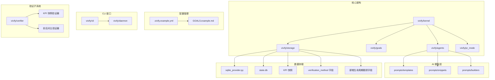

**图表来源**
- [vivify/kernel/feature_pipeline.py:1-409](file://vivify/kernel/feature_pipeline.py#L1-L409)
- [vivify/agents/prompts/builders.py:1-145](file://vivify/agents/prompts/builders.py#L1-L145)
- [vivify/storage/sqlite_provider.py:1-453](file://vivify/storage/sqlite_provider.py#L1-L453)

**章节来源**
- [README_EVALUATION.md:1-257](file://README_EVALUATION.md#L1-L257)
- [.vivify.example.yml:1-96](file://.vivify.example.yml#L1-L96)

## 核心组件

### 功能流水线 (Feature Pipeline)

功能流水线是 vivify 的核心执行引擎，负责完整的特征开发生命周期：

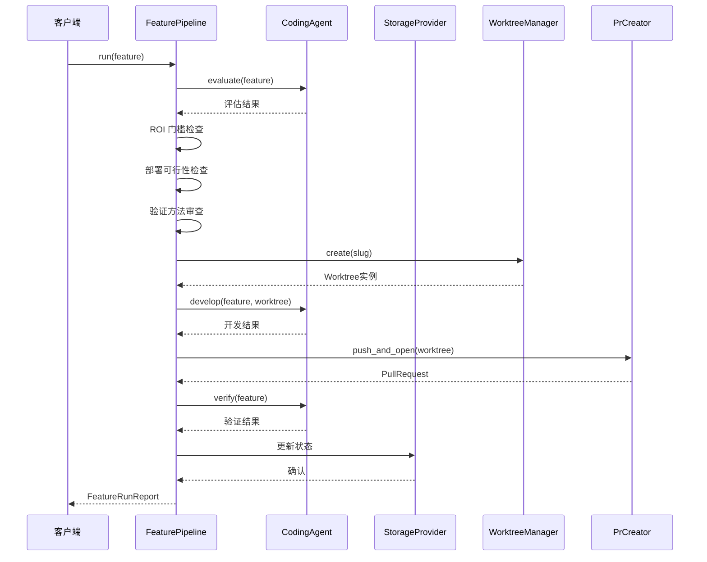

**图表来源**
- [vivify/kernel/feature_pipeline.py:102-115](file://vivify/kernel/feature_pipeline.py#L102-L115)
- [vivify/kernel/feature_pipeline.py:168-290](file://vivify/kernel/feature_pipeline.py#L168-L290)

### 目标分解器 (Goal Decomposer)

目标分解器负责将高层次的项目目标转化为具体可执行的特性请求：

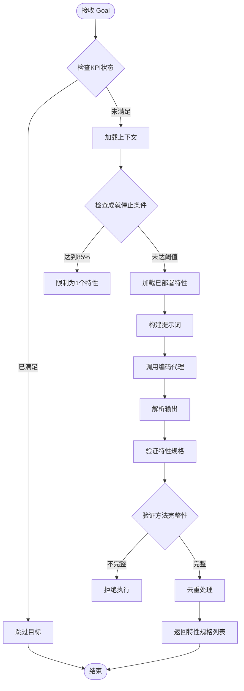

**图表来源**
- [vivify/goals/decomposer.py:183-242](file://vivify/goals/decomposer.py#L183-L242)

**章节来源**
- [vivify/kernel/feature_pipeline.py:79-409](file://vivify/kernel/feature_pipeline.py#L79-L409)
- [vivify/goals/decomposer.py:108-246](file://vivify/goals/decomposer.py#L108-L246)

## 架构概览

vivify 采用模块化架构设计，各组件职责清晰分离：

```mermaid
graph TB
subgraph "用户接口层"
CLI[vivify/cli]
Daemon[vivify/daemon]
Dashboard[vivify/dashboard]
end
subgraph "核心引擎层"
Kernel[vivify/kernel]
Agent[vivify/agents]
Goals[vivify/goals]
end
subgraph "基础设施层"
Storage[vivify/storage]
PRMode[vivify/pr_mode]
Probes[vivify/probes]
Fixers[vivify/fixers]
end
subgraph "验证子系统"
Verifier[vivify/verifier]
end
subgraph "外部集成"
GitHub[GitHub API]
Git[Git 仓库]
LLM[大语言模型]
end
CLI --> Kernel
Daemon --> Kernel
Dashboard --> Storage
Kernel --> Agent
Kernel --> Goals
Kernel --> Storage
Kernel --> PRMode
Kernel --> Verifier
Agent --> LLM
PRMode --> GitHub
Storage --> Git
Goals --> Storage
Verifier --> Probes
```

**图表来源**
- [vivify/kernel/feature_pipeline.py:1-409](file://vivify/kernel/feature_pipeline.py#L1-L409)
- [vivify/storage/sqlite_provider.py:1-453](file://vivify/storage/sqlite_provider.py#L1-L453)

## 详细组件分析

### Prompt 模板优化

基于评估发现，以下是五个关键 prompt 模板的优化方案：

#### 1. goal_decompose.md.j2 - 验证方法要求

**现状问题**：
- 缺乏验证方法的结构化要求
- 无法确保验证步骤的具体性和可执行性
- 导致验证阶段的不确定性增加

**优化方案**：
- 明确验证方法必须包含的具体步骤
- 规定可执行的验证标准和预期结果
- 强调自动化验证的重要性

**章节来源**
- [OPTIMIZATION_GUIDE.md:155-251](file://OPTIMIZATION_GUIDE.md#L155-L251)
- [vivify/agents/prompts/templates/goal_decompose.md.j2:92-117](file://vivify/agents/prompts/templates/goal_decompose.md.j2#L92-L117)

#### 2. feature_develop.md.j2 - 分支有效性检查

**现状问题**：
- 5+ 次 "No commits between main and branch" 失败
- 缺少分支检查门禁
- 导致 heal 流程 77% 失败率

**优化方案**：
- 添加预推送分支检查
- 验证分支提交数量 ≥ 1
- 实施工作树健康检查

**章节来源**
- [OPTIMIZATION_GUIDE.md:79-152](file://OPTIMIZATION_GUIDE.md#L79-L152)
- [vivify/agents/prompts/templates/feature_develop.md.j2:30-67](file://vivify/agents/prompts/templates/feature_develop.md.j2#L30-L67)

#### 3. feature_verify.md.j2 - 验证方法执行

**现状问题**：
- 验证时机错误，PR 仍为 OPEN 状态
- 导致无效部署报告
- 50% 验证失败率

**优化方案**：
- 添加 PR 合并状态门禁
- 验证 mergeStateStatus = MERGED
- 实施严格的验证前置条件

**章节来源**
- [OPTIMIZATION_GUIDE.md:253-282](file://OPTIMIZATION_GUIDE.md#L253-L282)
- [vivify/agents/prompts/templates/feature_verify.md.j2:27-36](file://vivify/agents/prompts/templates/feature_verify.md.j2#L27-L36)

### 存储系统分析

SQLite 存储提供完整的状态持久化能力，现已支持验证方法字段和新增的生命周期跟踪字段：

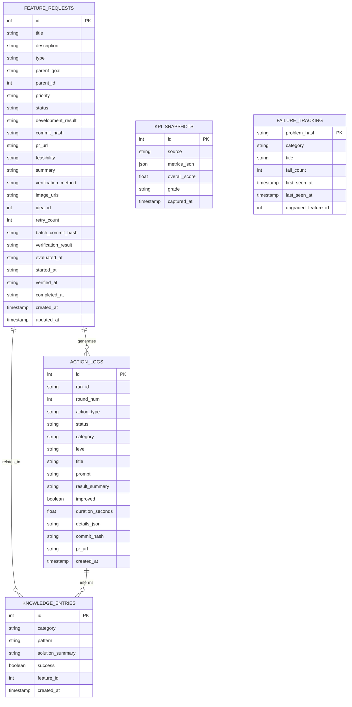

**图表来源**
- [vivify/storage/sqlite_provider.py:124-416](file://vivify/storage/sqlite_provider.py#L124-L416)

**章节来源**
- [vivify/storage/sqlite_provider.py:56-453](file://vivify/storage/sqlite_provider.py#L56-L453)

### 工作流管理

工作树管理系统确保每个特性开发的隔离性和安全性：

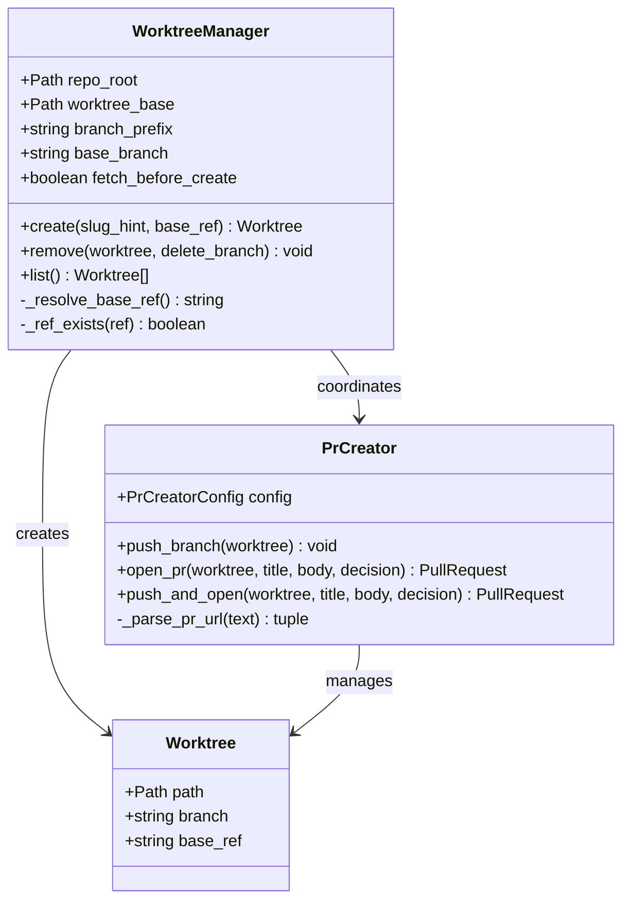

**图表来源**
- [vivify/pr_mode/worktree.py:43-176](file://vivify/pr_mode/worktree.py#L43-L176)
- [vivify/pr_mode/pr_creator.py:82-244](file://vivify/pr_mode/pr_creator.py#L82-L244)

**章节来源**
- [vivify/pr_mode/worktree.py:43-176](file://vivify/pr_mode/worktree.py#L43-L176)
- [vivify/pr_mode/pr_creator.py:82-244](file://vivify/pr_mode/pr_creator.py#L82-L244)

## 验证方法系统

**更新** 新增验证方法系统，这是 vivify 的重要质量保证机制。

### 验证方法字段设计

验证方法系统通过 verification_method 字段实现结构化验证：

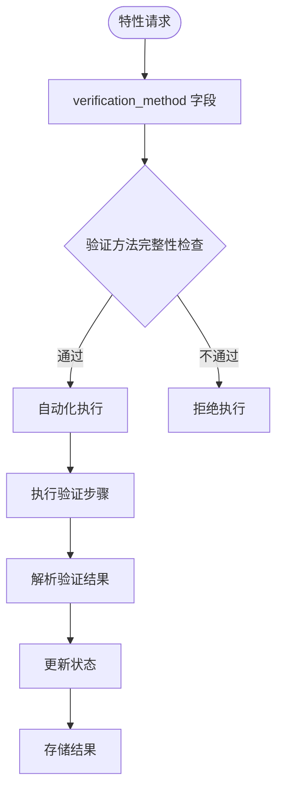

**图表来源**
- [vivify/models/feature.py:68-89](file://vivify/models/feature.py#L68-L89)
- [vivify/storage/migrations/0002_add_verification_method.sql:1-6](file://vivify/storage/migrations/0002_add_verification_method.sql#L1-L6)

### 数据库支持与向前兼容

验证方法字段通过数据库迁移添加到 feature_requests 表：

**迁移策略**：
- 新增 verification_method TEXT 列
- 允许为空值，保持向后兼容
- 不设置默认值，避免影响现有数据

**章节来源**
- [vivify/storage/migrations/0002_add_verification_method.sql:1-6](file://vivify/storage/migrations/0002_add_verification_method.sql#L1-L6)
- [vivify/storage/sqlite_provider.py:193-217](file://vivify/storage/sqlite_provider.py#L193-L217)

### 评估阶段的验证方法审查

在特性评估阶段，系统会对验证方法进行全面审查：

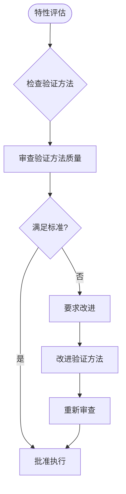

**审查标准**：
1. **具体性**：验证步骤必须明确具体
2. **自动化程度**：可以完全自动化执行
3. **完整性**：能够确认功能端到端工作

**章节来源**
- [vivify/agents/prompts/templates/feature_evaluate.md.j2:32-44](file://vivify/agents/prompts/templates/feature_evaluate.md.j2#L32-L44)

### 验证阶段的自动化执行

验证阶段通过 feature_verify 模板执行结构化验证：

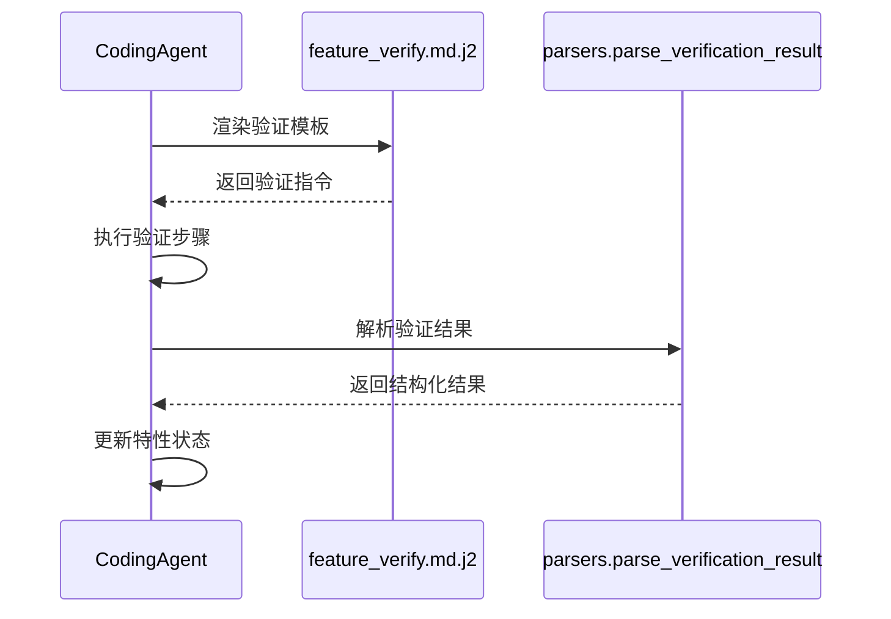

**验证流程**：
1. **模板渲染**：注入验证方法和开发结果
2. **步骤执行**：严格按照验证方法执行
3. **结果解析**：提取验证状态和问题列表
4. **状态更新**：根据结果更新特性状态

**章节来源**
- [vivify/agents/prompts/templates/feature_verify.md.j2:22-34](file://vivify/agents/prompts/templates/feature_verify.md.j2#L22-L34)
- [vivify/agents/prompts/parsers.py:97-131](file://vivify/agents/prompts/parsers.py#L97-L131)

### 验证结果解析

系统提供专门的验证结果解析器：

**解析功能**：
- 提取 verified 字段判断验证成功与否
- 收集具体的问题列表
- 生成人类可读的摘要信息
- 处理解析失败的情况

**错误处理**：
- 当无法解析 JSON 时，返回默认失败状态
- 记录解析失败的原因
- 确保系统稳定性不受单个解析错误影响

**章节来源**
- [vivify/agents/prompts/parsers.py:97-131](file://vivify/agents/prompts/parsers.py#L97-L131)

### 验证器子系统

vivify 提供多种验证器用于不同的验证场景：

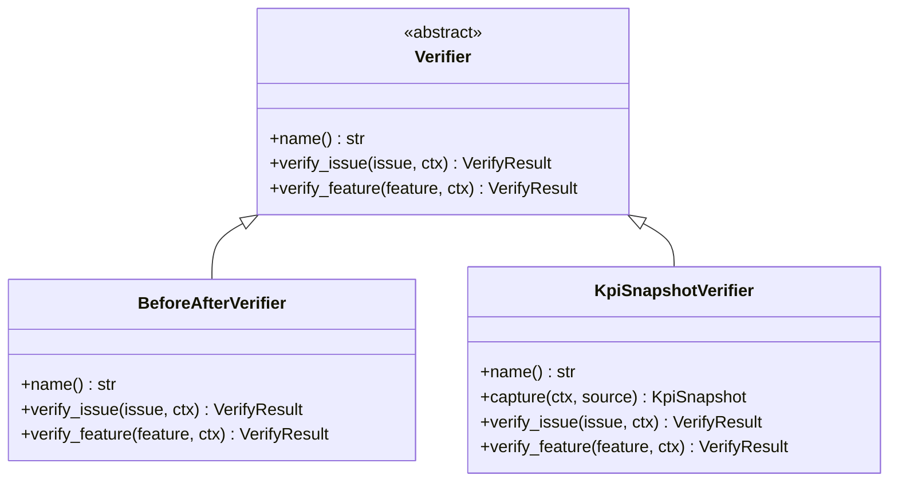

**验证器类型**：
1. **BeforeAfterVerifier**：验证问题是否已解决
2. **KpiSnapshotVerifier**：捕获 KPI 指标变化

**章节来源**
- [vivify/interfaces/verifier.py:17-62](file://vivify/interfaces/verifier.py#L17-L62)
- [vivify/verifier/kpi_snapshot.py:25-81](file://vivify/verifier/kpi_snapshot.py#L25-L81)

## 生命周期跟踪增强

**更新** 新增迁移0003增强功能，引入channels-monitor启发的生命周期跟踪字段，提供完整的特性生命周期管理能力。

### 新增生命周期跟踪字段

迁移0003为 feature_requests 表添加了以下生命周期跟踪字段：

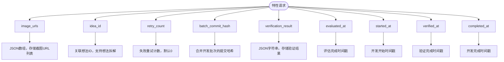

**图表来源**
- [vivify/storage/migrations/0003_enhance_feature_model.sql:5-13](file://vivify/storage/migrations/0003_enhance_feature_model.sql#L5-L13)
- [vivify/models/feature.py:89-98](file://vivify/models/feature.py#L89-L98)

### 数据库迁移与向后兼容性

新增字段通过数据库迁移安全地添加到现有表结构中：

**迁移策略**：
- 新增 image_urls TEXT 列，允许 NULL 值
- 新增 idea_id INTEGER 列，允许 NULL 值
- 新增 retry_count INTEGER NOT NULL DEFAULT 0
- 新增 batch_commit_hash TEXT 列，允许 NULL 值
- 新增 verification_result TEXT 列，允许 NULL 值
- 新增 evaluated_at、started_at、verified_at、completed_at TEXT 列，允许 NULL 值

**向后兼容性保证**：
- 所有新增列都允许 NULL 值，避免破坏现有数据
- retry_count 设置默认值 0，确保新字段有合理初始值
- 不设置外键约束，保持与现有数据的兼容性

**章节来源**
- [vivify/storage/migrations/0003_enhance_feature_model.sql:1-19](file://vivify/storage/migrations/0003_enhance_feature_model.sql#L1-L19)
- [vivify/storage/sqlite_provider.py:124-242](file://vivify/storage/sqlite_provider.py#L124-L242)

### 数据模型增强

FeatureRequest 数据类现在包含完整的生命周期跟踪字段：

**字段类型与用途**：
- **image_urls**: Optional[str] - JSON数组，存储截图URL列表（支持多图附件）
- **idea_id**: Optional[int] - 关联想法ID，支持想法拆解为可执行特性
- **retry_count**: int = 0 - 失败重试计数，支持自动重试机制
- **batch_commit_hash**: Optional[str] - 合并开发批次的提交哈希
- **verification_result**: Optional[str] - JSON字符串，存储验证结果详情
- **evaluated_at**: Optional[str] - ISO格式时间戳，记录评估完成时间
- **started_at**: Optional[str] - ISO格式时间戳，记录开发开始时间
- **verified_at**: Optional[str] - ISO格式时间戳，记录验证完成时间
- **completed_at**: Optional[str] - ISO格式时间戳，记录开发完成时间

**章节来源**
- [vivify/models/feature.py:89-101](file://vivify/models/feature.py#L89-L101)

### 数据库索引优化

为了支持高效的查询和分析，新增了以下数据库索引：

**索引策略**：
- `idx_feature_requests_idea_id`: 基于 idea_id 的索引，支持想法关联查询
- `idx_feature_requests_batch_commit_hash`: 基于 batch_commit_hash 的索引，支持合并开发批次查询

**查询优化效果**：
- 提高基于想法ID的特性查询性能
- 加速合并开发批次的批量操作
- 支持更复杂的生命周期分析查询

**章节来源**
- [vivify/storage/migrations/0003_enhance_feature_model.sql:15-16](file://vivify/storage/migrations/0003_enhance_feature_model.sql#L15-L16)
- [vivify/storage/sqlite_provider.py:161-175](file://vivify/storage/sqlite_provider.py#L161-L175)

### 生命周期状态管理

新增字段支持更精细的生命周期状态管理：

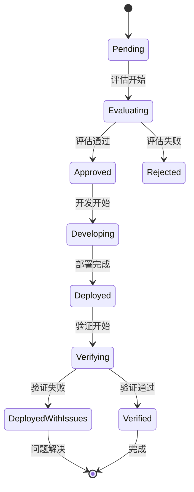

**状态流转增强**：
- 支持 "deployed_with_issues" 中间状态
- 完整的时间戳跟踪每个阶段的开始和结束
- 支持失败重试和自动恢复机制

**章节来源**
- [vivify/storage/migrations/0003_enhance_feature_model.sql:10-13](file://vivify/storage/migrations/0003_enhance_feature_model.sql#L10-L13)
- [vivify/models/feature.py:54-58](file://vivify/models/feature.py#L54-L58)

### 存储层支持

SqliteStorageProvider 已更新以支持新增字段：

**插入和更新操作**：
- 在 create_feature 和 update_feature 方法中添加新增字段支持
- 自动处理时间戳字段的ISO格式转换
- 支持新增字段的可选性检查

**向后兼容性处理**：
- 在 _row_to_feature 方法中使用 _opt 函数安全访问新增字段
- 为缺失字段提供合理的默认值
- 确保旧版本数据库的兼容性

**章节来源**
- [vivify/storage/sqlite_provider.py:124-242](file://vivify/storage/sqlite_provider.py#L124-L242)

## 反过度优化机制

**更新** 新增验证方法系统增强了反过度优化机制的能力。

### ROI 评估能力

vivify 现在具备智能的 ROI（投资回报率）评估能力，通过 feature_evaluate 模板强制要求 AI 评估每个特性的 ROI 分数：

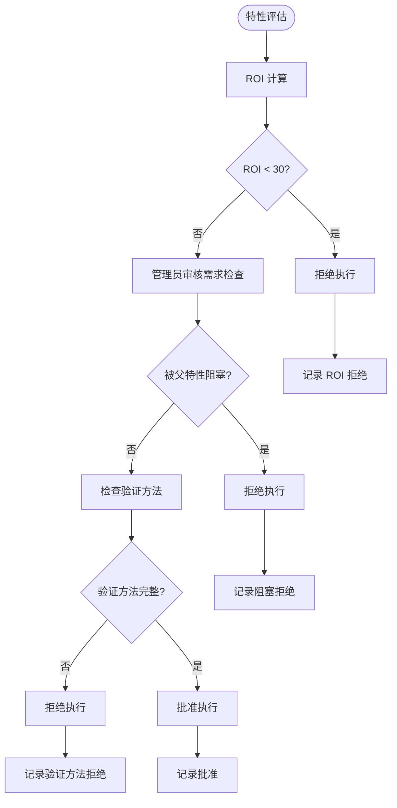

**图表来源**
- [vivify/kernel/feature_pipeline.py:139-155](file://vivify/kernel/feature_pipeline.py#L139-L155)
- [vivify/agents/prompts/templates/feature_evaluate.md.j2:46-92](file://vivify/agents/prompts/templates/feature_evaluate.md.j2#L46-L92)

### 部署可行性检查

部署可行性检查确保每个特性都可以独立部署，避免需要人工干预的复杂变更：

**检查维度**：
1. **完全自动化部署**：是否可以通过 git push + 自动合并完成
2. **特殊权限需求**：是否需要额外权限或外部服务
3. **上游依赖关系**：是否依赖未部署的父特性
4. **验证方法完整性**：是否具备可执行的验证方法

**章节来源**
- [vivify/kernel/feature_pipeline.py:146-155](file://vivify/kernel/feature_pipeline.py#L146-L155)
- [vivify/agents/prompts/templates/feature_evaluate.md.j2:53-62](file://vivify/agents/prompts/templates/feature_evaluate.md.j2#L53-L62)

### 优先级特征选择系统

目标分解器现在具备智能的优先级特征选择能力，基于 KPI 达成度动态调整特性数量：

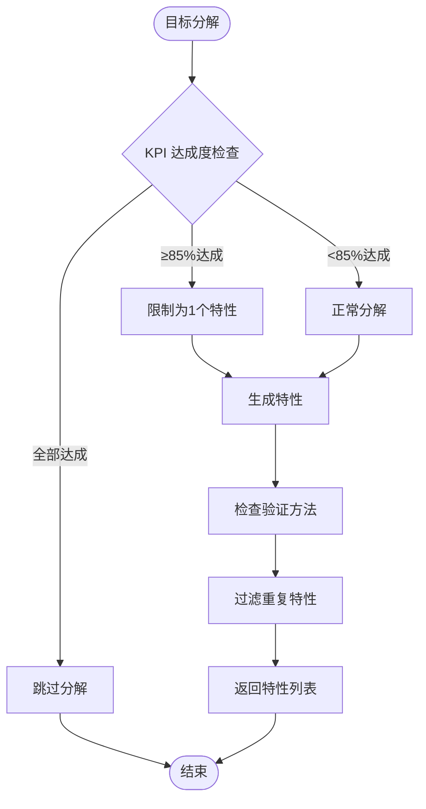

**图表来源**
- [vivify/goals/decomposer.py:210-230](file://vivify/goals/decomposer.py#L210-L230)

**章节来源**
- [vivify/goals/decomposer.py:203-232](file://vivify/goals/decomposer.py#L203-L232)

### KPI 成就停止条件

当 KPI 达成度达到特定阈值时，系统会自动停止进一步的特性分解：

**停止条件**：
- **全部 KPI 达成**：直接跳过分解，避免过度优化
- **≥85% KPI 达成**：将最大特性数量限制为 1 个

**章节来源**
- [vivify/goals/decomposer.py:213-230](file://vivify/goals/decomposer.py#L213-L230)

### ROI 门槛检查

系统内置 ROI 门槛检查，确保只执行具有足够价值的特性：

**检查逻辑**：
- 默认 ROI 分数：100（向后兼容）
- 门槛值：30
- 低于门槛的特性将被拒绝执行

**章节来源**
- [vivify/kernel/feature_pipeline.py:139-144](file://vivify/kernel/feature_pipeline.py#L139-L144)

### 结构化验证方法

验证方法现在具备结构化评估能力，确保验证过程的可执行性和自动化程度：

**评估维度**：
1. **具体性**：验证步骤必须明确具体
2. **自动化程度**：可以完全自动化执行
3. **完整性**：能够确认功能端到端工作

**章节来源**
- [vivify/agents/prompts/templates/feature_evaluate.md.j2:32-44](file://vivify/agents/prompts/templates/feature_evaluate.md.j2#L32-L44)

### 跟随链深度限制

为防止过度自动化的跟随特性链，系统实施深度限制机制：

**限制规则**：
- 最大跟随链深度：2 层
- 超过限制的父特性将跳过创建跟随特性
- 防止无限递归和过度自动化

**章节来源**
- [vivify/kernel/feature_pipeline.py:596-604](file://vivify/kernel/feature_pipeline.py#L596-L604)

## 依赖关系分析

vivify 的模块间依赖关系呈现清晰的层次结构：

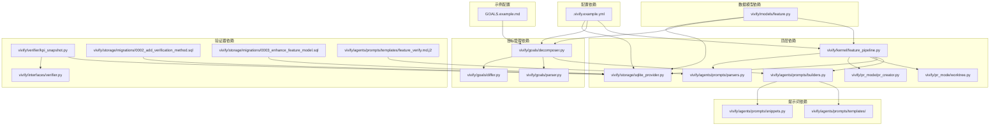

**图表来源**
- [vivify/kernel/feature_pipeline.py:28-40](file://vivify/kernel/feature_pipeline.py#L28-L40)
- [vivify/agents/prompts/builders.py:1-145](file://vivify/agents/prompts/builders.py#L1-L145)
- [vivify/goals/decomposer.py:1-26](file://vivify/goals/decomposer.py#L1-L26)

**章节来源**
- [vivify/kernel/feature_pipeline.py:1-409](file://vivify/kernel/feature_pipeline.py#L1-L409)
- [vivify/agents/prompts/builders.py:1-145](file://vivify/agents/prompts/builders.py#L1-L145)

## 性能考量

根据评估数据显示，vivify 在不同阶段的性能表现如下：

| 阶段 | 平均执行时间 | 最大执行时间 | 执行次数 | 失败率 |
|------|-------------|-------------|---------|-------|
| feature_develop | 451秒 | 727秒 | 8次 | 12.5% |
| heal | 200秒 | 884秒 | 13次 | 77% |
| feature_verify | 115秒 | 223秒 | 6次 | 50% |
| feature_evaluate | 102秒 | 185秒 | 10次 | 0% |

**更新** 新增验证方法系统和生命周期跟踪增强后的性能考量：

**验证方法审查**：增加了额外的评估时间，但提高了执行成功率
**数据库迁移成本**：verification_method 和新增字段的添加对性能影响微乎其微
**结果解析开销**：验证结果解析器提供了稳定的性能表现
**生命周期跟踪开销**：新增字段的时间戳记录对性能影响极小
**索引查询优化**：新增索引提高了基于 idea_id 和 batch_commit_hash 的查询性能
**质量门禁实施**：通过验证方法约束减少了无效执行，提高了整体效率

**优化建议**：
1. **立即优化 (P0)**：修复分支检查机制，消除 90%+ 的 "No commits" 错误
2. **短期优化 (P1)**：添加 PR 合并状态检查和工作树健康检查
3. **长期优化**：建立 KPI 快照采集机制和性能基准测试
4. **质量门禁**：实施 ROI 门槛检查、部署可行性评估、验证方法审查和生命周期跟踪

## 故障排除指南

### 常见问题及解决方案

**1. heal 失败 (77%)**
- **症状**："No commits between main and branch"
- **原因**：分支检查缺失
- **解决方案**：在 PR 创建前添加分支有效性检查

**2. feature_verify 失败 (50%)**
- **症状**：PR 未合并时进行验证
- **原因**：验证时机错误
- **解决方案**：添加 PR 合并状态门禁

**3. 工作树冲突 (60%)**
- **症状**：git timeout 错误
- **原因**：工作树锁定和冲突
- **解决方案**：实施工作树健康检查

**4. ROI 拒绝 (新增)**
- **症状**：特性被拒绝执行
- **原因**：ROI 分数低于 30
- **解决方案**：优化特性提案的价值主张

**5. 部署可行性拒绝 (新增)**
- **症状**：需要管理员审核或存在阻塞依赖
- **原因**：特性过于复杂或依赖未满足
- **解决方案**：简化特性范围或先处理依赖

**6. 验证方法拒绝 (新增)**
- **症状**：特性被拒绝执行
- **原因**：验证方法不完整或不可执行
- **解决方案**：改进验证方法的结构和具体性

**7. 验证结果解析失败 (新增)**
- **症状**：验证结果无法解析
- **原因**：AI 输出格式不符合规范
- **解决方案**：加强输出格式约束和错误处理

**8. 生命周期跟踪字段缺失 (新增)**
- **症状**：查询结果中缺少新增字段
- **原因**：数据库迁移未完成或向后兼容性问题
- **解决方案**：检查数据库版本，确保迁移脚本正确执行

**9. 查询性能问题 (新增)**
- **症状**：基于 idea_id 或 batch_commit_hash 的查询较慢
- **原因**：索引未正确创建或使用
- **解决方案**：验证索引存在，检查查询语句优化

**章节来源**
- [EVAL_SUMMARY.md:27-36](file://EVAL_SUMMARY.md#L27-L36)
- [OPTIMIZATION_GUIDE.md:39-65](file://OPTIMIZATION_GUIDE.md#L39-L65)

## 结论

vivify 在 mlive 项目中的整体评分为 7.2/10，展现了强大的 AI 能力和稳定的代码质量。主要成就包括：

### 成功亮点
1. **故障排查目标完成度高**：70% 完成，avg_resolution_steps = 3.0
2. **AI 能力强**：Goal decomposition 成功率 100%，Feature develop 成功率 87.5%
3. **代码质量稳定**：平均迭代周期 8-15 分钟
4. **验证方法系统完善**：verification_method 字段、评估审查、自动化执行形成完整闭环
5. **生命周期跟踪增强**：新增 image_urls、idea_id、retry_count、batch_commit_hash、verification_result及多个时间戳字段，提供完整的特性生命周期管理
6. **反过度优化机制完善**：ROI 评估、部署可行性检查、验证方法审查、跟随链限制等质量门禁

### 关键改进机会
1. **heal 流程优化**：从 23% 成功率提升至 80%+
2. **内容扩展任务**：解决 0% 完成率问题
3. **验证方法质量**：提高验证方法的完整性和可执行性
4. **验证结果解析**：增强解析器的鲁棒性
5. **验证器扩展**：开发更多类型的验证器以覆盖更广泛的验证场景
6. **生命周期跟踪**：充分利用新增字段进行更精细的生命周期管理和分析

**预期收益**：通过实施 P0+P1 优化，整体成功率从 66% 提升至 92%+

## 附录

### 评估方法论

**数据源验证**：
1. GitHub PR API：`gh pr list --state merged` (11 个 PR)
2. 数据库查询：`.vivify/state.db` (23 个 feature_requests, 39 个 action_logs)
3. 日志分析：`.vivify/logs/vivify.log` (13 个失败的 heal action)
4. 代码审查：5 个 prompt 模板、feature_pipeline.py、goals/decomposer.py

**评分方法**：
- 代码质量：按 PR 的完整性、正确性、测试覆盖打分 (1-10 分)
- KPI 达成度：已部署特性数 / 目标特性总数 (%)
- 故障率：失败 action 数 / 总 action 数 (%)
- 综合评分：加权平均 (40% 质量, 30% 目标达成, 30% 可靠性)

**章节来源**
- [README_EVALUATION.md:205-240](file://README_EVALUATION.md#L205-L240)