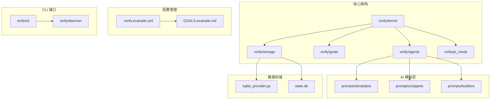
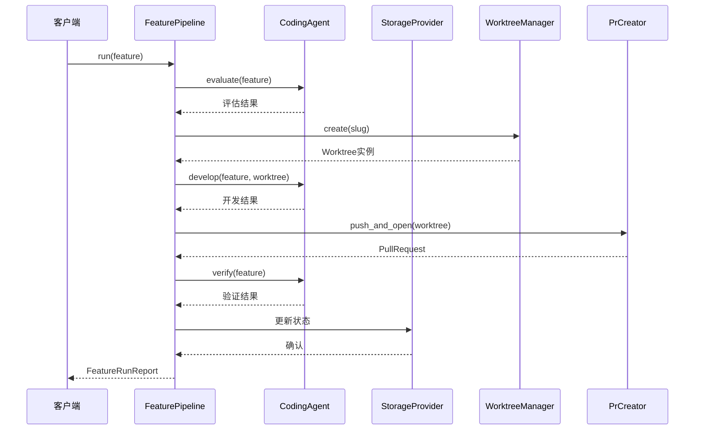
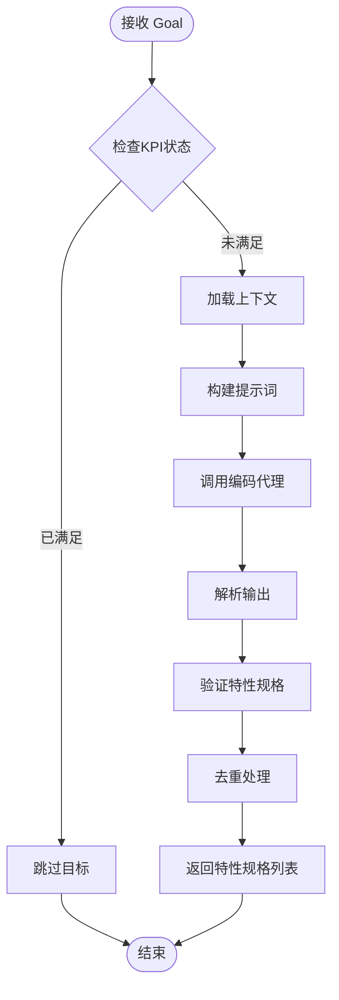
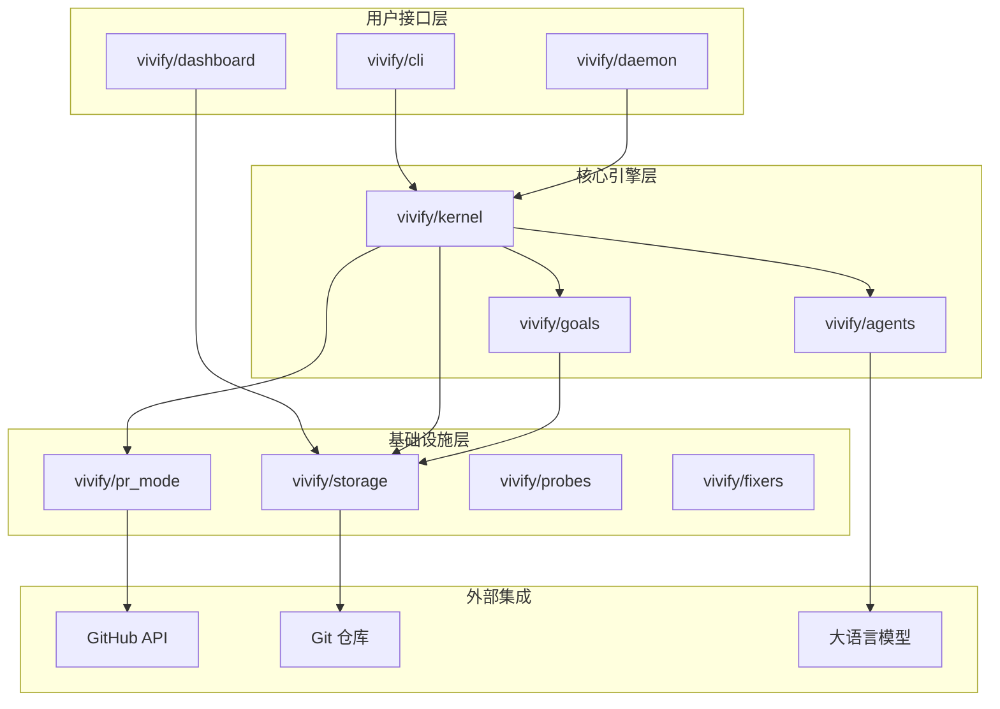
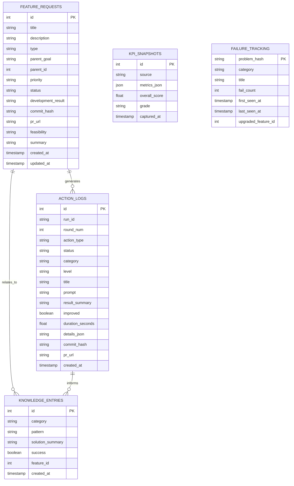
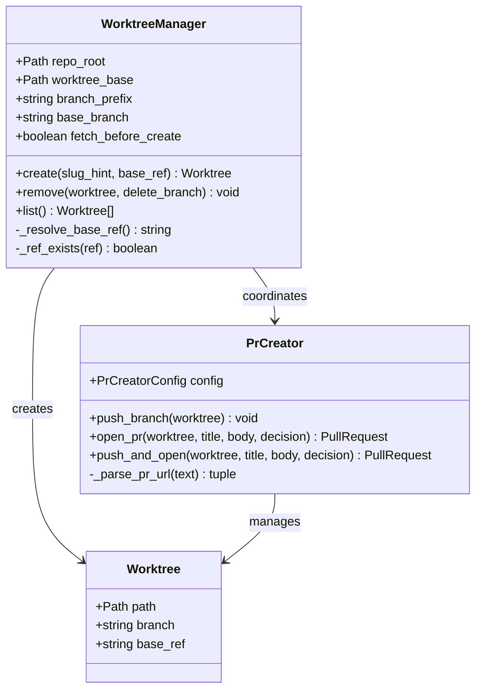
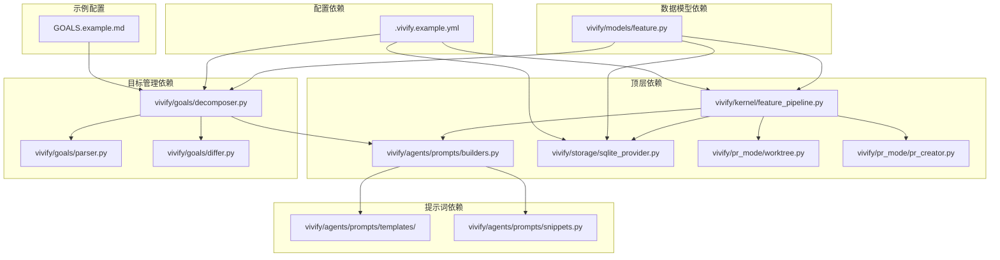

# 评估文档套件

<cite>
**本文档引用的文件**
- [README_EVALUATION.md](file://README_EVALUATION.md)
- [EVAL_SUMMARY.md](file://EVAL_SUMMARY.md)
- [OPTIMIZATION_GUIDE.md](file://OPTIMIZATION_GUIDE.md)
- [GOALS.example.md](file://GOALS.example.md)
- [.vivify.example.yml](file://.vivify.example.yml)
- [vivify/kernel/feature_pipeline.py](file://vivify/kernel/feature_pipeline.py)
- [vivify/goals/decomposer.py](file://vivify/goals/decomposer.py)
- [vivify/agents/prompts/builders.py](file://vivify/agents/prompts/builders.py)
- [vivify/storage/sqlite_provider.py](file://vivify/storage/sqlite_provider.py)
- [vivify/models/feature.py](file://vivify/models/feature.py)
- [vivify/agents/prompts/templates/goal_decompose.md.j2](file://vivify/agents/prompts/templates/goal_decompose.md.j2)
- [vivify/agents/prompts/templates/feature_develop.md.j2](file://vivify/agents/prompts/templates/feature_develop.md.j2)
- [vivify/agents/prompts/templates/feature_verify.md.j2](file://vivify/agents/prompts/templates/feature_verify.md.j2)
- [vivify/pr_mode/worktree.py](file://vivify/pr_mode/worktree.py)
- [vivify/pr_mode/pr_creator.py](file://vivify/pr_mode/pr_creator.py)
</cite>

## 目录
1. [简介](#简介)
2. [项目结构](#项目结构)
3. [核心组件](#核心组件)
4. [架构概览](#架构概览)
5. [详细组件分析](#详细组件分析)
6. [依赖关系分析](#依赖关系分析)
7. [性能考量](#性能考量)
8. [故障排除指南](#故障排除指南)
9. [结论](#结论)
10. [附录](#附录)

## 简介

本评估文档套件基于 vivify 在 mlive 项目中的实际应用，提供了完整的评估、优化和实施指导。该套件包含三个核心文档：

- **执行摘要**：提供快速概览和关键发现
- **优化指南**：详细的 Prompt 优化实操手册
- **完整评估报告**：深度分析和数据支撑

评估覆盖了11个已合并 PR、3个项目目标、5个 prompt 模板和13个失败的 action log，旨在帮助项目经理、开发者和架构师全面了解 vivify 在实际项目中的表现。

## 项目结构

vivify 是一个基于 AI 的自动化软件工程平台，主要由以下核心模块组成：

**图表来源**
- [vivify/kernel/feature_pipeline.py:1-409](file://vivify/kernel/feature_pipeline.py#L1-L409)
- [vivify/agents/prompts/builders.py:1-145](file://vivify/agents/prompts/builders.py#L1-L145)
- [vivify/storage/sqlite_provider.py:1-453](file://vivify/storage/sqlite_provider.py#L1-L453)

**章节来源**
- [README_EVALUATION.md:1-257](file://README_EVALUATION.md#L1-L257)
- [.vivify.example.yml:1-96](file://.vivify.example.yml#L1-L96)

## 核心组件

### 功能流水线 (Feature Pipeline)

功能流水线是 vivify 的核心执行引擎，负责完整的特征开发生命周期：

**图表来源**
- [vivify/kernel/feature_pipeline.py:102-115](file://vivify/kernel/feature_pipeline.py#L102-L115)
- [vivify/kernel/feature_pipeline.py:168-290](file://vivify/kernel/feature_pipeline.py#L168-L290)

### 目标分解器 (Goal Decomposer)

目标分解器负责将高层次的项目目标转化为具体可执行的特性请求：

**图表来源**
- [vivify/goals/decomposer.py:183-242](file://vivify/goals/decomposer.py#L183-L242)

**章节来源**
- [vivify/kernel/feature_pipeline.py:79-409](file://vivify/kernel/feature_pipeline.py#L79-L409)
- [vivify/goals/decomposer.py:108-246](file://vivify/goals/decomposer.py#L108-L246)

## 架构概览

vivify 采用模块化架构设计，各组件职责清晰分离：

**图表来源**
- [vivify/kernel/feature_pipeline.py:1-409](file://vivify/kernel/feature_pipeline.py#L1-L409)
- [vivify/storage/sqlite_provider.py:1-453](file://vivify/storage/sqlite_provider.py#L1-L453)

## 详细组件分析

### Prompt 模板优化

基于评估发现，以下是五个关键 prompt 模板的优化方案：

#### 1. goal_decompose.md.j2 - KPI 进度指导

**现状问题**：
- 缺乏实时 KPI 进度指导
- 无法看到已部署特性列表
- 导致重复提议和偏离目标

**优化方案**：
- 注入实时 KPI 数值和进度解读指南
- 添加最近部署特性列表
- 提供决策规则和依赖关系识别

**章节来源**
- [OPTIMIZATION_GUIDE.md:155-251](file://OPTIMIZATION_GUIDE.md#L155-L251)
- [vivify/agents/prompts/templates/goal_decompose.md.j2:24-53](file://vivify/agents/prompts/templates/goal_decompose.md.j2#L24-L53)

#### 2. feature_develop.md.j2 - 分支有效性检查

**现状问题**：
- 5+ 次 "No commits between main and branch" 失败
- 缺少分支检查门禁
- 导致 heal 流程 77% 失败率

**优化方案**：
- 添加预推送分支检查
- 验证分支提交数量 ≥ 1
- 实施工作树健康检查

**章节来源**
- [OPTIMIZATION_GUIDE.md:79-152](file://OPTIMIZATION_GUIDE.md#L79-L152)
- [vivify/agents/prompts/templates/feature_develop.md.j2:30-67](file://vivify/agents/prompts/templates/feature_develop.md.j2#L30-L67)

#### 3. feature_verify.md.j2 - PR 合并状态检查

**现状问题**：
- 验证时机错误，PR 仍为 OPEN 状态
- 导致无效部署报告
- 50% 验证失败率

**优化方案**：
- 添加 PR 合并状态门禁
- 验证 mergeStateStatus = MERGED
- 实施严格的验证前置条件

**章节来源**
- [OPTIMIZATION_GUIDE.md:253-282](file://OPTIMIZATION_GUIDE.md#L253-L282)
- [vivify/agents/prompts/templates/feature_verify.md.j2:27-36](file://vivify/agents/prompts/templates/feature_verify.md.j2#L27-L36)

### 存储系统分析

SQLite 存储提供完整的状态持久化能力：

**图表来源**
- [vivify/storage/sqlite_provider.py:124-416](file://vivify/storage/sqlite_provider.py#L124-L416)

**章节来源**
- [vivify/storage/sqlite_provider.py:56-453](file://vivify/storage/sqlite_provider.py#L56-L453)

### 工作流管理

工作树管理系统确保每个特性开发的隔离性和安全性：

**图表来源**
- [vivify/pr_mode/worktree.py:43-176](file://vivify/pr_mode/worktree.py#L43-L176)
- [vivify/pr_mode/pr_creator.py:82-244](file://vivify/pr_mode/pr_creator.py#L82-L244)

**章节来源**
- [vivify/pr_mode/worktree.py:43-176](file://vivify/pr_mode/worktree.py#L43-L176)
- [vivify/pr_mode/pr_creator.py:82-244](file://vivify/pr_mode/pr_creator.py#L82-L244)

## 依赖关系分析

vivify 的模块间依赖关系呈现清晰的层次结构：

**图表来源**
- [vivify/kernel/feature_pipeline.py:28-40](file://vivify/kernel/feature_pipeline.py#L28-L40)
- [vivify/agents/prompts/builders.py:1-145](file://vivify/agents/prompts/builders.py#L1-L145)
- [vivify/goals/decomposer.py:1-26](file://vivify/goals/decomposer.py#L1-L26)

**章节来源**
- [vivify/kernel/feature_pipeline.py:1-409](file://vivify/kernel/feature_pipeline.py#L1-L409)
- [vivify/agents/prompts/builders.py:1-145](file://vivify/agents/prompts/builders.py#L1-L145)

## 性能考量

根据评估数据显示，vivify 在不同阶段的性能表现如下：

| 阶段 | 平均执行时间 | 最大执行时间 | 执行次数 | 失败率 |
|------|-------------|-------------|---------|-------|
| feature_develop | 451秒 | 727秒 | 8次 | 12.5% |
| heal | 200秒 | 884秒 | 13次 | 77% |
| feature_verify | 115秒 | 223秒 | 6次 | 50% |
| feature_evaluate | 102秒 | 185秒 | 10次 | 0% |

**优化建议**：
1. **立即优化 (P0)**：修复分支检查机制，消除 90%+ 的 "No commits" 错误
2. **短期优化 (P1)**：添加 PR 合并状态检查和工作树健康检查
3. **长期优化**：建立 KPI 快照采集机制和性能基准测试

## 故障排除指南

### 常见问题及解决方案

**1. heal 失败 (77%)**
- **症状**："No commits between main and branch"
- **原因**：分支检查缺失
- **解决方案**：在 PR 创建前添加分支有效性检查

**2. feature_verify 失败 (50%)**
- **症状**：PR 未合并时进行验证
- **原因**：验证时机错误
- **解决方案**：添加 PR 合并状态门禁

**3. 工作树冲突 (60%)**
- **症状**：git timeout 错误
- **原因**：工作树锁定和冲突
- **解决方案**：实施工作树健康检查

**章节来源**
- [EVAL_SUMMARY.md:27-36](file://EVAL_SUMMARY.md#L27-L36)
- [OPTIMIZATION_GUIDE.md:39-65](file://OPTIMIZATION_GUIDE.md#L39-L65)

## 结论

vivify 在 mlive 项目中的整体评分为 7.2/10，展现了强大的 AI 能力和稳定的代码质量。主要成就包括：

### 成功亮点
1. **故障排查目标完成度高**：70% 完成，avg_resolution_steps = 3.0
2. **AI 能力强**：Goal decomposition 成功率 100%，Feature develop 成功率 87.5%
3. **代码质量稳定**：平均迭代周期 8-15 分钟

### 关键改进机会
1. **heal 流程优化**：从 23% 成功率提升至 80%+
2. **内容扩展任务**：解决 0% 完成率问题
3. **验证完整性**：添加性能基准测试

**预期收益**：通过实施 P0+P1 优化，整体成功率从 66% 提升至 92%+

## 附录

### 评估方法论

**数据源验证**：
1. GitHub PR API：`gh pr list --state merged` (11 个 PR)
2. 数据库查询：`.vivify/state.db` (23 个 feature_requests, 39 个 action_logs)
3. 日志分析：`.vivify/logs/vivify.log` (13 个失败的 heal action)
4. 代码审查：5 个 prompt 模板、feature_pipeline.py、goals/decomposer.py

**评分方法**：
- 代码质量：按 PR 的完整性、正确性、测试覆盖打分 (1-10 分)
- KPI 达成度：已部署特性数 / 目标特性总数 (%)
- 故障率：失败 action 数 / 总 action 数 (%)
- 综合评分：加权平均 (40% 质量, 30% 目标达成, 30% 可靠性)

**章节来源**
- [README_EVALUATION.md:205-240](file://README_EVALUATION.md#L205-L240)