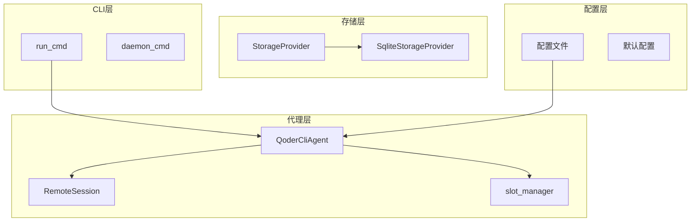
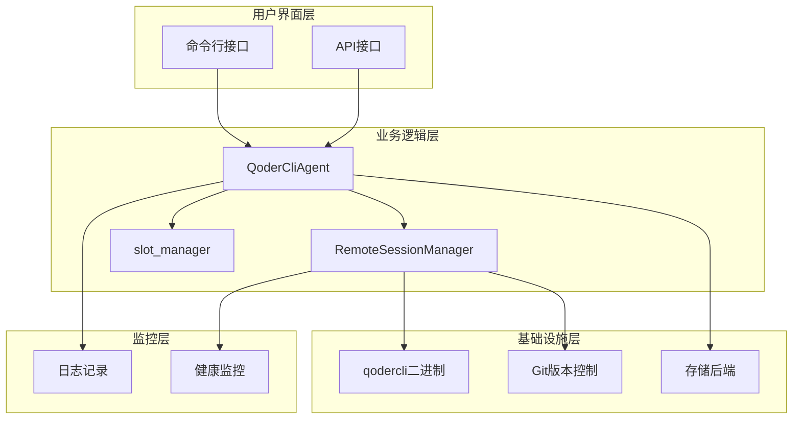
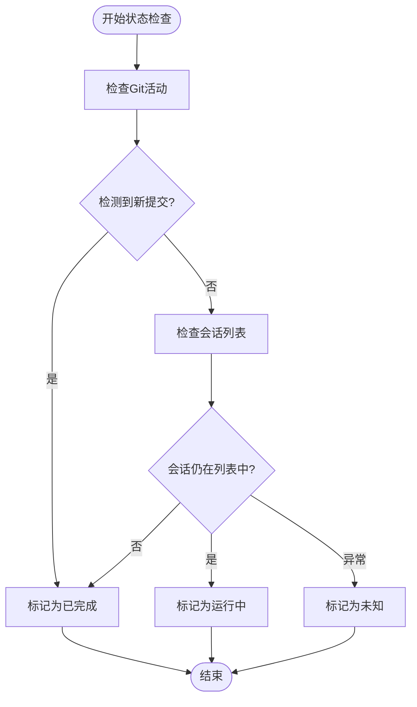
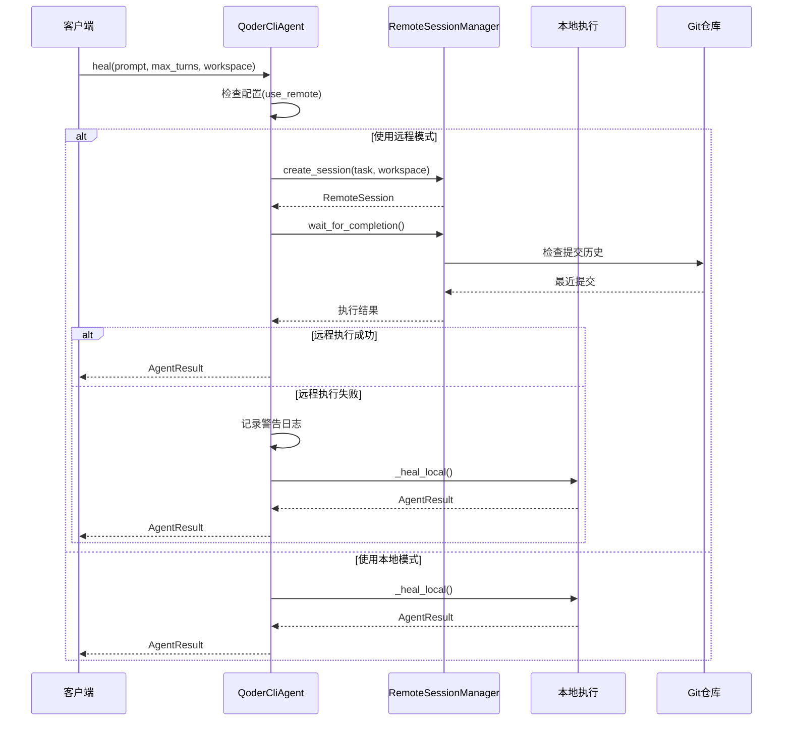
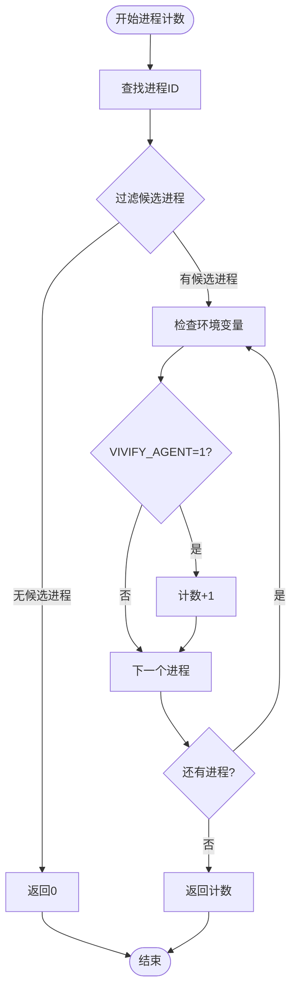
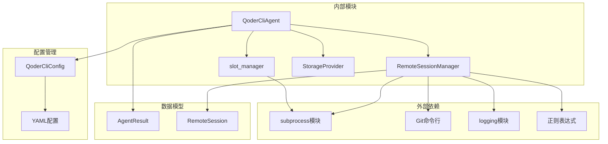

# 远程会话管理

<cite>
**本文档引用的文件**
- [remote_session.py](file://vivify/agents/remote_session.py)
- [slot_manager.py](file://vivify/agents/slot_manager.py)
- [qodercli_agent.py](file://vivify/agents/qodercli_agent.py)
- [run_cmd.py](file://vivify/cli/run_cmd.py)
- [.vivify.example.yml](file://.vivify.example.yml)
- [storage.py](file://vivify/interfaces/storage.py)
- [sqlite_provider.py](file://vivify/storage/sqlite_provider.py)
- [agent.py](file://vivify/interfaces/agent.py)
- [agent_result.py](file://vivify/models/agent_result.py)
- [history.py](file://vivify/agents/history.py)
- [manager.py](file://vivify/daemon/manager.py)
- [lock.py](file://vivify/daemon/lock.py)
- [test_qodercli_agent.py](file://tests/unit/test_qodercli_agent.py)
- [feature_pipeline.py](file://vivify/kernel/feature_pipeline.py)
</cite>

## 更新摘要
**变更内容**
- 新增多信号状态检测机制（结合Git活动和会话列表检查）
- 增加workspace参数支持，实现工作区感知的远程会话管理
- 改进错误处理和日志记录机制
- 新增智能自动回退机制，提升系统可靠性
- 增强远程会话并发控制和资源管理

## 目录
1. [简介](#简介)
2. [项目结构](#项目结构)
3. [核心组件](#核心组件)
4. [架构概览](#架构概览)
5. [详细组件分析](#详细组件分析)
6. [依赖关系分析](#依赖关系分析)
7. [性能考虑](#性能考虑)
8. [故障排除指南](#故障排除指南)
9. [结论](#结论)

## 简介

远程会话管理系统是 Vivify 项目中用于管理 qodercli 云端执行会话的核心组件。该系统允许用户通过云端远程执行代码修复任务，提供异步任务执行、状态监控、结果获取等功能。系统设计考虑了并发控制、错误处理和性能优化，为开发者提供可靠的远程代码执行解决方案。

**更新** 系统现已支持工作区感知的远程会话管理，通过多信号状态检测机制实现更准确的会话状态判断，并具备智能回退能力以提升整体可靠性。

## 项目结构

Vivify 项目采用模块化架构设计，远程会话管理功能主要分布在以下模块中：

**图表来源**
- [remote_session.py:1-199](file://vivify/agents/remote_session.py#L1-L199)
- [qodercli_agent.py:1-326](file://vivify/agents/qodercli_agent.py#L1-L326)
- [run_cmd.py:1-200](file://vivify/cli/run_cmd.py#L1-L200)

**章节来源**
- [remote_session.py:1-199](file://vivify/agents/remote_session.py#L1-L199)
- [qodercli_agent.py:1-326](file://vivify/agents/qodercli_agent.py#L1-L326)
- [run_cmd.py:1-200](file://vivify/cli/run_cmd.py#L1-L200)

## 核心组件

远程会话管理系统包含以下核心组件：

### RemoteSession 类
表示单个远程会话的状态和元数据，包括会话ID、任务描述、URL、状态、创建时间和结果。

### RemoteSessionManager 类
负责管理远程会话的完整生命周期，包括会话创建、状态检查、结果获取和等待完成。

### QoderCliAgent 类
编码代理类，提供本地和远程两种执行模式，支持智能回退机制。

### slot_manager 模块
管理进程槽位，控制并发执行数量，防止资源过度消耗。

**更新** 新增workspace参数支持，使RemoteSessionManager能够根据工作区状态进行更精确的状态检测。

**章节来源**
- [remote_session.py:18-199](file://vivify/agents/remote_session.py#L18-L199)
- [qodercli_agent.py:64-326](file://vivify/agents/qodercli_agent.py#L64-L326)
- [slot_manager.py:21-111](file://vivify/agents/slot_manager.py#L21-L111)

## 架构概览

远程会话管理采用分层架构设计，各层职责明确，耦合度低：

**图表来源**
- [qodercli_agent.py:64-130](file://vivify/agents/qodercli_agent.py#L64-L130)
- [remote_session.py:30-199](file://vivify/agents/remote_session.py#L30-L199)
- [slot_manager.py:21-63](file://vivify/agents/slot_manager.py#L21-L63)

## 详细组件分析

### RemoteSessionManager 组件

RemoteSessionManager 是远程会话管理的核心类，提供了完整的会话生命周期管理功能。

#### 主要功能

1. **会话创建**：通过调用 qodercli --remote 命令创建新的云端会话
2. **状态检查**：使用多信号方法检查会话完成状态
3. **结果获取**：通过分析最近的 Git 提交来获取工作结果
4. **等待完成**：轮询检查会话状态直到完成或超时

#### 状态检查机制

**更新** 新增多信号状态检测机制，结合Git活动和会话列表检查：

**图表来源**
- [remote_session.py:91-131](file://vivify/agents/remote_session.py#L91-L131)

#### 关键方法分析

**create_session 方法**
- 构建 qodercli 命令参数，新增workspace参数支持
- 执行子进程调用
- 解析输出获取会话ID和URL
- 创建 RemoteSession 对象

**check_status 方法**
- 多信号状态检测机制
- Git 活动检测（基于工作区状态）
- 会话列表查询
- 智能状态判断

**wait_for_completion 方法**
- 轮询等待机制
- 超时控制
- 状态更新
- 错误处理

**章节来源**
- [remote_session.py:45-187](file://vivify/agents/remote_session.py#L45-L187)

### QoderCliAgent 组件

QoderCliAgent 实现了 CodingAgent 接口，提供了灵活的执行模式选择。

#### 执行模式

**更新** 新增智能回退机制：

**图表来源**
- [qodercli_agent.py:101-178](file://vivify/agents/qodercli_agent.py#L101-L178)

#### 配置管理

QoderCliConfig 提供了丰富的配置选项：

| 配置项 | 默认值 | 描述 |
|--------|--------|------|
| binary_path | "qodercli" | qodercli 可执行文件路径 |
| model | "ultimate" | AI 模型名称 |
| max_turns_default | 30 | 默认最大轮次 |
| timeout_seconds_default | 1800 | 默认超时时间(秒) |
| extra_args | ["--yolo", "-q"] | 额外命令行参数 |
| max_concurrent_processes | 10 | 最大并发进程数 |
| use_remote | False | 是否使用远程模式 |
| remote_poll_interval | 15 | 远程轮询间隔(秒) |
| remote_timeout | 900 | 远程超时时间(秒) |
| max_concurrent_remote | 3 | 最大并发远程会话数 |
| plan_agent_for_decompose | True | 是否使用内置Plan代理分解目标 |

**章节来源**
- [qodercli_agent.py:30-80](file://vivify/agents/qodercli_agent.py#L30-L80)
- [qodercli_agent.py:101-178](file://vivify/agents/qodercli_agent.py#L101-L178)

### slot_manager 组件

slot_manager 提供了进程槽位管理功能，确保系统资源的合理使用。

#### 进程计数机制

**图表来源**
- [slot_manager.py:21-35](file://vivify/agents/slot_manager.py#L21-L35)

#### 关键特性

1. **跨平台支持**：支持 Linux 和 macOS 系统
2. **环境变量标记**：通过 VIVIFY_AGENT 环境变量识别代理进程
3. **智能等待**：支持超时和轮询机制
4. **资源保护**：防止并发超出配置限制

**章节来源**
- [slot_manager.py:21-111](file://vivify/agents/slot_manager.py#L21-L111)

## 依赖关系分析

远程会话管理系统具有清晰的依赖关系层次：

**图表来源**
- [remote_session.py:1-15](file://vivify/agents/remote_session.py#L1-L15)
- [qodercli_agent.py:22-25](file://vivify/agents/qodercli_agent.py#L22-L25)
- [slot_manager.py:10-15](file://vivify/agents/slot_manager.py#L10-L15)

**章节来源**
- [remote_session.py:1-15](file://vivify/agents/remote_session.py#L1-L15)
- [qodercli_agent.py:22-25](file://vivify/agents/qodercli_agent.py#L22-L25)
- [slot_manager.py:10-15](file://vivify/agents/slot_manager.py#L10-L15)

## 性能考虑

远程会话管理系统在设计时充分考虑了性能优化：

### 并发控制
- 最大并发进程数限制：通过 max_concurrent_processes 配置控制
- 智能等待机制：超过限制时自动等待
- 进程槽位复用：完成后立即释放

### 资源优化
- 子进程超时控制：防止资源泄露
- 日志级别控制：减少不必要的日志输出
- Git 操作优化：使用高效的 Git 命令

### 网络优化
- 异步会话管理：避免阻塞主线程
- 轮询间隔可配置：平衡响应性和资源消耗
- 错误重试机制：提高系统稳定性

**更新** 新增工作区感知优化：
- Git 活动检测仅在提供workspace时执行
- 智能超时控制：Git操作超时5秒，会话列表查询超时15秒
- 多信号检测机制：结合多种状态判断提高准确性

## 故障排除指南

### 常见问题及解决方案

#### 远程会话创建失败
**症状**：创建会话时报错
**可能原因**：
- qodercli 二进制文件不存在
- 网络连接问题
- 权限不足

**解决步骤**：
1. 验证 qodercli 可执行文件路径
2. 检查网络连接状态
3. 确认必要的权限设置

#### 会话状态检查异常
**症状**：check_status 返回 unknown
**可能原因**：
- Git 操作失败
- 会话列表查询异常
- 权限问题

**解决步骤**：
1. 检查 Git 仓库状态
2. 验证会话管理器权限
3. 查看详细日志信息

#### 并发控制问题
**症状**：进程无法启动或频繁等待
**可能原因**：
- 并发限制设置过低
- 现有进程未正确清理
- 系统资源不足

**解决步骤**：
1. 检查 max_concurrent_processes 设置
2. 清理僵尸进程
3. 监控系统资源使用情况

**更新** 新增远程会话相关故障排除：
- 检查 workspace 参数是否正确传递
- 验证多信号状态检测机制是否正常工作
- 确认智能回退机制是否按预期触发
- 监控远程会话超时和重试行为

**章节来源**
- [remote_session.py:68-81](file://vivify/agents/remote_session.py#L68-L81)
- [qodercli_agent.py:154-160](file://vivify/agents/qodercli_agent.py#L154-L160)
- [slot_manager.py:51-63](file://vivify/agents/slot_manager.py#L51-L63)

## 结论

远程会话管理系统为 Vivify 项目提供了强大的云端代码执行能力。系统通过模块化设计实现了高内聚、低耦合的架构，支持灵活的配置管理和智能的错误处理机制。

**更新** 系统现已具备以下主要优势：

1. **可靠性增强**：多信号状态检查机制确保会话状态的准确性
2. **工作区感知**：支持基于工作区状态的智能会话管理
3. **智能回退**：远程执行失败时自动回退到本地执行
4. **可扩展性**：模块化设计便于功能扩展和维护
5. **性能优化**：并发控制和资源管理机制保证系统稳定运行
6. **易用性**：简洁的 API 设计降低使用复杂度

### 技术特点

- 支持本地和远程两种执行模式
- 智能回退机制确保任务执行成功率
- 完善的错误处理和日志记录
- 跨平台兼容性支持
- 工作区感知的状态检测机制

该系统为开发者提供了一个强大而可靠的远程代码执行解决方案，能够有效提升开发效率和代码质量。