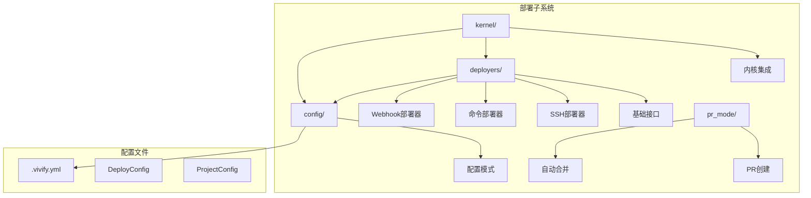
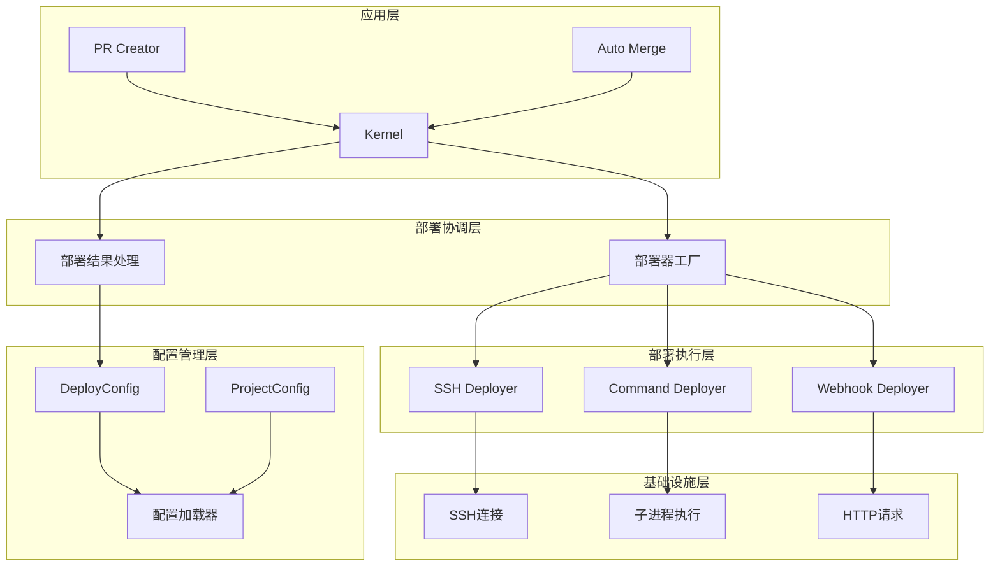
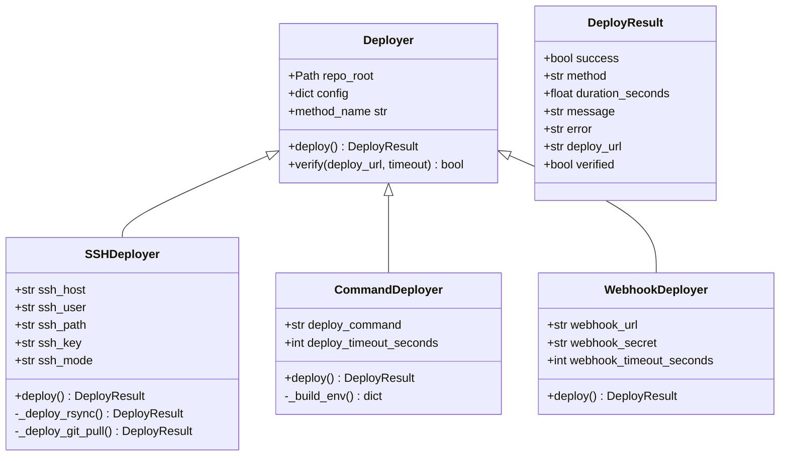
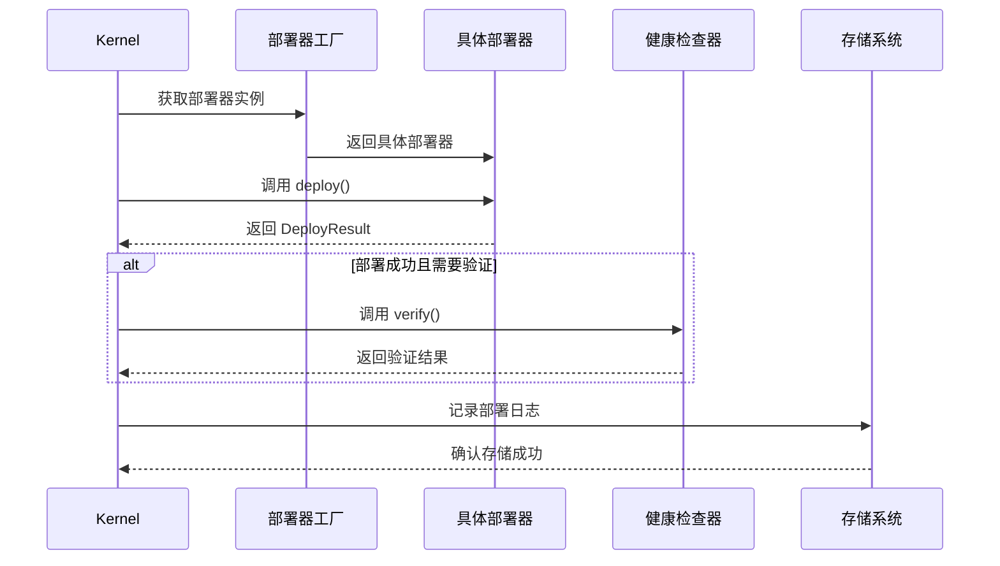
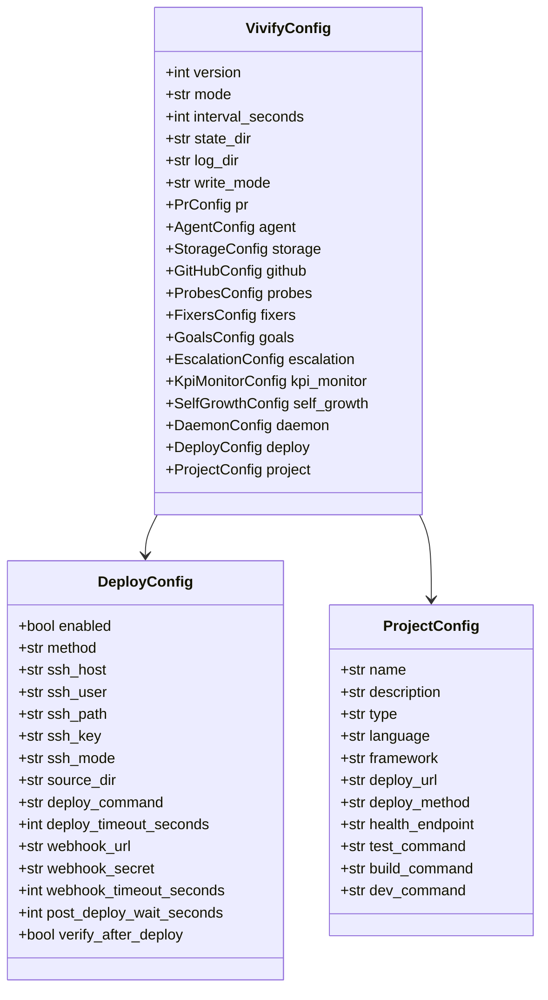
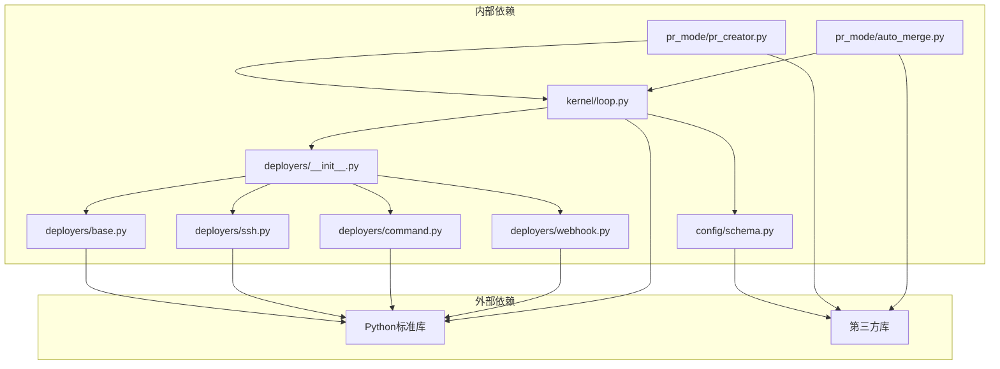

# 部署子系统

<cite>
**本文档引用的文件**
- [deployers/__init__.py](file://vivify/deployers/__init__.py)
- [deployers/base.py](file://vivify/deployers/base.py)
- [deployers/ssh.py](file://vivify/deployers/ssh.py)
- [deployers/command.py](file://vivify/deployers/command.py)
- [deployers/webhook.py](file://vivify/deployers/webhook.py)
- [config/schema.py](file://vivify/config/schema.py)
- [kernel/loop.py](file://vivify/kernel/loop.py)
- [pr_mode/pr_creator.py](file://vivify/pr_mode/pr_creator.py)
- [pr_mode/auto_merge.py](file://vivify/pr_mode/auto_merge.py)
- [cli/run_cmd.py](file://vivify/cli/run_cmd.py)
</cite>

## 更新摘要
**所做更改**
- 更新了部署器工厂系统的架构说明，反映了新的部署器映射机制
- 增强了配置管理部分，详细说明了新增的部署配置字段
- 完善了SSH部署器的双模式支持说明（rsync和git pull）
- 新增了命令部署器的环境变量管理机制
- 更新了Webhook部署器的安全认证机制
- 增强了部署结果的数据结构说明
- 完善了部署子系统与内核的集成流程

## 目录
1. [简介](#简介)
2. [项目结构](#项目结构)
3. [核心组件](#核心组件)
4. [架构概览](#架构概览)
5. [详细组件分析](#详细组件分析)
6. [依赖关系分析](#依赖关系分析)
7. [性能考虑](#性能考虑)
8. [故障排除指南](#故障排除指南)
9. [结论](#结论)

## 简介

部署子系统是 Vivify 智能自动化框架中的关键组件，负责在代码变更通过 PR 合并后自动执行部署流程。该系统提供了多种部署方式，包括 SSH/rsync、自定义命令、Webhook 通知等，确保代码能够安全、可靠地从开发环境迁移到生产环境。

部署子系统的核心价值在于：
- **自动化部署**：在 PR 合并后自动触发部署流程
- **多策略支持**：支持多种部署方式以适应不同环境需求
- **健康检查**：部署后的自动验证确保系统正常运行
- **错误处理**：完善的异常处理和日志记录机制
- **配置驱动**：基于强类型配置的灵活部署策略

## 项目结构

部署子系统主要分布在以下目录结构中：

**图表来源**
- [deployers/__init__.py:1-50](file://vivify/deployers/__init__.py#L1-L50)
- [config/schema.py:151-174](file://vivify/config/schema.py#L151-L174)

**章节来源**
- [deployers/__init__.py:1-50](file://vivify/deployers/__init__.py#L1-L50)
- [config/schema.py:151-174](file://vivify/config/schema.py#L151-L174)

## 核心组件

部署子系统包含以下核心组件：

### 部署器接口层
- **Deployer 抽象基类**：定义统一的部署接口
- **DeployResult 数据模型**：标准化部署结果格式
- **部署器工厂函数**：根据配置动态创建部署器实例

### 具体部署实现
- **SSHDeployer**：支持 rsync 和 git pull 两种模式
- **CommandDeployer**：执行自定义部署命令，支持环境变量管理
- **WebhookDeployer**：向外部服务发送部署通知，支持安全认证

### 集成组件
- **Kernel 集成**：在内核循环中协调部署流程
- **PR 模式集成**：与 PR 创建和自动合并流程协同工作
- **配置管理**：基于 Pydantic 的强类型配置系统

**章节来源**
- [deployers/base.py:21-56](file://vivify/deployers/base.py#L21-L56)
- [deployers/ssh.py:8-98](file://vivify/deployers/ssh.py#L8-L98)
- [deployers/command.py:9-78](file://vivify/deployers/command.py#L9-L78)
- [deployers/webhook.py:10-68](file://vivify/deployers/webhook.py#L10-L68)

## 架构概览

部署子系统采用分层架构设计，确保了良好的可扩展性和维护性：

**图表来源**
- [kernel/loop.py:148-153](file://vivify/kernel/loop.py#L148-L153)
- [deployers/__init__.py:27-49](file://vivify/deployers/__init__.py#L27-L49)
- [config/schema.py:151-174](file://vivify/config/schema.py#L151-L174)

## 详细组件分析

### 部署器工厂系统

部署器工厂是整个部署系统的核心协调者，负责根据配置动态选择合适的部署器：

**图表来源**
- [deployers/base.py:21-56](file://vivify/deployers/base.py#L21-L56)
- [deployers/ssh.py:8-98](file://vivify/deployers/ssh.py#L8-L98)
- [deployers/command.py:9-78](file://vivify/deployers/command.py#L9-L78)
- [deployers/webhook.py:10-68](file://vivify/deployers/webhook.py#L10-L68)

### 部署执行流程

部署执行采用统一的流程控制，确保所有部署器都遵循相同的操作模式：

**图表来源**
- [kernel/loop.py:448-487](file://vivify/kernel/loop.py#L448-L487)
- [deployers/base.py:33-51](file://vivify/deployers/base.py#L33-L51)

### 配置管理系统

部署配置采用强类型设计，确保配置的完整性和正确性：

**图表来源**
- [config/schema.py:151-174](file://vivify/config/schema.py#L151-L174)
- [config/schema.py:176-190](file://vivify/config/schema.py#L176-L190)
- [config/schema.py:197-220](file://vivify/config/schema.py#L197-L220)

**章节来源**
- [deployers/__init__.py:19-49](file://vivify/deployers/__init__.py#L19-L49)
- [kernel/loop.py:148-153](file://vivify/kernel/loop.py#L148-L153)
- [config/schema.py:151-174](file://vivify/config/schema.py#L151-L174)

## 依赖关系分析

部署子系统与其他模块的依赖关系如下：

**图表来源**
- [deployers/__init__.py:5-8](file://vivify/deployers/__init__.py#L5-L8)
- [kernel/loop.py:61](file://vivify/kernel/loop.py#L61)

### 关键依赖特性

1. **低耦合设计**：部署器通过统一接口与内核交互
2. **可扩展性**：新的部署方式只需实现 Deployer 接口
3. **配置驱动**：通过配置文件控制部署行为
4. **错误隔离**：每个部署器独立处理自己的异常

**章节来源**
- [deployers/base.py:21-31](file://vivify/deployers/base.py#L21-L31)
- [kernel/loop.py:148-153](file://vivify/kernel/loop.py#L148-L153)

## 性能考虑

部署子系统在设计时充分考虑了性能优化：

### 并发处理
- **异步部署**：部署操作在独立线程中执行
- **超时控制**：为所有外部操作设置合理的超时时间
- **资源限制**：限制同时进行的部署数量

### 资源管理
- **连接池**：SSH 连接复用减少建立连接的开销
- **缓存机制**：部署结果缓存避免重复部署
- **内存优化**：及时清理临时文件和大对象

### 监控指标
- **执行时间统计**：精确记录每个部署步骤的耗时
- **成功率监控**：跟踪部署成功率和失败原因
- **资源使用监控**：监控 CPU、内存和网络使用情况

## 故障排除指南

### 常见问题及解决方案

#### SSH 部署问题
- **连接超时**：检查网络连通性和 SSH 密钥配置
- **权限拒绝**：验证 SSH 用户权限和目标目录权限
- **rsync 失败**：检查源目录路径和目标目录权限

#### 命令部署问题
- **命令执行失败**：检查部署命令的语法和参数
- **环境变量缺失**：确认环境变量文件的格式和内容
- **超时问题**：调整部署超时时间或优化部署脚本

#### Webhook 部署问题
- **HTTP 错误**：检查 webhook URL 和认证信息
- **网络问题**：验证网络连通性和防火墙设置
- **认证失败**：确认 webhook secret 的正确性

### 日志分析

部署系统提供详细的日志记录，包括：
- **部署开始和结束时间**
- **部署结果状态**
- **错误详情和堆栈跟踪**
- **性能指标和资源使用情况**

**章节来源**
- [deployers/ssh.py:32-44](file://vivify/deployers/ssh.py#L32-L44)
- [deployers/command.py:53-64](file://vivify/deployers/command.py#L53-L64)
- [deployers/webhook.py:62-67](file://vivify/deployers/webhook.py#L62-L67)

## 结论

部署子系统通过其模块化设计和强大的配置管理，为 Vivify 框架提供了灵活而可靠的自动化部署能力。系统的主要优势包括：

1. **多策略支持**：支持多种部署方式以适应不同的部署需求
2. **统一接口**：所有部署器都遵循相同的接口规范
3. **健壮性**：完善的错误处理和恢复机制
4. **可观测性**：全面的日志记录和监控功能
5. **可扩展性**：易于添加新的部署方式和集成新功能

该系统为代码从开发到生产的自动化流程提供了坚实的基础，确保了软件交付的质量和效率。通过持续的优化和改进，部署子系统将继续为 Vivify 框架的功能增强提供重要支撑。