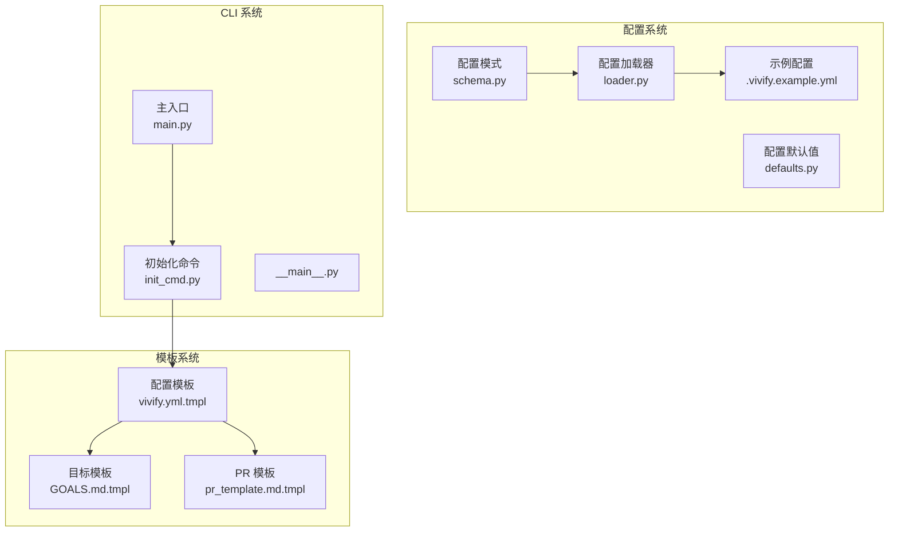
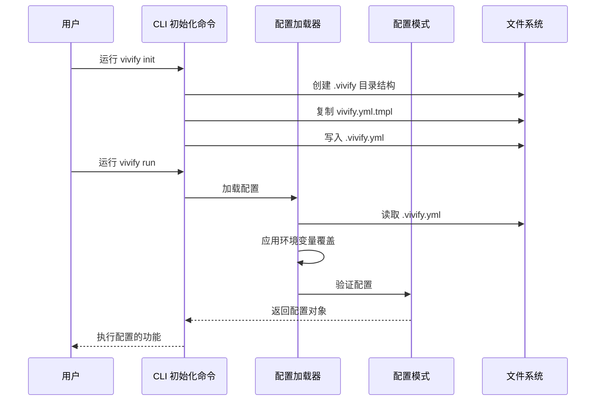
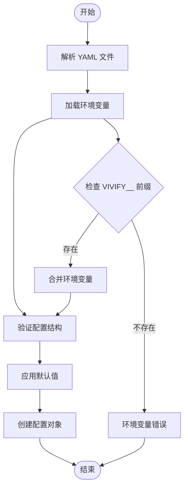
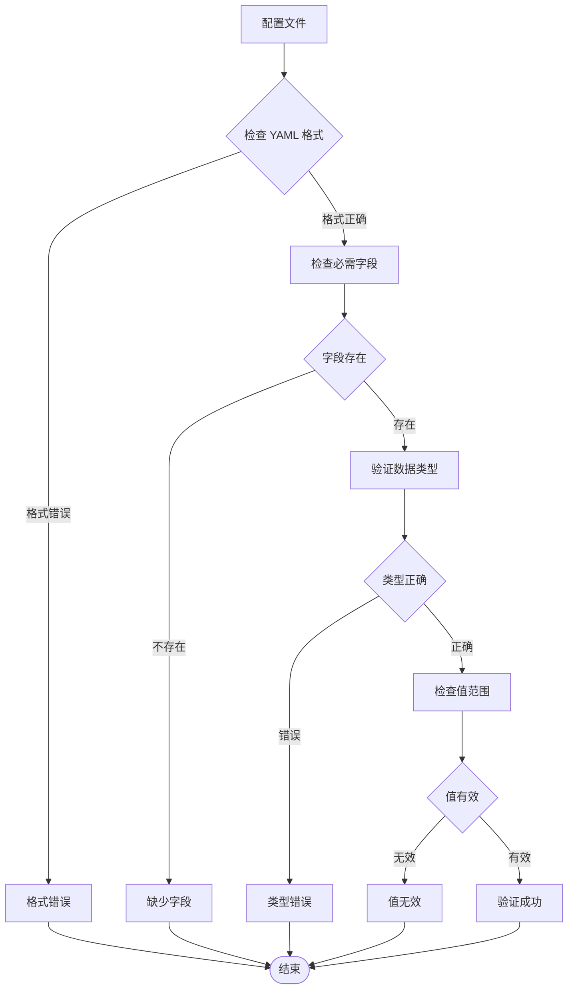
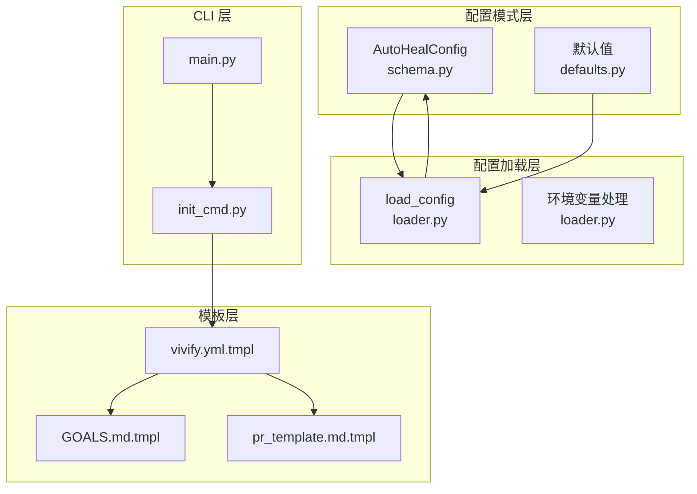
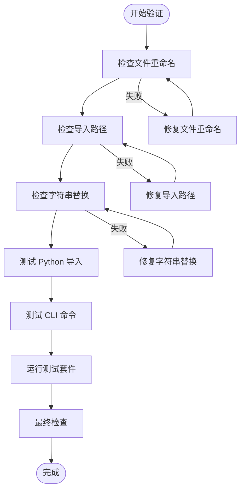

# .vivify.yml 配置模板

<cite>
**本文档引用的文件**
- [00_READ_ME_FIRST.txt](file://00_READ_ME_FIRST.txt)
- [QUICK_REFERENCE.md](file://QUICK_REFERENCE.md)
- [REBRANDING_SUMMARY.md](file://REBRANDING_SUMMARY.md)
- [detailed_references.md](file://detailed_references.md)
- [rebranding_analysis.md](file://rebranding_analysis.md)
</cite>

## 目录
1. [简介](#简介)
2. [项目结构](#项目结构)
3. [核心组件](#核心组件)
4. [架构概览](#架构概览)
5. [详细组件分析](#详细组件分析)
6. [依赖关系分析](#依赖关系分析)
7. [性能考虑](#性能考虑)
8. [故障排除指南](#故障排除指南)
9. [结论](#结论)
10. [附录](#附录)

## 简介

本文档详细说明了从 `.auto-heal.yml` 到 `.vivify.yml` 配置模板文件的更新过程。这是一个品牌重塑项目的一部分，涉及将项目名称从 "auto-heal" 更改为 "vivify"。该更新包括配置文件结构、默认路径设置、分支前缀和标签配置的修改。

根据项目调研报告，这次改造涉及 477 处 grep 匹配，需要更新 50+ 个文件，包括核心配置文件、CLI 文件、核心模块、测试文件和文档文件。

## 项目结构

项目采用模块化的架构设计，主要包含以下关键组件：

**图表来源**
- [rebranding_analysis.md:203-239](file://rebranding_analysis.md#L203-L239)
- [rebranding_analysis.md:283-352](file://rebranding_analysis.md#L283-L352)

**章节来源**
- [00_READ_ME_FIRST.txt:14-37](file://00_READ_ME_FIRST.txt#L14-L37)
- [REBRANDING_SUMMARY.md:108-143](file://REBRANDING_SUMMARY.md#L108-L143)

## 核心组件

### 配置模式 (schema.py)

配置模式定义了 `.vivify.yml` 文件的结构和默认值。主要改动包括：

- **分支前缀**: 从 `"auto-heal/"` 更新为 `"vivify/"`
- **标签配置**: 从 `["auto-heal"]` 更新为 `["vivify"]`
- **状态数据库路径**: 从 `".auto-heal/state.db"` 更新为 `".vivify/state.db"`
- **用户探针目录**: 从 `".auto-heal/probes"` 更新为 `".vivify/probes"`
- **用户修复器目录**: 从 `".auto-heal/fixers"` 更新为 `".vivify/fixers"`
- **允许路径**: 更新所有包含 `auto_heal/` 的路径为 `vivify/`
- **状态目录**: 从 `".auto-heal"` 更新为 `".vivify"`
- **日志目录**: 从 `".auto-heal/logs"` 更新为 `".vivify/logs"`

**章节来源**
- [rebranding_analysis.md:209-239](file://rebranding_analysis.md#L209-L239)
- [detailed_references.md:55-66](file://detailed_references.md#L55-L66)

### 配置加载器 (loader.py)

配置加载器负责加载 `.vivify.yml` 文件并应用环境变量覆盖。关键改动包括：

- **环境变量前缀**: 从 `"AUTO_HEAL__"` 更新为 `"VIVIFY__"`
- **默认配置文件**: 从 `Path(".auto-heal.yml")` 更新为 `Path(".vivify.yml")`
- **错误消息**: 更新所有 `.auto-heal.yml` 为 `.vivify.yml`

**章节来源**
- [rebranding_analysis.md:354-361](file://rebranding_analysis.md#L354-L361)
- [detailed_references.md:85-93](file://detailed_references.md#L85-L93)

### 初始化命令 (init_cmd.py)

初始化命令负责生成新的 `.vivify.yml` 配置文件和相关目录结构。主要改动：

- **模板导入**: 从 `files("auto_heal.templates")` 更新为 `files("vivify.templates")`
- **目录路径**: 所有 `.auto-heal` 路径更新为 `.vivify`
- **文件名**: `.auto-heal.yml` 更新为 `.vivify.yml`
- **模板文件**: `"auto-heal.yml.tmpl"` 更新为 `"vivify.yml.tmpl"`

**章节来源**
- [rebranding_analysis.md:568-580](file://rebranding_analysis.md#L568-L580)
- [detailed_references.md:122-137](file://detailed_references.md#L122-L137)

## 架构概览

配置系统的整体架构如下：

**图表来源**
- [rebranding_analysis.md:478-566](file://rebranding_analysis.md#L478-L566)
- [rebranding_analysis.md:288-352](file://rebranding_analysis.md#L288-L352)

## 详细组件分析

### 配置文件结构

`.vivify.yml` 配置文件包含以下主要部分：

**图表来源**
- [rebranding_analysis.md:331-348](file://rebranding_analysis.md#L331-L348)

### 配置字段更新对照表

| 字段类别 | 原始值 | 更新后值 | 位置 |
|---------|--------|----------|------|
| **基础配置** | `state_dir: .auto-heal` | `state_dir: .vivify` | schema.py, loader.py |
| **日志配置** | `log_dir: .auto-heal/logs` | `log_dir: .vivify/logs` | schema.py, loader.py |
| **分支前缀** | `branch_prefix: auto-heal/` | `branch_prefix: vivify/` | schema.py |
| **标签配置** | `labels: ["auto-heal"]` | `labels: ["vivify"]` | schema.py |
| **状态数据库** | `path: .auto-heal/state.db` | `path: .vivify/state.db` | schema.py |
| **用户探针目录** | `.auto-heal/probes` | `.vivify/probes` | schema.py |
| **用户修复器目录** | `.auto-heal/fixers` | `.vivify/fixers` | schema.py |
| **环境变量前缀** | `AUTO_HEAL__` | `VIVIFY__` | loader.py |
| **配置文件名** | `.auto-heal.yml` | `.vivify.yml` | loader.py |

**章节来源**
- [detailed_references.md:100-111](file://detailed_references.md#L100-L111)
- [detailed_references.md:144-152](file://detailed_references.md#L144-L152)

### 配置验证流程

配置验证采用多层次检查机制：

**图表来源**
- [rebranding_analysis.md:345-347](file://rebranding_analysis.md#L345-L347)

**章节来源**
- [QUICK_REFERENCE.md:181-210](file://QUICK_REFERENCE.md#L181-L210)

## 依赖关系分析

配置系统各组件之间的依赖关系：

**图表来源**
- [rebranding_analysis.md:203-239](file://rebranding_analysis.md#L203-L239)
- [rebranding_analysis.md:478-566](file://rebranding_analysis.md#L478-L566)

**章节来源**
- [REBRANDING_SUMMARY.md:131-143](file://REBRANDING_SUMMARY.md#L131-L143)

## 性能考虑

配置加载的性能优化策略：

1. **延迟加载**: 配置文件只在需要时加载
2. **缓存机制**: 已加载的配置会被缓存避免重复解析
3. **增量验证**: 仅验证修改过的配置字段
4. **环境变量优化**: 使用前缀匹配快速过滤相关环境变量

## 故障排除指南

### 常见配置错误及解决方案

| 错误类型 | 症状 | 原因 | 解决方案 |
|---------|------|------|----------|
| **配置文件格式错误** | `ValueError: .vivify.yml must contain a YAML mapping at the root` | YAML 格式不正确 | 检查 YAML 缩进和语法 |
| **环境变量前缀错误** | `VIVIFY__ env not found` | 环境变量前缀仍为 `AUTO_HEAL__` | 更新环境变量前缀为 `VIVIFY__` |
| **路径配置错误** | `.vivify/state.db not found` | 路径仍指向 `.auto-heal` | 更新所有 `.auto-heal` 路径为 `.vivify` |
| **标签配置错误** | PR 标签显示 `auto-heal` | 标签仍为旧值 | 更新 `labels` 字段为 `["vivify"]` |
| **分支前缀错误** | PR 分支名为 `auto-heal/fix-123` | 分支前缀仍为 `auto-heal/` | 更新 `branch_prefix` 为 `vivify/` |

### 验证步骤

**图表来源**
- [QUICK_REFERENCE.md:181-210](file://QUICK_REFERENCE.md#L181-L210)

**章节来源**
- [QUICK_REFERENCE.md:214-224](file://QUICK_REFERENCE.md#L214-L224)

## 结论

本次 `.vivify.yml` 配置模板更新涉及 477 处代码改动，主要集中在以下几个方面：

1. **配置文件重命名**: 从 `.auto-heal.yml` 到 `.vivify.yml`
2. **路径更新**: 所有 `.auto-heal` 路径更新为 `.vivify`
3. **环境变量前缀**: 从 `AUTO_HEAL__` 更新为 `VIVIFY__`
4. **标签和分支前缀**: 从 `auto-heal` 更新为 `vivify`
5. **模板文件更新**: 相关模板文件的名称和内容更新

这次更新确保了项目的完全品牌重塑，同时保持了所有功能的完整性。建议按照文档中提供的验证清单进行全面测试，确保所有改动都正确应用。

## 附录

### 最佳实践建议

1. **逐步验证**: 按照验证清单逐步检查每个改动
2. **备份策略**: 在进行大规模替换前创建项目备份
3. **测试覆盖**: 运行完整的测试套件确保功能正常
4. **文档同步**: 更新所有相关文档和注释
5. **环境测试**: 在开发环境中充分测试后再部署

### 相关资源

- **项目路径**: `/Users/chongshan/project/chongshan/auto-heal/`
- **详细分析**: `rebranding_analysis.md` (965 行)
- **引用映射**: `detailed_references.md` (精细化行号表)