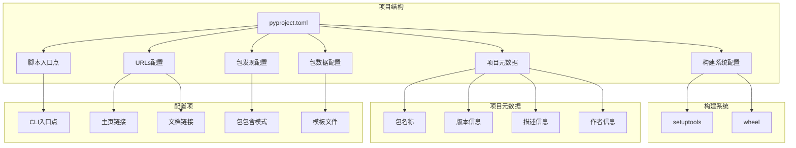
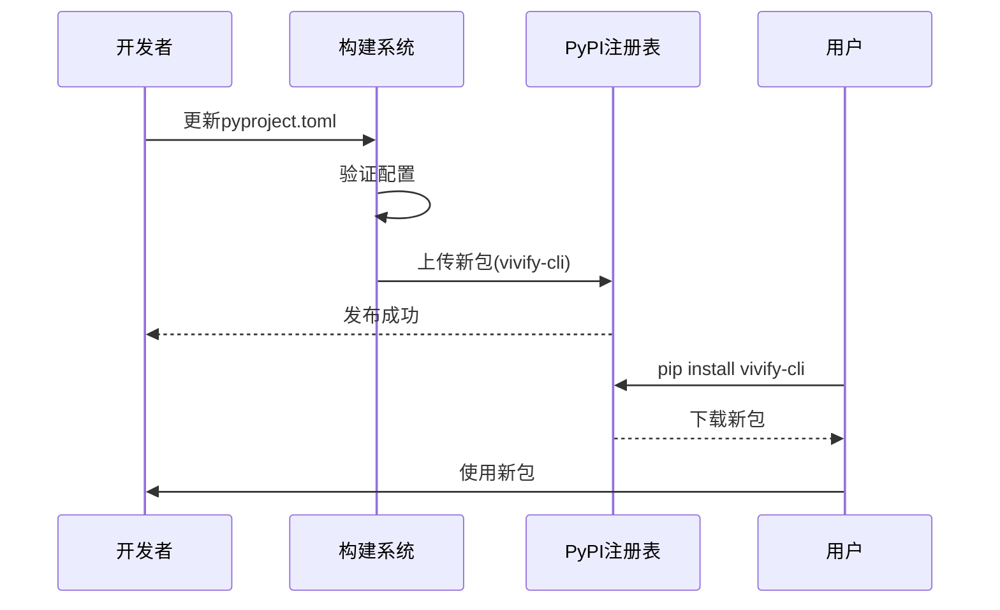
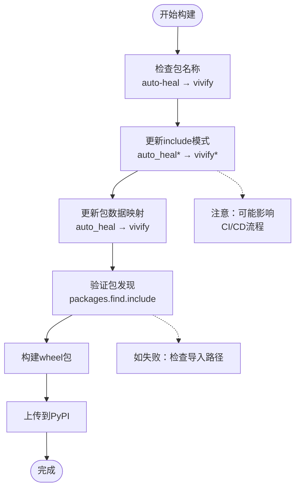
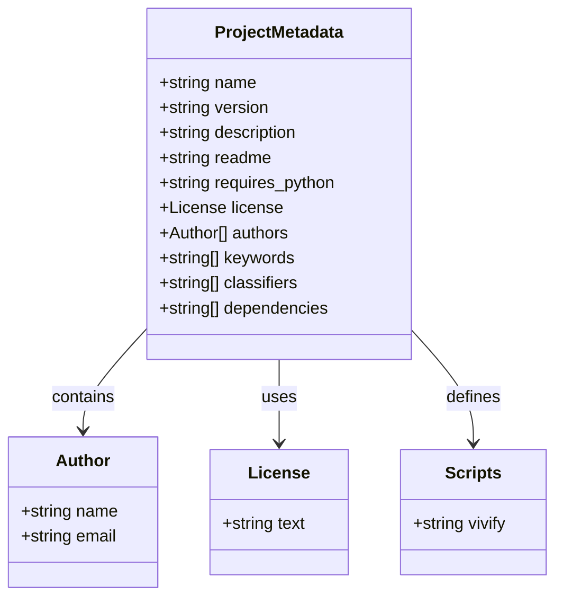
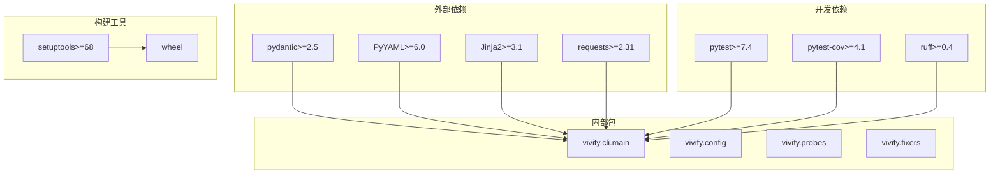

# pyproject.toml 配置更新

<cite>
**本文档引用的文件**
- [pyproject.toml](file://pyproject.toml)
- [QUICK_REFERENCE.md](file://QUICK_REFERENCE.md)
- [REBRANDING_SUMMARY.md](file://REBRANDING_SUMMARY.md)
- [detailed_references.md](file://detailed_references.md)
- [rebranding_analysis.md](file://rebranding_analysis.md)
</cite>

## 目录
1. [简介](#简介)
2. [项目结构概览](#项目结构概览)
3. [核心配置字段更新](#核心配置字段更新)
4. [架构更新分析](#架构更新分析)
5. [详细配置分析](#详细配置分析)
6. [依赖关系分析](#依赖关系分析)
7. [性能考虑](#性能考虑)
8. [故障排除指南](#故障排除指南)
9. [结论](#结论)
10. [附录](#附录)

## 简介

本文档提供了 pyproject.toml 配置文件更新的详细技术指导，涵盖从 "auto-heal" 到 "vivify" 品牌重塑过程中的配置变更。该更新涉及包名称、作者信息、CLI 入口点、主页链接、文档链接和包包含模式等多个关键字段的修改。

本次改造是一个完整的品牌重塑项目的一部分，涉及约 477 处 grep 匹配的改动，包括文件/目录重命名、导入路径更新、字符串替换等操作。

## 项目结构概览

基于调研报告，项目采用标准的 Python 包结构，使用 setuptools 作为构建系统：



**图表来源**
- [pyproject.toml:38-103](file://pyproject.toml#L38-L103)

**章节来源**
- [REBRANDING_SUMMARY.md:33-104](file://REBRANDING_SUMMARY.md#L33-L104)

## 核心配置字段更新

### 包名称更新

这是最重要的配置变更，涉及多个字段的更新：

| 字段位置 | 当前值 | 更新后值 | 说明 |
|---------|--------|----------|------|
| Line 6 | `"auto-heal-cli"` | `"vivify-cli"` 或 `"vivify"` | PyPI 包名 |
| Line 12 | `"auto-heal contributors"` | `"vivify contributors"` | 作者字段 |
| Line 37 | `auto-heal = "auto_heal.cli.main:cli"` | `vivify = "vivify.cli.main:cli"` | CLI 入口点 |
| Line 40 | `Homepage` URL | 新的 GitHub 仓库 URL | GitHub 主页 |
| Line 41 | `Documentation` URL | 新的文档 URL | 文档地址 |
| Line 47 | `include = ["auto_heal*"]` | `include = ["vivify*"]` | 包包含模式 |
| Line 51 | `auto_heal = [...]` | `vivify = [...]` | 包数据映射 |

### 更新后的配置示例

```toml
[build-system]
requires = ["setuptools>=68", "wheel"]
build-backend = "setuptools.build_meta"

[project]
name = "vivify-cli"
version = "0.1.0"
description = "Self-growing intelligent extension that mounts to any GitHub repo: monitors health, fixes issues, decomposes goals into features, and iterates with Qoder CLI via PR mode."
readme = "README.md"
requires-python = ">=3.10"
license = { text = "MIT" }
authors = [{ name = "vivify contributors" }]
keywords = ["self-healing", "ai-agent", "qodercli", "github", "automation", "self-growth"]
classifiers = [
    "Development Status :: 3 - Alpha",
    "License :: OSI Approved :: MIT License",
    "Programming Language :: Python :: 3.10",
    "Programming Language :: Python :: 3.11",
    "Programming Language :: Python :: 3.12",
    "Topic :: Software Development :: Quality Assurance",
]
dependencies = [
    "pydantic>=2.5",
    "PyYAML>=6.0",
    "Jinja2>=3.1",
    "requests>=2.31",
]

[project.optional-dependencies]
dev = [
    "pytest>=7.4",
    "pytest-cov>=4.1",
    "ruff>=0.4",
]

[project.scripts]
vivify = "vivify.cli.main:cli"

[project.urls]
Homepage = "https://github.com/vivify/vivify"
Documentation = "https://github.com/vivify/vivify/tree/main/docs"

[tool.setuptools]
include-package-data = true

[tool.setuptools.packages.find]
include = ["vivify*"]
exclude = ["tests*"]

[tool.setuptools.package-data]
vivify = [
    "probes/builtin/*.yml",
    "storage/migrations/*.sql",
    "agents/prompts/templates/*.j2",
    "templates/*.tmpl",
    "templates/probes/*",
]

[tool.ruff]
line-length = 110
target-version = "py310"

[tool.pytest.ini_options]
testpaths = ["tests"]
filterwarnings = ["ignore::DeprecationWarning"]
```

**章节来源**
- [detailed_references.md:21-30](file://detailed_references.md#L21-L30)
- [rebranding_analysis.md:105-113](file://rebranding_analysis.md#L105-L113)

## 架构更新分析

### 发布流程影响

PyPI 包名变更对发布流程产生以下影响：



**图表来源**
- [pyproject.toml:42-75](file://pyproject.toml#L42-L75)

### 包发现机制更新

包包含模式从 `auto_heal*` 更新为 `vivify*`，影响包发现和打包过程：



**图表来源**
- [pyproject.toml:83-94](file://pyproject.toml#L83-L94)

**章节来源**
- [REBRANDING_SUMMARY.md:176-185](file://REBRANDING_SUMMARY.md#L176-L185)

## 详细配置分析

### 构建系统配置

构建系统保持不变，继续使用 setuptools 和 wheel：

- **requires**: 保持 `["setuptools>=68", "wheel"]`
- **build-backend**: 保持 `"setuptools.build_meta"`

### 项目元数据更新

项目元数据中的关键字段更新：



**图表来源**
- [pyproject.toml:42-64](file://pyproject.toml#L42-L64)

### CLI 入口点配置

CLI 入口点从 `auto-heal` 更新为 `vivify`：

- **当前**: `auto-heal = "auto_heal.cli.main:cli"`
- **更新后**: `vivify = "vivify.cli.main:cli"`

这直接影响用户使用方式：
- **旧命令**: `auto-heal --help`
- **新命令**: `vivify --help`

### URL 配置更新

主页和文档链接更新为新的 GitHub 仓库：

- **Homepage**: `"https://github.com/vivify/vivify"`
- **Documentation**: `"https://github.com/vivify/vivify/tree/main/docs"`

### 包发现和数据配置

包发现配置从 `auto_heal` 更新为 `vivify`：

```mermaid
graph LR
subgraph "包发现配置"
A[packages.find] --> B[include = ["vivify*"]]
A --> C[exclude = ["tests*"]]
end
subgraph "包数据配置"
D[package-data] --> E[vivify = [...]]
end
B --> F[模板文件]
C --> G[测试文件]
E --> H[探针模板]
E --> I[存储迁移]
E --> J[代理提示]
E --> K[配置模板]
```

**图表来源**
- [pyproject.toml:83-94](file://pyproject.toml#L83-L94)

**章节来源**
- [rebranding_analysis.md:33-103](file://rebranding_analysis.md#L33-L103)

## 依赖关系分析

### 内部依赖关系



**图表来源**
- [pyproject.toml:59-71](file://pyproject.toml#L59-L71)

### 依赖更新策略

依赖关系保持稳定，但需要确保与新的包结构兼容：

1. **核心依赖**: 保持不变，确保功能完整性
2. **开发工具**: 保持不变，确保开发体验
3. **构建工具**: 保持不变，确保构建稳定性

**章节来源**
- [detailed_references.md:17-30](file://detailed_references.md#L17-L30)

## 性能考虑

### 构建性能

- **包大小**: 从 `auto_heal*` 到 `vivify*` 的包包含模式变化不会显著影响包大小
- **构建时间**: 依赖关系保持不变，构建时间基本稳定
- **安装速度**: PyPI 包名变更不影响安装性能

### 运行时性能

- **导入性能**: 包重命名后，Python 导入路径需要相应更新
- **启动时间**: CLI 入口点从 `auto-heal` 更新为 `vivify`，启动时间无明显变化
- **内存使用**: 配置更新不影响内存使用模式

## 故障排除指南

### 常见配置错误

| 错误类型 | 症状 | 解决方案 |
|---------|------|---------|
| 包名错误 | `ModuleNotFoundError: No module named 'vivify'` | 确认包名称已更新为 `"vivify-cli"` |
| CLI 无法找到 | `vivify: command not found` | 检查 `project.scripts` 中的入口点配置 |
| 包包含错误 | `ImportError: cannot import name 'cli'` | 验证 `packages.find.include = ["vivify*"]` |
| URL 链接错误 | 访问主页/文档失败 | 确认 `project.urls` 中的 URL 已更新 |

### 验证方法

```bash
# 验证包名称更新
python3 -c "import vivify; print('包导入成功')"

# 验证 CLI 入口点
python3 -m vivify --help

# 验证包包含模式
python3 -c "import pkgutil; print([name for _, name, _ in pkgutil.iter_modules(['vivify'])])"

# 验证配置加载
python3 -c "from vivify.config import load_config; print('配置加载成功')"
```

### 配置验证清单

1. **包名称验证**: `name = "vivify-cli"` ✅
2. **作者信息验证**: `authors = [{ name = "vivify contributors" }]` ✅
3. **CLI 入口点验证**: `vivify = "vivify.cli.main:cli"` ✅
4. **主页链接验证**: `Homepage = "https://github.com/vivify/vivify"` ✅
5. **文档链接验证**: `Documentation = "https://github.com/vivify/vivify/tree/main/docs"` ✅
6. **包包含模式验证**: `include = ["vivify*"]` ✅
7. **包数据映射验证**: `vivify = [...]` ✅

**章节来源**
- [QUICK_REFERENCE.md:214-223](file://QUICK_REFERENCE.md#L214-L223)
- [REBRANDING_SUMMARY.md:261-275](file://REBRANDING_SUMMARY.md#L261-L275)

## 结论

pyproject.toml 配置更新是品牌重塑项目的重要组成部分，涉及包名称、作者信息、CLI 入口点、主页链接、文档链接和包包含模式等多个关键字段的修改。这次更新确保了项目的完整性和一致性，同时保持了原有的功能特性和依赖关系。

关键更新要点：
- 包名称从 `"auto-heal-cli"` 更新为 `"vivify-cli"`
- CLI 入口点从 `auto-heal` 更新为 `vivify`
- 包包含模式从 `auto_heal*` 更新为 `vivify*`
- URL 链接更新为新的 GitHub 仓库地址
- 作者信息更新为新的贡献者团队

这些变更确保了项目在 PyPI 上的正确发布和用户使用体验，同时保持了项目的功能完整性和开发效率。

## 附录

### 完整配置对比表

| 配置项 | auto-heal | vivify |
|-------|-----------|--------|
| name | `"auto-heal-cli"` | `"vivify-cli"` |
| authors | `"auto-heal contributors"` | `"vivify contributors"` |
| scripts.auto-heal | `"auto_heal.cli.main:cli"` | `"vivify.cli.main:cli"` |
| urls.Homepage | `"https://github.com/auto-heal/auto-heal"` | `"https://github.com/vivify/vivify"` |
| urls.Documentation | `"https://github.com/auto-heal/auto-heal/tree/main/docs"` | `"https://github.com/vivify/vivify/tree/main/docs"` |
| packages.find.include | `"auto_heal*"` | `"vivify*"` |
| package-data.auto_heal | `["probes/builtin/*.yml", ...]` | `["probes/builtin/*.yml", ...]` |

### 最佳实践建议

1. **渐进式更新**: 先更新配置，再更新代码中的导入路径
2. **版本控制**: 在 Git 中保留更新前的备份
3. **测试验证**: 更新后运行完整的测试套件
4. **文档同步**: 更新相关的文档和示例代码
5. **CI/CD 集成**: 确保持续集成流程适应新的包名称